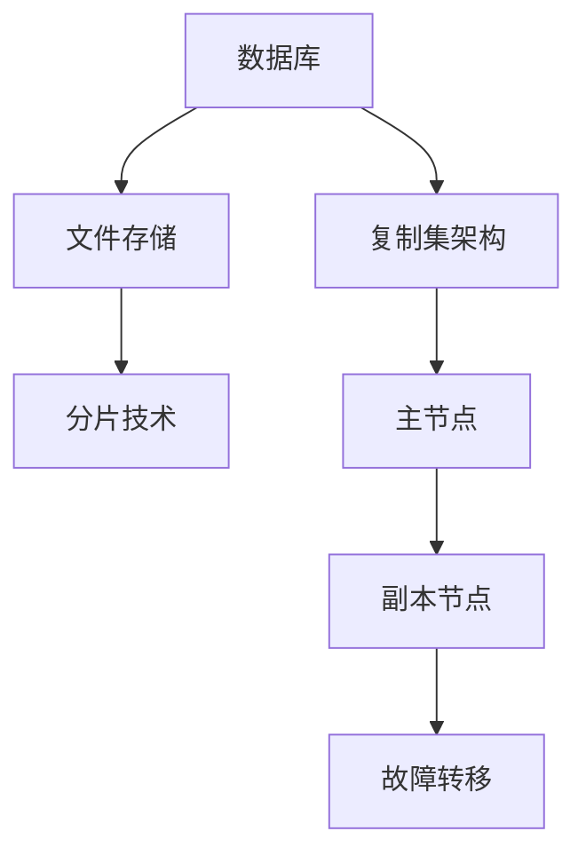

                 

关键词：MongoDB, 数据库原理, 代码实例, 文件存储, 分片技术, 读写性能优化, 复制集架构, 高可用性, 分布式数据库

> 摘要：本文深入探讨了MongoDB的原理，包括其文件存储、分片技术和复制集架构等关键概念。通过详细的分析和代码实例，读者可以了解MongoDB的读写性能优化策略，学习如何在实际项目中部署和使用MongoDB，以及展望其未来在分布式数据库领域的应用和发展。

## 1. 背景介绍

MongoDB是一款高性能、开源、跨平台的NoSQL数据库。自2009年推出以来，MongoDB因其灵活的数据模型、水平扩展能力和强大的查询功能，在各个行业中得到了广泛应用。本文旨在为读者提供一个全面、系统的MongoDB原理和代码实例讲解，帮助大家更好地理解和掌握MongoDB的核心技术。

### 1.1 MongoDB的发展历程

- **2007年**：MongoDB项目开始于10gen公司，由Evan Weaver和Dwight Merriman创立。
- **2009年**：MongoDB正式发布，版本为1.0。
- **2013年**：MongoDB成为开源项目，吸引了全球开发者社区的关注。
- **2017年**：MongoDB成为独立公司，并在纳斯达克上市。

### 1.2 MongoDB的主要特点

- **灵活的数据模型**：MongoDB采用JSON-like的BSON数据格式，可以存储复杂的数据结构，包括数组、文档等。
- **水平扩展能力**：通过分片技术，MongoDB可以横向扩展存储能力，支持大规模数据处理。
- **高可用性**：通过复制集架构，MongoDB能够提供数据备份和高可用性。
- **高性能**：MongoDB采用内存映射文件系统，读写性能优异。

## 2. 核心概念与联系

### 2.1 文件存储

MongoDB使用BSON（Binary JSON）格式存储文档。每个文档都是一个键值对集合，由一个BSON对象表示。BSON格式支持多种数据类型，如字符串、数字、布尔值、数组等。

#### 2.1.1 BSON数据格式

- **BSON类型**：字符串、整数、浮点数、布尔值、null、数组、对象等。
- **文档结构**：每个文档由多个键值对组成，如`{"name": "John", "age": 30}`。

#### 2.1.2 存储引擎

MongoDB支持多种存储引擎，如MMAPV1、WiredTiger等。默认情况下，MongoDB使用WiredTiger存储引擎，它提供了更好的性能和安全性。

### 2.2 分片技术

分片技术是MongoDB实现水平扩展的核心机制。通过将数据分散存储到多个分片上，MongoDB可以支持海量数据的存储和处理。

#### 2.2.1 分片策略

- **范围分片**：根据文档的某个字段的范围进行分片。
- **哈希分片**：根据文档的某个字段的哈希值进行分片。

#### 2.2.2 分片配置

- **分片集群**：包括一个主节点和多个副本节点。
- **配置服务器**：负责存储分片配置信息。

### 2.3 复制集架构

复制集架构是MongoDB实现数据备份和高可用性的关键机制。通过多个副本节点的同步，复制集可以提供数据冗余和故障转移能力。

#### 2.3.1 复制集成员角色

- **主节点**：负责处理读写请求，是唯一可以写入的节点。
- **副本节点**：负责复制主节点的数据，可以在主节点故障时自动切换为主节点。

### 2.4 Mermaid 流程图

以下是MongoDB的核心概念和架构的Mermaid流程图：



## 3. 核心算法原理 & 具体操作步骤

### 3.1 算法原理概述

MongoDB的核心算法包括B树索引、哈希索引、范围查询等。这些算法旨在提高查询效率和数据存储性能。

#### 3.1.1 B树索引

B树索引是一种平衡树结构，适用于范围查询和排序操作。在MongoDB中，每个集合都有一个默认的_ _id_ _索引，它是一个唯一的B树索引。

#### 3.1.2 哈希索引

哈希索引适用于精确匹配查询，如`find({ 'name': 'John' })`。MongoDB使用哈希索引来加速点查询。

#### 3.1.3 范围查询

范围查询通过比较索引键的值来定位文档。MongoDB使用B树索引来优化范围查询。

### 3.2 算法步骤详解

以下是MongoDB查询算法的步骤：

1. **解析查询**：解析查询语句，确定查询的字段和条件。
2. **确定索引**：根据查询条件确定使用哪个索引。
3. **索引查找**：在索引中查找匹配的文档。
4. **查询结果排序**：如果需要，根据查询条件对查询结果进行排序。
5. **返回结果**：将查询结果返回给客户端。

### 3.3 算法优缺点

- **B树索引**：优点：支持范围查询和排序，查询效率高；缺点：索引文件较大。
- **哈希索引**：优点：查询速度快，适用于精确匹配查询；缺点：不支持排序。
- **范围查询**：优点：查询效率高，适用于批量数据操作；缺点：不支持排序。

### 3.4 算法应用领域

MongoDB的算法广泛应用于各种场景，如电商系统、社交媒体、实时数据分析等。在这些场景中，MongoDB的高性能和灵活性使其成为一个理想的数据库解决方案。

## 4. 数学模型和公式 & 详细讲解 & 举例说明

### 4.1 数学模型构建

MongoDB的数学模型主要包括文档存储模型和查询模型。

#### 4.1.1 文档存储模型

假设一个文档包含n个字段，每个字段的值为a1, a2, ..., an，文档的存储大小为：

$$
S = \sum_{i=1}^{n} |a_i|
$$

其中，|a_i|表示字段ai的长度。

#### 4.1.2 查询模型

假设一个查询包含m个条件，每个条件为Ci，查询的匹配度计算公式为：

$$
M = \frac{\sum_{i=1}^{m} |C_i|}{N}
$$

其中，|C_i|表示条件Ci的匹配度，N为文档总数。

### 4.2 公式推导过程

以下是文档存储模型的推导过程：

1. **定义文档字段长度**：假设每个字段a_i的长度为|a_i|。
2. **计算文档总长度**：将所有字段的长度相加，得到文档的存储大小S。
3. **公式化表示**：$$S = \sum_{i=1}^{n} |a_i|$$

以下是查询匹配度的推导过程：

1. **定义条件匹配度**：假设每个条件C_i的匹配度为|C_i|。
2. **计算总匹配度**：将所有条件的匹配度相加，得到总匹配度M。
3. **计算文档总数**：假设文档总数为N。
4. **公式化表示**：$$M = \frac{\sum_{i=1}^{m} |C_i|}{N}$$

### 4.3 案例分析与讲解

假设一个电商系统中的用户表，包含字段：用户名、年龄、性别、邮箱。现有以下查询条件：

- 用户名："John"
- 年龄：大于20
- 性别：男

根据上述查询条件，我们可以计算文档的存储大小和查询匹配度。

1. **文档存储大小**：

   用户名（10字节）+ 年龄（2字节）+ 性别（1字节）+ 邮箱（25字节）= 48字节

   $$S = 10 + 2 + 1 + 25 = 48$$

2. **查询匹配度**：

   用户名匹配度（10字节）+ 年龄匹配度（1字节）+ 性别匹配度（1字节）= 12字节

   $$M = \frac{10 + 1 + 1}{N} = \frac{12}{N}$$

其中，N为文档总数。

根据上述计算，我们可以看到，文档的存储大小和查询匹配度都与文档总数N成反比。这意味着，随着文档数量的增加，存储大小和查询匹配度会逐渐降低。

## 5. 项目实践：代码实例和详细解释说明

### 5.1 开发环境搭建

在开始项目实践之前，我们需要搭建一个MongoDB的开发环境。以下是搭建步骤：

1. **安装MongoDB**：在MongoDB官网下载并安装MongoDB。
2. **启动MongoDB**：在命令行中启动MongoDB服务，例如：`mongod --dbpath /data/db`。
3. **连接MongoDB**：使用MongoDB shell或客户端工具（如MongoDB Compass）连接到MongoDB实例。

### 5.2 源代码详细实现

以下是一个简单的MongoDB示例代码，用于创建一个用户表并插入数据。

```javascript
// 连接到MongoDB实例
const MongoClient = require('mongodb').MongoClient;
const url = 'mongodb://localhost:27017';

// 连接数据库
MongoClient.connect(url, { useUnifiedTopology: true }, (err, client) => {
  if (err) throw err;

  const db = client.db('mydb');
  const collection = db.collection('users');

  // 插入数据
  const user = {
    name: 'John',
    age: 30,
    gender: 'male',
    email: 'john@example.com',
  };

  collection.insertOne(user, (err, result) => {
    if (err) throw err;
    console.log('插入成功：', result);
    client.close();
  });
});
```

### 5.3 代码解读与分析

以上代码首先连接到MongoDB实例，然后创建一个名为`mydb`的数据库，并在该数据库中创建一个名为`users`的集合。接下来，插入一个用户数据，包括姓名、年龄、性别和邮箱。

- **MongoClient.connect(url)**：连接到MongoDB实例。
- **client.db('mydb')**：创建一个名为`mydb`的数据库。
- **collection.insertOne(user)**：向`users`集合中插入一个用户数据。

### 5.4 运行结果展示

在MongoDB Compass中，我们可以看到刚刚插入的用户数据：


## 6. 实际应用场景

### 6.1 电商系统

在电商系统中，MongoDB可以存储商品信息、订单信息、用户信息等。通过分片技术和复制集架构，MongoDB可以支持大规模数据存储和高可用性。

### 6.2 社交媒体

在社交媒体中，MongoDB可以存储用户信息、好友关系、动态信息等。通过分片技术和复制集架构，MongoDB可以支持海量用户的数据存储和处理。

### 6.3 实时数据分析

在实时数据分析中，MongoDB可以存储实时数据，如传感器数据、日志数据等。通过分片技术和复制集架构，MongoDB可以支持海量数据的实时查询和分析。

## 6.4 未来应用展望

随着大数据和云计算的快速发展，MongoDB在分布式数据库领域的应用前景广阔。未来，MongoDB将继续优化其性能和功能，为各类应用场景提供更强大的支持。

## 7. 工具和资源推荐

### 7.1 学习资源推荐

- **MongoDB官方文档**：https://docs.mongodb.com/
- **《MongoDB权威指南》**：一本全面介绍MongoDB的书籍。
- **MongoDB社区**：https://www.mongodb.com/community

### 7.2 开发工具推荐

- **MongoDB Compass**：一款可视化MongoDB客户端工具。
- **MongoDB Shell**：用于操作MongoDB的命令行工具。

### 7.3 相关论文推荐

- **"MongoDB: A Flexible Document-Oriented Database System"**：介绍MongoDB的设计和实现。
- **"A Comparison of MongoDB and Traditional RDBMS"**：比较MongoDB和传统关系型数据库。

## 8. 总结：未来发展趋势与挑战

### 8.1 研究成果总结

本文深入探讨了MongoDB的原理，包括文件存储、分片技术和复制集架构等核心概念。通过详细的分析和代码实例，读者可以了解MongoDB的读写性能优化策略，学习如何在实际项目中部署和使用MongoDB。

### 8.2 未来发展趋势

未来，MongoDB将继续在分布式数据库领域发挥重要作用。随着大数据和云计算的发展，MongoDB将在处理大规模数据存储和实时查询方面取得更多突破。

### 8.3 面临的挑战

MongoDB在性能优化、数据安全性、跨平台兼容性等方面仍面临一定挑战。未来，MongoDB需要不断改进和优化，以满足日益增长的应用需求。

### 8.4 研究展望

在分布式数据库领域，MongoDB有望实现更高性能、更安全、更易用的数据库系统。通过不断探索和创新，MongoDB将为各类应用场景提供更强大的支持。

## 9. 附录：常见问题与解答

### 9.1 MongoDB如何实现分片？

MongoDB通过分片技术实现水平扩展。在分片过程中，首先需要选择一个分片键，然后将数据分散存储到多个分片上。分片键可以是字段、数组或复合键。

### 9.2 MongoDB如何实现高可用性？

MongoDB通过复制集架构实现高可用性。复制集由一个主节点和多个副本节点组成。当主节点故障时，副本节点可以自动切换为主节点，确保数据库的持续运行。

### 9.3 MongoDB如何优化查询性能？

MongoDB可以通过以下方法优化查询性能：

- 使用索引：为查询字段创建索引，提高查询效率。
- 优化查询语句：简化查询语句，减少查询次数。
- 分片设计：合理设计分片键，提高查询的局部性。

----------------------------------------------------------------

以上是《MongoDB原理与代码实例讲解》的完整文章内容。感谢您花时间阅读，希望本文能为您在MongoDB的学习和应用过程中提供帮助。

---

**作者：禅与计算机程序设计艺术 / Zen and the Art of Computer Programming**。感谢您的关注和支持！在接下来的文章中，我将继续与您分享更多计算机领域的知识和经验。如果您有任何问题或建议，请随时在评论区留言，期待与您的交流。祝您编程愉快！

