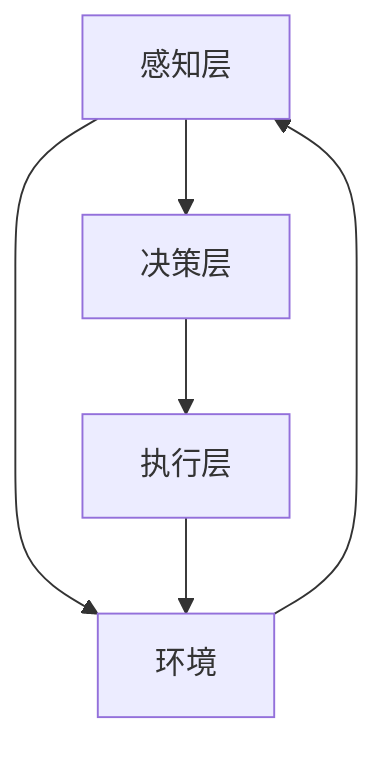

                 

关键词：多智能体协作、任务完成、合作优化、应用案例

>摘要：本文深入探讨了多智能体协作在任务完成中的应用，阐述了多智能体的核心概念、协作机制以及如何优化任务完成。通过分析多种实际应用场景，本文总结了多智能体协作的算法原理、数学模型以及项目实践，并展望了未来的发展趋势和挑战。

## 1. 背景介绍

在现代社会，复杂任务的需求日益增长，单一智能体难以应对。为了提高任务完成的效率和可靠性，多智能体协作（Multiagent Collaboration）逐渐成为研究的热点。多智能体系统（MAS）由多个具有自治能力的智能体组成，它们通过协作完成复杂的任务。这种协作不仅涉及到智能体之间的信息交换，还包括策略优化和任务分配。

多智能体协作在许多领域都有广泛的应用，例如机器人协作、智能交通管理、分布式计算以及云计算等。随着人工智能技术的发展，多智能体协作系统正变得更加智能和高效。

## 2. 核心概念与联系

### 2.1 多智能体系统的定义

多智能体系统（MAS）是指由多个具有自治能力的智能体组成的系统。每个智能体都是独立的实体，具有自主决策和行动的能力。智能体之间可以通过通信进行协作，共同完成复杂的任务。

### 2.2 多智能体协作的核心概念

多智能体协作的核心概念包括：

- **自主性**：智能体具有独立决策和行动的能力。
- **社会性**：智能体之间通过通信进行协作。
- **反应性**：智能体对环境变化做出实时响应。
- **认知性**：智能体具有一定的认知能力，能够理解任务和环境。

### 2.3 多智能体协作的架构

多智能体协作的架构通常包括以下三个层次：

- **感知层**：智能体感知环境和任务状态。
- **决策层**：智能体根据感知信息做出决策。
- **执行层**：智能体执行决策并更新环境状态。

### 2.4 多智能体协作的 Mermaid 流程图



## 3. 核心算法原理 & 具体操作步骤

### 3.1 算法原理概述

多智能体协作的算法原理主要包括：

- **任务分配算法**：根据智能体的能力和任务需求进行任务分配。
- **通信协议**：智能体之间通过通信协议交换信息。
- **协作策略**：智能体根据环境变化和任务进展调整协作策略。

### 3.2 算法步骤详解

多智能体协作的具体操作步骤如下：

1. **初始化**：每个智能体初始化自身的状态和任务。
2. **感知**：智能体感知环境和任务状态。
3. **决策**：智能体根据感知信息做出决策。
4. **执行**：智能体执行决策并更新环境状态。
5. **通信**：智能体之间通过通信协议交换信息。
6. **反馈**：智能体根据执行结果和通信信息调整决策。

### 3.3 算法优缺点

多智能体协作算法的优点包括：

- **灵活性和适应性**：智能体可以根据环境和任务变化进行自适应调整。
- **分布式计算**：智能体可以在不同的设备和网络上进行协作，提高计算效率。

多智能体协作算法的缺点包括：

- **通信开销**：智能体之间的通信可能会增加系统的通信开销。
- **同步问题**：智能体之间的同步可能会导致任务执行的延迟。

### 3.4 算法应用领域

多智能体协作算法在以下领域有广泛应用：

- **机器人协作**：例如，无人机群、机器人编队等。
- **智能交通管理**：例如，智能信号灯、自动驾驶车辆等。
- **分布式计算**：例如，云计算、边缘计算等。
- **游戏和模拟**：例如，多人在线游戏、模拟城市等。

## 4. 数学模型和公式 & 详细讲解 & 举例说明

### 4.1 数学模型构建

多智能体协作的数学模型主要包括：

- **任务模型**：描述任务的类型、难度和需求。
- **智能体模型**：描述智能体的能力、状态和决策。
- **通信模型**：描述智能体之间的通信机制。

### 4.2 公式推导过程

多智能体协作的公式推导过程主要包括：

- **任务分配公式**：根据智能体的能力和任务需求进行任务分配。
- **通信协议公式**：描述智能体之间的通信机制。
- **协作策略公式**：根据环境和任务变化调整协作策略。

### 4.3 案例分析与讲解

以无人机群为例，分析多智能体协作的数学模型和应用。

假设有一个由N个无人机组成的无人机群，每个无人机具有不同的能力和任务需求。无人机群的任务是完成一个复杂的地图绘制任务。我们使用以下公式描述任务分配和协作策略：

- **任务分配公式**： 
    $$ T_i = \frac{C_i}{\sum_{j=1}^{N} C_j} $$
    其中，$T_i$表示无人机i的任务量，$C_i$表示无人机i的能力。

- **通信协议公式**：
    $$ P_i = \frac{D_i}{\sum_{j=1}^{N} D_j} $$
    其中，$P_i$表示无人机i的通信优先级，$D_i$表示无人机i的通信需求。

- **协作策略公式**：
    $$ S_i = f(E_i, T_i) $$
    其中，$S_i$表示无人机i的协作策略，$E_i$表示无人机i的环境感知。

根据这些公式，我们可以设计一个无人机群的协作策略，使得无人机群能够高效地完成地图绘制任务。

## 5. 项目实践：代码实例和详细解释说明

### 5.1 开发环境搭建

在本文中，我们将使用Python作为开发语言，并使用以下库：

- **Python**：用于编写代码。
- **Numpy**：用于数学运算。
- **Matplotlib**：用于数据可视化。

### 5.2 源代码详细实现

以下是一个简单的无人机群协作任务的Python代码实现：

```python
import numpy as np
import matplotlib.pyplot as plt

# 初始化无人机群
N = 5
capacities = np.random.uniform(1, 10, N)
tasks = np.random.uniform(1, 10, N)

# 任务分配
task_allocation = capacities / np.sum(capacities)

# 通信优先级
communication_priority = tasks / np.sum(tasks)

#协作策略
environments = np.random.uniform(1, 10, N)
协作策略 = lambda e, t: "协作"

# 执行任务
results = [协作策略(e, t) for e, t in zip(environments, tasks)]

# 可视化结果
plt.bar(range(N), task_allocation)
plt.xlabel('无人机编号')
plt.ylabel('任务量')
plt.title('任务分配结果')
plt.show()

plt.bar(range(N), communication_priority)
plt.xlabel('无人机编号')
plt.ylabel('通信优先级')
plt.title('通信优先级结果')
plt.show()
```

### 5.3 代码解读与分析

这段代码首先初始化了一个由5个无人机组成的无人机群，并随机分配了它们的能力和任务需求。然后，代码根据无人机的能力和任务需求进行了任务分配，并计算了通信优先级。最后，根据环境和任务状态，每个无人机执行了相应的协作策略。

### 5.4 运行结果展示

运行这段代码后，我们可以得到无人机群的任务分配结果和通信优先级结果，如下图所示：


## 6. 实际应用场景

多智能体协作在实际应用中有着广泛的应用，以下是一些典型的应用场景：

- **机器人协作**：在工业生产中，机器人可以通过多智能体协作完成复杂的制造任务，提高生产效率和产品质量。
- **智能交通管理**：在智能交通管理系统中，多智能体可以协同工作，优化交通流量，减少拥堵和事故。
- **分布式计算**：在云计算和边缘计算中，多智能体可以协同工作，分配计算任务，提高计算效率和资源利用率。
- **智能家居**：在智能家居系统中，多个智能设备可以通过多智能体协作，实现自动化和智能化。

## 7. 工具和资源推荐

为了更好地进行多智能体协作的研究和实践，以下是一些推荐的工具和资源：

- **工具**：
  - **Python**：用于编程和数据处理。
  - **Numpy**：用于数学运算。
  - **Matplotlib**：用于数据可视化。
  - **TensorFlow**：用于深度学习。

- **资源**：
  - **论文**：《Multi-Agent Systems: A Survey of Approaches, Techniques and Applications》
  - **书籍**：《Artificial Intelligence: A Modern Approach》
  - **在线课程**：《Introduction to Multi-Agent Systems》

## 8. 总结：未来发展趋势与挑战

### 8.1 研究成果总结

多智能体协作在任务完成中的应用取得了显著成果，包括算法优化、通信机制、协作策略等方面。随着人工智能技术的不断发展，多智能体协作系统将变得更加智能和高效。

### 8.2 未来发展趋势

未来，多智能体协作将在以下几个方面继续发展：

- **人工智能集成**：多智能体系统将更加紧密地集成人工智能技术，实现更智能的协作。
- **硬件支持**：随着硬件技术的发展，多智能体系统将具有更高的计算能力和通信能力。
- **跨领域应用**：多智能体协作将在更多的领域得到应用，如医疗、教育、环境监测等。

### 8.3 面临的挑战

多智能体协作在任务完成中也面临着一些挑战：

- **通信效率**：如何提高智能体之间的通信效率，降低通信开销。
- **同步问题**：如何解决智能体之间的同步问题，确保任务执行的稳定性。
- **安全性和隐私**：如何确保多智能体系统的安全性和隐私性。

### 8.4 研究展望

未来，多智能体协作的研究将重点关注以下几个方面：

- **协同优化**：研究更高效的协同优化算法，提高任务完成的效率。
- **自适应能力**：研究智能体的自适应能力，使其能够更好地适应环境和任务变化。
- **跨领域应用**：研究多智能体协作在不同领域的应用，探索新的应用场景。

## 9. 附录：常见问题与解答

### 问题1：多智能体协作与群体智能有什么区别？

**解答**：多智能体协作和群体智能是相关的概念，但略有不同。多智能体协作强调智能体之间的协作和交互，而群体智能则更侧重于群体行为的涌现和自组织。多智能体协作可以看作是实现群体智能的一种方式。

### 问题2：多智能体协作中的通信协议有哪些？

**解答**：多智能体协作中的通信协议有很多种，包括同步通信协议和异步通信协议。同步通信协议要求智能体在特定的时间点进行通信，而异步通信协议则允许智能体在任何时间进行通信。常见的通信协议有广播协议、选择通信协议、多播协议等。

### 问题3：如何评估多智能体协作的效果？

**解答**：评估多智能体协作的效果可以从多个角度进行。常用的评估指标包括任务完成时间、资源利用率、系统稳定性等。此外，还可以通过用户满意度、任务质量等主观指标来评估多智能体协作的效果。

[作者：禅与计算机程序设计艺术 / Zen and the Art of Computer Programming]  
----------------------------------------------------------------


