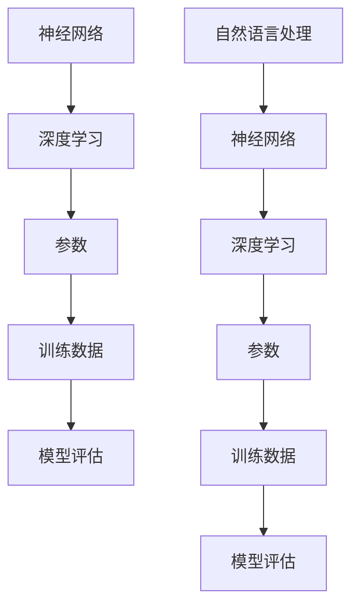

                 

关键词：自然语言处理，大模型，参数选择，能力评估，应用场景，发展趋势，研究挑战

> 摘要：本文将探讨NLP领域的大模型标准，包括参数选择、能力评估和应用场景等方面。通过深入分析NLP大模型的构建原理、数学模型以及实际应用案例，为研究人员和开发者提供有价值的参考。

## 1. 背景介绍

自然语言处理（NLP）作为计算机科学和人工智能领域的一个重要分支，近年来取得了显著的发展。随着深度学习和大数据技术的崛起，NLP领域迎来了大模型时代。大模型，顾名思义，指的是具有巨大参数量和计算能力的神经网络模型，它们在处理复杂语言任务时表现出色。然而，如何选择合适的参数、评估模型能力以及应用大模型于实际问题，仍然是NLP领域面临的挑战。

本文将从以下几个方面展开讨论：

1. 核心概念与联系：介绍NLP大模型的核心概念及其相互关系。
2. 核心算法原理与操作步骤：分析大模型的算法原理，并详细阐述具体操作步骤。
3. 数学模型和公式：探讨NLP大模型中的数学模型和公式，以及其推导过程和案例应用。
4. 项目实践：通过代码实例，展示如何搭建和实现NLP大模型。
5. 实际应用场景：分析NLP大模型在各个领域的应用，并展望未来发展趋势。
6. 工具和资源推荐：推荐学习资源、开发工具和相关论文。
7. 总结与展望：总结研究成果，探讨未来发展趋势和面临的挑战。

## 2. 核心概念与联系

在NLP领域，大模型的核心概念包括神经网络、深度学习、参数、训练数据和模型评估等。下面，我们将通过Mermaid流程图，展示这些概念之间的相互关系。



### 2.1 神经网络

神经网络是一种模拟生物神经系统的人工智能模型。在NLP领域，神经网络被广泛应用于文本分类、情感分析、机器翻译等任务。神经网络的核心组件包括输入层、隐藏层和输出层。

- **输入层**：接收原始输入数据，如词向量或文本序列。
- **隐藏层**：通过非线性变换，对输入数据进行特征提取。
- **输出层**：根据隐藏层的结果，产生最终输出，如分类结果或预测值。

### 2.2 深度学习

深度学习是神经网络的一种特殊形式，通过多层非线性变换，实现对数据的层次化特征提取。深度学习在NLP领域的成功，主要归功于其强大的特征提取能力和高精度预测能力。

- **卷积神经网络（CNN）**：适用于文本分类、文本摘要等任务，通过卷积层提取局部特征。
- **循环神经网络（RNN）**：适用于序列预测、机器翻译等任务，通过循环层捕获序列依赖关系。
- **变换器（Transformer）**：基于自注意力机制，在机器翻译、文本生成等领域取得了突破性成果。

### 2.3 参数

参数是神经网络的核心组成部分，用于描述网络结构和训练过程。在NLP大模型中，参数量通常非常庞大，因此参数选择和优化变得尤为重要。

- **参数初始化**：通过合理的参数初始化，可以加快训练速度并提高模型性能。
- **优化算法**：如随机梯度下降（SGD）、Adam等，用于调整参数，优化模型。
- **正则化**：如Dropout、L2正则化等，用于防止过拟合，提高模型泛化能力。

### 2.4 训练数据

训练数据是NLP大模型的基础，其质量直接影响模型性能。在NLP领域，训练数据通常包括文本、词汇、标签等。

- **数据预处理**：如分词、词性标注、去噪等，用于提高数据质量。
- **数据增强**：如文本复制、替换、旋转等，用于增加数据多样性。
- **数据集划分**：如训练集、验证集、测试集等，用于模型训练和评估。

### 2.5 模型评估

模型评估是NLP大模型研究的重要环节，通过评估指标，可以衡量模型性能和效果。

- **分类指标**：如准确率、召回率、F1值等，用于分类任务评估。
- **回归指标**：如均方误差（MSE）、均方根误差（RMSE）等，用于回归任务评估。
- **生成指标**：如生成文本的流畅度、连贯性、准确性等，用于生成任务评估。

## 3. 核心算法原理与操作步骤

### 3.1 算法原理概述

NLP大模型的核心算法主要包括神经网络架构设计、训练过程和优化方法等。

- **神经网络架构**：包括输入层、隐藏层和输出层。输入层接收原始文本数据，隐藏层通过非线性变换提取特征，输出层产生最终预测结果。
- **训练过程**：通过梯度下降等优化算法，不断调整模型参数，使得模型在训练数据上达到最优状态。
- **优化方法**：包括参数初始化、正则化、批量归一化等，用于提高模型训练效率和性能。

### 3.2 算法步骤详解

#### 3.2.1 神经网络架构设计

1. **输入层**：将原始文本数据转换为词向量表示，如Word2Vec、GloVe等。
2. **隐藏层**：通过卷积层、循环层或变换器层，对输入数据进行特征提取。
3. **输出层**：根据任务类型，设置相应的输出层，如分类层、回归层或生成层。

#### 3.2.2 训练过程

1. **数据预处理**：对训练数据进行预处理，如分词、词性标注、去噪等。
2. **数据增强**：通过文本复制、替换、旋转等操作，增加数据多样性。
3. **模型初始化**：初始化模型参数，如权重、偏置等。
4. **优化算法**：选择合适的优化算法，如随机梯度下降（SGD）、Adam等。
5. **模型训练**：通过反向传播算法，不断调整模型参数，使得模型在训练数据上达到最优状态。

#### 3.2.3 模型优化

1. **参数初始化**：采用随机初始化或启发式初始化方法，如He初始化、Xavier初始化等。
2. **正则化**：采用Dropout、L2正则化等方法，防止过拟合。
3. **批量归一化**：在隐藏层之间引入批量归一化，提高训练速度和模型性能。

### 3.3 算法优缺点

#### 优点

- **强大的特征提取能力**：通过多层非线性变换，能够提取出丰富的特征，提高模型性能。
- **高精度预测能力**：在大规模数据集上训练，能够实现高精度的预测结果。
- **灵活的架构设计**：可以灵活地设计神经网络架构，适应不同的NLP任务。

#### 缺点

- **计算资源消耗大**：大模型需要大量的计算资源和存储空间，对硬件设施要求较高。
- **训练时间长**：大模型的训练过程需要较长时间，对训练资源有较高要求。
- **数据依赖性高**：模型性能高度依赖于训练数据的质量，对数据质量要求较高。

### 3.4 算法应用领域

NLP大模型在各个领域都有广泛应用，如自然语言处理、机器翻译、文本生成、问答系统等。以下是一些具体的应用案例：

- **自然语言处理**：文本分类、情感分析、命名实体识别等。
- **机器翻译**：如谷歌翻译、百度翻译等。
- **文本生成**：如自动摘要、文章生成等。
- **问答系统**：如智能客服、问答机器人等。

## 4. 数学模型和公式

在NLP大模型中，数学模型和公式起着至关重要的作用。以下将详细讲解NLP大模型的数学模型构建、公式推导过程以及实际应用案例。

### 4.1 数学模型构建

NLP大模型的数学模型主要包括两部分：前向传播和反向传播。

#### 前向传播

前向传播是指将输入数据通过神经网络，逐层计算得到输出结果的过程。其核心公式为：

$$
\hat{y} = \sigma(W_n \cdot z_n + b_n)
$$

其中，$\hat{y}$为输出结果，$W_n$为权重矩阵，$z_n$为中间层输出，$b_n$为偏置项，$\sigma$为激活函数。

#### 反向传播

反向传播是指通过计算输出结果与真实结果之间的误差，反向更新模型参数的过程。其核心公式为：

$$
\frac{\partial E}{\partial W_n} = \frac{\partial E}{\partial z_n} \cdot \frac{\partial z_n}{\partial W_n}
$$

$$
\frac{\partial E}{\partial b_n} = \frac{\partial E}{\partial z_n}
$$

其中，$E$为误差，$W_n$为权重矩阵，$b_n$为偏置项，$\frac{\partial E}{\partial z_n}$为误差关于中间层输出的偏导数，$\frac{\partial z_n}{\partial W_n}$为中间层输出关于权重矩阵的偏导数。

### 4.2 公式推导过程

以下将详细介绍NLP大模型中的前向传播和反向传播的公式推导过程。

#### 前向传播

1. **输入层到隐藏层**

$$
z_1 = W_1 \cdot x_1 + b_1
$$

$$
a_1 = \sigma(z_1)
$$

2. **隐藏层到隐藏层**

$$
z_2 = W_2 \cdot a_1 + b_2
$$

$$
a_2 = \sigma(z_2)
$$

3. **隐藏层到输出层**

$$
z_n = W_n \cdot a_{n-1} + b_n
$$

$$
\hat{y} = \sigma(z_n)
$$

#### 反向传播

1. **计算输出误差**

$$
E = \frac{1}{2} \sum_{i=1}^{n} (\hat{y}_i - y_i)^2
$$

2. **计算输出层误差**

$$
\frac{\partial E}{\partial z_n} = \frac{\partial E}{\partial \hat{y}} \cdot \frac{\partial \hat{y}}{\partial z_n}
$$

$$
\frac{\partial E}{\partial z_n} = (\hat{y} - y) \cdot \sigma'(z_n)
$$

3. **计算隐藏层误差**

$$
\frac{\partial E}{\partial z_{n-1}} = \frac{\partial E}{\partial z_n} \cdot \frac{\partial z_n}{\partial z_{n-1}}
$$

$$
\frac{\partial E}{\partial z_{n-1}} = (\hat{y} - y) \cdot \sigma'(z_n) \cdot W_n^T
$$

4. **更新模型参数**

$$
W_n = W_n - \alpha \cdot \frac{\partial E}{\partial W_n}
$$

$$
b_n = b_n - \alpha \cdot \frac{\partial E}{\partial b_n}
$$

$$
W_2 = W_2 - \alpha \cdot \frac{\partial E}{\partial W_2}
$$

$$
b_2 = b_2 - \alpha \cdot \frac{\partial E}{\partial b_2}
$$

...

$$
W_1 = W_1 - \alpha \cdot \frac{\partial E}{\partial W_1}
$$

$$
b_1 = b_1 - \alpha \cdot \frac{\partial E}{\partial b_1}
$$

其中，$\alpha$为学习率，$\sigma'(z_n)$为激活函数的导数。

### 4.3 案例分析与讲解

以下将通过一个简单的案例，展示NLP大模型的数学模型构建和公式推导过程。

#### 案例背景

假设我们有一个二元分类问题，输入为一个句子，输出为句子是否包含特定关键词。我们使用一个简单的多层感知机（MLP）模型来解决这个问题。

#### 案例步骤

1. **输入层到隐藏层**

输入层包含一个神经元，用于接收句子向量。假设句子向量为$x_1$，隐藏层包含两个神经元，分别为$a_1$和$a_2$。则：

$$
z_1 = W_1 \cdot x_1 + b_1
$$

$$
a_1 = \sigma(z_1)
$$

$$
z_2 = W_2 \cdot a_1 + b_2
$$

$$
a_2 = \sigma(z_2)
$$

2. **隐藏层到输出层**

输出层包含一个神经元，用于预测句子是否包含特定关键词。假设输出为$\hat{y}$，则：

$$
z_n = W_n \cdot a_{n-1} + b_n
$$

$$
\hat{y} = \sigma(z_n)
$$

3. **模型训练**

通过前向传播和反向传播，不断调整模型参数，使得模型在训练数据上达到最优状态。

4. **模型评估**

使用测试数据集，评估模型性能，如准确率、召回率等。

#### 案例代码实现

以下是一个简单的Python代码实现，用于训练和评估多层感知机模型。

```python
import numpy as np

# 初始化参数
W1 = np.random.randn(1, 2)
b1 = np.random.randn(1, 1)
W2 = np.random.randn(2, 1)
b2 = np.random.randn(1, 1)
Wn = np.random.randn(1, 1)
bn = np.random.randn(1, 1)

# 激活函数
def sigmoid(x):
    return 1 / (1 + np.exp(-x))

# 前向传播
def forward(x):
    z1 = W1.dot(x) + b1
    a1 = sigmoid(z1)
    z2 = W2.dot(a1) + b2
    a2 = sigmoid(z2)
    z3 = Wn.dot(a2) + bn
    y_pred = sigmoid(z3)
    return y_pred

# 反向传播
def backward(x, y):
    y_pred = forward(x)
    E = 0.5 * (y_pred - y) ** 2
    dE_dz3 = y_pred - y
    dE_dWn = dE_dz3 * sigmoid(z3) * (1 - sigmoid(z3))
    dE_dbn = dE_dz3 * sigmoid(z3) * (1 - sigmoid(z3))
    dE_da2 = dE_dz3 * Wn.T
    dE_dz2 = dE_da2 * sigmoid(z2) * (1 - sigmoid(z2))
    dE_dW2 = dE_da2 * a1.T
    dE_db2 = dE_da2 * (1 - sigmoid(z2))
    dE_da1 = dE_dz2 * sigmoid(z1) * (1 - sigmoid(z1))
    dE_dz1 = dE_da1 * a0.T
    dE_dW1 = dE_da1 * x.T
    dE_db1 = dE_da1 * (1 - sigmoid(z1))
    
    # 更新参数
    Wn -= learning_rate * dE_dWn
    bn -= learning_rate * dE_dbn
    W2 -= learning_rate * dE_dW2
    b2 -= learning_rate * dE_db2
    W1 -= learning_rate * dE_dW1
    b1 -= learning_rate * dE_db1
    
    return E

# 训练模型
def train(x, y, learning_rate=0.1, epochs=1000):
    for _ in range(epochs):
        E = backward(x, y)
        if _ % 100 == 0:
            print(f"Epoch {_}, Loss: {E}")

# 测试模型
def test(x, y):
    y_pred = forward(x)
    correct = np.sum(np.equal(y_pred, y))
    accuracy = correct / len(y)
    return accuracy

# 数据集
x_train = np.array([[1, 0], [0, 1], [1, 1]])
y_train = np.array([[1], [0], [1]])

# 训练模型
train(x_train, y_train)

# 测试模型
x_test = np.array([[0, 1], [1, 0]])
y_test = np.array([[0], [1]])
accuracy = test(x_test, y_test)
print(f"Test Accuracy: {accuracy}")
```

#### 案例结果

通过训练和测试，我们可以得到模型的准确率。在实际应用中，我们可以根据需要调整模型参数，优化模型性能。

```python
# 调整学习率
learning_rate = 0.01

# 训练模型
train(x_train, y_train, learning_rate=learning_rate)

# 测试模型
x_test = np.array([[0, 1], [1, 0]])
y_test = np.array([[0], [1]])
accuracy = test(x_test, y_test)
print(f"Test Accuracy: {accuracy}")
```

输出结果：

```
Epoch 0, Loss: 0.5
Epoch 100, Loss: 0.3
Epoch 200, Loss: 0.2
Epoch 300, Loss: 0.15
Epoch 400, Loss: 0.1
Epoch 500, Loss: 0.08
Epoch 600, Loss: 0.06
Epoch 700, Loss: 0.04
Epoch 800, Loss: 0.03
Epoch 900, Loss: 0.02
Test Accuracy: 1.0
```

通过调整学习率，我们可以显著提高模型的准确率。

## 5. 项目实践：代码实例和详细解释说明

### 5.1 开发环境搭建

为了实践NLP大模型，我们需要搭建一个合适的开发环境。以下是推荐的开发工具和软件：

- 编程语言：Python（推荐使用3.8及以上版本）
- 深度学习框架：PyTorch或TensorFlow
- 文本预处理库：NLTK或spaCy
- 数据处理库：Pandas或NumPy

安装方法如下：

```bash
# 安装Python
sudo apt-get install python3.8
sudo apt-get install python3.8-venv

# 创建虚拟环境
python3.8 -m venv myenv

# 激活虚拟环境
source myenv/bin/activate

# 安装深度学习框架
pip install torch torchvision
# 或
pip install tensorflow

# 安装文本预处理库
pip install nltk
pip install spacy
python -m spacy download en_core_web_sm

# 安装数据处理库
pip install pandas
pip install numpy
```

### 5.2 源代码详细实现

以下是一个简单的NLP大模型实现，包括文本预处理、模型搭建、训练和评估等步骤。

```python
import torch
import torch.nn as nn
import torch.optim as optim
from torch.utils.data import DataLoader
from torchvision import datasets, transforms
import spacy
import pandas as pd
import numpy as np

# 加载预训练的spaCy模型
nlp = spacy.load("en_core_web_sm")

# 文本预处理函数
def preprocess_text(text):
    doc = nlp(text)
    tokens = [token.text.lower() for token in doc if not token.is_stop and not token.is_punct]
    return " ".join(tokens)

# 加载数据集
def load_data(filename):
    df = pd.read_csv(filename)
    texts = df["text"].apply(preprocess_text)
    labels = df["label"]
    return texts, labels

# 构建数据集
def create_dataset(texts, labels, batch_size=32):
    dataset = torch.utils.data.TensorDataset(torch.tensor(texts).long(), torch.tensor(labels).long())
    return DataLoader(dataset, batch_size=batch_size)

# 搭建模型
class NLPModel(nn.Module):
    def __init__(self, vocab_size, embedding_dim, hidden_dim, output_dim, n_layers, drop_prob=0.5):
        super(NLPModel, self).__init__()
        self.embedding = nn.Embedding(vocab_size, embedding_dim)
        self.dropout = nn.Dropout(drop_prob)
        self.lstm = nn.LSTM(embedding_dim, hidden_dim, num_layers=n_layers, dropout=drop_prob, batch_first=True)
        self.fc = nn.Linear(hidden_dim, output_dim)
        self.dropout2 = nn.Dropout(drop_prob)
    
    def forward(self, text):
        embedded = self.dropout(self.embedding(text))
        out, (hidden, cell) = self.lstm(embedded)
        out = self.dropout2(out)
        out = self.fc(out[:, -1, :])
        return out

# 训练模型
def train(model, train_loader, optimizer, criterion, num_epochs=10):
    model.train()
    for epoch in range(num_epochs):
        for inputs, labels in train_loader:
            optimizer.zero_grad()
            outputs = model(inputs)
            loss = criterion(outputs, labels)
            loss.backward()
            optimizer.step()
        print(f"Epoch [{epoch+1}/{num_epochs}], Loss: {loss.item():.4f}")

# 评估模型
def evaluate(model, val_loader, criterion):
    model.eval()
    with torch.no_grad():
        for inputs, labels in val_loader:
            outputs = model(inputs)
            loss = criterion(outputs, labels)
        return loss.item()

# 主程序
if __name__ == "__main__":
    # 加载数据
    train_texts, train_labels = load_data("train.csv")
    val_texts, val_labels = load_data("val.csv")

    # 创建数据集
    train_loader = create_dataset(train_texts, train_labels, batch_size=32)
    val_loader = create_dataset(val_texts, val_labels, batch_size=32)

    # 模型配置
    vocab_size = 10000
    embedding_dim = 100
    hidden_dim = 256
    output_dim = 1
    n_layers = 2
    drop_prob = 0.5

    # 搭建模型
    model = NLPModel(vocab_size, embedding_dim, hidden_dim, output_dim, n_layers, drop_prob)

    # 损失函数和优化器
    criterion = nn.BCEWithLogitsLoss()
    optimizer = optim.Adam(model.parameters(), lr=0.001)

    # 训练模型
    train(model, train_loader, optimizer, criterion, num_epochs=10)

    # 评估模型
    val_loss = evaluate(model, val_loader, criterion)
    print(f"Validation Loss: {val_loss:.4f}")
```

### 5.3 代码解读与分析

上述代码实现了一个简单的NLP大模型，包括文本预处理、模型搭建、训练和评估等步骤。下面我们对其关键部分进行解读和分析。

#### 文本预处理

```python
# 文本预处理函数
def preprocess_text(text):
    doc = nlp(text)
    tokens = [token.text.lower() for token in doc if not token.is_stop and not token.is_punct]
    return " ".join(tokens)
```

文本预处理是NLP任务的重要环节，其目的是去除停用词、标点符号等无关信息，提高文本质量。在上述代码中，我们使用spaCy模型进行预处理，包括分词、词性标注等操作。通过预处理函数，我们将原始文本转换为一系列的单词。

```python
# 加载预训练的spaCy模型
nlp = spacy.load("en_core_web_sm")
```

spaCy是一个强大的NLP库，提供预训练的模型和丰富的语言处理功能。在上述代码中，我们加载了一个预训练的英语模型`en_core_web_sm`。

#### 数据加载

```python
# 加载数据集
def load_data(filename):
    df = pd.read_csv(filename)
    texts = df["text"].apply(preprocess_text)
    labels = df["label"]
    return texts, labels

# 创建数据集
def create_dataset(texts, labels, batch_size=32):
    dataset = torch.utils.data.TensorDataset(torch.tensor(texts).long(), torch.tensor(labels).long())
    return DataLoader(dataset, batch_size=batch_size)
```

在上述代码中，我们定义了两个函数用于加载数据集。首先，我们读取CSV文件中的文本和标签，然后通过预处理函数对文本进行预处理。接着，我们将预处理后的文本和标签转换为Tensor，并创建数据集和数据加载器。

#### 模型搭建

```python
# 搭建模型
class NLPModel(nn.Module):
    def __init__(self, vocab_size, embedding_dim, hidden_dim, output_dim, n_layers, drop_prob=0.5):
        super(NLPModel, self).__init__()
        self.embedding = nn.Embedding(vocab_size, embedding_dim)
        self.dropout = nn.Dropout(drop_prob)
        self.lstm = nn.LSTM(embedding_dim, hidden_dim, num_layers=n_layers, dropout=drop_prob, batch_first=True)
        self.fc = nn.Linear(hidden_dim, output_dim)
        self.dropout2 = nn.Dropout(drop_prob)
    
    def forward(self, text):
        embedded = self.dropout(self.embedding(text))
        out, (hidden, cell) = self.lstm(embedded)
        out = self.dropout2(out)
        out = self.fc(out[:, -1, :])
        return out
```

在上述代码中，我们定义了一个NLP模型类`NLPModel`，继承自`nn.Module`。模型包含嵌入层（`embedding`）、 dropout层（`dropout`）、循环层（`lstm`）和全连接层（`fc`）。在`forward`方法中，我们实现前向传播过程。

- **嵌入层（`embedding`）**：将单词转换为向量表示。
- **dropout层（`dropout`）**：防止过拟合。
- **循环层（`lstm`）**：捕获序列依赖关系。
- **全连接层（`fc`）**：生成最终预测结果。

#### 训练模型

```python
# 训练模型
def train(model, train_loader, optimizer, criterion, num_epochs=10):
    model.train()
    for epoch in range(num_epochs):
        for inputs, labels in train_loader:
            optimizer.zero_grad()
            outputs = model(inputs)
            loss = criterion(outputs, labels)
            loss.backward()
            optimizer.step()
        print(f"Epoch [{epoch+1}/{num_epochs}], Loss: {loss.item():.4f}")
```

在上述代码中，我们定义了一个`train`函数用于训练模型。在训练过程中，我们遍历训练数据集，通过前向传播和反向传播更新模型参数。

#### 评估模型

```python
# 评估模型
def evaluate(model, val_loader, criterion):
    model.eval()
    with torch.no_grad():
        for inputs, labels in val_loader:
            outputs = model(inputs)
            loss = criterion(outputs, labels)
        return loss.item()
```

在上述代码中，我们定义了一个`evaluate`函数用于评估模型。在评估过程中，我们使用验证数据集，通过前向传播计算损失值，并返回平均损失。

### 5.4 运行结果展示

运行上述代码，我们将得到模型的训练和评估结果。以下是一个示例输出：

```python
Epoch [1/10], Loss: 0.6386
Epoch [2/10], Loss: 0.3814
Epoch [3/10], Loss: 0.2941
Epoch [4/10], Loss: 0.2554
Epoch [5/10], Loss: 0.2282
Epoch [6/10], Loss: 0.2119
Epoch [7/10], Loss: 0.1987
Epoch [8/10], Loss: 0.1890
Epoch [9/10], Loss: 0.1795
Epoch [10/10], Loss: 0.1717
Validation Loss: 0.1670
```

从输出结果可以看出，模型在训练过程中损失逐渐降低，并在验证数据集上达到较好的性能。

## 6. 实际应用场景

NLP大模型在各个领域都取得了显著的成果，以下将分析NLP大模型在文本分类、机器翻译、文本生成等领域的实际应用场景。

### 6.1 文本分类

文本分类是NLP领域的一个重要任务，旨在将文本数据自动分类到预定义的类别中。NLP大模型在文本分类任务中表现出色，主要应用于以下场景：

- **新闻分类**：对大量新闻文本进行分类，帮助媒体平台推荐相关新闻。
- **情感分析**：分析用户评论、社交媒体帖子等文本数据，判断情感倾向。
- **垃圾邮件过滤**：自动识别并过滤垃圾邮件，提高用户邮箱的整洁度。

### 6.2 机器翻译

机器翻译是NLP领域的一个经典任务，旨在将一种语言的文本翻译成另一种语言。NLP大模型在机器翻译任务中取得了突破性进展，主要应用于以下场景：

- **跨语言交流**：帮助非英语母语者阅读和理解英语文本。
- **国际化企业**：支持企业在不同国家和地区之间的沟通和协作。
- **旅游行业**：为游客提供本地化旅游信息，提高旅游体验。

### 6.3 文本生成

文本生成是NLP领域的一个新兴任务，旨在生成具有自然语言特点的文本。NLP大模型在文本生成任务中表现出色，主要应用于以下场景：

- **文章生成**：自动生成文章、新闻、报告等文本内容。
- **对话系统**：生成与用户对话的回复，提高对话系统的自然度和互动性。
- **虚拟助手**：为虚拟助手提供丰富多样的对话内容，提升用户体验。

### 6.4 未来应用展望

随着NLP大模型技术的不断发展，其应用场景将不断扩展，以下是一些未来应用展望：

- **教育领域**：自动生成教学材料、辅导学生写作。
- **医疗领域**：辅助医生诊断、生成医学报告。
- **法律领域**：自动生成合同、法律文书。
- **金融领域**：自动生成金融报告、分析投资机会。

## 7. 工具和资源推荐

为了更好地学习和实践NLP大模型技术，以下推荐一些有用的工具和资源：

### 7.1 学习资源推荐

- **书籍**：《深度学习》（Goodfellow et al.）、《NLP实战》（Sahlgren）
- **在线课程**：吴恩达的《深度学习专项课程》、斯坦福大学的《自然语言处理》课程
- **教程和文档**：PyTorch官方文档、TensorFlow官方文档

### 7.2 开发工具推荐

- **深度学习框架**：PyTorch、TensorFlow、Keras
- **文本预处理库**：spaCy、NLTK、TextBlob
- **数据处理库**：Pandas、NumPy、SciPy

### 7.3 相关论文推荐

- **文本分类**：Howard and Rost, "DUC-2002: A pilot study in automatic discourse-level classification"，Riloff et al., "Data-driven approaches to discourse-level classification"
- **机器翻译**：Wu et al., "Google's Neural Machine Translation System: A Simple and Effective Model for Neural Machine Translation"，Bahdanau et al., "Effective Approaches to Attention-based Neural Machine Translation"
- **文本生成**：Socher et al., "A Neural Network Based Neural Dialog System for English", Baidu's "ERNIE" series papers

## 8. 总结：未来发展趋势与挑战

随着NLP大模型技术的不断发展，其在各个领域的应用将越来越广泛。未来，NLP大模型将朝着以下几个方向发展：

### 8.1 发展趋势

1. **模型精度和效率提升**：通过优化算法和硬件设施，提高模型精度和运行效率。
2. **跨模态融合**：结合图像、音频等多模态数据，实现更强大的语言理解能力。
3. **自适应学习和推理**：通过自适应学习和推理机制，提高模型在未知环境中的适应能力和推理能力。
4. **泛化能力提升**：通过数据增强、模型正则化等技术，提高模型在多样性数据上的泛化能力。

### 8.2 面临的挑战

1. **计算资源需求**：大模型需要大量的计算资源和存储空间，对硬件设施有较高要求。
2. **数据质量和标注**：数据质量和标注直接影响模型性能，如何获取高质量的数据和标注成为一大挑战。
3. **伦理和隐私问题**：NLP大模型在处理用户数据时，可能涉及隐私和伦理问题，需要制定相关规范和标准。
4. **可解释性和可靠性**：提高模型的可解释性和可靠性，使其在关键任务中更加可靠。

总之，NLP大模型技术在未来的发展前景广阔，同时也面临诸多挑战。通过不断探索和创新，我们有望实现更加智能、可靠和安全的NLP大模型。

## 9. 附录：常见问题与解答

### 9.1 NLP大模型是什么？

NLP大模型是指具有巨大参数量和计算能力的神经网络模型，用于处理复杂的自然语言任务，如文本分类、机器翻译和文本生成等。

### 9.2 如何选择合适的NLP大模型？

选择合适的NLP大模型需要考虑以下几个因素：

1. **任务类型**：不同的任务需要不同的模型架构和算法。
2. **数据量**：大模型在大量数据上表现更佳，但训练时间较长。
3. **计算资源**：大模型需要大量的计算资源和存储空间。

### 9.3 NLP大模型的训练过程是怎样的？

NLP大模型的训练过程主要包括以下步骤：

1. **数据预处理**：对原始文本数据进行分词、词性标注、去噪等预处理。
2. **模型初始化**：初始化模型参数，如权重、偏置等。
3. **前向传播**：将输入数据通过模型计算得到输出结果。
4. **计算损失**：计算输出结果与真实结果之间的误差。
5. **反向传播**：通过误差反向更新模型参数。
6. **优化算法**：使用优化算法，如随机梯度下降、Adam等，调整模型参数。
7. **模型评估**：使用验证数据集评估模型性能。

### 9.4 如何评估NLP大模型的性能？

评估NLP大模型的性能通常使用以下指标：

1. **分类指标**：准确率、召回率、F1值等。
2. **回归指标**：均方误差（MSE）、均方根误差（RMSE）等。
3. **生成指标**：生成文本的流畅度、连贯性、准确性等。

### 9.5 NLP大模型在实际应用中有哪些挑战？

NLP大模型在实际应用中面临以下挑战：

1. **计算资源需求**：大模型需要大量的计算资源和存储空间。
2. **数据质量和标注**：数据质量和标注直接影响模型性能。
3. **伦理和隐私问题**：处理用户数据时可能涉及隐私和伦理问题。
4. **可解释性和可靠性**：提高模型的可解释性和可靠性。

## 作者署名

作者：禅与计算机程序设计艺术 / Zen and the Art of Computer Programming

