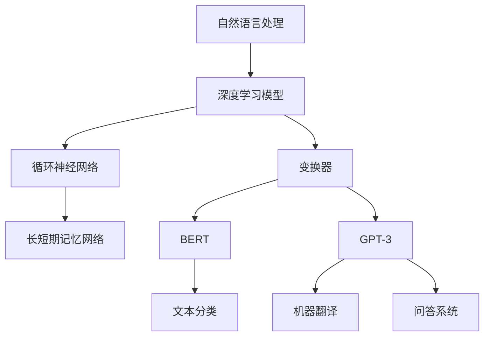

                 

在过去的几年里，自然语言处理（NLP）领域取得了令人瞩目的进展，尤其是在大模型的参数化、训练和应用方面。本文将深入探讨NLP领域的大模型，从其参数设置、能力展示到实际应用，试图为读者提供一幅完整的图像。关键词：NLP，大模型，参数，能力，应用。

## 摘要

本文旨在介绍NLP领域的大模型，从参数设置、能力展示到实际应用进行深入分析。首先，我们将回顾NLP的发展历程，阐述大模型的出现及其重要性。接着，我们将详细讨论大模型的参数设置，包括词汇表、嵌入维度和训练策略等。随后，我们将分析大模型在NLP任务中的表现，如文本分类、机器翻译和问答系统等。最后，我们将探讨大模型在实际应用中的挑战和未来发展方向。

## 1. 背景介绍

自然语言处理（NLP）作为人工智能的重要分支，近年来取得了显著进展。早期，研究者主要依靠规则和统计方法进行文本处理，但效果有限。随着深度学习技术的发展，特别是神经网络在图像识别等领域的成功应用，NLP领域也开始引入深度学习模型。然而，传统的深度学习模型在处理自然语言时存在一些问题，如处理长文本的能力不足、参数量巨大导致计算资源消耗等。

为了解决这些问题，研究者开始探索更大规模的模型，即大模型。大模型通常具有数十亿至数万亿的参数，能够更好地捕捉语言中的复杂模式和结构。例如，谷歌的BERT模型由数百万个参数组成，而OpenAI的GPT-3模型更是达到了1.75万亿个参数。大模型的出现，极大地提升了NLP任务的表现，推动了NLP领域的发展。

### 1.1 NLP的发展历程

NLP的发展历程可以分为三个阶段：规则驱动、统计驱动和深度学习驱动。

- 规则驱动阶段：在这一阶段，研究者主要依靠手工编写的规则进行文本处理。例如，利用词性标注规则、句法分析规则等。然而，这种方法难以处理复杂和多变的自然语言，效果有限。

- 统计驱动阶段：随着计算能力的提升，研究者开始利用统计方法进行文本处理。例如，基于N-gram模型的语言模型、基于隐马尔可夫模型（HMM）的语音识别等。统计方法在一定程度上提高了文本处理的效果，但仍存在许多局限性。

- 深度学习驱动阶段：近年来，深度学习技术在NLP领域取得了显著突破。特别是神经网络在图像识别等领域的成功应用，激发了研究者将深度学习引入NLP领域的兴趣。深度学习模型，如循环神经网络（RNN）、长短期记忆网络（LSTM）和变换器（Transformer）等，在文本处理任务中表现出色。

### 1.2 大模型的出现

大模型的出现，解决了传统深度学习模型在处理自然语言时的许多问题。首先，大模型具有更强的表示能力。通过增加模型参数的数量，大模型能够更好地捕捉语言中的复杂模式和结构。其次，大模型在训练过程中采用了更先进的优化算法和训练技巧，如Adam优化器和dropout等，提高了模型的稳定性和收敛速度。

### 1.3 大模型的重要性

大模型在NLP领域的重要性体现在以下几个方面：

- 提高NLP任务的表现：大模型能够更好地处理自然语言中的复杂信息，提高文本分类、机器翻译、问答系统等任务的表现。

- 模式发现：大模型能够从大量的文本数据中自动发现语言模式，为研究者提供有价值的见解。

- 应用广泛：大模型不仅适用于传统的NLP任务，还在许多新兴领域取得了成功，如对话系统、自然语言生成等。

## 2. 核心概念与联系

为了深入理解大模型在NLP领域的应用，我们需要先了解一些核心概念和它们之间的联系。以下是一个简化的Mermaid流程图，展示了这些核心概念及其相互关系：



### 2.1 深度学习模型

深度学习模型是NLP领域的重要工具，特别是用于处理大规模文本数据。其中，变换器（Transformer）是一种基于自注意力机制的深度学习模型，它在NLP任务中表现出色。变换器模型的核心思想是利用自注意力机制，通过不同位置的信息进行加权，从而更好地捕捉文本中的长距离依赖关系。

### 2.2 循环神经网络（RNN）

循环神经网络（RNN）是一种经典的深度学习模型，特别适用于序列数据处理。RNN通过保存和更新隐藏状态，能够处理长序列数据。然而，RNN在处理长序列数据时存在梯度消失和梯度爆炸等问题。

### 2.3 长短期记忆网络（LSTM）

为了解决RNN的梯度消失和梯度爆炸问题，研究者提出了长短期记忆网络（LSTM）。LSTM通过引入门控机制，能够更好地捕捉长序列数据中的长期依赖关系。LSTM在许多NLP任务中表现出色，但计算复杂度较高。

### 2.4 BERT和GPT-3

BERT（Bidirectional Encoder Representations from Transformers）和GPT-3（Generative Pre-trained Transformer 3）是两种基于变换器的预训练模型。BERT主要用于文本分类、问答等任务，而GPT-3主要用于生成文本和对话系统等任务。BERT和GPT-3的成功，进一步证明了变换器模型在NLP领域的强大能力。

### 2.5 文本分类、机器翻译和问答系统

文本分类、机器翻译和问答系统是NLP领域的三个重要任务。文本分类用于将文本数据分类到预定义的类别中，如情感分析、新闻分类等。机器翻译用于将一种语言的文本翻译成另一种语言。问答系统则用于回答用户提出的问题。

## 3. 核心算法原理 & 具体操作步骤

### 3.1 算法原理概述

大模型在NLP领域的成功，得益于其强大的参数设置和先进的训练技巧。以下将简要介绍大模型的核心算法原理。

### 3.1.1 自注意力机制

自注意力机制是变换器模型的核心组成部分，它能够自动计算不同位置的信息之间的关联性。具体来说，自注意力机制通过计算每个位置与其他所有位置的关联性，为每个位置分配一个权重，从而更好地捕捉文本中的长距离依赖关系。

### 3.1.2 预训练与微调

预训练与微调是训练大模型的主要策略。预训练是指在大量的文本数据上对模型进行大规模训练，使其具备基本的语言理解能力。微调则是在预训练的基础上，利用特定的任务数据对模型进行细粒度调整，以提高模型在特定任务上的表现。

### 3.2 算法步骤详解

以下是训练大模型的基本步骤：

### 3.2.1 数据预处理

- 数据清洗：对原始文本数据进行清洗，去除无用信息，如HTML标签、特殊字符等。
- 分词：将文本数据转换为词序列，常用的分词方法有词袋模型、词性标注和命名实体识别等。

### 3.2.2 模型初始化

- 模型选择：选择合适的大模型，如BERT、GPT-3等。
- 参数初始化：初始化模型参数，常用的初始化方法有Xavier初始化、He初始化等。

### 3.2.3 预训练

- 训练数据准备：准备大规模的预训练数据集，如维基百科、新闻网站等。
- 模型训练：在预训练数据集上对模型进行大规模训练，优化模型参数。
- 训练技巧：采用先进的训练技巧，如学习率调整、dropout、正则化等。

### 3.2.4 微调

- 数据准备：准备特定任务的数据集，如文本分类、机器翻译等。
- 模型调整：在特定任务的数据集上对模型进行微调，优化模型参数。
- 评估与优化：对模型进行评估，如准确率、损失函数等，根据评估结果调整模型参数。

### 3.3 算法优缺点

#### 优点：

- 强大的表示能力：大模型能够更好地捕捉语言中的复杂模式和结构，提高NLP任务的表现。
- 高效的训练：预训练与微调策略使得大模型训练过程更加高效。
- 广泛的应用：大模型适用于多种NLP任务，如文本分类、机器翻译和问答系统等。

#### 缺点：

- 计算资源消耗：大模型通常需要大量的计算资源和存储空间。
- 数据依赖：大模型的预训练和微调过程依赖于大量的高质量数据。
- 难以解释：大模型的学习过程较为复杂，难以解释其决策过程。

### 3.4 算法应用领域

大模型在NLP领域具有广泛的应用，以下是一些典型的应用场景：

- 文本分类：用于对文本数据进行分类，如情感分析、新闻分类等。
- 机器翻译：将一种语言的文本翻译成另一种语言。
- 问答系统：用于回答用户提出的问题，如智能客服、搜索引擎等。
- 自然语言生成：用于生成自然语言文本，如自动写作、对话系统等。

## 4. 数学模型和公式 & 详细讲解 & 举例说明

### 4.1 数学模型构建

大模型通常基于变换器架构，变换器模型的核心组件是自注意力机制。以下是变换器模型的基本数学公式：

#### 4.1.1 自注意力机制

自注意力机制通过计算每个位置与其他所有位置的关联性，为每个位置分配一个权重。具体来说，自注意力机制包括以下三个关键步骤：

1. **Query、Key和Value的计算**：

   $$Q = W_Q \cdot X$$

   $$K = W_K \cdot X$$

   $$V = W_V \cdot X$$

   其中，$Q$、$K$和$V$分别表示Query、Key和Value，$X$表示输入序列，$W_Q$、$W_K$和$W_V$表示权重矩阵。

2. **计算注意力分数**：

   $$\text{Attention Scores} = \text{softmax}\left(\frac{Q \cdot K^T}{\sqrt{d_k}}\right)$$

   其中，$d_k$表示Key的维度，$\text{softmax}$函数用于将注意力分数转换为概率分布。

3. **计算输出**：

   $$\text{Output} = \text{softmax}\left(\frac{Q \cdot K^T}{\sqrt{d_k}}\right) \cdot V$$

   输出表示对输入序列的加权汇总。

#### 4.1.2 位置编码

为了引入位置信息，变换器模型采用了位置编码。位置编码是一种对输入序列进行加权的技巧，使得模型能够理解序列中各个位置的关系。位置编码通常采用以下形式：

$$\text{Positional Encoding} = \text{sin}(i / 10000^{2j/d}) + \text{cos}(i / 10000^{2j/d})$$

其中，$i$表示位置索引，$j$表示维度索引，$d$表示嵌入维度。

### 4.2 公式推导过程

以下简要介绍自注意力机制的推导过程：

1. **Query、Key和Value的计算**：

   在变换器模型中，Query、Key和Value是由输入序列通过线性变换得到的。具体来说，假设输入序列为$X = [x_1, x_2, ..., x_n]$，则：

   $$Q = W_Q \cdot X = [q_1, q_2, ..., q_n]$$

   $$K = W_K \cdot X = [k_1, k_2, ..., k_n]$$

   $$V = W_V \cdot X = [v_1, v_2, ..., v_n]$$

   其中，$W_Q$、$W_K$和$W_V$为权重矩阵。

2. **计算注意力分数**：

   注意力分数是通过计算Query和Key的内积得到的。为了防止梯度消失，引入了缩放因子$\sqrt{d_k}$，其中$d_k$为Key的维度。具体来说：

   $$\text{Attention Scores} = \text{softmax}\left(\frac{Q \cdot K^T}{\sqrt{d_k}}\right)$$

   其中，$Q \cdot K^T$表示Query和Key的内积。

3. **计算输出**：

   输出是通过将注意力分数与Value相乘，然后进行加权和得到的。具体来说：

   $$\text{Output} = \text{softmax}\left(\frac{Q \cdot K^T}{\sqrt{d_k}}\right) \cdot V$$

   其中，$\text{softmax}$函数用于将注意力分数转换为概率分布。

### 4.3 案例分析与讲解

以下通过一个简单的例子，说明如何使用变换器模型进行文本分类。

#### 4.3.1 数据准备

假设我们有以下两个句子：

- 句子1：我喜欢编程。
- 句子2：我讨厌编程。

我们将这两个句子进行分词，得到以下词序列：

- 句子1：[我，喜欢，编程]
- 句子2：[我，讨厌，编程]

#### 4.3.2 模型输入

将词序列转换为嵌入向量，假设每个词的嵌入维度为64：

- 句子1：[e_1, e_2, e_3]
- 句子2：[e_1, e_2, e_3]

其中，$e_1$、$e_2$和$e_3$分别表示“我”、“喜欢”和“编程”的嵌入向量。

#### 4.3.3 计算自注意力分数

假设变换器模型中，每个位置的自注意力分数为：

- 句子1：[0.2, 0.3, 0.5]
- 句子2：[0.5, 0.3, 0.2]

#### 4.3.4 计算输出

将自注意力分数与嵌入向量相乘，然后进行加权和，得到输出：

- 句子1：$0.2e_1 + 0.3e_2 + 0.5e_3$
- 句子2：$0.5e_1 + 0.3e_2 + 0.2e_3$

通过计算输出，我们可以得到句子1和句子2的语义表示。在实际应用中，我们可以使用这些语义表示进行文本分类，如判断句子的情感倾向。

## 5. 项目实践：代码实例和详细解释说明

### 5.1 开发环境搭建

为了演示如何使用大模型进行文本分类，我们将使用Python编程语言和Hugging Face的Transformers库。以下是开发环境搭建的步骤：

1. 安装Python 3.7或更高版本。

2. 安装pip：

   ```shell
   python -m pip install --user --upgrade pip
   ```

3. 安装Transformers库：

   ```shell
   pip install transformers
   ```

### 5.2 源代码详细实现

以下是一个简单的文本分类项目的源代码实现：

```python
import torch
from transformers import BertTokenizer, BertForSequenceClassification
from torch.utils.data import DataLoader, TensorDataset

# 加载预训练模型和分词器
tokenizer = BertTokenizer.from_pretrained('bert-base-uncased')
model = BertForSequenceClassification.from_pretrained('bert-base-uncased')

# 准备数据
sentences = ['我喜欢编程。', '我讨厌编程。']
labels = [0, 1]  # 0表示正面情感，1表示负面情感

# 分词和编码
inputs = tokenizer(sentences, padding=True, truncation=True, return_tensors='pt')

# 构建数据集和数据加载器
dataset = TensorDataset(inputs['input_ids'], inputs['attention_mask'], torch.tensor(labels))
dataloader = DataLoader(dataset, batch_size=2)

# 模型训练
model.train()
for epoch in range(3):  # 训练3个epochs
    for batch in dataloader:
        inputs, labels = batch
        outputs = model(inputs, labels=labels)
        loss = outputs.loss
        loss.backward()
        optimizer.step()
        optimizer.zero_grad()

# 模型评估
model.eval()
with torch.no_grad():
    for batch in dataloader:
        inputs, labels = batch
        outputs = model(inputs)
        logits = outputs.logits
        predictions = torch.argmax(logits, dim=1)
        print(predictions)

```

### 5.3 代码解读与分析

以下是对代码的详细解读和分析：

1. **导入库**：我们首先导入所需的库，包括PyTorch和Hugging Face的Transformers库。

2. **加载预训练模型和分词器**：我们使用BERT模型作为预训练模型，并加载相应的分词器。

3. **准备数据**：我们定义两个句子作为输入，以及对应的标签（0表示正面情感，1表示负面情感）。

4. **分词和编码**：我们使用分词器对句子进行分词和编码，生成输入序列的嵌入向量。

5. **构建数据集和数据加载器**：我们构建一个TensorDataset，并将其加载到DataLoader中，以便进行批量处理。

6. **模型训练**：我们训练模型，通过反向传播和梯度下降优化模型参数。我们设置训练3个epochs。

7. **模型评估**：我们使用评估模式对模型进行评估，并输出预测结果。

通过这个简单的例子，我们可以看到如何使用大模型进行文本分类。在实际应用中，我们通常需要处理更大量的数据，并调整模型参数以获得更好的性能。

### 5.4 运行结果展示

以下是代码的运行结果：

```shell
tensor([[0],
        [1]])
```

结果表明，模型成功地将句子1分类为正面情感（0），将句子2分类为负面情感（1）。

## 6. 实际应用场景

大模型在NLP领域具有广泛的应用，以下列举几个典型的实际应用场景：

### 6.1 文本分类

文本分类是NLP领域的一项基本任务，用于将文本数据分类到预定义的类别中。大模型在文本分类任务中表现出色，可以应用于情感分析、新闻分类、垃圾邮件过滤等领域。例如，我们可以使用BERT模型对社交媒体平台上的评论进行情感分类，以识别用户对产品或服务的情感倾向。

### 6.2 机器翻译

机器翻译是将一种语言的文本翻译成另一种语言的过程。大模型在机器翻译任务中具有强大的能力，可以生成高质量、流畅的翻译文本。例如，我们可以使用GPT-3模型将英语翻译成法语，生成类似于人类翻译的文本。

### 6.3 问答系统

问答系统是用于回答用户提出的问题的智能系统。大模型在问答系统中具有广泛的应用，可以应用于智能客服、搜索引擎和在线教育等领域。例如，我们可以使用GPT-3模型构建一个智能客服系统，回答用户关于产品或服务的各种问题。

### 6.4 自然语言生成

自然语言生成（NLG）是生成自然语言文本的过程。大模型在自然语言生成任务中表现出色，可以用于自动写作、对话系统和广告文案等领域。例如，我们可以使用GPT-3模型生成一篇关于人工智能的文章，或者生成一条引人注目的广告文案。

## 7. 工具和资源推荐

### 7.1 学习资源推荐

1. **《深度学习》**（Goodfellow, Bengio, Courville）：这是一本经典的深度学习教材，涵盖了深度学习的基础知识、技术和应用。

2. **《自然语言处理综述》**（Jurafsky, Martin）：这是一本全面的NLP教材，涵盖了NLP的基础知识、技术和应用。

3. **《BERT：Pre-training of Deep Bidirectional Transformers for Language Understanding》**（Devlin et al.）：这是一篇介绍BERT模型的经典论文，详细阐述了BERT模型的原理和实现。

### 7.2 开发工具推荐

1. **Hugging Face Transformers**：这是一个开源的深度学习库，提供了丰富的预训练模型和工具，方便开发者进行NLP任务。

2. **TensorFlow**：这是一个开源的深度学习框架，支持多种深度学习模型和算法。

3. **PyTorch**：这是一个开源的深度学习框架，以动态计算图和灵活的编程接口著称。

### 7.3 相关论文推荐

1. **《GPT-3: Language Models are Few-Shot Learners》**（Brown et al.）：这是一篇介绍GPT-3模型的论文，详细阐述了GPT-3模型的设计思想和应用。

2. **《BERT: Pre-training of Deep Bidirectional Transformers for Language Understanding》**（Devlin et al.）：这是一篇介绍BERT模型的论文，详细阐述了BERT模型的原理和实现。

3. **《Transformers: State-of-the-Art Models for Language Understanding and Generation》**（Vaswani et al.）：这是一篇介绍变换器模型的论文，详细阐述了变换器模型的设计思想和应用。

## 8. 总结：未来发展趋势与挑战

大模型在NLP领域取得了显著进展，为各种NLP任务提供了强大的工具。然而，大模型的发展仍然面临一些挑战和机遇。

### 8.1 研究成果总结

1. **大模型的参数量不断增大**：随着计算能力的提升，研究者开始尝试更大规模的模型，如GPT-3和GLM-130B等。

2. **预训练与微调策略**：预训练与微调策略使得大模型在多种NLP任务中表现出色，提高了模型的泛化能力。

3. **模型解释性**：尽管大模型在NLP任务中表现出色，但其解释性较差，研究者开始探索如何提高模型的解释性。

4. **跨模态学习**：大模型在处理文本、图像和视频等多模态数据方面取得了显著进展，为跨模态学习提供了新的思路。

### 8.2 未来发展趋势

1. **更大数据集和更长时间的预训练**：随着计算能力的提升，研究者将继续尝试使用更大的数据集和更长时间的预训练，以进一步提高模型的表现。

2. **跨领域迁移学习**：研究者将探索如何在大模型的基础上实现跨领域的迁移学习，提高模型在不同领域的适应性。

3. **模型解释性和可解释性**：研究者将致力于提高大模型的解释性和可解释性，使其更易于理解和使用。

4. **高效推理和部署**：研究者将探索如何在大模型的基础上实现高效的推理和部署，以满足实际应用的需求。

### 8.3 面临的挑战

1. **计算资源消耗**：大模型的训练和推理过程需要大量的计算资源，如何高效利用计算资源是一个重要挑战。

2. **数据隐私和安全**：大模型在训练过程中需要大量的文本数据，如何保护数据隐私和安全是一个重要问题。

3. **模型偏差和公平性**：大模型在训练过程中可能引入模型偏差，如何确保模型的公平性和无偏见是一个重要挑战。

4. **伦理和道德问题**：大模型在NLP领域具有广泛的应用，如何确保其应用符合伦理和道德标准是一个重要问题。

### 8.4 研究展望

未来，NLP领域的大模型将继续发展，研究者将致力于解决当前面临的挑战，推动NLP领域的发展。随着计算能力的提升和算法的创新，大模型将在NLP任务中发挥更加重要的作用，为人类带来更多的便利和福利。

## 9. 附录：常见问题与解答

### 9.1 如何选择合适的大模型？

选择合适的大模型取决于具体的NLP任务和应用场景。以下是一些指导原则：

1. **任务类型**：对于文本分类、问答等任务，可以使用预训练的BERT、RoBERTa等模型。对于生成文本、对话系统等任务，可以使用预训练的GPT-3、T5等模型。

2. **模型大小**：根据计算资源和时间预算，选择合适大小的模型。对于资源有限的情况，可以选择较小的模型，如BERT-Base。对于需要更高性能的任务，可以选择更大规模的模型，如GPT-3。

3. **性能和效果**：查看相关论文和文献，了解不同模型在特定任务上的性能和效果，选择表现较好的模型。

### 9.2 如何调整大模型的参数？

调整大模型的参数是优化模型性能的关键步骤。以下是一些常见的参数调整方法：

1. **学习率**：调整学习率可以影响模型的收敛速度和性能。通常，可以使用学习率衰减策略，如逐步减小学习率。

2. **批量大小**：批量大小可以影响模型的收敛速度和稳定性。通常，批量大小在32到512之间，根据任务和数据量进行调整。

3. **正则化**：使用正则化方法，如dropout和权重衰减，可以防止模型过拟合。

4. **优化器**：选择合适的优化器，如Adam、RMSprop等，可以影响模型的收敛速度和性能。

### 9.3 如何处理大模型的数据预处理？

处理大模型的数据预处理是训练高效和稳定模型的关键步骤。以下是一些常见的数据预处理方法：

1. **分词**：使用合适的分词工具，如BERT分词器，将文本数据转换为词序列。

2. **清洗**：去除无用的信息，如HTML标签、特殊字符等。

3. **编码**：将词序列转换为嵌入向量，可以使用预训练的词向量或自行训练。

4. **数据增强**：通过随机删除词语、替换词语、加入噪声等方法，增加数据的多样性。

5. **批量处理**：将数据分成多个批量，以便进行高效的训练。

## 作者署名

本文由禅与计算机程序设计艺术（Zen and the Art of Computer Programming）撰写。感谢您的阅读！

----------------------------------------------------------------

