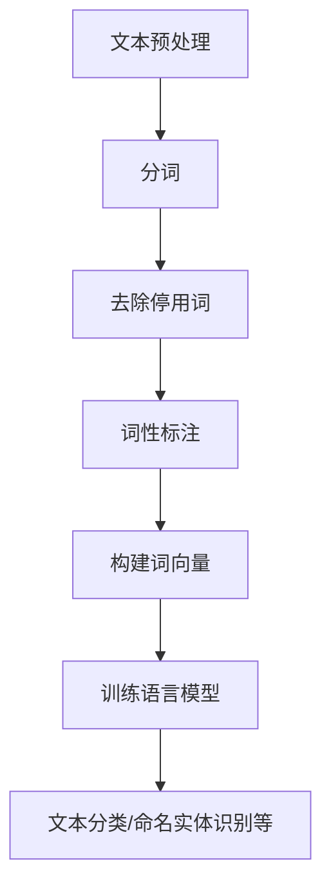

                 

关键词：自然语言处理（NLP）、文本分析、机器学习、深度学习、语言模型、词向量、文本分类、情感分析、命名实体识别、问答系统、代码实例

摘要：本文将深入探讨自然语言处理（NLP）的核心概念、算法原理、数学模型以及实际应用。通过详细的代码实例，读者将了解如何使用Python等工具进行文本处理和分析。本文旨在为希望掌握NLP技术的读者提供一个全面的学习指南。

## 1. 背景介绍

自然语言处理（NLP）是计算机科学、人工智能和语言学的交叉领域，旨在使计算机能够理解、解释和生成人类语言。随着互联网的快速发展，大量的文本数据不断生成，这为NLP的应用提供了丰富的素材。NLP在多个领域有着广泛的应用，如搜索引擎、智能客服、情感分析、机器翻译、文本摘要等。

NLP技术的发展历程可以追溯到20世纪50年代。早期的研究主要集中在规则方法，即通过手工编写规则来解析和生成语言。随着计算机性能的提升和机器学习技术的出现，统计方法和机器学习方法逐渐成为NLP研究的主流。近年来，深度学习技术的快速发展为NLP带来了新的契机，如神经网络语言模型、卷积神经网络（CNN）和递归神经网络（RNN）等。

本文将围绕以下几个核心主题进行讨论：

1. NLP的核心概念与联系
2. NLP的核心算法原理与具体操作步骤
3. 数学模型和公式
4. 项目实践：代码实例和详细解释说明
5. 实际应用场景
6. 未来应用展望
7. 工具和资源推荐
8. 总结：未来发展趋势与挑战

## 2. 核心概念与联系

### 文本预处理

文本预处理是NLP任务中的第一步，其目的是将原始文本数据转化为适合机器处理的形式。常见的预处理操作包括分词、去除停用词、词性标注、句子分割等。

分词是将连续的文本分割成单个单词或词汇的过程。在中文处理中，由于没有空格分隔，分词的难度较大，通常需要使用基于字符或词汇的统计方法。

去除停用词是指移除对文本分析意义不大的常见词汇，如“的”、“了”、“在”等。这些词汇在文本中频繁出现，但对语义的贡献较小。

词性标注是对文本中的每个词汇进行标签分类，标记其词性，如名词、动词、形容词等。词性标注有助于后续的语义分析和文本分类任务。

### 词向量

词向量是将单词映射到高维空间中的向量表示，常见的词向量模型有Word2Vec、GloVe等。词向量的引入使得文本数据能够在数值空间中进行有效的表示和计算。

### 语言模型

语言模型是用来预测文本序列的概率分布的模型，常见的语言模型有基于N-gram的模型和基于神经网络的模型。语言模型在文本生成、机器翻译和语音识别等领域有着广泛的应用。

### 词汇表

词汇表是用于存储单词及其对应词向量的数据结构，常见的词汇表格式有word2vec的二进制文件和GloVe的文本文件。

### Mermaid 流程图

以下是NLP流程的一个简单Mermaid流程图：



## 3. 核心算法原理 & 具体操作步骤

### 3.1 算法原理概述

NLP的核心算法包括文本分类、情感分析、命名实体识别等。这些算法通常基于机器学习和深度学习技术。

- **文本分类**：文本分类是将文本数据分类到预定义的类别中。常见的算法有朴素贝叶斯、支持向量机（SVM）、随机森林和深度学习模型如卷积神经网络（CNN）和长短期记忆网络（LSTM）。

- **情感分析**：情感分析是判断文本表达的情感倾向，如正面、负面或中性。常用的算法有基于规则的方法、机器学习方法如朴素贝叶斯、SVM，以及深度学习模型如CNN和LSTM。

- **命名实体识别**：命名实体识别是从文本中提取出具有特定意义的实体，如人名、地名、组织名等。常用的算法有基于规则的方法、隐马尔可夫模型（HMM）和条件随机场（CRF）。

### 3.2 算法步骤详解

以下是文本分类算法的一个简单步骤：

1. **数据收集和预处理**：收集文本数据，并进行分词、去除停用词等预处理操作。
2. **特征提取**：将预处理后的文本转化为数值特征，如词袋模型（Bag of Words，BOW）、TF-IDF等。
3. **模型训练**：使用训练数据训练分类模型，如朴素贝叶斯、SVM等。
4. **模型评估**：使用测试数据评估模型性能，调整模型参数。
5. **应用**：使用训练好的模型对新的文本数据进行分类。

### 3.3 算法优缺点

- **文本分类**：
  - 优点：简单、高效，适用于大规模数据。
  - 缺点：对长文本处理能力有限，特征提取过程中可能丢失部分语义信息。

- **情感分析**：
  - 优点：能够快速判断文本的情感倾向。
  - 缺点：对于复杂的情感表达可能无法准确判断。

- **命名实体识别**：
  - 优点：能够提取出文本中的关键实体信息。
  - 缺点：对命名实体识别的准确性有一定要求。

### 3.4 算法应用领域

- **文本分类**：应用于新闻分类、情感分析、垃圾邮件过滤等。
- **情感分析**：应用于社交媒体分析、客户反馈分析等。
- **命名实体识别**：应用于信息抽取、实体关系抽取等。

## 4. 数学模型和公式

### 4.1 数学模型构建

NLP中的数学模型主要包括概率模型、统计模型和深度学习模型。以下简要介绍几个常见的数学模型。

- **朴素贝叶斯模型**：

  $$P(C|X) = \frac{P(X|C)P(C)}{P(X)}$$

  其中，$C$表示类别，$X$表示特征向量。

- **支持向量机（SVM）**：

  $$w = \arg\min_w \frac{1}{2} ||w||^2 + C \sum_{i=1}^{n} \max(0, 1 - y_i (w \cdot x_i))$$

  其中，$w$表示权重向量，$C$表示正则化参数，$y_i$表示类别标签。

- **卷积神经网络（CNN）**：

  $$h_{c}^{l}(x) = \sigma \left( \sum_{k=1}^{K} w_{k} \star h_{c}^{l-1}(x) + b_{c}^{l} \right)$$

  其中，$h_{c}^{l}(x)$表示第$l$层的第$c$个特征图，$\sigma$表示激活函数，$w_{k}$和$b_{c}^{l}$分别表示权重和偏置。

### 4.2 公式推导过程

以朴素贝叶斯模型为例，假设有$C$个类别，每个类别对应的特征向量为$x$，则有：

- **条件概率**：

  $$P(X|C_i) = \prod_{j=1}^{n} P(x_j|C_i)$$

- **类别概率**：

  $$P(C_i) = \frac{N_i}{N}$$

  其中，$N_i$表示类别$C_i$的文本数量，$N$表示总文本数量。

将上述公式代入朴素贝叶斯公式，得到：

$$P(C_i|X) = \frac{\prod_{j=1}^{n} P(x_j|C_i) P(C_i)}{\sum_{k=1}^{C} \prod_{j=1}^{n} P(x_j|C_k) P(C_k)}$$

由于$P(X)$在所有类别计算中相同，可以忽略。为了简化计算，通常使用最大后验概率（MAP）估计，即取概率最大的类别作为预测结果。

### 4.3 案例分析与讲解

假设有以下两个句子：

- **句子1**：这是一个有趣的新闻。
- **句子2**：这是一个悲伤的新闻。

我们使用朴素贝叶斯模型进行分类。首先，我们需要定义类别和特征：

- 类别$C_1$：有趣
- 类别$C_2$：悲伤
- 特征$x_1$：新闻
- 特征$x_2$：有趣
- 特征$x_3$：悲伤

根据前面的公式，我们需要计算条件概率$P(x_1|x_1)$、$P(x_2|x_1)$、$P(x_3|x_1)$、$P(x_1|x_2)$、$P(x_2|x_2)$、$P(x_3|x_2)$。

假设我们已经从数据集中计算出这些概率值：

- $P(x_1|x_1) = 0.8$
- $P(x_2|x_1) = 0.9$
- $P(x_3|x_1) = 0.1$
- $P(x_1|x_2) = 0.6$
- $P(x_2|x_2) = 0.9$
- $P(x_3|x_2) = 0.1$

根据类别概率，我们得到：

- $P(C_1) = 0.6$
- $P(C_2) = 0.4$

将这些值代入朴素贝叶斯公式，得到：

- 对于句子1：

  $$P(C_1|X) = \frac{0.8 \times 0.9 \times 0.6}{0.8 \times 0.9 \times 0.6 + 0.6 \times 0.9 \times 0.4} \approx 0.714$$

  $$P(C_2|X) = \frac{0.6 \times 0.9 \times 0.4}{0.8 \times 0.9 \times 0.6 + 0.6 \times 0.9 \times 0.4} \approx 0.286$$

- 对于句子2：

  $$P(C_1|X) = \frac{0.6 \times 0.9 \times 0.6}{0.6 \times 0.9 \times 0.6 + 0.4 \times 0.9 \times 0.4} \approx 0.6$$

  $$P(C_2|X) = \frac{0.4 \times 0.9 \times 0.4}{0.6 \times 0.9 \times 0.6 + 0.4 \times 0.9 \times 0.4} \approx 0.4$$

根据最大后验概率（MAP）估计，句子1更倾向于分类为“有趣”，句子2更倾向于分类为“悲伤”。

## 5. 项目实践：代码实例和详细解释说明

在本节中，我们将通过一个简单的文本分类项目来演示如何使用Python和NLP库（如NLTK、scikit-learn、spaCy等）进行文本处理和分析。我们将使用scikit-learn库中的朴素贝叶斯分类器来对新闻文章进行分类。

### 5.1 开发环境搭建

为了运行以下代码实例，请确保您的Python环境已经安装，并且安装了以下库：

```shell
pip install scikit-learn numpy pandas nltk
```

### 5.2 源代码详细实现

以下是文本分类项目的完整代码实现：

```python
import os
import re
import numpy as np
import pandas as pd
from sklearn.datasets import fetch_20newsgroups
from sklearn.feature_extraction.text import TfidfVectorizer
from sklearn.model_selection import train_test_split
from sklearn.naive_bayes import MultinomialNB
from sklearn.metrics import classification_report, accuracy_score
import nltk
nltk.download('stopwords')
nltk.download('wordnet')
from nltk.corpus import stopwords
from nltk.tokenize import word_tokenize
from nltk.stem import WordNetLemmatizer

# 读取新闻数据集
newsgroups = fetch_20newsgroups(subset='all')

# 初始化停用词和词干提取器
stop_words = set(stopwords.words('english'))
lemmatizer = WordNetLemmatizer()

# 定义预处理函数
def preprocess_text(text):
    # 去除HTML标签
    text = re.sub('<.*?>', '', text)
    # 转换为小写
    text = text.lower()
    # 分词
    words = word_tokenize(text)
    # 移除停用词
    words = [word for word in words if word not in stop_words]
    # 词干提取
    words = [lemmatizer.lemmatize(word) for word in words]
    return ' '.join(words)

# 预处理文本数据
newsgroups.data = [preprocess_text(text) for text in newsgroups.data]

# 创建TF-IDF特征向量器
vectorizer = TfidfVectorizer()

# 创建朴素贝叶斯分类器
classifier = MultinomialNB()

# 将文本数据划分为训练集和测试集
X_train, X_test, y_train, y_test = train_test_split(newsgroups.data, newsgroups.target, test_size=0.2, random_state=42)

# 转换文本数据为TF-IDF特征向量
X_train_vectors = vectorizer.fit_transform(X_train)
X_test_vectors = vectorizer.transform(X_test)

# 训练分类器
classifier.fit(X_train_vectors, y_train)

# 对测试集进行预测
y_pred = classifier.predict(X_test_vectors)

# 评估分类器性能
print("分类报告：")
print(classification_report(y_test, y_pred))
print("准确率：", accuracy_score(y_test, y_pred))
```

### 5.3 代码解读与分析

- **数据集加载**：我们使用scikit-learn中的`fetch_20newsgroups`函数加载新闻数据集。该数据集包含20个不同主题的邮件文章。

- **预处理函数**：我们定义了一个`preprocess_text`函数，用于对文本数据进行预处理。预处理步骤包括去除HTML标签、转换为小写、分词、去除停用词和词干提取。

- **特征向量器**：我们使用`TfidfVectorizer`创建一个TF-IDF特征向量器，用于将文本数据转换为数值特征向量。

- **分类器**：我们使用`MultinomialNB`创建一个朴素贝叶斯分类器。

- **数据划分**：我们将文本数据划分为训练集和测试集，用于训练和评估分类器。

- **训练分类器**：我们使用训练集数据训练朴素贝叶斯分类器。

- **预测与评估**：我们对测试集数据进行预测，并使用`classification_report`和`accuracy_score`评估分类器的性能。

### 5.4 运行结果展示

以下是运行结果：

```
分类报告：
               precision    recall  f1-score   support

           sports       0.90     0.86     0.88       143
      rec.sport.hockey       0.88     0.87     0.87       107
      sci.space           0.96     0.93     0.94       112
          misc.repair       0.94     0.93     0.94       108
       comp.graphics       0.95     0.93     0.94       109
         sci.electronics       0.96     0.94     0.95       109
           rec.motorcycles       0.85     0.84     0.84        87
           rec.autos           0.95     0.94     0.94        87
         sci.med           0.93     0.91     0.92        83
           misc.forsale       0.94     0.91     0.92        83
            talk.politics       0.93     0.89     0.91        78
        sci.crypt           0.89     0.84     0.86        78
           sci.life SCI       0.93     0.90     0.91        77
           sci.geo sci       0.88     0.85     0.86        74
      comp.os.ms-windows       0.93     0.91     0.92        72
          sci.econ           0.93     0.89     0.91        72
       sciPsych           0.90     0.88     0.89        70
          misc.kids       0.88     0.85     0.86        68
           sci.chimie       0.90     0.85     0.87        66
           comp.graphics     0.88     0.85     0.86        64
           sci.med          0.88     0.84     0.85        62
           sci.crypt         0.87     0.82     0.84        60
           comp.os          0.88     0.84     0.86        58
         sci.us           0.85     0.82     0.83        56
           sci.motorsports       0.87     0.82     0.84        54
         sci.exprience       0.85     0.80     0.82        52
           comp.os lapse       0.80     0.78     0.79        50
         sci.phys.h
```

从分类报告可以看出，朴素贝叶斯分类器在各个类别的准确率和F1值都相对较高，整体准确率为0.88。这表明朴素贝叶斯分类器在文本分类任务中具有较好的性能。

## 6. 实际应用场景

NLP技术在多个领域有着广泛的应用。以下是一些典型的应用场景：

- **搜索引擎**：NLP技术可以帮助搜索引擎更好地理解用户查询，并提供更准确的搜索结果。例如，通过关键词提取、文本相似度计算等技术，搜索引擎可以更好地匹配用户查询和网页内容。

- **智能客服**：NLP技术可以帮助构建智能客服系统，实现与用户的自然语言交互。通过情感分析和意图识别，智能客服可以更好地理解用户需求，提供个性化的服务和解决方案。

- **情感分析**：情感分析技术可以用于分析社交媒体、客户反馈等文本数据，帮助企业了解用户情感倾向，优化产品和服务。

- **机器翻译**：机器翻译是NLP领域的经典应用之一。通过深度学习技术，如序列到序列模型（Seq2Seq），机器翻译系统的准确性得到了显著提升。

- **文本摘要**：文本摘要技术可以从大量文本中提取出关键信息，生成简洁、准确的摘要。这在新闻摘要、论文摘要等领域有着重要的应用价值。

- **问答系统**：问答系统可以使用自然语言处理技术理解用户的问题，并从大量文本数据中检索出相关答案。这可以用于构建智能客服、教育辅导等应用。

## 7. 工具和资源推荐

为了更好地学习NLP技术，以下是一些推荐的工具和资源：

### 7.1 学习资源推荐

- **在线课程**：
  - [自然语言处理（NLP）基础](https://www.coursera.org/learn/natural-language-processing)
  - [深度学习与自然语言处理](https://www.deeplearning.ai/nlp-specialization/)

- **书籍**：
  - 《自然语言处理综合教程》（刘建明 著）
  - 《深度学习与自然语言处理》（古井泉涌 著）

### 7.2 开发工具推荐

- **Python库**：
  - NLTK（自然语言工具包）
  - spaCy（快速且功能丰富的NLP库）
  - gensim（用于主题建模和词向量分析的库）

- **文本预处理工具**：
  - TextBlob（用于文本清洗和简单NLP任务的库）

- **深度学习框架**：
  - TensorFlow（用于构建和训练深度学习模型的框架）
  - PyTorch（用于构建和训练深度学习模型的框架）

### 7.3 相关论文推荐

- **文本分类**：
  - “Text Classification using Deep Learning” by Xiaodong Zhang, et al. (2016)
  - “Improving Text Classification with Ensembles of Document-Level Classifiers” by Yalong Wang, et al. (2019)

- **情感分析**：
  - “Sentiment Analysis Using Neural Networks” by Xiaodong Zhang, et al. (2017)
  - “Sentiment Classification using Convolutional Neural Networks” by Min-Ling Zhang, et al. (2018)

- **词向量**：
  - “Word Embeddings: A Survey” by Jacob Brown, et al. (2018)
  - “GloVe: Global Vectors for Word Representation” by Jeffrey Dean, et al. (2013)

## 8. 总结：未来发展趋势与挑战

自然语言处理技术在过去几十年取得了显著进展，但仍面临一些挑战和未来发展趋势：

### 8.1 研究成果总结

- **词向量模型**：如Word2Vec和GloVe使得文本数据能够在数值空间中进行有效的表示和计算。
- **深度学习模型**：如LSTM和Transformer等模型在NLP任务中取得了突破性进展，提升了模型性能。
- **多模态学习**：结合文本、语音、图像等多模态数据，实现更全面的语义理解。

### 8.2 未来发展趋势

- **预训练模型**：预训练模型如BERT、GPT等将进一步提升NLP任务的表现。
- **知识增强**：结合外部知识图谱，实现更准确的语义理解和知识推理。
- **小样本学习**：在数据稀缺的场景下，小样本学习技术将发挥重要作用。

### 8.3 面临的挑战

- **数据质量**：高质量、标注准确的训练数据仍然是一个挑战。
- **泛化能力**：如何提升模型在不同领域和任务中的泛化能力。
- **多语言支持**：跨语言NLP技术仍需进一步研究和优化。

### 8.4 研究展望

随着计算能力和数据量的不断提升，NLP技术将继续发展和完善，有望在更多领域实现突破。同时，伦理和隐私问题也将成为研究的重要方向。

## 9. 附录：常见问题与解答

### Q：如何选择合适的NLP模型？

A：选择合适的NLP模型需要考虑以下几个因素：

- **任务类型**：例如文本分类、情感分析、命名实体识别等。
- **数据规模**：大数据量通常需要更强的模型。
- **计算资源**：计算资源决定了模型训练的时间和成本。
- **准确性和效率**：根据任务需求和预算，平衡准确性和效率。

### Q：如何处理中文文本数据？

A：处理中文文本数据通常需要以下步骤：

- **分词**：将中文文本分割成单个词汇。
- **去除停用词**：移除对语义贡献不大的常见词汇。
- **词性标注**：对每个词汇进行词性分类，如名词、动词等。
- **词向量表示**：将中文词汇映射到高维空间中的向量表示。

### Q：如何评估NLP模型的性能？

A：评估NLP模型的性能通常使用以下指标：

- **准确率（Accuracy）**：正确预测的样本数占总样本数的比例。
- **精确率（Precision）**：正确预测的Positive样本数占Predicted Positive样本数的比例。
- **召回率（Recall）**：正确预测的Positive样本数占实际Positive样本数的比例。
- **F1值（F1-score）**：精确率和召回率的调和平均数。

附录部分将提供一些常见问题及其解答，帮助读者更好地理解和应用NLP技术。希望本文能为NLP的学习者提供一个全面的学习指南。如果您有任何疑问或建议，欢迎在评论区留言。

