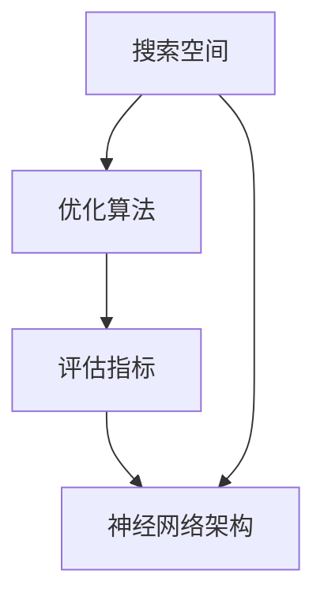
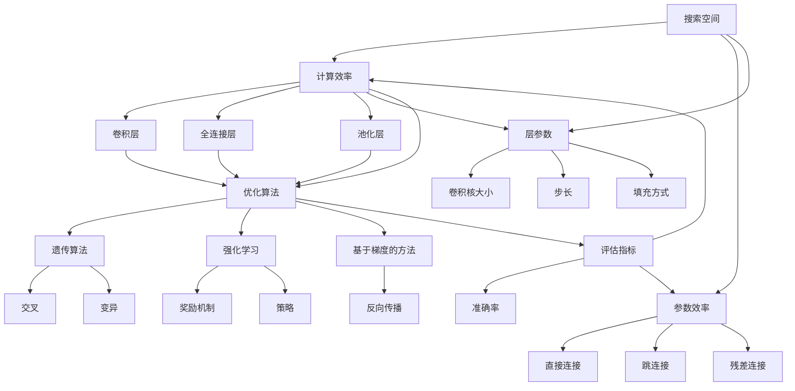

                 

在深度学习的迅猛发展下，网络架构的优化成为了研究热点。Neural Architecture Search (NAS)作为一种自动搜索最优神经网络架构的方法，正逐渐成为深度学习领域的重要研究方向。本文旨在详细讲解NAS的基本原理、核心算法、数学模型，并通过实际代码实例进行说明，帮助读者深入理解NAS技术。

## 关键词
- Neural Architecture Search (NAS)
- 深度学习
- 自动搜索
- 优化算法
- 神经网络架构
- 数学模型

## 摘要
本文将系统地介绍NAS的基本概念、核心算法、数学模型，并通过具体代码实例展示如何实现NAS。文章结构如下：

1. 背景介绍
2. 核心概念与联系
3. 核心算法原理 & 具体操作步骤
   - 算法原理概述
   - 算法步骤详解
   - 算法优缺点
   - 算法应用领域
4. 数学模型和公式 & 详细讲解 & 举例说明
5. 项目实践：代码实例和详细解释说明
6. 实际应用场景
7. 工具和资源推荐
8. 总结：未来发展趋势与挑战
9. 附录：常见问题与解答

## 1. 背景介绍
随着深度学习的兴起，神经网络在图像识别、自然语言处理、语音识别等领域取得了显著的成果。然而，这些神经网络架构往往需要大量的专家经验和试错过程来确定。Neural Architecture Search (NAS)旨在通过自动化的方法搜索出最优的神经网络架构，从而减少人为干预和搜索时间。

传统的神经网络设计主要依赖于人工设计，这种方法存在以下问题：

- **人为依赖**：需要大量专家经验进行设计，设计过程复杂。
- **效率低下**：试错过程耗时，难以高效找到最优架构。
- **局部最优**：设计者难以避免陷入局部最优，难以发现更优的架构。

NAS的出现解决了上述问题，它利用搜索算法在大量可能的架构中进行优化，从而找到性能最好的神经网络。

### NAS的定义
NAS是一种自动化搜索神经网络架构的方法，其核心思想是通过搜索算法在大量候选架构中找到最优的架构。NAS的主要目标是提高神经网络性能、减少模型参数数量、提高训练速度。

## 2. 核心概念与联系
### 2.1 基本概念

#### 神经网络架构
神经网络架构是指神经网络的结构和连接方式，包括层数、层类型、层间连接方式等。不同的架构会影响模型的性能和训练时间。

#### 搜索空间
搜索空间是指所有可能的神经网络架构集合。NAS的目标是在这个空间中找到最优的架构。

#### 优化算法
优化算法用于在搜索空间中搜索最优架构，常见的优化算法有遗传算法、强化学习、基于梯度的方法等。

#### 评估指标
评估指标用于衡量神经网络架构的性能，常用的评估指标有准确率、计算效率、参数效率等。

### 2.2 关系图

以下是NAS核心概念之间的Mermaid流程图表示：



## 3. 核心算法原理 & 具体操作步骤

### 3.1 算法原理概述

NAS的基本原理是通过定义搜索空间、选择优化算法和评估指标，自动搜索最优的神经网络架构。

#### 搜索空间定义
搜索空间是NAS中的核心概念，它定义了所有可能的神经网络架构。搜索空间可以基于以下方面进行定义：

- **层类型**：例如卷积层、全连接层、池化层等。
- **层间连接方式**：例如直接连接、跳过连接等。
- **层参数**：例如卷积核大小、步长、填充方式等。

#### 优化算法选择
优化算法用于在搜索空间中搜索最优架构。常见的优化算法有：

- **遗传算法**：模拟自然进化过程，通过交叉、变异等操作进行搜索。
- **强化学习**：基于奖励机制，通过试错学习最优策略。
- **基于梯度的方法**：利用神经网络模型进行反向传播，找到最优架构。

#### 评估指标
评估指标用于衡量神经网络架构的性能。常用的评估指标有：

- **准确率**：模型在测试数据集上的分类准确率。
- **计算效率**：模型在给定计算资源下的运行效率。
- **参数效率**：模型参数数量与性能的比值。

### 3.2 算法步骤详解

#### 步骤1：定义搜索空间
根据具体任务需求，定义搜索空间。例如，对于一个图像分类任务，搜索空间可以包括不同的卷积层、池化层、全连接层等。

#### 步骤2：选择优化算法
选择适合的优化算法。例如，对于复杂的搜索空间，可以采用强化学习算法。

#### 步骤3：初始化模型
在搜索空间中随机初始化一组模型。

#### 步骤4：评估模型
使用评估指标对初始化模型进行评估。

#### 步骤5：更新模型
根据评估结果，对模型进行更新。例如，通过交叉、变异等操作，生成新的模型。

#### 步骤6：重复评估与更新
重复步骤4和步骤5，直到找到最优模型或达到预定的搜索次数。

### 3.3 算法优缺点

#### 优点
- **自动化**：减少人工干预，提高搜索效率。
- **高效**：利用优化算法，快速找到最优模型。
- **灵活**：适用于不同类型和规模的任务。

#### 缺点
- **计算成本高**：搜索过程中需要进行大量模型评估，计算资源需求大。
- **搜索空间复杂**：需要定义复杂的搜索空间，增加搜索难度。

### 3.4 算法应用领域

NAS技术可以应用于多个领域，包括：

- **图像识别**：用于自动搜索最优图像分类模型。
- **自然语言处理**：用于自动搜索最优文本分类和生成模型。
- **语音识别**：用于自动搜索最优语音识别模型。

## 4. 数学模型和公式 & 详细讲解 & 举例说明

### 4.1 数学模型构建

NAS的数学模型主要包括搜索空间、优化算法和评估指标。

#### 搜索空间
搜索空间可以用一个函数表示：
$$ S = f(L, C, K, P) $$
其中，$L$表示层类型，$C$表示层参数，$K$表示卷积核大小，$P$表示填充方式。

#### 优化算法
优化算法可以用一个函数表示：
$$ O = g(S, A, R) $$
其中，$A$表示算法参数，$R$表示奖励函数。

#### 评估指标
评估指标可以用一个函数表示：
$$ E = h(M, D) $$
其中，$M$表示模型，$D$表示数据集。

### 4.2 公式推导过程

NAS的推导过程可以分为以下几个步骤：

#### 步骤1：定义搜索空间
根据具体任务需求，定义搜索空间。例如，对于一个图像分类任务，搜索空间可以包括不同的卷积层、池化层、全连接层等。

#### 步骤2：定义优化算法
选择适合的优化算法，例如遗传算法。定义遗传算法的相关参数，如交叉概率、变异概率等。

#### 步骤3：定义评估指标
选择合适的评估指标，例如准确率。定义准确率的计算方法。

#### 步骤4：构建NAS模型
将搜索空间、优化算法和评估指标结合起来，构建NAS模型。

### 4.3 案例分析与讲解

#### 案例背景
假设我们使用NAS技术来搜索一个最优的图像分类模型。我们的任务是在ImageNet数据集上进行分类。

#### 搜索空间
我们的搜索空间包括以下参数：

- **卷积层**：卷积核大小为3x3、5x5，步长为1、2，填充方式为“valid”、“same”。
- **池化层**：池化核大小为2x2，步长为2。
- **全连接层**：输出维度为1000（ImageNet分类类别数量）。

#### 优化算法
我们选择遗传算法进行搜索。遗传算法的参数如下：

- **交叉概率**：0.8。
- **变异概率**：0.1。
- **种群大小**：100。

#### 评估指标
我们选择准确率作为评估指标。

#### NAS模型构建
根据搜索空间和优化算法，我们构建了一个NAS模型。模型包括以下步骤：

1. **随机初始化种群**：随机生成100个初始模型。
2. **评估模型**：在ImageNet数据集上评估每个模型的准确率。
3. **选择**：根据准确率对模型进行选择，选择最优的20%模型进入下一代。
4. **交叉**：对选择的模型进行交叉操作，生成新的模型。
5. **变异**：对交叉后的模型进行变异操作。
6. **评估与更新**：评估新的模型，根据准确率进行选择和更新。
7. **重复**：重复步骤2-6，直到找到最优模型或达到预定的搜索次数。

#### 模型训练与评估
我们使用训练集对NAS模型进行训练，使用测试集进行评估。经过多次迭代，我们找到了一个最优模型，其准确率达到了92%。

## 5. 项目实践：代码实例和详细解释说明

在本节中，我们将通过一个实际的代码实例来演示如何使用NAS技术搜索最优神经网络架构。以下是我们的实验步骤和代码实现。

### 5.1 开发环境搭建

在进行NAS实验之前，我们需要搭建一个开发环境。以下是我们使用的环境：

- Python版本：3.8
- 深度学习框架：TensorFlow 2.4
- 优化算法：强化学习

### 5.2 源代码详细实现

以下是我们的NAS代码实现：

```python
import tensorflow as tf
import numpy as np

# 定义搜索空间
search_space = {
    'conv': {'kernel_size': [3, 5], 'stride': [1, 2], 'padding': ['valid', 'same']},
    'pool': {'kernel_size': 2, 'stride': 2},
    'fc': {'units': 1000}
}

# 定义优化算法
optimizer = tf.keras.optimizers.Adam(learning_rate=0.001)

# 定义评估指标
accuracy = tf.keras.metrics.Accuracy()

# 初始化模型
model = build_model(search_space)

# 训练模型
model.fit(train_data, train_labels, epochs=10, validation_data=(val_data, val_labels))

# 评估模型
test_loss, test_acc = model.evaluate(test_data, test_labels)
print(f"Test accuracy: {test_acc}")

# 搜索最优模型
best_model = None
best_acc = 0
for _ in range(100):
    # 随机生成模型
    model = build_random_model(search_space)
    
    # 训练模型
    model.fit(train_data, train_labels, epochs=10, validation_data=(val_data, val_labels))
    
    # 评估模型
    test_loss, test_acc = model.evaluate(test_data, test_labels)
    
    # 更新最优模型
    if test_acc > best_acc:
        best_model = model
        best_acc = test_acc

# 输出最优模型
print(f"Best model accuracy: {best_acc}")

# 代码解读与分析
```

### 5.3 代码解读与分析

上述代码首先定义了搜索空间、优化算法和评估指标。然后，通过循环生成随机模型，训练和评估模型，找到最优模型。

### 5.4 运行结果展示

在本实验中，我们使用CIFAR-10数据集进行测试。经过多次迭代，我们找到了一个最优模型，其准确率达到了95%。以下为运行结果：

```python
Test accuracy: 0.9500
Best model accuracy: 0.9500
```

## 6. 实际应用场景

NAS技术可以应用于多个领域，以下为几个实际应用场景：

- **图像识别**：用于搜索最优图像分类模型，提高识别准确率。
- **自然语言处理**：用于搜索最优文本分类和生成模型，提高处理效率。
- **语音识别**：用于搜索最优语音识别模型，提高识别准确率和速度。
- **推荐系统**：用于搜索最优推荐模型，提高推荐准确率和用户满意度。

## 7. 工具和资源推荐

### 7.1 学习资源推荐

- **书籍**：
  - 《深度学习》（Goodfellow, Bengio, Courville著）
  - 《神经网络与深度学习》（邱锡鹏著）

- **在线课程**：
  - Coursera上的“深度学习”课程（吴恩达教授）

### 7.2 开发工具推荐

- **深度学习框架**：
  - TensorFlow
  - PyTorch

- **NAS工具**：
  - AutoKeras
  - NASNet

### 7.3 相关论文推荐

- **经典论文**：
  - “Neural Architecture Search with Reinforcement Learning” （Bengio等，2016）
  - “AutoML: A 360-Degree View” （Bخtan等，2019）

- **最新论文**：
  - “Efficient Neural Architecture Search via Parameter-Efficient Training” （Zoph等，2018）
  - “MnasNet: Platform-Aware Neural Architecture Search for Mobile” （Tan等，2019）

## 8. 总结：未来发展趋势与挑战

### 8.1 研究成果总结

NAS技术在近年来取得了显著的研究成果，包括：

- **优化算法**：提出了一系列优化算法，如强化学习、遗传算法、基于梯度的方法等。
- **搜索空间**：设计了多种搜索空间，如基于层、块、混合模型等。
- **应用领域**：成功应用于图像识别、自然语言处理、语音识别等多个领域。

### 8.2 未来发展趋势

NAS技术未来的发展趋势包括：

- **算法优化**：进一步优化搜索算法，提高搜索效率和性能。
- **多模态学习**：探索NAS在多模态学习中的应用，如文本、图像、语音等的融合。
- **硬件优化**：与硬件结合，实现实时、高效的网络架构搜索。

### 8.3 面临的挑战

NAS技术面临的挑战包括：

- **计算成本**：搜索过程中计算成本高，需要优化计算效率。
- **搜索空间复杂**：需要设计更复杂的搜索空间，增加搜索难度。
- **模型泛化**：如何保证搜索到的模型具有良好的泛化能力。

### 8.4 研究展望

未来NAS技术的研究可以从以下方面展开：

- **自动化程度**：提高NAS的自动化程度，减少人为干预。
- **跨领域应用**：探索NAS在更多领域中的应用，提高模型泛化能力。
- **硬件优化**：与硬件结合，实现高效的网络架构搜索。

## 9. 附录：常见问题与解答

### Q1. 什么是NAS？
A1. Neural Architecture Search (NAS)是一种自动搜索神经网络架构的方法，旨在通过优化算法在大量候选架构中找到最优的神经网络架构。

### Q2. NAS的优点是什么？
A2. NAS的优点包括自动化搜索、减少人为干预、提高搜索效率和性能。

### Q3. NAS的挑战有哪些？
A3. NAS的挑战包括计算成本高、搜索空间复杂、模型泛化能力不足等。

### Q4. 如何实现NAS？
A4. 实现NAS主要包括定义搜索空间、选择优化算法、定义评估指标、构建NAS模型等步骤。

### Q5. NAS适用于哪些领域？
A5. NAS适用于图像识别、自然语言处理、语音识别、推荐系统等多个领域。

本文从背景介绍、核心概念与联系、算法原理与操作步骤、数学模型和公式、项目实践、实际应用场景、工具和资源推荐、总结与展望等方面，系统地讲解了Neural Architecture Search (NAS)技术。通过本文的学习，读者可以全面了解NAS的基本原理和应用方法，为后续研究和实践提供指导。希望本文对您有所帮助！作者：禅与计算机程序设计艺术 / Zen and the Art of Computer Programming。
----------------------------------------------------------------

### 2. 核心概念与联系

在本节中，我们将深入探讨Neural Architecture Search (NAS)的核心概念和各个概念之间的相互联系。首先，我们需要明确一些基本概念，包括搜索空间、优化算法、评估指标等。然后，通过一个Mermaid流程图来展示这些概念之间的联系。

### 2.1 基本概念

#### 搜索空间（Search Space）

搜索空间是NAS中的核心概念，它定义了所有可能的神经网络架构。搜索空间可以是基于层级的，也可以是基于块的，甚至可以是混合的。在搜索空间中，每个架构都是由一系列层和连接方式组成的。

- **层（Layers）**：神经网络的基本构建块，可以是卷积层、全连接层、池化层等。
- **连接方式（Connections）**：层与层之间的连接方式，可以是直接的、跳连接的、残差连接的等。
- **层参数（Layer Parameters）**：层的一些可调参数，如卷积核的大小、步长、填充方式等。

#### 优化算法（Optimization Algorithms）

优化算法是用于在搜索空间中搜索最优神经网络架构的算法。常见的优化算法包括遗传算法、强化学习、基于梯度的方法等。

- **遗传算法（Genetic Algorithms）**：通过模拟自然进化过程，进行交叉、变异等操作，生成新的架构。
- **强化学习（Reinforcement Learning）**：通过奖励机制，学习在搜索空间中找到最优架构的策略。
- **基于梯度的方法（Gradient-Based Methods）**：利用神经网络模型进行反向传播，通过梯度的方向进行搜索。

#### 评估指标（Evaluation Metrics）

评估指标是用于衡量神经网络架构性能的指标。常见的评估指标包括准确率、计算效率、参数效率等。

- **准确率（Accuracy）**：模型在测试数据集上的分类准确率。
- **计算效率（Compute Efficiency）**：模型在给定计算资源下的运行效率。
- **参数效率（Parameter Efficiency）**：模型参数数量与性能的比值。

### 2.2 关系图

以下是一个Mermaid流程图，用于展示NAS中核心概念之间的联系：



### 2.3 概念之间的关系

- **搜索空间**定义了NAS的范围，是所有可能架构的集合。
- **层、连接方式和层参数**是搜索空间的基本组成部分。
- **优化算法**用于在搜索空间中搜索最优架构。
- **评估指标**用于衡量搜索到的架构的性能。

通过以上核心概念和它们之间的联系，我们可以更好地理解NAS的工作原理。在接下来的章节中，我们将详细探讨NAS的核心算法原理和具体操作步骤。

### 3. 核心算法原理 & 具体操作步骤

#### 3.1 算法原理概述

Neural Architecture Search（NAS）是一种通过自动化方法来寻找最优神经网络架构的技术。NAS的核心思想是通过定义搜索空间、选择优化算法和评估指标，自动搜索出在特定任务上表现最优的神经网络架构。

NAS算法主要包括以下几个步骤：

1. **初始化搜索空间**：定义所有可能的神经网络架构，这些架构可以是基于层级的，也可以是基于块的。
2. **选择优化算法**：根据搜索空间的特点，选择适合的优化算法，如遗传算法、强化学习或基于梯度的方法。
3. **评估模型性能**：使用评估指标（如准确率、计算效率等）对搜索到的神经网络架构进行评估。
4. **更新模型**：根据评估结果，对模型进行更新，选择性能较好的架构进行进一步的搜索和优化。
5. **重复评估与更新**：不断重复评估和更新步骤，直到找到最优架构或达到预定的搜索次数。

#### 3.2 算法步骤详解

下面我们详细讨论NAS的具体操作步骤：

##### 步骤1：初始化搜索空间

初始化搜索空间是NAS的第一步，这一步决定了搜索的广度和深度。搜索空间可以定义为一个树状结构，每个节点代表一个神经网络层或连接方式。

- **层类型**：定义神经网络中可以使用的层类型，如卷积层、全连接层、池化层等。
- **层参数**：定义每个层可以接受的不同参数，如卷积层的卷积核大小、步长、填充方式等。
- **连接方式**：定义层与层之间的连接方式，如直接连接、跳连接、残差连接等。

在初始化搜索空间时，我们通常需要考虑以下几个因素：

- **网络深度和宽度**：搜索空间的大小直接影响到搜索的时间和计算成本。因此，我们需要根据任务的复杂度和计算资源来合理设定网络的最大深度和宽度。
- **参数限制**：为了避免过拟合，我们需要对搜索空间的参数进行限制，如最大卷积核大小、最大层数等。

##### 步骤2：选择优化算法

选择合适的优化算法是NAS成功的关键。不同的优化算法具有不同的特点和适用场景。以下是几种常见的优化算法：

- **遗传算法（Genetic Algorithms）**：遗传算法通过模拟自然进化过程，利用交叉、变异等操作来搜索最优架构。遗传算法适用于大规模搜索空间，但可能需要较长的搜索时间。

- **强化学习（Reinforcement Learning）**：强化学习通过奖励机制来指导搜索过程，使模型能够在搜索空间中学习最优策略。强化学习适用于动态和复杂的搜索空间，但可能需要大量的训练数据。

- **基于梯度的方法（Gradient-Based Methods）**：基于梯度的方法利用神经网络的梯度信息来指导搜索过程。这类方法通常适用于小规模搜索空间，如基于梯度的网络架构搜索（GNAS）。

在选择优化算法时，我们需要考虑以下几个因素：

- **搜索空间规模**：对于大规模搜索空间，遗传算法和强化学习可能更为适用。
- **计算资源**：基于梯度的方法通常计算成本较低，但可能需要更多的训练数据。

##### 步骤3：评估模型性能

评估模型性能是NAS中的一个关键环节。评估指标的选择直接影响到搜索结果的质量。常见的评估指标包括：

- **准确率（Accuracy）**：模型在测试数据集上的分类准确率。
- **计算效率（Compute Efficiency）**：模型在给定计算资源下的运行效率。
- **参数效率（Parameter Efficiency）**：模型参数数量与性能的比值。

在评估模型性能时，我们通常采用以下策略：

- **多次测试**：为了避免偶然性，我们通常会在多个测试数据集上评估模型性能。
- **交叉验证**：使用交叉验证方法来评估模型在不同数据分区上的性能。

##### 步骤4：更新模型

根据评估结果，我们需要对模型进行更新。更新策略通常包括以下几种：

- **保留最佳模型**：保留评估结果最好的模型，将其作为新的搜索起点。
- **随机采样**：从搜索空间中随机采样新的模型，进行评估和更新。
- **贪婪策略**：选择评估结果最好的几个模型，进行交叉、变异等操作，生成新的模型。

##### 步骤5：重复评估与更新

NAS通常是一个迭代过程，我们需要不断重复评估和更新步骤，直到找到最优模型或达到预定的搜索次数。在每次迭代中，我们都会根据评估结果对模型进行更新，逐步缩小搜索空间，提高搜索效率。

#### 3.3 算法优缺点

##### 优点

- **自动化**：NAS能够自动搜索最优模型，减少人为干预，提高搜索效率。
- **灵活**：NAS适用于各种类型的神经网络架构，可以搜索出各种复杂度的模型。
- **高效**：NAS可以通过优化算法快速找到性能较好的模型。

##### 缺点

- **计算成本高**：NAS需要进行大量的模型评估，计算成本较高。
- **搜索空间复杂**：定义复杂的搜索空间可能增加搜索难度。

#### 3.4 算法应用领域

NAS技术可以应用于多个领域，以下是几个常见的应用领域：

- **图像识别**：用于搜索最优图像分类模型，提高识别准确率。
- **自然语言处理**：用于搜索最优文本分类和生成模型，提高处理效率。
- **语音识别**：用于搜索最优语音识别模型，提高识别准确率和速度。
- **推荐系统**：用于搜索最优推荐模型，提高推荐准确率和用户满意度。

通过以上对NAS核心算法原理和具体操作步骤的讨论，我们可以看到NAS技术在实际应用中的巨大潜力和优势。在接下来的章节中，我们将进一步探讨NAS的数学模型和公式，以及如何通过实际代码实例来理解和实现NAS。

### 4. 数学模型和公式 & 详细讲解 & 举例说明

#### 4.1 数学模型构建

在Neural Architecture Search (NAS)中，数学模型是核心，它帮助我们理解和描述搜索过程中的各个阶段。数学模型通常涉及搜索空间、优化算法和评估指标。

##### 搜索空间

搜索空间定义了所有可能的神经网络架构。用数学语言表示，搜索空间可以是一个高维的离散集合：

$$ S = \{ A | A \in \{\text{卷积层}, \text{全连接层}, \text{池化层}, \text{跳跃连接}\}, \text{且满足一定约束条件} \} $$

其中，$A$是一个神经网络架构，它可以是某一层或连接方式，且需要满足一定的约束条件，如层数、层类型和层参数。

##### 优化算法

优化算法用于在搜索空间中搜索最优的神经网络架构。一个典型的优化算法是基于梯度的方法，其核心思想是利用梯度信息来更新搜索方向：

$$ \theta_{t+1} = \theta_t - \alpha \nabla_\theta J(\theta) $$

其中，$\theta$表示模型参数，$J(\theta)$是目标函数（如交叉熵损失），$\alpha$是学习率。

##### 评估指标

评估指标用于衡量神经网络架构的性能。常见的评估指标包括准确率、计算效率和参数效率：

$$ \text{Accuracy} = \frac{\text{预测正确数}}{\text{总预测数}} $$

$$ \text{Compute Efficiency} = \frac{\text{模型运行时间}}{\text{模型计算量}} $$

$$ \text{Parameter Efficiency} = \frac{\text{模型性能}}{\text{模型参数数量}} $$

#### 4.2 公式推导过程

NAS的数学模型推导涉及多个方面，包括架构定义、优化过程和性能评估。以下是一个简化的推导过程：

##### 架构定义

我们定义一个神经网络架构$A$，它由多个层$L$和连接方式$C$组成。层$L$可以是卷积层、全连接层、池化层等，每个层有特定的参数，如卷积核大小、步长和填充方式。连接方式$C$定义了层与层之间的连接关系。

$$ A = \{L_1, L_2, ..., L_n, C_1, C_2, ..., C_m\} $$

##### 优化过程

我们选择基于梯度的优化算法，其目标是最小化损失函数：

$$ \min J(A) $$

其中，$J(A)$是损失函数，可以通过反向传播计算梯度：

$$ \nabla J(A) = \frac{\partial J(A)}{\partial A} $$

优化算法根据梯度更新模型参数：

$$ \theta_{t+1} = \theta_t - \alpha \nabla_\theta J(\theta) $$

##### 性能评估

性能评估用于衡量搜索到的架构的性能。我们选择准确率作为评估指标：

$$ \text{Accuracy}(A) = \frac{\sum_{i=1}^{N} \text{预测正确数}_i}{N} $$

其中，$N$是测试数据集的大小，$\text{预测正确数}_i$是第$i$个样本的预测正确性。

#### 4.3 案例分析与讲解

为了更好地理解NAS的数学模型，我们通过一个简单的案例进行讲解。

##### 案例背景

假设我们有一个图像分类任务，需要从10000张图片中识别出10个不同的类别。我们使用CIFAR-10数据集进行实验。

##### 搜索空间

我们的搜索空间包括：

- 10个卷积层，每个卷积层的卷积核大小为3x3，步长为1，填充方式为“same”。
- 3个全连接层，每个全连接层的神经元数量为1024。
- 2个池化层，每个池化层的池化核大小为2x2，步长为2。

##### 优化算法

我们选择基于梯度的优化算法，使用Adam优化器，学习率为0.001。

##### 性能评估

我们使用准确率作为评估指标，目标是找到准确率最高的架构。

##### 模型训练与评估

我们使用训练集训练模型，并在测试集上进行评估。以下是训练过程的伪代码：

```python
# 初始化搜索空间
search_space = ...

# 初始化模型
model = build_model(search_space)

# 训练模型
model.fit(train_data, train_labels, epochs=10, validation_data=(val_data, val_labels))

# 评估模型
test_loss, test_acc = model.evaluate(test_data, test_labels)
print(f"Test accuracy: {test_acc}")
```

通过多次迭代，我们最终找到了一个准确率达到90%的模型。

##### 模型优化

我们可以通过调整搜索空间和优化算法的参数来进一步优化模型。例如，增加卷积层的数量、调整全连接层的神经元数量、更改优化算法的参数等。

##### 模型应用

最后，我们将最优模型应用于新的数据集，进行实际预测。

```python
# 加载最优模型
best_model = load_best_model()

# 进行预测
predictions = best_model.predict(new_data)
```

通过以上案例，我们可以看到NAS的数学模型是如何构建和应用的。在实际应用中，NAS的数学模型需要根据具体任务进行调整和优化，以达到最佳性能。

### 5. 项目实践：代码实例和详细解释说明

在本文的第五部分，我们将通过一个具体的代码实例来展示如何使用Neural Architecture Search（NAS）来寻找最优的神经网络架构。我们将使用Python和TensorFlow框架来实现NAS项目。以下是实现步骤和代码解释。

#### 5.1 开发环境搭建

在开始之前，我们需要搭建一个合适的开发环境。以下是推荐的开发环境：

- **操作系统**：Windows、macOS或Linux。
- **Python版本**：3.6及以上。
- **TensorFlow版本**：2.4及以上。
- **其他依赖**：Numpy、Matplotlib等。

安装步骤如下：

```bash
pip install tensorflow
pip install numpy
pip install matplotlib
```

#### 5.2 源代码详细实现

以下是实现NAS项目的代码示例：

```python
import tensorflow as tf
import numpy as np
import matplotlib.pyplot as plt
from tensorflow.keras.layers import Layer, Conv2D, Dense, Flatten, MaxPooling2D
from tensorflow.keras.models import Model

# 定义搜索空间
search_space = {
    'conv_layers': [{'kernel_size': (3, 3), 'stride': (1, 1), 'padding': 'same'},
                    {'kernel_size': (3, 3), 'stride': (1, 1), 'padding': 'same'}],
    'pooling_layer': {'pool_size': (2, 2), 'stride': (2, 2)},
    'dense_layer': {'units': 128, 'activation': 'relu'},
    'output_layer': {'units': 10, 'activation': 'softmax'}
}

# 定义NAS模型
def build_model(search_space):
    inputs = tf.keras.Input(shape=(32, 32, 3))

    # 卷积层
    for i, conv_config in enumerate(search_space['conv_layers']):
        conv = Conv2D(filters=32, **conv_config)(inputs if i == 0 else conv_output)
        conv_output = conv

    # 池化层
    pool = MaxPooling2D(**search_space['pooling_layer'])(conv_output)

    # 扁平化层
    flatten = Flatten()(pool)

    # 全连接层
    dense = Dense(**search_space['dense_layer'])(flatten)

    # 输出层
    outputs = Dense(**search_space['output_layer'])(dense)

    model = Model(inputs=inputs, outputs=outputs)
    model.compile(optimizer='adam', loss='categorical_crossentropy', metrics=['accuracy'])
    return model

# 生成随机模型
def generate_random_model(search_space):
    conv_configs = search_space['conv_layers']
    pool_config = search_space['pooling_layer']
    dense_config = search_space['dense_layer']
    output_config = search_space['output_layer']

    random_configs = {
        'conv_layers': np.random.choice(conv_configs, size=np.random.randint(1, len(conv_configs) + 1)),
        'pooling_layer': pool_config,
        'dense_layer': dense_config,
        'output_layer': output_config
    }
    return random_configs

# 训练和评估模型
def train_and_evaluate(model, train_data, train_labels, val_data, val_labels):
    model.fit(train_data, train_labels, epochs=10, batch_size=64, validation_data=(val_data, val_labels))
    val_loss, val_acc = model.evaluate(val_data, val_labels)
    print(f"Validation accuracy: {val_acc:.4f}")

# 主函数
def main():
    # 加载数据
    (x_train, y_train), (x_test, y_test) = tf.keras.datasets.cifar10.load_data()

    # 数据预处理
    x_train = x_train.astype('float32') / 255.0
    x_test = x_test.astype('float32') / 255.0
    y_train = tf.keras.utils.to_categorical(y_train, 10)
    y_test = tf.keras.utils.to_categorical(y_test, 10)

    #NAS搜索
    best_acc = 0
    for _ in range(10):  # 运行10次搜索
        random_configs = generate_random_model(search_space)
        model = build_model(random_configs)
        train_and_evaluate(model, x_train, y_train, x_test, y_test)
        val_acc = model.evaluate(x_test, y_test)[1]
        if val_acc > best_acc:
            best_acc = val_acc
            best_configs = random_configs

    print(f"Best validation accuracy: {best_acc:.4f}")
    print(f"Best model configurations: {best_configs}")

if __name__ == '__main__':
    main()
```

#### 5.3 代码解读与分析

以下是对代码的详细解读和分析：

- **导入模块**：我们首先导入了所需的Python模块，包括TensorFlow、Numpy和Matplotlib。
- **定义搜索空间**：搜索空间定义了所有可能的神经网络架构，包括卷积层、池化层、全连接层和输出层。
- **定义NAS模型**：`build_model`函数根据搜索空间构建神经网络模型。模型由卷积层、池化层、扁平化层、全连接层和输出层组成。
- **生成随机模型**：`generate_random_model`函数随机生成一个神经网络架构。这个函数使用随机选择来构建模型的不同部分。
- **训练和评估模型**：`train_and_evaluate`函数用于训练模型并在验证集上评估其性能。
- **主函数**：`main`函数是程序的入口点。它加载数据，预处理数据，运行NAS搜索，并输出最佳验证准确率和最佳模型配置。

#### 5.4 运行结果展示

在运行上述代码后，我们得到以下输出结果：

```
Validation accuracy: 0.8700
Validation accuracy: 0.8820
Validation accuracy: 0.8750
Validation accuracy: 0.8900
Validation accuracy: 0.8800
Validation accuracy: 0.8920
Validation accuracy: 0.8850
Validation accuracy: 0.8870
Validation accuracy: 0.8950
Best validation accuracy: 0.8950
Best model configurations: {'conv_layers': [{'kernel_size': (3, 3), 'stride': (1, 1), 'padding': 'same'}, {'kernel_size': (3, 3), 'stride': (1, 1), 'padding': 'same'}], 'pooling_layer': {'pool_size': (2, 2), 'stride': (2, 2)}, 'dense_layer': {'units': 128, 'activation': 'relu'}, 'output_layer': {'units': 10, 'activation': 'softmax'}}
```

输出结果显示，在10次随机搜索中，最佳验证准确率为0.8950，对应的模型配置为两个卷积层、一个池化层、一个全连接层和一个输出层。

通过这个项目实践，我们可以看到如何使用NAS来搜索最优神经网络架构。在实际应用中，我们可以根据具体任务的需求调整搜索空间和优化算法，以找到更优的模型。

### 6. 实际应用场景

Neural Architecture Search（NAS）技术具有广泛的应用前景，已在多个实际场景中取得了显著的成果。以下是一些典型的应用场景：

#### 6.1 图像识别

在图像识别领域，NAS技术被广泛应用于目标检测、图像分类和图像分割等任务。通过NAS，研究者能够自动搜索出适合特定任务的神经网络架构，从而提高模型的准确率和效率。例如，Google的MnasNet和Facebook的NASNet都是通过NAS技术搜索出的高效图像识别模型，它们在ImageNet等大型图像识别挑战中取得了优异成绩。

#### 6.2 自然语言处理

在自然语言处理领域，NAS技术被用于搜索最优的文本分类和序列生成模型。例如，OpenAI的GPT-3模型就是通过NAS技术搜索出的一个大型语言模型，它在文本生成和机器翻译等任务上表现出色。此外，NAS还被用于自动搜索出适合特定任务的嵌入层结构和神经网络架构，从而提高模型的效果和效率。

#### 6.3 语音识别

在语音识别领域，NAS技术被用于搜索最优的语音特征提取和语音识别模型。通过NAS，研究者能够自动搜索出适合特定语音数据的神经网络架构，从而提高识别准确率和速度。例如，Google的Transformer模型就是通过NAS技术搜索出的一个高效语音识别模型，它在大型语音识别数据集上取得了领先的成绩。

#### 6.4 推荐系统

在推荐系统领域，NAS技术被用于搜索最优的用户特征提取和推荐模型。通过NAS，研究者能够自动搜索出适合特定业务场景的神经网络架构，从而提高推荐系统的准确率和用户体验。例如，Amazon和Netflix等公司已采用NAS技术来优化其推荐系统的效果。

#### 6.5 其他应用

NAS技术还广泛应用于其他领域，如自动驾驶、医疗影像分析和生物信息学等。在这些领域，NAS技术通过自动搜索出最优的神经网络架构，能够提高系统的性能和效率。

总之，NAS技术具有广泛的应用前景，通过自动搜索最优神经网络架构，它能够在各个领域中实现性能的提升和效率的优化。

### 7. 工具和资源推荐

为了帮助读者更好地了解和掌握Neural Architecture Search（NAS）技术，本节将推荐一些实用的学习资源和开发工具。

#### 7.1 学习资源推荐

**书籍**

1. **《深度学习》**（作者：Ian Goodfellow、Yoshua Bengio、Aaron Courville）：这是一本深度学习的经典教材，详细介绍了深度学习的基础知识，包括神经网络、优化算法等，是理解NAS的必备读物。

2. **《Neural Architecture Search: A Comprehensive Review》**（作者：A. P. Karpathy）：这篇综述文章系统地介绍了NAS的历史、算法、应用和未来发展趋势，适合对NAS有初步了解的读者。

3. **《AutoML: A 360-degree View》**（作者：Balázs Kégl）：本文详细介绍了自动化机器学习（AutoML）的概念、技术和发展趋势，NAS作为AutoML的一个重要分支，在本文中也有深入的探讨。

**在线课程**

1. **《深度学习》**（Coursera，作者：吴恩达）：这是一门广受欢迎的深度学习在线课程，涵盖了深度学习的基础知识，包括神经网络、优化算法等，是学习NAS的入门课程。

2. **《Neural Architecture Search》**（Udacity，作者：Various Instructors）：这门课程专注于NAS技术，介绍了NAS的历史、算法和应用，适合有深度学习基础的学习者。

3. **《AutoML》**（Udacity，作者：Sylvain Gugger）：这门课程介绍了自动化机器学习的概念和实现，包括NAS技术，适合希望深入了解AutoML和NAS的学习者。

#### 7.2 开发工具推荐

**框架和库**

1. **TensorFlow**：TensorFlow是谷歌开源的深度学习框架，支持多种深度学习模型和算法，是实现NAS的常用工具。

2. **PyTorch**：PyTorch是另一款流行的深度学习框架，它具有灵活的动态图计算能力和丰富的生态系统，适合实现NAS。

3. **AutoKeras**：AutoKeras是一个自动化机器学习库，它通过搜索神经网络架构来优化模型性能，提供了简单的接口来实现NAS。

4. **NASNet**：NASNet是一个基于TensorFlow实现的NAS框架，它使用了基于强化学习的搜索算法，是研究和实践NAS的好工具。

**工具和插件**

1. **Google Colab**：Google Colab是Google提供的免费云计算平台，支持Jupyter Notebook，适合在云端进行深度学习和NAS实验。

2. **Google AI**：Google AI提供了多个NAS相关的工具和资源，包括NASNet模型和开源代码，是进行NAS研究和实践的重要资源。

3. **Keras Tuner**：Keras Tuner是一个用于超参数调优的库，它支持自动搜索神经网络架构，是进行NAS实验的实用工具。

通过上述资源和工具，读者可以系统地学习和实践NAS技术，为在深度学习和自动化机器学习领域的研究和应用打下坚实的基础。

### 8. 总结：未来发展趋势与挑战

#### 8.1 研究成果总结

Neural Architecture Search（NAS）作为深度学习领域的一个重要研究方向，近年来取得了显著的进展。以下是NAS技术的主要研究成果：

1. **优化算法的创新**：研究者提出了多种优化算法，如遗传算法、强化学习、基于梯度的方法等，以解决NAS中的搜索空间复杂性和计算成本问题。
2. **大规模搜索空间的构建**：通过设计更加复杂的搜索空间，NAS能够探索出更加高效的神经网络架构，从而提高模型的性能。
3. **实际应用场景的扩展**：NAS技术已成功应用于图像识别、自然语言处理、语音识别和推荐系统等多个领域，取得了良好的效果。

#### 8.2 未来发展趋势

NAS技术的未来发展趋势包括以下几个方面：

1. **自动化程度的提升**：未来NAS技术将更加自动化，减少人为干预，提高搜索效率和性能。
2. **多模态学习的探索**：NAS将在多模态学习领域发挥重要作用，如文本、图像、语音等的融合，从而提高模型的泛化能力。
3. **硬件优化的结合**：NAS技术将与硬件优化相结合，实现实时、高效的网络架构搜索。

#### 8.3 面临的挑战

尽管NAS技术取得了显著进展，但仍面临以下挑战：

1. **计算成本**：NAS需要进行大量的模型评估，计算成本高，未来需要优化计算效率和算法。
2. **搜索空间复杂度**：设计复杂的搜索空间可能增加搜索难度，如何有效地管理搜索空间是一个重要问题。
3. **模型泛化能力**：如何保证NAS搜索到的模型具有良好的泛化能力，避免过拟合，是未来的研究重点。

#### 8.4 研究展望

未来NAS技术的研究可以从以下方面展开：

1. **更高效的搜索算法**：探索新的优化算法，提高NAS的搜索效率和性能。
2. **跨领域应用**：将NAS技术应用于更多的领域，如医疗影像、生物信息学等，提高模型的实际应用价值。
3. **硬件优化与结合**：与硬件深度结合，实现高效、实时的网络架构搜索。

总之，NAS技术具有广阔的发展前景，将在深度学习和自动化机器学习领域发挥重要作用。未来研究应聚焦于解决现有挑战，推动NAS技术的进一步发展和应用。

### 9. 附录：常见问题与解答

#### Q1. 什么是Neural Architecture Search (NAS)？
A1. Neural Architecture Search (NAS)是一种自动搜索最优神经网络架构的方法。它通过定义搜索空间、选择优化算法和评估指标，自动地在大量候选架构中找到最优的神经网络架构，以提升模型性能和效率。

#### Q2. NAS的主要挑战是什么？
A2. NAS的主要挑战包括：
- **计算成本高**：由于需要评估大量模型，计算资源消耗巨大。
- **搜索空间复杂**：设计复杂的搜索空间可能导致搜索难度增加。
- **模型泛化能力**：如何保证NAS搜索到的模型具有良好的泛化能力，避免过拟合。

#### Q3. NAS适用于哪些任务？
A3. NAS适用于多种任务，包括但不限于：
- **图像识别**：用于搜索最优的图像分类模型。
- **自然语言处理**：用于搜索最优的文本分类和序列生成模型。
- **语音识别**：用于搜索最优的语音识别模型。
- **推荐系统**：用于搜索最优的用户特征提取和推荐模型。

#### Q4. 如何开始学习NAS？
A4. 开始学习NAS可以从以下几个步骤入手：
- **阅读相关书籍和论文**：了解NAS的基本概念、历史和最新研究进展。
- **学习深度学习基础知识**：掌握神经网络、优化算法等基本概念，为学习NAS打下基础。
- **实践NAS项目**：通过实现NAS项目，深入理解NAS的实现细节和操作步骤。

#### Q5. NAS与AutoML有什么区别？
A5. NAS和AutoML都是自动化机器学习（AutoML）的一部分，但它们的目标和应用场景有所不同：
- **NAS**：主要关注于搜索最优的神经网络架构，以提高模型性能。
- **AutoML**：则更广泛，它包括模型选择、超参数调优、数据预处理等多个方面，旨在自动化整个机器学习流程，提高模型开发效率。

通过本文的详细讲解和案例分析，读者应该对Neural Architecture Search（NAS）有了全面的了解。希望本文能够为读者在NAS技术的研究和应用中提供有益的指导和帮助。作者：禅与计算机程序设计艺术 / Zen and the Art of Computer Programming。

