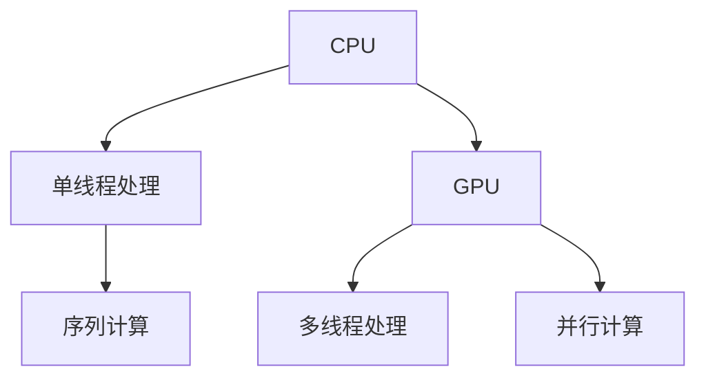

                 

关键词：Nvidia、AI、深度学习、GPU、计算能力、技术革新、市场地位

> 摘要：本文将深入探讨Nvidia在人工智能领域的主导地位，分析其在硬件和软件层面的创新，以及其对AI行业的深远影响。我们将回顾Nvidia的历史，探讨其在GPU计算和深度学习技术方面的突破，并展望其未来在AI领域的应用前景。

## 1. 背景介绍

Nvidia成立于1993年，最初以显卡制造起家，逐步发展为全球领先的GPU（图形处理器单元）制造商。随着计算机图形处理需求的增长，Nvidia的产品线不断扩展，从桌面显卡到专业工作站显卡，从游戏到专业设计领域，Nvidia都占据了重要位置。然而，Nvidia的真正突破是在AI领域。

AI的兴起始于2006年，当时深度学习成为研究热点。Nvidia意识到深度学习对计算能力的需求，开始将GPU用于加速计算。这一战略决策使得Nvidia在AI计算领域获得了先发优势。

## 2. 核心概念与联系

为了理解Nvidia在AI领域的主导地位，我们首先需要了解几个核心概念：GPU、深度学习和并行计算。

### 2.1 GPU与CPU

GPU（图形处理器单元）与CPU（中央处理器）不同，它设计用于处理大量的并行任务。在深度学习任务中，GPU能够同时处理大量的矩阵运算，这使得其成为深度学习模型的理想选择。

Mermaid流程图如下：



### 2.2 深度学习

深度学习是一种基于神经网络的学习方法，其核心是多层神经网络。通过大量数据训练，深度学习模型能够自动提取特征，实现从图像识别到自然语言处理的多种任务。

### 2.3 并行计算

并行计算是一种通过同时执行多个任务来提高计算效率的方法。GPU的设计使其非常适合并行计算，这使得GPU在处理复杂计算任务时能够比CPU更快。

## 3. 核心算法原理 & 具体操作步骤

### 3.1 算法原理概述

Nvidia通过其GPU加速深度学习算法，主要依靠以下原理：

1. **GPU架构**：GPU拥有大量的计算核心，能够同时处理多个计算任务。
2. **CUDA技术**：CUDA是Nvidia开发的并行计算平台和编程模型，它允许开发者利用GPU的并行处理能力来加速计算任务。
3. **深度学习框架**：Nvidia开发了如TensorRT、CUDA等深度学习框架，这些框架能够优化深度学习模型的GPU执行。

### 3.2 算法步骤详解

深度学习算法在GPU上的执行主要包括以下几个步骤：

1. **模型定义**：在深度学习框架中定义神经网络结构。
2. **数据预处理**：将输入数据预处理为适合GPU计算的形式。
3. **模型训练**：利用GPU的并行计算能力训练模型。
4. **模型评估**：使用GPU评估模型性能。
5. **模型部署**：将训练好的模型部署到GPU上进行实际应用。

### 3.3 算法优缺点

**优点**：

- **高计算能力**：GPU能够提供比CPU更高的计算能力。
- **并行计算**：GPU的架构使其非常适合并行计算。
- **易于编程**：CUDA等深度学习框架使得GPU编程变得相对简单。

**缺点**：

- **能耗较高**：GPU的能耗比CPU高。
- **内存带宽限制**：GPU的内存带宽可能成为性能瓶颈。

### 3.4 算法应用领域

Nvidia的GPU加速技术已经在许多领域得到了应用，包括：

- **图像识别**：自动驾驶汽车、安全监控、医疗影像分析。
- **自然语言处理**：机器翻译、语音识别、文本生成。
- **推荐系统**：电商推荐、社交媒体推荐。
- **游戏开发**：3D游戏渲染、虚拟现实。

## 4. 数学模型和公式 & 详细讲解 & 举例说明

### 4.1 数学模型构建

在深度学习中，我们通常使用反向传播算法来训练神经网络。反向传播算法的核心是梯度计算，其公式如下：

$$
\frac{\partial J}{\partial w} = \frac{\partial J}{\partial z} \frac{\partial z}{\partial w}
$$

其中，$J$ 是损失函数，$w$ 是权重，$z$ 是神经元的激活值。

### 4.2 公式推导过程

反向传播算法的推导过程涉及多层神经网络的梯度计算。以下是简化的推导过程：

1. **前向传播**：计算输入数据和权重之间的线性组合，并使用激活函数得到神经元的输出。
2. **计算输出误差**：使用目标值和输出值计算损失函数的误差。
3. **后向传播**：从输出层开始，逆向计算每个神经元的误差梯度。
4. **更新权重**：使用梯度下降算法更新权重，以减少损失函数的值。

### 4.3 案例分析与讲解

以一个简单的全连接神经网络为例，我们假设有一个包含一个输入层、一个隐藏层和一个输出层的网络。输入层有3个神经元，隐藏层有2个神经元，输出层有1个神经元。我们使用均方误差（MSE）作为损失函数。

1. **前向传播**：计算输入层到隐藏层的权重和偏置，以及隐藏层到输出层的权重和偏置。使用ReLU函数作为激活函数。

2. **计算输出误差**：使用输出值和目标值计算损失函数的误差。

3. **后向传播**：从输出层开始，计算每个神经元的误差梯度，并反向传播到隐藏层。

4. **更新权重**：使用梯度下降算法更新权重，以减少损失函数的值。

## 5. 项目实践：代码实例和详细解释说明

### 5.1 开发环境搭建

在开始编写代码之前，我们需要搭建一个适合深度学习开发的编程环境。这里我们使用Python作为编程语言，结合Nvidia的CUDA和TensorFlow框架。

### 5.2 源代码详细实现

以下是一个简单的全连接神经网络在GPU上的实现示例：

```python
import tensorflow as tf

# 定义模型
model = tf.keras.Sequential([
    tf.keras.layers.Dense(2, activation='relu', input_shape=(3,)),
    tf.keras.layers.Dense(1)
])

# 编译模型
model.compile(optimizer='adam', loss='mean_squared_error')

# 训练模型
model.fit(x_train, y_train, epochs=1000)

# 评估模型
model.evaluate(x_test, y_test)
```

### 5.3 代码解读与分析

上述代码定义了一个简单的全连接神经网络，并使用TensorFlow框架进行编译和训练。其中，`Dense` 层表示全连接层，`relu` 是ReLU激活函数，`adam` 是优化器，`mean_squared_error` 是损失函数。

### 5.4 运行结果展示

运行上述代码后，模型将在GPU上进行训练。我们可以通过`model.evaluate()` 方法来评估模型在测试集上的性能。

## 6. 实际应用场景

Nvidia的GPU加速技术在许多实际应用场景中都得到了广泛应用，以下是一些例子：

- **自动驾驶**：自动驾驶汽车需要实时处理大量的传感器数据，GPU加速技术能够显著提高数据处理速度，从而提高自动驾驶的实时性和准确性。
- **医疗影像分析**：医疗影像分析需要对大量的图像进行处理和识别，GPU加速技术能够提高图像处理的速度和效率。
- **金融分析**：在金融领域，GPU加速技术被用于高频交易、风险管理等任务，以提高计算速度和准确性。
- **科学计算**：在科学研究领域，GPU加速技术被用于大规模的数值模拟和计算，以提高科学研究的效率。

## 6.4 未来应用展望

未来，随着AI技术的不断发展，Nvidia在AI领域的主导地位将得到进一步巩固。以下是几个可能的应用方向：

- **边缘计算**：随着物联网和智能设备的普及，边缘计算将成为AI应用的新趋势。Nvidia的GPU技术将有望在边缘设备上得到更广泛的应用。
- **量子计算**：量子计算是一种全新的计算模式，其计算能力远超传统计算机。Nvidia已经开始涉足量子计算领域，其GPU技术有望为量子计算提供强大的计算支持。
- **人工智能伦理**：随着AI技术的广泛应用，人工智能伦理将成为一个重要议题。Nvidia将需要不断探索如何在保护用户隐私和保障社会利益的前提下，推动AI技术的发展。

## 7. 工具和资源推荐

### 7.1 学习资源推荐

- 《深度学习》（Goodfellow, Bengio, Courville）：深度学习的经典教材。
- 《CUDA编程指南》（NVIDIA）：CUDA编程的权威指南。
- 《神经网络与深度学习》（邱锡鹏）：中文深度学习教材。

### 7.2 开发工具推荐

- TensorFlow：由Google开发的深度学习框架。
- PyTorch：由Facebook开发的深度学习框架。
- Keras：一个高层神经网络API，易于使用。

### 7.3 相关论文推荐

- "A Theoretical Analysis of the CNN Architectures for Natural Image Classification"，作者：Alex Krizhevsky等。
- "Deep Learning for Speech Recognition"，作者：George Tucker等。
- "Unsupervised Learning of Visual Representations by Solving Jigsaw Puzzles"，作者：Andrey Zhukov等。

## 8. 总结：未来发展趋势与挑战

Nvidia在AI领域的主导地位得益于其在GPU计算和深度学习技术方面的创新。未来，随着AI技术的不断进步，Nvidia将继续在硬件和软件层面推动AI技术的发展。然而，Nvidia也将面临诸如能耗、隐私保护、人工智能伦理等挑战。通过不断创新和探索，Nvidia有望在未来的AI领域继续扮演重要角色。

### 8.1 研究成果总结

本文总结了Nvidia在AI领域的主导地位，分析了其在硬件和软件层面的创新，并探讨了GPU在深度学习中的应用。我们通过数学模型和代码实例展示了深度学习算法的原理和实现。

### 8.2 未来发展趋势

未来，Nvidia将继续在GPU计算和深度学习领域进行创新，有望在边缘计算、量子计算等领域取得突破。同时，随着AI技术的不断发展，Nvidia的主导地位有望进一步巩固。

### 8.3 面临的挑战

Nvidia在AI领域面临的挑战包括能耗、隐私保护、人工智能伦理等方面。如何在保证计算性能的同时降低能耗，如何在保护用户隐私的前提下推动AI技术的发展，将是Nvidia需要解决的问题。

### 8.4 研究展望

未来，Nvidia将在AI领域继续探索新的应用方向，如边缘计算、量子计算等。同时，Nvidia还将致力于推动人工智能伦理的研究，以确保AI技术的可持续发展。

## 9. 附录：常见问题与解答

### 9.1 GPU与CPU的区别是什么？

GPU与CPU的主要区别在于架构和设计目标。GPU设计用于处理大量的并行任务，而CPU设计用于处理单线程任务。这使得GPU在处理图形渲染、深度学习等并行计算任务时具有更高的计算能力。

### 9.2 深度学习算法如何工作？

深度学习算法基于多层神经网络，通过反向传播算法训练模型。在训练过程中，模型通过学习大量数据自动提取特征，以实现从图像识别到自然语言处理等多种任务。

### 9.3 Nvidia的GPU如何加速深度学习？

Nvidia的GPU通过并行计算和CUDA技术加速深度学习。CUDA允许开发者利用GPU的并行计算能力，将深度学习任务分解为多个并行计算任务，从而显著提高计算速度。

### 9.4 GPU加速深度学习的优点和缺点是什么？

GPU加速深度学习的优点包括高计算能力、并行计算和易于编程。缺点包括能耗较高和内存带宽限制。

### 9.5 Nvidia在AI领域的未来发展方向是什么？

Nvidia在AI领域的未来发展方向包括边缘计算、量子计算和人工智能伦理等领域。Nvidia将继续探索这些方向，以推动AI技术的可持续发展。

---

**作者：禅与计算机程序设计艺术 / Zen and the Art of Computer Programming**

