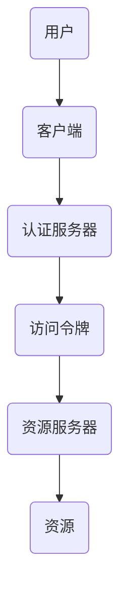

                 

 OAuth 2.0 是当今互联网领域中最为广泛使用的授权协议之一。它允许用户授权第三方应用访问他们所持有的服务账户，而不需要泄露用户账户的用户名和密码。本文将详细探讨 OAuth 2.0 的基本概念，包括其核心组成部分、工作原理以及实际应用。

## 关键词

- OAuth 2.0
- 授权协议
- 第三方应用
- 用户身份验证
- 安全性

## 摘要

OAuth 2.0 是一种开放标准，旨在允许用户授权第三方应用访问他们持有服务账户信息，而不需要直接暴露用户账户的用户名和密码。本文将深入解析 OAuth 2.0 的核心概念，工作流程，主要组成部分，安全机制，实际应用场景以及未来发展趋势。

## 1. 背景介绍

随着互联网技术的发展，越来越多的服务开始通过 Web 应用程序提供。这些服务包括社交媒体、电子邮件、在线存储、金融信息等。这些服务提供商需要确保用户隐私和数据安全，同时也希望允许第三方应用访问其用户的数据。OAuth 2.0 正是在这样的背景下诞生的。

OAuth 2.0 由 OAuth 实体工作组维护，是一种开放标准授权协议，旨在允许第三方应用访问用户资源，同时保护用户账户的安全。OAuth 2.0 的目标是简化授权流程，使其更易于实现，并且支持多种类型的认证方式。

### OAuth 2.0 的起源

OAuth 1.0 是 OAuth 的第一个版本，发布于 2009 年。然而，OAuth 1.0 在设计上存在一些限制，例如仅支持 RESTful API，无法直接访问 JSON API 等。为了解决这些问题，OAuth 2.0 应运而生。

OAuth 2.0 于 2012 年正式发布，旨在解决 OAuth 1.0 的局限性，提供更加灵活和安全的授权机制。OAuth 2.0 的设计目标是适用于广泛的场景，包括 Web 应用程序、移动应用、桌面应用等。

### OAuth 2.0 的目标

OAuth 2.0 有以下几个主要目标：

1. **简化授权流程**：使得开发者能够更容易地实现授权功能，减少冗余的代码和复杂的流程。
2. **提高安全性**：通过引入多种认证机制，确保用户数据的安全性和隐私。
3. **支持多种认证方式**：除了传统的用户名和密码认证外，还支持其他认证方式，如单点登录（SSO）。
4. **兼容性**：与其他标准和服务（如 OpenID Connect 和 SAML）具有良好的兼容性。

## 2. 核心概念与联系

OAuth 2.0 的核心概念包括以下组成部分：

### 用户（User）

用户是授权 OAuth 2.0 协议的关键角色。用户拥有服务提供商（Resource Owner）的账户，并希望授权第三方应用（Client）访问他们的资源。

### 客户端（Client）

客户端是指请求访问资源的服务或应用。它可以是 Web 应用程序、移动应用或桌面应用。客户端通过 OAuth 2.0 协议请求访问用户资源。

### 资源所有者（Resource Owner）

资源所有者是指拥有被访问资源的人。在 OAuth 2.0 协议中，资源所有者通常是用户。

### 资源服务器（Resource Server）

资源服务器是指存储用户资源的服务器。资源服务器通常是服务提供商的一部分，如社交媒体平台、电子邮件服务提供商等。

### 认证服务器（Authorization Server）

认证服务器负责处理客户端的授权请求，并颁发访问令牌。认证服务器通常是服务提供商的一部分。

### 访问令牌（Access Token）

访问令牌是客户端用于访问资源服务器的一串字符。访问令牌通常包含用户的身份信息和权限信息。

### 刷新令牌（Refresh Token）

刷新令牌是用于获取新的访问令牌的一种令牌。它可以帮助客户端在不重新进行身份验证的情况下继续访问资源。

### Mermaid 流程图

以下是 OAuth 2.0 的 Mermaid 流程图，展示了各个组成部分之间的交互：



## 3. 核心算法原理 & 具体操作步骤

### 3.1 算法原理概述

OAuth 2.0 的核心算法原理是基于访问令牌和刷新令牌的授权机制。以下是 OAuth 2.0 的授权流程：

1. **用户注册**：用户在服务提供商处注册账户。
2. **客户端注册**：客户端在服务提供商处注册，获取客户端 ID 和客户端密钥。
3. **用户授权**：用户访问客户端的界面，并同意授权客户端访问其资源。
4. **认证服务器颁发访问令牌**：认证服务器根据客户端的请求，颁发访问令牌。
5. **客户端使用访问令牌访问资源**：客户端使用访问令牌访问资源服务器，获取用户资源。
6. **刷新访问令牌**：当访问令牌即将过期时，客户端可以使用刷新令牌获取新的访问令牌。

### 3.2 算法步骤详解

以下是 OAuth 2.0 的详细操作步骤：

1. **用户注册**：用户访问服务提供商的网站，并创建账户。
2. **客户端注册**：客户端访问服务提供商的注册界面，填写相关信息（如客户端名称、回调 URL 等），并提交注册请求。服务提供商审核通过后，向客户端颁发客户端 ID 和客户端密钥。
3. **用户授权**：用户访问客户端的网站或应用，客户端向用户请求授权。用户同意授权后，客户端获取授权码。
4. **认证服务器颁发访问令牌**：客户端将授权码发送到认证服务器，并附带客户端 ID 和客户端密钥。认证服务器验证客户端身份后，颁发访问令牌和刷新令牌。
5. **客户端使用访问令牌访问资源**：客户端使用访问令牌和刷新令牌访问资源服务器，获取用户资源。资源服务器验证访问令牌的有效性后，向客户端提供用户资源。
6. **刷新访问令牌**：当访问令牌即将过期时，客户端使用刷新令牌向认证服务器请求新的访问令牌。认证服务器验证刷新令牌的有效性后，颁发新的访问令牌。

### 3.3 算法优缺点

#### 优点

1. **安全性**：OAuth 2.0 使用访问令牌和刷新令牌进行授权，避免了用户账户密码的直接泄露。
2. **灵活性**：OAuth 2.0 支持多种认证方式，包括客户端密码、授权码、刷新令牌等，适用于不同的场景。
3. **易用性**：OAuth 2.0 的授权流程相对简单，易于实现和部署。

#### 缺点

1. **复杂性**：虽然 OAuth 2.0 的授权流程相对简单，但对于初学者来说，理解和实现仍具有一定的难度。
2. **依赖第三方**：OAuth 2.0 的授权流程依赖于认证服务器和资源服务器，一旦第三方出现问题，可能会影响整体系统的稳定性。

### 3.4 算法应用领域

OAuth 2.0 可以应用于多种场景，包括但不限于：

1. **第三方应用集成**：服务提供商允许第三方应用访问其用户数据，如社交媒体平台的 API。
2. **单点登录（SSO）**：多个应用使用相同的认证服务器进行认证，提高用户体验。
3. **移动应用授权**：移动应用需要访问用户数据，但希望避免直接使用用户账户密码。

## 4. 数学模型和公式 & 详细讲解 & 举例说明

### 4.1 数学模型构建

OAuth 2.0 的数学模型主要包括以下公式：

1. **访问令牌（Access Token）**：访问令牌是客户端用于访问资源服务器的一串字符。访问令牌通常包含用户的身份信息和权限信息。

   $$ Access\ Token = HMAC-SHA256(key, data) $$

   其中，`HMAC-SHA256` 是一种加密算法，`key` 是客户端密钥，`data` 是需要加密的数据。

2. **刷新令牌（Refresh Token）**：刷新令牌是用于获取新的访问令牌的一种令牌。刷新令牌通常包含用户的身份信息和权限信息。

   $$ Refresh\ Token = HMAC-SHA256(key, data) $$

   其中，`HMAC-SHA256` 是一种加密算法，`key` 是客户端密钥，`data` 是需要加密的数据。

### 4.2 公式推导过程

以下是 OAuth 2.0 的访问令牌和刷新令牌的推导过程：

1. **访问令牌**：

   访问令牌是通过客户端密钥对用户身份信息和权限信息进行加密得到的。假设客户端密钥为 `key`，用户身份信息为 `user_id`，权限信息为 `scope`，则访问令牌可以表示为：

   $$ Access\ Token = HMAC-SHA256(key, user_id + scope) $$

   其中，`+` 表示字符串连接操作。

2. **刷新令牌**：

   刷新令牌是通过客户端密钥对用户身份信息和权限信息进行加密得到的。假设客户端密钥为 `key`，用户身份信息为 `user_id`，权限信息为 `scope`，则刷新令牌可以表示为：

   $$ Refresh\ Token = HMAC-SHA256(key, user_id + scope) $$

   其中，`+` 表示字符串连接操作。

### 4.3 案例分析与讲解

假设用户小明在服务提供商的网站上注册了一个账户，并成功授权了一个第三方应用访问其账户信息。以下是 OAuth 2.0 的授权流程：

1. **用户注册**：小明在服务提供商的网站上注册了一个账户。
2. **客户端注册**：第三方应用的开发者在服务提供商处注册了一个客户端，并获得了客户端 ID 和客户端密钥。
3. **用户授权**：小明访问第三方应用的网站，并同意授权该应用访问其账户信息。第三方应用向小明请求授权码。
4. **认证服务器颁发访问令牌**：第三方应用将授权码发送到认证服务器，并附带客户端 ID 和客户端密钥。认证服务器验证客户端身份后，颁发访问令牌和刷新令牌。
5. **客户端使用访问令牌访问资源**：第三方应用使用访问令牌访问服务提供商的资源服务器，获取小明的账户信息。
6. **刷新访问令牌**：当访问令牌即将过期时，第三方应用使用刷新令牌向认证服务器请求新的访问令牌。

## 5. 项目实践：代码实例和详细解释说明

### 5.1 开发环境搭建

在本节中，我们将使用 Python 和 Flask 框架来搭建一个简单的 OAuth 2.0 服务。以下是开发环境的搭建步骤：

1. 安装 Python 3.8 或更高版本。
2. 安装 Flask 框架：
   ```bash
   pip install Flask
   ```
3. 安装 OAuthLib 库：
   ```bash
   pip install OAuthLib
   ```

### 5.2 源代码详细实现

以下是使用 Flask 框架实现的 OAuth 2.0 服务器的源代码：

```python
from flask import Flask, request, jsonify
from flask_oauthlib.client import OAuth

app = Flask(__name__)
app.config['OAUTHLIB_RELAX_TOKEN_SCOPE'] = True
app.config['OAUTHLIB_RELAX_REQUESTENTE'] = True

# 示例：使用 GitHub OAuth
oauth = OAuth(app)
github = oauth.remote_app(
    'github',
    consumer_key='your_consumer_key',
    consumer_secret='your_consumer_secret',
    request_token_params={
        'scope': 'user:email'
    },
    base_url='https://api.github.com',
    request_token_url=None,
    access_token_url='/oauth/access_token',
    authorize_url='https://github.com/login/oauth/authorize'
)

@app.route('/login')
def login():
    return github.authorize(callback=url_for('authorized', _external=True))

@app.route('/login/authorized')
def authorized():
    response = github.authorized_response()
    if response is None:
        return '您取消了授权。'
    if response.get('error'):
        return '授权失败：{0}'.format(response['error'])
    token = github.get_access_token(response['code'])
    user_info = github.get('user')
    return jsonify(user_info.data)

if __name__ == '__main__':
    app.run(debug=True)
```

### 5.3 代码解读与分析

以下是代码的详细解读：

1. **导入库**：首先，我们导入了 Flask 和 OAuthLib 库。
2. **配置 OAuth**：我们配置了 OAuth，并指定了 GitHub OAuth 的客户端 ID 和客户端密钥。
3. **定义路由**：我们定义了两个路由：`/login` 和 `/login/authorized`。
   - `/login` 路由用于启动授权流程，引导用户跳转到 GitHub 的授权页面。
   - `/login/authorized` 路由用于处理 GitHub 回调，获取授权码并获取用户信息。
4. **登录流程**：用户访问 `/login` 路由，系统将引导用户跳转到 GitHub 的授权页面。用户同意授权后，GitHub 会将用户重定向回 `/login/authorized` 路由，并传递授权码。
5. **获取用户信息**：系统使用授权码获取访问令牌，并使用访问令牌获取用户信息。

### 5.4 运行结果展示

1. **运行服务**：在终端运行以下命令启动 Flask 服务：
   ```bash
   python app.py
   ```
2. **访问登录页面**：在浏览器中访问 `http://localhost:5000/login`，系统将引导用户跳转到 GitHub 的授权页面。
3. **用户授权**：用户在 GitHub 页面上同意授权，并返回到指定回调 URL。
4. **获取用户信息**：系统获取用户信息并返回到客户端。

## 6. 实际应用场景

OAuth 2.0 在实际应用中有许多场景，以下是一些常见的应用：

1. **第三方应用集成**：服务提供商允许第三方应用访问其用户数据，如社交媒体平台的 API。
2. **单点登录（SSO）**：多个应用使用相同的认证服务器进行认证，提高用户体验。
3. **移动应用授权**：移动应用需要访问用户数据，但希望避免直接使用用户账户密码。

## 6.4 未来应用展望

随着互联网技术的发展，OAuth 2.0 的应用场景将越来越广泛。未来，OAuth 2.0 可能会与区块链技术相结合，实现更加安全、去中心化的授权机制。此外，OAuth 2.0 还有可能与物联网（IoT）技术相结合，实现智能家居设备的授权。

## 7. 工具和资源推荐

### 7.1 学习资源推荐

1. 《OAuth 2.0 定义》 - [RFC 6749](https://tools.ietf.org/html/rfc6749)
2. 《OAuth 2.0 脑图》 - [OAuth 2.0 Braindump](https://auth0.com/resources/ebooks/oauth-20-braindump)
3. 《OAuth 2.0 快速入门》 - [OAuth 2.0 Quick Start](https://.oauth.com/oauth2-servers/)

### 7.2 开发工具推荐

1. [Auth0](https://auth0.com/) - 提供 OAuth 2.0 认证和授权服务。
2. [Okta](https://www.okta.com/) - 提供全面的身份验证和访问管理解决方案。
3. [GitHub OAuth](https://github.com/settings/developers) - GitHub OAuth 开发者文档。

### 7.3 相关论文推荐

1. "The OAuth 2.0 Authorization Framework" - RFC 6749
2. "OAuth 2.0 Threat Model and Security Considerations" - RFC 6819
3. "The Simple and Secure Authorization of RESTful Services" - ACM Transactions on the Web

## 8. 总结：未来发展趋势与挑战

### 8.1 研究成果总结

OAuth 2.0 自发布以来，已成为互联网领域的事实标准。它提供了简单、安全、灵活的授权机制，广泛应用于第三方应用集成、单点登录和移动应用授权等领域。

### 8.2 未来发展趋势

1. **标准化**：OAuth 2.0 将继续与其他标准（如 OpenID Connect、SAML）相结合，实现更加统一的授权机制。
2. **去中心化**：OAuth 2.0 可能与区块链技术相结合，实现更加安全、去中心化的授权机制。
3. **物联网应用**：OAuth 2.0 将在物联网（IoT）领域得到更广泛的应用，实现智能家居设备的授权。

### 8.3 面临的挑战

1. **安全性**：随着 OAuth 2.0 的广泛应用，安全性问题成为首要挑战。如何确保授权过程中的数据安全，防止恶意攻击，是未来研究的重要方向。
2. **兼容性**：OAuth 2.0 需要与不同平台和系统进行兼容，这要求协议具有高度的灵活性和适应性。

### 8.4 研究展望

未来，OAuth 2.0 的研究方向可能包括：

1. **安全性增强**：研究新的加密算法和认证机制，提高授权过程的安全性。
2. **跨平台兼容性**：研究如何在不同平台和系统中实现 OAuth 2.0，提高协议的兼容性。
3. **物联网应用**：研究 OAuth 2.0 在物联网领域的应用，实现智能家居设备的授权。

## 9. 附录：常见问题与解答

### 9.1 什么是 OAuth 2.0？

OAuth 2.0 是一种开放标准授权协议，旨在允许第三方应用访问用户资源，而不需要直接暴露用户账户的用户名和密码。

### 9.2 OAuth 2.0 的核心组成部分有哪些？

OAuth 2.0 的核心组成部分包括用户、客户端、资源服务器、认证服务器、访问令牌和刷新令牌。

### 9.3 OAuth 2.0 的授权流程是怎样的？

OAuth 2.0 的授权流程包括用户注册、客户端注册、用户授权、认证服务器颁发访问令牌、客户端使用访问令牌访问资源以及刷新访问令牌。

### 9.4 OAuth 2.0 与 OAuth 1.0 有什么区别？

OAuth 2.0 相比于 OAuth 1.0 具有更简单、更灵活的授权流程，支持多种认证方式，并适用于更广泛的场景。

### 9.5 OAuth 2.0 的优点和缺点分别是什么？

OAuth 2.0 的优点包括安全性高、灵活性大、易用性强。缺点包括复杂性高、依赖第三方、安全性问题。

### 9.6 OAuth 2.0 可以应用于哪些领域？

OAuth 2.0 可以应用于第三方应用集成、单点登录、移动应用授权、物联网等领域。

### 9.7 如何搭建 OAuth 2.0 服务器？

搭建 OAuth 2.0 服务器需要选择一个合适的框架（如 Flask）和库（如 OAuthLib），并配置相应的客户端 ID、客户端密钥等参数。

### 9.8 OAuth 2.0 与 OpenID Connect 有什么区别？

OAuth 2.0 主要用于授权，允许第三方应用访问用户资源；而 OpenID Connect 是一种身份验证协议，用于验证用户的身份。

### 9.9 OAuth 2.0 与 SAML 有什么区别？

OAuth 2.0 和 SAML 都是授权协议，但 OAuth 2.0 更注重授权流程的简便性和灵活性，而 SAML 更注重与不同系统的兼容性。

### 9.10 OAuth 2.0 是否安全？

OAuth 2.0 本身是安全的，但如果配置不当，可能会存在安全隐患。因此，在使用 OAuth 2.0 时，需要遵循最佳实践，确保系统的安全性。

作者：禅与计算机程序设计艺术 / Zen and the Art of Computer Programming

