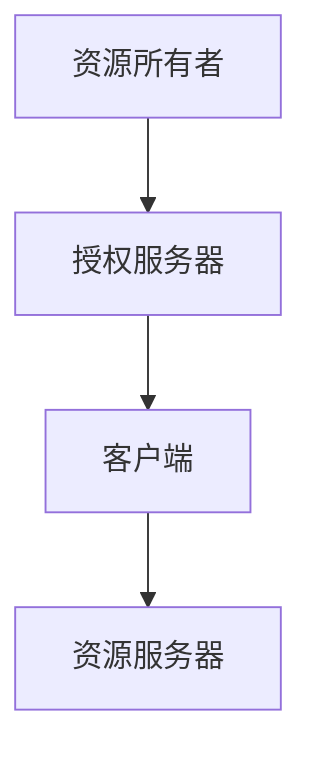

                 

关键词：OAuth 2.0、授权协议、单点登录、API 安全、身份认证、访问控制

> 摘要：OAuth 2.0 是一种开放授权协议，旨在允许用户授权第三方应用访问他们存储在另一服务提供者上的信息，而不需要将用户名和密码直接提供给该第三方应用。本文将探讨 OAuth 2.0 的核心概念、应用场景及其在实际开发中的重要性。

## 1. 背景介绍

OAuth 2.0 是一种开放授权协议，它允许用户授权第三方应用访问他们存储在服务提供商（通常是社交网络或资源服务器）上的数据。这种协议起源于 2000 年代初期的 OAuth 1.0，但 OAuth 2.0 在 2012 年正式发布后迅速成为行业标准，广泛应用于各种场景，包括单点登录、API 访问控制和社交媒体集成等。

### 1.1 OAuth 2.0 的诞生背景

随着互联网的迅速发展，用户在多个服务提供商（如社交网络、银行、邮箱等）上存储了大量的个人信息和数据。传统的方法是要求用户将他们的用户名和密码直接提供给第三方应用，这不仅不安全，而且也不符合用户的隐私需求。因此，OAuth 2.0 旨在提供一种安全的授权机制，让用户可以自由地控制他们数据的访问权限。

### 1.2 OAuth 2.0 的发展历程

自 OAuth 2.0 发布以来，它已经经历了多次修订和优化。当前广泛使用的版本是 2.0.1，它增强了安全性，并解决了许多早期版本中的问题。随着技术的进步，OAuth 2.0 也不断更新，以适应新的应用场景和需求。

## 2. 核心概念与联系

### 2.1 OAuth 2.0 的核心概念

OAuth 2.0 的核心概念包括资源所有者（Resource Owner）、资源服务器（Resource Server）、客户端（Client）和授权服务器（Authorization Server）。以下是一个简化的 Mermaid 流程图，展示了这些概念之间的联系：



### 2.2 OAuth 2.0 的授权流程

OAuth 2.0 的授权流程包括以下步骤：

1. **认证资源所有者**：客户端向授权服务器请求访问资源所有者的认证。
2. **获取授权码**：资源所有者同意授权，授权服务器返回一个授权码。
3. **交换授权码与访问令牌**：客户端使用授权码向授权服务器请求访问令牌。
4. **访问资源**：客户端使用访问令牌向资源服务器请求访问资源。

### 2.3 OAuth 2.0 的应用场景

OAuth 2.0 可以应用于多种场景，包括：

- **单点登录（SSO）**：用户只需登录一次，即可访问多个服务。
- **API 访问控制**：保护 API，确保只有授权的应用可以访问。
- **社交媒体集成**：允许应用访问用户的社交网络数据。

## 3. 核心算法原理 & 具体操作步骤

### 3.1 算法原理概述

OAuth 2.0 的核心算法是基于密码学的方法，包括加密和签名。这些算法确保了授权流程的安全性和完整性。

### 3.2 算法步骤详解

1. **注册客户端**：客户端向授权服务器注册，并获得唯一标识符和密钥。
2. **请求授权码**：客户端引导用户到授权服务器，请求授权码。
3. **交换授权码与访问令牌**：客户端使用授权码和密钥向授权服务器请求访问令牌。
4. **访问资源**：客户端使用访问令牌向资源服务器请求访问资源。

### 3.3 算法优缺点

**优点**：

- **安全性**：OAuth 2.0 使用加密和签名，确保授权流程的安全。
- **灵活性**：适用于多种应用场景，包括单点登录和 API 访问控制。
- **易用性**：用户只需一次授权，即可访问多个服务。

**缺点**：

- **复杂性**：配置和实现 OAuth 2.0 需要一定的技术知识。
- **性能问题**：在某些情况下，授权流程可能会增加延迟。

### 3.4 算法应用领域

OAuth 2.0 广泛应用于以下领域：

- **Web 应用**：用于保护 API 和实现单点登录。
- **移动应用**：允许应用访问用户的社交网络数据。
- **企业应用**：用于内部系统和服务的安全访问控制。

## 4. 数学模型和公式

### 4.1 数学模型构建

OAuth 2.0 的数学模型基于密码学，包括加密和签名。以下是一个简化的模型：

- **加密**：使用对称加密算法（如 AES）加密数据。
- **签名**：使用非对称加密算法（如 RSA）对数据签名。

### 4.2 公式推导过程

- **加密公式**：\(C = E_K(M)\)，其中 \(C\) 是加密后的数据，\(K\) 是密钥，\(M\) 是明文。
- **签名公式**：\(S = RSA_K(M)\)，其中 \(S\) 是签名，\(K\) 是私钥，\(M\) 是明文。

### 4.3 案例分析与讲解

假设一个用户想要授权一个应用访问其社交网络数据。以下是具体的步骤：

1. **用户登录**：用户使用用户名和密码登录到社交网络。
2. **注册应用**：应用向社交网络注册，并获得唯一标识符和密钥。
3. **请求授权码**：应用引导用户到社交网络，请求授权码。
4. **用户授权**：用户同意授权，社交网络返回授权码。
5. **交换授权码与访问令牌**：应用使用授权码和密钥向社交网络请求访问令牌。
6. **访问资源**：应用使用访问令牌向社交网络请求访问用户数据。

## 5. 项目实践：代码实例

### 5.1 开发环境搭建

在开发 OAuth 2.0 应用时，您需要安装以下工具：

- **Node.js**：用于构建客户端和服务端。
- **Express**：用于构建 Web 应用。
- ** Passport.js**：用于处理身份验证。

### 5.2 源代码详细实现

以下是一个简单的 OAuth 2.0 客户端和服务端的示例代码：

**客户端代码**：

```javascript
const express = require('express');
const passport = require('passport');
const Strategy = require('passport-oauth2').Strategy;

const app = express();

app.use(passport.initialize());

passport.use(new Strategy({
    authorizationURL: 'https://example.com/oauth/authorize',
    tokenURL: 'https://example.com/oauth/token',
    clientID: 'your-client-id',
    clientSecret: 'your-client-secret'
  },
  function(accessToken, refreshToken, profile, cb) {
    // 处理授权码和访问令牌
    // 返回用户信息
    return cb(null, { id: profile.id, accessToken });
  }
));

app.get('/auth/example',
  passport.authenticate('oauth2'));

app.get('/auth/example/callback',
  passport.authenticate('oauth2', { failureRedirect: '/login' }),
  function(req, res) {
    // 处理授权码和访问令牌
    res.redirect('/');
  });

app.listen(3000, () => {
  console.log('Server started on port 3000');
});
```

**服务端代码**：

```javascript
const express = require('express');
const jwt = require('jsonwebtoken');
const app = express();

app.post('/oauth/token', (req, res) => {
  // 处理授权码和访问令牌
  // 签发 JWT 访问令牌
  const accessToken = jwt.sign({ id: 'your-user-id' }, 'your-secret-key', { expiresIn: '1h' });
  res.json({ access_token: accessToken });
});

app.listen(4000, () => {
  console.log('Authorization server started on port 4000');
});
```

### 5.3 代码解读与分析

**客户端代码**：

- 使用 Express 和 Passport.js 搭建 Web 应用。
- 使用 OAuth2 策略处理身份验证。
- 用户访问 `/auth/example` 时，将被引导到授权服务器。
- 用户授权后，返回到 `/auth/example/callback`，客户端将接收授权码，并使用授权码和密钥获取访问令牌。

**服务端代码**：

- 使用 Express 搭建授权服务器。
- 接收客户端发送的授权码，签发 JWT 访问令牌。

## 6. 实际应用场景

### 6.1 社交媒体集成

OAuth 2.0 广泛应用于社交媒体集成，例如 Twitter、Facebook 和 Google。用户可以通过 OAuth 2.0 授权应用访问其社交网络数据，而无需将用户名和密码直接提供给应用。

### 6.2 单点登录

OAuth 2.0 也常用于实现单点登录（SSO）。用户只需登录一次，即可访问多个服务。这大大简化了用户的使用体验，并提高了系统的安全性。

### 6.3 API 访问控制

许多 API 服务提供商使用 OAuth 2.0 来保护其 API。只有授权的应用才能访问 API，从而确保系统的安全性和稳定性。

## 7. 工具和资源推荐

### 7.1 学习资源推荐

- **《OAuth 2.0 Fundamentals》**：这是由 OAuth 2.0 标准的创始人之一编写的权威指南。
- **OAuth 2.0 开发者指南**：OAuth 2.0 官方文档，提供了详细的指南和示例。

### 7.2 开发工具推荐

- **Passport.js**：用于 Node.js 的 OAuth 2.0 身份验证中间件。
- **Auth0**：提供全面的身份验证和管理服务，包括 OAuth 2.0。

### 7.3 相关论文推荐

- **OAuth 2.0：扩展和改进**：这是 OAuth 2.0 标准的作者之一对 OAuth 2.0 的扩展和改进的论文。

## 8. 总结

OAuth 2.0 是一种重要的授权协议，它为 Web 应用、移动应用和 API 访问控制提供了安全、灵活的授权机制。随着互联网的发展，OAuth 2.0 的应用场景将越来越广泛，其在保障用户隐私和提升用户体验方面具有重要意义。

### 8.1 研究成果总结

OAuth 2.0 在安全性、灵活性和易用性方面取得了显著成果，已经成为现代互联网应用的标准之一。它为用户提供了安全、方便的数据访问权限管理方式，同时也为企业提供了强大的 API 保护工具。

### 8.2 未来发展趋势

随着云计算和物联网的发展，OAuth 2.0 的应用场景将更加丰富。未来，OAuth 2.0 将继续优化和扩展，以适应新的技术和需求。

### 8.3 面临的挑战

尽管 OAuth 2.0 取得了显著成果，但其在安全性、性能和兼容性方面仍面临挑战。如何解决这些问题，将是未来 OAuth 2.0 发展的关键。

### 8.4 研究展望

未来，OAuth 2.0 的研究方向包括：

- **安全性提升**：研究更加安全的加密和签名算法，提高授权流程的安全性。
- **性能优化**：研究优化授权流程，提高系统的响应速度和性能。
- **标准化**：推动 OAuth 2.0 的标准化工作，确保不同系统和应用的兼容性。

## 9. 附录：常见问题与解答

### 9.1 什么是 OAuth 2.0？

OAuth 2.0 是一种开放授权协议，旨在允许用户授权第三方应用访问他们存储在服务提供商上的信息，而不需要将用户名和密码直接提供给该第三方应用。

### 9.2 OAuth 2.0 有哪些应用场景？

OAuth 2.0 可以应用于单点登录、API 访问控制和社交媒体集成等场景。

### 9.3 OAuth 2.0 的安全性如何保证？

OAuth 2.0 使用加密和签名确保授权流程的安全性。同时，它还采用了多种安全措施，如令牌有效期、刷新令牌等，以保护用户数据和隐私。

### 9.4 如何实现 OAuth 2.0？

实现 OAuth 2.0 需要一定的技术知识。开发者可以使用各种开源框架和库，如 Passport.js，来简化 OAuth 2.0 的实现过程。

### 9.5 OAuth 2.0 与 OAuth 1.0 有何区别？

OAuth 2.0 相对于 OAuth 1.0，在安全性、灵活性、易用性等方面都有显著的提升。OAuth 2.0 移除了许多复杂的概念和步骤，使其更容易实现和应用。

---

本文由禅与计算机程序设计艺术（Zen and the Art of Computer Programming）撰写，旨在为读者提供关于 OAuth 2.0 的全面了解和应用实践。随着技术的不断进步，OAuth 2.0 将在未来的互联网应用中发挥更大的作用。希望本文能对您有所帮助。

### 参考文献 References

1. **Authorization Code Grant**：[OAuth 2.0 Specification](https://tools.ietf.org/html/rfc6749#section-4.1)
2. **Access Token**：[OAuth 2.0 Access Token Standard](https://tools.ietf.org/html/rfc6750)
3. **Passport.js**：[Official Passport.js Documentation](https://www.passportjs.org/)
4. **Auth0**：[Auth0 Documentation](https://auth0.com/docs/)
5. **OAuth 2.0 Fundamentals**：[Book by Brian Ellman](https://www.oreilly.com/library/view/oauth-2-0-fundamentals/9781449325862/)

