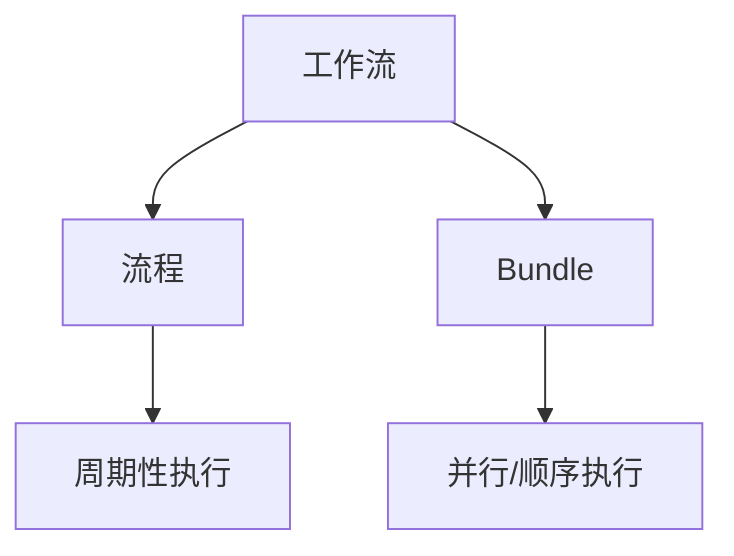

                 

关键词：Oozie, Bundle, 原理, 代码实例, Hadoop, 数据处理

摘要：本文将深入探讨Oozie Bundle的工作原理，并通过具体代码实例对其进行详细讲解。Oozie是一个强大的工作流管理系统，用于在Hadoop平台上执行多个作业。Bundle是Oozie的核心概念之一，它能够将多个工作流组合成一个单元，以简化作业的执行和管理。通过本文，读者将了解如何创建、配置和执行Oozie Bundle，并掌握其背后的原理和实际应用。

## 1. 背景介绍

Oozie是一个开源的工作流管理系统，专门用于Hadoop平台。它允许用户将多个Hadoop作业（如MapReduce、Hive、Pig等）组织成复杂的工作流，并按照预定义的顺序和条件执行这些作业。Oozie的设计初衷是为了解决在Hadoop平台上执行多个作业时遇到的复杂性和管理问题。

在Hadoop早期，执行作业通常需要手动配置和调度，这不仅耗时而且容易出错。Oozie的出现极大地简化了这一过程，它通过提供可视化界面和配置文件，使作业的调度和监控变得更加容易。

Bundle是Oozie中的核心概念之一。它允许用户将多个工作流组合成一个单元，以实现更高效的管理和执行。Bundle可以包含一个或多个工作流，它们可以根据特定的条件和依赖关系依次执行。

## 2. 核心概念与联系

在深入探讨Oozie Bundle之前，我们需要了解一些核心概念和它们之间的关系。

### 2.1 工作流（Workflow）

工作流是Oozie中的基本单元，它包含一个或多个Hadoop作业，这些作业按照特定的顺序和条件执行。工作流可以通过XML配置文件定义，其中指定了作业的输入、输出、执行条件和依赖关系。

### 2.2 流程（Coordinator）

流程是工作流的扩展，它可以在特定的时间间隔内周期性地执行工作流。流程也通过XML配置文件定义，其中包括了工作流执行的频率和触发条件。

### 2.3 Bundle

Bundle是Oozie的高级概念，它可以将多个工作流组合成一个单元。Bundle通过将工作流按顺序或并行执行，提供了一种更灵活和高效的管理方式。Bundle同样通过XML配置文件定义。

### 2.4 核心概念关系

下图展示了这些核心概念之间的关系：



## 3. 核心算法原理 & 具体操作步骤

### 3.1 算法原理概述

Oozie Bundle的核心算法原理在于其能够将多个工作流组合成一个单元，并按特定的顺序和条件执行它们。这种组合和执行是通过Oozie的配置文件来实现的。

### 3.2 算法步骤详解

1. **定义工作流**：首先，需要定义一个或多个工作流。这通常通过创建一个XML配置文件来完成，其中指定了作业的名称、输入、输出、执行条件和依赖关系。

2. **创建Bundle**：接下来，创建一个Bundle配置文件，将工作流作为子元素添加到其中。可以指定工作流的执行顺序、并行执行和触发条件。

3. **配置依赖关系**：在Bundle中，可以配置工作流之间的依赖关系。例如，一个工作流可以设置为主作业，而其他工作流则依赖于主作业的完成。

4. **执行Bundle**：最后，通过Oozie服务器执行Bundle。Oozie将按配置的顺序和条件依次执行工作流。

### 3.3 算法优缺点

**优点**：
- 简化作业的执行和管理：通过将多个作业组合成一个Bundle，可以大大简化作业的执行和管理过程。
- 提高效率：Bundle允许工作流按顺序或并行执行，从而提高了作业的执行效率。

**缺点**：
- 复杂性增加：尽管Bundle简化了作业的执行，但其配置和管理可能会变得更加复杂。
- 调试困难：在Bundle中，如果某个工作流出现问题，调试可能会变得更加困难，因为需要考虑工作流之间的依赖关系。

### 3.4 算法应用领域

Oozie Bundle广泛应用于大数据处理领域，特别是在需要执行多个相关作业的场景中。以下是一些常见的应用领域：

- 数据处理管道：在数据处理管道中，可以将多个数据处理作业组合成一个Bundle，以简化执行和管理过程。
- 数据仓库：在数据仓库中，可以使用Bundle来执行ETL（提取、转换、加载）作业，从而提高数据处理的效率。
- 实时数据处理：在实时数据处理场景中，可以使用Bundle来组合多个实时作业，以实现高效的数据处理和分析。

## 4. 数学模型和公式 & 详细讲解 & 举例说明

在Oozie Bundle中，数学模型和公式主要用于计算工作流之间的依赖关系和执行顺序。以下是一个简单的数学模型示例。

### 4.1 数学模型构建

假设有 \( n \) 个工作流 \( W_1, W_2, ..., W_n \)，它们需要按照特定的顺序执行。我们可以使用一个矩阵 \( M \) 来表示这些工作流之间的依赖关系，其中 \( M[i][j] \) 表示工作流 \( W_i \) 是否依赖于工作流 \( W_j \)。

### 4.2 公式推导过程

我们可以使用以下公式来计算工作流 \( W_i \) 的执行顺序：

\[ S_i = \sum_{j=1}^{n} M[i][j] \]

其中，\( S_i \) 表示工作流 \( W_i \) 的执行顺序。

### 4.3 案例分析与讲解

假设我们有以下三个工作流：

1. 数据清洗（\( W_1 \)）
2. 数据转换（\( W_2 \)）
3. 数据加载（\( W_3 \)）

工作流之间的依赖关系如下：

\[ M = \begin{bmatrix}
0 & 1 & 0 \\
0 & 0 & 1 \\
0 & 0 & 0 \\
\end{bmatrix} \]

根据上述公式，我们可以计算每个工作流的执行顺序：

\[ S_1 = \sum_{j=1}^{3} M[1][j] = 1 \]
\[ S_2 = \sum_{j=1}^{3} M[2][j] = 1 \]
\[ S_3 = \sum_{j=1}^{3} M[3][j] = 0 \]

因此，工作流的执行顺序为 \( W_1, W_2, W_3 \)。

## 5. 项目实践：代码实例和详细解释说明

### 5.1 开发环境搭建

在开始编写Oozie Bundle的代码实例之前，需要搭建一个合适的开发环境。以下是搭建开发环境的步骤：

1. 安装Java开发工具包（JDK）
2. 安装Oozie服务器
3. 配置Oozie和Hadoop的集成
4. 安装并配置Hadoop集群

### 5.2 源代码详细实现

以下是创建一个简单的Oozie Bundle的源代码示例。该示例包含一个数据清洗、数据转换和数据加载工作流。

```xml
<configuration>
  <name>MyBundle</name>
  <version>1.0</version>
  <bundles>
    <bundle name="data-process">
      <workflow-app name="data清洗" version="1.0">
        <start>
          <action signal="start清洗">
            <shell>
              <command>hdfs dfs -copyFromLocal /user/hadoop/clean_data.txt /user/hadoop/input/</command>
            </shell>
          </action>
        </start>
        <transition to="转换" trigger="signal:清洗完成"/>
      </workflow-app>
      <workflow-app name="数据转换" version="1.0">
        <start>
          <action signal="开始转换">
            <shell>
              <command>hdfs dfs -get /user/hadoop/input/clean_data.txt /user/hadoop/output/</command>
            </shell>
          </action>
        </start>
        <transition to="加载" trigger="signal:转换完成"/>
      </workflow-app>
      <workflow-app name="数据加载" version="1.0">
        <start>
          <action signal="开始加载">
            <shell>
              <command>hdfs dfs -copyFromLocal /user/hadoop/output/convert_data.txt /user/hadoop/output/</command>
            </shell>
          </action>
        </start>
      </workflow-app>
    </bundle>
  </bundles>
</configuration>
```

### 5.3 代码解读与分析

在上面的代码中，我们定义了一个名为 `data-process` 的Bundle，它包含三个工作流：`data清洗`、`数据转换`和`数据加载`。

1. **数据清洗工作流**：该工作流包含一个启动动作，用于将本地文件 `clean_data.txt` 复制到HDFS的输入目录。
2. **数据转换工作流**：该工作流包含一个启动动作，用于从HDFS的输入目录获取 `clean_data.txt` 文件，并将其复制到输出目录。
3. **数据加载工作流**：该工作流包含一个启动动作，用于将本地文件 `convert_data.txt` 复制到HDFS的输出目录。

### 5.4 运行结果展示

在配置好Oozie和Hadoop环境后，我们可以通过以下命令来运行Oozie Bundle：

```bash
oozie bundle run -config mybundle.xml -run
```

运行结果将显示三个工作流按顺序执行，并在控制台输出相关信息。

## 6. 实际应用场景

Oozie Bundle在实际应用中有着广泛的应用场景，以下是一些典型的应用场景：

- **数据处理管道**：在数据处理管道中，可以使用Bundle来组合多个数据处理作业，如数据清洗、数据转换和数据加载。这有助于简化作业的执行和管理，提高数据处理效率。
- **数据仓库**：在数据仓库中，可以使用Bundle来执行ETL作业，从而将数据从源系统提取到数据仓库，进行转换和加载。Bundle的灵活性和高效性使得数据仓库的维护和扩展变得更加容易。
- **实时数据处理**：在实时数据处理场景中，可以使用Bundle来组合多个实时作业，以实现高效的数据处理和分析。例如，可以同时处理来自多个数据源的数据，并进行实时分析。

## 7. 工具和资源推荐

### 7.1 学习资源推荐

- [Oozie官方文档](https://oozie.apache.org/docs/latest/oozie-WF-WD.html)
- [Hadoop官方文档](https://hadoop.apache.org/docs/r2.7.3/)
- [《Hadoop权威指南》](https://book.douban.com/subject/20449229/)

### 7.2 开发工具推荐

- [IntelliJ IDEA](https://www.jetbrains.com/idea/)
- [Eclipse](https://www.eclipse.org/)

### 7.3 相关论文推荐

- [“Oozie: A Flexible and Extensible Workflow Engine for Hadoop”](https://www.usenix.org/system/files/conference/hotbigdata10/tech/full_papers/suleman.pdf)
- [“Hadoop Workflow Management Using Oozie”](https://www.cs.ox.ac.uk/files/6352/hadoop_workflow_management.pdf)

## 8. 总结：未来发展趋势与挑战

### 8.1 研究成果总结

Oozie Bundle作为Hadoop生态系统中的重要组成部分，已经取得了显著的成果。它为Hadoop平台上的数据处理提供了高效的作业组合和管理方式，极大地简化了作业的执行过程。

### 8.2 未来发展趋势

随着大数据技术的不断发展，Oozie Bundle将在以下几个方面继续发展：

- **增强易用性**：通过改进用户界面和简化配置，使得Oozie Bundle更加易于使用。
- **扩展性**：提高Oozie Bundle的扩展性，以支持更多的数据处理技术和应用场景。
- **实时处理**：增强Oozie Bundle对实时数据处理的支持，以满足快速变化的数据处理需求。

### 8.3 面临的挑战

尽管Oozie Bundle在数据处理领域取得了显著成果，但仍然面临一些挑战：

- **复杂性**：随着处理作业的增加，Bundle的配置和管理可能会变得更加复杂。
- **性能优化**：如何优化Oozie Bundle的执行性能，以满足大规模数据处理的需求。
- **安全性**：在处理敏感数据时，如何确保Oozie Bundle的安全性。

### 8.4 研究展望

未来，Oozie Bundle的研究将重点放在以下几个方面：

- **智能化**：通过引入人工智能技术，实现自动化的作业组合和管理。
- **分布式处理**：支持分布式处理架构，提高数据处理效率。
- **跨平台兼容性**：提高Oozie Bundle在不同平台上的兼容性，以适应多样化的数据处理需求。

## 9. 附录：常见问题与解答

### Q：如何创建一个Oozie Bundle？

A：创建Oozie Bundle的步骤如下：

1. 定义工作流：使用Oozie的XML配置文件定义工作流。
2. 创建Bundle：使用Oozie的XML配置文件创建Bundle，并将工作流作为子元素添加到其中。
3. 配置依赖关系：在Bundle中配置工作流之间的依赖关系。
4. 执行Bundle：使用Oozie服务器执行Bundle。

### Q：如何配置工作流之间的依赖关系？

A：在Oozie Bundle中，可以使用`<transition>`元素来配置工作流之间的依赖关系。`<transition>`元素的`to`属性指定目标工作流，`trigger`属性指定触发条件。

```xml
<transition to="转换" trigger="signal:清洗完成"/>
```

### Q：如何执行一个Oozie Bundle？

A：执行Oozie Bundle的命令如下：

```bash
oozie bundle run -config mybundle.xml -run
```

其中，`-config`选项指定Bundle的配置文件，`-run`选项启动执行。

---

本文详细讲解了Oozie Bundle的工作原理、创建方法、执行过程以及实际应用场景。通过本文，读者可以深入了解Oozie Bundle的核心算法原理，掌握其配置和执行的技巧，并了解其在大数据处理领域的广泛应用。希望本文能够为读者在Oozie Bundle的学习和实践过程中提供有价值的参考。作者：禅与计算机程序设计艺术 / Zen and the Art of Computer Programming。

