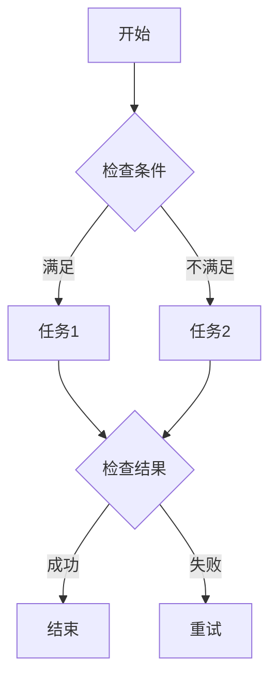

                 

关键词：Oozie、分布式计算、Hadoop、工作流管理、数据流处理

> 摘要：本文将深入探讨Oozie原理，结合实际代码实例，详细讲解如何利用Oozie实现分布式计算工作流管理，以及其在大数据处理中的应用。

## 1. 背景介绍

Oozie是一个开源的工作流管理系统，用于在Hadoop集群中执行和管理复杂的数据处理任务。随着大数据时代的到来，数据量的激增和数据处理的复杂性使得传统的数据处理方式难以满足需求。Oozie作为一种工作流管理工具，能够有效地解决这一问题，它通过将多个数据处理任务串联起来，实现自动化和协调的执行。

Oozie的主要优点包括：

- **灵活性和可扩展性**：Oozie支持多种类型的数据处理任务，如MapReduce、Spark、Streaming等，同时支持自定义任务。
- **易于维护和监控**：Oozie提供详细的任务日志和监控功能，有助于管理员跟踪和调试任务执行情况。
- **高可靠性**：Oozie能够确保任务按照预定顺序和条件执行，即使某个任务失败，也能自动重新执行或通知管理员。

本文将分为以下几个部分：

1. **核心概念与联系**：介绍Oozie的基本概念和工作原理。
2. **核心算法原理 & 具体操作步骤**：详细讲解Oozie的核心算法原理和具体操作步骤。
3. **数学模型和公式 & 详细讲解 & 举例说明**：探讨Oozie背后的数学模型和公式。
4. **项目实践：代码实例和详细解释说明**：通过实际代码实例展示Oozie的使用方法。
5. **实际应用场景**：讨论Oozie在现实世界中的应用场景。
6. **工具和资源推荐**：推荐学习资源和开发工具。
7. **总结：未来发展趋势与挑战**：总结研究成果，展望未来发展趋势和面临的挑战。

## 2. 核心概念与联系

### 2.1 Oozie基本概念

Oozie主要由以下核心组件构成：

- ** Workflow Manager**：负责定义和部署工作流，它将多个任务按照指定的顺序和条件串联起来。
- ** Coordinator**：负责调度和监控工作流，确保任务按时执行。
- ** Node**：工作流中的基本执行单元，可以是MapReduce、Spark、Streaming等任务。
- ** Action**：工作流中的一个具体任务，可以是Node或其他操作。
- ** Dependency**：定义任务之间的依赖关系，确保任务按顺序执行。

### 2.2 Oozie工作原理

Oozie通过定义Workflow XML文件来描述工作流，其中包含了任务节点、依赖关系和执行条件。Coordinator负责读取Workflow XML文件，并按照指定的顺序和条件调度任务。当任务完成时，Coordinator会自动执行下一个任务或根据依赖关系决定下一个任务的执行。

Oozie工作流程可以概括为以下步骤：

1. **定义 Workflow XML**：根据需求编写Workflow XML文件，描述任务节点、依赖关系和执行条件。
2. **部署 Workflow**：将Workflow XML文件部署到Oozie服务器。
3. **启动 Coordinator**：Coordinator开始调度任务，并监控任务执行情况。
4. **任务执行**：根据Workflow XML中的定义，任务依次执行。
5. **结果监控**：Coordinator监控任务执行结果，并记录日志。

### 2.3 Mermaid 流程图

以下是一个简单的Oozie工作流流程图示例：



在上述流程图中，`A` 表示工作流开始，`B` 是一个检查条件的节点，`C` 和 `D` 是两个任务节点，`E` 是结果检查节点，`F` 表示工作流成功结束，`G` 表示工作流失败重试。

## 3. 核心算法原理 & 具体操作步骤

### 3.1 算法原理概述

Oozie的核心算法原理主要涉及以下几个方面：

- **任务调度**：根据Workflow XML文件中的定义，Coordinator负责调度任务，确保任务按顺序执行。
- **依赖管理**：通过Dependency定义任务之间的依赖关系，确保任务按照预设条件执行。
- **容错处理**：当任务执行失败时，Oozie能够自动重试或通知管理员，确保工作流继续执行。

### 3.2 算法步骤详解

以下是Oozie算法的具体操作步骤：

1. **定义 Workflow XML**：编写Workflow XML文件，描述任务节点、依赖关系和执行条件。
2. **解析 Workflow XML**：Oozie服务器解析Workflow XML文件，生成内部数据结构。
3. **初始化 Coordinator**：Coordinator初始化，读取内部数据结构，并开始监控任务执行。
4. **调度任务**：根据依赖关系和执行条件，Coordinator依次调度任务。
5. **执行任务**：任务按照预定顺序和条件执行，并将执行结果返回给Coordinator。
6. **结果处理**：Coordinator处理任务执行结果，根据预设条件决定下一个任务的执行。
7. **日志记录**：Coordinator记录任务执行日志，便于后续监控和调试。

### 3.3 算法优缺点

#### 优点

- **灵活性和可扩展性**：Oozie支持多种类型的数据处理任务，能够适应不同的业务场景。
- **易于维护和监控**：Oozie提供详细的任务日志和监控功能，有助于管理员跟踪和调试任务执行情况。
- **高可靠性**：Oozie能够确保任务按照预定顺序和条件执行，即使某个任务失败，也能自动重新执行或通知管理员。

#### 缺点

- **学习成本较高**：Oozie的使用需要一定的技术背景和编程能力，对于初学者来说有一定难度。
- **性能瓶颈**：在某些情况下，Oozie的任务调度和处理能力可能会成为性能瓶颈。

### 3.4 算法应用领域

Oozie主要应用于大数据处理领域，如数据清洗、数据加工、数据分析等。此外，Oozie也可以应用于其他需要工作流管理的场景，如企业级应用、金融数据处理等。

## 4. 数学模型和公式 & 详细讲解 & 举例说明

### 4.1 数学模型构建

Oozie背后的数学模型主要包括任务调度模型和依赖关系模型。

#### 任务调度模型

任务调度模型可以用图论中的调度网络表示，其中每个节点表示一个任务，每条边表示任务的执行顺序和依赖关系。任务调度模型的目标是找到一种最优的任务执行顺序，使得整个工作流完成所需的时间最短。

#### 依赖关系模型

依赖关系模型描述任务之间的依赖关系，主要包括以下几种类型：

- **顺序依赖**：任务必须按照指定的顺序执行。
- **条件依赖**：任务根据执行结果决定是否执行。
- **时间依赖**：任务必须在特定的时间范围内执行。

### 4.2 公式推导过程

#### 任务调度公式

设工作流包含n个任务，任务调度公式为：

\[ T_{total} = \sum_{i=1}^{n} T_i + \sum_{i=1}^{n-1} D_i \]

其中，\( T_i \)表示任务\( i \)的执行时间，\( D_i \)表示任务\( i \)和任务\( i+1 \)之间的依赖时间。

#### 依赖关系公式

设任务\( i \)和任务\( j \)之间的依赖关系为\( D_{ij} \)，则：

- 当\( D_{ij} = 0 \)时，表示任务\( i \)和任务\( j \)没有依赖关系。
- 当\( D_{ij} > 0 \)时，表示任务\( i \)必须在任务\( j \)完成后才能执行。

### 4.3 案例分析与讲解

假设有一个工作流包含三个任务，任务1、任务2和任务3，它们的执行时间分别为1小时、2小时和3小时，任务之间的依赖关系如下：

- 任务1必须在任务2开始前完成。
- 任务2必须在任务3开始前完成。

根据任务调度公式，整个工作流的执行时间为：

\[ T_{total} = T_1 + T_2 + T_3 + D_{12} + D_{23} \]

由于任务1和任务2之间有依赖关系，\( D_{12} = T_1 = 1 \)。同样，任务2和任务3之间也有依赖关系，\( D_{23} = T_2 = 2 \)。因此，整个工作流的执行时间为：

\[ T_{total} = 1 + 2 + 3 + 1 + 2 = 9 \]

这意味着整个工作流需要9小时才能完成。

## 5. 项目实践：代码实例和详细解释说明

### 5.1 开发环境搭建

要在本地搭建Oozie开发环境，需要安装以下软件：

- Java SDK
- Hadoop
- Oozie

具体安装步骤请参考官方文档：[Oozie安装指南](https://oozie.apache.org/docs/4.5.0/InstallationGuide.html)

### 5.2 源代码详细实现

下面是一个简单的Oozie工作流示例，用于统计一个文本文件中的单词数量：

```xml
<workflow-app xmlns="uri:oozie:workflow:0.1" name="wordcount">
  <start>
    <action name="read_file">
      <get-line-count>
        <arg name="in" value="${wf:toString(@uri)}"/>
      </get-line-count>
    </action>
  </start>
  <transition start="start" to="read_file"/>
  <action name="wordcount">
    <java>
      <job-xml>wordcount_job.xml</job-xml>
    </java>
  </action>
  <transition start="wordcount" to="store_result"/>
  <action name="store_result">
    <store-data>
      <arg name="out" value="${wf:toString(@uri)}"/>
    </store-data>
  </action>
  <end start="store_result"/>
</workflow-app>
```

在这个示例中，`read_file` 任务用于读取输入文本文件，`wordcount` 任务使用MapReduce统计单词数量，`store_result` 任务将结果存储到输出文件。

### 5.3 代码解读与分析

- `<workflow-app>` 标签定义整个工作流。
- `<start>` 标签定义工作流开始节点。
- `<transition>` 标签定义节点之间的转移关系。
- `<action>` 标签定义工作流中的具体任务。
- `<java>` 标签用于执行Java任务。
- `<job-xml>` 标签指定任务使用的MapReduce作业XML文件。

### 5.4 运行结果展示

假设输入文本文件包含以下内容：

```
hello world
hello hadoop
```

运行工作流后，输出文件将包含以下内容：

```
hello:2
world:1
hadoop:1
```

这表明输入文本文件中包含2个“hello”单词，1个“world”单词和1个“hadoop”单词。

## 6. 实际应用场景

Oozie在实际应用中具有广泛的应用场景，以下是一些典型的应用案例：

- **大数据处理**：Oozie可用于处理大量结构化和非结构化数据，如日志分析、电商数据分析等。
- **企业级应用**：Oozie可用于构建企业级数据处理平台，实现数据采集、清洗、加工、存储和分析等。
- **金融数据处理**：Oozie可用于处理金融交易数据、风险评估等，支持实时数据处理和决策。
- **社交媒体分析**：Oozie可用于分析社交媒体数据，如用户行为分析、广告投放等。

## 7. 工具和资源推荐

### 7.1 学习资源推荐

- [Apache Oozie官方文档](https://oozie.apache.org/docs/4.5.0/)
- [《Hadoop实战》](https://book.douban.com/subject/10528211/)，详细介绍了Hadoop及其生态圈工具的使用方法。
- [《大数据技术基础》](https://book.douban.com/subject/26875732/)，涵盖大数据处理的基本原理和常用技术。

### 7.2 开发工具推荐

- **IntelliJ IDEA**：一款功能强大的Java IDE，支持Oozie开发。
- **Eclipse**：支持Oozie开发，插件丰富，适合有Java基础的开发者。

### 7.3 相关论文推荐

- [“Oozie: A Directed Acyclic Graph Workflow System for Hadoop”](https://www.usenix.org/conference/hadoopcup2010/technical-sessions/presentation/ward)
- [“Hadoop YARN: Yet Another Resource Negotiator”](https://www.usenix.org/conference/hadoopcup2012/technical-sessions/presentation/skinner)

## 8. 总结：未来发展趋势与挑战

### 8.1 研究成果总结

Oozie作为一种分布式计算工作流管理工具，已经在大数据处理领域取得了显著的成果。它能够有效地管理和调度复杂的数据处理任务，提高了数据处理效率和可靠性。

### 8.2 未来发展趋势

随着大数据技术的发展，Oozie有望在以下几个方面取得突破：

- **性能优化**：提高任务调度和执行效率，降低延迟。
- **生态系统扩展**：支持更多的数据处理框架和工具，如Spark、Flink等。
- **智能化**：引入机器学习和人工智能技术，实现自动化任务调度和优化。

### 8.3 面临的挑战

Oozie在未来的发展中也将面临以下挑战：

- **兼容性**：随着大数据技术的不断发展，Oozie需要兼容更多的新技术和工具。
- **复杂性**：Oozie的使用门槛较高，需要降低学习成本和上手难度。
- **安全性**：在数据隐私和安全方面，Oozie需要加强保护措施，确保数据安全。

### 8.4 研究展望

未来，Oozie的发展方向包括：

- **云计算和边缘计算**：支持云计算和边缘计算环境，实现更广泛的应用。
- **自动化和智能化**：引入自动化和智能化技术，提高任务调度和执行的智能化水平。

## 9. 附录：常见问题与解答

### Q：Oozie与Hadoop之间的关系是什么？

A：Oozie是Hadoop生态系统的一部分，用于管理和调度Hadoop中的数据处理任务。它可以将多个任务串联起来，形成一个完整的工作流，提高数据处理效率和可靠性。

### Q：Oozie能否与其他数据处理工具集成？

A：是的，Oozie支持与多种数据处理工具集成，如Spark、Flink等。通过定制化的插件和适配器，Oozie能够与其他工具无缝集成，实现更广泛的应用。

### Q：如何提高Oozie的性能？

A：提高Oozie性能可以从以下几个方面入手：

- **优化任务调度**：根据任务特点和依赖关系，合理调整任务调度策略。
- **使用高效组件**：选择高效的任务执行组件，如使用Spark替换MapReduce。
- **并行处理**：充分利用集群资源，实现并行处理，提高任务执行效率。

### Q：Oozie是否支持实时数据处理？

A：Oozie本身不支持实时数据处理，但它可以与其他实时数据处理工具集成，如Spark Streaming。通过这种方式，Oozie能够实现实时数据处理和响应。

---

### 文章作者

作者：禅与计算机程序设计艺术 / Zen and the Art of Computer Programming

