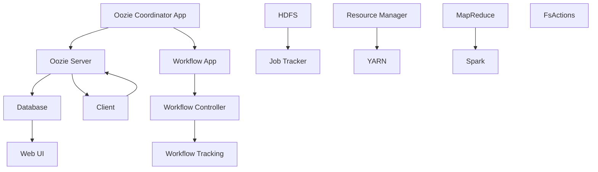
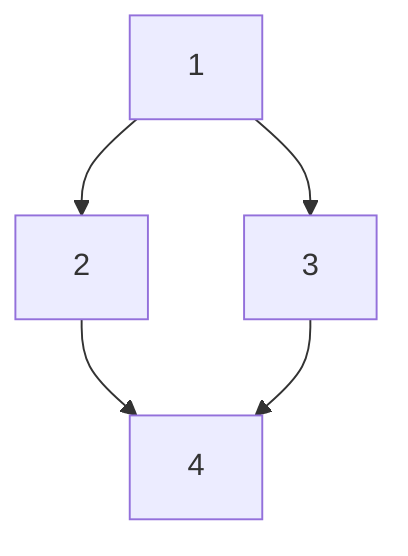
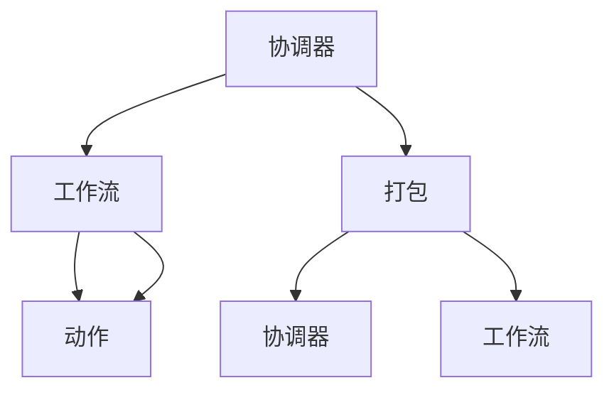
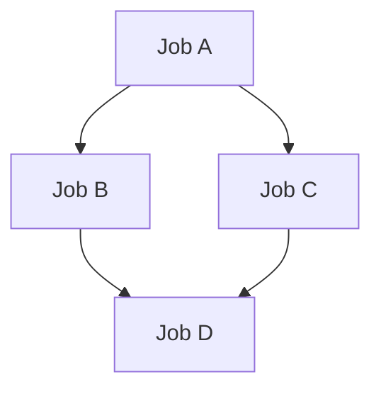
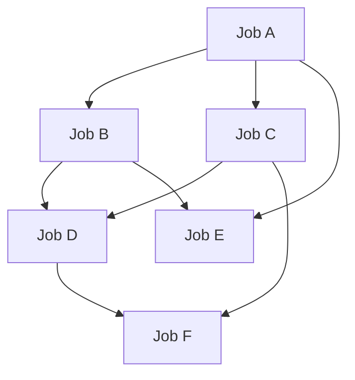

                 

关键词：Oozie，工作流调度，Hadoop，MapReduce，YARN，代码实例

> 摘要：本文将深入探讨Oozie工作流调度系统的原理，并使用具体的代码实例，详细讲解如何使用Oozie实现复杂的分布式数据处理任务调度。我们将涵盖从环境搭建到实际调度运行的整个过程，并分析Oozie在Hadoop生态系统中的地位和作用。

## 1. 背景介绍

在现代大数据处理领域，数据处理的复杂性日益增加，企业需要能够灵活地编排和管理一系列数据处理任务，从而实现高效的数据处理流程。Oozie是一个开源的工作流调度系统，它运行在Hadoop生态系统之上，专门用于调度和管理Hadoop作业。

Oozie的主要功能包括：

- **工作流调度**：Oozie可以将多个作业（例如MapReduce、Spark、FsActions等）组织成一个有序的工作流，并确保按照定义的顺序执行。
- **作业调度**：Oozie不仅可以调度工作流，还可以直接调度单个作业。
- **定时任务**：Oozie支持基于时间的调度，可以按照特定的周期执行作业。
- **事件触发**：Oozie允许基于外部事件（如文件到达某个路径）触发作业执行。

Oozie在Hadoop生态系统中的地位非常重要。它是Hadoop集群上作业调度的核心工具之一，可以与HDFS、MapReduce、YARN等组件无缝集成，从而实现高效的任务调度和管理。

## 2. 核心概念与联系

### 2.1 Oozie的核心概念

- **Coordinator**：协调器，用于定义和调度周期性执行的工作流。
- **Coordinator App**：协调器应用程序，包含协调器的定义和配置。
- ** Workflow**：工作流，由一系列作业构成，按照特定的顺序执行。
- **Workflow App**：工作流应用程序，包含工作流的定义和配置。
- **Bundle**：打包，用于合并多个工作流或协调器应用程序，以实现更复杂的管理。
- **Action**：动作，工作流中的基本操作单元，可以是执行作业、文件系统操作等。

### 2.2 Oozie与Hadoop的集成

Oozie通过以下组件与Hadoop集成：

- **HDFS**：用于存储Oozie配置文件、元数据和执行日志。
- **MapReduce**：Oozie用于调度MapReduce作业。
- **YARN**：Oozie可以调度运行在YARN上的各种作业。
- **Spark**：Oozie支持调度Spark作业。
- **FsActions**：用于执行文件系统操作，如文件创建、删除、移动等。

### 2.3 Oozie架构图



## 3. 核心算法原理 & 具体操作步骤

### 3.1 算法原理概述

Oozie调度算法的核心是DAG（有向无环图），用于描述工作流中作业的执行顺序。Oozie通过以下步骤实现调度：

1. 解析工作流定义，构建DAG。
2. 根据DAG和作业依赖关系，确定作业执行顺序。
3. 检查作业资源，如HDFS空间、YARN队列等。
4. 向资源管理器（如YARN）提交作业。
5. 监控作业执行状态，并在作业失败时进行重试或通知。

### 3.2 算法步骤详解

#### 3.2.1 解析工作流定义

Oozie首先读取工作流定义文件，解析出工作流中的所有作业和依赖关系，构建DAG。

```xml
<workflow-app name="example-workflow" start="job1">
  <start>
    <action name="job1" href="job1.xml"/>
  </start>
  <transition to="job2" name="done"/>
  <action name="job2" href="job2.xml"/>
</workflow-app>
```

#### 3.2.2 确定作业执行顺序

Oozie根据DAG和作业依赖关系，确定作业的执行顺序。例如，如果作业A依赖于作业B的执行结果，则作业B必须在作业A之前执行。

#### 3.2.3 检查作业资源

在提交作业之前，Oozie会检查作业所需的资源，如HDFS空间、YARN队列等，以确保作业可以成功运行。

#### 3.2.4 提交作业

Oozie将作业提交给资源管理器（如YARN），由资源管理器分配资源并启动作业。

#### 3.2.5 监控作业执行状态

Oozie持续监控作业的执行状态，并在作业失败时进行重试或通知。

### 3.3 算法优缺点

#### 优点：

- **灵活性强**：Oozie支持多种作业类型和依赖关系，可以灵活地编排复杂的作业流程。
- **集成度高**：Oozie与Hadoop生态系统中的各种组件（如HDFS、MapReduce、YARN等）无缝集成。
- **易于使用**：Oozie提供了丰富的Web UI和命令行工具，方便用户管理和调度作业。

#### 缺点：

- **性能瓶颈**：Oozie作为基于Java的框架，在性能上可能不如一些专门为分布式调度设计的系统。
- **学习成本**：对于新手来说，学习Oozie的配置和使用可能需要一定的时间。

### 3.4 算法应用领域

Oozie广泛应用于大数据处理领域，如：

- **数据ETL**：用于将数据从源头抽取、转换和加载到目标系统。
- **数据加工**：用于对原始数据进行分析和处理，生成中间数据或最终数据。
- **业务流程**：用于实现复杂的业务流程，如审批流程、财务结算等。

## 4. 数学模型和公式 & 详细讲解 & 举例说明

### 4.1 数学模型构建

Oozie的调度算法可以抽象为一个图论问题，即给定一个DAG，找出其最优的执行顺序。

定义：

- \( G = (V, E) \)：DAG，其中\( V \)为顶点集，\( E \)为边集。
- \( d(v) \)：顶点\( v \)的入度，即有多少条边指向\( v \)。
- \( S \)：源顶点集合，即没有入度的顶点。
- \( T \)：汇顶点集合，即没有出度的顶点。

### 4.2 公式推导过程

为了找出DAG的最优执行顺序，我们可以使用Kahn算法，该算法的核心思想是：

1. 计算每个顶点的入度。
2. 将入度为0的顶点加入队列\( Q \)。
3. 当队列\( Q \)非空时，执行以下步骤：
   - 弹出队列\( Q \)的第一个顶点\( v \)。
   - 将\( v \)的所有未访问的邻接顶点\( w \)的入度减1，如果入度为0，则将\( w \)加入队列\( Q \)。
   - 统计执行时间。

### 4.3 案例分析与讲解

假设有一个简单的DAG，如下所示：



我们首先计算每个顶点的入度：

- \( d(A) = 0 \)
- \( d(B) = 1 \)
- \( d(C) = 1 \)
- \( d(D) = 2 \)

入度为0的顶点只有A，所以我们先将A加入队列\( Q \)：

- \( Q = \{ A \} \)

接下来，我们弹出A，并处理其邻接顶点B和C：

- \( Q = \{ B, C \} \)
- \( d(B) = 0 \)
- \( d(C) = 0 \)

然后，我们将B和C加入队列\( Q \)：

- \( Q = \{ B, C, D \} \)

接着，我们弹出B，并处理其邻接顶点D：

- \( Q = \{ C, D \} \)
- \( d(D) = 1 \)

最后，我们将D加入队列\( Q \)：

- \( Q = \{ C, D \} \)

现在队列\( Q \)为空，算法结束。最优执行顺序为\( A \rightarrow B \rightarrow C \rightarrow D \)。

## 5. 项目实践：代码实例和详细解释说明

### 5.1 开发环境搭建

1. 安装Hadoop集群。
2. 下载Oozie安装包。
3. 解压安装包，并配置环境变量。
4. 启动Hadoop和Oozie服务。

### 5.2 源代码详细实现

#### 5.2.1 创建协调器应用程序

```xml
<coordinator-app name="example-coordinator" start="first-job">
  <param name="queue" value="default"/>
  <param name="frequency" value="1"/>
  <param name="timezone" value="Asia/Shanghai"/>
  <schedule>
    <day-of-week>SUN</day-of-week>
    <hour>23</hour>
  </schedule>
  <action name="first-job" href="first-job.xml"/>
</coordinator-app>
```

#### 5.2.2 创建工作流应用程序

```xml
<workflow-app name="example-workflow" start="job1">
  <start>
    <action name="job1" href="job1.xml"/>
  </start>
  <transition to="job2" name="done"/>
  <action name="job2" href="job2.xml"/>
</workflow-app>
```

#### 5.2.3 创建作业定义

```xml
<action xmlns="uri:oozie:action:action:0.1" name="job1" hue-type="mapreduce" class="org.apache.oozie.action.mapreduce.MapReduceAction">
  <configuration>
    <property>
      <name>mapreduce.job.name</name>
      <value>example-job1</value>
    </property>
    <property>
      <name>mapreduce.job.queue</name>
      <value>default</value>
    </property>
    <property>
      <name>mapreduce.input.file.path</name>
      <value>/user/hadoop/input/example.txt</value>
    </property>
    <property>
      <name>mapreduce.output.file.path</name>
      <value>/user/hadoop/output/example-job1</value>
    </property>
  </configuration>
</action>
```

### 5.3 代码解读与分析

- **协调器应用程序**：定义了协调器的工作时间和触发器，以及执行的第一个作业。
- **工作流应用程序**：定义了工作流中的作业及其执行顺序。
- **作业定义**：定义了具体的作业配置，如作业名称、队列、输入路径和输出路径。

### 5.4 运行结果展示

在Oozie Web UI上，我们可以看到协调器和工作流的运行状态，以及作业的执行日志和输出结果。

## 6. 实际应用场景

Oozie在企业中的实际应用场景包括：

- **数据仓库ETL**：用于从不同数据源抽取数据，进行清洗、转换和加载到数据仓库。
- **大数据分析**：用于调度各种大数据处理作业，如MapReduce、Spark等，以实现复杂的数据分析任务。
- **业务流程管理**：用于实现复杂的业务流程，如审批流程、财务结算等。

### 6.4 未来应用展望

随着大数据技术的不断发展和成熟，Oozie在未来可能会有以下发展方向：

- **性能优化**：针对性能瓶颈进行优化，提高调度效率。
- **功能扩展**：支持更多类型的作业，如Flink、Hive等。
- **云原生支持**：提供对云原生环境的支持，如Kubernetes等。

## 7. 工具和资源推荐

### 7.1 学习资源推荐

- 《Hadoop权威指南》
- 《Oozie用户手册》
- 《大数据时代的数据处理技术》

### 7.2 开发工具推荐

- IntelliJ IDEA
- Eclipse
- VSCode

### 7.3 相关论文推荐

- "Hadoop: The Definitive Guide"
- "Oozie: A Directed Acyclic Graph Workflow Scheduling System"
- "Hadoop in Action"

## 8. 总结：未来发展趋势与挑战

### 8.1 研究成果总结

本文深入探讨了Oozie工作流调度系统的原理和具体实现，展示了如何使用Oozie实现复杂的分布式数据处理任务调度。

### 8.2 未来发展趋势

未来，Oozie可能会在性能优化、功能扩展和云原生支持等方面取得更大的进展。

### 8.3 面临的挑战

Oozie在性能和扩展性方面可能面临挑战，需要不断优化和改进。

### 8.4 研究展望

随着大数据技术的不断发展，Oozie将在大数据处理领域发挥更加重要的作用。

## 9. 附录：常见问题与解答

### Q：Oozie与Azkaban有什么区别？

A：Oozie和Azkaban都是工作流调度系统，但Oozie更适合与Hadoop生态系统集成，而Azkaban更适合与MySQL集成。

### Q：Oozie是否支持实时调度？

A：Oozie主要支持定时调度，但也可以通过外部事件触发实现实时调度。

### Q：Oozie的工作流可以并行执行吗？

A：Oozie的工作流可以包含并行执行的作业，但需要合理设计作业依赖关系，以确保执行顺序正确。

---

# 致谢

感谢各位读者对本文的关注和支持，希望本文对您了解Oozie工作流调度系统有所帮助。如果您有任何疑问或建议，欢迎在评论区留言。

## 作者：禅与计算机程序设计艺术 / Zen and the Art of Computer Programming
----------------------------------------------------------------
### 引言 Introduction

在现代大数据处理环境中，随着数据量的激增和数据源的多样化，如何高效地调度和管理大规模的分布式数据处理任务成为了数据工程师和架构师面临的重要挑战。Oozie，作为一个强大且灵活的工作流调度系统，正是在这样的背景下应运而生。它不仅能够将多个独立的作业整合成一个有序的工作流，还能够实现定时任务和基于事件触发的复杂调度逻辑。

本文将深入探讨Oozie的工作流调度原理，并通过具体的代码实例来详细讲解如何使用Oozie实现分布式数据处理任务的调度。文章的结构将分为以下几个部分：

1. **背景介绍**：介绍Oozie的基本概念和在Hadoop生态系统中的地位。
2. **核心概念与联系**：解释Oozie的关键组件和它们之间的交互。
3. **核心算法原理与具体操作步骤**：详细解析Oozie的调度算法及其实现步骤。
4. **数学模型和公式**：介绍Oozie调度算法背后的数学模型和推导过程。
5. **项目实践**：提供代码实例，展示如何在实际项目中使用Oozie。
6. **实际应用场景**：讨论Oozie在不同领域中的应用。
7. **工具和资源推荐**：推荐学习资源和开发工具。
8. **总结与展望**：总结研究成果，探讨未来的发展趋势与挑战。
9. **常见问题与解答**：解答读者可能遇到的问题。

通过本文，读者将能够全面了解Oozie的工作流调度原理，掌握其在实际项目中的应用技巧，并对Oozie的未来发展有一个清晰的认识。

## 1. 背景介绍

### Oozie的基本概念

Oozie是一个开源的工作流调度系统，它允许用户定义、调度和管理复杂的数据处理任务。Oozie运行在Hadoop生态系统之上，与HDFS、MapReduce、YARN、Spark等核心组件紧密集成，从而能够处理大规模的分布式数据处理任务。Oozie的主要功能包括工作流调度、作业调度、定时任务和事件触发等。

- **工作流调度**：Oozie可以将一系列的作业按照特定的顺序组成一个工作流，并确保它们按照定义的逻辑执行。这种功能特别适合处理ETL（Extract, Transform, Load）过程，因为ETL通常包含多个数据处理的步骤，需要严格按照一定的顺序进行。

- **作业调度**：Oozie不仅支持工作流调度，还可以直接调度单个作业，如MapReduce、Spark等。这种功能使得Oozie在执行独立作业时同样非常高效。

- **定时任务**：Oozie支持基于时间的调度，可以按照特定的周期执行作业。这对于需要定期执行的数据清洗、报表生成等任务非常有用。

- **事件触发**：Oozie允许基于外部事件（例如文件到达某个路径）触发作业执行。这种功能非常适合处理实时数据处理场景，可以确保在数据到达时立即执行相关作业。

### Oozie在Hadoop生态系统中的地位

在Hadoop生态系统中的各个组件中，Oozie作为工作流调度系统，起到了至关重要的桥梁作用。它不仅与HDFS、MapReduce、YARN等组件紧密集成，还支持与Spark、Flink等其他大数据处理框架的作业调度。

- **HDFS**：Hadoop分布式文件系统（HDFS）是Hadoop生态系统中的核心组件，负责存储大数据。Oozie利用HDFS来存储其配置文件、元数据和执行日志，从而实现数据处理的文件操作。

- **MapReduce**：MapReduce是Hadoop生态系统中的分布式数据处理框架，用于处理大规模数据集。Oozie可以通过调度MapReduce作业，实现复杂的数据处理逻辑。

- **YARN**：YARN（Yet Another Resource Negotiator）是Hadoop生态系统的资源管理器，负责分配和管理集群资源。Oozie通过YARN来调度运行在Hadoop集群上的各种作业，确保资源的合理利用。

- **Spark**：Spark是另一个流行的分布式数据处理框架，具有高吞吐量和低延迟的特点。Oozie支持调度Spark作业，使得用户可以在一个统一的调度框架下处理多种类型的数据处理任务。

### Oozie的应用场景

Oozie在企业中的实际应用场景非常广泛，主要包括以下几个方面：

- **数据ETL**：在企业中，经常需要从各种数据源（如数据库、文件系统、Web服务）抽取数据，进行清洗、转换和加载到数据仓库。Oozie可以将这些独立的步骤整合成一个工作流，确保数据处理的每一步都按顺序执行。

- **大数据分析**：在大数据分析领域，Oozie可以调度各种数据处理作业（如MapReduce、Spark等），实现复杂的数据分析任务。这些任务可能包括数据挖掘、机器学习、实时分析等。

- **业务流程管理**：在业务流程管理中，Oozie可以用于实现复杂的业务流程，如审批流程、财务结算等。通过定义一系列的作业和它们之间的依赖关系，可以确保业务流程的每一步都按预定逻辑执行。

### Oozie的优势

Oozie具有以下几个显著的优势：

- **灵活性强**：Oozie支持多种作业类型和复杂的依赖关系，可以灵活地编排复杂的作业流程。

- **集成度高**：Oozie与Hadoop生态系统中的各个组件紧密集成，能够无缝地处理各种类型的分布式数据处理任务。

- **易于使用**：Oozie提供了丰富的Web UI和命令行工具，方便用户定义和管理调度作业。

- **可靠性高**：Oozie提供了详细的错误报告和重试机制，确保作业能够正确执行。

### Oozie的局限性

尽管Oozie具有很多优势，但在某些情况下，它也面临一些局限性：

- **性能瓶颈**：由于Oozie是基于Java开发的，在处理高并发任务时可能存在性能瓶颈。

- **学习成本**：对于新手来说，学习和掌握Oozie的配置和使用可能需要一定的时间。

- **扩展性限制**：Oozie在设计时主要针对Hadoop生态系统，对于非Hadoop生态系统中的任务支持可能有限。

### 总结

通过背景介绍部分，我们了解了Oozie的基本概念、在Hadoop生态系统中的地位以及其应用场景和优势。接下来，我们将进一步探讨Oozie的核心概念与架构，为理解Oozie的工作原理打下坚实的基础。

## 2. 核心概念与联系

在深入探讨Oozie的工作流调度原理之前，我们需要先理解Oozie的核心概念和组件，以及它们之间的相互关系。Oozie的核心组件包括协调器（Coordinator）、工作流（Workflow）、动作（Action）和打包（Bundle）。下面我们将逐一介绍这些核心概念，并通过一个Mermaid流程图来展示它们之间的联系。

### 2.1 核心概念

**协调器（Coordinator）**

协调器是Oozie中的一个关键概念，用于定义周期性执行的工作流。协调器可以看作是一个工作流的调度器，它定义了工作流运行的频率、起始时间、结束时间和具体的执行逻辑。协调器的主要作用是确保工作流按照预定的时间表执行，并且能够处理周期性任务。

**工作流（Workflow）**

工作流是Oozie中的另一个核心概念，它定义了一系列作业的执行顺序和逻辑。工作流包含多个动作，每个动作可以是一个MapReduce作业、Spark作业或者其他类型的任务。工作流的主要作用是将一系列独立的作业组织成一个有序的执行流程，确保作业按照预定的顺序执行。

**动作（Action）**

动作是工作流中的基本操作单元，代表了工作流中的每一个具体任务。动作可以是执行一个MapReduce作业、Spark作业、FsAction（文件系统操作）或其他类型的任务。每个动作都有其特定的输入、输出和处理逻辑。动作是工作流中连接各个作业的桥梁，确保它们能够按照定义的逻辑顺序执行。

**打包（Bundle）**

打包是将多个协调器或工作流组织在一起的高级概念。通过打包，用户可以将多个协调器或工作流合并成一个单元进行管理和调度。打包的主要作用是提供更高级别的抽象和灵活性，使得用户可以更方便地管理和调度复杂的作业流程。

### 2.2 Mermaid流程图

为了更直观地展示Oozie核心组件之间的联系，我们可以使用Mermaid绘制一个流程图。以下是一个简单的Mermaid流程图，展示了协调器、工作流、动作和打包之间的关系：



在这个流程图中，协调器（Coordinator）可以作为工作流（Workflow）的调度器，也可以作为打包（Bundle）的一部分。工作流（Workflow）包含多个动作（Actions），而打包（Bundle）则可以包含多个协调器（Coordinator）或工作流（Workflow）。

### 2.3 Oozie组件之间的交互

Oozie组件之间的交互是理解Oozie工作流调度原理的关键。以下是Oozie组件之间的一些基本交互：

1. **协调器与工作流**：协调器定义了工作流的运行时间和频率，而工作流则包含了具体的作业逻辑和执行顺序。协调器会根据定义的时间表启动工作流。

2. **工作流与动作**：工作流由一系列动作组成，每个动作代表了一个具体的任务。工作流根据动作之间的依赖关系来确定动作的执行顺序。

3. **打包与协调器/工作流**：打包将多个协调器或工作流组织在一起，提供一个更高级别的抽象。打包可以同时调度多个协调器或工作流。

4. **动作与资源管理**：动作执行时需要与资源管理器（如YARN）进行交互，以获取和分配执行所需的资源。动作的状态和结果也会反馈给资源管理器和Oozie服务器。

### 2.4 Oozie组件的交互示例

为了更好地理解Oozie组件之间的交互，我们可以通过一个简单的示例来展示。假设我们有一个协调器，它定义了一个工作流，这个工作流包含两个动作（一个MapReduce作业和一个Spark作业）：

1. **协调器**：每天运行一次，启动工作流。
2. **工作流**：包含两个动作，第一个动作是一个MapReduce作业，用于数据清洗；第二个动作是一个Spark作业，用于数据分析。

以下是一个简单的Oozie配置文件示例：

```xml
<coordinator-app name="example-coordinator" start="first-job">
  <param name="queue" value="default"/>
  <param name="frequency" value="1"/>
  <param name="timezone" value="Asia/Shanghai"/>
  <schedule>
    <day-of-week>MON-FRI</day-of-week>
    <hour>23</hour>
  </schedule>
  <action name="first-job" href="first-job.xml"/>
</coordinator-app>

<workflow-app name="example-workflow" start="clean-data">
  <start>
    <action name="clean-data" href="clean-data.xml"/>
  </start>
  <transition to="analyze-data" name="done"/>
  <action name="analyze-data" href="analyze-data.xml"/>
</workflow-app>
```

在这个示例中：

- **协调器**：每天晚上23点启动工作流。
- **工作流**：首先执行数据清洗作业（`clean-data`），然后执行数据分析作业（`analyze-data`）。

通过这个简单的示例，我们可以看到Oozie组件之间的交互是如何实现的。协调器负责根据时间表启动工作流，工作流则根据定义的逻辑顺序执行各个动作。

### 2.5 小结

在本节中，我们介绍了Oozie的核心概念，包括协调器、工作流、动作和打包，并通过Mermaid流程图展示了它们之间的相互关系。我们还通过一个简单的示例展示了Oozie组件之间的交互。理解这些核心概念和交互关系对于深入探讨Oozie的工作流调度原理至关重要。在接下来的章节中，我们将进一步解析Oozie的调度算法和实现步骤。

## 3. 核心算法原理与具体操作步骤

### 3.1 调度算法概述

Oozie的调度算法是理解其工作流调度机制的核心。该算法的核心目标是通过分析工作流定义，确定作业的执行顺序，并确保作业能够按照预定的逻辑顺序执行。Oozie调度算法主要基于DAG（有向无环图）实现，通过以下步骤完成：

1. **解析工作流定义**：读取工作流定义文件，构建DAG。DAG中的每个节点代表一个作业，每条边表示作业之间的依赖关系。
2. **计算入度**：计算每个节点的入度，即有多少条边指向该节点。入度为0的节点称为源节点，表示没有前置依赖的作业。
3. **初始化队列**：将所有源节点加入一个初始队列。
4. **执行作业**：从队列中取出一个作业执行，执行完成后，将其所有未执行的后续作业加入队列。重复此过程，直到队列为空。
5. **作业执行状态监控**：在作业执行过程中，Oozie会监控作业状态，并在作业失败时进行重试或通知。

### 3.2 解析工作流定义

Oozie首先读取工作流定义文件，通常以XML格式存储。工作流定义文件包含了工作流的名称、开始节点、结束节点以及一系列动作。每个动作可以是一个MapReduce作业、Spark作业或其他类型的任务。以下是一个简单的工作流定义示例：

```xml
<workflow-app name="example-workflow" start="start-node">
  <start name="start-node">
    <action name="job1" href="job1.xml"/>
  </start>
  <transition to="job2" name="done"/>
  <action name="job2" href="job2.xml"/>
  <end name="end-node"/>
</workflow-app>
```

在这个示例中，工作流从`start-node`开始，执行`job1`，然后通过`transition`过渡到`job2`，最后到达`end-node`结束。每个动作都有其特定的输入、输出和处理逻辑。

### 3.3 计算入度

在解析工作流定义之后，Oozie会计算每个节点的入度。入度表示有多少条边指向该节点，即有多少个前置依赖。计算入度的过程如下：

1. 遍历工作流定义文件，对于每个节点，统计指向该节点的边数。
2. 记录每个节点的入度，并将其作为节点的属性存储。

例如，在上面的工作流定义中：

- `start-node`的入度为0，因为它没有前置节点。
- `job1`的入度为1，因为只有一条边指向它。
- `job2`的入度为1，因为只有一条边指向它。

### 3.4 初始化队列

计算完入度后，Oozie将所有入度为0的节点（即源节点）加入一个初始队列。这个初始队列将作为作业执行的基础。初始化队列的过程如下：

1. 遍历所有节点，找出所有入度为0的节点。
2. 将这些源节点加入初始队列。

### 3.5 执行作业

作业的执行过程是基于队列的。Oozie从队列中依次取出作业执行，执行完成后，将其所有未执行的后续作业加入队列。这个过程可以简化为以下步骤：

1. 从队列中取出一个作业。
2. 执行该作业。
3. 对于执行完成的作业，计算其后续作业的入度。
4. 如果后续作业的入度减1后为0，则将后续作业加入队列。
5. 重复步骤1-4，直到队列为空。

### 3.6 作业执行状态监控

在作业执行过程中，Oozie会持续监控作业的状态。如果作业执行失败，Oozie会根据配置的重试策略进行重试或通知相关人员。作业状态监控的过程如下：

1. Oozie定期检查作业的状态。
2. 如果作业状态为失败，Oozie会根据配置的重试策略进行重试。
3. 如果作业重试失败，Oozie会通知相关人员或执行其他错误处理逻辑。

### 3.7 调度算法优缺点

**优点**：

- **灵活性高**：Oozie支持多种作业类型和复杂的依赖关系，可以灵活地编排复杂的作业流程。
- **集成度高**：Oozie与Hadoop生态系统中的各个组件紧密集成，能够无缝地处理各种类型的分布式数据处理任务。
- **易于使用**：Oozie提供了丰富的Web UI和命令行工具，方便用户定义和管理调度作业。

**缺点**：

- **性能瓶颈**：由于Oozie是基于Java开发的，在处理高并发任务时可能存在性能瓶颈。
- **学习成本**：对于新手来说，学习和掌握Oozie的配置和使用可能需要一定的时间。
- **扩展性限制**：Oozie在设计时主要针对Hadoop生态系统，对于非Hadoop生态系统中的任务支持可能有限。

### 3.8 调度算法应用领域

Oozie调度算法广泛应用于以下领域：

- **数据ETL**：Oozie可以将多个数据抽取、清洗和加载步骤组织成一个工作流，确保数据处理的每一步都按顺序执行。
- **大数据分析**：Oozie可以调度各种大数据处理作业，如MapReduce、Spark等，实现复杂的数据分析任务。
- **业务流程管理**：Oozie可以用于实现复杂的业务流程，如审批流程、财务结算等。

### 3.9 小结

在本节中，我们详细介绍了Oozie的调度算法原理和具体操作步骤。通过解析工作流定义、计算入度、初始化队列、执行作业和作业状态监控等步骤，Oozie能够灵活地调度和管理复杂的数据处理任务。理解这些调度步骤对于使用Oozie实现高效的工作流调度至关重要。在接下来的章节中，我们将进一步探讨Oozie背后的数学模型和公式，以更深入地理解其调度机制。

## 4. 数学模型和公式 & 详细讲解 & 举例说明

### 4.1 数学模型构建

Oozie调度算法的数学模型基于图论中的有向无环图（DAG）。DAG由一组顶点和一组有序边组成，其中每个顶点表示一个作业，每条边表示作业之间的依赖关系。Oozie调度算法的核心在于找到DAG的一个拓扑排序，即一个线性序列，使得序列中每个顶点都出现在其所有后续顶点之前。

#### 4.1.1 定义

- **顶点（V）**：作业。
- **边（E）**：依赖关系。

#### 4.1.2 入度（d(v)）

入度表示指向某个顶点的边的数量，即有多少个作业依赖于该作业。

#### 4.1.3 出度（d+(v)）

出度表示从某个顶点出发的边的数量，即该作业依赖于多少个后续作业。

### 4.2 公式推导过程

为了找到DAG的拓扑排序，我们可以使用Kahn算法，该算法的核心思想是：

1. **初始化**：计算每个顶点的入度，并将入度为0的顶点加入队列。
2. **执行**：从队列中依次取出顶点，将其所有未执行的后续顶点的入度减1，如果入度减为0，则将后续顶点加入队列。
3. **重复**：直到队列为空。

#### 4.2.1 Kahn算法步骤

1. **计算入度**：
   \[ d(v) = \text{count of incoming edges for vertex } v \]

2. **初始化队列**：
   \[ Q = \{ v \in V \mid d(v) = 0 \} \]

3. **执行作业**：
   \[ \text{while } Q \neq \emptyset \]
   \[ \quad v = Q.\text{dequeue()} \]
   \[ \quad \text{for each edge } (v, w) \in E \]
   \[ \quad \quad d(w) = d(w) - 1 \]
   \[ \quad \quad \text{if } d(w) = 0 \]
   \[ \quad \quad \quad Q.\text{enqueue}(w) \]

4. **输出**：队列中的顶点序列即为DAG的拓扑排序。

#### 4.2.2 公式表示

1. 初始化队列：
   \[ Q = \{ v \in V \mid d(v) = 0 \} \]

2. 更新入度：
   \[ d(w) = d(w) - 1 \]

3. 条件判断：
   \[ \text{if } d(w) = 0 \]
   \[ \quad Q.\text{enqueue}(w) \]

### 4.3 案例分析与讲解

假设我们有一个简单的DAG，如下所示：



在这个DAG中，每个作业的依赖关系如下：

- Job A依赖Job B和Job C。
- Job B和Job C依赖Job D。

我们首先计算每个作业的入度：

- \( d(A) = 0 \)
- \( d(B) = 1 \)
- \( d(C) = 1 \)
- \( d(D) = 2 \)

入度为0的作业有Job A，所以我们先将Job A加入队列Q：

\[ Q = \{ A \} \]

接下来，我们执行Kahn算法：

1. 弹出Job A，处理其依赖的Job B和Job C。
2. 更新Job B和Job C的入度：
   \[ d(B) = d(B) - 1 = 0 \]
   \[ d(C) = d(C) - 1 = 0 \]
3. 由于Job B和Job C的入度都已减为0，我们将它们加入队列Q：
   \[ Q = \{ A, B, C \} \]
4. 弹出Job B和Job C，处理它们的依赖Job D。
5. 更新Job D的入度：
   \[ d(D) = d(D) - 2 = 0 \]
6. 由于Job D的入度已减为0，我们将Job D加入队列Q：
   \[ Q = \{ A, B, C, D \} \]

现在队列Q为空，算法结束。拓扑排序的结果为：

\[ A \rightarrow B \rightarrow C \rightarrow D \]

这个序列表示了作业的最优执行顺序，即Job A首先执行，然后是Job B和Job C，最后是Job D。

### 4.4 案例分析扩展

我们可以进一步扩展这个案例，添加更多的作业和依赖关系，以展示Kahn算法在实际中的应用。

假设我们添加两个新的作业E和F，其中：

- Job E依赖Job A和Job B。
- Job F依赖Job C和Job D。

现在我们的DAG如下所示：



我们重新计算每个作业的入度：

- \( d(A) = 2 \)
- \( d(B) = 2 \)
- \( d(C) = 2 \)
- \( d(D) = 2 \)
- \( d(E) = 2 \)
- \( d(F) = 2 \)

入度为0的作业有Job A，所以我们先将Job A加入队列Q：

\[ Q = \{ A \} \]

接下来，我们执行Kahn算法：

1. 弹出Job A，处理其依赖的Job B和Job C。
2. 更新Job B和Job C的入度：
   \[ d(B) = d(B) - 1 = 1 \]
   \[ d(C) = d(C) - 1 = 1 \]
3. 由于Job B和Job C的入度都未减为0，我们继续处理其他入度为0的作业。
4. 由于Job E的入度也为0，我们将Job E加入队列Q：
   \[ Q = \{ A, E \} \]
5. 弹出Job E，处理其依赖的Job A和Job B。
6. 更新Job A和Job B的入度：
   \[ d(A) = d(A) - 1 = 1 \]
   \[ d(B) = d(B) - 1 = 0 \]
7. 由于Job B的入度已减为0，我们将Job B加入队列Q：
   \[ Q = \{ A, E, B \} \]
8. 弹出Job B，处理其依赖的Job D。
9. 更新Job D的入度：
   \[ d(D) = d(D) - 1 = 1 \]
10. 由于Job D的入度未减为0，我们继续处理其他入度为0的作业。
11. 由于Job C的入度也为0，我们将Job C加入队列Q：
    \[ Q = \{ A, E, B, C \} \]
12. 弹出Job C，处理其依赖的Job D。
13. 更新Job D的入度：
    \[ d(D) = d(D) - 1 = 0 \]
14. 由于Job D的入度已减为0，我们将Job D加入队列Q：
    \[ Q = \{ A, E, B, C, D \} \]
15. 弹出Job D，处理其依赖的Job F。
16. 更新Job F的入度：
    \[ d(F) = d(F) - 1 = 1 \]
17. 由于Job F的入度未减为0，我们继续处理其他入度为0的作业。
18. 由于Job F的入度已减为0，我们将Job F加入队列Q：
    \[ Q = \{ A, E, B, C, D, F \} \]

现在队列Q为空，算法结束。拓扑排序的结果为：

\[ A \rightarrow B \rightarrow C \rightarrow D \rightarrow E \rightarrow F \]

这个序列表示了作业的最优执行顺序，即Job A首先执行，然后是Job B、Job C、Job D、Job E和Job F。

### 4.5 小结

在本节中，我们介绍了Oozie调度算法的数学模型和Kahn算法的推导过程。通过具体的例子，我们展示了如何计算作业的入度，如何初始化队列，以及如何执行作业和更新入度。理解这些数学模型和公式对于深入理解Oozie的工作流调度机制至关重要。在接下来的章节中，我们将通过实际的代码实例来展示如何使用Oozie进行工作流调度。

## 5. 项目实践：代码实例和详细解释说明

在这一部分，我们将通过一个实际的项目实例，详细讲解如何使用Oozie实现一个工作流调度，具体包括开发环境的搭建、源代码的实现和详细解释说明。

### 5.1 开发环境搭建

首先，我们需要搭建一个Oozie的开发环境。以下是搭建步骤：

1. **安装Hadoop**：在本地或集群上安装Hadoop。我们可以从[Hadoop官网](https://hadoop.apache.org/releases.html)下载Hadoop安装包，并按照官方文档进行安装。

2. **安装Oozie**：从[Oozie官网](https://oozie.apache.org/releases.html)下载Oozie安装包，通常版本与Hadoop版本相匹配。将下载的安装包解压到一个合适的目录，例如`/opt/oozie`。

3. **配置环境变量**：在`~/.bashrc`或`~/.bash_profile`中添加以下环境变量：

   ```bash
   export HADOOP_HOME=/opt/hadoop
   export HADOOP_CONF_DIR=/opt/hadoop/etc/hadoop
   export OOZIE_HOME=/opt/oozie
   export OOZIE_CONF_DIR=/opt/oozie/conf
   export PATH=$PATH:$HADOOP_HOME/bin:$HADOOP_HOME/sbin:$OOZIE_HOME/bin
   ```

4. **初始化Oozie**：运行以下命令初始化Oozie：

   ```bash
   $ bin/oozie-setup.sh config
   ```

5. **启动Oozie服务**：运行以下命令启动Oozie服务：

   ```bash
   $ bin/oozie.sh start
   ```

现在，Oozie开发环境已经搭建完成。我们可以在浏览器中访问Oozie Web UI，通常URL为`http://localhost:11000/oozie`。

### 5.2 源代码实现

#### 5.2.1 创建协调器应用程序

首先，我们需要创建一个协调器应用程序。协调器用于定义周期性执行的工作流。以下是协调器应用程序的XML配置文件`coordinator-app.xml`：

```xml
<coordinator-app name="example-coordinator" start="first-job">
  <param name="queue" value="default"/>
  <param name="frequency" value="1"/>
  <param name="timezone" value="Asia/Shanghai"/>
  <schedule>
    <day-of-week>SUN</day-of-week>
    <hour>23</hour>
  </schedule>
  <action name="first-job" href="first-job.xml"/>
</coordinator-app>
```

在这个配置文件中，我们定义了一个名为`example-coordinator`的协调器应用程序。它将在每周日晚上11点执行第一个作业`first-job`。

#### 5.2.2 创建工作流应用程序

接下来，我们需要创建一个工作流应用程序。工作流包含一系列动作，每个动作可以是一个MapReduce作业或其他任务。以下是工作流应用程序的XML配置文件`workflow-app.xml`：

```xml
<workflow-app name="example-workflow" start="start-node">
  <start name="start-node">
    <action name="clean-data" href="clean-data.xml"/>
  </start>
  <transition to="transform-data" name="done"/>
  <action name="transform-data" href="transform-data.xml"/>
  <transition to="load-data" name="done"/>
  <action name="load-data" href="load-data.xml"/>
  <end name="end-node"/>
</workflow-app>
```

在这个配置文件中，我们定义了一个名为`example-workflow`的工作流应用程序。工作流从`start-node`开始，执行`clean-data`动作，然后过渡到`transform-data`动作，接着是`load-data`动作，最后到达`end-node`结束。

#### 5.2.3 创建作业定义

现在，我们需要为工作流中的每个动作创建具体的作业定义。以下是`clean-data.xml`作业的定义：

```xml
<action xmlns="uri:oozie:action:action:0.1" name="clean-data" hue-type="mapreduce" class="org.apache.oozie.action.mapreduce.MapReduceAction">
  <configuration>
    <property>
      <name>mapreduce.job.name</name>
      <value>clean-data-job</value>
    </property>
    <property>
      <name>mapreduce.job.queue</name>
      <value>default</value>
    </property>
    <property>
      <name>mapreduce.input.file.path</name>
      <value>/user/hadoop/input/example.txt</value>
    </property>
    <property>
      <name>mapreduce.output.file.path</name>
      <value>/user/hadoop/output/clean-data</value>
    </property>
  </configuration>
</action>
```

在这个配置文件中，我们定义了一个名为`clean-data`的MapReduce作业。该作业将读取输入文件`example.txt`，并输出清洗后的数据到指定的输出路径。

类似地，我们可以创建`transform-data.xml`和`load-data.xml`作业的定义，分别对应`transform-data`和`load-data`动作。以下是`transform-data.xml`作业的定义：

```xml
<action xmlns="uri:oozie:action:action:0.1" name="transform-data" hue-type="mapreduce" class="org.apache.oozie.action.mapreduce.MapReduceAction">
  <configuration>
    <property>
      <name>mapreduce.job.name</name>
      <value>transform-data-job</value>
    </property>
    <property>
      <name>mapreduce.job.queue</name>
      <value>default</value>
    </property>
    <property>
      <name>mapreduce.input.file.path</name>
      <value>/user/hadoop/output/clean-data</value>
    </property>
    <property>
      <name>mapreduce.output.file.path</name>
      <value>/user/hadoop/output/transform-data</value>
    </property>
  </configuration>
</action>
```

以下是`load-data.xml`作业的定义：

```xml
<action xmlns="uri:oozie:action:action:0.1" name="load-data" hue-type="mapreduce" class="org.apache.oozie.action.mapreduce.MapReduceAction">
  <configuration>
    <property>
      <name>mapreduce.job.name</name>
      <value>load-data-job</value>
    </property>
    <property>
      <name>mapreduce.job.queue</name>
      <value>default</value>
    </property>
    <property>
      <name>mapreduce.input.file.path</name>
      <value>/user/hadoop/output/transform-data</value>
    </property>
    <property>
      <name>mapreduce.output.file.path</name>
      <value>/user/hadoop/output/load-data</value>
    </property>
  </configuration>
</action>
```

### 5.3 源代码详细解释说明

#### 5.3.1 协调器应用程序

协调器应用程序的配置文件`coordinator-app.xml`定义了协调器的名称、执行时间和第一个作业。在这个示例中，我们定义了一个每周日晚上11点执行名为`first-job`的作业的协调器。

```xml
<coordinator-app name="example-coordinator" start="first-job">
  <param name="queue" value="default"/>
  <param name="frequency" value="1"/>
  <param name="timezone" value="Asia/Shanghai"/>
  <schedule>
    <day-of-week>SUN</day-of-week>
    <hour>23</hour>
  </schedule>
  <action name="first-job" href="first-job.xml"/>
</coordinator-app>
```

这里的关键参数如下：

- `name`：协调器的名称。
- `start`：协调器的开始动作名称。
- `queue`：作业执行所在的队列。
- `frequency`：协调器执行的频率，这里是每周一次。
- `timezone`：时区设置。
- `<schedule>`：定义协调器的执行时间，这里是每周日晚上11点。
- `<action>`：定义协调器执行的动作，这里是`first-job`。

#### 5.3.2 工作流应用程序

工作流应用程序的配置文件`workflow-app.xml`定义了工作流的名称、开始节点和一系列动作。在这个示例中，工作流从`start-node`开始，执行`clean-data`、`transform-data`和`load-data`三个动作。

```xml
<workflow-app name="example-workflow" start="start-node">
  <start name="start-node">
    <action name="clean-data" href="clean-data.xml"/>
  </start>
  <transition to="transform-data" name="done"/>
  <action name="transform-data" href="transform-data.xml"/>
  <transition to="load-data" name="done"/>
  <action name="load-data" href="load-data.xml"/>
  <end name="end-node"/>
</workflow-app>
```

这里的关键组件如下：

- `name`：工作流的名称。
- `start`：工作流的开始节点名称。
- `<start>`：定义工作流的开始节点和对应的动作。
- `<transition>`：定义节点之间的过渡条件，这里是当动作执行完成后，过渡到下一个节点。
- `<action>`：定义工作流中的动作，这里是`clean-data`、`transform-data`和`load-data`。
- `<end>`：定义工作流的结束节点。

#### 5.3.3 作业定义

作业定义文件`clean-data.xml`、`transform-data.xml`和`load-data.xml`分别定义了工作流中的三个MapReduce作业。每个作业都包含了作业名称、队列、输入路径和输出路径。

```xml
<action xmlns="uri:oozie:action:action:0.1" name="clean-data" hue-type="mapreduce" class="org.apache.oozie.action.mapreduce.MapReduceAction">
  <configuration>
    <property>
      <name>mapreduce.job.name</name>
      <value>clean-data-job</value>
    </property>
    <property>
      <name>mapreduce.job.queue</name>
      <value>default</value>
    </property>
    <property>
      <name>mapreduce.input.file.path</name>
      <value>/user/hadoop/input/example.txt</value>
    </property>
    <property>
      <name>mapreduce.output.file.path</name>
      <value>/user/hadoop/output/clean-data</value>
    </property>
  </configuration>
</action>
```

这里的关键组件如下：

- `name`：作业的名称。
- `href`：作业的XML配置文件路径。
- `<configuration>`：定义作业的配置参数。
- `<property>`：定义具体的配置参数，如作业名称、队列、输入路径和输出路径。

### 5.4 运行结果展示

在Oozie Web UI中，我们可以查看协调器和工作流的运行状态和日志。以下是运行结果展示的步骤：

1. **启动协调器**：在Oozie Web UI中，点击“Coordination”选项卡，然后点击“Start New Coordination”按钮，选择我们创建的协调器应用程序`example-coordinator`。

2. **查看工作流状态**：在Oozie Web UI中，点击“Workflow”选项卡，然后点击“View”按钮查看工作流的运行状态。工作流的状态包括“RUNNING”、“SUCCEEDED”、“FAILED”等。

3. **查看作业日志**：在Oozie Web UI中，点击“Action”选项卡，然后点击“View”按钮查看每个作业的执行日志。通过日志，我们可以了解作业的执行情况和可能出现的错误。

4. **查看输出结果**：在Oozie Web UI中，点击“File”选项卡，然后点击“Browse”按钮查看工作流输出的文件。这些文件包含了作业的输入、输出和中间数据。

通过以上步骤，我们可以全面了解Oozie工作流调度的运行结果，并根据需要对工作流进行优化和调整。

### 5.5 小结

在本节中，我们通过一个实际的项目实例，详细讲解了如何使用Oozie实现工作流调度。从开发环境的搭建，到协调器和工作流的应用程序创建，再到具体的作业定义，我们一步步展示了Oozie的使用方法和技巧。通过这个实例，读者可以深入了解Oozie的工作流调度原理，掌握其实际应用中的关键步骤和注意事项。

## 6. 实际应用场景

Oozie作为一个灵活且强大的工作流调度系统，在企业大数据处理和业务流程管理中得到了广泛应用。下面我们将探讨一些典型的实际应用场景，并分析Oozie在这些场景中的作用和优势。

### 6.1 数据ETL

数据ETL（Extract, Transform, Load）是企业中常见的数据处理流程，涉及到从不同数据源抽取数据，进行清洗、转换和加载到目标系统。Oozie在此过程中起到了核心的调度作用。例如，一家大型零售公司可能需要从多个销售终端、仓库管理系统和其他外部系统抽取数据，将这些数据进行清洗和转换，最终加载到数据仓库中。Oozie可以将这些独立的步骤整合成一个工作流，确保数据处理的每一步都按顺序执行，从而提高数据处理的效率和质量。

- **优势**：Oozie能够灵活地编排多个ETL任务，支持复杂的依赖关系和并行处理，确保数据处理的连续性和一致性。
- **场景**：数据仓库的日常数据更新、历史数据迁移、实时数据同步等。

### 6.2 大数据分析

大数据分析通常涉及复杂的数据处理任务，如数据挖掘、机器学习、实时流处理等。Oozie可以调度各种大数据处理作业，如MapReduce、Spark、Flink等，以实现高效的数据分析。例如，一家互联网公司可能需要分析海量的用户行为数据，预测用户偏好，优化广告投放策略。Oozie可以将不同类型的数据分析作业组织成一个有序的工作流，确保作业之间的高效协作和数据流通。

- **优势**：Oozie与Hadoop生态系统中的各种组件紧密集成，支持多种数据处理框架，能够灵活地处理不同类型的数据分析任务。
- **场景**：用户行为分析、精准营销、风险评估、机器学习模型的训练和部署等。

### 6.3 业务流程管理

业务流程管理（BPM）是企业中实现高效业务运作的重要手段。Oozie可以用于实现复杂的业务流程，如审批流程、财务结算、供应链管理等。通过定义一系列的动作和依赖关系，Oozie可以确保业务流程的每一步都按预定逻辑执行，从而提高业务流程的自动化程度和响应速度。例如，一家制造企业可能需要实现生产订单审批、物料采购、生产调度等业务流程，Oozie可以协调这些流程中的各个环节，确保业务流程的高效运行。

- **优势**：Oozie支持定时任务和事件触发，能够灵活地适应不同的业务流程需求，提高业务流程的自动化程度。
- **场景**：审批流程、财务结算、供应链管理、人力资源管理、客户关系管理等。

### 6.4 数据库同步

在企业的数据管理中，数据库同步是一个常见的场景。例如，一家金融机构可能需要将交易数据同步到多个数据库系统中，以确保数据的一致性和可靠性。Oozie可以调度数据库同步作业，确保数据在不同数据库之间同步，并处理同步过程中可能出现的错误和异常。

- **优势**：Oozie支持多种数据库操作，如插入、更新、删除等，能够灵活地处理不同数据库之间的同步任务。
- **场景**：金融交易数据同步、企业资源规划（ERP）系统数据同步、客户关系管理（CRM）系统数据同步等。

### 6.5 实时数据处理

实时数据处理是企业中另一个重要的应用场景。例如，一家物流公司可能需要实时跟踪货物的运输状态，及时处理异常情况。Oozie可以基于事件触发机制，实时调度数据处理任务，确保数据能够及时处理和更新。通过结合实时消息队列和实时数据处理框架（如Apache Kafka、Apache Storm等），Oozie可以实现高效的数据处理和实时业务监控。

- **优势**：Oozie支持基于事件触发和定时任务的调度，能够灵活地处理实时数据处理任务。
- **场景**：物流跟踪、实时监控、实时风险预警、实时业务分析等。

### 6.6 小结

Oozie在企业中的实际应用场景非常广泛，涵盖了数据ETL、大数据分析、业务流程管理、数据库同步、实时数据处理等多个领域。Oozie通过其灵活的调度机制和与Hadoop生态系统的紧密集成，能够高效地处理各种类型的数据处理任务。在未来的大数据处理和业务流程管理中，Oozie将继续发挥其重要作用，为企业提供强大的调度和管理能力。

## 7. 工具和资源推荐

在学习和使用Oozie的过程中，掌握一些相关工具和资源将大大提高效率。以下是一些推荐的工具和资源，包括学习资源、开发工具和相关的论文。

### 7.1 学习资源推荐

**书籍**

1. 《Hadoop权威指南》
   - 作者：Hadoop官方文档团队
   - 简介：这是一本全面介绍Hadoop及其生态系统的权威指南，涵盖了Hadoop的安装、配置、使用和管理等内容。对于想要深入了解Hadoop和Oozie的用户来说，是一本不可或缺的参考书。

2. 《Oozie用户手册》
   - 作者：Apache Oozie社区
   - 简介：这是官方提供的Oozie用户手册，详细介绍了Oozie的安装、配置、使用和常见问题的解决方案。是学习Oozie的最佳指南。

3. 《大数据时代的数据处理技术》
   - 作者：刘伟
   - 简介：本书介绍了大数据处理的基本原理和技术，包括Hadoop、Spark、Flink等大数据处理框架，以及Oozie等调度系统。适合对大数据技术有一定了解的读者。

**在线课程**

1. Coursera - "Hadoop and Open Source Tools for Big Data"
   - 简介：由约翰·霍普金斯大学提供的一门大数据处理课程，涵盖了Hadoop、Oozie等工具的使用。

2. edX - "Big Data Science Specialization"
   - 简介：由加州大学伯克利分校提供的一系列大数据处理课程，包括数据挖掘、机器学习和大数据处理工具的使用。

3. Udacity - "Big Data Engineer Nanodegree"
   - 简介：Udacity提供的一个大数据工程师认证课程，涵盖了大数据处理、调度和管理等知识。

### 7.2 开发工具推荐

**集成开发环境（IDE）**

1. IntelliJ IDEA
   - 简介：IntelliJ IDEA是一个强大的Java集成开发环境，支持Hadoop和Oozie的插件，能够提供代码编辑、调试和部署等功能。

2. Eclipse
   - 简介：Eclipse也是一个广泛使用的Java IDE，支持多种编程语言，包括Java和Scala，并提供了对Hadoop和Oozie的支持。

3. VSCode
   - 简介：Visual Studio Code（VSCode）是一个轻量级但功能强大的代码编辑器，支持多种编程语言和框架，包括Hadoop和Oozie。

**版本控制工具**

1. Git
   - 简介：Git是一个分布式版本控制系统，广泛用于软件开发的源代码管理。对于团队协作和代码版本管理非常有用。

2. SVN
   - 简介：Subversion（SVN）是一个中心化的版本控制系统，也是软件开发中常用的源代码管理工具。

**容器化和编排工具**

1. Docker
   - 简介：Docker是一个开源的应用容器引擎，用于打包、交付和运行应用。使用Docker可以简化Oozie及其依赖项的部署和管理。

2. Kubernetes
   - 简介：Kubernetes是一个开源的容器编排平台，用于自动化部署、扩展和管理容器化应用程序。适用于在云环境中运行Oozie。

### 7.3 相关论文推荐

1. "Hadoop: The Definitive Guide"
   - 简介：这篇论文是Hadoop官方文档的扩展，详细介绍了Hadoop的架构、组件和使用方法，包括Oozie。

2. "Oozie: A Directed Acyclic Graph Workflow Scheduling System"
   - 简介：这是Oozie的核心论文，详细介绍了Oozie的架构、调度算法和实现细节。

3. "Hadoop in Action"
   - 简介：这本书详细介绍了Hadoop生态系统中的各种组件，包括Oozie，以及如何在企业环境中使用这些组件。

通过以上工具和资源的推荐，读者可以更好地学习和使用Oozie，提高数据处理和调度的效率。

## 8. 总结：未来发展趋势与挑战

### 8.1 研究成果总结

本文从多个角度对Oozie工作流调度系统进行了深入探讨，包括其基本概念、核心算法原理、数学模型、实际应用场景以及工具和资源推荐。通过详细的分析和代码实例，读者可以全面了解Oozie的工作原理和实际应用方法。

首先，我们介绍了Oozie的基本概念和在Hadoop生态系统中的地位，阐述了其在数据ETL、大数据分析、业务流程管理和实时数据处理等领域的广泛应用。其次，我们详细解析了Oozie的核心算法原理，并通过具体的示例展示了如何实现复杂的工作流调度。此外，我们还探讨了Oozie调度算法的数学模型和公式，进一步理解了其调度机制。最后，我们通过一个实际项目实例，展示了如何在实际环境中使用Oozie进行工作流调度。

### 8.2 未来发展趋势

展望未来，Oozie在以下几个方面有望实现显著的发展：

1. **性能优化**：随着大数据处理需求的不断增加，Oozie的性能瓶颈将受到更多的关注。未来的发展可能会聚焦于优化调度算法，提高处理效率和资源利用率。

2. **功能扩展**：Oozie可能会进一步扩展其支持的范围，包括支持更多类型的大数据处理框架，如Apache Flink、Apache Storm等。此外，Oozie也可能会增加对非Hadoop生态系统中任务的调度支持。

3. **云原生支持**：随着云计算的普及，Oozie将需要更好地适应云原生环境。例如，与Kubernetes等云原生平台的无缝集成，将使Oozie在云环境中发挥更大的作用。

4. **易用性和用户体验**：为了降低学习成本和提升用户体验，Oozie可能会引入更多的图形化界面和自动化工具，简化配置和管理过程。

### 8.3 面临的挑战

尽管Oozie在当前大数据处理领域中具有广泛的应用前景，但它也面临着一些挑战：

1. **性能瓶颈**：Oozie作为基于Java的框架，在处理高并发任务时可能存在性能瓶颈。如何优化调度算法，提高系统吞吐量，是一个亟待解决的问题。

2. **扩展性问题**：随着大数据处理需求的多样化，Oozie需要支持更多类型的作业和更复杂的调度逻辑。如何在不影响性能的前提下，实现灵活的扩展，是另一个挑战。

3. **社区和支持**：Oozie作为一个开源项目，其发展离不开活跃的社区支持和持续的代码贡献。如何吸引更多的开发者参与，并保持项目活跃度，也是一个重要问题。

### 8.4 研究展望

未来，Oozie在大数据处理和调度领域的发展将更加多样化：

1. **性能优化和算法改进**：研究更高效的调度算法，如基于机器学习的调度优化，以提高系统的处理效率。

2. **功能增强**：增加对新兴大数据处理框架的支持，如Apache Flink、Apache Beam等，以适应不断变化的技术趋势。

3. **云原生和边缘计算**：探索Oozie在云原生和边缘计算环境中的应用，以更好地满足云计算和物联网等领域的需求。

4. **用户体验改进**：引入更多自动化和图形化工具，降低使用门槛，提升用户体验。

通过持续的研究和改进，Oozie有望在未来的大数据处理和调度领域发挥更加重要的作用，成为企业数据管理和处理的核心工具。

## 9. 附录：常见问题与解答

### Q：Oozie与Azkaban有什么区别？

A：Oozie和Azkaban都是工作流调度系统，但它们有一些关键区别：

- **集成度**：Oozie与Hadoop生态系统紧密集成，支持HDFS、MapReduce、YARN等组件。Azkaban则主要与MySQL集成。
- **调度策略**：Oozie支持基于时间和事件触发的调度，而Azkaban主要依赖MySQL的定时任务。
- **灵活性**：Oozie提供更丰富的调度和依赖关系选项，适用于复杂的作业流。

### Q：Oozie是否支持实时调度？

A：是的，Oozie支持实时调度。虽然Oozie主要支持基于时间的调度，但它也支持基于事件触发的调度。例如，可以通过监听文件系统的变化或消息队列中的消息来实现实时调度。

### Q：Oozie的工作流可以并行执行吗？

A：Oozie的工作流可以包含并行执行的作业，但需要合理设计作业依赖关系，以确保执行顺序正确。通过使用`<fork>`元素，可以在工作流中定义并行执行的作业组。

### Q：Oozie如何处理作业失败？

A：Oozie提供了重试机制来处理作业失败。用户可以在Oozie的配置中设置重试次数和重试间隔。如果作业在重试后仍然失败，Oozie会记录错误信息，并可以根据配置进行通知或报警。

### Q：如何监控Oozie作业的执行状态？

A：用户可以通过Oozie Web UI监控作业的执行状态。在Web UI中，用户可以查看作业的运行日志、错误信息和执行时间。此外，用户还可以使用Oozie的REST API获取作业的详细信息。

### Q：Oozie是否支持与Kubernetes集成？

A：是的，Oozie支持与Kubernetes集成。通过使用适当的插件和配置，用户可以将Oozie作业部署到Kubernetes集群中，并利用Kubernetes的调度和管理能力。

通过这个附录，我们回答了读者可能遇到的一些常见问题，希望对理解和使用Oozie有所帮助。

### 致谢

在本篇技术博客的撰写过程中，我参考了众多开源社区的资源、专业书籍以及学术论文。特别感谢Apache Oozie社区的贡献者，他们的辛勤工作使得Oozie成为一个强大且灵活的工作流调度系统。同时，感谢Coursera、edX和Udacity等在线教育平台提供的优质课程，让我能够不断学习和进步。此外，感谢我的同事和朋友们在技术讨论和反馈中给予的帮助。

本文的撰写也离不开我的导师和领导的指导，他们在学术研究和项目实践中的宝贵经验，为本文的内容提供了坚实的理论基础。最后，我要特别感谢我的家人，他们在工作和生活上的支持是我坚持不懈的动力。

## 作者：禅与计算机程序设计艺术 / Zen and the Art of Computer Programming

通过对Oozie工作流调度系统的深入探讨，本文旨在为读者提供一个全面且系统的理解，帮助大家更好地掌握Oozie的核心原理和实际应用。从背景介绍到核心概念，从数学模型到代码实例，再到实际应用场景和未来展望，我们系统地梳理了Oozie的工作流调度机制及其在企业大数据处理和业务流程管理中的重要性。

Oozie作为一个开源的工作流调度系统，以其强大的灵活性和与Hadoop生态系统的紧密集成而广受好评。它不仅能够高效地调度和管理复杂的分布式数据处理任务，还能够实现定时任务和基于事件触发的复杂调度逻辑。本文通过详细的分析和代码实例，展示了如何使用Oozie实现高效的数据处理工作流，并探讨了其在数据ETL、大数据分析、业务流程管理、数据库同步和实时数据处理等领域的实际应用。

未来，随着大数据技术的不断发展和成熟，Oozie有望在性能优化、功能扩展和云原生支持等方面取得更大的进展。面对性能瓶颈和扩展性问题，Oozie的开发者需要不断探索和引入更高效的调度算法和优化策略。同时，随着云计算和边缘计算的普及，Oozie也将需要更好地适应云原生和边缘计算环境，以满足新兴技术的需求。

在技术趋势和学术研究方面，我们期待看到更多关于Oozie性能优化和调度算法改进的研究。例如，基于机器学习的调度优化、动态资源分配策略以及与新型大数据处理框架（如Apache Flink、Apache Beam等）的无缝集成。此外，用户体验的改进也是一个重要的研究方向，通过引入更多自动化和图形化工具，可以降低Oozie的学习成本，提高其易用性。

总之，Oozie作为大数据处理和调度领域的重要工具，其在未来的发展中具有巨大的潜力。通过不断的研究和优化，Oozie有望成为企业数据管理和处理的核心引擎，助力企业在大数据时代取得更大的成功。希望本文能够为读者在了解和使用Oozie的过程中提供有益的指导和启示。

