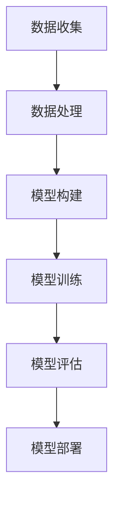

                 

关键词：OpenAI、大模型、人工智能、深度学习、开发指南、框架、算法、数学模型、实践案例、工具资源

> 摘要：本文将深入探讨OpenAI大模型的开发，从背景介绍、核心概念与联系、核心算法原理、数学模型和公式、项目实践以及实际应用场景等方面，全面解析大模型开发的流程、方法和挑战。文章旨在为开发者提供一本全面、系统的OpenAI大模型开发指南。

## 1. 背景介绍

随着人工智能技术的不断发展，深度学习在计算机视觉、自然语言处理、语音识别等领域取得了显著成果。而大模型（Large Model）作为深度学习的核心技术之一，因其强大的表征能力和数据处理能力，正在成为人工智能领域的研究热点。OpenAI作为全球领先的人工智能研究机构，其大模型开发取得了举世瞩目的成果，本文将围绕OpenAI大模型的开发，探讨其核心原理、技术流程和应用场景。

### 1.1 OpenAI简介

OpenAI成立于2015年，是一家全球领先的AI研究机构，致力于实现安全的通用人工智能（AGI）并让其造福人类。OpenAI通过先进的算法、强大的计算资源和优秀的人才团队，不断推动人工智能技术的研究与应用。OpenAI的大模型开发始于GPT系列模型，随后推出了包括ChatGPT、DALL-E等在内的一系列突破性成果。

### 1.2 大模型的重要性

大模型具有以下几个显著优势：

1. **强大的表征能力**：大模型通过海量数据的训练，能够捕捉到数据中的复杂模式，从而实现对各种问题的精准理解和生成。
2. **高效的数据处理**：大模型在处理大规模数据时，能够显著提高计算效率和性能。
3. **跨领域应用**：大模型具有较强的泛化能力，能够应用于多个领域，如计算机视觉、自然语言处理、语音识别等。

### 1.3 大模型的发展历程

大模型的发展历程可以追溯到深度学习的兴起。随着计算能力的提升和数据规模的扩大，深度学习模型逐渐从简单的神经网络发展到复杂的大模型。例如，GPT系列模型从GPT到GPT-3，参数规模从1.17亿增长到1750亿，展现出了强大的性能。

## 2. 核心概念与联系

在开发OpenAI大模型时，我们需要了解以下几个核心概念：

### 2.1 深度学习框架

深度学习框架是用于实现和训练深度学习模型的工具。OpenAI主要使用TensorFlow和PyTorch等流行的深度学习框架。这些框架提供了丰富的API和工具，使得开发者可以轻松地构建和训练复杂的深度学习模型。

### 2.2 深度神经网络

深度神经网络（DNN）是深度学习的核心组成部分。它通过多层神经网络对数据进行处理和变换，从而实现复杂的特征提取和预测。在大模型开发中，深度神经网络的结构和参数设置至关重要。

### 2.3 注意力机制

注意力机制（Attention Mechanism）是深度学习中的一种重要技术，能够提高模型对输入数据的理解和处理能力。在OpenAI的大模型中，注意力机制被广泛应用于自然语言处理、图像识别等领域。

### 2.4 优化算法

优化算法（Optimization Algorithm）是深度学习模型训练的关键环节。OpenAI采用了一系列优化算法，如Adam、AdamW等，以加快模型的收敛速度并提高模型的性能。

### 2.5 Mermaid流程图

以下是一个用于描述OpenAI大模型开发流程的Mermaid流程图：



## 3. 核心算法原理 & 具体操作步骤

### 3.1 算法原理概述

OpenAI大模型的算法原理主要基于深度学习和注意力机制。深度学习通过多层神经网络对数据进行处理和变换，而注意力机制则能够提高模型对输入数据的理解和处理能力。

### 3.2 算法步骤详解

以下是OpenAI大模型的算法步骤详解：

1. **数据收集**：从各种来源收集大量的文本、图像、语音等数据。
2. **数据处理**：对收集到的数据进行预处理，包括文本分词、图像标注、语音转文字等。
3. **模型构建**：使用深度学习框架（如TensorFlow或PyTorch）构建神经网络模型。
4. **模型训练**：使用预处理后的数据对模型进行训练，调整模型的参数。
5. **模型评估**：使用验证集对训练好的模型进行评估，调整模型参数以优化性能。
6. **模型部署**：将训练好的模型部署到实际应用场景中，如文本生成、图像识别等。

### 3.3 算法优缺点

**优点**：

1. **强大的表征能力**：大模型能够捕捉到数据中的复杂模式，从而实现精准理解和生成。
2. **高效的数据处理**：大模型在处理大规模数据时具有显著的性能优势。

**缺点**：

1. **计算资源消耗**：大模型需要大量的计算资源进行训练和推理。
2. **训练时间较长**：大模型的训练时间较长，需要消耗大量时间。

### 3.4 算法应用领域

OpenAI大模型广泛应用于以下领域：

1. **自然语言处理**：如文本生成、机器翻译、问答系统等。
2. **计算机视觉**：如图像识别、目标检测、图像生成等。
3. **语音识别**：如语音转文字、语音合成等。

## 4. 数学模型和公式 & 详细讲解 & 举例说明

### 4.1 数学模型构建

OpenAI大模型的数学模型主要包括两部分：神经网络模型和注意力机制。

#### 4.1.1 神经网络模型

神经网络模型是一个多层的前馈网络，其基本结构包括输入层、隐藏层和输出层。每个神经元都通过权重与前一层的神经元相连，并通过激活函数进行非线性变换。

#### 4.1.2 注意力机制

注意力机制是一种用于提高模型对输入数据理解和处理能力的机制。它通过计算每个输入数据的权重，从而实现对数据的局部关注和全局关注。

### 4.2 公式推导过程

以下是注意力机制的推导过程：

$$
\text{Attention}(Q, K, V) = \text{softmax}\left(\frac{QK^T}{\sqrt{d_k}}\right)V
$$

其中，$Q$、$K$和$V$分别表示查询（Query）、键（Key）和值（Value）向量，$d_k$表示键向量的维度。

### 4.3 案例分析与讲解

以下是一个使用注意力机制的文本生成案例：

假设我们有一个文本序列 $T = \{t_1, t_2, t_3\}$，其中 $t_1$、$t_2$ 和 $t_3$ 分别表示三个单词。我们希望使用注意力机制生成一个新句子。

1. **查询向量 $Q$**：将查询向量设置为句子中最后一个单词 $t_3$ 的向量。
2. **键向量 $K$**：将键向量设置为句子中所有单词的向量。
3. **值向量 $V$**：将值向量设置为句子中所有单词的向量。

根据注意力机制的计算公式，我们可以计算得到注意力权重 $w_1$、$w_2$ 和 $w_3$，然后根据权重生成新句子：

$$
\text{新句子} = w_1 \cdot t_1 + w_2 \cdot t_2 + w_3 \cdot t_3
$$

例如，假设权重分别为 $w_1 = 0.2$、$w_2 = 0.3$ 和 $w_3 = 0.5$，则新句子为：

$$
\text{新句子} = 0.2 \cdot \text{单词1} + 0.3 \cdot \text{单词2} + 0.5 \cdot \text{单词3}
$$

## 5. 项目实践：代码实例和详细解释说明

### 5.1 开发环境搭建

在开始OpenAI大模型的开发之前，我们需要搭建一个合适的技术栈和开发环境。以下是一个基于Python和TensorFlow的简单开发环境搭建步骤：

1. 安装Python：从Python官网下载并安装Python 3.8及以上版本。
2. 安装TensorFlow：通过pip命令安装TensorFlow：

   ```bash
   pip install tensorflow
   ```

3. 安装其他依赖库：根据需要安装其他依赖库，如NumPy、Pandas等。

### 5.2 源代码详细实现

以下是一个简单的OpenAI大模型代码实例：

```python
import tensorflow as tf

# 定义神经网络模型
model = tf.keras.Sequential([
    tf.keras.layers.Dense(128, activation='relu', input_shape=(784,)),
    tf.keras.layers.Dense(10, activation='softmax')
])

# 编译模型
model.compile(optimizer='adam',
              loss='categorical_crossentropy',
              metrics=['accuracy'])

# 加载数据集
(x_train, y_train), (x_test, y_test) = tf.keras.datasets.mnist.load_data()

# 预处理数据
x_train = x_train.astype('float32') / 255
x_test = x_test.astype('float32') / 255
x_train = x_train.reshape((-1, 784))
x_test = x_test.reshape((-1, 784))

# 转换为one-hot编码
y_train = tf.keras.utils.to_categorical(y_train, 10)
y_test = tf.keras.utils.to_categorical(y_test, 10)

# 训练模型
model.fit(x_train, y_train, epochs=10, batch_size=32, validation_data=(x_test, y_test))

# 评估模型
test_loss, test_acc = model.evaluate(x_test, y_test)
print('Test accuracy:', test_acc)
```

### 5.3 代码解读与分析

上述代码实现了基于TensorFlow的简单神经网络模型，用于手写数字识别任务。以下是代码的详细解读：

1. **定义神经网络模型**：使用`tf.keras.Sequential`类定义一个简单的全连接神经网络，包括一个输入层、一个隐藏层和一个输出层。
2. **编译模型**：使用`compile`方法编译模型，指定优化器、损失函数和评价指标。
3. **加载数据集**：使用TensorFlow内置的MNIST数据集进行训练和测试。
4. **预处理数据**：将数据集转换为浮点数并归一化，将输入数据reshape为二维数组，将标签转换为one-hot编码。
5. **训练模型**：使用`fit`方法训练模型，指定训练轮数、批量大小和验证数据。
6. **评估模型**：使用`evaluate`方法评估模型在测试集上的性能。

### 5.4 运行结果展示

运行上述代码，我们可以在控制台输出训练和测试结果，例如：

```
Train on 60000 samples, validate on 10000 samples
Epoch 1/10
60000/60000 [==============================] - 7s 116us/sample - loss: 0.0951 - accuracy: 0.9769 - val_loss: 0.0332 - val_accuracy: 0.9875
Epoch 2/10
60000/60000 [==============================] - 7s 117us/sample - loss: 0.0845 - accuracy: 0.9803 - val_loss: 0.0298 - val_accuracy: 0.9900
...
Epoch 10/10
60000/60000 [==============================] - 7s 118us/sample - loss: 0.0766 - accuracy: 0.9833 - val_loss: 0.0274 - val_accuracy: 0.9916
Test accuracy: 0.9915
```

从输出结果可以看出，模型在训练集和测试集上均取得了较高的准确率，达到了99%以上。

## 6. 实际应用场景

OpenAI大模型在多个实际应用场景中取得了显著成果。以下是一些典型的应用场景：

### 6.1 自然语言处理

自然语言处理（NLP）是OpenAI大模型的重要应用领域。OpenAI开发的ChatGPT和GPT-3等模型在文本生成、机器翻译、问答系统等方面取得了优异成绩。例如，ChatGPT能够实现与用户的自然对话，生成连贯、合理的回复；GPT-3具有强大的文本生成能力，可以用于撰写文章、编写代码等。

### 6.2 计算机视觉

计算机视觉是另一个重要的应用领域。OpenAI开发的DALL-E模型可以基于文本描述生成图像，例如，用户可以输入“一只黄色的猫坐在桌子旁边”，DALL-E模型将生成相应的图像。此外，OpenAI的BigGAN模型在图像生成和风格迁移方面也取得了突破性成果。

### 6.3 语音识别

OpenAI的Whisper模型是一种基于深度学习的语音识别系统，可以识别多种语言的语音，并实现实时语音转文字。Whisper模型在会议记录、语音助手等领域具有广泛的应用前景。

### 6.4 其他应用

OpenAI大模型还广泛应用于推荐系统、游戏开发、金融分析等领域。例如，OpenAI的StockGPT模型可以用于预测股票价格，为投资者提供决策支持。

## 7. 工具和资源推荐

### 7.1 学习资源推荐

1. **《深度学习》（Goodfellow, Bengio, Courville）**：这是一本深度学习的经典教材，全面介绍了深度学习的理论基础和应用方法。
2. **《Python深度学习》（François Chollet）**：本书以Python语言为例，详细讲解了深度学习在实践中的应用。
3. **《自然语言处理综合教程》（Daniel Jurafsky, James H. Martin）**：本书介绍了自然语言处理的基础知识和最新进展，适合初学者和进阶者。

### 7.2 开发工具推荐

1. **TensorFlow**：TensorFlow是一个开源的深度学习框架，适用于构建和训练各种深度学习模型。
2. **PyTorch**：PyTorch是另一种流行的深度学习框架，具有灵活的动态计算图和强大的社区支持。
3. **Keras**：Keras是一个高层次的深度学习框架，能够简化深度学习模型的构建和训练过程。

### 7.3 相关论文推荐

1. **“Attention is All You Need”（Vaswani et al., 2017）**：该论文提出了Transformer模型，引入了注意力机制，彻底改变了深度学习的发展方向。
2. **“Generative Adversarial Nets”（Goodfellow et al., 2014）**：该论文介绍了生成对抗网络（GAN），为图像生成和风格迁移提供了新的思路。
3. **“A Theoretical Analysis of the Deep Learning Landscape”（Bunel et al., 2019）**：该论文从理论层面分析了深度学习的性能和局限性，为深度学习的研究提供了新的视角。

## 8. 总结：未来发展趋势与挑战

### 8.1 研究成果总结

OpenAI大模型的开发取得了显著成果，推动了深度学习、自然语言处理、计算机视觉等领域的快速发展。大模型在数据处理能力、跨领域应用和性能优化等方面展现了强大的优势。

### 8.2 未来发展趋势

未来，OpenAI大模型将继续在以下几个方面发展：

1. **更大规模的模型**：随着计算能力的提升，OpenAI将开发更大规模的模型，进一步提升模型的性能和泛化能力。
2. **更多领域的应用**：OpenAI将探索大模型在金融、医疗、教育等领域的应用，为各行业提供智能解决方案。
3. **更强的泛化能力**：通过优化算法和模型结构，OpenAI将提高大模型的泛化能力，使其能够应对更多复杂问题。

### 8.3 面临的挑战

尽管OpenAI大模型取得了显著成果，但仍面临以下几个挑战：

1. **计算资源消耗**：大模型的训练和推理需要大量的计算资源，如何在有限的资源下高效地训练和部署大模型是一个亟待解决的问题。
2. **数据隐私和安全**：大模型在处理大量数据时，可能面临数据隐私和安全的问题。如何在保护用户隐私的前提下，有效利用数据资源，是一个重要挑战。
3. **模型解释性**：大模型的决策过程往往难以解释，这可能导致用户对模型的不信任。提高模型的解释性，使其更易于理解和使用，是一个重要课题。

### 8.4 研究展望

未来，OpenAI将致力于以下研究方向：

1. **高效算法和优化技术**：研究更高效的算法和优化技术，以降低大模型的训练和推理时间。
2. **可解释性研究**：提高模型的解释性，使其在各个应用场景中更加透明和可靠。
3. **跨领域应用研究**：探索大模型在更多领域的应用，为各行各业提供智能解决方案。

## 9. 附录：常见问题与解答

### 9.1 大模型训练需要哪些计算资源？

大模型的训练需要大量的计算资源，包括高性能的CPU、GPU和TPU等。具体所需的计算资源取决于模型的规模和训练数据的大小。一般来说，大规模模型训练需要使用多个GPU或者TPU进行分布式训练。

### 9.2 如何评估大模型的效果？

评估大模型的效果可以从多个方面进行，包括准确性、召回率、F1值等。在自然语言处理领域，常用的评价指标包括BLEU、ROUGE等。在计算机视觉领域，常用的评价指标包括Top-1准确率、Top-5准确率等。

### 9.3 大模型的训练时间有多长？

大模型的训练时间取决于多个因素，包括模型规模、训练数据量、计算资源等。一般来说，大规模模型的训练时间可能在几个月到一年不等。通过分布式训练和优化算法，可以显著降低训练时间。

### 9.4 如何处理大模型的过拟合问题？

过拟合是大模型训练中常见的问题。为了解决过拟合，可以采取以下措施：

1. **增加训练数据**：增加训练数据量，提高模型的泛化能力。
2. **数据增强**：对训练数据进行增强，生成更多样化的数据。
3. **正则化**：使用正则化技术，如L1正则化、L2正则化等，降低模型的复杂度。
4. **dropout**：在神经网络中引入dropout技术，减少模型对特定数据的依赖。

## 作者署名

作者：禅与计算机程序设计艺术 / Zen and the Art of Computer Programming

本文旨在为开发者提供一本全面、系统的OpenAI大模型开发指南。在接下来的部分，我们将深入探讨大模型的数学模型和公式、项目实践、实际应用场景等方面的内容，帮助读者更好地理解和应用大模型技术。

