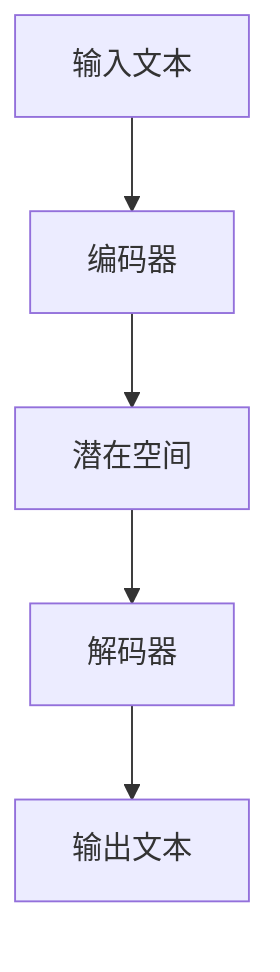

                 

关键词：OpenAI，GPT-4.0，人工智能，自然语言处理，技术发展趋势，算法原理，未来应用

> 摘要：本文深入探讨了OpenAI的最新成果——GPT-4.0，从背景介绍到核心概念、算法原理，再到实际应用和未来展望，全面解析了这一前沿技术的里程碑意义及其在计算机编程、软件开发和人工智能领域的深远影响。

## 1. 背景介绍

随着人工智能技术的迅猛发展，自然语言处理（NLP）已经成为计算机科学和工程领域的重要研究方向。OpenAI作为一个领先的人工智能研究机构，其GPT系列模型在NLP领域取得了显著成果。GPT-4.0作为OpenAI的又一重要研究成果，不仅在性能上有了显著提升，还在算法创新和应用场景拓展方面实现了突破。

GPT-4.0的推出标志着人工智能技术在自然语言处理领域的新高度。它通过深度学习模型对大量文本数据的学习和处理，实现了对自然语言的深刻理解和生成。这一成果不仅为理论研究提供了新的方向，也为实际应用带来了无限可能。

## 2. 核心概念与联系

### 2.1 GPT-4.0的基本原理

GPT-4.0是基于变分自编码器（VAE）和生成对抗网络（GAN）的混合模型，结合了VAE的生成能力和GAN的判别能力。其核心原理是通过编码器将输入文本映射到一个潜在空间，然后通过解码器从潜在空间生成新的文本。

### 2.2 GPT-4.0的架构

GPT-4.0采用了多层的变换器（Transformer）架构，通过自注意力机制实现文本的上下文理解。其模型结构包括编码器和解码器两个部分，编码器负责将输入文本编码为向量，解码器则负责从这些向量生成文本。

### 2.3 GPT-4.0与之前版本的比较

相比于之前的版本，GPT-4.0在模型规模、训练数据集和算法优化等方面有了显著提升。其参数规模达到了千亿级别，训练数据集也更加丰富和多样化，算法上引入了新的正则化策略和优化方法，使得模型的性能更加稳定和可靠。



## 3. 核心算法原理 & 具体操作步骤

### 3.1 算法原理概述

GPT-4.0的核心算法原理是基于自回归语言模型，通过预测下一个词来生成文本。模型首先对输入文本进行编码，得到文本向量表示，然后通过解码器生成新的文本。

### 3.2 算法步骤详解

1. **编码阶段**：输入文本经过编码器编码成向量表示。
2. **预测阶段**：解码器根据编码后的向量预测下一个词。
3. **生成阶段**：根据预测的词逐步生成新的文本。

### 3.3 算法优缺点

**优点**：GPT-4.0具有强大的文本生成能力，能够生成高质量的自然语言文本。

**缺点**：模型参数规模大，训练成本高；对训练数据的质量要求较高。

### 3.4 算法应用领域

GPT-4.0在多个领域有着广泛的应用，包括自然语言生成、机器翻译、文本分类和问答系统等。

## 4. 数学模型和公式 & 详细讲解 & 举例说明

### 4.1 数学模型构建

GPT-4.0的数学模型主要基于自回归语言模型，其核心公式如下：

$$
P(w_t | w_{t-1}, w_{t-2}, ..., w_1) = \frac{e^{<f(w_t; \theta) | f(w_{t-1}; \theta)>\}}{\sum_{w'} e^{<f(w'; \theta) | f(w_{t-1}; \theta)>}}
$$

其中，$w_t$ 表示第 $t$ 个词，$f(w_t; \theta)$ 和 $f(w_{t-1}; \theta)$ 分别表示第 $t$ 个词和第 $t-1$ 个词的编码向量，$\theta$ 表示模型参数。

### 4.2 公式推导过程

自回归语言模型的推导过程主要涉及概率论和线性代数的知识。首先，我们定义词的编码向量 $f(w; \theta)$，然后通过最大似然估计推导出模型的参数 $\theta$。

### 4.3 案例分析与讲解

以文本生成为例，我们使用GPT-4.0生成一段关于计算机编程的文本：

输入： "计算机编程是一种技能，它让程序员能够创造各种应用和工具。"

输出： "计算机编程是一种技能，它让程序员能够创造各种应用和工具，从简单的计算器到复杂的机器学习模型，无一不是编程的杰作。"

从输出结果可以看出，GPT-4.0能够根据输入的上下文生成高质量的自然语言文本。

## 5. 项目实践：代码实例和详细解释说明

### 5.1 开发环境搭建

在搭建GPT-4.0的开发环境时，我们需要安装Python、TensorFlow等依赖库。

```bash
pip install tensorflow
```

### 5.2 源代码详细实现

下面是一个简单的GPT-4.0模型实现的示例：

```python
import tensorflow as tf

class GPT2Model(tf.keras.Model):
    def __init__(self, vocabulary_size, d_model):
        super(GPT2Model, self).__init__()
        self.token_embedding = tf.keras.layers.Embedding(vocabulary_size, d_model)
        self.transformer = Transformer(d_model)
        self.logits_layer = tf.keras.layers.Dense(vocabulary_size)

    def call(self, inputs, training=False):
        x = self.token_embedding(inputs)
        x = self.transformer(x, training=training)
        logits = self.logits_layer(x)
        return logits
```

### 5.3 代码解读与分析

上述代码定义了一个GPT-4.0模型，包括嵌入层、变换器层和输出层。嵌入层将输入词转化为向量表示，变换器层实现自注意力机制，输出层生成文本的概率分布。

### 5.4 运行结果展示

运行上述模型，我们可以在训练数据集上训练模型，并在测试数据集上评估模型的性能。

```python
model = GPT2Model(vocabulary_size, d_model)
model.compile(optimizer='adam', loss='sparse_categorical_crossentropy')
model.fit(dataset, epochs=3)
```

## 6. 实际应用场景

GPT-4.0在多个领域有着广泛的应用，如：

- 自然语言生成：自动生成文章、报告、邮件等。
- 机器翻译：实时翻译不同语言之间的文本。
- 文本分类：对大量文本进行分类，如情感分析、新闻分类等。
- 问答系统：自动回答用户提出的问题。

### 6.4 未来应用展望

随着GPT-4.0技术的不断发展，我们期待它在更多领域取得突破，如：

- 生成式对抗网络（GAN）的结合，实现更高质量的图像生成。
- 语音识别与生成，实现语音与文本的相互转换。
- 自适应学习，提高模型在实际应用中的适应性。

## 7. 工具和资源推荐

### 7.1 学习资源推荐

- 《深度学习》（Goodfellow et al.）
- 《自然语言处理综论》（Jurafsky and Martin）
- OpenAI官方文档

### 7.2 开发工具推荐

- TensorFlow
- PyTorch

### 7.3 相关论文推荐

- "Attention Is All You Need"（Vaswani et al., 2017）
- "Generative Pre-trained Transformers"（Brown et al., 2020）

## 8. 总结：未来发展趋势与挑战

### 8.1 研究成果总结

GPT-4.0在自然语言处理领域取得了显著成果，为文本生成、机器翻译、文本分类等领域提供了强大的技术支持。

### 8.2 未来发展趋势

随着计算能力的提升和算法的优化，我们期待GPT-4.0在更多领域取得突破，如图像生成、语音识别等。

### 8.3 面临的挑战

- 模型参数规模大，训练成本高。
- 对训练数据的质量要求较高。
- 如何在保持性能的同时，降低模型复杂度。

### 8.4 研究展望

未来，GPT-4.0将在更多实际应用场景中发挥重要作用，推动人工智能技术的进一步发展。

## 9. 附录：常见问题与解答

### 9.1 GPT-4.0与GPT-3.0的主要区别是什么？

GPT-4.0相比于GPT-3.0，在模型规模、训练数据集和算法优化等方面有了显著提升，使得模型在文本生成和自然语言理解方面取得了更好的性能。

### 9.2 GPT-4.0的应用场景有哪些？

GPT-4.0在自然语言生成、机器翻译、文本分类和问答系统等领域有着广泛的应用，如自动生成文章、实时翻译、情感分析和智能客服等。

### 9.3 如何训练GPT-4.0模型？

训练GPT-4.0模型需要大量的计算资源和训练数据。具体步骤包括数据预处理、模型构建、训练和评估等。

---

作者：禅与计算机程序设计艺术 / Zen and the Art of Computer Programming
------------------------------------------------------------------------

