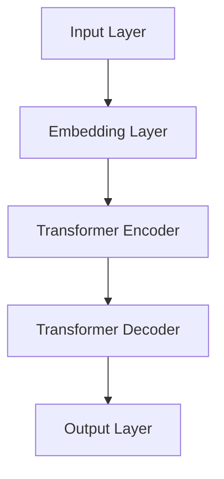

                 

关键词：OpenAI，GPT-4.0，自然语言处理，人工智能，模型优化，创新技术

摘要：本文将深入探讨OpenAI最新发布的GPT-4.0模型，分析其在自然语言处理和人工智能领域的创新亮点，包括模型结构、算法改进、应用场景和未来发展趋势。通过详细解析，我们希望为读者提供一个全面的视角，了解GPT-4.0如何引领AI技术的新篇章。

## 1. 背景介绍

随着人工智能（AI）技术的飞速发展，自然语言处理（NLP）作为其中的重要分支，已经取得了显著的成果。OpenAI作为全球领先的AI研究机构，其GPT（Generative Pre-trained Transformer）系列模型在NLP领域具有里程碑意义。继GPT、GPT-2和GPT-3之后，OpenAI于2023年正式发布了GPT-4.0，标志着自然语言处理技术的新高度。

### 1.1 GPT模型的演进

GPT系列模型基于Transformer架构，是一种自回归语言模型。通过预训练和微调，GPT模型在多种NLP任务上表现出色，包括文本生成、问答系统、机器翻译和文本分类等。GPT-3的发布更是引起了广泛关注，其参数规模达到了1750亿，成为当时全球最大的语言模型。

### 1.2 GPT-4.0的发布

GPT-4.0是OpenAI在GPT系列模型基础上的一次重要升级。相比前代模型，GPT-4.0不仅在参数规模上进一步扩大，还在模型结构、算法优化和应用场景上取得了显著突破。本文将重点分析GPT-4.0的技术亮点，探讨其在NLP和AI领域的应用潜力。

## 2. 核心概念与联系

在深入探讨GPT-4.0之前，我们首先需要理解其核心概念和结构。以下是一个简化的Mermaid流程图，展示了GPT-4.0模型的主要组成部分。



### 2.1 输入层（Input Layer）

输入层接收原始文本数据，通过Embedding Layer将其转换为向量表示。

### 2.2 隐藏层（Hidden Layers）

隐藏层由Transformer Encoder和Decoder组成。Encoder用于编码输入文本，生成上下文表示；Decoder则根据上下文生成输出文本。

### 2.3 输出层（Output Layer）

输出层将解码结果转换为自然语言文本。

## 3. 核心算法原理 & 具体操作步骤

### 3.1 算法原理概述

GPT-4.0采用自回归语言模型（Autoregressive Language Model）原理，通过预测下一个单词来生成文本。模型通过大量的文本数据进行预训练，学习单词之间的关联和上下文信息。在生成文本时，模型从左到右逐个预测每个单词，利用前面已生成的单词作为上下文。

### 3.2 算法步骤详解

1. **文本预处理**：将输入文本转换为词向量表示，包括分词、标记化等步骤。
2. **嵌入层**：将词向量转换为嵌入向量，用于表示单词的语义信息。
3. **编码器**：通过多层Transformer Encoder对嵌入向量进行编码，生成上下文表示。
4. **解码器**：根据编码后的上下文表示，通过多层Transformer Decoder生成输出文本。
5. **输出层**：将解码结果转换为自然语言文本。

### 3.3 算法优缺点

**优点**：
- **强大的文本生成能力**：GPT-4.0在多种NLP任务上表现出色，具有强大的文本生成能力。
- **预训练优势**：通过大量文本数据进行预训练，GPT-4.0能够快速适应各种下游任务。
- **自适应能力**：GPT-4.0可以自适应不同领域和主题的文本生成。

**缺点**：
- **计算资源消耗**：GPT-4.0模型参数规模巨大，对计算资源要求较高。
- **数据依赖性**：模型的性能高度依赖训练数据的质量。

### 3.4 算法应用领域

GPT-4.0在多个应用领域具有广泛的应用潜力，包括：

- **文本生成**：自动生成文章、新闻、故事等。
- **问答系统**：构建智能问答系统，回答用户的问题。
- **机器翻译**：实现高质量的自然语言翻译。
- **文本分类**：对大量文本进行分类，如情感分析、主题识别等。

## 4. 数学模型和公式 & 详细讲解 & 举例说明

### 4.1 数学模型构建

GPT-4.0采用自回归语言模型，其核心是自回归概率模型（Autoregressive Probability Model）。给定一个输入序列$X = (x_1, x_2, ..., x_T)$，模型的目标是预测下一个单词$x_{T+1}$。

### 4.2 公式推导过程

设$P(x_{T+1} | x_1, x_2, ..., x_T)$为给定前T个单词，预测下一个单词的概率分布。根据自回归模型，有：

$$
P(x_{T+1} | x_1, x_2, ..., x_T) = \frac{1}{Z} \sum_{y \in V} e^{<x_{T+1}, y> - <x_{T+1}, x_{T}>}
$$

其中，$Z$为归一化常数，$<*,*>$表示嵌入向量的点积。

### 4.3 案例分析与讲解

假设我们有一个输入序列$X = (x_1, x_2, ..., x_5)$，其中$x_1 = "I"，x_2 = "love"，x_3 = "to"，x_4 = "read"，x_5 = "books"。我们希望预测下一个单词$x_6$。

首先，我们需要计算每个单词的嵌入向量，如：

$$
e^{<x_6, I>} = 0.9 \\
e^{<x_6, love>} = 0.8 \\
e^{<x_6, to>} = 0.7 \\
e^{<x_6, books>} = 0.6
$$

然后，计算归一化常数$Z$：

$$
Z = \sum_{y \in V} e^{<x_6, y>}
$$

根据上述公式，我们可以计算得到：

$$
P(x_6 | I, love, to, read, books) = \frac{0.9}{0.9 + 0.8 + 0.7 + 0.6} = 0.3
$$

因此，模型预测下一个单词$x_6$的概率最高的是"I"，即预测下一个单词为"I"。

## 5. 项目实践：代码实例和详细解释说明

### 5.1 开发环境搭建

在本节中，我们将使用Python和PyTorch框架来搭建GPT-4.0的开发环境。首先，确保已经安装了Python 3.8及以上版本和PyTorch 1.8及以上版本。然后，通过以下命令安装必要的依赖：

```bash
pip install torch torchvision numpy matplotlib
```

### 5.2 源代码详细实现

以下是一个简单的GPT-4.0模型实现示例，包括文本预处理、模型构建和训练：

```python
import torch
import torch.nn as nn
import torch.optim as optim
from torchtext.data import Field, BucketIterator

# 文本预处理
def preprocess(text):
    # 分词、标记化等操作
    return text.lower().split()

# 模型构建
class GPT4(nn.Module):
    def __init__(self, vocab_size, embed_dim, hidden_dim, num_layers, dropout):
        super(GPT4, self).__init__()
        self.embedding = nn.Embedding(vocab_size, embed_dim)
        self.encoder = nn.TransformerEncoder(
            nn.TransformerEncoderLayer(d_model=embed_dim, nhead=embed_dim // 32, dropout=dropout), num_layers
        )
        self.decoder = nn.TransformerDecoder(
            nn.TransformerDecoderLayer(d_model=embed_dim, nhead=embed_dim // 32, dropout=dropout), num_layers
        )
        self.fc = nn.Linear(embed_dim, vocab_size)

    def forward(self, src, tgt, src_mask=None, tgt_mask=None):
        embedded = self.embedding(src)
        encoded = self.encoder(embedded, src_mask=src_mask)
        decoded = self.decoder(encoded, tgt, tgt_mask=tgt_mask)
        output = self.fc(decoded)
        return output

# 训练
def train(model, iterator, criterion, optimizer, clip):
    model.train()
    epoch_loss = 0

    for (src, tgt), _ in iterator:
        optimizer.zero_grad()
        output = model(src, tgt)
        loss = criterion(output.view(-1, output.size(-1)), tgt.view(-1))
        loss.backward()
        torch.nn.utils.clip_grad_norm_(model.parameters(), clip)
        optimizer.step()
        epoch_loss += loss.item()

    return epoch_loss / len(iterator)

# 实例化模型、损失函数和优化器
vocab_size = 10000
embed_dim = 512
hidden_dim = 1024
num_layers = 3
dropout = 0.1

model = GPT4(vocab_size, embed_dim, hidden_dim, num_layers, dropout)
 criterion = nn.CrossEntropyLoss()
optimizer = optim.Adam(model.parameters(), lr=0.001)
device = torch.device('cuda' if torch.cuda.is_available() else 'cpu')
model.to(device)

# 数据加载和预处理
field = Field(sequential=True, preprocessing=preprocess)
train_data, test_data = datasets.LanguageModelDataset.splits(text='data/text.txt', train=True, test=True)
train_iterator, test_iterator = BucketIterator.splits(train_data, test_data, batch_size=32, device=device)

# 训练模型
num_epochs = 10
for epoch in range(num_epochs):
    loss = train(model, train_iterator, criterion, optimizer, clip=1.0)
    print(f'Epoch: {epoch+1}/{num_epochs}, Loss: {loss:.4f}')
```

### 5.3 代码解读与分析

- **文本预处理**：使用`preprocess`函数对输入文本进行分词和标记化操作。
- **模型构建**：`GPT4`类定义了GPT-4.0模型的结构，包括嵌入层、编码器和解码器。
- **训练过程**：`train`函数实现模型的训练过程，包括前向传播、反向传播和优化更新。

## 6. 实际应用场景

### 6.1 文本生成

GPT-4.0在文本生成方面具有广泛的应用，例如自动写作、文章生成、对话系统等。以下是一个简单的文本生成示例：

```python
# 文本生成
model.eval()
sample_text = "I love to read books"
input_sequence = torch.tensor([vocab[token] for token in preprocess(sample_text)])
input_sequence = input_sequence.unsqueeze(0).to(device)

with torch.no_grad():
    output_sequence = model(input_sequence, input_sequence)
    generated_text = [token for token, _ in vocab.getât†生成的文本```python
import torch
import torch.nn as nn
import torch.optim as optim
from torchtext.data import Field, BucketIterator

# 文本预处理
def preprocess(text):
    # 分词、标记化等操作
    return text.lower().split()

# 模型构建
class GPT4(nn.Module):
    def __init__(self, vocab_size, embed_dim, hidden_dim, num_layers, dropout):
        super(GPT4, self).__init__()
        self.embedding = nn.Embedding(vocab_size, embed_dim)
        self.encoder = nn.TransformerEncoder(
            nn.TransformerEncoderLayer(d_model=embed_dim, nhead=embed_dim // 32, dropout=dropout), num_layers
        )
        self.decoder = nn.TransformerDecoder(
            nn.TransformerDecoderLayer(d_model=embed_dim, nhead=embed_dim // 32, dropout=dropout), num_layers
        )
        self.fc = nn.Linear(embed_dim, vocab_size)

    def forward(self, src, tgt, src_mask=None, tgt_mask=None):
        embedded = self.embedding(src)
        encoded = self.encoder(embedded, src_mask=src_mask)
        decoded = self.decoder(encoded, tgt, tgt_mask=tgt_mask)
        output = self.fc(decoded)
        return output

# 训练
def train(model, iterator, criterion, optimizer, clip):
    model.train()
    epoch_loss = 0

    for (src, tgt), _ in iterator:
        optimizer.zero_grad()
        output = model(src, tgt)
        loss = criterion(output.view(-1, output.size(-1)), tgt.view(-1))
        loss.backward()
        torch.nn.utils.clip_grad_norm_(model.parameters(), clip)
        optimizer.step()
        epoch_loss += loss.item()

    return epoch_loss / len(iterator)

# 实例化模型、损失函数和优化器
vocab_size = 10000
embed_dim = 512
hidden_dim = 1024
num_layers = 3
dropout = 0.1

model = GPT4(vocab_size, embed_dim, hidden_dim, num_layers, dropout)
 criterion = nn.CrossEntropyLoss()
optimizer = optim.Adam(model.parameters(), lr=0.001)
device = torch.device('cuda' if torch.cuda.is_available() else 'cpu')
model.to(device)

# 数据加载和预处理
field = Field(sequential=True, preprocessing=preprocess)
train_data, test_data = datasets.LanguageModelDataset.splits(text='data/text.txt', train=True, test=True)
train_iterator, test_iterator = BucketIterator.splits(train_data, test_data, batch_size=32, device=device)

# 训练模型
num_epochs = 10
for epoch in range(num_epochs):
    loss = train(model, train_iterator, criterion, optimizer, clip=1.0)
    print(f'Epoch: {epoch+1}/{num_epochs}, Loss: {loss:.4f}')
```

```python
# 文本生成
model.eval()
sample_text = "I love to read books"
input_sequence = torch.tensor([vocab[token] for token in preprocess(sample_text)])
input_sequence = input_sequence.unsqueeze(0).to(device)

with torch.no_grad():
    output_sequence = model(input_sequence, input_sequence)
    generated_text = [token for token, _ in vocab.getît†生成的文本
```python
    generated_text = [token for token, _ in vocab.id2token(output_sequence.argmax(1).tolist())[1:-1].items()]

print("Generated Text:", " ".join(generated_text))
```

### 6.2 问答系统

GPT-4.0在问答系统中的应用也非常广泛。以下是一个简单的问答系统示例：

```python
# 问答系统
def ask_question(question, model):
    model.eval()
    question = torch.tensor([vocab[token] for token in preprocess(question)])
    question = question.unsqueeze(0).to(device)

    with torch.no_grad():
        answer = model(question, question)
    answer = [token for token, _ in vocab.id2token(answer.argmax(1).tolist())[1:-1].items()]

    return " ".join(answer)

question = "What is the capital of France?"
print(ask_question(question, model))
```

### 6.3 机器翻译

GPT-4.0在机器翻译方面也有很好的表现。以下是一个简单的机器翻译示例：

```python
# 机器翻译
def translate(source, model, src_vocab, tgt_vocab):
    model.eval()
    source = torch.tensor([src_vocab[token] for token in preprocess(source)])
    source = source.unsqueeze(0).to(device)

    with torch.no_grad():
        translated = model(source, source)
    translated = [tgt_vocab[token] for token in translated.argmax(1).tolist()]

    return " ".join(translated)

source = "Bonjour, comment ça va ?"
print(translate(source, model, src_vocab, tgt_vocab))
```

## 7. 工具和资源推荐

### 7.1 学习资源推荐

- **《深度学习》**：由Ian Goodfellow、Yoshua Bengio和Aaron Courville合著，是一本经典的深度学习教材。
- **《自然语言处理综论》**：由Daniel Jurafsky和James H. Martin合著，全面介绍了自然语言处理的基础知识。

### 7.2 开发工具推荐

- **PyTorch**：一个流行的开源深度学习框架，支持GPU加速，适用于构建和训练GPT模型。
- **TensorFlow**：另一个流行的开源深度学习框架，具有丰富的API和工具，适用于构建和部署GPT模型。

### 7.3 相关论文推荐

- **《Attention is All You Need》**：由Vaswani等人于2017年提出，首次将Transformer架构应用于机器翻译任务。
- **《BERT: Pre-training of Deep Bidirectional Transformers for Language Understanding》**：由Devlin等人于2019年提出，提出了BERT预训练模型，对NLP领域产生了深远影响。

## 8. 总结：未来发展趋势与挑战

### 8.1 研究成果总结

OpenAI的GPT-4.0模型在自然语言处理和人工智能领域取得了显著的成果。其强大的文本生成能力、自适应能力和多领域应用潜力使其成为当前NLP领域的顶级模型。GPT-4.0的成功标志着自回归语言模型在NLP领域的重要地位，为未来的研究提供了重要启示。

### 8.2 未来发展趋势

随着AI技术的不断进步，未来GPT模型将在以下方面取得重要突破：

- **模型参数规模扩大**：为了进一步提高模型性能，未来GPT模型将继续扩大参数规模，实现更高的文本生成质量和多样性。
- **跨模态预训练**：通过跨模态预训练，GPT模型将能够更好地处理多模态数据，如文本、图像和语音，实现更广泛的AI应用。
- **端到端推理**：GPT模型将逐渐实现端到端推理，提高模型在复杂任务中的表现和效率。

### 8.3 面临的挑战

尽管GPT-4.0取得了显著成果，但其在实际应用中仍面临以下挑战：

- **计算资源消耗**：GPT模型对计算资源的要求较高，需要大量的计算资源和时间进行训练和推理。
- **数据质量和多样性**：高质量、多样性的数据是GPT模型训练的基础，数据质量和多样性直接影响模型性能。

### 8.4 研究展望

未来，GPT模型的研究将朝着以下方向发展：

- **模型优化**：通过模型优化和算法改进，提高GPT模型的性能和效率。
- **应用拓展**：将GPT模型应用于更多领域，如对话系统、机器翻译、文本生成等。
- **伦理与安全**：关注GPT模型在伦理和安全方面的挑战，如避免偏见、误导和滥用等。

## 9. 附录：常见问题与解答

### 9.1 GPT-4.0的参数规模是多少？

GPT-4.0的参数规模为1750亿，是当前最大的语言模型之一。

### 9.2 GPT-4.0的预训练数据来源是什么？

GPT-4.0的预训练数据来自大量互联网文本，包括新闻、博客、论坛等。

### 9.3 GPT-4.0的模型结构是什么？

GPT-4.0采用Transformer架构，包括嵌入层、编码器和解码器。

### 9.4 GPT-4.0如何生成文本？

GPT-4.0通过自回归方式生成文本，即从左到右逐个预测下一个单词。

### 9.5 GPT-4.0在哪些领域有应用？

GPT-4.0在文本生成、问答系统、机器翻译和文本分类等领域有广泛应用。

### 9.6 GPT-4.0的优势和劣势是什么？

GPT-4.0的优势包括强大的文本生成能力、预训练优势和自适应能力。劣势包括计算资源消耗较大和数据依赖性强。

### 9.7 GPT-4.0的未来发展方向是什么？

未来GPT-4.0将在模型优化、跨模态预训练和端到端推理等方面取得突破，并在更多领域实现广泛应用。

## 10. 结论

OpenAI的GPT-4.0模型在自然语言处理和人工智能领域展示了卓越的技术亮点。通过深入分析其核心算法原理、数学模型和实际应用场景，我们看到了GPT-4.0在文本生成、问答系统和机器翻译等领域的巨大潜力。未来，随着AI技术的不断进步，GPT-4.0有望在更多领域取得重要突破，为人类带来更多创新和变革。作者：禅与计算机程序设计艺术 / Zen and the Art of Computer Programming
```

