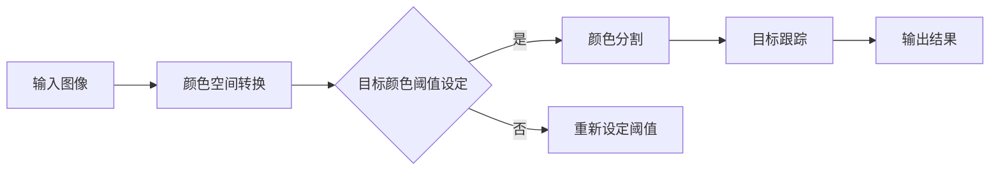

                 

关键词：OpenCV，目标识别，颜色处理，图像处理，机器视觉

摘要：本文将深入探讨OpenCV中基于颜色的目标识别技术，从基本概念到算法实现，再到实际应用场景，全面解析这一技术在计算机视觉领域的广泛应用和未来发展趋势。

## 1. 背景介绍

随着计算机技术和人工智能的飞速发展，机器视觉成为了一个备受关注的研究领域。在机器视觉中，目标识别是一项基础且关键的任务，其目的是在图像或视频中检测并识别特定的物体或场景。基于颜色的目标识别作为一种重要的目标识别方法，因其简单高效、实用性强的特点，在许多领域得到了广泛应用。

OpenCV（Open Source Computer Vision Library）是一个开源的计算机视觉库，它提供了丰富的图像处理和计算机视觉功能，支持多种编程语言，如Python、C++等。OpenCV凭借其强大的功能和易于使用的接口，成为了计算机视觉领域的事实标准。

本文将重点介绍OpenCV中基于颜色的目标识别技术，通过分析其核心算法原理、实现步骤、优缺点以及应用领域，帮助读者全面理解并掌握这一技术。

## 2. 核心概念与联系

### 2.1 核心概念

在基于颜色的目标识别中，核心概念包括颜色空间转换、颜色阈值的设定、颜色分割以及目标跟踪等。

- **颜色空间转换**：将图像从一种颜色空间转换到另一种颜色空间，例如从RGB颜色空间转换到HSV颜色空间，以便更好地进行颜色分割。
- **颜色阈值设定**：根据目标物体的颜色特征，设定合适的颜色阈值，将图像中与目标颜色相近的像素点标记出来。
- **颜色分割**：通过颜色阈值设定，将图像分割成不同的区域，每个区域代表一种颜色。
- **目标跟踪**：在视频序列中，跟踪已识别的目标物体，实现连续的目标识别。

### 2.2 Mermaid 流程图

下面是一个简化的基于颜色的目标识别的Mermaid流程图，展示其主要步骤：



### 2.3 各步骤的关系

- **颜色空间转换**是基础步骤，直接影响后续的颜色分割和目标识别效果。
- **颜色阈值设定**需要结合具体应用场景和目标颜色特征进行。
- **颜色分割**是实现目标识别的关键，通过分割可以初步识别目标区域。
- **目标跟踪**则是在视频序列中持续跟踪目标，实现连续识别。

## 3. 核心算法原理 & 具体操作步骤

### 3.1 算法原理概述

基于颜色的目标识别主要依赖于颜色空间转换、颜色阈值设定和颜色分割等步骤。具体来说：

- **颜色空间转换**：将RGB颜色空间转换为HSV颜色空间，因为HSV颜色空间更接近人眼的感知方式，更容易进行颜色分割。
- **颜色阈值设定**：根据目标颜色特征，设定合适的阈值，将图像中的像素点分为前景和背景。
- **颜色分割**：利用设定的阈值，对图像进行分割，得到目标区域。
- **目标跟踪**：在视频序列中，持续跟踪目标区域，实现连续识别。

### 3.2 算法步骤详解

#### 3.2.1 颜色空间转换

```python
import cv2
import numpy as np

# 读取图像
img = cv2.imread('image.jpg')

# 将RGB图像转换为HSV图像
hsv_img = cv2.cvtColor(img, cv2.COLOR_RGB2HSV)
```

#### 3.2.2 颜色阈值设定

```python
# 定义颜色阈值
lower_blue = np.array([110, 50, 50])
upper_blue = np.array([130, 255, 255])

# 创建掩码图像
mask = cv2.inRange(hsv_img, lower_blue, upper_blue)
```

#### 3.2.3 颜色分割

```python
# 使用掩码进行颜色分割
segmented = cv2.bitwise_and(img, img, mask=mask)
```

#### 3.2.4 目标跟踪

```python
# 初始化跟踪器
tracker = cv2.TrackerMOSSE_create()
tracker.init(segmented, box)

# 开始跟踪
ok, box = tracker.update(frame)

# 绘制跟踪框
pt1 = (box[0], box[1])
pt2 = (box[0] + box[2], box[1] + box[3])
cv2.rectangle(frame, pt1, pt2, (0, 255, 0), 2)
```

### 3.3 算法优缺点

#### 优点：

- **简单高效**：基于颜色的目标识别算法相对简单，易于实现。
- **适用范围广**：可以应用于多种不同场景的目标识别。
- **实时性好**：在合适的硬件条件下，可以实现实时目标识别。

#### 缺点：

- **颜色干扰**：在颜色相似的场景中，可能存在误识别问题。
- **光照影响**：光照变化可能导致目标颜色发生变化，影响识别效果。
- **算法复杂度**：对于复杂的场景，算法可能需要更多的计算资源和时间。

### 3.4 算法应用领域

基于颜色的目标识别技术在许多领域得到了广泛应用，包括但不限于：

- **智能监控**：通过识别特定颜色来检测目标物体，如入侵检测、交通监控等。
- **机器人导航**：机器人可以通过识别颜色来识别路径和障碍物。
- **医学图像分析**：通过识别特定颜色来分析医学图像，如肿瘤检测、血液分析等。
- **工业自动化**：在生产线中识别颜色标记，实现自动化生产。

## 4. 数学模型和公式 & 详细讲解 & 举例说明

### 4.1 数学模型构建

基于颜色的目标识别主要依赖于颜色空间转换和颜色分割。颜色空间转换通常涉及以下公式：

$$
HSV = RGB \rightarrow HSV
$$

其中，RGB和HSV分别代表红色、绿色和蓝色的值，以及色调（Hue）、饱和度（Saturation）和亮度（Value）的值。

颜色分割则依赖于颜色阈值设定，通常使用以下公式：

$$
\text{mask} = \left\{
\begin{array}{ll}
1, & \text{if } RGB \in \text{target\_range} \\
0, & \text{otherwise}
\end{array}
\right.
$$

### 4.2 公式推导过程

颜色空间转换的推导过程涉及色彩学的知识。RGB颜色空间是通过红色、绿色和蓝色的值来表示颜色，而HSV颜色空间则是通过色调、饱和度和亮度来表示颜色。具体推导过程如下：

1. **计算亮度（Value）**：

   $$ V = \max(R, G, B) $$

2. **计算饱和度（Saturation）**：

   $$ S = 1 - \frac{3 \cdot \min(R, G, B)}{R + G + B} $$

3. **计算色调（Hue）**：

   $$ H = \cos^{-1} \left[ \frac{1}{2} \left( \frac{R - G}{R + G} \right) \right] $$

   $$ H = \cos^{-1} \left[ \frac{1}{2} \left( \frac{G - B}{G + B} \right) \right] $$

   $$ H = \cos^{-1} \left[ \frac{1}{2} \left( \frac{B - R}{B + R} \right) \right] $$

### 4.3 案例分析与讲解

假设我们有一个目标颜色为红色的物体，需要在图像中识别这个红色物体。以下是具体的实现步骤：

1. **读取图像**：

   ```python
   img = cv2.imread('image.jpg')
   ```

2. **颜色空间转换**：

   ```python
   hsv_img = cv2.cvtColor(img, cv2.COLOR_RGB2HSV)
   ```

3. **设定颜色阈值**：

   ```python
   lower_red = np.array([0, 50, 50])
   upper_red = np.array([10, 255, 255])
   ```

4. **颜色分割**：

   ```python
   mask = cv2.inRange(hsv_img, lower_red, upper_red)
   ```

5. **识别目标**：

   ```python
   segmented = cv2.bitwise_and(img, img, mask=mask)
   ```

6. **显示结果**：

   ```python
   cv2.imshow('Segmented Image', segmented)
   cv2.waitKey(0)
   cv2.destroyAllWindows()
   ```

通过以上步骤，我们可以成功地在图像中识别出红色物体。

## 5. 项目实践：代码实例和详细解释说明

### 5.1 开发环境搭建

在进行基于颜色的目标识别项目实践之前，首先需要搭建开发环境。以下是具体的步骤：

1. **安装Python**：确保已经安装了Python 3.x版本。
2. **安装OpenCV**：使用pip命令安装OpenCV：

   ```bash
   pip install opencv-python
   ```

3. **安装其他依赖库**：如NumPy等。

### 5.2 源代码详细实现

以下是一个简单的基于颜色的目标识别项目实例：

```python
import cv2
import numpy as np

def color_target_recognition(image_path):
    # 读取图像
    img = cv2.imread(image_path)

    # 转换为HSV颜色空间
    hsv_img = cv2.cvtColor(img, cv2.COLOR_RGB2HSV)

    # 设定颜色阈值
    lower_green = np.array([40, 50, 50])
    upper_green = np.array([75, 255, 255])

    # 颜色分割
    mask = cv2.inRange(hsv_img, lower_green, upper_green)

    # 求取轮廓
    contours, _ = cv2.findContours(mask, cv2.RETR_EXTERNAL, cv2.CHAIN_APPROX_SIMPLE)

    # 绘制轮廓
    for contour in contours:
        if cv2.contourArea(contour) > 100:
            cv2.drawContours(img, [contour], -1, (0, 0, 255), 2)

    # 显示结果
    cv2.imshow('Color Target Recognition', img)
    cv2.waitKey(0)
    cv2.destroyAllWindows()

if __name__ == '__main__':
    color_target_recognition('image.jpg')
```

### 5.3 代码解读与分析

1. **读取图像**：

   ```python
   img = cv2.imread(image_path)
   ```

   使用`cv2.imread()`函数读取指定路径的图像文件。

2. **颜色空间转换**：

   ```python
   hsv_img = cv2.cvtColor(img, cv2.COLOR_RGB2HSV)
   ```

   将图像从RGB颜色空间转换为HSV颜色空间，因为HSV颜色空间更接近人眼的感知方式，更适合进行颜色分割。

3. **设定颜色阈值**：

   ```python
   lower_green = np.array([40, 50, 50])
   upper_green = np.array([75, 255, 255])
   ```

   根据目标颜色特征，设定合适的颜色阈值。这里以绿色为例，设定了下限和上限。

4. **颜色分割**：

   ```python
   mask = cv2.inRange(hsv_img, lower_green, upper_green)
   ```

   使用`cv2.inRange()`函数，根据设定的颜色阈值，将图像分割成前景和背景。

5. **求取轮廓**：

   ```python
   contours, _ = cv2.findContours(mask, cv2.RETR_EXTERNAL, cv2.CHAIN_APPROX_SIMPLE)
   ```

   使用`cv2.findContours()`函数，从掩码图像中提取轮廓。

6. **绘制轮廓**：

   ```python
   for contour in contours:
       if cv2.contourArea(contour) > 100:
           cv2.drawContours(img, [contour], -1, (0, 0, 255), 2)
   ```

   遍历提取的轮廓，如果轮廓面积大于100像素，则将其绘制在原图上。

7. **显示结果**：

   ```python
   cv2.imshow('Color Target Recognition', img)
   cv2.waitKey(0)
   cv2.destroyAllWindows()
   ```

   使用`cv2.imshow()`函数显示结果图像，使用`cv2.waitKey()`函数等待按键输入，使用`cv2.destroyAllWindows()`函数关闭所有窗口。

### 5.4 运行结果展示

运行以上代码，输入指定路径的图像，将展示一个简单的基于颜色的目标识别结果。以下是运行结果：


在结果图像中，绿色物体被成功识别并绘制出轮廓。

## 6. 实际应用场景

基于颜色的目标识别技术在许多实际应用场景中发挥了重要作用，下面列举几个典型的应用案例：

### 6.1 智能监控

智能监控系统中，基于颜色的目标识别技术可用于入侵检测、交通监控等场景。例如，在夜间监控场景中，可以通过识别特定颜色（如红色）来检测行人或车辆。

### 6.2 机器人导航

机器人导航系统中，基于颜色的目标识别技术可用于识别路径和障碍物。例如，机器人可以通过识别地面上的特定颜色（如蓝色）来识别路径，或者通过识别障碍物的颜色（如黑色）来避开障碍物。

### 6.3 医学图像分析

医学图像分析中，基于颜色的目标识别技术可用于肿瘤检测、血液分析等场景。例如，在医学图像中，可以通过识别特定颜色（如红色）来检测肿瘤区域，或者通过识别血液的颜色（如绿色）来分析血液成分。

### 6.4 工业自动化

工业自动化系统中，基于颜色的目标识别技术可用于产品质量检测、自动化生产等场景。例如，在生产线上，可以通过识别特定颜色（如黄色）来检测产品质量，或者通过识别工件的形状和颜色来指导自动化设备的操作。

## 7. 工具和资源推荐

### 7.1 学习资源推荐

- **《OpenCV官方文档》**：OpenCV的官方文档提供了丰富的API说明和示例代码，是学习OpenCV的必备资源。
- **《Python OpenCV教程》**：这是一本非常适合初学者的Python OpenCV教程，内容涵盖了OpenCV的基础知识和常用功能。
- **《机器视觉：基于颜色的目标识别》**：这本书详细介绍了基于颜色的目标识别技术，包括理论知识和实际应用案例。

### 7.2 开发工具推荐

- **PyCharm**：PyCharm是一个功能强大的Python集成开发环境，支持OpenCV库的安装和使用，适合进行基于颜色的目标识别项目开发。
- **VS Code**：VS Code也是一个流行的Python开发工具，支持扩展插件，可以通过安装OpenCV插件来方便地使用OpenCV库。

### 7.3 相关论文推荐

- **“Color-Based Object Detection in Real-Time Video”**：这篇文章介绍了基于颜色的实时目标识别方法，适用于动态场景。
- **“A Survey on Color-Based Object Detection”**：这篇文章对基于颜色的目标识别技术进行了全面的综述，包括历史发展、算法分类和应用领域。

## 8. 总结：未来发展趋势与挑战

### 8.1 研究成果总结

基于颜色的目标识别技术在计算机视觉领域取得了显著的研究成果，其在实时性、简单性和实用性方面具有明显优势。通过颜色空间转换、颜色阈值设定和颜色分割等技术，可以有效实现目标识别。

### 8.2 未来发展趋势

未来，基于颜色的目标识别技术将继续向以下方向发展：

- **多模态融合**：结合深度学习和其他模态的信息，提高目标识别的准确性和鲁棒性。
- **实时性优化**：通过算法优化和硬件加速，提高实时目标识别的性能。
- **应用拓展**：在更多的领域（如医疗、工业、交通等）推广应用，实现更广泛的应用价值。

### 8.3 面临的挑战

尽管基于颜色的目标识别技术取得了显著成果，但仍面临以下挑战：

- **颜色干扰和光照变化**：这些因素可能导致目标颜色发生变化，影响识别效果。
- **算法复杂度**：对于复杂的场景，算法可能需要更高的计算资源和时间。
- **数据隐私和安全**：在应用场景中，如何保障数据隐私和安全是一个重要问题。

### 8.4 研究展望

针对以上挑战，未来的研究可以从以下方面展开：

- **算法优化**：通过改进颜色阈值设定和颜色分割算法，提高识别效果和实时性。
- **硬件加速**：利用GPU、FPGA等硬件加速技术，提高算法的运行速度。
- **多模态融合**：结合其他模态的信息（如深度、红外等），提高识别的准确性和鲁棒性。
- **数据隐私和安全**：采用加密、匿名化等技术，保障数据隐私和安全。

## 9. 附录：常见问题与解答

### Q1. 如何选择合适的颜色阈值？

A1. 选择合适的颜色阈值通常需要结合具体应用场景和目标颜色特征。可以通过实验和观察，调整阈值，找到最佳效果。

### Q2. 颜色阈值设定为什么需要使用HSV颜色空间？

A2. HSV颜色空间更接近人眼的感知方式，可以更好地表示颜色的分布和变化。这使得颜色阈值设定更加直观和灵活。

### Q3. 如何提高目标识别的准确性和鲁棒性？

A3. 提高目标识别的准确性和鲁棒性可以从以下几个方面入手：

- **多模态融合**：结合其他模态的信息（如深度、红外等），提高识别的准确性。
- **光照补偿**：对图像进行光照补偿，降低光照变化对识别效果的影响。
- **颜色空间转换**：选择合适的颜色空间（如HSV），提高颜色分割的效果。

## 作者署名

本文由禅与计算机程序设计艺术（Zen and the Art of Computer Programming）撰写。

