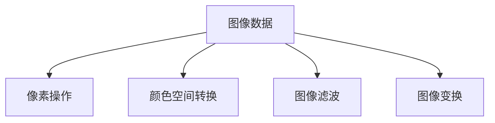

                 

 > **关键词：** OpenCV、计算机视觉、图像处理、算法原理、应用场景、数学模型。

> **摘要：** 本文将深入探讨OpenCV计算机视觉库中的图像处理技术，从背景介绍、核心概念、算法原理、数学模型、实际应用、工具推荐和未来展望等方面，全面解析图像处理在计算机视觉领域的应用及其发展前景。通过本文的学习，读者将能够掌握图像处理的基本原理和关键技术，为实际项目开发提供有力支持。

## 1. 背景介绍

图像处理作为计算机视觉领域的重要组成部分，其技术发展一直备受关注。OpenCV（Open Source Computer Vision Library）作为一款广泛使用的开源计算机视觉库，提供了丰富的图像处理功能，涵盖了从基础图像处理到高级计算机视觉任务的各个方面。

OpenCV由Intel发起，最初用于开源计算机视觉研究。随着社区的积极参与和贡献，OpenCV已经发展成为全球范围内最受欢迎的计算机视觉库之一。其强大的功能和跨平台支持，使得OpenCV在工业、医疗、安防、自动驾驶等众多领域得到了广泛应用。

本文将重点关注OpenCV中的图像处理技术，介绍核心概念、算法原理、数学模型，并通过实际项目实例进行讲解，帮助读者深入理解图像处理技术在实际应用中的实现方法和技巧。

## 2. 核心概念与联系

### 2.1 图像处理基本概念

在OpenCV中，图像处理主要包括以下基本概念：

1. **像素**：图像的基本组成单元，每个像素包含一定的颜色信息。
2. **颜色空间**：用于表示图像颜色的一种数学模型，常见的有RGB、HSV、灰度等。
3. **图像分辨率**：图像的水平像素数和垂直像素数，决定了图像的清晰度。
4. **图像滤波**：通过对图像进行卷积操作，用于消除噪声、边缘检测等。
5. **图像变换**：包括傅里叶变换、Hilbert变换等，用于图像的频率域分析。

### 2.2 核心概念原理与架构

下面使用Mermaid流程图对核心概念原理和架构进行说明：



### 2.3 核心概念之间的联系

不同核心概念之间有着密切的联系。例如，颜色空间转换是图像滤波和变换的基础。图像滤波可以用于去除噪声，为后续图像处理提供更好的输入。而图像变换则可以用于频率域分析，进一步提取图像特征。

## 3. 核心算法原理 & 具体操作步骤

### 3.1 算法原理概述

OpenCV中常用的图像处理算法包括滤波、边缘检测、特征提取等。以下分别进行介绍：

1. **滤波算法**：用于去除图像中的噪声，常见的有均值滤波、高斯滤波、中值滤波等。
2. **边缘检测算法**：用于提取图像中的边缘信息，常见的有Canny算法、Sobel算子、Prewitt算子等。
3. **特征提取算法**：用于从图像中提取具有区分度的特征，常见的有Harris角点检测、SIFT、SURF等。

### 3.2 算法步骤详解

以滤波算法为例，具体步骤如下：

1. **输入图像**：读取待处理的图像数据。
2. **选择滤波器**：根据需求选择合适的滤波器，如均值滤波器、高斯滤波器等。
3. **卷积操作**：对图像进行卷积操作，实现滤波效果。
4. **输出滤波结果**：将滤波后的图像数据输出。

下面是使用OpenCV实现滤波算法的Python代码示例：

```python
import cv2

# 读取图像
image = cv2.imread('image.jpg', cv2.IMREAD_GRAYSCALE)

# 创建均值滤波器
mean_filter = cv2.blur(image, (3, 3))

# 创建高斯滤波器
gauss_filter = cv2.GaussianBlur(image, (3, 3), 0)

# 输出滤波结果
cv2.imwrite('mean_filter.jpg', mean_filter)
cv2.imwrite('gauss_filter.jpg', gauss_filter)
```

### 3.3 算法优缺点

不同滤波算法具有不同的优缺点：

1. **均值滤波**：简单高效，但可能丢失边缘信息。
2. **高斯滤波**：对噪声抑制能力强，但计算复杂度较高。
3. **中值滤波**：能有效去除椒盐噪声，但可能产生拖影。

### 3.4 算法应用领域

滤波算法在图像处理中的应用非常广泛，包括：

1. **图像去噪**：在数字图像处理领域，如医疗影像、卫星图像等。
2. **图像增强**：在安防监控、人脸识别等应用中，用于提高图像质量。
3. **图像预处理**：在计算机视觉任务中，如目标检测、跟踪等，用于提取有效的特征。

## 4. 数学模型和公式

图像处理中的数学模型和公式是算法实现的基础。以下介绍几个常用的数学模型和公式：

### 4.1 数学模型构建

以高斯滤波为例，其数学模型如下：

$$
f(x, y) = \sum_{i=-\infty}^{\infty} \sum_{j=-\infty}^{\infty} g(x-i, y-j) * I(i, j)
$$

其中，$g(x, y)$ 是高斯滤波器，$I(x, y)$ 是输入图像。

### 4.2 公式推导过程

高斯滤波器的推导过程如下：

$$
g(x, y) = \frac{1}{2\pi\sigma^2} e^{-\frac{x^2 + y^2}{2\sigma^2}}
$$

### 4.3 案例分析与讲解

以图像去噪为例，分析高斯滤波器在图像去噪中的应用：

1. **输入图像**：读取一张含有噪声的图像。
2. **选择滤波器**：选择合适的高斯滤波器。
3. **卷积操作**：对图像进行卷积操作，实现去噪效果。
4. **输出滤波结果**：将去噪后的图像输出。

下面是使用OpenCV实现高斯滤波去噪的Python代码示例：

```python
import cv2

# 读取图像
image = cv2.imread('noisy_image.jpg', cv2.IMREAD_GRAYSCALE)

# 创建高斯滤波器
gauss_filter = cv2.GaussianBlur(image, (3, 3), 0)

# 输出滤波结果
cv2.imwrite('gauss_filter.jpg', gauss_filter)
```

## 5. 项目实践：代码实例和详细解释说明

在本节中，我们将通过一个具体的图像处理项目实例，展示如何使用OpenCV进行图像处理，并详细解释相关代码的实现过程。

### 5.1 开发环境搭建

首先，确保已安装Python环境和OpenCV库。可以使用以下命令安装OpenCV：

```bash
pip install opencv-python
```

### 5.2 源代码详细实现

以下是一个简单的图像处理项目实例，包括图像读取、滤波、边缘检测等操作：

```python
import cv2

# 读取图像
image = cv2.imread('image.jpg')

# 转换为灰度图像
gray_image = cv2.cvtColor(image, cv2.COLOR_BGR2GRAY)

# 使用高斯滤波器进行去噪
gauss_image = cv2.GaussianBlur(gray_image, (5, 5), 0)

# 使用Canny算法进行边缘检测
edges = cv2.Canny(gauss_image, 50, 150)

# 显示结果
cv2.imshow('Original Image', image)
cv2.imshow('Gray Image', gray_image)
cv2.imshow('Gaussian Blur', gauss_image)
cv2.imshow('Edges', edges)
cv2.waitKey(0)
cv2.destroyAllWindows()
```

### 5.3 代码解读与分析

1. **图像读取**：
   ```python
   image = cv2.imread('image.jpg')
   ```
   使用`imread`函数读取图像文件，参数`'image.jpg'`是图像文件路径。

2. **灰度转换**：
   ```python
   gray_image = cv2.cvtColor(image, cv2.COLOR_BGR2GRAY)
   ```
   使用`cvtColor`函数将BGR格式的图像转换为灰度图像。

3. **高斯滤波去噪**：
   ```python
   gauss_image = cv2.GaussianBlur(gray_image, (5, 5), 0)
   ```
   使用`GaussianBlur`函数对灰度图像进行高斯滤波，参数`(5, 5)`是滤波器的尺寸。

4. **边缘检测**：
   ```python
   edges = cv2.Canny(gauss_image, 50, 150)
   ```
   使用`Canny`函数对滤波后的图像进行边缘检测，参数`50`和`150`分别是Canny算法的阈值。

5. **显示结果**：
   ```python
   cv2.imshow('Original Image', image)
   cv2.imshow('Gray Image', gray_image)
   cv2.imshow('Gaussian Blur', gauss_image)
   cv2.imshow('Edges', edges)
   cv2.waitKey(0)
   cv2.destroyAllWindows()
   ```
   使用`imshow`函数显示处理结果，`cv2.waitKey(0)`等待键盘输入，`cv2.destroyAllWindows()`关闭所有窗口。

### 5.4 运行结果展示

运行上述代码后，将显示原始图像、灰度图像、高斯滤波图像和边缘检测图像。通过对比不同处理结果，可以观察到图像处理技术在实际应用中的效果。

## 6. 实际应用场景

图像处理技术在计算机视觉领域具有广泛的应用。以下列举几个实际应用场景：

### 6.1 目标检测

目标检测是计算机视觉领域的重要任务之一。通过图像处理技术，如边缘检测、特征提取等，可以有效地识别和定位图像中的目标。OpenCV提供的预训练模型和API，如YOLO、SSD等，可以简化目标检测的实现过程。

### 6.2 人脸识别

人脸识别是一种常见的生物识别技术。通过图像处理技术，如面部特征点检测、人脸特征提取等，可以对人脸图像进行有效的识别和比对。OpenCV中的人脸检测模块和深度学习框架，如Dlib、OpenFace等，为人脸识别提供了丰富的工具和资源。

### 6.3 医学影像分析

医学影像分析是医学领域的重要应用。通过图像处理技术，如图像增强、病灶检测等，可以辅助医生进行疾病的诊断和治疗。OpenCV在医学影像分析中有着广泛的应用，如肺结节检测、脑肿瘤分割等。

### 6.4 自动驾驶

自动驾驶是近年来快速发展的人工智能技术之一。通过图像处理技术，如目标检测、场景理解等，可以实现对车辆周围环境的感知和决策。OpenCV在自动驾驶系统中发挥着重要作用，如车道线检测、行人检测等。

## 7. 工具和资源推荐

### 7.1 学习资源推荐

1. **《OpenCV 4.0 Cookbook》**：一本全面介绍OpenCV功能的实战指南，适合初学者和进阶者。
2. **OpenCV官方文档**：包含详细的API文档、教程和示例代码，是学习OpenCV的绝佳资源。
3. **CSDN、知乎等社区**：在计算机视觉和图像处理领域，有许多优秀的博客和教程，可以提供实用的经验和技巧。

### 7.2 开发工具推荐

1. **PyCharm**：一款功能强大的Python集成开发环境（IDE），支持多种编程语言，适合OpenCV开发。
2. **Jupyter Notebook**：一个交互式的计算环境，可以方便地进行代码实验和数据分析。

### 7.3 相关论文推荐

1. **"Deep Learning for Object Detection: A Comprehensive Review"**：一篇关于目标检测领域的综述，介绍了一系列深度学习算法。
2. **"Face Recognition: A Brief Introduction"**：一篇关于人脸识别技术的基础论文，详细介绍了人脸识别的原理和方法。
3. **"Medical Image Analysis: A Review"**：一篇关于医学影像分析的综述，涵盖了医学影像处理的最新进展和应用。

## 8. 总结：未来发展趋势与挑战

### 8.1 研究成果总结

近年来，图像处理技术在计算机视觉领域取得了显著的成果。深度学习技术的引入，使得图像处理算法在准确性和效率方面得到了大幅提升。同时，硬件加速技术的发展，如GPU和FPGA，为图像处理提供了强大的计算能力。

### 8.2 未来发展趋势

1. **多模态融合**：未来图像处理技术将与其他传感器数据（如雷达、激光雷达等）进行融合，实现更全面的感知能力。
2. **实时处理**：随着5G和边缘计算的发展，实时图像处理将成为主流需求，推动图像处理技术的实时化、高效化。
3. **自主化**：自动驾驶、机器人等领域将朝着自主化的方向发展，图像处理技术将在其中扮演重要角色。

### 8.3 面临的挑战

1. **数据隐私**：图像处理技术的广泛应用带来了数据隐私的挑战，如何在保证数据安全的前提下进行图像处理，是一个亟待解决的问题。
2. **计算资源**：实时图像处理对计算资源要求较高，如何在有限的计算资源下实现高效的图像处理，仍需进一步探索。

### 8.4 研究展望

未来，图像处理技术将在计算机视觉领域发挥更加重要的作用。通过不断引入新的算法和硬件技术，图像处理将朝着更高效、更智能、更自主的方向发展，为人工智能和实际应用带来更多可能性。

## 9. 附录：常见问题与解答

### 9.1 OpenCV安装问题

Q：如何安装OpenCV？

A：可以使用pip命令安装OpenCV：

```
pip install opencv-python
```

### 9.2 Python环境配置问题

Q：如何在Python环境中使用OpenCV？

A：首先，确保已安装Python和pip。然后，使用pip命令安装OpenCV库：

```
pip install opencv-python
```

安装完成后，在Python代码中导入OpenCV库：

```python
import cv2
```

### 9.3 图像处理算法选择问题

Q：如何选择合适的图像处理算法？

A：选择合适的图像处理算法需要考虑以下几个方面：

1. **任务需求**：根据具体的图像处理任务，选择适合的算法。
2. **计算资源**：考虑计算资源限制，选择计算效率较高的算法。
3. **算法性能**：根据算法的性能指标，选择具有较好性能的算法。
4. **开源资源**：考虑开源资源，选择社区认可度较高的算法。

### 9.4 实际应用问题

Q：如何将图像处理技术应用到实际项目中？

A：将图像处理技术应用到实际项目中，可以遵循以下步骤：

1. **需求分析**：明确项目的需求，确定需要解决的问题。
2. **算法选择**：根据需求选择合适的图像处理算法。
3. **代码实现**：编写Python代码实现图像处理算法。
4. **调试优化**：对代码进行调试和优化，确保算法的稳定性和效率。
5. **系统集成**：将图像处理算法集成到项目中，与其他模块协同工作。

---

以上是《OpenCV计算机视觉库：图像处理技术》的完整文章。希望本文对您在图像处理领域的学习和实践有所帮助。如果您有任何问题或建议，欢迎在评论区留言，我们将尽快为您解答。

### 作者署名

作者：禅与计算机程序设计艺术 / Zen and the Art of Computer Programming

