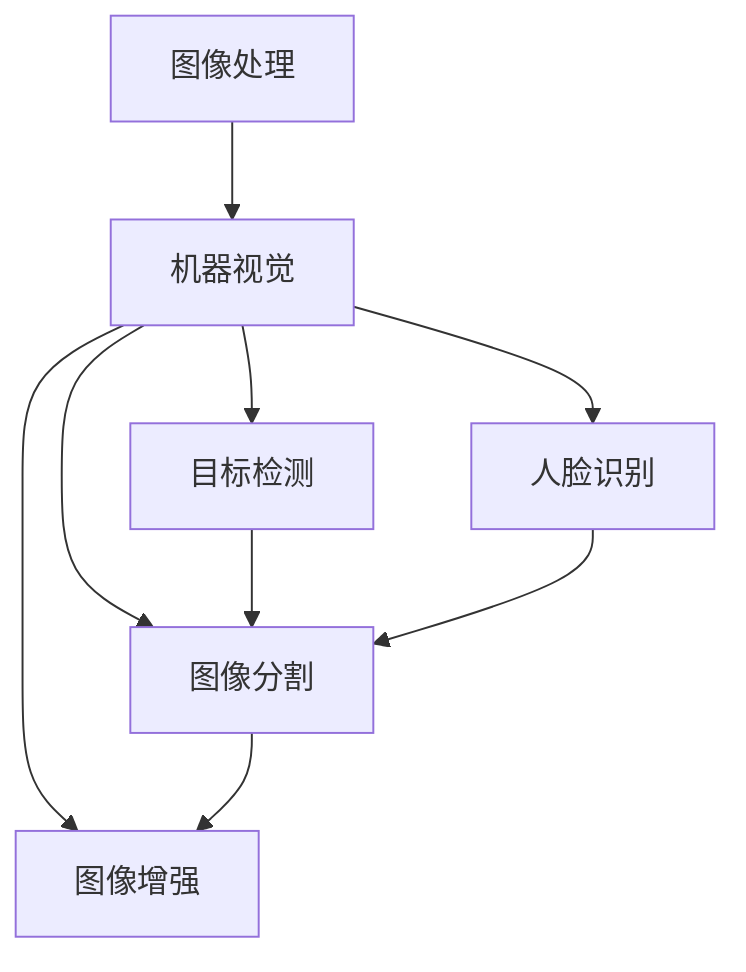

                 

关键词：计算机视觉、OpenCV、图像处理、机器视觉、算法、实践、应用场景、工具推荐、未来展望

> 摘要：本文将深入探讨OpenCV在计算机视觉领域的应用，通过图像处理和机器视觉的实战案例，展示其在图像识别、目标检测、人脸识别等方面的强大能力。文章将从核心概念、算法原理、数学模型、项目实践、应用场景、工具推荐等方面进行全面解析，旨在为广大开发者提供有价值的实战指导。

## 1. 背景介绍

计算机视觉作为人工智能的重要分支，已经成为当前科技发展的热点。随着深度学习、大数据等技术的飞速发展，计算机视觉在自动驾驶、安防监控、医疗影像、无人机等多个领域得到了广泛应用。而OpenCV（Open Source Computer Vision Library）作为一款开源的计算机视觉库，凭借其强大的功能和跨平台的特性，已经成为广大开发者和研究者的首选工具。

OpenCV最初由Intel公司于2000年推出，经过多年的发展，已经成为世界上最受欢迎的计算机视觉库之一。它涵盖了从图像处理到目标检测、人脸识别等多种计算机视觉任务，支持多种编程语言，包括C++、Python等，并且拥有庞大的社区支持。

本文将围绕OpenCV在图像处理和机器视觉方面的应用，探讨其核心概念、算法原理、数学模型以及项目实践，旨在为广大开发者提供实用的实战指导。

## 2. 核心概念与联系

### 2.1. 图像处理

图像处理是计算机视觉的基础，它涉及图像的获取、处理和分析。OpenCV提供了丰富的图像处理功能，包括图像的滤波、增强、变换、分割等。这些功能为图像分析和理解奠定了基础。

### 2.2. 机器视觉

机器视觉是指利用计算机和图像处理技术实现物体识别、测量、检测等任务。它广泛应用于工业自动化、安防监控、医疗诊断等领域。OpenCV提供了大量的机器视觉算法，如目标检测、人脸识别、手势识别等。

### 2.3. 核心概念原理和架构

下面是一个用Mermaid绘制的流程图，展示OpenCV在图像处理和机器视觉中的应用架构：



## 3. 核心算法原理 & 具体操作步骤

### 3.1. 算法原理概述

OpenCV提供了多种计算机视觉算法，其中最具代表性的是目标检测和人脸识别。目标检测旨在从图像中识别出特定的物体，人脸识别则是从图像中识别出人脸。

#### 目标检测

目标检测的基本原理是通过训练模型（如YOLO、SSD等）来识别图像中的物体。训练过程包括数据集的准备、模型训练和模型评估。在检测阶段，模型对输入图像进行特征提取，并输出物体位置和类别。

#### 人脸识别

人脸识别基于深度学习算法（如卷积神经网络），通过对人脸图像进行特征提取，建立人脸特征库。在识别阶段，将待识别的人脸与特征库中的特征进行比对，从而实现人脸识别。

### 3.2. 算法步骤详解

#### 目标检测

1. 数据集准备：收集大量包含不同类别物体的图像，并进行标注。
2. 模型训练：使用标注数据训练目标检测模型。
3. 模型评估：在测试集上评估模型性能。
4. 检测应用：使用训练好的模型对输入图像进行目标检测。

#### 人脸识别

1. 数据集准备：收集包含人脸的图像，并进行标注。
2. 模型训练：使用标注数据训练人脸识别模型。
3. 模型评估：在测试集上评估模型性能。
4. 识别应用：使用训练好的模型对输入图像进行人脸识别。

### 3.3. 算法优缺点

#### 目标检测

优点：

- 高效：实时检测。
- 准确：适用于多种场景。

缺点：

- 复杂：训练过程需要大量计算资源。

#### 人脸识别

优点：

- 高效：快速识别。
- 准确：准确性较高。

缺点：

- 受光线影响：在光线不足或过于强烈的环境中效果较差。

### 3.4. 算法应用领域

目标检测和人脸识别在多个领域具有广泛的应用：

- 自动驾驶：用于识别道路上的车辆、行人等。
- 安防监控：用于监控目标识别和异常行为检测。
- 医疗诊断：用于医学影像分析和疾病诊断。

## 4. 数学模型和公式 & 详细讲解 & 举例说明

### 4.1. 数学模型构建

在计算机视觉中，常见的数学模型包括卷积神经网络（CNN）、支持向量机（SVM）等。下面以CNN为例进行介绍。

#### CNN模型

CNN是一种用于图像识别的深度学习模型，其主要思想是通过卷积、池化和全连接层等操作提取图像特征。

$$
\begin{aligned}
    &\text{输入图像：} \, I_{in} \\
    &\text{卷积层：} \, C_{1}(I_{in}) \\
    &\text{池化层：} \, P_{1}(C_{1}(I_{in})) \\
    &\text{全连接层：} \, F_{1}(P_{1}(C_{1}(I_{in}))) \\
    &\text{输出结果：} \, O_{out} = F_{1}(P_{1}(C_{1}(I_{in})))
\end{aligned}
$$

### 4.2. 公式推导过程

CNN的推导过程涉及微积分和线性代数等数学知识，这里不再详细展开。主要思路是通过卷积操作提取图像特征，再通过池化操作减少参数数量，最终通过全连接层进行分类。

### 4.3. 案例分析与讲解

假设我们要使用CNN识别一张图片中的猫。

1. 数据集准备：收集包含猫的图像，并进行标注。
2. 模型训练：使用标注数据训练CNN模型。
3. 模型评估：在测试集上评估模型性能。
4. 识别应用：使用训练好的模型对输入图片进行猫的识别。

## 5. 项目实践：代码实例和详细解释说明

### 5.1. 开发环境搭建

首先，我们需要安装OpenCV库。在Python中，可以使用以下命令安装：

```python
pip install opencv-python
```

### 5.2. 源代码详细实现

下面是一个简单的使用OpenCV进行人脸识别的Python代码实例：

```python
import cv2

# 加载预训练的人脸识别模型
face_cascade = cv2.CascadeClassifier(cv2.data.haarcascades + 'haarcascade_frontalface_default.xml')

# 读取图像
img = cv2.imread('face.jpg')

# 转换为灰度图像
gray = cv2.cvtColor(img, cv2.COLOR_BGR2GRAY)

# 检测人脸
faces = face_cascade.detectMultiScale(gray, scaleFactor=1.1, minNeighbors=5, minSize=(30, 30), flags=cv2.CASCADE_SCALE_IMAGE)

# 绘制人脸矩形框
for (x, y, w, h) in faces:
    cv2.rectangle(img, (x, y), (x+w, y+h), (255, 0, 0), 2)

# 显示结果
cv2.imshow('Face Detection', img)
cv2.waitKey(0)
cv2.destroyAllWindows()
```

### 5.3. 代码解读与分析

1. 加载预训练的人脸识别模型：`CascadeClassifier` 类用于加载人脸识别模型。
2. 读取图像：`imread` 函数用于读取图像。
3. 转换为灰度图像：`cvtColor` 函数用于将图像转换为灰度图像。
4. 检测人脸：`detectMultiScale` 方法用于检测图像中的人脸。
5. 绘制人脸矩形框：`rectangle` 函数用于绘制人脸矩形框。
6. 显示结果：`imshow` 函数用于显示结果图像。

### 5.4. 运行结果展示

运行上述代码后，将在窗口中显示输入图像，并在检测到人脸的位置绘制矩形框。

## 6. 实际应用场景

### 6.1. 自动驾驶

自动驾驶系统需要实时识别道路上的各种物体，如车辆、行人、交通标志等。OpenCV在自动驾驶中的应用包括目标检测、车辆识别、车道线检测等。

### 6.2. 安防监控

安防监控系统需要实时监控并识别异常行为，如闯红灯、打架斗殴等。OpenCV在安防监控中的应用包括目标检测、人脸识别、行为识别等。

### 6.3. 医疗诊断

医疗诊断系统需要利用图像分析技术对医学影像进行分析和诊断，如X光片、CT影像等。OpenCV在医疗诊断中的应用包括图像分割、特征提取、疾病检测等。

### 6.4. 未来应用展望

随着深度学习和计算机视觉技术的不断发展，OpenCV在图像处理和机器视觉领域的应用前景将更加广阔。未来，OpenCV将可能在更多领域发挥重要作用，如智能安防、智能交通、智能医疗等。

## 7. 工具和资源推荐

### 7.1. 学习资源推荐

- 《OpenCV编程实践》
- 《OpenCV算法原理解析》
- 《深度学习与计算机视觉》

### 7.2. 开发工具推荐

- Python
- Visual Studio Code
- Git

### 7.3. 相关论文推荐

- "Deep Learning for Computer Vision: A Survey"
- "Object Detection with YOLOv3"
- "Face Recognition with Deep Learning"

## 8. 总结：未来发展趋势与挑战

### 8.1. 研究成果总结

本文通过深入探讨OpenCV在图像处理和机器视觉领域的应用，展示了其在目标检测、人脸识别等任务中的强大能力。同时，通过对数学模型和公式的讲解，为广大开发者提供了实用的实战指导。

### 8.2. 未来发展趋势

未来，OpenCV将在深度学习、人工智能等技术的推动下，在图像处理和机器视觉领域取得更大突破。随着技术的不断进步，OpenCV的应用领域将更加广泛，如智能安防、智能医疗、智能交通等。

### 8.3. 面临的挑战

然而，OpenCV在发展过程中也面临着一些挑战，如算法性能、计算资源消耗、数据隐私保护等。这些问题需要通过技术创新和规范制定来逐步解决。

### 8.4. 研究展望

总之，OpenCV在图像处理和机器视觉领域的应用前景广阔。未来，我们将继续关注OpenCV的最新动态，为广大开发者提供更多的实战经验和指导。

## 9. 附录：常见问题与解答

### 9.1. 如何安装OpenCV？

在Python环境中，可以使用以下命令安装：

```python
pip install opencv-python
```

### 9.2. 如何在OpenCV中实现人脸识别？

可以使用以下步骤实现人脸识别：

1. 加载预训练的人脸识别模型。
2. 读取图像。
3. 转换为灰度图像。
4. 使用人脸识别模型检测图像中的人脸。
5. 在检测到的人脸位置绘制矩形框。
6. 显示结果图像。

### 9.3. OpenCV支持哪些编程语言？

OpenCV支持多种编程语言，包括C++、Python、Java等。

---

作者：禅与计算机程序设计艺术 / Zen and the Art of Computer Programming
------------------------------------------------------------------------

