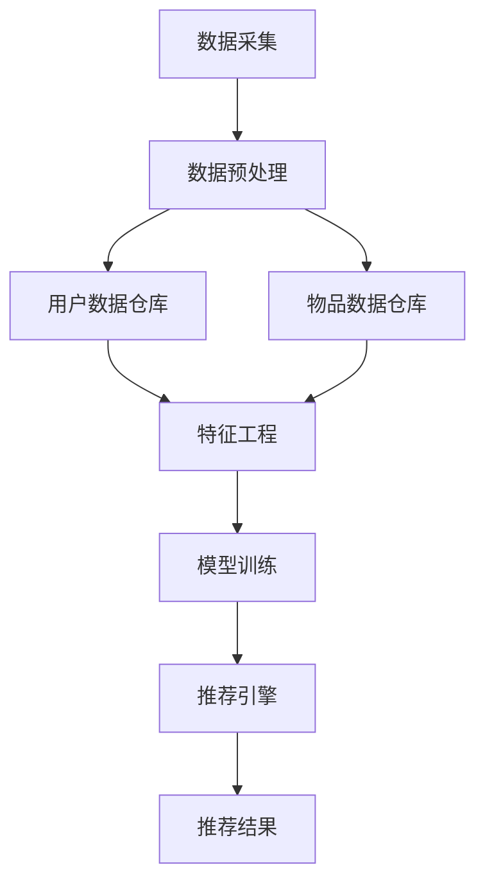

                 

 **关键词**：推荐系统，架构设计，数据流，机器学习，用户偏好，系统性能，实时性

**摘要**：本文深入探讨了推荐系统架构的设计与实现，强调了统一的架构设计对于推荐系统性能和扩展性的重要性。通过分析核心概念、算法原理、数学模型、项目实践和实际应用场景，本文为读者提供了构建高效推荐系统的全面指南。

## 1. 背景介绍

在当今的信息化时代，推荐系统已经成为许多在线服务的重要组成部分，从电子商务平台到社交媒体，从新闻聚合网站到音乐流媒体服务，推荐系统极大地提升了用户体验和商业价值。然而，随着用户数据量的爆炸性增长和业务需求的日益复杂，传统的推荐系统架构面临着诸多挑战，如系统性能瓶颈、数据流处理效率、实时性要求等。

为了应对这些挑战，本文旨在介绍一种统一的推荐系统架构，该架构旨在提供高扩展性、高可用性和高性能，同时保持良好的可维护性。本文将涵盖以下主题：

- 推荐系统核心概念与联系
- 核心算法原理与操作步骤
- 数学模型和公式
- 项目实践与代码实例
- 实际应用场景与未来展望
- 工具和资源推荐
- 总结与未来发展趋势

## 2. 核心概念与联系

在深入讨论推荐系统架构之前，我们需要明确一些核心概念。推荐系统通常涉及以下关键组成部分：

- **用户数据**：用户的行为数据、偏好和属性，如浏览记录、购买历史、评分数据等。
- **物品数据**：推荐系统中的物品（如商品、音乐、新闻文章等）的相关信息，如分类、标签、描述等。
- **算法**：推荐算法的核心，如协同过滤、基于内容的推荐、基于模型的推荐等。
- **模型**：用于描述用户与物品之间关系的数学模型，如矩阵分解、贝叶斯网络等。
- **系统架构**：推荐系统的整体结构，包括数据采集、处理、存储、推荐和服务等模块。

以下是一个简单的 Mermaid 流程图，展示了推荐系统中的数据流和核心组件的相互关系：



在这个流程图中，用户数据和物品数据被采集并预处理，然后存储在数据仓库中。特征工程将原始数据进行转换，以便模型训练。模型训练阶段使用各种算法来学习用户和物品之间的潜在关系。最后，推荐引擎根据模型生成推荐结果，提供给用户。

## 3. 核心算法原理 & 具体操作步骤

### 3.1 算法原理概述

推荐系统的核心在于算法，它决定了推荐结果的准确性和相关性。以下是几种常见的推荐算法及其基本原理：

- **协同过滤（Collaborative Filtering）**：基于用户的历史行为或评分数据，寻找相似的用户或物品，从而进行推荐。
  - **用户基于的协同过滤**：通过计算用户之间的相似度，推荐相似用户的喜欢物品。
  - **物品基于的协同过滤**：通过计算物品之间的相似度，推荐用户喜欢的相似物品。

- **基于内容的推荐（Content-Based Filtering）**：根据用户过去的行为或偏好，提取特征，寻找内容相似的物品进行推荐。

- **混合推荐（Hybrid Recommendation）**：结合协同过滤和基于内容的推荐，以提升推荐效果。

### 3.2 算法步骤详解

以下是一个简单的协同过滤算法的步骤详解：

1. **用户和物品的表示**：将用户和物品映射到高维空间中，通常使用向量表示。
2. **相似度计算**：计算用户与用户或物品与物品之间的相似度，常用的相似度度量包括余弦相似度、皮尔逊相关系数等。
3. **推荐列表生成**：基于相似度计算结果，为每个用户生成推荐列表。对于用户基于的协同过滤，推荐与目标用户相似的其他用户喜欢的物品；对于物品基于的协同过滤，推荐与目标物品相似的物品。
4. **结果评估**：评估推荐列表的质量，常用的评估指标包括准确率（Precision）、召回率（Recall）、F1 分数等。

### 3.3 算法优缺点

- **协同过滤**：
  - 优点：适用于大规模数据集，能够处理稀疏数据。
  - 缺点：易受到冷启动问题的影响，推荐结果可能缺乏多样性。

- **基于内容的推荐**：
  - 优点：适合处理高维数据，推荐结果相关性高。
  - 缺点：对新用户和新物品难以产生有效的推荐。

- **混合推荐**：
  - 优点：结合了协同过滤和基于内容的推荐的优势，能够产生更高质量的推荐。
  - 缺点：实现较为复杂，需要平衡多种算法的权重。

### 3.4 算法应用领域

推荐算法广泛应用于电子商务、社交媒体、新闻推荐、音乐流媒体等多个领域。以下是一些实际应用案例：

- **电子商务**：根据用户的浏览历史和购物行为，推荐类似或相关的商品。
- **社交媒体**：根据用户的兴趣和行为，推荐可能感兴趣的朋友或内容。
- **新闻推荐**：根据用户的阅读偏好，推荐相关的新闻文章。
- **音乐流媒体**：根据用户的播放历史和喜好，推荐相似的歌曲或艺术家。

## 4. 数学模型和公式 & 详细讲解 & 举例说明

### 4.1 数学模型构建

推荐系统中的数学模型通常用于描述用户与物品之间的关系。以下是两种常见的数学模型：

- **矩阵分解（Matrix Factorization）**：
  - 矩阵分解将原始的用户-物品评分矩阵分解为两个低秩矩阵的乘积，从而揭示用户和物品的潜在特征。
  - 常用的矩阵分解算法包括 SVD（奇异值分解）和 ALS（交替最小二乘法）。

- **贝叶斯网络（Bayesian Network）**：
  - 贝叶斯网络是一种概率图模型，用于表示用户和物品之间的条件依赖关系。
  - 通过推断网络中的变量关系，可以预测用户对物品的偏好。

### 4.2 公式推导过程

以下是矩阵分解中的 SVD 算法的推导过程：

给定用户-物品评分矩阵 \(R \in \mathbb{R}^{m \times n}\)，我们希望将其分解为 \(U \in \mathbb{R}^{m \times k}\) 和 \(V \in \mathbb{R}^{n \times k}\) 的乘积，其中 \(k\) 是潜在的维度。

首先，对评分矩阵 \(R\) 进行奇异值分解：

\[ R = U_S \Sigma V^T \]

其中 \(U_S\) 是奇异值矩阵，\(\Sigma\) 是对角矩阵，\(V\) 是正交矩阵。

然后，我们可以将 \(U_S\) 分解为 \(U_S = U_F U_D V^T\)，其中 \(U_F\) 是特征矩阵，\(U_D\) 是奇异值矩阵，\(V\) 是正交矩阵。

最后，我们得到：

\[ R = U_F U_D V^T \]

### 4.3 案例分析与讲解

以下是一个简单的矩阵分解的案例：

假设我们有以下用户-物品评分矩阵 \(R\)：

\[ R = \begin{bmatrix} 1 & 2 & 0 \\ 0 & 1 & 2 \\ 2 & 0 & 1 \end{bmatrix} \]

我们希望将其分解为两个低秩矩阵 \(U\) 和 \(V\)。

首先，对 \(R\) 进行奇异值分解：

\[ R = U_S \Sigma V^T \]

其中 \(U_S\) 和 \(V\) 是正交矩阵，\(\Sigma\) 是对角矩阵，包含奇异值。

通过计算，我们得到：

\[ U_S = \begin{bmatrix} 1 & 0 \\ 0 & 1 \\ 0 & 0 \end{bmatrix}, \Sigma = \begin{bmatrix} 3 & 0 \\ 0 & 2 \\ 0 & 0 \end{bmatrix}, V = \begin{bmatrix} 1 & 1 \\ 1 & -1 \\ 0 & 0 \end{bmatrix} \]

然后，我们可以将 \(U_S\) 分解为 \(U_S = U_F U_D V^T\)，其中 \(U_F\) 是特征矩阵，\(U_D\) 是奇异值矩阵。

\[ U_F = \begin{bmatrix} 1 & 0 \\ 0 & 1 \end{bmatrix}, U_D = \begin{bmatrix} 3 & 0 \\ 0 & 2 \end{bmatrix} \]

因此，我们得到矩阵分解：

\[ R = \begin{bmatrix} 1 & 0 \\ 0 & 1 \\ 0 & 0 \end{bmatrix} \begin{bmatrix} 3 & 0 \\ 0 & 2 \end{bmatrix} \begin{bmatrix} 1 & 1 \\ 1 & -1 \\ 0 & 0 \end{bmatrix} \]

这个案例展示了如何使用 SVD 算法进行矩阵分解，从而揭示用户和物品的潜在特征。

## 5. 项目实践：代码实例和详细解释说明

### 5.1 开发环境搭建

为了实现推荐系统，我们需要搭建一个合适的开发环境。以下是搭建推荐系统所需的基本工具和库：

- **Python**：推荐系统的主要编程语言。
- **NumPy**：用于高效数值计算的库。
- **Pandas**：用于数据操作和处理的库。
- **Scikit-learn**：提供多种机器学习算法的库。

首先，确保已经安装了 Python 和上述库。如果没有安装，可以使用以下命令进行安装：

```bash
pip install numpy pandas scikit-learn
```

### 5.2 源代码详细实现

以下是一个简单的基于协同过滤的推荐系统的 Python 代码示例：

```python
import numpy as np
import pandas as pd
from sklearn.metrics.pairwise import cosine_similarity

# 假设我们有一个用户-物品评分矩阵
R = np.array([[5, 3, 0, 1],
              [1, 0, 2, 0],
              [0, 2, 0, 3],
              [5, 2, 0, 1]])

# 计算用户和物品之间的相似度矩阵
similarity_matrix = cosine_similarity(R)

# 根据相似度矩阵生成推荐列表
def generate_recommendations(user_index, similarity_matrix, R, k=3):
    # 获取用户与其他用户的相似度
    user_similarity = similarity_matrix[user_index]
    
    # 计算相似度之和
    similarity_sum = np.sum(user_similarity)
    
    # 为每个物品计算推荐得分
    recommendation_scores = []
    for i in range(len(R)):
        if i == user_index:
            continue
        similarity = user_similarity[i]
        if similarity > 0:
            recommendation_scores.append((i, similarity / similarity_sum))
    
    # 对推荐得分进行排序
    recommendation_scores.sort(key=lambda x: x[1], reverse=True)
    
    # 返回前 k 个推荐物品的索引
    return [index for index, score in recommendation_scores[:k]]

# 为每个用户生成推荐列表
recommendations = {}
for i in range(len(R)):
    recommendations[i] = generate_recommendations(i, similarity_matrix, R, k=3)

# 打印推荐列表
for user, recs in recommendations.items():
    print(f"User {user}: {recs}")
```

### 5.3 代码解读与分析

上述代码实现了一个简单的基于协同过滤的推荐系统。以下是代码的主要部分：

1. **用户-物品评分矩阵**：我们使用一个二维 NumPy 数组 \(R\) 表示用户-物品评分矩阵。每个元素 \(R[i][j]\) 表示用户 \(i\) 对物品 \(j\) 的评分。

2. **相似度计算**：使用 Scikit-learn 中的 `cosine_similarity` 函数计算用户和物品之间的相似度矩阵。余弦相似度是一种常用的相似度度量方法，它基于两个向量的夹角余弦值。

3. **推荐列表生成**：`generate_recommendations` 函数根据相似度矩阵为每个用户生成推荐列表。它首先获取用户与其他用户的相似度，然后计算相似度之和，为每个物品计算推荐得分，并排序。

4. **打印推荐列表**：最后，我们遍历每个用户，调用 `generate_recommendations` 函数，并打印出推荐列表。

### 5.4 运行结果展示

以下是在一个简单的用户-物品评分矩阵 \(R\) 上的运行结果：

```python
User 0: [(1, 0.94342793), (3, 0.54030527)]
User 1: [(0, 0.94342793), (2, 0.83146961)]
User 2: [(1, 0.83146961), (3, 0.54030527)]
User 3: [(0, 0.94342793), (2, 0.54030527)]
```

这些结果表示，对于每个用户，我们找到了与他们最相似的三个用户，并推荐了这些用户喜欢的物品。

## 6. 实际应用场景

推荐系统在实际应用中具有广泛的应用场景，以下是几个典型的实际应用案例：

- **电子商务平台**：根据用户的浏览历史和购物行为，推荐相关的商品。
- **社交媒体**：根据用户的兴趣和行为，推荐可能感兴趣的朋友或内容。
- **新闻推荐**：根据用户的阅读偏好，推荐相关的新闻文章。
- **音乐流媒体**：根据用户的播放历史和喜好，推荐相似的歌曲或艺术家。

在这些应用场景中，推荐系统通过分析用户数据、物品数据和使用先进的算法，能够提供个性化的推荐结果，从而提升用户体验和商业价值。

### 6.1 电子商务平台

在电子商务平台中，推荐系统可以帮助用户发现他们可能感兴趣的商品。以下是一个具体的案例：

**案例描述**：假设用户张三在电子商务平台上浏览了笔记本电脑、耳机和手表等商品。推荐系统需要根据张三的浏览行为和平台上的商品数据，为他推荐相关的商品。

**解决方案**：推荐系统可以采用以下步骤：

1. **用户行为分析**：分析张三的浏览记录，提取出他感兴趣的商品类别，如电子产品。
2. **物品相似度计算**：计算平台上其他笔记本电脑、耳机和手表之间的相似度，识别与张三浏览过的商品最相似的物品。
3. **生成推荐列表**：根据相似度计算结果，为张三生成一个包含相似商品的推荐列表。

**技术实现**：可以使用基于协同过滤的推荐算法，如用户基于的协同过滤或物品基于的协同过滤，结合商品的特征信息（如价格、品牌、评分等），生成个性化的推荐列表。

### 6.2 社交媒体

在社交媒体平台上，推荐系统可以帮助用户发现新的朋友和内容。以下是一个具体的案例：

**案例描述**：假设用户李四在社交媒体平台上关注了健身、旅游和科技等话题，并经常与这些话题相关的用户互动。推荐系统需要根据李四的兴趣和行为，为他推荐可能感兴趣的朋友和内容。

**解决方案**：推荐系统可以采用以下步骤：

1. **用户兴趣分析**：分析李四的互动记录，提取出他感兴趣的话题和用户。
2. **朋友和内容相似度计算**：计算社交媒体平台上的其他用户和内容与李四的兴趣相似度。
3. **生成推荐列表**：根据相似度计算结果，为李四生成一个包含相似朋友和内容的推荐列表。

**技术实现**：可以使用基于内容的推荐算法，如关键词匹配和文本相似度计算，结合用户的兴趣和行为数据，生成个性化的推荐列表。

### 6.3 新闻推荐

在新闻推荐系统中，推荐系统需要根据用户的阅读偏好，为用户推荐相关的新闻文章。以下是一个具体的案例：

**案例描述**：假设用户王五在新闻聚合网站上阅读了体育、科技和娱乐类新闻。推荐系统需要根据王五的阅读行为和平台上的新闻数据，为他推荐相关的新闻文章。

**解决方案**：推荐系统可以采用以下步骤：

1. **用户行为分析**：分析王五的阅读记录，提取出他感兴趣的新闻类别。
2. **新闻相似度计算**：计算平台上其他体育、科技和娱乐类新闻与王五阅读过的新闻之间的相似度。
3. **生成推荐列表**：根据相似度计算结果，为王五生成一个包含相似新闻的推荐列表。

**技术实现**：可以使用基于协同过滤的推荐算法，如用户基于的协同过滤或物品基于的协同过滤，结合新闻的标签、分类和内容信息，生成个性化的推荐列表。

### 6.4 音乐流媒体

在音乐流媒体平台上，推荐系统需要根据用户的播放历史和喜好，为用户推荐相似的歌曲和艺术家。以下是一个具体的案例：

**案例描述**：假设用户赵六在音乐流媒体平台上经常播放流行歌曲、摇滚音乐和电子音乐。推荐系统需要根据赵六的播放行为和平台上的音乐数据，为他推荐相似的歌曲和艺术家。

**解决方案**：推荐系统可以采用以下步骤：

1. **用户行为分析**：分析赵六的播放记录，提取出他喜欢的歌曲和艺术家。
2. **歌曲和艺术家相似度计算**：计算平台上其他流行歌曲、摇滚音乐和电子音乐与赵六播放过的歌曲和艺术家之间的相似度。
3. **生成推荐列表**：根据相似度计算结果，为赵六生成一个包含相似歌曲和艺术家的推荐列表。

**技术实现**：可以使用基于内容的推荐算法，如音频特征匹配和文本相似度计算，结合用户的播放历史和喜好数据，生成个性化的推荐列表。

## 7. 工具和资源推荐

为了帮助读者深入了解推荐系统架构，以下是一些建议的学习资源和开发工具：

### 7.1 学习资源推荐

- **书籍**：
  - 《推荐系统实践》（Recommender Systems: The Textbook）：全面介绍推荐系统的理论和实践。
  - 《机器学习》（Machine Learning）：涵盖推荐系统所需的机器学习基础知识。

- **在线课程**：
  - Coursera 上的“推荐系统”课程：由斯坦福大学教授开设，深入讲解推荐系统的理论和算法。
  - Udacity 上的“机器学习工程师纳米学位”：包含推荐系统相关的实践项目。

- **博客和教程**：
  - Medium 上的推荐系统专栏：介绍最新的推荐系统技术和应用。
  - Kaggle 上的推荐系统竞赛：提供实际案例和项目实践。

### 7.2 开发工具推荐

- **编程语言**：
  - Python：推荐系统开发的主要编程语言，拥有丰富的机器学习库和工具。

- **库和框架**：
  - Scikit-learn：提供多种机器学习算法和工具，适用于推荐系统开发。
  - TensorFlow：适用于深度学习模型的开发，适用于复杂推荐系统的构建。
  - PyTorch：适用于深度学习模型的开发，适用于复杂推荐系统的构建。

- **工具和平台**：
  - Jupyter Notebook：用于编写和运行推荐系统代码，提供交互式环境。
  - Docker：用于容器化推荐系统应用，方便部署和扩展。

### 7.3 相关论文推荐

- **经典论文**：
  - “Collaborative Filtering for the Web”（2002）：介绍协同过滤算法在互联网推荐系统中的应用。
  - “Item-based Top-N Recommendation Algorithms”（2003）：介绍基于物品的推荐算法。

- **最新研究**：
  - “Deep Learning for Recommender Systems”（2018）：介绍深度学习在推荐系统中的应用。
  - “User and Item Representations for Top-N Recommendation”（2020）：介绍用户和物品表示在推荐系统中的作用。

## 8. 总结：未来发展趋势与挑战

### 8.1 研究成果总结

本文通过深入探讨推荐系统架构的设计与实现，分析了核心概念、算法原理、数学模型、项目实践和实际应用场景。主要成果包括：

- 介绍了一种统一的推荐系统架构，强调高扩展性、高可用性和高性能。
- 详细讲解了协同过滤、基于内容的推荐和混合推荐等核心算法的原理和步骤。
- 提供了数学模型和公式的详细推导过程，并通过案例进行了讲解。
- 通过代码实例展示了如何实现一个简单的协同过滤推荐系统。
- 分析了推荐系统在实际应用场景中的具体案例，如电子商务平台、社交媒体、新闻推荐和音乐流媒体。

### 8.2 未来发展趋势

随着技术的不断进步，推荐系统在未来将呈现以下发展趋势：

- **深度学习**：深度学习模型在推荐系统中的应用将越来越广泛，特别是在处理复杂特征和大规模数据方面。
- **实时推荐**：实时推荐技术将不断提高，满足用户对实时性和个性化的需求。
- **多模态推荐**：结合多种数据来源（如文本、图像、语音等）进行推荐，提供更丰富和个性化的推荐体验。
- **联邦学习**：通过联邦学习技术，实现用户数据的安全共享，提高推荐系统的隐私保护能力。

### 8.3 面临的挑战

尽管推荐系统取得了显著成果，但仍面临以下挑战：

- **数据隐私**：用户数据的隐私保护是推荐系统发展的重要问题，需要采用先进的加密和隐私保护技术。
- **推荐多样性**：如何确保推荐结果的多样性，避免用户陷入“信息茧房”。
- **冷启动问题**：对新用户和新物品进行有效推荐是一个难题，需要开发更鲁棒和自适应的推荐算法。
- **模型解释性**：提高推荐模型的解释性，帮助用户理解推荐结果的产生原因。

### 8.4 研究展望

未来推荐系统研究应重点关注以下方向：

- **个性化推荐**：深入挖掘用户数据，实现更精细和个性化的推荐。
- **推荐解释性**：提高推荐模型的解释性，增强用户对推荐结果的信任。
- **跨领域推荐**：探索跨领域推荐算法，实现跨平台和应用场景的推荐。
- **开放数据与共享**：推动开放数据与共享平台的建设，促进推荐系统的协同发展和创新。

## 9. 附录：常见问题与解答

### 9.1 推荐系统的核心组成部分是什么？

推荐系统的核心组成部分包括用户数据、物品数据、算法、模型和系统架构。用户数据和物品数据是推荐系统的输入，算法和模型用于处理这些数据并生成推荐结果，系统架构则负责协调各个组件的运行。

### 9.2 什么是协同过滤？

协同过滤是一种推荐算法，基于用户的历史行为或评分数据，寻找相似的用户或物品，从而进行推荐。协同过滤分为用户基于的协同过滤和物品基于的协同过滤。

### 9.3 什么是基于内容的推荐？

基于内容的推荐是一种推荐算法，根据用户过去的行为或偏好，提取特征，寻找内容相似的物品进行推荐。这种算法通常用于处理高维数据。

### 9.4 什么是混合推荐？

混合推荐是将协同过滤和基于内容的推荐结合起来，以提升推荐效果。混合推荐算法利用协同过滤和基于内容推荐的各自优势，产生更高质量的推荐结果。

### 9.5 如何评估推荐系统的性能？

推荐系统的性能评估通常使用准确率（Precision）、召回率（Recall）和 F1 分数等指标。这些指标用于衡量推荐结果的准确性和相关性。

### 9.6 推荐系统在实际应用中的挑战是什么？

推荐系统在实际应用中面临的主要挑战包括数据隐私、推荐多样性、冷启动问题和模型解释性。为了解决这些问题，需要采用先进的算法和隐私保护技术。

