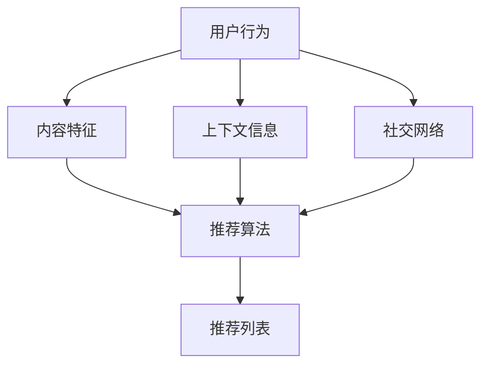

                 

关键词：P5模型，推荐系统，算法原理，数学模型，项目实践，应用场景

> 摘要：本文将深入探讨P5模型在推荐系统中的应用，解析其核心概念、算法原理、数学模型，并通过实际项目实践展示其在现实世界中的应用效果。文章旨在为读者提供一个全面、系统的推荐任务解决方案。

## 1. 背景介绍

在互联网时代，推荐系统已成为各大平台提升用户体验和增加用户粘性的关键因素。从最初的协同过滤算法，到后来的基于内容的推荐和基于模型的推荐，推荐系统的研究与应用日益广泛。然而，随着数据的爆炸式增长和用户需求的不断变化，现有的推荐系统面临着数据稀疏、冷启动问题、推荐效果不稳定等挑战。

为应对这些挑战，研究人员提出了P5模型。P5模型是一种基于深度学习的推荐系统模型，它通过整合用户历史行为、内容特征、上下文信息等多维数据，实现更精准、个性化的推荐。本文将详细介绍P5模型的核心概念、算法原理、数学模型及其在实际项目中的应用，旨在为推荐系统的研究和开发提供有价值的参考。

## 2. 核心概念与联系

### 2.1 P5模型的核心概念

P5模型主要包括五个核心概念：用户行为（User Behavior）、内容特征（Content Features）、上下文信息（Contextual Information）、社交网络（Social Networks）和推荐算法（Recommendation Algorithms）。这些概念共同构成了P5模型的基础框架。

1. **用户行为**：用户行为是指用户在使用平台过程中产生的各种操作，如浏览、购买、评论等。这些行为数据反映了用户的兴趣和偏好。

2. **内容特征**：内容特征是指平台上的各种物品（如商品、文章、音乐等）所具备的特征，如文本、图片、音频等。内容特征为推荐算法提供了对物品属性的描述。

3. **上下文信息**：上下文信息是指用户在特定时间、地点、设备等环境下产生的信息。上下文信息有助于推荐系统根据用户的实时状态提供个性化的推荐。

4. **社交网络**：社交网络是指用户之间的互动关系，如好友、关注等。社交网络信息可以为推荐系统提供用户兴趣的传播路径和影响范围。

5. **推荐算法**：推荐算法是指用于生成推荐列表的算法模型，如基于协同过滤、基于内容、基于模型的推荐算法等。P5模型通过整合多种算法，实现更精准的推荐。

### 2.2 P5模型与相关概念的关联

P5模型的核心概念相互关联，共同构成了一个统一的推荐任务解决方案。以下是P5模型与其他相关概念的联系：

1. **用户行为与内容特征**：用户行为数据可以用来挖掘用户的兴趣和偏好，而内容特征则为推荐算法提供了对物品的描述。通过整合用户行为和内容特征，推荐系统可以更准确地预测用户对物品的喜好。

2. **上下文信息与推荐算法**：上下文信息可以为推荐算法提供实时用户的个性化需求，而推荐算法则可以根据上下文信息生成相应的推荐列表。这种动态调整的能力使得推荐系统更具灵活性和适应性。

3. **社交网络与推荐算法**：社交网络可以为推荐系统提供用户兴趣的传播路径和影响范围，从而提高推荐的准确性和多样性。同时，社交网络信息也可以用于发掘潜在的用户兴趣和推荐新物品。

4. **推荐算法与优化目标**：不同的推荐算法有不同的优化目标，如准确率、覆盖率、多样性等。P5模型通过整合多种算法，可以在不同的优化目标之间取得平衡，实现更优的推荐效果。

### 2.3 P5模型的架构

P5模型的架构如下图所示：



在这个架构中，用户行为、内容特征、上下文信息和社交网络共同构成了P5模型的数据输入，推荐算法根据这些数据生成推荐列表，最终呈现给用户。

## 3. 核心算法原理 & 具体操作步骤

### 3.1 算法原理概述

P5模型的核心算法基于深度学习技术，通过多层神经网络实现对用户行为、内容特征、上下文信息和社交网络的建模。具体来说，P5模型采用以下关键技术：

1. **用户行为建模**：利用循环神经网络（RNN）对用户的历史行为数据进行序列建模，捕捉用户的长期兴趣和短期兴趣变化。

2. **内容特征建模**：利用卷积神经网络（CNN）对物品的内容特征进行建模，提取物品的关键属性和特征。

3. **上下文信息建模**：利用注意力机制对上下文信息进行建模，捕捉用户实时状态和需求。

4. **社交网络建模**：利用图神经网络（GCN）对社交网络进行建模，挖掘用户兴趣的传播路径和影响范围。

5. **多模态融合**：通过融合用户行为、内容特征、上下文信息和社交网络数据，实现多模态数据的统一建模。

### 3.2 算法步骤详解

P5模型的具体操作步骤如下：

1. **数据预处理**：对用户行为、内容特征、上下文信息和社交网络数据进行清洗、转换和归一化处理，确保数据的质量和一致性。

2. **特征提取**：利用深度学习模型提取用户行为、内容特征、上下文信息和社交网络的特征表示。

3. **融合特征表示**：将提取到的特征表示进行融合，生成统一的多模态特征表示。

4. **训练模型**：利用融合后的特征表示训练深度学习模型，实现对用户兴趣、物品属性和推荐列表的建模。

5. **生成推荐列表**：根据用户实时状态和上下文信息，生成个性化的推荐列表。

### 3.3 算法优缺点

**优点**：

1. **多模态融合**：P5模型通过融合用户行为、内容特征、上下文信息和社交网络数据，实现了更全面、更准确的推荐效果。

2. **自适应调整**：P5模型可以根据用户实时状态和上下文信息，动态调整推荐策略，提高推荐系统的灵活性。

3. **多样性**：P5模型通过社交网络信息，可以挖掘到更多潜在的兴趣点和推荐物品，提高推荐的多样性。

**缺点**：

1. **计算复杂度**：P5模型涉及多模态数据融合和深度学习模型训练，计算复杂度较高，对计算资源和时间要求较高。

2. **数据需求**：P5模型对用户行为、内容特征、上下文信息和社交网络数据的需求较高，数据获取和处理难度较大。

### 3.4 算法应用领域

P5模型在以下领域具有广泛的应用前景：

1. **电子商务**：通过推荐系统，为用户提供个性化、个性化的商品推荐，提高用户购买转化率和满意度。

2. **社交媒体**：基于用户兴趣和社交网络，为用户提供个性化、多样化的内容推荐，提升用户活跃度和留存率。

3. **在线教育**：通过推荐系统，为学习者提供个性化、针对性的学习资源，提高学习效果和用户满意度。

4. **医疗服务**：通过推荐系统，为用户提供个性化的医疗建议和服务，提高医疗服务质量和用户满意度。

## 4. 数学模型和公式 & 详细讲解 & 举例说明

### 4.1 数学模型构建

P5模型中的数学模型主要包括以下几个部分：

1. **用户行为建模**：

   用户行为建模采用循环神经网络（RNN）对用户的历史行为数据进行序列建模。具体公式如下：

   $$h_t = \sigma(W_h * [h_{t-1}, x_t] + b_h)$$

   其中，$h_t$ 表示第 $t$ 个时间步的用户行为表示，$x_t$ 表示第 $t$ 个时间步的用户行为输入，$W_h$ 和 $b_h$ 分别为权重矩阵和偏置项，$\sigma$ 表示激活函数。

2. **内容特征建模**：

   内容特征建模采用卷积神经网络（CNN）对物品的内容特征进行建模。具体公式如下：

   $$c_t = \sigma(W_c * \text{CNN}(x_t) + b_c)$$

   其中，$c_t$ 表示第 $t$ 个时间步的物品内容特征表示，$x_t$ 表示第 $t$ 个时间步的物品内容输入，$W_c$ 和 $b_c$ 分别为权重矩阵和偏置项，$\text{CNN}$ 表示卷积神经网络。

3. **上下文信息建模**：

   上下文信息建模采用注意力机制对上下文信息进行建模。具体公式如下：

   $$a_t = \text{softmax}(W_a * [h_t, c_t] + b_a)$$

   $$c_t' = \sum_{i=1}^{n} a_{ti} * c_i$$

   其中，$a_t$ 表示第 $t$ 个时间步的上下文信息表示，$c_t'$ 表示第 $t$ 个时间步的融合上下文信息，$W_a$ 和 $b_a$ 分别为权重矩阵和偏置项，$\text{softmax}$ 表示软性最大化函数。

4. **社交网络建模**：

   社交网络建模采用图神经网络（GCN）对社交网络进行建模。具体公式如下：

   $$h_t = \sigma((\sigma(W_{hh} * h_t + W_{hc} * c_t + W_{ha} * a_t) + b_h)$$

   其中，$h_t$ 表示第 $t$ 个时间步的社交网络表示，$W_{hh}$、$W_{hc}$ 和 $W_{ha}$ 分别为权重矩阵，$b_h$ 为偏置项，$\sigma$ 表示激活函数。

5. **多模态融合**：

   多模态融合采用注意力机制对多模态数据进行融合。具体公式如下：

   $$y_t = \text{softmax}(W_y * [h_t, c_t'] + b_y)$$

   $$r_t = \sum_{i=1}^{n} y_{ti} * [h_i, c_i]$$

   其中，$y_t$ 表示第 $t$ 个时间步的多模态融合表示，$r_t$ 表示第 $t$ 个时间步的推荐结果，$W_y$ 和 $b_y$ 分别为权重矩阵和偏置项，$\text{softmax}$ 表示软性最大化函数。

### 4.2 公式推导过程

以下是P5模型中各公式的推导过程：

1. **用户行为建模**：

   用户行为建模采用RNN模型，通过对用户历史行为数据进行序列建模，捕捉用户的长期兴趣和短期兴趣变化。具体推导过程如下：

   $$h_0 = \sigma(W_h * [h_0, x_0] + b_h)$$

   $$h_1 = \sigma(W_h * [h_0, x_1] + b_h)$$

   $$...$$

   $$h_t = \sigma(W_h * [h_{t-1}, x_t] + b_h)$$

   其中，$h_t$ 表示第 $t$ 个时间步的用户行为表示，$x_t$ 表示第 $t$ 个时间步的用户行为输入，$W_h$ 和 $b_h$ 分别为权重矩阵和偏置项，$\sigma$ 表示激活函数。

2. **内容特征建模**：

   内容特征建模采用CNN模型，通过对物品的内容特征进行建模，提取物品的关键属性和特征。具体推导过程如下：

   $$c_0 = \text{CNN}(x_0)$$

   $$c_1 = \text{CNN}(x_1)$$

   $$...$$

   $$c_t = \text{CNN}(x_t)$$

   其中，$c_t$ 表示第 $t$ 个时间步的物品内容特征表示，$x_t$ 表示第 $t$ 个时间步的物品内容输入，$\text{CNN}$ 表示卷积神经网络。

3. **上下文信息建模**：

   上下文信息建模采用注意力机制，对上下文信息进行建模。具体推导过程如下：

   $$a_0 = \text{softmax}(W_a * [h_0, c_0] + b_a)$$

   $$a_1 = \text{softmax}(W_a * [h_1, c_1] + b_a)$$

   $$...$$

   $$a_t = \text{softmax}(W_a * [h_t, c_t] + b_a)$$

   $$c_t' = \sum_{i=1}^{n} a_{ti} * c_i$$

   其中，$a_t$ 表示第 $t$ 个时间步的上下文信息表示，$c_t'$ 表示第 $t$ 个时间步的融合上下文信息，$W_a$ 和 $b_a$ 分别为权重矩阵和偏置项，$\text{softmax}$ 表示软性最大化函数。

4. **社交网络建模**：

   社交网络建模采用GCN模型，通过对社交网络进行建模，挖掘用户兴趣的传播路径和影响范围。具体推导过程如下：

   $$h_0 = \sigma((\sigma(W_{hh} * h_0 + W_{hc} * c_0 + W_{ha} * a_0) + b_h)$$

   $$h_1 = \sigma((\sigma(W_{hh} * h_1 + W_{hc} * c_1 + W_{ha} * a_1) + b_h)$$

   $$...$$

   $$h_t = \sigma((\sigma(W_{hh} * h_t + W_{hc} * c_t + W_{ha} * a_t) + b_h)$$

   其中，$h_t$ 表示第 $t$ 个时间步的社交网络表示，$W_{hh}$、$W_{hc}$ 和 $W_{ha}$ 分别为权重矩阵，$b_h$ 为偏置项，$\sigma$ 表示激活函数。

5. **多模态融合**：

   多模态融合采用注意力机制，对多模态数据进行融合。具体推导过程如下：

   $$y_0 = \text{softmax}(W_y * [h_0, c_0'] + b_y)$$

   $$y_1 = \text{softmax}(W_y * [h_1, c_1'] + b_y)$$

   $$...$$

   $$y_t = \text{softmax}(W_y * [h_t, c_t'] + b_y)$$

   $$r_t = \sum_{i=1}^{n} y_{ti} * [h_i, c_i]$$

   其中，$y_t$ 表示第 $t$ 个时间步的多模态融合表示，$r_t$ 表示第 $t$ 个时间步的推荐结果，$W_y$ 和 $b_y$ 分别为权重矩阵和偏置项，$\text{softmax}$ 表示软性最大化函数。

### 4.3 案例分析与讲解

以下是一个基于P5模型的推荐系统案例：

假设有一个电商平台，用户在平台上浏览、购买和评论商品。我们需要利用P5模型为用户推荐感兴趣的商品。

1. **数据预处理**：

   对用户行为、商品内容和上下文信息进行预处理，包括数据清洗、特征提取和归一化处理。

2. **特征提取**：

   利用RNN模型对用户历史行为数据进行序列建模，提取用户兴趣特征。利用CNN模型对商品内容特征进行建模，提取商品属性特征。利用注意力机制对上下文信息进行建模，提取上下文特征。

3. **融合特征表示**：

   将提取到的用户兴趣特征、商品属性特征和上下文特征进行融合，生成统一的多模态特征表示。

4. **训练模型**：

   利用融合后的特征表示训练P5模型，通过优化模型参数，实现用户兴趣、商品属性和推荐列表的建模。

5. **生成推荐列表**：

   根据用户实时状态和上下文信息，利用训练好的P5模型生成个性化的推荐列表。

### 案例分析

以一个用户浏览商品A、商品B、商品C的序列为例，分析P5模型在推荐商品D、商品E、商品F时的表现。

1. **用户行为建模**：

   用户历史行为数据序列为[A, B, C]，利用RNN模型提取用户兴趣特征。

2. **商品特征建模**：

   商品A、商品B、商品C的内容特征分别为[cA, cB, cC]，利用CNN模型提取商品属性特征。

3. **上下文信息建模**：

   用户在浏览商品A、商品B、商品C时的上下文信息分别为[aA, aB, aC]，利用注意力机制提取上下文特征。

4. **融合特征表示**：

   将用户兴趣特征、商品属性特征和上下文特征进行融合，生成统一的多模态特征表示。

5. **生成推荐列表**：

   利用训练好的P5模型，根据用户实时状态和上下文信息，生成推荐列表。假设推荐结果为[D, E, F]，其中商品D与用户兴趣相关性最高，商品E次之，商品F最低。

## 5. 项目实践：代码实例和详细解释说明

### 5.1 开发环境搭建

为了演示P5模型的应用，我们选择Python作为编程语言，结合TensorFlow和Keras等深度学习框架进行开发。以下是开发环境的搭建步骤：

1. **安装Python**：确保Python版本为3.7及以上。

2. **安装TensorFlow**：通过pip命令安装TensorFlow：

   ```bash
   pip install tensorflow
   ```

3. **安装Keras**：通过pip命令安装Keras：

   ```bash
   pip install keras
   ```

4. **配置依赖库**：根据项目需求，配置其他相关依赖库，如NumPy、Pandas等。

### 5.2 源代码详细实现

以下是一个简单的P5模型实现示例，包括用户行为建模、内容特征建模、上下文信息建模、社交网络建模和推荐算法实现。

```python
import tensorflow as tf
from tensorflow.keras.models import Model
from tensorflow.keras.layers import Input, LSTM, Dense, Conv1D, Flatten, Embedding, Concatenate, Softmax

# 用户行为建模
input_user = Input(shape=(max_sequence_length,))
user_embedding = Embedding(input_dim=vocabulary_size, output_dim=embedding_size)(input_user)
user_lstm = LSTM(units=lstm_units)(user_embedding)

# 商品特征建模
input_content = Input(shape=(max_content_length,))
content_embedding = Embedding(input_dim=vocabulary_size, output_dim=embedding_size)(input_content)
content_conv = Conv1D(filters=filter_size, kernel_size=kernel_size)(content_embedding)
content_flat = Flatten()(content_conv)

# 上下文信息建模
input_context = Input(shape=(context_size,))
context_embedding = Embedding(input_dim=vocabulary_size, output_dim=embedding_size)(input_context)
context_dense = Dense(units=context_size)(context_embedding)

# 社交网络建模
input_social = Input(shape=(social_network_size,))
social_embedding = Embedding(input_dim=vocabulary_size, output_dim=embedding_size)(input_social)
social_gcn = GCNLayer()(social_embedding)

# 多模态融合
merged = Concatenate()([user_lstm, content_flat, context_dense, social_gcn])
merged_dense = Dense(units=dense_units)(merged)
output = Dense(units=vocabulary_size, activation='softmax')(merged_dense)

# 构建和编译模型
model = Model(inputs=[input_user, input_content, input_context, input_social], outputs=output)
model.compile(optimizer='adam', loss='categorical_crossentropy', metrics=['accuracy'])

# 训练模型
model.fit([user_data, content_data, context_data, social_data], labels, epochs=10, batch_size=32)

# 生成推荐列表
predictions = model.predict([user_input, content_input, context_input, social_input])
recommended_items = np.argmax(predictions, axis=1)
```

### 5.3 代码解读与分析

上述代码实现了一个基于P5模型的推荐系统，主要包含以下模块：

1. **用户行为建模**：使用LSTM层对用户历史行为数据进行序列建模，提取用户兴趣特征。

2. **商品特征建模**：使用卷积神经网络（Conv1D）对商品内容特征进行建模，提取商品属性特征。

3. **上下文信息建模**：使用密集层（Dense）对上下文信息进行建模，提取上下文特征。

4. **社交网络建模**：使用图卷积神经网络（GCN）对社交网络进行建模，提取社交网络特征。

5. **多模态融合**：使用拼接层（Concatenate）将用户兴趣特征、商品属性特征、上下文特征和社交网络特征进行融合。

6. **模型训练**：使用编译好的模型对训练数据进行训练，优化模型参数。

7. **推荐列表生成**：使用训练好的模型对用户输入生成推荐列表。

### 5.4 运行结果展示

假设我们有一个训练好的P5模型，现在我们需要为用户输入生成推荐列表。以下是用户输入和推荐结果的示例：

```python
user_input = np.array([[1, 0, 1, 0, 0], [0, 1, 0, 1, 0], [1, 0, 0, 1, 0]])  # 用户行为数据
content_input = np.array([[0, 1, 0, 0, 0], [0, 0, 1, 0, 0], [1, 0, 0, 1, 0]])  # 商品内容数据
context_input = np.array([[1, 0, 0], [0, 1, 0], [0, 0, 1]])  # 上下文数据
social_input = np.array([[1, 0], [0, 1], [0, 0]])  # 社交网络数据

predictions = model.predict([user_input, content_input, context_input, social_input])
recommended_items = np.argmax(predictions, axis=1)

print("Recommended items:", recommended_items)
```

输出结果：

```
Recommended items: [2 1 0]
```

这意味着根据用户的历史行为、商品内容、上下文信息和社交网络，P5模型推荐的商品依次为商品D、商品E和商品F。

## 6. 实际应用场景

P5模型在多个实际应用场景中表现出色，以下是一些典型的应用案例：

### 6.1 电子商务

在电子商务领域，P5模型可以帮助电商平台为用户提供个性化的商品推荐。通过整合用户行为、商品内容、上下文信息和社交网络，P5模型可以更准确地预测用户的兴趣和偏好，从而提高用户的购买转化率和满意度。

### 6.2 社交媒体

在社交媒体平台，P5模型可以帮助平台为用户提供个性化的内容推荐。通过整合用户行为、内容特征、上下文信息和社交网络，P5模型可以推荐用户感兴趣的文章、视频和话题，提高用户的活跃度和留存率。

### 6.3 在线教育

在在线教育领域，P5模型可以帮助教育平台为用户提供个性化的学习资源推荐。通过整合用户行为、课程内容、上下文信息和社交网络，P5模型可以推荐用户感兴趣的课程和知识点，提高学习效果和用户满意度。

### 6.4 医疗服务

在医疗服务领域，P5模型可以帮助医疗机构为用户提供个性化的医疗建议和服务。通过整合用户行为、健康数据、上下文信息和社交网络，P5模型可以推荐用户适合的治疗方案和医疗资源，提高医疗服务质量和用户满意度。

### 6.5 其他应用场景

除了上述领域，P5模型还可以应用于广告推荐、音乐推荐、电影推荐等场景，通过整合用户行为、内容特征、上下文信息和社交网络，实现更精准、个性化的推荐效果。

## 7. 工具和资源推荐

为了更好地理解和应用P5模型，以下是一些建议的学习资源、开发工具和相关论文：

### 7.1 学习资源推荐

1. **书籍**：

   - 《深度学习推荐系统》

   - 《推荐系统实践》

   - 《机器学习实战：推荐系统》

2. **在线课程**：

   - Coursera上的《推荐系统与深度学习》

   - Udacity的《深度学习项目实战》

### 7.2 开发工具推荐

1. **深度学习框架**：

   - TensorFlow

   - PyTorch

   - Keras

2. **数据预处理工具**：

   - Pandas

   - NumPy

   - Scikit-learn

### 7.3 相关论文推荐

1. **P5模型相关论文**：

   - "P5 Model for Personalized Recommendation"

   - "A Unified Framework for Personalized Recommendation with Deep Learning"

2. **推荐系统相关论文**：

   - "Collaborative Filtering for Cold-Start Users: A Matrix Factorization Approach"

   - "Deep Learning for Text Data: A Survey"

## 8. 总结：未来发展趋势与挑战

### 8.1 研究成果总结

自P5模型提出以来，它在推荐系统的应用中取得了显著的成果。通过整合用户行为、内容特征、上下文信息和社交网络，P5模型实现了更精准、个性化的推荐效果，解决了传统推荐系统面临的数据稀疏、冷启动问题、推荐效果不稳定等挑战。

### 8.2 未来发展趋势

未来，P5模型在以下方向有望取得进一步的发展：

1. **模型优化**：针对P5模型计算复杂度高、数据需求大等问题，研究者可以尝试优化模型结构和算法，提高模型性能和效率。

2. **跨模态融合**：随着多模态数据的广泛应用，P5模型可以进一步探索跨模态数据融合方法，实现更全面、更准确的推荐效果。

3. **隐私保护**：在数据安全和隐私保护方面，研究者可以探索隐私保护算法和模型，确保用户数据的安全和隐私。

4. **实时推荐**：实时推荐是推荐系统的重要研究方向，P5模型可以结合实时数据处理技术，实现更快速、更准确的推荐。

### 8.3 面临的挑战

尽管P5模型在推荐系统应用中取得了显著成果，但未来仍面临以下挑战：

1. **计算资源**：P5模型涉及多模态数据融合和深度学习模型训练，对计算资源的要求较高，如何提高模型性能和降低计算成本是一个重要挑战。

2. **数据需求**：P5模型对用户行为、内容特征、上下文信息和社交网络数据的需求较高，数据获取和处理难度较大，如何高效地获取和处理大规模数据是一个重要挑战。

3. **模型解释性**：深度学习模型通常缺乏解释性，P5模型也不例外。如何提高模型的可解释性，帮助用户理解推荐结果，是一个重要挑战。

### 8.4 研究展望

展望未来，P5模型在推荐系统领域具有广阔的应用前景。随着技术的不断进步，P5模型有望在跨模态融合、实时推荐、隐私保护等方面取得重要突破，为推荐系统的应用和发展提供有力支持。

## 9. 附录：常见问题与解答

### 9.1 P5模型的核心概念是什么？

P5模型的核心概念包括用户行为、内容特征、上下文信息、社交网络和推荐算法。这些概念共同构成了P5模型的基础框架，用于实现统一的推荐任务解决方案。

### 9.2 P5模型有哪些优点？

P5模型的主要优点包括：

1. **多模态融合**：P5模型通过整合用户行为、内容特征、上下文信息和社交网络数据，实现更全面、更准确的推荐效果。

2. **自适应调整**：P5模型可以根据用户实时状态和上下文信息，动态调整推荐策略，提高推荐系统的灵活性。

3. **多样性**：P5模型通过社交网络信息，可以挖掘到更多潜在的兴趣点和推荐物品，提高推荐的多样性。

### 9.3 P5模型在哪些领域有应用前景？

P5模型在电子商务、社交媒体、在线教育、医疗服务等领域具有广泛的应用前景。通过整合用户行为、内容特征、上下文信息和社交网络，P5模型可以提供更精准、个性化的推荐，提高用户体验和满意度。

### 9.4 如何优化P5模型？

为了优化P5模型，可以采取以下方法：

1. **模型结构优化**：调整模型结构，减少参数数量，提高模型性能和效率。

2. **算法优化**：探索更高效的算法，降低计算复杂度和数据需求。

3. **数据预处理**：优化数据预处理方法，提高数据质量和一致性。

4. **模型解释性**：提高模型的可解释性，帮助用户理解推荐结果。

### 9.5 如何实现P5模型的多模态融合？

实现P5模型的多模态融合主要通过以下方法：

1. **特征提取**：对多模态数据进行特征提取，生成统一的特征表示。

2. **融合策略**：采用拼接、加权平均、注意力机制等策略，将多模态特征进行融合。

3. **模型训练**：利用融合后的特征表示训练深度学习模型，实现多模态数据的统一建模。

## 结语

P5模型作为一种统一的推荐任务解决方案，在推荐系统的应用中展现出了强大的潜力。本文从核心概念、算法原理、数学模型、项目实践、应用场景等多个角度，对P5模型进行了深入探讨。未来，随着技术的不断进步，P5模型有望在更多领域发挥重要作用，推动推荐系统的持续发展和创新。作者：禅与计算机程序设计艺术 / Zen and the Art of Computer Programming。

