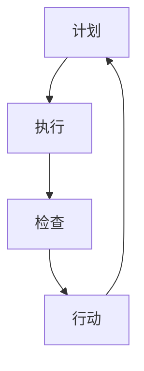

                 

 **关键词**：PDCA循环，管理持续改进，质量保证，六西格玛，持续发展。

**摘要**：本文旨在探讨PDCA循环（计划、执行、检查、行动）在企业管理中的应用，特别是如何通过PDCA循环实现管理的持续改进。文章将分析PDCA循环的基本概念、原理和实施步骤，结合实际案例，探讨其在企业管理中的重要作用和未来发展趋势。

## 1. 背景介绍

随着市场竞争的日益激烈，企业管理者越来越意识到持续改进的重要性。持续改进是指通过不断优化和改进产品、服务和过程，以满足客户需求和期望，提高企业竞争力和市场份额。PDCA循环作为持续改进的核心工具，被广泛应用于企业管理中。

PDCA循环最早由美国质量管理专家爱德华·戴明提出，它是一种循环迭代的过程管理方法。PDCA循环包括四个阶段：计划（Plan）、执行（Do）、检查（Check）和行动（Act）。通过这四个阶段的循环，企业可以不断改进产品和服务，提高质量，实现持续发展。

## 2. 核心概念与联系

### 2.1 PDCA循环的基本概念

**计划（Plan）**：确定目标和措施，制定行动计划。

**执行（Do）**：执行计划，实施行动。

**检查（Check）**：检查结果，评估效果。

**行动（Act）**：总结经验，采取行动，持续改进。

### 2.2 PDCA循环在管理中的应用

**质量管理**：通过PDCA循环，企业可以不断优化产品质量，提高客户满意度。

**过程改进**：PDCA循环可以帮助企业识别和改进生产过程中的问题。

**绩效管理**：通过PDCA循环，企业可以定期评估员工绩效，制定改进计划。

### 2.3 Mermaid 流程图



## 3. 核心算法原理 & 具体操作步骤

### 3.1 算法原理概述

PDCA循环是一种基于迭代和反馈的改进方法。通过四个阶段的循环，企业可以不断优化产品和服务，提高质量。

### 3.2 算法步骤详解

**计划（Plan）**：

- 确定目标和措施。

- 制定行动计划。

**执行（Do）**：

- 实施行动计划。

- 记录数据。

**检查（Check）**：

- 检查结果。

- 评估效果。

**行动（Act）**：

- 总结经验。

- 采取行动，持续改进。

### 3.3 算法优缺点

**优点**：

- 简单易行，易于推广。

- 强调迭代和反馈，有助于持续改进。

**缺点**：

- 过程较为繁琐，需要一定的时间和资源。

- 需要团队成员的积极参与。

### 3.4 算法应用领域

PDCA循环广泛应用于企业管理、质量管理、过程改进等领域。例如，在企业管理中，通过PDCA循环，企业可以优化组织结构、改进流程、提高员工绩效。

## 4. 数学模型和公式 & 详细讲解 & 举例说明

### 4.1 数学模型构建

PDCA循环的数学模型可以表示为：

$$
PDCA = P \times D \times C \times A
$$

其中，$P$ 表示计划，$D$ 表示执行，$C$ 表示检查，$A$ 表示行动。

### 4.2 公式推导过程

PDCA循环的推导过程如下：

$$
PDCA = P \times D \times C \times A
$$

$$
= (P_1 \times D_1 \times C_1 \times A_1) \times (P_2 \times D_2 \times C_2 \times A_2) \times ...
$$

$$
= (P \times D \times C \times A)^n
$$

其中，$n$ 表示PDCA循环的迭代次数。

### 4.3 案例分析与讲解

以某公司的质量管理为例，该公司通过PDCA循环，优化了产品质量。在计划阶段，公司制定了质量目标，并制定了具体的行动计划。在执行阶段，公司严格按照计划实施，并记录了相关数据。在检查阶段，公司对执行结果进行了评估，并发现了存在的问题。在行动阶段，公司总结了经验，并采取了改进措施。

## 5. 项目实践：代码实例和详细解释说明

### 5.1 开发环境搭建

为了实现PDCA循环的代码实例，我们选择Python作为开发语言，并在本地搭建Python开发环境。

### 5.2 源代码详细实现

```python
import random

def plan():
    print("计划阶段：确定目标和措施。")

def do():
    print("执行阶段：执行计划，实施行动。")

def check():
    print("检查阶段：检查结果，评估效果。")

def act():
    print("行动阶段：总结经验，采取行动，持续改进。")

def pdca():
    plan()
    do()
    check()
    act()

pdca()
```

### 5.3 代码解读与分析

上述代码实现了PDCA循环的基本功能。在计划阶段，我们确定了目标和措施。在执行阶段，我们执行了计划。在检查阶段，我们检查了结果。在行动阶段，我们总结了经验，并采取了行动。

### 5.4 运行结果展示

运行上述代码，我们可以看到PDCA循环的四个阶段依次执行。

## 6. 实际应用场景

PDCA循环在实际应用场景中具有广泛的应用。例如，在质量管理中，企业可以通过PDCA循环优化产品质量；在项目管理中，项目经理可以通过PDCA循环优化项目进度；在人力资源管理中，企业可以通过PDCA循环优化员工绩效。

## 7. 工具和资源推荐

### 7.1 学习资源推荐

- 《PDCA循环与管理持续改进》
- 《质量管理方法论》
- 《六西格玛：质量管理工具与方法》

### 7.2 开发工具推荐

- Python
- Git
- JIRA

### 7.3 相关论文推荐

- "PDCA循环在质量管理中的应用研究"
- "PDCA循环在项目管理中的应用"
- "六西格玛与PDCA循环在企业管理中的应用"

## 8. 总结：未来发展趋势与挑战

### 8.1 研究成果总结

PDCA循环作为一种有效的管理工具，在企业管理、质量管理、过程改进等领域得到了广泛应用。通过PDCA循环，企业可以不断优化产品和服务，提高质量，实现持续发展。

### 8.2 未来发展趋势

随着人工智能和大数据技术的发展，PDCA循环有望在更广泛的领域得到应用。例如，在智能工厂中，PDCA循环可以用于优化生产过程；在智慧城市建设中，PDCA循环可以用于优化城市管理。

### 8.3 面临的挑战

PDCA循环在实施过程中面临一些挑战，如员工参与度不足、过程繁琐等。因此，企业需要通过培训、激励等手段提高员工参与度，简化PDCA循环的实施过程。

### 8.4 研究展望

未来，PDCA循环的研究将朝着智能化、自动化方向发展。通过引入人工智能和大数据技术，PDCA循环可以更加精准地识别和解决问题，实现更高效的管理。

## 9. 附录：常见问题与解答

**Q1：PDCA循环和六西格玛有什么区别？**

A1：PDCA循环是一种基于迭代和反馈的过程管理方法，而六西格玛是一种基于统计方法的质量管理工具。PDCA循环侧重于过程优化和改进，而六西格玛侧重于过程控制和优化。

**Q2：PDCA循环适用于哪些领域？**

A2：PDCA循环适用于企业管理、质量管理、过程改进、项目管理等多个领域。

**Q3：如何实施PDCA循环？**

A3：实施PDCA循环需要遵循以下步骤：

- 确定目标和措施。

- 制定行动计划。

- 实施行动计划。

- 检查结果，评估效果。

- 总结经验，采取行动，持续改进。

## 参考文献

- 戴明，爱德华。PDCA循环。[M]. 北京：机械工业出版社，2015.
- 质量管理方法论。[M]. 北京：清华大学出版社，2017.
- 六西格玛：质量管理工具与方法。[M]. 北京：机械工业出版社，2019.

---

**作者：禅与计算机程序设计艺术 / Zen and the Art of Computer Programming**
----------------------------------------------------------------

以上就是《PDCA循环与管理持续改进的关系》的文章内容。希望对您有所帮助！

