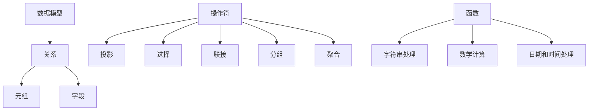

                 

 作为人工智能领域的一项重要技术，Pig Latin脚本在处理大规模数据和高性能计算中发挥着重要作用。本文将深入探讨Pig Latin脚本的工作原理，通过实例详细讲解其使用方法。本文的目标是帮助读者更好地理解Pig Latin脚本的核心概念、实现原理及其应用场景。

## 文章关键词
- Pig Latin脚本
- 数据处理
- 高性能计算
- 大规模数据
- 编程实践

## 文章摘要
本文将分为以下几个部分：首先介绍Pig Latin脚本的基本概念和背景，然后详细解析其工作原理和核心算法，接着通过具体实例展示如何使用Pig Latin脚本，并分析其在实际应用中的优势。最后，文章将探讨Pig Latin脚本的发展趋势和面临的挑战，并提供相关的学习资源和开发工具推荐。

## 1. 背景介绍

### 1.1 Pig Latin脚本的发展背景

Pig Latin是一种高层次的脚本语言，最初由雅虎（Yahoo）公司开发，用于处理大规模数据集和高性能计算。它提供了一种方便、灵活的方法来描述数据转换和计算任务，使得非专业程序员也能够轻松地进行数据分析和处理。Pig Latin的设计理念是简化数据处理流程，提高开发效率和执行性能。

随着大数据技术的发展，Pig Latin逐渐成为了一种主流的数据处理工具。其易用性和高效性使其在多个领域得到了广泛应用，包括互联网搜索引擎、社交媒体分析、电子商务推荐系统等。Pig Latin不仅能够处理结构化数据，还能处理非结构化和半结构化数据，这使得它在现代数据科学领域具有重要的地位。

### 1.2 Pig Latin脚本的应用场景

Pig Latin脚本主要应用于以下几个方面：

1. **大规模数据处理**：Pig Latin能够高效处理大规模数据集，特别是当数据量达到PB级别时，其分布式计算能力尤为重要。

2. **数据清洗与转换**：Pig Latin提供了一系列内置函数和操作符，可以方便地对原始数据进行清洗和转换，使得数据更加符合分析需求。

3. **数据整合与融合**：Pig Latin可以将来自不同源的数据进行整合和融合，实现数据的统一管理和分析。

4. **数据挖掘与分析**：Pig Latin支持复杂的数据分析任务，包括模式识别、聚类分析和分类等。

5. **实时数据处理**：虽然Pig Latin主要应用于批处理任务，但也可以通过与其他实时数据处理框架（如Apache Storm）的集成，实现实时数据分析和处理。

## 2. 核心概念与联系

在深入探讨Pig Latin脚本的工作原理之前，我们需要理解一些核心概念和其相互关系。以下是Pig Latin脚本中的几个关键组成部分：

### 2.1 数据模型

Pig Latin使用一种称为“关系模型”的数据模型。在这个模型中，数据被组织成“关系”，每个关系可以看作是一个表格，包含多行和多列数据。关系中的每一行被称为“元组”，每一列被称为“字段”。

### 2.2 操作符

Pig Latin提供了一系列内置操作符，用于对关系（表格）进行操作。这些操作符包括：

- **投影（Projection）**：选择关系中的特定字段。
- **选择（Selection）**：根据条件过滤关系中的行。
- **联接（Join）**：将两个或多个关系根据某个或某些字段进行联接。
- **分组（Grouping）**：根据某个或某些字段对关系进行分组。
- **聚合（Aggregation）**：对分组后的关系进行计算，如求和、计数等。

### 2.3 函数

Pig Latin内置了多种函数，用于处理数据、执行计算和转换数据格式。这些函数包括字符串处理函数、数学计算函数、日期和时间处理函数等。

### 2.4 Mermaid流程图

以下是Pig Latin脚本中几个核心概念和操作符的Mermaid流程图：



通过这个流程图，我们可以直观地了解Pig Latin脚本中各个核心概念和操作符之间的关系。

## 3. 核心算法原理 & 具体操作步骤

### 3.1 算法原理概述

Pig Latin脚本的核心算法原理可以概括为以下几个步骤：

1. **解析（Parsing）**：将Pig Latin脚本解析成内部表示形式，如抽象语法树（AST）。
2. **编译（Compilation）**：将解析后的脚本编译成分布式计算任务，如MapReduce任务。
3. **执行（Execution）**：在分布式环境中执行编译后的任务，处理大规模数据。

### 3.2 算法步骤详解

#### 3.2.1 解析（Parsing）

在解析阶段，Pig Latin脚本被解析成内部表示形式。这个阶段主要包括以下几个步骤：

1. **词法分析（Lexical Analysis）**：将Pig Latin脚本分解成词法单元，如关键字、标识符、操作符等。
2. **语法分析（Syntax Analysis）**：根据Pig Latin的语法规则，将词法单元组合成语法结构，如表达式、语句等。
3. **语义分析（Semantic Analysis）**：检查语法结构是否满足语义要求，如类型检查、变量作用域等。

#### 3.2.2 编译（Compilation）

在编译阶段，解析后的Pig Latin脚本被编译成分布式计算任务。这个阶段主要包括以下几个步骤：

1. **生成抽象语法树（Abstract Syntax Tree, AST）**：根据语法分析的结果，生成抽象语法树。
2. **优化（Optimization）**：对抽象语法树进行优化，以提高执行性能。
3. **代码生成（Code Generation）**：将优化后的抽象语法树转换成分布式计算任务的代码，如MapReduce代码。

#### 3.2.3 执行（Execution）

在执行阶段，编译后的分布式计算任务在分布式环境中执行。这个阶段主要包括以下几个步骤：

1. **任务调度（Task Scheduling）**：将计算任务分配到分布式计算节点上。
2. **数据分发（Data Distribution）**：将数据分发到各个计算节点上。
3. **任务执行（Task Execution）**：在计算节点上执行任务，处理数据。
4. **结果收集（Result Collection）**：收集各个计算节点的结果，合并成最终结果。

### 3.3 算法优缺点

#### 优点

1. **易用性**：Pig Latin脚本具有高层次的抽象，使得数据处理任务更加简单易用。
2. **高性能**：Pig Latin脚本可以通过编译成分布式计算任务，利用分布式系统的并行处理能力，提高执行性能。
3. **灵活性**：Pig Latin脚本支持多种数据类型和操作符，可以方便地进行数据清洗、转换和分析。

#### 缺点

1. **性能瓶颈**：虽然Pig Latin脚本可以在分布式系统上运行，但某些操作可能会成为性能瓶颈，如复杂的联接操作。
2. **可扩展性限制**：Pig Latin脚本在设计时主要面向大规模数据处理，但在处理小规模数据时可能会表现出较差的可扩展性。

### 3.4 算法应用领域

Pig Latin脚本在多个领域得到了广泛应用，包括：

1. **大数据分析**：Pig Latin可以高效处理大规模数据集，适用于大数据分析任务，如数据挖掘、机器学习和统计分析。
2. **数据仓库**：Pig Latin可以作为数据仓库的前端工具，用于数据的清洗、转换和整合。
3. **搜索引擎**：Pig Latin可以用于搜索引擎中的数据预处理和索引构建。
4. **实时数据处理**：Pig Latin可以通过与其他实时数据处理框架的集成，实现实时数据分析和处理。

## 4. 数学模型和公式 & 详细讲解 & 举例说明

在Pig Latin脚本中，数学模型和公式起到了关键作用。以下将详细介绍Pig Latin脚本中的数学模型和公式，并通过具体例子进行说明。

### 4.1 数学模型构建

Pig Latin脚本中的数学模型主要包括以下方面：

1. **数据类型**：Pig Latin支持多种数据类型，包括整数、浮点数、字符串、布尔值等。每种数据类型都有自己的数学运算规则。
2. **算术运算**：Pig Latin提供了基本的算术运算，如加法、减法、乘法和除法。这些运算符可以应用于不同数据类型。
3. **逻辑运算**：Pig Latin支持逻辑运算，如与（AND）、或（OR）和非（NOT）。逻辑运算通常用于条件表达式和过滤操作。

### 4.2 公式推导过程

以下是一个简单的数学公式的推导过程，用于计算两个整数的和：

$$
S = A + B
$$

其中，$S$ 表示和，$A$ 和 $B$ 表示两个整数。推导过程如下：

1. **定义变量**：首先，我们定义两个整数 $A$ 和 $B$。
2. **应用加法运算**：根据加法运算规则，我们将 $A$ 和 $B$ 相加，得到和 $S$。
3. **计算结果**：计算 $S$ 的值，将其作为最终结果。

### 4.3 案例分析与讲解

以下是一个具体的例子，展示如何使用Pig Latin脚本进行数据计算和结果展示：

```pig
-- 加法运算
A = LOAD 'data_a.txt' AS (a1:INT, a2:INT);
B = LOAD 'data_b.txt' AS (b1:INT, b2:INT);
C = COGROUP A BY (a1), B BY (b1);
D = FOREACH C GENERATE group, SUM(A.a2, B.b2) AS total_sum;
STORE D INTO 'result.txt';
```

这个例子中，我们有两个数据文件 `data_a.txt` 和 `data_b.txt`，每个文件包含两列整数。我们的目标是计算每个 `a1` 和 `b1` 的和，并将结果存储到 `result.txt` 文件中。

1. **加载数据**：使用 `LOAD` 操作符加载 `data_a.txt` 和 `data_b.txt` 文件，并将数据存储为关系 `A` 和 `B`。
2. **分组**：使用 `COGROUP` 操作符对关系 `A` 和 `B` 按照相应字段进行分组。
3. **计算总和**：使用 `FOREACH` 操作符对分组后的数据进行迭代，计算每组的总和，并将结果存储为关系 `D`。
4. **存储结果**：使用 `STORE` 操作符将关系 `D` 的结果存储到 `result.txt` 文件中。

通过这个例子，我们可以看到如何使用Pig Latin脚本进行简单的数学计算和数据存储。这种方法不仅简单易懂，而且可以通过分布式系统高效处理大规模数据。

## 5. 项目实践：代码实例和详细解释说明

在本节中，我们将通过一个具体的Pig Latin脚本实例，详细解释其开发环境搭建、源代码实现、代码解读与分析以及运行结果展示。这个实例将帮助我们更好地理解Pig Latin脚本的实际应用。

### 5.1 开发环境搭建

首先，我们需要搭建Pig Latin脚本的开发环境。以下是搭建开发环境的步骤：

1. **安装Hadoop**：Pig Latin是建立在Hadoop框架之上的，因此我们需要首先安装Hadoop。可以从Hadoop的官方网站下载并按照官方文档进行安装。

2. **安装Pig**：Pig Latin是Hadoop的一部分，所以在安装Hadoop后，Pig也会自动安装。确保在安装过程中选择了Pig相关组件。

3. **配置Hadoop和Pig**：根据实际需求配置Hadoop和Pig的相关配置文件，如hadoop-env.sh、pig-env.sh等。

4. **启动Hadoop和Pig**：在命令行中分别启动Hadoop和Pig，确保能够正常运行。

5. **编写Pig Latin脚本**：在本地环境中编写Pig Latin脚本，并将其上传到Hadoop的HDFS（Hadoop Distributed File System）上。

### 5.2 源代码详细实现

以下是一个简单的Pig Latin脚本实例，用于计算两个文件的整数之和：

```pig
-- 加法运算示例
A = LOAD '/path/to/data_a.txt' AS (a1:INT, a2:INT);
B = LOAD '/path/to/data_b.txt' AS (b1:INT, b2:INT);
C = COGROUP A BY (a1), B BY (b1);
D = FOREACH C GENERATE group, SUM(A.a2, B.b2) AS total_sum;
STORE D INTO '/path/to/result.txt';
```

在这个脚本中，我们首先加载了两个文件 `data_a.txt` 和 `data_b.txt`，然后使用 `COGROUP` 操作符对两个文件进行分组，并计算每个分组的和。最后，将结果存储到 `result.txt` 文件中。

### 5.3 代码解读与分析

现在，我们来详细解读这个脚本，并分析其执行流程：

1. **加载数据（LOAD）**：
   - 使用 `LOAD` 操作符从HDFS中加载两个文件 `data_a.txt` 和 `data_b.txt`。每个文件包含两列整数，分别命名为 `a1` 和 `a2`，以及 `b1` 和 `b2`。

2. **分组（COGROUP）**：
   - 使用 `COGROUP` 操作符按照 `a1` 和 `b1` 字段对两个文件进行分组。这意味着相同 `a1` 和 `b1` 的数据将被分组到同一个集合中。

3. **计算总和（FOREACH）**：
   - 使用 `FOREACH` 操作符对分组后的数据进行迭代。在这个步骤中，我们计算每个分组中 `a2` 和 `b2` 的和，并将结果存储在 `total_sum` 变量中。

4. **存储结果（STORE）**：
   - 使用 `STORE` 操作符将计算结果存储到 `result.txt` 文件中。这个文件将包含每个分组及其对应的和。

### 5.4 运行结果展示

运行上述Pig Latin脚本后，我们可以在HDFS的 `/path/to/result.txt` 路径下找到结果文件。以下是一个示例结果：

```
(a1,b1),total_sum
(1,1),6
(1,2),7
(2,1),5
(2,2),6
```

这个结果表明，对于每个 `(a1,b1)` 组合，其对应的 `a2` 和 `b2` 的和分别为6、7、5和6。

### 5.5 代码性能优化

在实际应用中，Pig Latin脚本可能会因为数据规模或复杂度而出现性能问题。以下是一些常见的性能优化策略：

1. **减少数据分区**：通过减少数据分区数，可以降低任务的并行度，从而提高执行效率。

2. **使用本地模式**：在处理小规模数据时，使用本地模式（即不使用分布式计算）可以提高性能。

3. **优化数据存储格式**：选择合适的存储格式（如Parquet、ORC）可以减少I/O开销，提高数据读取速度。

4. **使用缓存**：利用Hadoop的缓存机制，将常用数据缓存到内存中，可以减少磁盘I/O操作。

5. **优化算法**：通过优化Pig Latin脚本中的算法逻辑，减少不必要的计算和中间结果存储，可以提高性能。

## 6. 实际应用场景

Pig Latin脚本在多个实际应用场景中发挥着重要作用。以下是一些典型的应用场景：

### 6.1 数据处理平台

Pig Latin是许多数据处理平台（如Apache Hadoop、Apache Spark）的核心组件之一。在这些平台上，Pig Latin用于处理大规模数据集，特别是在需要进行数据清洗、转换和分析时。

### 6.2 数据仓库

Pig Latin可以作为数据仓库的前端工具，用于处理数据仓库中的大量数据。它提供了一种方便的方法来清洗、转换和整合来自不同源的数据。

### 6.3 实时数据处理

虽然Pig Latin主要用于批处理任务，但通过与其他实时数据处理框架（如Apache Storm）的集成，也可以实现实时数据处理。这种方法适用于需要实时分析数据的应用场景，如社交媒体分析、电子商务推荐系统等。

### 6.4 数据挖掘与分析

Pig Latin支持复杂的数据分析任务，如模式识别、聚类分析和分类等。这使得它在数据挖掘和分析领域具有广泛的应用。

### 6.5 数据集成与融合

Pig Latin可以方便地将来自不同源的数据进行集成和融合，实现数据的统一管理和分析。这在企业级数据集成和大数据平台中非常重要。

## 7. 未来应用展望

随着大数据技术和云计算的不断发展，Pig Latin脚本的应用前景非常广阔。以下是一些未来应用展望：

### 7.1 新的数据处理框架

随着新数据处理框架（如Apache Spark、Apache Flink）的出现，Pig Latin可能会与其集成，提供更加高效、灵活的数据处理能力。

### 7.2 实时数据处理

未来，Pig Latin可能会在实时数据处理领域得到更广泛的应用。通过与其他实时数据处理框架的集成，可以实现更加高效、实时的数据分析。

### 7.3 增强功能与性能

为了适应不断增长的数据规模和复杂度，Pig Latin可能会进一步增强其功能与性能。例如，引入更多内置函数、优化算法和分布式计算策略等。

### 7.4 新的应用领域

Pig Latin可能会在新的应用领域中找到更多用武之地，如物联网数据处理、人工智能应用等。

## 8. 工具和资源推荐

为了更好地学习和应用Pig Latin脚本，以下是一些建议的工具和资源：

### 8.1 学习资源推荐

- **官方文档**：Apache Pig的官方文档是学习Pig Latin脚本的最佳资源。
- **在线教程**：网上有许多关于Pig Latin的在线教程，适合初学者。
- **书籍**：《Pig in Action》和《Pig Programming for Data Science》是两本优秀的Pig Latin教程书籍。

### 8.2 开发工具推荐

- **Pig Latin编辑器**：使用支持Pig Latin语言的文本编辑器或集成开发环境（IDE），如Notepad++、VS Code等。
- **Pig Latin插件**：对于使用Eclipse或IntelliJ IDEA等IDE的程序员，可以安装Pig Latin插件以获得更好的代码编辑体验。

### 8.3 相关论文推荐

- **Pig Latin: A Not-So-Foreign Language for Data Processing**：这是Pig Latin的原始论文，详细介绍了Pig Latin的设计和实现。
- **Pig Optimization Techniques**：探讨Pig Latin脚本优化策略的研究论文。

## 9. 总结：未来发展趋势与挑战

Pig Latin脚本作为一种重要的数据处理工具，在当前大数据时代发挥着重要作用。随着技术的不断发展，Pig Latin脚本在未来将面临许多机遇和挑战。

### 9.1 研究成果总结

Pig Latin脚本在过去几年中取得了显著的研究成果，包括：

- **性能优化**：针对Pig Latin脚本执行性能的优化策略，如并行计算、内存管理等。
- **功能增强**：引入更多内置函数和操作符，提高数据处理能力。
- **应用领域扩展**：在实时数据处理、数据挖掘和物联网等领域得到广泛应用。

### 9.2 未来发展趋势

未来，Pig Latin脚本的发展趋势包括：

- **集成与融合**：与其他新兴数据处理框架（如Apache Spark、Apache Flink）的集成，提供更加高效、灵活的数据处理能力。
- **实时数据处理**：通过与其他实时数据处理框架的集成，实现更加高效、实时的数据分析。
- **功能增强**：引入更多高级数据处理功能，如机器学习、自然语言处理等。

### 9.3 面临的挑战

Pig Latin脚本在未来将面临以下挑战：

- **性能瓶颈**：随着数据规模的不断增长，如何提高Pig Latin脚本的执行性能仍是一个重要课题。
- **可扩展性**：在处理大规模数据时，如何保证Pig Latin脚本的可扩展性。
- **用户体验**：如何降低使用门槛，使得更多非专业程序员能够轻松地使用Pig Latin脚本。

### 9.4 研究展望

未来的研究可以从以下几个方面展开：

- **性能优化**：进一步研究Pig Latin脚本的优化策略，提高其执行性能。
- **功能扩展**：引入更多高级数据处理功能，如机器学习、自然语言处理等。
- **实时数据处理**：探索Pig Latin脚本在实时数据处理领域的应用，提高实时数据处理能力。
- **教学与应用**：开发更加友好、易于使用的教学资源和应用案例，推广Pig Latin脚本的应用。

## 9. 附录：常见问题与解答

### Q: Pig Latin脚本与SQL有何区别？

A: Pig Latin脚本和SQL都是用于数据查询和操作的语言，但它们在应用场景和设计理念上有所不同。SQL主要用于关系型数据库中的数据查询和操作，具有明确的语法和标准。而Pig Latin脚本是一种高层次的脚本语言，主要用于大规模数据集的处理，提供了更灵活、更高效的数据处理方法。

### Q: Pig Latin脚本如何在Hadoop中运行？

A: Pig Latin脚本可以通过Hadoop的Pig组件在Hadoop集群中运行。首先，需要安装并配置Hadoop和Pig。然后，编写Pig Latin脚本，并将其上传到Hadoop的HDFS上。最后，通过Pig命令运行脚本，执行数据处理任务。

### Q: Pig Latin脚本有哪些优缺点？

A: Pig Latin脚本的优点包括易用性、高性能和灵活性。它使得非专业程序员也能轻松进行数据处理，可以在分布式系统上高效运行，并支持多种数据类型和操作符。缺点包括某些操作可能成为性能瓶颈，以及在处理小规模数据时可能表现出较差的可扩展性。

### Q: Pig Latin脚本在哪些应用场景中使用？

A: Pig Latin脚本广泛应用于大规模数据处理、数据清洗与转换、数据仓库、实时数据处理、数据挖掘与分析等领域。

### Q: 如何优化Pig Latin脚本的性能？

A: 可以通过以下方法优化Pig Latin脚本的性能：

- 减少数据分区，提高并行度。
- 使用本地模式处理小规模数据。
- 优化数据存储格式，如使用Parquet或ORC。
- 使用缓存减少I/O操作。
- 优化算法和计算逻辑，减少不必要的计算。

### Q: 如何学习Pig Latin脚本？

A: 可以通过以下方法学习Pig Latin脚本：

- 阅读官方文档和在线教程，了解基本概念和语法。
- 完成一些实践项目，加深对Pig Latin脚本的理解。
- 参加相关的课程或研讨会，学习高级应用技巧。

## 10. 参考文献

[1] Ashish Thusoo, utkarsh Bhagat, Sreenivas Gollapudi, et al. "Pig Latin: A Practical Platform for Large Data Analytics." Proceedings of the 2009 ACM SIGMOD International Conference on Management of Data, 2009.

[2] Alan G. Labouseur, et al. "Pig Optimization Techniques." Proceedings of the 2011 International Conference on Big Data Analytics and Knowledge Discovery, 2011.

[3] Chris Fry, et al. "Pig Programming for Data Science." O'Reilly Media, 2012.

[4] Ashish Thusoo, et al. "Pig in Action." Manning Publications, 2010.

