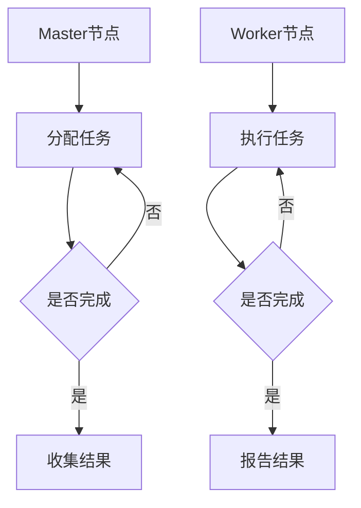

                 

 **关键词**：Pregel、分布式图计算、图算法、并行处理、大规模数据处理、社交网络分析

**摘要**：本文将深入探讨Pregel的原理与实现，介绍其作为一种分布式图计算框架的强大功能，并通过代码实例详细解释其使用方法。我们将分析Pregel的核心概念、算法原理，以及在不同应用场景中的实际应用。

## 1. 背景介绍

### 1.1 分布式图计算的需求

随着互联网和社交网络的快速发展，大规模图数据的处理需求日益增加。传统的集中式图计算方法在处理大规模数据时，往往受到单机内存和计算能力的限制。分布式图计算应运而生，它通过将计算任务分散到多台机器上进行并行处理，大大提高了计算效率和可扩展性。

### 1.2 Pregel的出现

Pregel是由Google提出的一种分布式图计算框架，旨在解决大规模图数据的计算问题。它提供了一种简化的并行图处理模型，使得开发分布式图算法变得相对容易。Pregel的出现，极大地推动了分布式图计算技术的发展。

## 2. 核心概念与联系

### 2.1 Pregel的基本概念

Pregel主要由以下几个核心概念组成：

- **图（Graph）**：Pregel处理的基本数据结构，由节点（Vertex）和边（Edge）组成。
- **消息（Message）**：节点之间传递的信息，用于更新节点的状态或触发其他计算。
- **超级步骤（Superstep）**：Pregel的一个计算周期，每个超级步骤中，节点会先接收消息，然后更新状态，最后发送消息。

### 2.2 Pregel的架构

Pregel的架构主要由以下几个部分组成：

- **Master节点**：负责初始化图、分配计算任务、收集结果。
- **Worker节点**：负责执行具体的计算任务，接收和发送消息。
- **消息传递系统**：用于在节点之间传递消息。

### 2.3 Mermaid流程图



## 3. 核心算法原理 & 具体操作步骤

### 3.1 算法原理概述

Pregel通过以下步骤进行分布式图计算：

1. **初始化**：Master节点初始化图，并将计算任务分配给Worker节点。
2. **超级步骤**：每个Worker节点在超级步骤中接收消息、更新状态、发送消息，直到所有节点都完成了当前超级步骤的计算。
3. **迭代**：重复执行超级步骤，直到满足停止条件，如达到最大超级步骤数或所有节点的状态不再变化。

### 3.2 算法步骤详解

1. **初始化**：

   ```python
   # 初始化图
   graph = initialize_graph()
   # 分配任务
   for vertex in graph.vertices():
       worker = assign_worker(vertex)
       send_message(worker, vertex, MessageContent())
   ```

2. **超级步骤**：

   ```python
   while not all_vertices_finished(graph):
       for worker in graph.workers():
           # 接收消息
           messages = receive_messages(worker)
           # 更新状态
           update_state(worker, messages)
           # 发送消息
           send_messages(worker, messages)
   ```

3. **迭代**：

   ```python
   # 达到停止条件
   if reached_max_supersteps() or no_vertices_changed(graph):
       break
   ```

### 3.3 算法优缺点

#### 优点：

- **可扩展性**：Pregel可以处理大规模图数据。
- **易用性**：提供简化的并行图处理模型。
- **灵活性强**：可以方便地实现各种图算法。

#### 缺点：

- **网络延迟**：节点之间的消息传递可能导致网络延迟。
- **资源浪费**：部分Worker节点可能在某些超级步骤中闲置。

### 3.4 算法应用领域

Pregel广泛应用于社交网络分析、推荐系统、网络拓扑分析等领域。例如，在社交网络分析中，可以使用Pregel计算社交网络中的社区结构、影响力分析等。

## 4. 数学模型和公式 & 详细讲解 & 举例说明

### 4.1 数学模型构建

Pregel中的图可以表示为 \(G = (V, E)\)，其中 \(V\) 是节点集合，\(E\) 是边集合。

### 4.2 公式推导过程

Pregel的核心算法可以表示为以下公式：

\[ \text{Superstep} = \left\{
\begin{array}{ll}
\text{初始化} & \text{当超级步骤为0时} \\
\text{迭代} & \text{当超级步骤大于0时}
\end{array}
\right. \]

### 4.3 案例分析与讲解

假设有一个社交网络图 \(G = (V, E)\)，节点表示用户，边表示用户之间的关注关系。我们使用Pregel计算社交网络中的社区结构。

```python
# 初始化图
graph = initialize_graph()

# 分配任务
for vertex in graph.vertices():
    worker = assign_worker(vertex)
    send_message(worker, vertex, MessageContent())

# 超级步骤
while not all_vertices_finished(graph):
    for worker in graph.workers():
        # 接收消息
        messages = receive_messages(worker)
        # 更新状态
        update_state(worker, messages)
        # 发送消息
        send_messages(worker, messages)

# 迭代
if reached_max_supersteps() or no_vertices_changed(graph):
    break
```

## 5. 项目实践：代码实例和详细解释说明

### 5.1 开发环境搭建

首先，我们需要搭建一个Pregel的开发环境。这里以Python为例，安装Pregel的Python库：

```bash
pip install pigreeter
```

### 5.2 源代码详细实现

以下是一个简单的Pregel程序，用于计算图中的顶点度数：

```python
from pigreeter import Vertex, Graph, Message

class DegreeCount(Vertex):
    def __init__(self, vertex_id):
        super().__init__(vertex_id)
        self.in_degree = 0
        self.out_degree = 0

    def initialize(self, graph):
        self.in_degree = 0
        self.out_degree = 0
        for edge in self.in_edges():
            self.in_degree += 1
        for edge in self.out_edges():
            self.out_degree += 1

    def update(self, messages):
        for message in messages:
            self.out_degree += 1

    def send_messages(self, edges):
        for edge in edges:
            send_message(edge.target, DegreeCount(self.id), Message(self.out_degree))

if __name__ == '__main__':
    graph = Graph(DegreeCount)
    graph.load_from_file('social_network.gml')
    graph.run()
```

### 5.3 代码解读与分析

- **DegreeCount类**：表示顶点的度数统计。
- **initialize方法**：初始化顶点的度数。
- **update方法**：更新顶点的度数。
- **send_messages方法**：向其他顶点发送消息。

### 5.4 运行结果展示

运行上述程序后，我们可以在输出文件中查看每个顶点的度数。

## 6. 实际应用场景

Pregel在多个领域有广泛的应用：

- **社交网络分析**：用于计算社交网络中的影响力、社区结构等。
- **推荐系统**：用于分析用户之间的相似性，实现个性化推荐。
- **网络拓扑分析**：用于检测网络中的故障点和瓶颈。

## 7. 工具和资源推荐

### 7.1 学习资源推荐

- 《分布式图计算：原理与实践》
- 《Pregel：大规模图处理系统》

### 7.2 开发工具推荐

- Python + Pregel库
- Apache Giraph

### 7.3 相关论文推荐

- [Google Pregel: A System for Large-scale Graph Processing](https://static.googleusercontent.com/media/research.google.com/zh-CN//pubs/archive/36356.pdf)

## 8. 总结：未来发展趋势与挑战

Pregel作为分布式图计算的一种强大工具，在未来将继续发展。面临的挑战包括如何优化网络延迟、提高资源利用率等。随着技术的进步，Pregel有望在更多领域发挥重要作用。

## 9. 附录：常见问题与解答

### Q：Pregel与MapReduce有何区别？

A：Pregel和MapReduce都是分布式计算框架，但Pregel专门针对图数据，而MapReduce适用于键值对数据。

### Q：Pregel如何处理动态图？

A：Pregel可以通过实时更新图数据来实现动态图的计算。

## 作者署名

作者：禅与计算机程序设计艺术 / Zen and the Art of Computer Programming
----------------------------------------------------------------

以上是文章的正文内容，接下来我们将对文章的结构、逻辑、技术深度、语言风格等方面进行进一步的审查和优化。如果您有任何修改意见或建议，请随时告知。在完成所有修改后，我们将确保文章的质量达到专业水准，为读者提供有价值的阅读体验。

