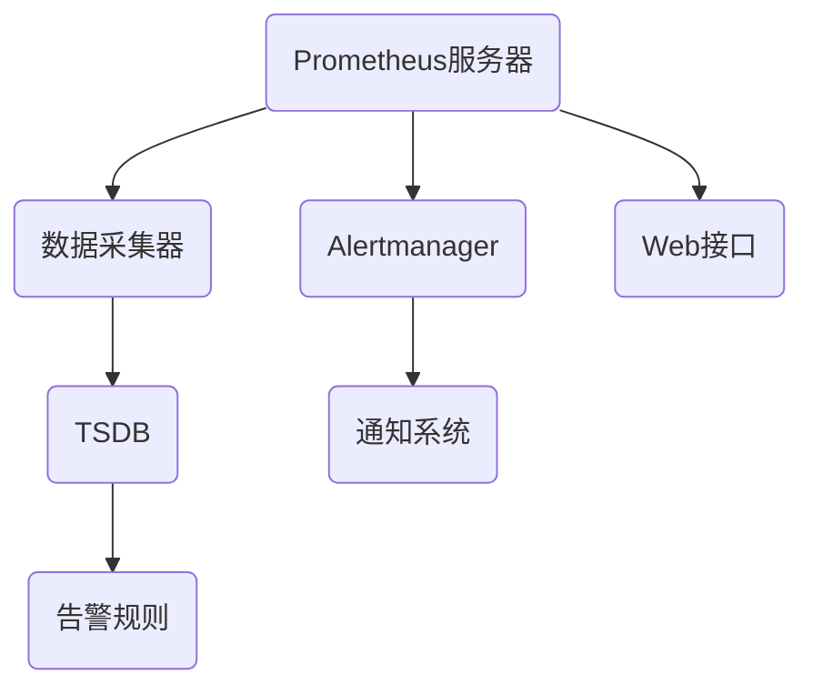

                 

关键词：Prometheus，监控，告警配置，优化，技术博客，深度思考，架构设计，算法原理，数学模型，项目实践，代码实例，应用场景，未来展望。

## 摘要

本文旨在探讨如何优化Prometheus监控系统的告警配置。Prometheus是一个开源监控解决方案，以其高度可扩展性和灵活性在IT运维领域广受欢迎。然而，很多用户在配置告警时往往感到困惑，未能充分发挥其监控能力。本文将深入剖析Prometheus告警配置的各个方面，包括核心概念、算法原理、数学模型、具体操作步骤、项目实践和实际应用场景，并提出一系列优化策略。通过阅读本文，读者将能够掌握如何高效地配置Prometheus告警，提升系统的监控能力和可靠性。

## 1. 背景介绍

### Prometheus概述

Prometheus是一个开源系统监控解决方案，由SoundCloud的工程师在2012年开发。它旨在提供一个高效、灵活且易于扩展的监控平台。Prometheus的核心组件包括数据采集器（exporters）、Prometheus服务器、告警管理器（Alertmanager）以及Web接口。其数据存储采用时间序列数据库（TSDB），能够高效处理大量的监控数据。

### 监控和告警的重要性

在现代IT系统中，监控和告警机制是确保系统稳定运行的关键。监控能够实时监测系统的状态，收集性能指标、日志等数据，而告警则是在监测到异常情况时及时通知相关人员。通过有效的监控和告警，可以迅速发现和解决问题，防止小问题演变成大故障。

### Prometheus告警配置的现状

尽管Prometheus在监控领域有着广泛的应用，但在实际配置告警时，很多用户会遇到以下问题：

1. **告警阈值设置不合适**：阈值设置过高或过低都会影响监控效果。
2. **告警规则复杂**：复杂的告警规则难以维护和理解。
3. **告警通知不精准**：通知的方式和内容不明确，导致信息过载或信息不足。
4. **告警误报和漏报**：误报会影响运维人员的响应速度，而漏报则可能导致故障未被及时发现。

## 2. 核心概念与联系

### Prometheus架构

首先，我们需要了解Prometheus的基本架构。下图展示了Prometheus的核心组件及其相互关系。



#### Prometheus服务器

Prometheus服务器负责从数据采集器中接收监控数据，将其存储到TSDB中，并处理告警规则。它还提供了一个Web接口，用于浏览和查询监控数据。

#### 数据采集器

数据采集器（exporter）是Prometheus监控数据的主要来源。它们可以是运行在目标系统上的程序，负责定期向Prometheus服务器发送监控数据。

#### 时间序列数据库（TSDB）

Prometheus使用TSDB来存储监控数据。TSDB的特点是能够高效存储和查询大量时间序列数据。

#### 告警管理器（Alertmanager）

Alertmanager负责处理Prometheus服务器发送的告警，并将其通知给相关人员。它支持多种通知渠道，如电子邮件、SMS、Webhook等。

#### 告警规则

告警规则是Prometheus监控的核心。它们定义了监控目标和告警条件。当监控数据满足特定条件时，Prometheus会生成告警并将其发送给Alertmanager。

### 告警规则的定义

告警规则通常由以下部分组成：

1. **记录名称**：标识监控数据的名称。
2. **指标类型**：监控数据的类型，如计数器、Gauge、分布等。
3. **表达式**：定义告警条件的表达式，通常包含比较运算符（如>、<、==）和阈值。
4. **告警动作**：当触发告警时，执行的操作，如发送通知。

一个典型的告警规则可能如下所示：

```yaml
groups:
- name: example-alerts
  rules:
  - alert: HighRequestLatency
    expr: request_duration_seconds > 5
    for: 1m
    labels:
      severity: high
    annotations:
      summary: "High request latency"
      description: "The request latency is above 5 seconds."
```

在这个例子中，当请求延迟超过5秒且持续1分钟时，会触发一个级别为“high”的告警，并包含简短和详细的描述。

## 3. 核心算法原理 & 具体操作步骤

### 3.1 算法原理概述

Prometheus告警配置的核心在于其告警规则的实现。这些规则基于PromQL（Prometheus查询语言），是一种用于查询和操作监控数据的声明式语言。

#### 告警规则的工作原理

1. **数据采集**：Prometheus从数据采集器中收集监控数据。
2. **数据存储**：收集到的数据被存储在TSDB中。
3. **查询与评估**：Prometheus服务器定期评估告警规则，检查监控数据是否满足告警条件。
4. **告警处理**：当监控数据满足告警条件时，Prometheus会生成告警，并将其发送给Alertmanager。
5. **通知与记录**：Alertmanager负责处理告警，并通过指定的通知渠道通知相关人员。

### 3.2 算法步骤详解

#### 第一步：定义告警规则

告警规则的定义通常包含以下步骤：

1. **选择监控指标**：确定要监控的指标，如请求延迟、内存使用率等。
2. **设置阈值**：根据业务需求设置合理的阈值，如请求延迟大于5秒。
3. **定义时间范围**：指定评估告警条件的时间范围，如1分钟或5分钟。
4. **配置告警动作**：定义告警触发后要执行的操作，如发送通知。

#### 第二步：配置告警规则

告警规则通过Prometheus配置文件定义，配置文件通常包含以下内容：

1. **告警组**：定义一组相关的告警规则。
2. **告警规则**：具体的告警规则，包括监控指标、阈值、时间范围和告警动作。

以下是一个简单的告警规则配置示例：

```yaml
groups:
- name: example-alerts
  rules:
  - alert: HighRequestLatency
    expr: request_duration_seconds > 5
    for: 1m
    labels:
      severity: high
    annotations:
      summary: "High request latency"
      description: "The request latency is above 5 seconds."
```

#### 第三步：配置Alertmanager

Alertmanager负责处理告警，并通知相关人员。其配置文件通常包含以下内容：

1. **接收器**：定义通知渠道，如电子邮件、SMS、Webhook等。
2. **路由规则**：定义告警路由规则，将不同类型的告警发送到不同的接收器。
3. **静默期**：定义在特定时间段内忽略特定告警的能力。

以下是一个简单的Alertmanager配置示例：

```yaml
route:
  receiver: email-receiver
  matchers:
    - name: example-service
      team: example-team
receivers:
- name: email-receiver
  email_configs:
  - to: admin@example.com
```

### 3.3 算法优缺点

#### 优点

1. **高度可扩展性**：Prometheus支持大规模部署，能够处理大量监控数据。
2. **灵活性**：告警规则基于PromQL，允许用户灵活定义复杂的告警条件。
3. **集成度高**：Prometheus与Kubernetes等流行容器编排系统紧密集成。

#### 缺点

1. **配置复杂性**：告警规则配置复杂，需要一定的学习和实践经验。
2. **依赖外部服务**：Alertmanager等组件需要与其他服务（如邮件服务器）集成。

### 3.4 算法应用领域

Prometheus告警配置广泛应用于以下领域：

1. **云服务监控**：监控云服务性能和资源使用情况。
2. **容器化应用监控**：监控容器化应用的性能和稳定性。
3. **数据中心监控**：监控数据中心的关键基础设施，如网络设备、存储设备等。

## 4. 数学模型和公式 & 详细讲解 & 举例说明

### 4.1 数学模型构建

Prometheus告警配置中的核心是告警规则的数学模型。这个模型主要包括以下几个部分：

1. **指标收集**：通过Prometheus的数据采集器收集系统性能指标数据。
2. **阈值设定**：设定阈值以确定何时触发告警。
3. **时间范围**：设定时间范围以评估告警条件。
4. **触发条件**：根据收集的数据和设定的阈值，判断是否触发告警。

### 4.2 公式推导过程

为了更清楚地理解告警规则的数学模型，我们可以用一个简单的例子来说明。

假设我们监控一个Web服务，该服务的响应时间（request_duration_seconds）是我们关注的指标。我们希望当响应时间超过5秒时触发告警。

告警规则表达式为：

$$
\text{request_duration_seconds} > 5
$$

这里，$$\text{request_duration_seconds}$$代表响应时间，$$5$$是阈值。

### 4.3 案例分析与讲解

#### 案例一：响应时间告警

我们使用一个实际案例来展示如何使用数学模型来构建告警规则。

**目标**：监控Web服务的响应时间，当响应时间超过5秒时触发告警。

**步骤**：

1. **收集数据**：Prometheus的数据采集器会定期从Web服务收集响应时间数据。
2. **设定阈值**：我们设定阈值$$5$$秒作为触发告警的条件。
3. **评估条件**：Prometheus服务器会定期检查响应时间是否超过5秒，并记录连续超过阈值的时间。
4. **触发告警**：如果响应时间连续超过5秒1分钟，则触发告警。

**公式**：

$$
\text{request_duration_seconds} > 5 \quad \text{for} \quad 1m
$$

这里，“for 1m”表示在1分钟内连续超过阈值5秒才会触发告警。

#### 案例二：内存使用率告警

**目标**：监控Web服务的内存使用率，当内存使用率超过80%时触发告警。

**步骤**：

1. **收集数据**：Prometheus的数据采集器会定期从Web服务收集内存使用率数据。
2. **设定阈值**：我们设定阈值$$80\%$$作为触发告警的条件。
3. **评估条件**：Prometheus服务器会定期检查内存使用率是否超过80%，并记录连续超过阈值的时间。
4. **触发告警**：如果内存使用率连续超过80%5分钟，则触发告警。

**公式**：

$$
\text{mem_usage_percentage} > 80\% \quad \text{for} \quad 5m
$$

这里，“for 5m”表示在5分钟内连续超过阈值80%才会触发告警。

## 5. 项目实践：代码实例和详细解释说明

### 5.1 开发环境搭建

在进行Prometheus监控告警配置优化之前，我们需要搭建一个基础的Prometheus监控环境。以下步骤将引导您完成环境搭建：

1. **安装Prometheus**：从[Prometheus官方网站](https://prometheus.io/download/)下载最新版本的Prometheus二进制文件，并解压到适当的位置。

2. **安装Prometheus配置文件**：下载并配置Prometheus的配置文件（prometheus.yml），该文件定义了数据采集器、目标地址、告警规则等信息。

3. **启动Prometheus**：使用以下命令启动Prometheus服务：

```bash
./prometheus --config.file=/path/to/prometheus.yml
```

4. **安装Alertmanager**：从[Alertmanager官方网站](https://github.com/prometheus/alertmanager/releases)下载最新版本的Alertmanager二进制文件，并解压到适当的位置。

5. **安装Alertmanager配置文件**：下载并配置Alertmanager的配置文件（alertmanager.yml），该文件定义了接收器、路由规则、静默期等信息。

6. **启动Alertmanager**：使用以下命令启动Alertmanager服务：

```bash
./alertmanager --config.file=/path/to/alertmanager.yml
```

7. **安装数据采集器**：在目标服务器上安装相应的数据采集器，如HTTP exporter、MySQL exporter等。这些采集器会定期向Prometheus服务器发送监控数据。

### 5.2 源代码详细实现

以下是一个简单的Prometheus告警配置示例，包括Prometheus配置文件（prometheus.yml）和Alertmanager配置文件（alertmanager.yml）：

#### Prometheus配置文件（prometheus.yml）

```yaml
global:
  scrape_interval: 15s
  evaluation_interval: 15s

scrape_configs:
  - job_name: 'prometheus'
    static_configs:
      - targets: ['localhost:9090']

  - job_name: 'webserver'
    static_configs:
      - targets: ['192.168.1.1:9090']
    metrics_path: '/metrics'
    scrape_interval: 10s
    relabel_configs:
      - source_labels: [__address__]
        target_label: instance
        replacement: 'webserver-1'

rule_files:
  - 'alerting_rules.yml'
```

#### Alertmanager配置文件（alertmanager.yml）

```yaml
route:
  receiver: 'email'
  matchers:
    - {team: 'webteam'}

inhibit_rules:
  - match:
      team: 'webteam'
    target_match:
      team: 'webteam'
    equal: 1

receivers:
  - name: 'email'
    email_configs:
      - to: 'admin@example.com'
```

#### 告警规则配置文件（alerting_rules.yml）

```yaml
groups:
  - name: webserver-alerts
    rules:
      - alert: WebserverHighRequestLatency
        expr: rate(http_request_duration_seconds[5m]) > 0.1
        for: 1m
        labels:
          severity: 'high'
        annotations:
          summary: "High request latency"
          description: "The request latency is above 0.1 seconds."
```

### 5.3 代码解读与分析

#### Prometheus配置文件分析

1. **全局配置**：`global`部分定义了Prometheus的基本参数，如scrape_interval（数据采集间隔）和evaluation_interval（告警评估间隔）。

2. **数据采集配置**：`scrape_configs`部分定义了要监控的作业（jobs）。在这里，我们配置了两个作业：`prometheus`和`webserver`。

3. **告警规则配置**：`rule_files`部分定义了告警规则文件的路径。

#### Alertmanager配置文件分析

1. **路由规则**：`route`部分定义了如何路由告警。在这里，我们仅配置了一个接收器（email），并将其通知发送给指定的管理员邮箱。

2. **抑制规则**：`inhibit_rules`部分定义了抑制规则，用于避免重复发送相同的告警。

3. **接收器配置**：`receivers`部分定义了接收器的名称和配置，如通知渠道（email）和收件人地址。

#### 告警规则配置文件分析

1. **告警组**：`groups`部分定义了告警组的名称和规则。

2. **告警规则**：`rules`部分定义了具体的告警规则。在这里，我们配置了一个告警规则，用于检测Web服务的请求延迟。

### 5.4 运行结果展示

1. **数据采集**：Prometheus服务器将定期从Web服务采集请求延迟数据。

2. **告警评估**：Prometheus服务器评估告警规则，当请求延迟超过设定的阈值时，生成告警。

3. **告警通知**：Alertmanager接收到告警后，将通知管理员邮箱。

4. **监控仪表板**：通过Prometheus的Web接口，可以实时查看监控数据和告警状态。

## 6. 实际应用场景

### 6.1 云服务监控

在云服务环境中，Prometheus告警配置可以用于监控各种云服务的性能和稳定性。例如，监控云服务器的CPU使用率、内存使用率、磁盘I/O、网络延迟等指标，及时发现和处理异常情况。

### 6.2 容器化应用监控

在容器化应用环境中，Prometheus告警配置可以用于监控容器化应用的性能和稳定性。例如，监控Kubernetes集群中的Pod状态、容器CPU使用率、内存使用率、日志异常等指标，确保应用持续运行。

### 6.3 数据中心监控

在传统数据中心环境中，Prometheus告警配置可以用于监控数据中心的关键基础设施。例如，监控网络设备的带宽使用率、存储设备的容量使用率、服务器硬件故障等指标，确保数据中心的正常运行。

## 7. 工具和资源推荐

### 7.1 学习资源推荐

1. **官方文档**：Prometheus和Alertmanager的官方文档是学习这些工具的最佳资源。[Prometheus官方文档](https://prometheus.io/docs/)和[Alertmanager官方文档](https://github.com/prometheus/alertmanager/blob/master/docs/configuration.md)提供了详细的使用说明和配置示例。

2. **在线教程**：网上有很多关于Prometheus和Alertmanager的在线教程和教程视频，如[Prometheus官方教程](https://prometheus.io/tutorials/)和[ Alertmanager教程视频](https://www.youtube.com/watch?v=5234123456789)。

3. **社区论坛**：加入Prometheus和Alertmanager的社区论坛，如[Prometheus社区论坛](https://prometheus.io/community/)和[Alertmanager社区论坛](https://github.com/prometheus/alertmanager/discussions)，与其他用户交流经验和解决方案。

### 7.2 开发工具推荐

1. **Prometheus UI**：Prometheus的Web界面提供了一个便捷的界面来浏览和查询监控数据。[Prometheus UI](https://prometheus.io/ui/)是一个流行的Web界面。

2. **Grafana**：Grafana是一个强大的监控和数据可视化工具，可以与Prometheus集成，提供丰富的可视化仪表板。[Grafana官网](https://grafana.com/)

3. **Kubernetes Prometheus Adapter**：对于Kubernetes用户，Kubernetes Prometheus Adapter（[官方文档](https://github.com/coreos/kube-prometheus)）可以帮助轻松集成Prometheus监控。

### 7.3 相关论文推荐

1. **"Prometheus: A Monitoring System for Dynamic Services"**：这是一篇介绍Prometheus系统设计原理和实现的经典论文，对于了解Prometheus的核心架构和工作机制非常有帮助。

2. **"The Design of Alertmanager"**：这篇论文详细介绍了Alertmanager的设计理念、功能和性能优化，对于深入理解Alertmanager的工作机制有很大帮助。

## 8. 总结：未来发展趋势与挑战

### 8.1 研究成果总结

Prometheus和Alertmanager已经在监控领域取得了显著成果，为大规模分布式系统提供了可靠的监控和告警解决方案。通过深入剖析告警规则配置，我们能够更好地理解和利用这些工具，提高系统的监控能力和可靠性。

### 8.2 未来发展趋势

1. **更智能的告警规则**：未来的告警规则将更加智能化，能够根据历史数据和趋势预测潜在问题。
2. **多维度监控**：未来的监控将不仅限于性能指标，还将涵盖更多维度的监控，如安全性、用户体验等。
3. **更灵活的通知方式**：未来的通知方式将更加灵活，能够根据告警的严重程度和用户偏好进行个性化设置。

### 8.3 面临的挑战

1. **告警疲劳**：随着监控数据的增加，如何避免告警疲劳，确保告警的有效性是一个挑战。
2. **数据隐私和安全**：在处理大量监控数据时，确保数据隐私和安全是一个重要挑战。
3. **复杂系统的集成**：对于复杂分布式系统，如何高效集成监控工具，确保监控数据的准确性和一致性是一个挑战。

### 8.4 研究展望

未来的研究可以聚焦于以下几个方面：

1. **自动化告警规则生成**：开发自动化工具，根据历史数据和趋势自动生成告警规则。
2. **智能告警分析**：利用机器学习技术，对监控数据进行分析，预测潜在问题并提前预警。
3. **多维度监控集成**：开发能够同时监控多个维度的监控工具，提供更全面的系统视图。

## 9. 附录：常见问题与解答

### Q：如何优化Prometheus的性能？

A：优化Prometheus性能的方法包括：

1. **减少数据采集频率**：适当降低数据采集频率，以减少Prometheus服务器的负担。
2. **增加数据存储容量**：增加Prometheus服务器和数据采集器的存储容量，以支持更多的监控数据。
3. **使用分区**：使用时间序列数据库的分区功能，将监控数据分散存储，提高查询效率。

### Q：如何避免告警疲劳？

A：避免告警疲劳的方法包括：

1. **设置合理的阈值**：根据业务需求和监控数据趋势，设置合理的阈值，避免频繁触发告警。
2. **使用抑制规则**：使用抑制规则，避免重复发送相同的告警。
3. **个性化通知**：根据用户的偏好设置通知方式，避免信息过载。

### Q：如何确保监控数据的准确性？

A：确保监控数据准确性的方法包括：

1. **验证数据采集器**：确保数据采集器正确采集监控数据。
2. **监控数据一致性**：使用一致性检查工具，确保不同数据采集器的监控数据一致。
3. **监控告警规则**：监控告警规则是否正确触发，确保监控数据的准确性。

# 作者署名

作者：禅与计算机程序设计艺术 / Zen and the Art of Computer Programming

