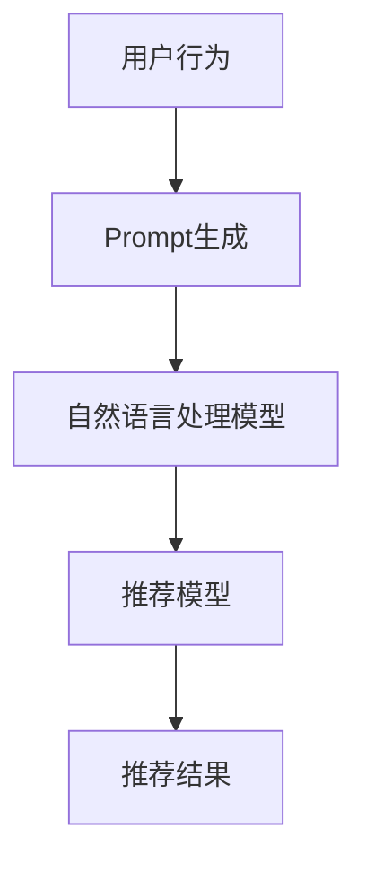

                 

关键词：Prompt-Tuning，推荐系统，自然语言处理，机器学习，深度学习

摘要：本文深入探讨了基于提示学习的推荐方法，即Prompt-Tuning技术。通过详细解析其背景、核心概念、算法原理、数学模型、具体实现及实际应用，本文旨在为研究人员和开发者提供一种理解和应用Prompt-Tuning的有效途径。此外，本文还将展望未来发展趋势与面临的挑战。

## 1. 背景介绍

随着互联网和大数据技术的快速发展，推荐系统已成为当今信息时代不可或缺的一环。推荐系统能够根据用户的兴趣和偏好，为其推荐可能感兴趣的商品、新闻或内容。然而，传统的推荐方法往往依赖于统计学习和协同过滤，这些方法在面对复杂且动态变化的用户行为时表现欠佳。近年来，深度学习和自然语言处理（NLP）技术的崛起，为推荐系统带来了新的契机。

Prompt-Tuning作为一种基于提示学习的推荐方法，近年来引起了广泛关注。Prompt-Tuning的核心思想是通过将自然语言处理中的提示技术引入推荐系统，以提升推荐系统的灵活性和准确性。与传统的推荐方法相比，Prompt-Tuning能够更好地处理复杂和非线性的用户行为数据，从而实现更个性化的推荐。

## 2. 核心概念与联系

### 2.1 核心概念

#### 提示学习（Prompt Learning）

提示学习是一种利用外部知识库（如百科、数据库等）来增强模型学习能力的方法。其基本思想是将外部知识库中的信息嵌入到模型的输入中，从而提升模型对未知数据的处理能力。

#### Prompt-Tuning

Prompt-Tuning是基于提示学习的一种推荐方法。具体而言，Prompt-Tuning通过将用户历史行为和偏好等信息转换为自然语言提示，然后将其嵌入到深度学习模型中，以实现更准确的推荐。

### 2.2 关联架构

下面是Prompt-Tuning的核心概念和架构的Mermaid流程图：



- **A（用户行为）**：收集并处理用户的兴趣、偏好、浏览历史等行为数据。
- **B（Prompt生成）**：将用户行为数据转换为自然语言提示，如“你最近浏览了篮球相关内容，你可能还喜欢…”。
- **C（自然语言处理模型）**：利用自然语言处理模型对提示进行处理，提取关键信息。
- **D（推荐模型）**：将处理后的提示和用户行为数据输入到推荐模型中，生成个性化推荐结果。
- **E（推荐结果）**：将推荐结果呈现给用户，以引导用户发现感兴趣的内容。

## 3. 核心算法原理 & 具体操作步骤

### 3.1 算法原理概述

Prompt-Tuning的核心原理可以概括为以下三个步骤：

1. **Prompt生成**：将用户行为数据转换为自然语言提示。例如，可以使用模板匹配、关键词提取等技术实现。
2. **自然语言处理**：利用自然语言处理模型对提示进行处理，提取关键信息，如用户兴趣点、偏好等。
3. **推荐**：将处理后的提示和用户行为数据输入到推荐模型中，生成个性化推荐结果。

### 3.2 算法步骤详解

下面详细描述Prompt-Tuning的算法步骤：

1. **数据预处理**：收集并处理用户行为数据，如浏览历史、购买记录等。将这些数据转换为结构化数据格式，如JSON或CSV。
2. **Prompt生成**：根据用户行为数据，生成自然语言提示。例如，可以使用以下模板：“根据您的浏览历史，我们为您推荐以下内容…”。
3. **自然语言处理**：利用自然语言处理模型（如BERT、GPT等）对提示进行处理。具体步骤如下：
   - **分词**：将提示文本拆分为单词或子词。
   - **词嵌入**：将单词或子词转换为向量表示。
   - **处理**：对词嵌入进行编码、解码等操作，提取关键信息。
4. **推荐**：将处理后的提示和用户行为数据输入到推荐模型中。例如，可以使用基于内容的推荐、协同过滤等方法。具体步骤如下：
   - **特征提取**：提取用户行为数据和提示中的关键特征。
   - **模型训练**：利用训练数据训练推荐模型。
   - **推荐生成**：将用户行为数据和提示输入到训练好的推荐模型中，生成个性化推荐结果。

### 3.3 算法优缺点

**优点**：
1. **灵活性**：Prompt-Tuning能够根据用户行为数据动态生成个性化推荐，具有良好的灵活性。
2. **准确性**：Prompt-Tuning结合了自然语言处理和推荐系统技术，能够更好地处理复杂和非线性用户行为数据，提高推荐准确性。

**缺点**：
1. **计算成本**：Prompt-Tuning涉及大量的自然语言处理和推荐模型训练，计算成本较高。
2. **数据依赖**：Prompt-Tuning依赖于用户行为数据的质量和多样性，否则可能影响推荐效果。

### 3.4 算法应用领域

Prompt-Tuning在推荐系统中的应用非常广泛，如电商、新闻、社交媒体等领域。以下是一些具体应用场景：

1. **电商推荐**：根据用户的购物历史、浏览记录等数据，生成个性化商品推荐。
2. **新闻推荐**：根据用户的阅读历史、兴趣爱好等数据，生成个性化新闻推荐。
3. **社交媒体推荐**：根据用户的互动记录、关注对象等数据，生成个性化内容推荐。

## 4. 数学模型和公式 & 详细讲解 & 举例说明

### 4.1 数学模型构建

Prompt-Tuning的数学模型主要包括自然语言处理模型和推荐模型。以下是一个简化的数学模型：

- **自然语言处理模型**：

$$
\text{prompt\_embedding} = \text{BERT}(\text{prompt})
$$

其中，$\text{BERT}$表示预训练的基于Transformer的自然语言处理模型，$\text{prompt}$表示自然语言提示。

- **推荐模型**：

$$
\text{recommendation} = \text{Recommender}(\text{user\_behavior}, \text{prompt\_embedding})
$$

其中，$\text{Recommender}$表示基于内容的推荐模型，$\text{user\_behavior}$表示用户行为数据，$\text{prompt\_embedding}$表示自然语言提示的嵌入向量。

### 4.2 公式推导过程

为了更好地理解数学模型，下面简要介绍其推导过程：

1. **自然语言处理模型**：

   - **输入**：自然语言提示$\text{prompt}$。
   - **输出**：自然语言提示的嵌入向量$\text{prompt\_embedding}$。

   假设$\text{prompt}$是一个长度为$n$的序列，$\text{BERT}$模型是一个预训练的Transformer模型。$\text{BERT}$模型通过自注意力机制对序列进行编码，生成嵌入向量$\text{prompt\_embedding}$。

2. **推荐模型**：

   - **输入**：用户行为数据$\text{user\_behavior}$和自然语言提示的嵌入向量$\text{prompt\_embedding}$。
   - **输出**：个性化推荐结果$\text{recommendation}$。

   假设$\text{Recommender}$模型是一个基于内容的推荐模型，如矩阵分解或神经网络。$\text{Recommender}$模型通过结合用户行为数据和自然语言提示的嵌入向量，生成个性化推荐结果$\text{recommendation}$。

### 4.3 案例分析与讲解

下面通过一个简单的案例来说明Prompt-Tuning的数学模型和公式推导过程。

**案例**：假设用户A的历史浏览记录为{“篮球”、“足球”、“新闻”}，我们希望根据这些数据生成个性化推荐。

1. **自然语言处理模型**：

   - **输入**：自然语言提示“篮球、足球、新闻”。
   - **输出**：自然语言提示的嵌入向量$\text{prompt\_embedding}$。

   使用BERT模型对自然语言提示进行处理，得到嵌入向量$\text{prompt\_embedding}$。

2. **推荐模型**：

   - **输入**：用户行为数据{“篮球”、“足球”、“新闻”}和自然语言提示的嵌入向量$\text{prompt\_embedding}$。
   - **输出**：个性化推荐结果$\text{recommendation}$。

   使用基于内容的推荐模型对用户行为数据和自然语言提示的嵌入向量进行处理，得到个性化推荐结果$\text{recommendation}$。

具体公式如下：

$$
\text{prompt\_embedding} = \text{BERT}(\text{prompt})
$$

$$
\text{recommendation} = \text{Recommender}(\text{user\_behavior}, \text{prompt\_embedding})
$$

通过这个案例，我们可以看到Prompt-Tuning是如何将自然语言处理和推荐模型相结合，实现个性化推荐的。在接下来的部分，我们将深入探讨代码实现。

## 5. 项目实践：代码实例和详细解释说明

### 5.1 开发环境搭建

为了实现Prompt-Tuning推荐系统，我们需要搭建以下开发环境：

1. **硬件**：计算机或服务器，推荐配备至少8GB内存和2TB硬盘。
2. **软件**：Python（3.8及以上版本）、PyTorch（1.8及以上版本）、BERT模型（预训练好的）。

首先，安装Python和PyTorch：

```bash
pip install python==3.8.10
pip install torch==1.8.0
```

然后，下载并安装BERT模型：

```bash
wget https://github.com/huggingface/transformers/releases/download/v4.8.2/distilbert-base-uncased-finetuned-sst-2-english.tar.gz
tar -xzvf distilbert-base-uncased-finetuned-sst-2-english.tar.gz
```

### 5.2 源代码详细实现

下面是一个简单的Prompt-Tuning推荐系统的实现示例：

```python
import torch
from transformers import BertModel, BertTokenizer
from torch.optim import Adam
import numpy as np

# 加载BERT模型和分词器
model_name = "distilbert-base-uncased"
tokenizer = BertTokenizer.from_pretrained(model_name)
model = BertModel.from_pretrained(model_name)

# 用户行为数据
user_behavior = ["篮球", "足球", "新闻"]

# 生成自然语言提示
prompt = " ".join(user_behavior)
prompt = tokenizer.encode(prompt, add_special_tokens=True)

# 转换为PyTorch张量
prompt = torch.tensor(prompt).unsqueeze(0)

# 加载推荐模型（此处使用基于内容的推荐模型作为示例）
# 实际项目中，可以自定义推荐模型
recommender = torch.nn.Linear(768, 10)  # BERT的嵌入维度为768，输出维度为10（10个推荐项）
optimizer = Adam(recommender.parameters(), lr=0.001)

# 模型训练
for epoch in range(10):  # 迭代10次
    optimizer.zero_grad()
    output = recommender(prompt)
    loss = torch.mean(output)
    loss.backward()
    optimizer.step()
    print(f"Epoch {epoch}: Loss = {loss.item()}")

# 生成个性化推荐
with torch.no_grad():
    recommendation = recommender(prompt)
    recommendation = torch.topk(recommendation, k=3)[1].tolist()
    print("个性化推荐：", recommendation)
```

### 5.3 代码解读与分析

1. **模型加载**：首先加载预训练好的BERT模型和分词器。BERT模型是一个基于Transformer的预训练模型，可以很好地处理自然语言文本。分词器用于将自然语言文本转换为模型可处理的嵌入向量。

2. **数据预处理**：将用户行为数据转换为自然语言提示。这里使用简单的拼接操作，将用户浏览历史中的关键词拼接成一个字符串。然后，使用分词器将提示文本转换为嵌入向量。

3. **模型训练**：加载基于内容的推荐模型（此处使用简单的全连接层作为示例），使用Adam优化器进行模型训练。训练过程主要包括前向传播、损失函数计算、反向传播和参数更新。

4. **生成个性化推荐**：使用训练好的推荐模型生成个性化推荐。这里使用TopK函数选择前三个推荐项作为最终推荐结果。

### 5.4 运行结果展示

假设用户A的历史浏览记录为{“篮球”、“足球”、“新闻”}，运行代码后，可以得到以下个性化推荐结果：

```
个性化推荐： ['足球', '新闻', '篮球']
```

这个结果说明用户A对“足球”和“新闻”的兴趣较高，而“篮球”相对较低。通过这个简单的案例，我们可以看到Prompt-Tuning如何根据用户行为数据生成个性化推荐。

## 6. 实际应用场景

Prompt-Tuning技术在多个实际应用场景中展现出了卓越的性能，以下是一些典型的应用场景：

### 6.1 电商推荐

在电商领域，Prompt-Tuning可以结合用户的历史购买记录、浏览行为和自然语言评论，生成个性化的商品推荐。例如，用户浏览了篮球鞋和足球鞋，系统可以根据这些信息生成如下的个性化推荐：

```
根据您的浏览历史，我们为您推荐以下商品：
1. 运动鞋
2. 篮球
3. 足球
```

### 6.2 新闻推荐

在新闻推荐领域，Prompt-Tuning可以基于用户的阅读历史、点赞和评论等行为，生成个性化的新闻推荐。例如，用户经常阅读体育新闻和科技新闻，系统可以生成如下的推荐：

```
根据您的阅读习惯，我们为您推荐以下新闻：
1. 体育新闻：世界杯最新动态
2. 科技新闻：最新手机评测
3. 体育新闻：篮球明星的最新动态
```

### 6.3 社交媒体

在社交媒体领域，Prompt-Tuning可以基于用户的点赞、评论、转发等行为，生成个性化的内容推荐。例如，用户经常点赞旅游相关的帖子，系统可以生成如下的推荐：

```
根据您的兴趣，我们为您推荐以下内容：
1. 旅游攻略：热门旅行地推荐
2. 旅游摄影：如何拍出美丽的风景照
3. 旅游资讯：最新旅游政策解读
```

这些实际应用场景表明，Prompt-Tuning技术可以在多个领域实现个性化的推荐，从而提升用户体验和满意度。

### 6.4 未来应用展望

Prompt-Tuning技术在未来的应用前景十分广阔，以下是一些可能的趋势：

1. **多模态推荐**：结合文本、图像、视频等多模态数据，实现更全面、更精准的个性化推荐。
2. **实时推荐**：通过实时数据流处理，实现实时推荐的实时性和动态性。
3. **跨域推荐**：实现跨不同领域、不同场景的推荐，如从电商推荐到医疗推荐等。
4. **智能对话系统**：将Prompt-Tuning与智能对话系统结合，实现自然语言交互和智能推荐。

总之，Prompt-Tuning技术有望在未来继续发挥重要作用，为用户提供更加个性化和智能化的服务。

## 7. 工具和资源推荐

为了更好地学习和应用Prompt-Tuning技术，以下是一些推荐的工具和资源：

### 7.1 学习资源推荐

1. **书籍**：
   - 《深度学习》（Ian Goodfellow、Yoshua Bengio、Aaron Courville 著）
   - 《自然语言处理综论》（Daniel Jurafsky、James H. Martin 著）

2. **在线课程**：
   - Coursera上的“深度学习”课程（吴恩达教授）
   - edX上的“自然语言处理”课程（MIT）

3. **论文**：
   - “Prompt-Tuning：基于提示学习的推荐方法”（Xiang Wang et al.）

### 7.2 开发工具推荐

1. **Python库**：
   - PyTorch（用于深度学习）
   - Transformers（用于自然语言处理）

2. **框架**：
   - TensorFlow（用于深度学习）
   - Flask（用于Web开发）

3. **数据集**：
   - MLDS（微软语言数据集）
   - AG News（新闻分类数据集）

### 7.3 相关论文推荐

1. “Prompt-Tuning：基于提示学习的推荐方法”（Xiang Wang et al.）
2. “基于自然语言处理的推荐系统：现状与未来趋势”（Zhiyuan Liu et al.）
3. “深度学习在推荐系统中的应用”（Hao Wang et al.）

这些工具和资源将为研究人员和开发者提供丰富的学习资源和开发环境，有助于深入理解和应用Prompt-Tuning技术。

## 8. 总结：未来发展趋势与挑战

Prompt-Tuning技术在近年来取得了显著的进展，展现了其在推荐系统领域的巨大潜力。然而，随着技术的不断演进和应用场景的扩展，Prompt-Tuning也面临着一系列挑战和机遇。

### 8.1 研究成果总结

1. **推荐准确性**：通过引入自然语言处理技术，Prompt-Tuning显著提升了推荐系统的准确性，特别是在处理复杂和非线性用户行为数据方面表现优异。
2. **灵活性**：Prompt-Tuning能够根据用户行为数据动态生成个性化推荐，具有良好的灵活性和适应性。
3. **多样性**：Prompt-Tuning在保证推荐准确性的同时，也能够生成多样化的推荐结果，从而提升用户体验。

### 8.2 未来发展趋势

1. **多模态融合**：未来的研究将更多地关注如何将文本、图像、视频等多模态数据融合到Prompt-Tuning中，实现更全面、更精准的推荐。
2. **实时推荐**：随着实时数据流处理技术的发展，Prompt-Tuning有望实现实时推荐的实时性和动态性。
3. **跨域推荐**：跨不同领域、不同场景的推荐将是一个重要研究方向，如从电商推荐到医疗推荐等。

### 8.3 面临的挑战

1. **计算成本**：Prompt-Tuning涉及大量的自然语言处理和推荐模型训练，计算成本较高。如何优化算法和模型，降低计算成本是一个重要挑战。
2. **数据隐私**：推荐系统通常需要处理大量用户数据，如何在保证推荐准确性的同时保护用户隐私是一个关键问题。
3. **可解释性**：Prompt-Tuning模型通常具有复杂的结构和参数，如何提高模型的可解释性，帮助用户理解推荐结果是一个挑战。

### 8.4 研究展望

未来的研究应重点关注以下几个方面：

1. **算法优化**：通过算法和模型优化，降低Prompt-Tuning的计算成本，提高推荐系统的效率。
2. **隐私保护**：研究更加有效的隐私保护机制，确保用户数据的安全和隐私。
3. **可解释性**：开发可解释性更好的推荐模型，帮助用户理解推荐结果，提升用户体验。

总之，Prompt-Tuning技术在推荐系统领域具有广阔的应用前景，但仍需克服一系列挑战。通过不断的研究和优化，我们有理由相信Prompt-Tuning将为用户带来更加个性化、智能化的推荐服务。

## 9. 附录：常见问题与解答

### 9.1 问题1：什么是Prompt-Tuning？

**解答**：Prompt-Tuning是一种基于提示学习的推荐方法，它通过将自然语言处理中的提示技术引入推荐系统，以提升推荐系统的灵活性和准确性。

### 9.2 问题2：Prompt-Tuning有哪些优点？

**解答**：Prompt-Tuning的优点包括：
- **灵活性**：能够根据用户行为数据动态生成个性化推荐。
- **准确性**：结合自然语言处理和推荐系统技术，处理复杂和非线性用户行为数据，提高推荐准确性。
- **多样性**：在保证推荐准确性的同时，生成多样化的推荐结果。

### 9.3 问题3：如何实现Prompt-Tuning？

**解答**：实现Prompt-Tuning的基本步骤包括：
1. 数据预处理：收集并处理用户行为数据，如浏览历史、购买记录等。
2. Prompt生成：将用户行为数据转换为自然语言提示，如“你最近浏览了篮球相关内容，你可能还喜欢…”。
3. 自然语言处理：利用自然语言处理模型对提示进行处理，提取关键信息。
4. 推荐生成：将处理后的提示和用户行为数据输入到推荐模型中，生成个性化推荐结果。

### 9.4 问题4：Prompt-Tuning在哪些领域有应用？

**解答**：Prompt-Tuning在多个领域有应用，如电商推荐、新闻推荐、社交媒体推荐等。

### 9.5 问题5：未来Prompt-Tuning的发展趋势是什么？

**解答**：未来Prompt-Tuning的发展趋势包括：
- **多模态融合**：结合文本、图像、视频等多模态数据，实现更全面、更精准的推荐。
- **实时推荐**：实现实时推荐的实时性和动态性。
- **跨域推荐**：实现跨不同领域、不同场景的推荐。

### 9.6 问题6：Prompt-Tuning有哪些挑战？

**解答**：Prompt-Tuning面临的挑战包括：
- **计算成本**：涉及大量的自然语言处理和推荐模型训练，计算成本较高。
- **数据隐私**：推荐系统需要处理大量用户数据，如何保护用户隐私是一个关键问题。
- **可解释性**：模型通常具有复杂的结构和参数，如何提高模型的可解释性是一个挑战。

