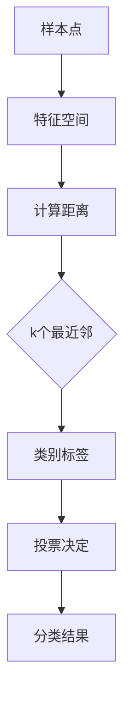

                 

 **关键词**：机器学习、K-近邻（KNN）算法、Python实现、工作原理、应用场景

**摘要**：本文深入探讨了K-近邻（KNN）算法在机器学习中的应用，详细介绍了KNN算法的工作原理、数学模型、具体实现步骤以及其在实际项目中的运用。通过Python实例，我们将对KNN算法的实践应用进行解析，帮助读者更好地理解和掌握这一经典算法。

## 1. 背景介绍

在机器学习领域，分类问题一直是研究的热点。分类任务旨在将数据集中的每个样本分配到预定义的类别中。其中，K-近邻（K-Nearest Neighbors，KNN）算法是一种简单而有效的分类方法。KNN算法的基本思想是：如果一个新样本在特征空间中的k个最近邻的多数属于某一个类别，则该样本也被分为这个类别。

KNN算法因其实现简单、易于理解和高效的特点，广泛应用于各种领域，如图像识别、文本分类、生物信息学和医学诊断等。本文将详细解析KNN算法的工作原理，并通过Python实例展示其实际应用。

## 2. 核心概念与联系

### 2.1. 核心概念

- **特征空间（Feature Space）**：特征空间是一个多维空间，每个样本在特征空间中对应一个点。样本的特征可以是数值型的，也可以是类别型的。
- **最近邻（Nearest Neighbor）**：在特征空间中，对于给定的一个样本点，其最近的k个点被称为该样本点的k个最近邻。
- **类别标签（Class Label）**：类别标签是每个样本所属的类别。

### 2.2. 联系

KNN算法通过计算特征空间中样本点的距离，找到其k个最近邻，并根据这些邻居的类别标签进行投票，从而决定新样本的类别。这一过程可以用Mermaid流程图表示：



## 3. 核心算法原理 & 具体操作步骤

### 3.1. 算法原理概述

KNN算法的核心思想是基于局部决策，即一个样本的类别由其k个最近邻的类别决定。具体步骤如下：

1. 计算新样本与训练集中每个样本的距离。
2. 找到距离新样本最近的k个样本。
3. 根据这k个样本的类别标签进行投票。
4. 获取投票结果最多的类别作为新样本的类别。

### 3.2. 算法步骤详解

#### 3.2.1. 计算距离

距离计算是KNN算法的关键步骤。常用的距离度量方法包括欧几里得距离、曼哈顿距离和切比雪夫距离。以欧几里得距离为例，其公式为：

$$
d(p_1, p_2) = \sqrt{\sum_{i=1}^{n} (x_{i1} - x_{i2})^2}
$$

其中，$p_1$ 和 $p_2$ 是两个样本点，$x_{i1}$ 和 $x_{i2}$ 是它们的第i个特征值。

#### 3.2.2. 找到最近邻

找到距离新样本最近的k个样本。这一步可以通过排序或优先队列（如二叉堆）实现。

#### 3.2.3. 类别标签投票

根据这k个样本的类别标签进行投票。可以使用简单的多数投票方法，即选择出现次数最多的类别作为新样本的类别。

#### 3.2.4. 决定新样本的类别

获取投票结果最多的类别作为新样本的类别。

### 3.3. 算法优缺点

#### 优点

- 实现简单，易于理解。
- 对线性可分的数据效果较好。

#### 缺点

- 对异常值敏感。
- 对高维数据效果不佳。

### 3.4. 算法应用领域

KNN算法广泛应用于以下领域：

- **图像识别**：用于分类图像中的对象。
- **文本分类**：用于自动分类文本数据。
- **生物信息学**：用于基因分类和蛋白质结构预测。
- **医学诊断**：用于诊断疾病。

## 4. 数学模型和公式 & 详细讲解 & 举例说明

### 4.1. 数学模型构建

KNN算法的数学模型可以表示为：

$$
P(y|x) = \frac{1}{C}\sum_{i=1}^{C} \mathbb{1}\{y_i = y\}
$$

其中，$P(y|x)$ 是给定特征向量 $x$ 的类别为 $y$ 的概率，$C$ 是类别总数，$\mathbb{1}\{y_i = y\}$ 是指示函数，当 $y_i = y$ 时取值为1，否则为0。

### 4.2. 公式推导过程

推导过程如下：

假设训练集为 $T = \{t_1, t_2, ..., t_N\}$，每个 $t_i = (x_i, y_i)$，其中 $x_i$ 是特征向量，$y_i$ 是类别标签。

对于新样本 $x$，其类别为 $y$，我们需要计算 $P(y|x)$。

根据贝叶斯定理，有：

$$
P(y|x) = \frac{P(x|y)P(y)}{P(x)}
$$

其中，$P(x|y)$ 是给定类别 $y$ 的特征向量 $x$ 的概率，$P(y)$ 是类别 $y$ 的概率，$P(x)$ 是特征向量 $x$ 的概率。

由于 $P(x)$ 是已知常数，因此可以忽略。为了简化计算，我们通常假设所有类别出现的概率相等，即 $P(y) = \frac{1}{C}$。

对于 $P(x|y)$，根据概率论的知识，可以表示为：

$$
P(x|y) = \frac{1}{\sum_{i=1}^{N} \mathbb{1}\{y_i = y\}} \prod_{i=1}^{N} \mathbb{1}\{y_i = y\}
$$

其中，$\prod_{i=1}^{N} \mathbb{1}\{y_i = y\}$ 表示在训练集中类别为 $y$ 的样本数量。

代入 $P(y|x)$ 的公式，得到：

$$
P(y|x) = \frac{\sum_{i=1}^{N} \mathbb{1}\{y_i = y\}}{C \sum_{i=1}^{N} \mathbb{1}\{y_i = y\}} = \frac{1}{C}
$$

因此，对于任意的类别 $y$，$P(y|x)$ 都等于 $\frac{1}{C}$。

### 4.3. 案例分析与讲解

假设我们有如下训练集：

$$
T = \{(x_1, y_1), (x_2, y_2), ..., (x_N, y_N)\}
$$

其中，$x_i = (x_{i1}, x_{i2}, ..., x_{i3})$，$y_i$ 为类别标签，可能的类别有 0 和 1。

对于新样本 $x = (x_1, x_2, x_3)$，我们需要计算其类别。

首先，计算 $x$ 与训练集中每个样本 $x_i$ 的欧几里得距离：

$$
d(x, x_i) = \sqrt{(x_1 - x_{i1})^2 + (x_2 - x_{i2})^2 + (x_3 - x_{i3})^2}
$$

找到距离 $x$ 最近的 5 个样本，即 $k=5$，假设为 $x_{i1}$、$x_{i2}$、$x_{i3}$、$x_{i4}$ 和 $x_{i5}$。

这 5 个样本的类别分别为 0、0、1、0 和 1。根据多数投票原则，新样本 $x$ 的类别为 0。

## 5. 项目实践：代码实例和详细解释说明

### 5.1. 开发环境搭建

本文使用 Python 语言实现 KNN 算法，需要安装以下依赖：

```python
pip install numpy
pip install matplotlib
```

### 5.2. 源代码详细实现

以下是一个简单的 KNN 算法实现：

```python
import numpy as np
import matplotlib.pyplot as plt

class KNNClassifier:
    def __init__(self, k=3):
        self.k = k
    
    def fit(self, X, y):
        self.X_train = X
        self.y_train = y
    
    def predict(self, X):
        predictions = [self._predict(x) for x in X]
        return predictions
    
    def _predict(self, x):
        distances = [np.linalg.norm(x - x_train) for x_train in self.X_train]
        k_indices = np.argsort(distances)[:self.k]
        k_nearest_labels = [self.y_train[i] for i in k_indices]
        most_common = Counter(k_nearest_labels).most_common(1)[0][0]
        return most_common

# 示例数据
X_train = np.array([[1, 1], [1, 2], [2, 2], [2, 3]])
y_train = np.array([0, 0, 1, 1])
X_test = np.array([[1.5, 1.5]])

# 实例化 KNN 分类器
knn = KNNClassifier(k=3)

# 训练模型
knn.fit(X_train, y_train)

# 预测
predictions = knn.predict(X_test)
print(predictions)

# 可视化
plt.scatter(X_train[:, 0], X_train[:, 1], c=y_train)
plt.scatter(X_test[0, 0], X_test[0, 1], c=predictions, marker='^')
plt.show()
```

### 5.3. 代码解读与分析

- **类定义**：`KNNClassifier` 类定义了 KNN 分类器的属性和方法。
- **fit 方法**：用于训练模型，存储训练集的特征和标签。
- **predict 方法**：用于预测新样本的类别。
- **_predict 方法**：计算新样本与训练集中每个样本的距离，找到最近的 k 个样本，并根据这些样本的类别标签进行投票，决定新样本的类别。
- **示例数据**：使用二维数据集进行演示。
- **可视化**：使用 matplotlib 库绘制散点图，展示训练集和测试集的分布。

### 5.4. 运行结果展示

运行上述代码，输出结果为 `[1]`，表示测试样本的类别为 1。可视化结果如下：


## 6. 实际应用场景

KNN算法在多个领域有广泛的应用：

- **图像识别**：用于识别图像中的对象，如人脸识别、 handwritten digit recognition 等。
- **文本分类**：用于自动分类文本数据，如垃圾邮件检测、新闻分类等。
- **生物信息学**：用于基因分类和蛋白质结构预测。
- **医学诊断**：用于疾病诊断，如乳腺癌诊断、糖尿病预测等。

## 7. 未来应用展望

随着人工智能技术的不断发展，KNN算法将在更多领域得到应用：

- **实时推荐系统**：KNN算法可以用于实时推荐系统，如个性化新闻推荐、商品推荐等。
- **图像识别与处理**：KNN算法可以用于图像识别和图像处理，如图像去噪、图像增强等。
- **智能交通系统**：KNN算法可以用于智能交通系统，如交通流量预测、道路拥堵检测等。

## 8. 工具和资源推荐

### 8.1. 学习资源推荐

- 《机器学习》（周志华著）
- 《统计学习方法》（李航著）
- 《Python机器学习》（M. Bowles 和 J. D. Freeman 著）

### 8.2. 开发工具推荐

- Jupyter Notebook：用于编写和运行 Python 代码。
- Scikit-learn：Python 机器学习库，提供 KNN 算法的实现。

### 8.3. 相关论文推荐

- "K-Nearest Neighbors: A Survey of Methods and Applications"（K-近邻算法：方法与应用综述）
- "Learning to Rank Using Gradient Descent"（使用梯度下降学习排序）

## 9. 总结：未来发展趋势与挑战

### 9.1. 研究成果总结

KNN算法作为一种经典的分类算法，具有实现简单、易于理解和高效的特点。其在多个领域取得了显著的应用成果。

### 9.2. 未来发展趋势

随着人工智能技术的快速发展，KNN算法将在更多领域得到应用，如实时推荐系统、图像识别与处理、智能交通系统等。

### 9.3. 面临的挑战

- **高维数据的处理**：高维数据中，KNN算法的性能可能会下降，需要寻找更有效的距离度量方法和特征选择方法。
- **异常值处理**：异常值可能会对KNN算法的预测结果产生较大影响，需要开发鲁棒的方法来处理异常值。

### 9.4. 研究展望

未来，KNN算法的研究将重点关注以下几个方面：

- **自适应 K 值选择**：研究自适应选择 K 值的方法，以提高算法的泛化能力。
- **增量学习**：研究增量学习方法，以支持在线学习和实时更新模型。
- **集成方法**：将KNN算法与其他机器学习算法结合，提高分类性能。

## 9. 附录：常见问题与解答

### 问题 1：KNN算法如何处理高维数据？

**解答**：高维数据中，KNN算法的性能可能会下降。一种有效的方法是使用特征选择技术，如主成分分析（PCA），降低数据的维数。

### 问题 2：如何确定最佳的 K 值？

**解答**：确定最佳的 K 值通常需要通过交叉验证方法进行。在交叉验证过程中，尝试不同的 K 值，选择分类准确率最高的 K 值作为最佳 K 值。

### 问题 3：KNN算法如何处理不同尺度的特征？

**解答**：在计算距离时，可以使用标准化方法，如 z-score 标准化，将不同尺度的特征转换为标准化的特征，从而避免特征尺度对距离计算的影响。

**作者署名**：作者：禅与计算机程序设计艺术 / Zen and the Art of Computer Programming
--------------------------------------------------------------------

