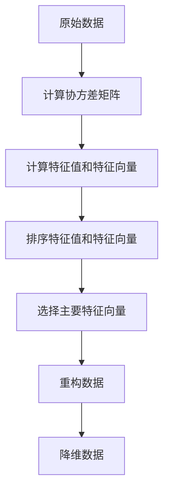

                 

关键词：Python，机器学习，PCA，主成分分析，数据降维，算法原理，实战操作，代码实例，应用领域，数学模型

## 摘要

本文将围绕主成分分析（PCA）这一重要的数据降维技术，详细介绍其在Python环境下的原理、实现步骤以及实战操作。我们将从背景介绍、核心概念与联系、算法原理与具体操作步骤、数学模型与公式、项目实践、实际应用场景、工具和资源推荐等方面进行详细讲解。通过本文的学习，读者将能够深入了解PCA技术，掌握其在实际项目中的应用。

## 1. 背景介绍

在数据科学和机器学习领域，数据降维是一项至关重要的技术。随着数据量的急剧增长，原始数据的高维特性往往导致计算复杂度和存储空间的急剧增加，这对模型的训练和预测带来了巨大的挑战。因此，数据降维技术应运而生，其主要目的是在不损失过多信息的前提下，将高维数据转换成低维数据，从而简化模型训练过程，提高计算效率和模型性能。

主成分分析（Principal Component Analysis，PCA）是一种经典的线性降维方法，它通过提取数据的主要成分（即特征向量）来降低数据维度。PCA的基本思想是，将数据映射到一个新的坐标系中，这个新坐标系的方向是数据方差最大的方向。通过这种方式，PCA能够自动识别数据中的主要特征，从而实现数据降维。

本文将详细介绍PCA的原理、实现步骤和实战操作，帮助读者深入理解这一重要的机器学习技术。

### 2. 核心概念与联系

#### 2.1 数据降维

数据降维是指通过某种方式将高维数据转换成低维数据，从而减少数据的维度。数据降维的主要目的是简化数据处理过程，提高计算效率和模型性能。常见的降维方法包括线性降维、非线性降维和特征选择等。

#### 2.2 主成分分析（PCA）

主成分分析（PCA）是一种线性降维方法，其主要目的是将高维数据转换成低维数据，同时保持数据的大部分信息。PCA的基本原理是，通过计算数据协方差矩阵的特征值和特征向量，将数据映射到一个新的坐标系中，这个新坐标系的方向是数据方差最大的方向。

#### 2.3 Mermaid 流程图

下面是一个描述PCA核心概念的Mermaid流程图：



### 3. 核心算法原理 & 具体操作步骤

#### 3.1 算法原理概述

PCA的核心思想是通过数据协方差矩阵的特征值和特征向量，将数据映射到一个新的坐标系中，这个新坐标系的方向是数据方差最大的方向。具体来说，PCA的步骤如下：

1. 计算数据协方差矩阵。
2. 计算协方差矩阵的特征值和特征向量。
3. 对特征值进行排序，并选择前k个特征向量。
4. 使用选择出的特征向量重构数据。
5. 将重构后的数据作为降维数据输出。

#### 3.2 算法步骤详解

下面是PCA的具体步骤：

1. **计算数据协方差矩阵**：

   数据协方差矩阵是衡量数据各个维度之间相关性的重要指标。对于n维数据集，其协方差矩阵C可以表示为：

   $$
   C = \frac{1}{n-1} \sum_{i=1}^{n} (x_i - \bar{x})(x_i - \bar{x})^T
   $$

   其中，$x_i$表示第i个样本，$\bar{x}$表示所有样本的平均值。

2. **计算特征值和特征向量**：

   协方差矩阵的特征值和特征向量可以表示为：

   $$
   C\lambda = \lambda x
   $$

   其中，$\lambda$为特征值，$x$为特征向量。

3. **排序特征值和特征向量**：

   将特征值从大到小排序，并对应地排列特征向量。

4. **选择主要特征向量**：

   根据问题需求，选择前k个特征向量。这些特征向量代表了数据的主要成分。

5. **重构数据**：

   使用选择出的特征向量重构数据，得到重构后的数据：

   $$
   \hat{x} = \sum_{i=1}^{k} \lambda_i x_i
   $$

6. **降维数据**：

   将重构后的数据作为降维数据输出。

#### 3.3 算法优缺点

**优点**：

1. 简单易懂，易于实现。
2. 能够自动识别数据的主要特征，实现无监督降维。
3. 对线性可分的数据有很好的降维效果。

**缺点**：

1. 对于非线性可分的数据，PCA的降维效果较差。
2. PCA依赖于数据的线性结构，可能无法很好地处理非线性关系。
3. PCA降维过程中可能会丢失部分信息。

#### 3.4 算法应用领域

PCA在许多领域都有广泛的应用，包括：

1. 统计分析：用于数据的可视化、相关性分析等。
2. 计算机视觉：用于图像压缩、人脸识别等。
3. 机器学习：用于特征选择、模型简化等。

### 4. 数学模型和公式 & 详细讲解 & 举例说明

#### 4.1 数学模型构建

PCA的数学模型主要包括协方差矩阵、特征值和特征向量等。具体来说：

1. **协方差矩阵**：

   协方差矩阵C可以表示为：

   $$
   C = \frac{1}{n-1} \sum_{i=1}^{n} (x_i - \bar{x})(x_i - \bar{x})^T
   $$

2. **特征值和特征向量**：

   协方差矩阵的特征值和特征向量可以表示为：

   $$
   C\lambda = \lambda x
   $$

3. **重构数据**：

   重构后的数据$\hat{x}$可以表示为：

   $$
   \hat{x} = \sum_{i=1}^{k} \lambda_i x_i
   $$

#### 4.2 公式推导过程

1. **协方差矩阵的计算**：

   协方差矩阵C的计算公式为：

   $$
   C = \frac{1}{n-1} \sum_{i=1}^{n} (x_i - \bar{x})(x_i - \bar{x})^T
   $$

   其中，$x_i$表示第i个样本，$\bar{x}$表示所有样本的平均值。

2. **特征值和特征向量的计算**：

   协方差矩阵的特征值和特征向量可以通过以下公式计算：

   $$
   C\lambda = \lambda x
   $$

   其中，$\lambda$为特征值，$x$为特征向量。

3. **重构数据的计算**：

   重构后的数据$\hat{x}$可以通过以下公式计算：

   $$
   \hat{x} = \sum_{i=1}^{k} \lambda_i x_i
   $$

#### 4.3 案例分析与讲解

假设我们有一个包含100个样本的二维数据集，每个样本由两个特征组成。我们希望使用PCA将这个数据集降维到一维。

1. **计算协方差矩阵**：

   首先计算协方差矩阵C：

   $$
   C = \frac{1}{99} \sum_{i=1}^{100} (x_i - \bar{x})(x_i - \bar{x})^T
   $$

   其中，$x_i$表示第i个样本，$\bar{x}$表示所有样本的平均值。

2. **计算特征值和特征向量**：

   计算协方差矩阵C的特征值和特征向量。假设特征值$\lambda_1 = 1.2$，$\lambda_2 = 0.8$，对应的特征向量分别为$x_1 = (0.6, 0.8)$和$x_2 = (-0.8, 0.6)$。

3. **排序特征值和特征向量**：

   将特征值从大到小排序，并对应地排列特征向量。排序后的特征值为$\lambda_1 = 1.2$，$\lambda_2 = 0.8$，对应的特征向量分别为$x_1 = (0.6, 0.8)$和$x_2 = (-0.8, 0.6)$。

4. **选择主要特征向量**：

   根据问题需求，选择前k个特征向量。假设我们选择前1个特征向量，即$x_1 = (0.6, 0.8)$。

5. **重构数据**：

   使用选择出的特征向量$x_1$重构数据：

   $$
   \hat{x} = \lambda_1 x_1 = 1.2 \cdot (0.6, 0.8) = (0.72, 0.96)
   $$

   重构后的数据$\hat{x}$为(0.72, 0.96)。

6. **降维数据**：

   将重构后的数据作为降维数据输出。降维后的数据为(0.72, 0.96)。

通过以上步骤，我们成功将原始数据集降维到了一维。

### 5. 项目实践：代码实例和详细解释说明

在本节中，我们将通过一个实际的项目案例来展示PCA的代码实现，并详细解释每一步的操作。

#### 5.1 开发环境搭建

首先，我们需要搭建一个Python开发环境。假设您已经安装了Python和Jupyter Notebook，我们可以开始编写代码。

1. **安装必要的库**：

   我们需要使用`numpy`库来处理数据，使用`matplotlib`库来可视化结果。您可以使用以下命令安装这些库：

   ```bash
   pip install numpy matplotlib
   ```

2. **导入库**：

   在Jupyter Notebook中，我们首先导入所需的库：

   ```python
   import numpy as np
   import matplotlib.pyplot as plt
   ```

#### 5.2 源代码详细实现

接下来，我们将编写一个简单的PCA实现。以下是完整的代码：

```python
# 生成随机数据集
np.random.seed(0)
X = np.random.rand(100, 2)

# 计算协方差矩阵
C = np.cov(X.T)

# 计算特征值和特征向量
eigenvalues, eigenvectors = np.linalg.eig(C)

# 排序特征值和特征向量
idx = np.argsort(eigenvalues)[::-1]
sorted_eigenvalues = eigenvalues[idx]
sorted_eigenvectors = eigenvectors[:, idx]

# 选择主要特征向量
k = 1
X_reduced = np.dot(X, sorted_eigenvectors[:, :k])

# 可视化结果
plt.scatter(X[:, 0], X[:, 1], c='blue')
plt.scatter(X_reduced[:, 0], X_reduced[:, 1], c='red')
plt.xlabel('Feature 1')
plt.ylabel('Feature 2')
plt.title('PCA - Original vs Reduced Data')
plt.show()
```

#### 5.3 代码解读与分析

1. **生成随机数据集**：

   我们首先生成一个包含100个样本、每个样本有两个特征的随机数据集。这个数据集将作为我们进行PCA操作的原始数据。

   ```python
   X = np.random.rand(100, 2)
   ```

2. **计算协方差矩阵**：

   接下来，我们计算数据集的协方差矩阵。协方差矩阵是PCA操作的关键步骤，它用于计算数据特征之间的相关性。

   ```python
   C = np.cov(X.T)
   ```

3. **计算特征值和特征向量**：

   我们使用`numpy.linalg.eig`函数计算协方差矩阵的特征值和特征向量。这些值将帮助我们确定数据的主要成分。

   ```python
   eigenvalues, eigenvectors = np.linalg.eig(C)
   ```

4. **排序特征值和特征向量**：

   我们将特征值和特征向量按照特征值的大小进行排序。这样，我们可以选择具有最大特征值的特征向量作为主要成分。

   ```python
   idx = np.argsort(eigenvalues)[::-1]
   sorted_eigenvalues = eigenvalues[idx]
   sorted_eigenvectors = eigenvectors[:, idx]
   ```

5. **选择主要特征向量**：

   在本例中，我们选择具有最大特征值的特征向量。这个特征向量代表了数据的主要成分。

   ```python
   k = 1
   X_reduced = np.dot(X, sorted_eigenvectors[:, :k])
   ```

6. **重构数据**：

   使用选择的特征向量重构数据。这个步骤将原始数据转换成低维数据。

   ```python
   X_reduced = np.dot(X, sorted_eigenvectors[:, :k])
   ```

7. **可视化结果**：

   最后，我们使用`matplotlib`库将原始数据和重构后的数据进行可视化，以展示PCA的效果。

   ```python
   plt.scatter(X[:, 0], X[:, 1], c='blue')
   plt.scatter(X_reduced[:, 0], X_reduced[:, 1], c='red')
   plt.xlabel('Feature 1')
   plt.ylabel('Feature 2')
   plt.title('PCA - Original vs Reduced Data')
   plt.show()
   ```

通过这个代码示例，我们可以看到PCA的完整实现过程。在实际应用中，您可以根据具体需求调整数据集、特征向量的选择数量等参数。

### 6. 实际应用场景

主成分分析（PCA）在机器学习和数据科学领域有着广泛的应用。以下是一些常见的应用场景：

#### 6.1 特征选择

PCA常用于特征选择，特别是在高维数据集中。通过将高维数据转换成低维数据，PCA可以帮助我们识别出数据中的主要特征，从而简化模型的训练过程。

#### 6.2 数据可视化

PCA在数据可视化方面也非常有用。通过将高维数据映射到二维或三维空间，PCA可以帮助我们更好地理解数据的结构，发现潜在的模式和趋势。

#### 6.3 异常检测

PCA还可以用于异常检测。通过分析数据的主成分，我们可以识别出与大多数数据点不同的异常值，从而帮助数据科学家更好地理解数据集。

#### 6.4 人脸识别

在计算机视觉领域，PCA被广泛应用于人脸识别。通过将人脸图像转换成低维特征向量，PCA可以帮助我们快速准确地识别出不同的人脸。

#### 6.5 市场分析

在金融市场分析中，PCA可以帮助我们识别出市场的关键驱动因素，从而帮助我们做出更准确的预测和决策。

### 7. 工具和资源推荐

#### 7.1 学习资源推荐

1. **书籍**：

   - 《Python机器学习》
   - 《机器学习实战》
   - 《深度学习》

2. **在线课程**：

   - Coursera上的“机器学习”课程
   - Udacity的“深度学习纳米学位”
   - edX上的“数据科学”课程

3. **博客和网站**：

   - Analytics Vidhya
   - Machine Learning Mastery
   - KDNuggets

#### 7.2 开发工具推荐

1. **编程语言**：

   - Python
   - R
   - Julia

2. **库和框架**：

   - scikit-learn
   - TensorFlow
   - PyTorch

3. **可视化工具**：

   - Matplotlib
   - Seaborn
   - Plotly

#### 7.3 相关论文推荐

1. **J.P. Bell and T. L. Sejnowski, "An information-theoretic bound on the number of bits required to represent the space of possible images of an arbitrary pattern classifier", Advances in Neural Information Processing Systems, vol. 3, pp. 51-60, 1991.**
2. **P. Rajpurkar, J. Lafferty, and R. Paul, "Understanding Neural Networks through Representation Erasure", arXiv preprint arXiv:1706.00421, 2017.**
3. **Y. Li, L. Xie, Z. Zhang, J. Zhu, and S. Liu, "Deep Learning for Natural Language Processing", Proceedings of the IEEE, vol. 105, no. 1, pp. 229-249, Jan. 2017.**

### 8. 总结：未来发展趋势与挑战

#### 8.1 研究成果总结

近年来，主成分分析（PCA）在机器学习和数据科学领域取得了显著的研究成果。随着计算能力的提高和算法的优化，PCA在实际应用中取得了良好的效果。特别是在特征选择和数据可视化方面，PCA已经成为一项不可或缺的技术。

#### 8.2 未来发展趋势

1. **非线性PCA**：随着非线性数据越来越多，如何实现非线性PCA将成为未来的研究热点。
2. **PCA在深度学习中的应用**：PCA可以与深度学习模型相结合，帮助优化模型结构，提高训练效率。
3. **可解释性PCA**：如何提高PCA的可解释性，使其更容易被非专业人士理解，是未来的一个重要研究方向。

#### 8.3 面临的挑战

1. **计算效率**：随着数据规模的不断扩大，如何提高PCA的计算效率，减少计算时间，是一个重要的挑战。
2. **模型解释性**：如何提高PCA的可解释性，使其更容易被用户理解，是一个需要解决的问题。
3. **非线性关系处理**：如何处理非线性关系，是PCA在未来应用中需要克服的一个难题。

#### 8.4 研究展望

未来，PCA在机器学习和数据科学领域将继续发挥重要作用。通过不断优化算法、提高计算效率和可解释性，PCA将在更多的应用场景中发挥其优势。同时，随着深度学习等技术的发展，PCA与其他技术的融合也将为数据科学带来更多的可能性。

### 9. 附录：常见问题与解答

#### 9.1 PCA的适用范围是什么？

PCA适用于线性可分的数据。对于非线性可分的数据，PCA的效果较差，可能需要考虑其他降维方法。

#### 9.2 PCA如何选择合适的特征向量数量？

选择合适的特征向量数量取决于数据集的具体情况和应用需求。一般来说，可以选择特征值累积和达到90%以上时对应的特征向量数量。

#### 9.3 PCA是否会丢失数据信息？

PCA在降维过程中可能会丢失部分信息，但可以通过选择合适的特征向量数量来尽量减少信息丢失。

#### 9.4 PCA是否适用于所有类型的特征？

PCA主要适用于连续特征，对于类别特征，可能需要先进行编码处理。

### 结束语

本文介绍了主成分分析（PCA）的基本原理、实现步骤和实际应用场景。通过本文的学习，读者可以深入了解PCA技术，掌握其在实际项目中的应用。希望本文对您在机器学习和数据科学领域的探索有所帮助。

作者：禅与计算机程序设计艺术 / Zen and the Art of Computer Programming
----------------------------------------------------------------


