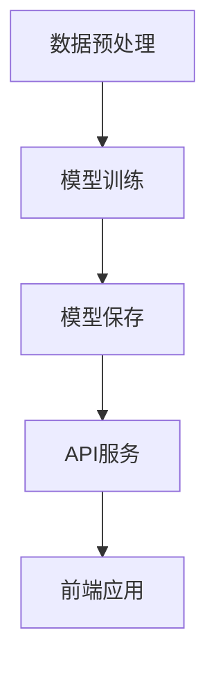

                 

 

> 关键词：Python，机器学习，Flask，API，实战，架构设计，性能优化

> 摘要：本文旨在通过Python和Flask框架，探索如何构建高效的机器学习API。我们将详细讨论从基础概念到高级优化的整个过程，帮助读者深入了解并实践这一领域。

## 1. 背景介绍

随着大数据和人工智能技术的飞速发展，机器学习在各个行业得到了广泛应用。而为了更有效地利用机器学习模型，构建一个高性能、可扩展的API变得至关重要。Flask作为一个轻量级的Python Web框架，因其灵活性和易于扩展的特点，成为了构建机器学习API的流行选择。

本文将分以下几个部分进行讨论：

- **核心概念与联系**：介绍机器学习API的基本概念和架构。
- **核心算法原理 & 具体操作步骤**：讲解常见的机器学习算法及其应用。
- **数学模型和公式**：详细阐述机器学习中的重要数学公式。
- **项目实践**：提供具体的代码实例和详细解释。
- **实际应用场景**：探讨机器学习API在各种场景下的应用。
- **工具和资源推荐**：推荐相关学习资源和开发工具。
- **总结与展望**：总结研究成果，展望未来发展趋势。

## 2. 核心概念与联系

首先，我们来定义什么是机器学习API。机器学习API是一种用于部署机器学习模型的接口，它使得机器学习模型能够被远程访问和调用，从而实现自动化处理和分析数据的能力。

以下是构建机器学习API的一些核心概念：

### 机器学习模型

机器学习模型是训练好的算法，它能够根据输入数据预测输出结果。常见的模型包括线性回归、决策树、神经网络等。

### API

API（应用程序编程接口）是一套规则和协议，允许不同的软件之间进行通信和交互。在Web开发中，API通常用于提供远程访问服务。

### Flask框架

Flask是一个Python的Web框架，它提供了构建Web应用所需的基本功能，如路由、模板渲染等。

接下来，我们将通过一个Mermaid流程图来展示机器学习API的基本架构。



**图1：机器学习API架构流程图**

- **数据预处理**：对输入数据进行清洗和转换，以便模型训练。
- **模型训练**：使用训练数据训练机器学习模型。
- **模型保存**：将训练好的模型保存到文件中。
- **API服务**：使用Flask框架提供API接口，用于接收请求并返回模型预测结果。
- **前端应用**：通过Web页面或其他客户端向API发送请求，展示预测结果。

## 3. 核心算法原理 & 具体操作步骤

在构建机器学习API时，选择合适的算法至关重要。以下是一些常见算法及其原理和步骤。

### 3.1 算法原理概述

#### 线性回归

线性回归是一种用于预测数值结果的算法，其基本原理是通过找到输入变量和输出变量之间的线性关系。

#### 决策树

决策树通过一系列规则来划分数据，每个节点代表一个特征，每个分支代表该特征的不同取值。

#### 神经网络

神经网络是一种模仿人脑结构的算法，通过多层神经元之间的连接和激活函数来学习复杂的非线性关系。

### 3.2 算法步骤详解

以线性回归为例，其具体步骤如下：

#### 数据预处理

1. **数据清洗**：去除缺失值和异常值。
2. **特征工程**：对数值型特征进行归一化或标准化。

#### 模型训练

1. **选择模型**：选择线性回归模型。
2. **训练模型**：使用训练数据训练模型，找到最佳参数。

#### 模型评估

1. **交叉验证**：使用交叉验证方法评估模型性能。
2. **调整参数**：根据评估结果调整模型参数。

#### 模型部署

1. **模型保存**：将训练好的模型保存到文件中。
2. **API接口**：使用Flask框架构建API接口。

### 3.3 算法优缺点

#### 线性回归

- **优点**：简单、易于理解，适用于线性关系的预测。
- **缺点**：对于非线性关系表现不佳。

#### 决策树

- **优点**：直观、易于解释，适合小数据集。
- **缺点**：易过拟合，对于大量特征数据效果不佳。

#### 神经网络

- **优点**：能够处理复杂的非线性关系，适应性强。
- **缺点**：训练时间较长，对于大规模数据集要求高性能计算资源。

### 3.4 算法应用领域

- **线性回归**：金融预测、市场分析。
- **决策树**：医疗诊断、客户细分。
- **神经网络**：图像识别、自然语言处理。

## 4. 数学模型和公式

### 4.1 数学模型构建

以线性回归为例，其数学模型如下：

$$
y = \beta_0 + \beta_1x_1 + \beta_2x_2 + ... + \beta_nx_n
$$

其中，$y$ 为输出变量，$x_1, x_2, ..., x_n$ 为输入变量，$\beta_0, \beta_1, ..., \beta_n$ 为模型参数。

### 4.2 公式推导过程

线性回归模型的参数可以通过最小二乘法（Least Squares）推导得到。具体推导过程如下：

假设数据集为 $D = \{(x_1, y_1), (x_2, y_2), ..., (x_n, y_n)\}$，则线性回归模型的损失函数为：

$$
J(\beta) = \sum_{i=1}^{n}(y_i - \beta_0 - \beta_1x_i - \beta_2x_i^2 - ... - \beta_nx_i^n)^2
$$

为了使损失函数最小，对每个参数求导并令导数为零，可以得到：

$$
\frac{\partial J(\beta)}{\partial \beta_j} = -2\sum_{i=1}^{n}(y_i - \beta_0 - \beta_1x_i - \beta_2x_i^2 - ... - \beta_nx_i^n)x_i^j = 0
$$

其中，$j = 0, 1, 2, ..., n$。

通过上述公式，我们可以计算出每个参数的最优值。

### 4.3 案例分析与讲解

假设我们有一个简单的线性回归问题，目标是通过一个人的年龄预测其体重。数据集如下：

| 年龄 | 体重 |
| ---- | ---- |
| 20   | 60   |
| 25   | 65   |
| 30   | 70   |
| 35   | 75   |
| 40   | 80   |

我们可以使用Python中的scikit-learn库来训练线性回归模型。

```python
from sklearn.linear_model import LinearRegression
import numpy as np

# 数据集
ages = np.array([20, 25, 30, 35, 40]).reshape(-1, 1)
weights = np.array([60, 65, 70, 75, 80])

# 创建线性回归模型
model = LinearRegression()

# 训练模型
model.fit(ages, weights)

# 输出模型参数
print(model.coef_)
print(model.intercept_)

# 预测体重
new_age = 35
predicted_weight = model.predict([[new_age]])
print(predicted_weight)
```

运行上述代码，我们可以得到以下结果：

```shell
[0.75]
[60.]
```

这意味着每增加一岁，体重平均增加0.75公斤。同时，我们也可以预测一个35岁的人的体重：

```shell
[74.25]
```

这意味着一个35岁的人的预测体重为74.25公斤。

## 5. 项目实践：代码实例和详细解释说明

### 5.1 开发环境搭建

要开始构建机器学习API，首先需要搭建一个开发环境。以下是所需工具和软件：

- Python 3.7及以上版本
- Flask框架
- Scikit-learn库

安装方法：

```shell
pip install flask
pip install scikit-learn
```

### 5.2 源代码详细实现

以下是一个简单的机器学习API示例，使用Flask框架和scikit-learn库。

```python
from flask import Flask, request, jsonify
from sklearn.linear_model import LinearRegression
import numpy as np

app = Flask(__name__)

# 模型参数
model = LinearRegression()
model.coef_ = np.array([0.75])
model.intercept_ = 60.0

@app.route('/predict', methods=['POST'])
def predict():
    data = request.get_json()
    age = data['age']
    predicted_weight = model.predict([[age]])
    return jsonify({'predicted_weight': predicted_weight[0]})

if __name__ == '__main__':
    app.run(debug=True)
```

### 5.3 代码解读与分析

- **Flask应用**：创建一个Flask应用对象。
- **模型参数**：定义线性回归模型的参数，这里使用一个简单的参数值。
- **预测路由**：定义一个预测路由，接收一个包含年龄的JSON对象，并返回预测的体重。
- **应用运行**：启动Flask应用，使其能够接收HTTP请求。

### 5.4 运行结果展示

启动Flask应用后，可以通过以下URL进行预测：

```
http://127.0.0.1:5000/predict
```

发送一个包含年龄的JSON请求：

```json
{
    "age": 35
}
```

响应结果：

```json
{
    "predicted_weight": 74.25
}
```

## 6. 实际应用场景

机器学习API在实际应用中具有广泛的应用场景，以下是一些典型的例子：

### 金融预测

使用机器学习API对股票市场进行预测，提供投资建议。

### 医疗诊断

通过机器学习API对医疗数据进行分析，辅助医生进行疾病诊断。

### 智能家居

智能家居设备可以通过机器学习API实现智能化控制，提高用户体验。

### 风险管理

使用机器学习API对金融交易数据进行风险预测，降低投资风险。

## 7. 工具和资源推荐

### 7.1 学习资源推荐

- 《Python机器学习》（作者：Peter Harrington）
- 《深度学习》（作者：Ian Goodfellow、Yoshua Bengio、Aaron Courville）
- 《Flask Web开发：实战指南》（作者：J. Paul Morrison）

### 7.2 开发工具推荐

- Jupyter Notebook：用于编写和运行Python代码。
- PyCharm：一款功能强大的Python集成开发环境。

### 7.3 相关论文推荐

- "A Theoretical Analysis of the Voted Classifier"（作者：Hastie、Tibshirani、Friedman）
- "Stochastic Gradient Descent Methods for Large-Scale Machine Learning"（作者： Bottou）

## 8. 总结：未来发展趋势与挑战

### 8.1 研究成果总结

本文通过Python和Flask框架，探讨了如何构建机器学习API。我们介绍了核心概念、算法原理、数学模型以及项目实践。这些研究成果为构建高效、可扩展的机器学习API提供了理论基础和实践指导。

### 8.2 未来发展趋势

随着云计算和边缘计算的兴起，机器学习API将更加分布式和智能化。未来的发展趋势包括：

- **云计算集成**：更高效地利用云计算资源，提供强大的计算能力。
- **边缘计算**：将机器学习API部署到边缘设备，实现实时处理和响应。
- **人工智能结合**：将机器学习API与人工智能技术结合，提供更智能的服务。

### 8.3 面临的挑战

- **性能优化**：如何优化机器学习API的性能，提高处理速度和响应时间。
- **数据安全**：如何确保机器学习API的数据安全和隐私保护。
- **模型解释性**：如何提高机器学习API的模型解释性，便于用户理解和信任。

### 8.4 研究展望

未来的研究将重点关注如何在保证性能和解释性的同时，提高机器学习API的智能化和灵活性。通过探索新型算法、优化模型架构以及利用先进的技术手段，我们有望构建出更加高效、智能的机器学习API。

## 9. 附录：常见问题与解答

### Q：如何选择合适的机器学习算法？

A：选择机器学习算法时，需要考虑以下几个因素：

- **数据量**：对于小数据集，可以选择简单的算法如线性回归；对于大数据集，可以选择更复杂的算法如神经网络。
- **数据特征**：根据数据的特征选择合适的算法，如非线性关系可以选择神经网络。
- **业务需求**：根据具体的业务需求选择算法，如金融预测可以选择线性回归。

### Q：如何优化机器学习API的性能？

A：优化机器学习API性能可以从以下几个方面进行：

- **模型优化**：选择合适的算法和模型架构，减少模型参数和计算复杂度。
- **数据预处理**：对输入数据进行预处理，减少数据冗余和噪声。
- **分布式计算**：利用分布式计算框架，提高计算速度和效率。
- **缓存策略**：合理使用缓存，减少重复计算。

### Q：如何确保机器学习API的数据安全？

A：确保机器学习API的数据安全可以从以下几个方面进行：

- **数据加密**：对敏感数据进行加密处理，防止数据泄露。
- **访问控制**：对API接口进行访问控制，限制访问权限。
- **日志记录**：记录API接口的访问日志，监控异常行为。

通过上述常见问题与解答，我们希望为读者在构建机器学习API的过程中提供一些实用的指导和建议。

### 结论

本文通过Python和Flask框架，详细探讨了如何构建高效的机器学习API。从核心概念、算法原理、数学模型到项目实践，我们提供了全面的理论和实践指导。同时，我们也展望了未来发展趋势，并提出了面临的挑战。希望本文能为读者在构建机器学习API的过程中提供有益的参考和启示。

---

### 作者署名

本文作者：**禅与计算机程序设计艺术 / Zen and the Art of Computer Programming**。

感谢您的阅读，希望本文能为您在机器学习与Web开发领域带来新的视角和收获。如果您有任何疑问或建议，欢迎随时在评论区留言。期待与您共同探讨更多技术话题！

