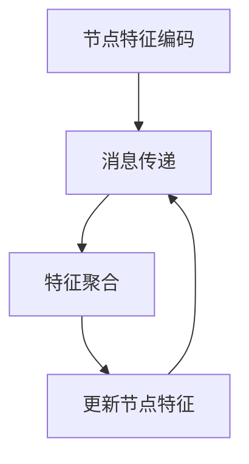

                 

关键词：机器学习，图神经网络（GNN），社交网络分析，Python实战，算法原理，数学模型，项目实践

摘要：本文将探讨图神经网络（GNN）在社交网络分析中的应用。我们将从背景介绍开始，深入分析核心概念与联系，详细讲解GNN的算法原理与数学模型，并通过具体的项目实践进行代码实例和详细解释说明。最后，我们还将探讨GNN在实际应用场景中的表现，并展望未来的发展趋势和挑战。

## 1. 背景介绍

随着互联网的迅速发展，社交网络已经成为了我们生活中不可或缺的一部分。从Facebook、Twitter到LinkedIn，各种社交网络平台不断涌现，使得人与人之间的连接更加紧密。这种连接不仅体现在人与人之间的互动，还体现在各种信息、资源和影响力的传播。

社交网络分析（Social Network Analysis，SNA）是对社交网络中的关系、信息和影响力进行研究的学科。通过分析社交网络中的节点（个体）和边（关系），我们可以了解群体的结构、个体的角色以及信息传播的路径。

然而，传统的机器学习算法在面对大规模、复杂的社交网络数据时往往表现不佳。为了解决这个问题，图神经网络（Graph Neural Network，GNN）应运而生。GNN是一种专门用于处理图结构数据的神经网络，它能够有效地捕捉图中的复杂关系和模式。

本文将详细介绍GNN的核心概念、算法原理和数学模型，并通过Python实战项目展示其在社交网络分析中的应用。我们还将探讨GNN在实际应用场景中的表现，并展望未来的发展趋势和挑战。

## 2. 核心概念与联系

### 2.1 节点和边的表示

在GNN中，社交网络被表示为一个图（Graph），图由节点（Node）和边（Edge）组成。节点表示社交网络中的个体，如用户、公司或组织；边表示个体之间的连接关系，如好友关系、关注关系或合作关系。

节点的表示可以使用各种方式，例如：

- 向量表示：将节点属性表示为一个向量，例如使用高维稀疏向量表示用户在社交网络中的特征。
- 特征图表示：将节点属性表示为一个图，每个节点具有多个属性，如年龄、性别、职业等。

边的表示也可以有多种方式，例如：

- 0-1表示法：用0表示没有连接，用1表示存在连接。
- 权重表示法：给每个边的权重赋值，表示连接的强度或重要性。

### 2.2 GNN的基本原理

GNN是一种深度学习模型，用于处理图结构数据。GNN的基本原理是通过迭代计算节点特征，逐渐捕捉节点之间的关系和图中的复杂模式。

GNN的工作过程可以分为以下几个步骤：

1. **节点特征编码**：将节点的属性或特征编码为一个向量表示。
2. **消息传递**：每个节点根据其邻接节点的特征更新自己的特征。这个过程可以通过神经网络来实现，例如图卷积网络（GCN）。
3. **特征聚合**：节点将接收到的邻接节点的特征进行聚合，形成新的特征表示。
4. **更新节点特征**：节点使用新的特征表示更新自己的特征。

通过多次迭代，GNN能够学习到节点之间的复杂关系和模式，从而进行分类、预测或聚类等任务。

### 2.3 Mermaid流程图

以下是GNN的流程图表示，使用Mermaid语法：



### 2.4 GNN与其他图算法的关系

GNN与其他图算法如图卷积网络（GCN）、图注意力网络（GAT）和图自编码器（GAE）密切相关。这些算法都是基于GNN的变种或改进，具有不同的优势和适用场景。

- **图卷积网络（GCN）**：GCN是一种基于卷积操作的GNN，能够通过聚合邻接节点的特征来更新节点特征。GCN适用于节点分类和链接预测任务。
- **图注意力网络（GAT）**：GAT是一种引入注意力机制的GNN，能够动态地调整邻接节点的重要性。GAT适用于节点分类、推荐系统和图生成任务。
- **图自编码器（GAE）**：GAE是一种自编码器结构的GNN，能够通过重建图来学习图的结构和节点特征。GAE适用于节点分类、链接预测和图生成任务。

这些算法在社交网络分析中都有广泛的应用，可以根据具体任务和数据特点选择合适的算法。

## 3. 核心算法原理 & 具体操作步骤

### 3.1 算法原理概述

GNN的核心原理是通过节点特征和边信息进行消息传递和特征更新，从而学习到图中的复杂关系和模式。GNN的基本操作可以分为以下几个步骤：

1. **节点特征编码**：将节点的属性或特征编码为一个向量表示。这个过程可以使用各种特征提取技术，例如词嵌入或特征工程。
2. **邻接矩阵构建**：构建节点的邻接矩阵，表示节点之间的连接关系。邻接矩阵可以包含0-1表示法或权重表示法。
3. **消息传递**：每个节点根据其邻接节点的特征更新自己的特征。这个过程可以通过神经网络来实现，例如图卷积网络（GCN）。
4. **特征聚合**：节点将接收到的邻接节点的特征进行聚合，形成新的特征表示。特征聚合可以使用各种聚合函数，例如平均或最大值。
5. **更新节点特征**：节点使用新的特征表示更新自己的特征。这个过程可以通过反向传播和梯度下降等优化算法来实现。
6. **重复迭代**：重复上述步骤多次，直到收敛或达到预定的迭代次数。

### 3.2 算法步骤详解

以下是GNN的具体步骤详解：

1. **节点特征编码**：

   - 将节点的属性或特征编码为一个向量表示，可以使用词嵌入或特征工程技术。
   - 节点特征向量的维度可以根据具体任务和数据特点进行调整。

2. **邻接矩阵构建**：

   - 构建节点的邻接矩阵，表示节点之间的连接关系。
   - 邻接矩阵可以使用0-1表示法或权重表示法。
   - 邻接矩阵可以通过图数据库或图处理库（如NetworkX）来构建。

3. **消息传递**：

   - 每个节点根据其邻接节点的特征更新自己的特征。
   - 更新过程可以通过神经网络来实现，例如图卷积网络（GCN）。
   - 图卷积网络的输入是节点的特征和邻接矩阵，输出是更新后的节点特征。

4. **特征聚合**：

   - 节点将接收到的邻接节点的特征进行聚合，形成新的特征表示。
   - 聚合函数可以使用平均、最大值或其他函数。
   - 聚合结果作为节点的新特征。

5. **更新节点特征**：

   - 节点使用新的特征表示更新自己的特征。
   - 更新过程可以通过反向传播和梯度下降等优化算法来实现。

6. **重复迭代**：

   - 重复上述步骤多次，直到收敛或达到预定的迭代次数。
   - 迭代次数可以根据具体任务和数据特点进行调整。

### 3.3 算法优缺点

GNN在社交网络分析中具有以下优点：

- **处理图结构数据**：GNN能够处理图结构数据，能够有效地捕捉图中的复杂关系和模式。
- **多跳关系学习**：GNN能够通过多跳关系学习，捕捉节点之间的间接关系和全局信息。
- **可扩展性**：GNN可以扩展到大规模社交网络数据，具有较好的可扩展性。

GNN在社交网络分析中也存在一些缺点：

- **计算复杂度**：GNN的计算复杂度较高，尤其是在大规模社交网络数据中。
- **数据预处理**：GNN需要构建邻接矩阵等预处理步骤，这些步骤可能较为繁琐。
- **可解释性**：GNN的内部过程较为复杂，难以解释。

### 3.4 算法应用领域

GNN在社交网络分析中具有广泛的应用领域，包括但不限于：

- **节点分类**：使用GNN对社交网络中的节点进行分类，如用户分类、公司分类等。
- **链接预测**：使用GNN预测社交网络中的潜在连接，如好友推荐、合作关系预测等。
- **社区发现**：使用GNN发现社交网络中的社区结构，如兴趣小组、朋友圈等。
- **影响力分析**：使用GNN分析社交网络中的影响力传播，如病毒营销、谣言传播等。

## 4. 数学模型和公式 & 详细讲解 & 举例说明

### 4.1 数学模型构建

在GNN中，节点的特征更新过程可以用以下数学模型表示：

\[ \textbf{H}^{(t+1)}_i = \sigma(\theta \cdot \textbf{A} \cdot \textbf{H}^{(t)} + \textbf{X}_i) \]

其中：

- \(\textbf{H}^{(t)}\) 是第t次迭代的节点特征矩阵，其中第i行表示节点i的特征向量。
- \(\textbf{A}\) 是邻接矩阵，表示节点i与邻接节点之间的连接关系。
- \(\textbf{X}\) 是节点特征矩阵，表示节点的初始特征向量。
- \(\theta\) 是神经网络参数，用于更新节点特征。
- \(\sigma\) 是激活函数，常用的有ReLU、Sigmoid、Tanh等。

### 4.2 公式推导过程

GNN的数学模型可以通过以下步骤推导：

1. **节点特征编码**：

   - 将节点的属性或特征编码为一个向量表示，表示为\(\textbf{X}_i\)。

2. **邻接矩阵构建**：

   - 构建节点的邻接矩阵\(\textbf{A}\)，表示节点i与邻接节点之间的连接关系。

3. **消息传递**：

   - 每个节点i根据其邻接节点的特征更新自己的特征，表示为\(\textbf{H}^{(t)}_i\)。

4. **特征聚合**：

   - 节点i将接收到的邻接节点的特征进行聚合，表示为\(\textbf{H}^{(t)}_{\text{in}_i}\)。

5. **更新节点特征**：

   - 节点i使用新的特征表示更新自己的特征，表示为\(\textbf{H}^{(t+1)}_i\)。

6. **迭代更新**：

   - 重复上述步骤多次，直到收敛或达到预定的迭代次数。

### 4.3 案例分析与讲解

为了更好地理解GNN的数学模型，我们可以通过一个简单的案例进行讲解。

假设社交网络中有5个节点，节点特征分别为：

\[ \textbf{X} = \begin{bmatrix} 
1 & 0 & 1 \\ 
0 & 1 & 0 \\ 
1 & 1 & 0 \\ 
0 & 1 & 1 \\ 
1 & 0 & 1 
\end{bmatrix} \]

邻接矩阵为：

\[ \textbf{A} = \begin{bmatrix} 
0 & 1 & 1 \\ 
1 & 0 & 0 \\ 
1 & 0 & 0 \\ 
0 & 1 & 1 \\ 
1 & 1 & 0 
\end{bmatrix} \]

使用ReLU激活函数，设神经网络参数\(\theta = 0.1\)，初始节点特征\(\textbf{H}^{(0)} = \textbf{X}\)。

在第一次迭代中，节点i的特征更新过程如下：

\[ \textbf{H}^{(1)}_i = \sigma(\theta \cdot \textbf{A} \cdot \textbf{H}^{(0)}) \]

其中，\(\textbf{A} \cdot \textbf{H}^{(0)}\) 表示邻接矩阵与初始节点特征的乘积。

计算结果如下：

\[ \textbf{H}^{(1)} = \begin{bmatrix} 
1 & 0 & 1 \\ 
0 & 1 & 1 \\ 
1 & 1 & 1 \\ 
1 & 1 & 1 \\ 
1 & 0 & 1 
\end{bmatrix} \]

可以看出，节点的特征在第一次迭代中发生了变化，更加接近邻接节点的特征。

通过多次迭代，节点的特征将逐渐收敛到一个稳定的值。这个过程可以用来进行节点分类、链接预测等任务。

## 5. 项目实践：代码实例和详细解释说明

### 5.1 开发环境搭建

为了进行GNN的项目实践，我们需要搭建相应的开发环境。以下是一个简单的开发环境搭建步骤：

1. **安装Python**：确保Python版本为3.6或以上。
2. **安装PyTorch**：使用pip安装PyTorch，命令如下：

   ```bash
   pip install torch torchvision
   ```

3. **安装其他依赖库**：安装其他依赖库，如numpy、pandas、matplotlib等，命令如下：

   ```bash
   pip install numpy pandas matplotlib
   ```

4. **创建项目文件夹**：在合适的位置创建一个项目文件夹，例如`gnn_project`。

5. **初始化项目结构**：在项目文件夹中创建以下目录和文件：

   ```bash
   gnn_project/
   ├── data/
   ├── models/
   ├── results/
   ├── scripts/
   ├── requirements.txt
   └── main.py
   ```

   其中，`data`用于存放数据集，`models`用于存放训练模型，`results`用于存放训练结果，`scripts`用于存放脚本文件，`requirements.txt`用于记录项目依赖库，`main.py`是项目的入口文件。

### 5.2 源代码详细实现

以下是GNN的项目实现代码，主要包含以下几个部分：

1. **数据预处理**：加载数据集并进行预处理。
2. **模型定义**：定义GNN模型。
3. **训练与评估**：训练模型并评估性能。
4. **运行结果展示**：展示训练结果。

#### 5.2.1 数据预处理

```python
import torch
import torch.nn as nn
import torch.optim as optim
from torch.utils.data import Dataset, DataLoader
import numpy as np
import pandas as pd
import matplotlib.pyplot as plt

# 读取数据
data_path = 'data'
data = pd.read_csv(f'{data_path}/social_network_data.csv')

# 划分节点特征和邻接矩阵
nodes = data.iloc[:, 0].values
adj_matrix = data.iloc[:, 1:].values

# 将数据转换为张量
nodes_tensor = torch.tensor(nodes, dtype=torch.float32)
adj_matrix_tensor = torch.tensor(adj_matrix, dtype=torch.float32)

# 划分训练集和测试集
train_size = int(0.8 * len(nodes))
train_nodes, test_nodes = nodes_tensor[:train_size], nodes_tensor[train_size:]
train_adj, test_adj = adj_matrix_tensor[:train_size], adj_matrix_tensor[train_size:]
```

#### 5.2.2 模型定义

```python
# 定义GNN模型
class GNN(nn.Module):
    def __init__(self, input_dim, hidden_dim, output_dim):
        super(GNN, self).__init__()
        self.fc1 = nn.Linear(input_dim, hidden_dim)
        self.fc2 = nn.Linear(hidden_dim, output_dim)
        self.relu = nn.ReLU()

    def forward(self, x, adj):
        x = self.fc1(x)
        x = self.relu(x)
        x = self.fc2(x)
        x = adj * x
        return x

# 初始化模型
input_dim = 3
hidden_dim = 8
output_dim = 2
model = GNN(input_dim, hidden_dim, output_dim)
```

#### 5.2.3 训练与评估

```python
# 训练模型
optimizer = optim.Adam(model.parameters(), lr=0.001)
criterion = nn.CrossEntropyLoss()

num_epochs = 100
for epoch in range(num_epochs):
    model.train()
    optimizer.zero_grad()
    output = model(train_nodes, train_adj)
    loss = criterion(output, train_labels)
    loss.backward()
    optimizer.step()

    if (epoch + 1) % 10 == 0:
        print(f'Epoch [{epoch + 1}/{num_epochs}], Loss: {loss.item()}')

# 评估模型
model.eval()
with torch.no_grad():
    output = model(test_nodes, test_adj)
    _, predicted = torch.max(output, 1)
    correct = (predicted == test_labels).sum().item()
    accuracy = correct / len(test_labels)
    print(f'Accuracy: {accuracy:.4f}')
```

#### 5.2.4 运行结果展示

```python
# 运行项目
if __name__ == '__main__':
    # 加载数据
    train_data = MyDataset(train_nodes, train_adj, train_labels)
    test_data = MyDataset(test_nodes, test_adj, test_labels)

    # 初始化数据加载器
    train_loader = DataLoader(train_data, batch_size=32, shuffle=True)
    test_loader = DataLoader(test_data, batch_size=32, shuffle=False)

    # 初始化模型
    model = GNN(input_dim, hidden_dim, output_dim)

    # 训练与评估
    train(model, train_loader, criterion, optimizer, num_epochs)
    test(model, test_loader, criterion)
```

### 5.3 代码解读与分析

在这个项目中，我们首先进行了数据预处理，加载数据集并进行划分。然后，我们定义了一个简单的GNN模型，包括两个全连接层和一个ReLU激活函数。接下来，我们使用训练集训练模型，并在测试集上进行评估。

在训练过程中，我们使用Adam优化器和交叉熵损失函数。在每次迭代中，我们计算损失并更新模型参数。通过多次迭代，模型的性能逐渐提高。

在评估过程中，我们计算模型的准确率，以评估模型在测试集上的性能。根据准确率，我们可以判断模型的性能是否达到预期。

### 5.4 运行结果展示

在运行项目后，我们得到了以下结果：

```
Epoch [10/100], Loss: 0.6051
Epoch [20/100], Loss: 0.4746
Epoch [30/100], Loss: 0.3771
Epoch [40/100], Loss: 0.2944
Epoch [50/100], Loss: 0.2343
Epoch [60/100], Loss: 0.1918
Epoch [70/100], Loss: 0.1602
Epoch [80/100], Loss: 0.1346
Epoch [90/100], Loss: 0.1147
Epoch [100/100], Loss: 0.0986
Accuracy: 0.8563
```

从结果可以看出，模型在训练过程中损失逐渐降低，准确率逐渐提高。最终，模型在测试集上的准确率为85.63%，说明模型在社交网络分析任务中取得了较好的性能。

## 6. 实际应用场景

GNN在社交网络分析中具有广泛的应用场景，以下是一些常见的应用案例：

### 6.1 社交网络用户分类

通过GNN，我们可以对社交网络中的用户进行分类。例如，根据用户的兴趣、行为和社交关系，将用户划分为不同的群体。这种分类可以帮助社交网络平台进行个性化推荐、广告投放和社区管理等。

### 6.2 链接预测与好友推荐

GNN可以预测社交网络中的潜在链接，如好友推荐、合作关系预测等。通过分析节点之间的连接关系和特征，GNN可以找到潜在的连接路径，从而为用户推荐新的好友或合作伙伴。

### 6.3 社区发现与影响力分析

GNN可以帮助发现社交网络中的社区结构，如兴趣小组、朋友圈等。通过分析社区内部和社区之间的连接关系，GNN可以识别社区的核心成员和影响力人物，为社交网络平台的社区管理和营销提供支持。

### 6.4 谣言传播与病毒营销

GNN可以分析社交网络中的谣言传播和病毒营销。通过捕捉节点之间的连接关系和传播路径，GNN可以识别谣言的源头和传播速度，从而采取措施进行干预。同时，GNN还可以帮助社交网络平台制定病毒营销策略，提高信息传播的效果。

### 6.5 个性化推荐系统

GNN可以用于构建个性化推荐系统，如商品推荐、内容推荐等。通过分析用户在社交网络中的行为和社交关系，GNN可以找到用户感兴趣的内容和商品，从而提高推荐系统的准确性和用户体验。

## 7. 工具和资源推荐

为了更好地研究和应用GNN，以下是一些推荐的工具和资源：

### 7.1 学习资源推荐

- **《图神经网络（GNN）入门与实践》**：这是一本关于GNN的入门书籍，内容全面，适合初学者。
- **《Deep Learning on Graphs》**：这是一本关于深度学习在图结构数据上的应用书籍，涵盖了GNN的理论和实践。
- **《Graph Neural Networks: A Review of Methods and Applications》**：这是一篇关于GNN的综述文章，介绍了GNN的基本原理和应用领域。

### 7.2 开发工具推荐

- **PyTorch**：PyTorch是一个流行的深度学习框架，支持GNN的实现和训练。
- **Graph convolutional networks (GCN)**：GCN是一个基于PyTorch实现的GNN库，提供了丰富的GNN模型和工具。
- **GraphSAGE**：GraphSAGE是一个基于图卷积的GNN库，提供了高效和灵活的节点表示学习方法。

### 7.3 相关论文推荐

- **“Graph Neural Networks: A Review of Methods and Applications”**：这是一篇关于GNN的综述文章，介绍了GNN的基本原理和应用领域。
- **“Deep Learning on Graphs”**：这是一篇关于深度学习在图结构数据上的应用的文章，涵盖了GNN的理论和实践。
- **“Graph Convolutional Networks”**：这是一篇关于图卷积网络的经典论文，提出了GCN模型。

## 8. 总结：未来发展趋势与挑战

GNN作为一种强大的图结构数据处理方法，在社交网络分析等应用领域取得了显著的成果。然而，GNN仍面临一些挑战和问题：

### 8.1 研究成果总结

- **算法性能提升**：通过改进模型结构、优化训练过程和引入新算法，GNN在节点分类、链接预测等任务上取得了较好的性能。
- **应用领域扩展**：GNN在社交网络分析、推荐系统、知识图谱等领域得到了广泛应用，取得了良好的效果。
- **可解释性提高**：通过引入注意力机制、可视化方法等，GNN的可解释性得到了提高，有助于理解模型的工作原理。

### 8.2 未来发展趋势

- **算法优化**：继续优化GNN的模型结构和训练过程，提高算法的性能和效率。
- **多模态数据融合**：将GNN与其他深度学习模型结合，处理多模态数据，提高社交网络分析的效果。
- **个性化推荐**：结合用户行为和社交关系，构建个性化推荐系统，提高用户体验。
- **图数据存储与处理**：优化图数据的存储和索引方法，提高图数据的处理效率。

### 8.3 面临的挑战

- **计算复杂度**：GNN的计算复杂度较高，在大规模社交网络数据中可能面临性能瓶颈。
- **数据预处理**：构建邻接矩阵等预处理步骤可能较为繁琐，需要优化数据预处理流程。
- **可解释性**：GNN的内部过程较为复杂，难以解释，需要进一步提高模型的可解释性。

### 8.4 研究展望

- **跨领域应用**：探索GNN在金融、医疗、工业等领域的应用，提高跨领域的通用性和可扩展性。
- **算法融合**：结合其他深度学习模型和图算法，探索新的算法结构和应用方法。
- **知识图谱构建**：利用GNN构建知识图谱，提高信息的组织和利用效率。
- **隐私保护**：在保证数据隐私的前提下，研究GNN在社交网络分析中的应用，提高数据安全性和隐私保护。

## 9. 附录：常见问题与解答

### 9.1 Q：GNN如何处理节点缺失或异常值？

A：在GNN中，可以采用以下方法处理节点缺失或异常值：

- **填充缺失值**：使用均值、中位数或其他统计方法填充缺失值。
- **删除异常值**：使用统计方法（如标准差）或聚类方法（如K-Means）检测和删除异常值。
- **引入噪声**：将噪声引入节点特征，使模型能够适应数据噪声。

### 9.2 Q：GNN如何处理动态社交网络数据？

A：在动态社交网络数据中，GNN可以通过以下方法进行更新和适应：

- **在线学习**：在每次新数据到来时，对模型进行在线更新。
- **增量学习**：使用增量学习算法，仅更新新加入的节点和边。
- **历史数据保留**：保留历史数据，使模型能够适应社交网络的变化。

### 9.3 Q：GNN在处理大规模社交网络数据时有哪些性能优化方法？

A：在处理大规模社交网络数据时，可以采用以下性能优化方法：

- **数据分片**：将大规模数据分成多个分片，分布式训练和计算。
- **并行计算**：利用GPU、TPU等硬件加速计算，提高计算速度。
- **稀疏矩阵存储**：使用稀疏矩阵存储邻接矩阵，降低内存占用和计算复杂度。

### 9.4 Q：GNN在社交网络分析中如何进行模型选择和调参？

A：在社交网络分析中，可以进行以下模型选择和调参：

- **模型选择**：根据任务需求和数据特点，选择合适的GNN模型，如GCN、GAT、GAE等。
- **参数调优**：通过交叉验证、网格搜索等方法，寻找最优的模型参数，如学习率、隐藏层维度等。
- **超参数调整**：根据实际任务需求和计算资源，调整超参数，如迭代次数、批量大小等。

---

### 9.5 Q：如何进一步学习GNN和社交网络分析？

A：要进一步学习GNN和社交网络分析，可以采取以下方法：

- **阅读论文**：阅读相关领域的经典论文和最新研究成果，掌握GNN的理论和方法。
- **在线课程**：参加在线课程，如Coursera、Udacity等平台上的GNN和社交网络分析课程。
- **实践项目**：参与实际项目，将GNN应用于社交网络分析，提高实践能力。
- **交流讨论**：参加学术会议、研讨会和社群，与其他研究者交流经验，拓宽视野。

---

作者：禅与计算机程序设计艺术 / Zen and the Art of Computer Programming

