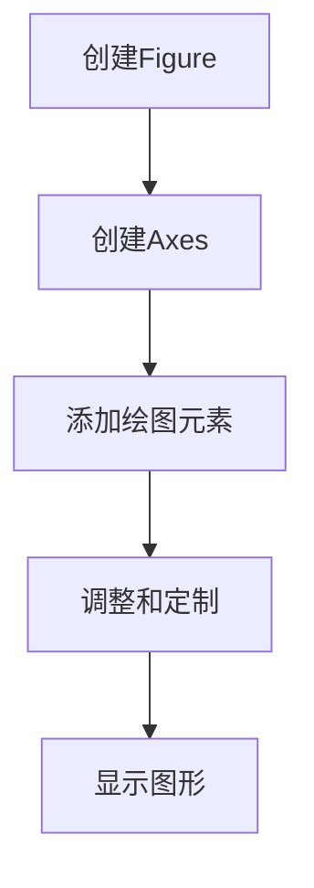
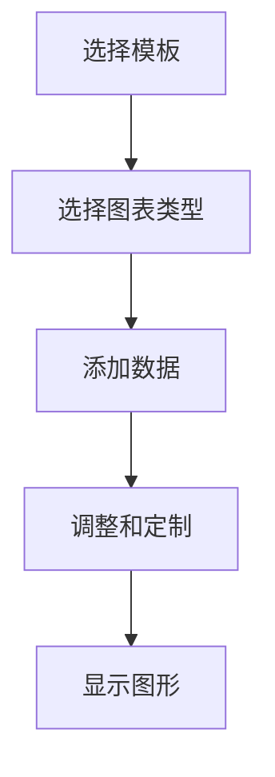
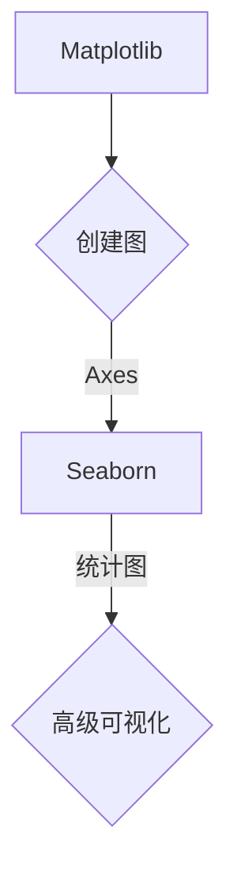

                 

摘要：本文旨在探讨Python中两种重要的数据可视化工具——Matplotlib和Seaborn的实战应用。通过详细的算法原理解析、代码实例展示和实际应用场景分析，读者将深入了解这两个库的功能与优势，并在机器学习项目中掌握数据可视化的艺术。

## 1. 背景介绍

在机器学习领域，数据可视化是一种强大的工具，它能够帮助我们更直观地理解数据、发现数据中的模式，从而为模型选择和调优提供依据。Matplotlib和Seaborn是Python中最常用的两个数据可视化库，它们各自具有独特的优势和特点。

Matplotlib是一个功能强大的绘图库，它支持多种图形类型，如散点图、折线图、柱状图等，并可以与多个数据源集成。Matplotlib的API设计简洁，易于上手，非常适合初学者和研究人员。

Seaborn是基于Matplotlib的高级可视化库，它提供了更加丰富的统计图形，如小提琴图、箱线图、热力图等。Seaborn的设计理念是使数据可视化变得更加优雅、直观，适合在报告和论文中使用。

本文将首先介绍Matplotlib和Seaborn的基本使用方法，然后深入探讨它们在机器学习项目中的应用，最后展望未来的发展趋势与挑战。

## 2. 核心概念与联系

### 2.1 Matplotlib

Matplotlib的核心概念是绘图对象，包括轴（Axes）、图（Figure）和绘图元素（如线、点、面）。其基本结构如下：



### 2.2 Seaborn

Seaborn的核心概念是统计图表，它通过内置的调色板、模板和多种统计图形，使得数据可视化更加直观。其基本结构如下：



### 2.3 联系

Matplotlib是Seaborn的基础，Seaborn则是在Matplotlib之上提供了一种更加高级的可视化方式。两者之间的联系如下：



## 3. 核心算法原理 & 具体操作步骤

### 3.1 算法原理概述

Matplotlib和Seaborn的核心算法原理可以归结为以下几个方面：

- **绘图基础**：了解坐标轴、数据点、线条、颜色、标签等基本元素的使用方法。
- **图表类型**：熟悉散点图、折线图、柱状图、箱线图等常见图表的绘制方法。
- **统计图形**：掌握Seaborn特有的统计图形，如小提琴图、热力图、回归图等。
- **交互式可视化**：学习如何使用交互式工具增强数据可视化效果，如Plotly库。

### 3.2 算法步骤详解

#### 3.2.1 Matplotlib基础操作

1. **创建Figure和Axes**：

   ```python
   import matplotlib.pyplot as plt
   
   fig, ax = plt.subplots()
   ```

2. **添加绘图元素**：

   ```python
   ax.plot(x, y)
   ax.scatter(x, y)
   ```

3. **调整和定制**：

   ```python
   ax.set_title('Title')
   ax.set_xlabel('X-axis')
   ax.set_ylabel('Y-axis')
   ```

4. **显示图形**：

   ```python
   plt.show()
   ```

#### 3.2.2 Seaborn高级操作

1. **选择模板**：

   ```python
   sns.set_theme(style="whitegrid")
   ```

2. **选择图表类型**：

   ```python
   sns.lineplot(data=data)
   sns.barplot(x=x, y=y, data=data)
   ```

3. **添加数据**：

   ```python
   sns.violinplot(x=x, y=y, data=data)
   sns.heatmap(data.corr(), annot=True)
   ```

4. **调整和定制**：

   ```python
   sns.regplot(x=x, y=y, data=data)
   ```

5. **显示图形**：

   ```python
   sns.show()
   ```

### 3.3 算法优缺点

#### Matplotlib

- 优点：功能强大、灵活，支持多种图表类型和定制选项。
- 缺点：API较为复杂，学习曲线较陡峭。

#### Seaborn

- 优点：设计优雅、易于使用，提供多种高级统计图形。
- 缺点：基于Matplotlib，因此在某些情况下可能不如Matplotlib灵活。

### 3.4 算法应用领域

Matplotlib和Seaborn广泛应用于数据分析和机器学习领域，包括：

- 数据探索：通过可视化数据，发现数据中的模式和异常值。
- 模型评估：通过可视化模型预测结果，评估模型的性能。
- 报告和论文：制作高质量的统计图形，提高报告的可读性。

## 4. 数学模型和公式 & 详细讲解 & 举例说明

### 4.1 数学模型构建

在数据可视化中，常用的数学模型包括：

- **散点图**：\(y = mx + b\)（线性回归模型）
- **折线图**：时间序列数据
- **柱状图**：概率分布函数

### 4.2 公式推导过程

以线性回归模型为例，公式推导如下：

1. **目标函数**：

   $$J(\theta) = \frac{1}{2m}\sum_{i=1}^{m}(h_\theta(x^{(i)}) - y^{(i)})^2$$

2. **梯度下降**：

   $$\theta_j := \theta_j - \alpha \frac{\partial J(\theta)}{\partial \theta_j}$$

### 4.3 案例分析与讲解

假设我们有一个简单的线性回归问题，目标是预测房价。数据集包含房屋的面积（x）和房价（y）。

1. **数据预处理**：

   ```python
   import pandas as pd
   
   data = pd.DataFrame({'Area': [1000, 2000, 3000, 4000], 'Price': [200, 400, 600, 800]})
   ```

2. **绘制散点图**：

   ```python
   import matplotlib.pyplot as plt
   
   plt.scatter(data['Area'], data['Price'])
   plt.xlabel('Area')
   plt.ylabel('Price')
   plt.show()
   ```

3. **拟合线性回归模型**：

   ```python
   from sklearn.linear_model import LinearRegression
   
   model = LinearRegression()
   model.fit(data[['Area']], data['Price'])
   
   print('斜率：', model.coef_)
   print('截距：', model.intercept_)
   ```

4. **绘制拟合曲线**：

   ```python
   x = data['Area']
   y = data['Price']
   y_pred = model.predict(x)
   
   plt.plot(x, y_pred, color='red')
   plt.scatter(x, y)
   plt.xlabel('Area')
   plt.ylabel('Price')
   plt.show()
   ```

## 5. 项目实践：代码实例和详细解释说明

### 5.1 开发环境搭建

1. 安装Python环境：

   ```bash
   python --version
   ```

2. 安装必要的库：

   ```bash
   pip install matplotlib seaborn pandas scikit-learn
   ```

### 5.2 源代码详细实现

以下是一个使用Matplotlib和Seaborn绘制数据可视化的完整示例：

```python
import matplotlib.pyplot as plt
import seaborn as sns
import pandas as pd
from sklearn.datasets import load_iris

# 加载鸢尾花数据集
iris = load_iris()
data = pd.DataFrame(iris.data, columns=iris.feature_names)
data['Species'] = iris.target

# Matplotlib散点图
plt.figure(figsize=(8, 6))
plt.scatter(data['sepal length (cm)'], data['sepal width (cm)'], c=data['Species'])
plt.xlabel('S

