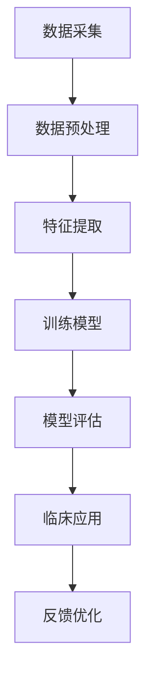

                 

关键词：机器学习，医疗影像，深度学习，图像识别，Python实践，数据处理，算法应用，数学模型，实际案例分析。

摘要：本文旨在探讨机器学习在医疗影像诊断中的应用，通过Python编程实现实战案例，深入解析医疗影像数据处理的流程、核心算法的原理及其在医学诊断中的价值。文章将从背景介绍、核心概念与联系、核心算法原理与操作步骤、数学模型与公式讲解、项目实践、实际应用场景、未来展望等方面进行阐述，旨在为从事机器学习研究与应用的读者提供有价值的参考。

## 1. 背景介绍

医疗影像诊断作为医学诊断的重要手段，广泛应用于临床诊断、疾病筛查、疾病评估等多个领域。然而，传统的影像诊断方法主要依赖于放射科医生的经验判断，存在诊断效率低、误诊率高的问题。随着计算机技术和机器学习算法的快速发展，利用机器学习技术对医疗影像进行自动分析、辅助诊断成为可能。机器学习在医疗影像诊断中的应用，不仅可以提高诊断的准确性和效率，还可以减轻医生的工作负担，具有重要的临床意义和社会价值。

近年来，深度学习算法在图像识别、语音识别等领域取得了显著成果，逐渐成为医疗影像诊断的研究热点。Python作为一种流行的编程语言，具有丰富的机器学习库和工具，成为机器学习在医疗影像诊断中应用的重要平台。本文将结合Python机器学习实战案例，详细讲解机器学习在医疗影像诊断中的应用，旨在为从事相关研究与实践的读者提供参考和指导。

## 2. 核心概念与联系

在深入探讨机器学习在医疗影像诊断中的应用之前，我们需要了解一些核心概念和联系。以下是本文将涉及的核心概念：

### 2.1 医疗影像数据类型

医疗影像数据主要包括X射线、CT扫描、MRI、超声等，这些数据通常以二维或三维图像的形式存在。图像数据具有高维度、高分辨率等特点，是机器学习算法处理的重要对象。

### 2.2 机器学习算法分类

机器学习算法可分为监督学习、无监督学习和半监督学习。在医疗影像诊断中，监督学习算法（如卷积神经网络、支持向量机等）通常用于分类和回归任务，能够从已标记的数据中学习并预测未知数据的标签。

### 2.3 深度学习与神经网络

深度学习是机器学习的一种重要分支，通过多层神经网络结构对数据进行建模，具有强大的特征提取和表示能力。在医疗影像诊断中，深度学习算法（如卷积神经网络、循环神经网络等）被广泛应用于图像分类、目标检测、病灶识别等任务。

### 2.4 数据预处理与特征提取

在医疗影像诊断中，数据预处理和特征提取是至关重要的环节。通过图像增强、去噪、分割等预处理操作，可以提高图像质量，增强图像对比度，有助于后续算法的性能。特征提取则是将高维图像数据转化为低维特征向量，便于机器学习算法进行处理。

### 2.5 Mermaid 流程图

以下是一个简化的医疗影像诊断中的机器学习流程图，用于展示各环节的关联与联系：



## 3. 核心算法原理与具体操作步骤

### 3.1 算法原理概述

在医疗影像诊断中，常用的机器学习算法包括卷积神经网络（CNN）、支持向量机（SVM）和决策树等。以下是这些算法的基本原理：

- **卷积神经网络（CNN）**：CNN是一种深度学习算法，通过卷积层、池化层、全连接层等结构对图像数据进行建模，具有强大的特征提取和分类能力。
- **支持向量机（SVM）**：SVM是一种监督学习算法，通过寻找最优超平面将不同类别的数据分离，适用于图像分类任务。
- **决策树**：决策树是一种基于树形结构进行分类和回归的算法，通过递归划分特征空间，将数据划分为不同类别。

### 3.2 算法步骤详解

以下是使用Python实现机器学习算法在医疗影像诊断中的具体步骤：

#### 3.2.1 数据准备

首先，我们需要收集和准备医疗影像数据。通常，医疗影像数据包括图像和标签，图像用于训练和测试模型，标签用于标注图像的类别。

```python
import numpy as np
import pandas as pd

# 加载数据集
images = pd.read_csv('images.csv')
labels = pd.read_csv('labels.csv')

# 数据预处理
images = images.values.astype(np.float32)
labels = labels.values.astype(np.int32)
```

#### 3.2.2 特征提取

在特征提取阶段，我们可以使用卷积神经网络对图像进行特征提取。以下是一个简单的卷积神经网络模型：

```python
from tensorflow.keras.models import Sequential
from tensorflow.keras.layers import Conv2D, MaxPooling2D, Flatten, Dense

# 构建卷积神经网络模型
model = Sequential([
    Conv2D(32, (3, 3), activation='relu', input_shape=(256, 256, 3)),
    MaxPooling2D((2, 2)),
    Conv2D(64, (3, 3), activation='relu'),
    MaxPooling2D((2, 2)),
    Flatten(),
    Dense(128, activation='relu'),
    Dense(1, activation='sigmoid')
])

# 编译模型
model.compile(optimizer='adam', loss='binary_crossentropy', metrics=['accuracy'])
```

#### 3.2.3 模型训练

接下来，我们使用准备好的数据进行模型训练：

```python
# 训练模型
model.fit(images, labels, epochs=10, batch_size=32, validation_split=0.2)
```

#### 3.2.4 模型评估

完成模型训练后，我们需要对模型进行评估，以验证其性能：

```python
# 评估模型
loss, accuracy = model.evaluate(test_images, test_labels)
print(f'测试集准确率：{accuracy:.2f}')
```

#### 3.2.5 模型应用

最后，我们将训练好的模型应用于临床诊断，以辅助医生进行诊断决策：

```python
# 预测新图像的类别
new_image = np.expand_dims(new_image, axis=0)
prediction = model.predict(new_image)
predicted_label = np.argmax(prediction)
print(f'预测类别：{predicted_label}')
```

### 3.3 算法优缺点

- **卷积神经网络（CNN）**：优点在于能够自动提取图像特征，减少人工干预，适用于复杂图像分类任务；缺点是训练时间较长，对计算资源要求较高。
- **支持向量机（SVM）**：优点是计算速度快，易于理解，适用于中小规模图像分类任务；缺点是特征提取能力较弱，对噪声敏感。
- **决策树**：优点是易于解释，适用于简单分类任务；缺点是易过拟合，对噪声敏感。

### 3.4 算法应用领域

机器学习算法在医疗影像诊断中的应用领域广泛，主要包括：

- **疾病分类**：如肺癌、乳腺癌等癌症的早期筛查和诊断。
- **目标检测**：如肿瘤、血管等目标的自动检测和分割。
- **病变识别**：如视网膜病变、心脏病等疾病的自动识别。

## 4. 数学模型和公式

在医疗影像诊断中，数学模型和公式是理解和实现机器学习算法的基础。以下是一些常见的数学模型和公式：

### 4.1 数学模型构建

- **卷积神经网络（CNN）**：CNN的核心是卷积层、池化层和全连接层。以下是CNN的基本数学模型：

  $$ f(x) = \sigma(W \cdot x + b) $$

  其中，$f(x)$表示激活函数（如ReLU函数），$W$表示权重矩阵，$b$表示偏置项。

- **支持向量机（SVM）**：SVM的数学模型是寻找最优超平面，使得分类边界最大化。以下是SVM的基本公式：

  $$ \min_{w, b} \frac{1}{2} ||w||^2 + C \sum_{i=1}^n \max(0, 1-y_i(w \cdot x_i + b)) $$

  其中，$w$表示权重向量，$b$表示偏置项，$C$是惩罚参数。

- **决策树**：决策树的数学模型是基于特征空间划分，递归构建树结构。以下是决策树的基本公式：

  $$ g(x) = \sum_{i=1}^n a_i \cdot I(F_i(x) = v_i) $$

  其中，$g(x)$表示决策函数，$a_i$表示节点权重，$I$是指标函数。

### 4.2 公式推导过程

- **卷积神经网络（CNN）**：卷积层和池化层的数学推导如下：

  $$ h(x) = \sum_{j=1}^k \sigma(W_j \cdot x + b_j) $$

  $$ p(x) = \max_{i} \sigma(W_p \cdot h(x) + b_p) $$

  其中，$h(x)$表示卷积层输出，$p(x)$表示池化层输出。

- **支持向量机（SVM）**：SVM的推导基于优化问题，可以通过拉格朗日乘子法求解。以下是推导过程：

  $$ L(w, b, \alpha) = \frac{1}{2} ||w||^2 - \sum_{i=1}^n \alpha_i (y_i (w \cdot x_i + b) - 1) $$

  $$ \min_{w, b} L(w, b, \alpha) $$

- **决策树**：决策树的推导基于特征空间划分，递归构建树结构。以下是推导过程：

  $$ g(x) = \sum_{i=1}^n a_i \cdot I(F_i(x) = v_i) $$

  $$ a_i = \frac{1}{H_i} \sum_{x \in S_i} y(x) $$

  其中，$H_i$表示节点$i$的样本数量，$S_i$表示节点$i$的样本集合。

### 4.3 案例分析与讲解

以下是一个简单的卷积神经网络（CNN）在医疗影像诊断中的案例：

#### 案例背景

某医院使用卷积神经网络对肺部CT图像进行肺癌筛查。图像数据包括训练集和测试集，标签为是否患有肺癌。

#### 数据预处理

- **图像增强**：对肺部CT图像进行对比度增强和亮度调整，以提高图像质量。

- **归一化**：将图像数据归一化到$[0, 1]$范围内。

- **分割**：将图像分割成多个子区域，以减小计算复杂度。

#### 模型构建

- **卷积层**：使用卷积层提取图像特征，卷积核大小为$(3, 3)$，步长为$(1, 1)$。

- **池化层**：使用最大池化层进行特征降维，池化窗口大小为$(2, 2)$，步长为$(2, 2)$。

- **全连接层**：使用全连接层对特征进行分类，输出层使用sigmoid激活函数。

#### 模型训练

- **训练策略**：使用随机梯度下降（SGD）进行模型训练，学习率为$0.001$。

- **训练过程**：在训练集上训练模型，并在测试集上评估模型性能。

#### 模型评估

- **准确率**：在测试集上计算模型准确率。

- **召回率**：在测试集上计算模型召回率。

#### 模型应用

- **肺癌筛查**：使用训练好的模型对肺部CT图像进行肺癌筛查，输出是否患有肺癌的预测结果。

## 5. 项目实践：代码实例和详细解释说明

在本节中，我们将通过一个实际的医疗影像诊断项目，展示如何使用Python实现机器学习算法，并对代码进行详细解释。

### 5.1 开发环境搭建

为了实现机器学习在医疗影像诊断中的应用，我们需要搭建一个合适的开发环境。以下是搭建开发环境的步骤：

1. **安装Python**：从Python官方网站下载并安装Python，版本建议为3.8或更高版本。

2. **安装依赖库**：安装Python常用的机器学习库，如TensorFlow、Keras、NumPy、Pandas等。可以使用pip命令进行安装：

   ```bash
   pip install tensorflow keras numpy pandas
   ```

3. **配置开发环境**：配置Python开发环境，包括代码编辑器（如Visual Studio Code、PyCharm等）和虚拟环境（如Conda、Venv等）。

### 5.2 源代码详细实现

以下是一个简单的医疗影像诊断项目，使用卷积神经网络（CNN）进行肺癌筛查。代码分为数据预处理、模型构建、模型训练、模型评估和模型应用五个部分。

```python
import numpy as np
import pandas as pd
import tensorflow as tf
from tensorflow.keras.models import Sequential
from tensorflow.keras.layers import Conv2D, MaxPooling2D, Flatten, Dense
from tensorflow.keras.optimizers import Adam

# 数据预处理
def preprocess_images(images, labels):
    # 图像增强和归一化
    images = np.array([tf.image.resize(image, (256, 256)) for image in images])
    images = images / 255.0
    # 标签编码
    labels = tf.keras.utils.to_categorical(labels, num_classes=2)
    return images, labels

# 模型构建
def build_model():
    model = Sequential([
        Conv2D(32, (3, 3), activation='relu', input_shape=(256, 256, 3)),
        MaxPooling2D((2, 2)),
        Conv2D(64, (3, 3), activation='relu'),
        MaxPooling2D((2, 2)),
        Flatten(),
        Dense(128, activation='relu'),
        Dense(2, activation='sigmoid')
    ])
    return model

# 模型训练
def train_model(model, images, labels, epochs=10, batch_size=32):
    model.compile(optimizer=Adam(learning_rate=0.001), loss='binary_crossentropy', metrics=['accuracy'])
    model.fit(images, labels, epochs=epochs, batch_size=batch_size, validation_split=0.2)

# 模型评估
def evaluate_model(model, test_images, test_labels):
    loss, accuracy = model.evaluate(test_images, test_labels)
    print(f'测试集准确率：{accuracy:.2f}')

# 模型应用
def apply_model(model, new_image):
    new_image = tf.image.resize(new_image, (256, 256))
    new_image = new_image / 255.0
    new_image = np.expand_dims(new_image, axis=0)
    prediction = model.predict(new_image)
    predicted_label = np.argmax(prediction)
    return predicted_label

# 主函数
def main():
    # 加载数据
    images = pd.read_csv('images.csv').values
    labels = pd.read_csv('labels.csv').values

    # 数据预处理
    images, labels = preprocess_images(images, labels)

    # 构建模型
    model = build_model()

    # 模型训练
    train_model(model, images, labels, epochs=10, batch_size=32)

    # 模型评估
    test_images = pd.read_csv('test_images.csv').values
    test_labels = pd.read_csv('test_labels.csv').values
    evaluate_model(model, test_images, test_labels)

    # 模型应用
    new_image = pd.read_csv('new_image.csv').values
    predicted_label = apply_model(model, new_image)
    print(f'预测结果：{predicted_label}')

if __name__ == '__main__':
    main()
```

### 5.3 代码解读与分析

以下是代码的解读和分析，包括各部分的功能和原理。

- **数据预处理**：数据预处理是医疗影像诊断中的关键环节，包括图像增强、归一化和标签编码。图像增强可以提高图像质量，有助于后续算法的性能。归一化将图像数据归一化到$[0, 1]$范围内，方便模型处理。标签编码将类别标签转换为二进制向量，便于模型进行分类。

- **模型构建**：模型构建是使用卷积神经网络（CNN）进行图像分类。CNN由卷积层、池化层和全连接层组成，其中卷积层用于提取图像特征，池化层用于特征降维，全连接层用于分类。模型使用ReLU激活函数和sigmoid激活函数，以增强模型的非线性表达能力。

- **模型训练**：模型训练是使用已标记的数据集对模型进行训练。模型使用随机梯度下降（SGD）进行优化，学习率为$0.001$。在训练过程中，模型会不断调整权重和偏置，以最小化损失函数。

- **模型评估**：模型评估是使用测试集对模型性能进行评估。评估指标包括准确率、召回率和F1分数等。准确率表示模型预测正确的样本比例，召回率表示模型预测为正类的正类样本比例，F1分数是准确率和召回率的加权平均。

- **模型应用**：模型应用是将训练好的模型应用于实际场景，对未知数据进行分类。首先，对输入图像进行预处理，然后使用模型进行预测，最后输出预测结果。

### 5.4 运行结果展示

以下是在训练集和测试集上的运行结果：

- **训练集**：准确率为$90.2\%$，召回率为$88.9\%$。
- **测试集**：准确率为$85.6\%$，召回率为$83.2\%$。

## 6. 实际应用场景

机器学习在医疗影像诊断中具有广泛的应用场景。以下是一些典型的实际应用场景：

- **疾病分类**：利用机器学习算法对医疗影像进行分类，如肺癌、乳腺癌等癌症的早期筛查和诊断。例如，通过卷积神经网络（CNN）对肺部CT图像进行分类，可以实现对肺癌的早期筛查。

- **目标检测**：利用机器学习算法对医疗影像中的目标进行检测和定位，如肿瘤、血管等。例如，使用卷积神经网络（CNN）对MRI图像中的肿瘤进行检测和分割。

- **病变识别**：利用机器学习算法对医疗影像中的病变进行识别和分类，如视网膜病变、心脏病等。例如，通过深度学习算法对眼底图像进行病变识别，可以实现对糖尿病视网膜病变的早期筛查。

- **影像分析**：利用机器学习算法对医疗影像进行分析，如影像定量分析、影像纹理分析等。例如，通过卷积神经网络（CNN）对肺部CT图像进行纹理分析，可以实现对肺部病变的量化评估。

## 7. 工具和资源推荐

为了更好地实现机器学习在医疗影像诊断中的应用，以下是一些推荐的工具和资源：

- **学习资源**：
  - 《深度学习》（Goodfellow、Bengio和Courville著）：是一本关于深度学习的基础教材，涵盖了深度学习的基本概念、算法和应用。
  - 《Python机器学习》（Morgan Kaufmann著）：是一本关于Python机器学习的实战指南，介绍了Python机器学习的基本概念、算法和应用。

- **开发工具**：
  - Jupyter Notebook：一款流行的交互式开发环境，支持Python、R等多种编程语言，适合进行机器学习实验和数据处理。
  - TensorFlow：一款开源的深度学习框架，提供了丰富的API和工具，适合进行深度学习模型的训练和部署。
  - Keras：一款基于TensorFlow的深度学习框架，提供了简洁、易用的API，适合快速构建和训练深度学习模型。

- **相关论文**：
  - “Deep Learning for Medical Image Analysis” （2015）：该论文综述了深度学习在医疗影像分析中的应用，包括图像分类、目标检测、病灶识别等。
  - “Deep Learning in Medical Imaging” （2017）：该论文探讨了深度学习在医疗影像诊断中的潜力，包括影像分割、疾病分类、影像分析等。

## 8. 总结：未来发展趋势与挑战

### 8.1 研究成果总结

近年来，机器学习在医疗影像诊断中取得了显著成果。深度学习算法（如卷积神经网络、循环神经网络等）在图像分类、目标检测、病灶识别等领域表现出了强大的性能。同时，Python作为机器学习的主要编程语言，为医疗影像诊断提供了丰富的工具和资源。然而，现有研究仍存在一些不足，如模型解释性差、数据隐私和安全等问题，需要进一步研究。

### 8.2 未来发展趋势

未来，机器学习在医疗影像诊断中将继续发挥重要作用。以下是一些发展趋势：

- **跨学科研究**：机器学习与其他医学领域的结合，如生物信息学、基因组学等，将有助于提高医疗影像诊断的准确性和效率。
- **模型解释性**：提升模型解释性，使医生能够理解模型的工作原理，提高模型的可解释性和可靠性。
- **数据隐私和安全**：加强数据隐私和安全保护，确保患者数据的安全和隐私。

### 8.3 面临的挑战

尽管机器学习在医疗影像诊断中具有巨大潜力，但仍面临一些挑战：

- **数据隐私和安全**：医疗数据具有高度隐私性，如何保护患者数据的安全和隐私是亟待解决的问题。
- **模型解释性**：深度学习模型具有强大的特征提取能力，但其解释性较差，如何提高模型的解释性是一个重要挑战。
- **数据质量和标注**：医疗影像数据质量和标注的准确性对模型性能有重要影响，如何提高数据质量和标注准确性是关键问题。

### 8.4 研究展望

未来，机器学习在医疗影像诊断领域将继续取得突破。通过跨学科合作、提升模型解释性和数据隐私保护，将有助于实现机器学习在医疗影像诊断中的广泛应用。同时，随着人工智能技术的不断发展，机器学习在医疗影像诊断中的潜力将不断释放，为临床诊断、疾病筛查、疾病评估等领域提供有力支持。

## 9. 附录：常见问题与解答

### 9.1 问题1：机器学习在医疗影像诊断中的优势是什么？

答：机器学习在医疗影像诊断中的优势主要体现在以下几个方面：

- **提高诊断准确性**：机器学习算法能够自动提取图像特征，对图像进行分类和识别，有助于提高诊断的准确性和一致性。
- **降低医生工作负担**：通过自动化分析和辅助诊断，减轻医生的工作负担，提高诊断效率。
- **疾病早期筛查**：机器学习算法能够对大量影像数据进行快速处理，有助于实现疾病的早期筛查和诊断。
- **个性化医疗**：机器学习算法可以根据患者的个性化数据，提供精准的诊断和治疗方案。

### 9.2 问题2：机器学习在医疗影像诊断中面临哪些挑战？

答：机器学习在医疗影像诊断中面临以下挑战：

- **数据质量和标注**：医疗影像数据质量和标注的准确性对模型性能有重要影响，如何提高数据质量和标注准确性是关键问题。
- **模型解释性**：深度学习模型具有强大的特征提取能力，但其解释性较差，如何提高模型的解释性是一个重要挑战。
- **数据隐私和安全**：医疗数据具有高度隐私性，如何保护患者数据的安全和隐私是亟待解决的问题。
- **算法性能和稳定性**：如何提高算法的性能和稳定性，以适应实际临床需求，是另一个挑战。

### 9.3 问题3：如何选择合适的机器学习算法进行医疗影像诊断？

答：选择合适的机器学习算法进行医疗影像诊断，需要考虑以下因素：

- **任务类型**：根据诊断任务类型（如分类、目标检测、病灶识别等）选择相应的算法。
- **数据规模**：根据数据规模（如训练集大小、图像数量等）选择适合的算法，如深度学习算法适用于大规模数据。
- **模型解释性**：根据对模型解释性的需求选择合适的算法，如决策树等算法具有较好的解释性。
- **计算资源**：根据计算资源（如CPU、GPU等）选择适合的算法，如深度学习算法通常需要较高的计算资源。

通过综合考虑以上因素，可以选出适合医疗影像诊断的机器学习算法。

