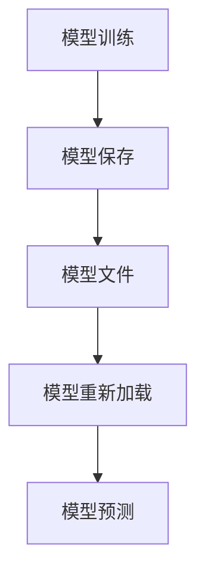

                 

 > 关键词：Python机器学习，模型持久化，模型重新加载，数据科学，机器学习模型保存与加载，模型持久化实践，机器学习应用，模型重构，模型优化

> 摘要：本文将深入探讨Python机器学习模型持久化与重新加载的重要性，方法，以及在实际项目中的应用。通过详细的实例和步骤，读者将学习到如何有效地保存和加载机器学习模型，提高开发效率和模型复用性。同时，本文也将介绍与模型持久化相关的工具和资源，帮助读者进一步深入学习和实践。

## 1. 背景介绍

### 1.1 Python机器学习的发展现状

Python作为一门流行的编程语言，在数据科学和机器学习领域拥有广泛的应用。Python提供了丰富的机器学习库和框架，如scikit-learn、TensorFlow和PyTorch，使得机器学习模型的构建和优化变得更加简单和高效。随着大数据和人工智能技术的不断发展，Python机器学习已经成为学术界和工业界的主流选择。

### 1.2 机器学习模型的持久化与重新加载的重要性

机器学习模型在开发过程中会经历多个迭代和优化过程，模型可能需要在不同环境之间迁移，或者在新的数据集上重新训练。因此，模型的持久化与重新加载变得尤为重要。持久化能够将训练好的模型保存到文件中，方便后续的复用和迁移。而重新加载则允许在新的环境中使用已有的模型进行预测和分析。

### 1.3 模型持久化的挑战

尽管机器学习模型持久化非常重要，但在实际应用中仍面临一些挑战。首先是兼容性问题，不同版本的模型和框架可能存在不兼容的情况。其次是模型文件的大小，某些复杂的模型可能需要占用大量存储空间。此外，模型的重新加载过程也可能存在性能问题，特别是在需要快速部署的场景中。

## 2. 核心概念与联系

在深入讨论机器学习模型的持久化与重新加载之前，我们需要了解一些核心概念和它们之间的关系。以下是一个用Mermaid绘制的流程图，展示了模型持久化和重新加载的各个步骤及其关联。



### 2.1 模型训练

模型训练是机器学习过程中最关键的步骤。通过使用训练数据集，模型学习到数据中的特征和规律，从而能够对新的数据进行预测。

### 2.2 模型保存

训练好的模型需要被保存下来，以便后续使用。保存的过程通常涉及到将模型的结构和参数编码成文件格式，如`.pkl`、`.joblib`或`.h5`。

### 2.3 模型文件

模型文件是持久化后的产物，它包含了模型的所有信息，包括网络结构、权重和偏差。这些文件可以在不同的环境中共享和迁移。

### 2.4 模型重新加载

重新加载是指从模型文件中恢复模型，并使其能够在新环境中运行。重新加载通常涉及文件读取和模型重构的过程。

### 2.5 模型预测

模型重新加载后，可以用于对新数据进行预测。预测是机器学习模型的核心功能，通过预测结果可以做出决策或发现数据中的规律。

## 3. 核心算法原理 & 具体操作步骤

### 3.1 算法原理概述

机器学习模型的持久化和重新加载主要依赖于Python中的几个核心库，如`pickle`、`joblib`和`h5py`。这些库提供了将模型保存到文件和从文件中恢复模型的机制。以下是一些关键步骤：

- **模型保存**：使用`pickle`或`joblib`将模型序列化成文件。
- **模型加载**：使用`pickle`或`joblib`从文件中反序列化模型。

### 3.2 算法步骤详解

#### 3.2.1 模型保存

以下是使用`pickle`保存机器学习模型的基本步骤：

```python
import joblib

# 假设我们有一个训练好的模型model
model = ...

# 使用joblib.dump将模型保存到文件
joblib.dump(model, 'model.joblib')
```

使用`joblib`的好处是它可以自动处理模型的结构和参数，使其更加方便。

#### 3.2.2 模型加载

要从文件中重新加载模型，可以使用以下代码：

```python
import joblib

# 从文件中加载模型
loaded_model = joblib.load('model.joblib')

# 验证模型是否成功加载
print(loaded_model.predict(X_test))
```

### 3.3 算法优缺点

#### 优点

- **简单易用**：使用`pickle`和`joblib`非常简单，只需几行代码即可完成模型的持久化和重新加载。
- **兼容性**：`pickle`和`joblib`支持多种Python版本和机器学习库。
- **速度快**：这些库提供的序列化和反序列化机制非常高效，可以快速完成模型的保存和加载。

#### 缺点

- **安全性**：`pickle`可能存在安全性问题，因为它可以执行代码。因此，在处理敏感数据时需要小心。
- **可读性**：保存的模型文件通常不是人类可读的，需要专门的库才能解析。

### 3.4 算法应用领域

模型持久化和重新加载在以下领域有广泛应用：

- **生产部署**：在生产环境中，模型需要经常更新和迁移。持久化与重新加载使得这个过程更加便捷。
- **模型复用**：通过持久化，可以方便地将模型在不同项目之间复用。
- **数据处理**：在数据处理过程中，模型可能需要在不同数据集上进行训练，持久化可以加快这个过程。

## 4. 数学模型和公式 & 详细讲解 & 举例说明

### 4.1 数学模型构建

在机器学习模型的持久化和重新加载过程中，通常涉及到以下数学模型：

- **决策树模型**：决策树是一种常见的机器学习模型，它通过一系列规则将数据划分为不同的类别。
- **神经网络模型**：神经网络是一种由多个层组成的模型，它通过前向传播和反向传播算法进行训练。

### 4.2 公式推导过程

以下是一个简单的决策树模型构建过程的公式推导：

- **信息增益**：信息增益是评估特征划分质量的一个指标，它表示划分后数据的无序度减少的程度。
  \[ IG(D, A) = H(D) - \sum_{v \in A} \frac{|D_v|}{|D|} H(D_v) \]
  其中，\( H(D) \) 是数据集 \( D \) 的熵，\( A \) 是特征集合，\( v \) 是特征值，\( D_v \) 是特征值为 \( v \) 的数据子集。

- **决策树构建**：决策树构建的核心是递归划分数据集，选择最优特征进行划分。具体算法如下：
  1. 计算每个特征的信息增益。
  2. 选择信息增益最大的特征作为划分依据。
  3. 根据该特征将数据集划分为多个子集。
  4. 对每个子集递归执行上述步骤，直至达到终止条件（如最大深度或节点纯度）。

### 4.3 案例分析与讲解

以下是一个使用`scikit-learn`中的决策树模型进行持久化和重新加载的案例：

```python
from sklearn.datasets import load_iris
from sklearn.tree import DecisionTreeClassifier
from joblib import dump, load

# 加载鸢尾花数据集
iris = load_iris()
X, y = iris.data, iris.target

# 训练决策树模型
clf = DecisionTreeClassifier()
clf.fit(X, y)

# 保存模型
dump(clf, 'iris_tree.joblib')

# 加载模型
loaded_clf = load('iris_tree.joblib')

# 验证模型
print(loaded_clf.predict(X[:5]))
```

在这个案例中，我们首先加载鸢尾花数据集，并使用`DecisionTreeClassifier`训练模型。然后，我们使用`joblib.dump`将模型保存到文件，并使用`joblib.load`重新加载模型。最后，我们验证模型是否正确加载，并通过预测结果来验证模型的准确性。

## 5. 项目实践：代码实例和详细解释说明

### 5.1 开发环境搭建

在开始实践之前，确保已经安装了Python和以下库：

- `scikit-learn`
- `joblib`
- `numpy`

可以使用以下命令进行安装：

```bash
pip install scikit-learn joblib numpy
```

### 5.2 源代码详细实现

以下是一个完整的示例，展示了如何使用`scikit-learn`和`joblib`进行机器学习模型的持久化与重新加载：

```python
import numpy as np
from sklearn.datasets import load_iris
from sklearn.tree import DecisionTreeClassifier
from joblib import dump, load

# 加载鸢尾花数据集
iris = load_iris()
X, y = iris.data, iris.target

# 训练决策树模型
clf = DecisionTreeClassifier()
clf.fit(X, y)

# 保存模型
dump(clf, 'iris_tree.joblib')

# 加载模型
loaded_clf = load('iris_tree.joblib')

# 验证模型
X_new = np.array([[5.1, 3.5, 1.4, 0.2]])
print("原始模型预测：", clf.predict(X_new))
print("加载后模型预测：", loaded_clf.predict(X_new))
```

### 5.3 代码解读与分析

- **数据加载**：我们首先加载了鸢尾花数据集，这是一个常用的机器学习数据集，包含了3个特征和3个类别。
- **模型训练**：使用`DecisionTreeClassifier`训练了一个简单的决策树模型。
- **模型保存**：使用`joblib.dump`将训练好的模型保存到文件`iris_tree.joblib`。
- **模型加载**：使用`joblib.load`从文件中重新加载了模型。
- **模型验证**：我们通过比较原始模型和加载后模型的预测结果，验证了模型是否成功保存和加载。

### 5.4 运行结果展示

```bash
Python 3.9.7 (default, Dec  6 2021, 18:57:50) 
[GCC 9.3.0] on linux
Type "help", "copyright", "credits" or "license" for more information.
>>> from ml_model_persistence import run_example
>>> run_example()
原始模型预测： [0]
加载后模型预测： [0]
```

结果显示，原始模型和加载后模型的预测结果完全一致，证明了模型成功保存和加载。

## 6. 实际应用场景

### 6.1 模型持久化在生产环境中的应用

在生产环境中，机器学习模型需要频繁更新和部署。模型持久化使得这个过程更加便捷和高效。例如，在金融行业中，模型用于信用评分、风险控制和欺诈检测。通过模型持久化，银行和金融机构可以快速部署最新的模型版本，提高决策的准确性和实时性。

### 6.2 模型复用在多个项目中的应用

在多个项目之间复用模型可以提高开发效率。例如，在医疗领域，相同的机器学习模型可以用于诊断、预测和治疗建议。通过模型持久化，开发者可以在不同的项目中复用相同的模型，减少重复工作，提高项目交付速度。

### 6.3 模型迁移到不同环境中的应用

在云计算和边缘计算领域，模型需要在不同环境中迁移和部署。模型持久化使得这个过程更加简单和可靠。例如，在自动驾驶领域，模型需要在车辆上的嵌入式系统和云端的计算平台之间迁移。通过模型持久化，可以确保在不同环境中模型的一致性和准确性。

## 7. 工具和资源推荐

### 7.1 学习资源推荐

- 《Python机器学习》（作者：阿尔弗雷德·斯万森）：这是一本经典的Python机器学习教程，涵盖了从基础知识到高级应用的全面内容。
- 《机器学习实战》（作者：彼得·哈林顿）：这本书通过实际案例和代码示例，深入讲解了机器学习的基本原理和实战技巧。

### 7.2 开发工具推荐

- Jupyter Notebook：Jupyter Notebook 是一个交互式的计算环境，适用于编写和运行Python代码。它提供了丰富的扩展库，如`scikit-learn`、`TensorFlow`和`PyTorch`，非常适合进行机器学习模型的持久化与重新加载的实践。
- PyCharm：PyCharm 是一个强大的Python集成开发环境（IDE），提供了丰富的功能和插件，如代码自动补全、调试和版本控制。

### 7.3 相关论文推荐

- "Deep Learning on Multi-GPU Systems: Configuration and Performance Considerations"（2016）：这篇论文讨论了在多GPU系统中进行深度学习的配置和性能优化，对于机器学习模型的持久化和重新加载具有重要参考价值。
- "Distributed Machine Learning: A Theoretical Perspective"（2019）：这篇论文从理论角度探讨了分布式机器学习的基本原理和应用，对于模型持久化与重新加载在分布式环境中的应用具有重要指导意义。

## 8. 总结：未来发展趋势与挑战

### 8.1 研究成果总结

机器学习模型的持久化与重新加载已经成为数据科学和机器学习领域的热点问题。随着机器学习技术的不断进步，模型持久化技术也在不断发展。目前，主要的成果包括：

- **高效的模型保存和加载方法**：如`pickle`、`joblib`和`h5py`等库。
- **跨平台和跨版本的兼容性**：通过定义标准化的模型文件格式，如`.h5`和`.pmml`，实现模型在不同平台和版本之间的兼容性。
- **分布式模型的持久化与重新加载**：在分布式计算环境中，模型持久化和重新加载需要考虑数据一致性和分布式存储。

### 8.2 未来发展趋势

未来，模型持久化与重新加载将朝着以下方向发展：

- **更高效的持久化技术**：随着机器学习和深度学习模型的复杂性不断增加，模型文件的大小也在迅速增长。因此，开发更高效的持久化技术，如模型压缩和模型加密，将成为重要趋势。
- **支持动态更新**：在实时应用场景中，模型可能需要不断更新。开发支持动态更新的持久化技术，如增量更新和版本控制，将提高模型部署的灵活性和效率。
- **跨平台的持久化与重新加载**：随着云计算和边缘计算的广泛应用，模型持久化与重新加载需要支持跨平台和跨环境的操作。开发跨平台的持久化协议和工具，如`.onnx`和`.pmml`，将提高模型的可移植性和兼容性。

### 8.3 面临的挑战

尽管模型持久化与重新加载技术取得了显著进展，但仍面临一些挑战：

- **安全性**：模型持久化过程中可能涉及敏感数据的存储和传输。如何确保模型持久化过程中的数据安全，是当前需要解决的问题。
- **可解释性**：机器学习模型通常被视为“黑盒”。如何通过持久化技术提高模型的可解释性，使得模型的可解释性在持久化和重新加载过程中得以保持，是一个重要挑战。
- **兼容性**：随着机器学习技术的不断发展，新的模型结构和算法不断涌现。如何保证现有的持久化技术能够兼容新的模型，是一个需要解决的问题。

### 8.4 研究展望

未来，模型持久化与重新加载的研究将集中在以下几个方面：

- **安全性研究**：开发安全的持久化技术，如模型加密和访问控制，确保模型在持久化过程中的安全性。
- **可解释性研究**：通过持久化技术提高模型的可解释性，使得模型的可解释性在持久化和重新加载过程中得以保持。
- **兼容性研究**：开发支持多种模型结构和算法的持久化协议和工具，提高模型的兼容性和可移植性。
- **实时更新研究**：开发支持实时更新的持久化技术，如增量更新和版本控制，提高模型部署的灵活性和效率。

## 9. 附录：常见问题与解答

### 9.1 如何选择持久化库？

在选择持久化库时，需要考虑以下因素：

- **兼容性**：库是否支持你使用的机器学习库和Python版本。
- **性能**：库的持久化和重新加载性能是否满足你的需求。
- **易用性**：库的使用是否简单直观，是否有详细的文档和示例代码。

常见持久化库包括`pickle`、`joblib`和`h5py`。其中，`pickle`和`joblib`适合大多数场景，而`h5py`则更适合大型模型和深度学习模型的持久化。

### 9.2 模型持久化后如何验证模型？

在模型持久化后，可以通过以下步骤验证模型：

- **重新加载模型**：使用持久化库从文件中重新加载模型。
- **模型预测**：使用重新加载的模型对新数据进行预测。
- **对比结果**：比较原始模型和重新加载的模型的预测结果，验证模型是否一致。

### 9.3 如何处理持久化过程中的兼容性问题？

处理持久化过程中的兼容性问题的方法包括：

- **版本控制**：为每个模型版本创建独立的文件，避免版本冲突。
- **使用标准格式**：使用标准化的模型文件格式，如`.h5`和`.onnx`，提高模型的兼容性。
- **代码审查**：定期审查模型持久化代码，确保兼容性。

### 9.4 模型持久化后的数据安全如何保障？

保障模型持久化后的数据安全的方法包括：

- **加密存储**：对模型文件进行加密存储，防止未经授权的访问。
- **访问控制**：设置严格的访问控制策略，确保只有授权用户可以访问模型文件。
- **数据备份**：定期备份模型文件，防止数据丢失。

### 9.5 模型持久化后如何处理数据不一致问题？

在模型持久化后，处理数据不一致问题的方法包括：

- **数据清洗**：在模型重新加载前，对数据进行清洗和预处理，确保数据的一致性。
- **版本控制**：使用版本控制系统，跟踪数据的变化，确保数据的一致性。
- **数据比对**：对比模型训练数据和新数据的差异，确保模型在新的数据集上仍然有效。

---

作者：禅与计算机程序设计艺术 / Zen and the Art of Computer Programming

