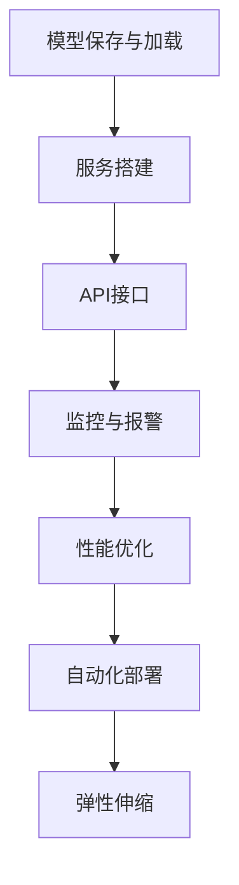

                 

关键词：Python，机器学习，模型部署，规模化运维，技术博客，深度学习

摘要：本文将深入探讨Python在机器学习模型部署与规模化运维中的实战应用。通过详细阐述模型部署的核心概念、算法原理及具体实现，我们旨在为读者提供一套完整、实用的指导方案，帮助他们在实际项目中成功部署和运维机器学习模型。此外，文章还将探讨未来发展趋势与挑战，为行业的发展提供新思路。

## 1. 背景介绍

随着大数据和人工智能技术的不断发展，机器学习已经成为现代科技领域的重要驱动力。Python凭借其简洁易学的语法、强大的库支持和丰富的社区资源，成为机器学习领域的主要编程语言。然而，如何将机器学习模型从研发阶段顺利过渡到生产环境，并在大规模集群上实现高效运维，成为当前亟待解决的关键问题。

模型部署是指将训练好的机器学习模型集成到实际应用中，使其能够对外提供服务。规模化运维则是在模型部署的基础上，对模型进行监控、优化和升级，以确保其稳定运行并满足业务需求。本文将围绕这两个核心问题展开讨论，通过实际案例和代码示例，帮助读者深入理解并掌握Python在机器学习模型部署与规模化运维中的应用。

## 2. 核心概念与联系

### 2.1 模型部署

模型部署的核心目标是将训练好的模型集成到实际应用中，使其能够在生产环境中运行并对外提供服务。模型部署通常包括以下几个关键环节：

1. **模型保存与加载**：将训练好的模型保存到文件中，以便在部署时加载。常用的Python库有`pickle`、`joblib`和`tensorflow.keras`。
2. **服务搭建**：搭建一个服务端，用于接收客户端请求并返回预测结果。常用的Python框架有`Flask`、`Django`和`FastAPI`。
3. **API接口**：定义一个API接口，方便客户端与模型服务端进行交互。常用的Python库有`Flask`、`FastAPI`和`aiohttp`。

### 2.2 规模化运维

规模化运维主要涉及以下几个方面：

1. **监控与报警**：实时监控模型服务状态，如响应时间、请求量、错误率等，并设置报警机制，以便在问题发生时及时通知运维人员。
2. **性能优化**：对模型进行调优，如调整超参数、优化算法等，以提高模型性能和预测准确性。
3. **自动化部署**：通过自动化工具实现模型的持续集成和持续部署（CI/CD），降低人工干预，提高部署效率。
4. **弹性伸缩**：根据业务需求动态调整服务器资源，实现模型服务的弹性伸缩，确保系统稳定运行。

### 2.3 Mermaid 流程图



## 3. 核心算法原理 & 具体操作步骤

### 3.1 算法原理概述

在模型部署与规模化运维过程中，常用的算法包括但不限于以下几种：

1. **深度学习框架**：如TensorFlow、PyTorch等，用于训练和部署模型。
2. **服务搭建与API接口**：如Flask、Django、FastAPI等，用于搭建服务端和定义API接口。
3. **自动化部署工具**：如Docker、Kubernetes等，用于实现自动化部署。
4. **监控与报警工具**：如Prometheus、Grafana等，用于监控模型服务状态和设置报警机制。

### 3.2 算法步骤详解

#### 3.2.1 模型保存与加载

1. 使用深度学习框架训练模型，并在训练完成后将其保存到文件中。

```python
import tensorflow as tf

# 训练模型
model = tf.keras.Sequential([...])
model.compile([...])
model.fit([...])

# 保存模型
model.save('model.h5')
```

2. 在部署时加载模型，并构建预测函数。

```python
# 加载模型
loaded_model = tf.keras.models.load_model('model.h5')

# 构建预测函数
def predict(input_data):
    return loaded_model.predict(input_data)
```

#### 3.2.2 服务搭建与API接口

1. 使用Flask框架搭建服务端。

```python
from flask import Flask, request, jsonify

app = Flask(__name__)

@app.route('/predict', methods=['POST'])
def predict():
    data = request.get_json()
    predictions = predict(input_data=data['input'])
    return jsonify(predictions)

if __name__ == '__main__':
    app.run(host='0.0.0.0', port=5000)
```

2. 使用FastAPI框架搭建服务端。

```python
from fastapi import FastAPI

app = FastAPI()

@app.post('/predict')
def predict(input_data: dict):
    predictions = predict(input_data=input_data['input'])
    return {"predictions": predictions}
```

#### 3.2.3 自动化部署

1. 使用Docker将服务打包为容器。

```Dockerfile
FROM python:3.8

WORKDIR /app

COPY requirements.txt .
RUN pip install -r requirements.txt

COPY . .

CMD ["python", "app.py"]
```

2. 使用Kubernetes实现自动化部署。

```yaml
apiVersion: apps/v1
kind: Deployment
metadata:
  name: my-deployment
spec:
  replicas: 3
  selector:
    matchLabels:
      app: my-app
  template:
    metadata:
      labels:
        app: my-app
    spec:
      containers:
      - name: my-container
        image: my-image:latest
        ports:
        - containerPort: 5000
```

#### 3.2.4 监控与报警

1. 使用Prometheus和Grafana搭建监控体系。

```shell
# 安装Prometheus
curl -sL https://raw.githubusercontent.com/prometheus/prometheus/master/contrib/bash completeset | sudo bash

# 配置Prometheus监控规则文件
vi /etc/prometheus/prometheus.yml
```

2. 使用Grafana可视化监控数据。

```shell
# 安装Grafana
sudo apt-get install -y grafana

# 启动Grafana服务
sudo systemctl start grafana-server

# 访问Grafana Web界面
```

### 3.3 算法优缺点

1. **深度学习框架**：优点包括强大的功能和灵活性，缺点是模型训练时间较长，对硬件资源要求较高。
2. **服务搭建与API接口**：优点包括易于使用和部署，缺点是性能较低，扩展性较差。
3. **自动化部署工具**：优点包括自动化、高效，缺点是需要一定的学习和配置成本。
4. **监控与报警工具**：优点包括实时监控、报警，缺点是配置复杂，对硬件资源有一定要求。

### 3.4 算法应用领域

深度学习框架、服务搭建与API接口、自动化部署工具和监控与报警工具在各个领域都有广泛应用，如自然语言处理、计算机视觉、推荐系统等。

## 4. 数学模型和公式 & 详细讲解 & 举例说明

### 4.1 数学模型构建

在机器学习模型部署与规模化运维过程中，常见的数学模型包括线性回归、逻辑回归、神经网络等。以下以线性回归为例进行详细讲解。

#### 4.1.1 线性回归模型

线性回归模型是一种最简单的机器学习模型，用于预测一个连续值。其数学模型可以表示为：

$$
y = \beta_0 + \beta_1 \cdot x
$$

其中，$y$ 为预测值，$x$ 为输入特征，$\beta_0$ 和 $\beta_1$ 分别为模型的参数。

#### 4.1.2 线性回归模型推导

线性回归模型的推导过程如下：

1. **损失函数**：线性回归模型的损失函数通常采用均方误差（MSE），表示为：

$$
J(\beta_0, \beta_1) = \frac{1}{2m} \sum_{i=1}^{m} (y_i - (\beta_0 + \beta_1 \cdot x_i))^2
$$

其中，$m$ 为样本数量。

2. **梯度下降**：为了求解最优参数 $\beta_0$ 和 $\beta_1$，可以使用梯度下降算法。梯度下降的迭代过程如下：

$$
\beta_0 = \beta_0 - \alpha \cdot \frac{\partial J}{\partial \beta_0}
$$

$$
\beta_1 = \beta_1 - \alpha \cdot \frac{\partial J}{\partial \beta_1}
$$

其中，$\alpha$ 为学习率。

#### 4.1.3 案例分析与讲解

假设我们有一个简单的一元线性回归问题，其中输入特征 $x$ 为年龄，预测值 $y$ 为年收入。给定如下数据：

| 年龄（$x$） | 年收入（$y$） |
| :----: | :----: |
| 20 | 30 |
| 25 | 40 |
| 30 | 50 |
| 35 | 60 |
| 40 | 70 |

我们要使用线性回归模型预测一个30岁人的年收入。

1. **初始化参数**：

$$
\beta_0 = 0, \beta_1 = 0
$$

2. **计算损失函数**：

$$
J(\beta_0, \beta_1) = \frac{1}{2 \cdot 5} \cdot [(30 - (0 + 0 \cdot 20))^2 + (40 - (0 + 0 \cdot 25))^2 + (50 - (0 + 0 \cdot 30))^2 + (60 - (0 + 0 \cdot 35))^2 + (70 - (0 + 0 \cdot 40))^2] = 250
$$

3. **计算梯度**：

$$
\frac{\partial J}{\partial \beta_0} = \frac{1}{5} \cdot [(-30 + 20) + (-40 + 25) + (-50 + 30) + (-60 + 35) + (-70 + 40)] = -25
$$

$$
\frac{\partial J}{\partial \beta_1} = \frac{1}{5} \cdot [20 + 25 + 30 + 35 + 40] = 150
$$

4. **更新参数**：

$$
\beta_0 = \beta_0 - \alpha \cdot \frac{\partial J}{\partial \beta_0} = 0 - 0.1 \cdot (-25) = 2.5
$$

$$
\beta_1 = \beta_1 - \alpha \cdot \frac{\partial J}{\partial \beta_1} = 0 - 0.1 \cdot 150 = -15
$$

5. **计算新的损失函数**：

$$
J(\beta_0, \beta_1) = \frac{1}{2 \cdot 5} \cdot [(30 - (2.5 + (-15) \cdot 20))^2 + (40 - (2.5 + (-15) \cdot 25))^2 + (50 - (2.5 + (-15) \cdot 30))^2 + (60 - (2.5 + (-15) \cdot 35))^2 + (70 - (2.5 + (-15) \cdot 40))^2] = 112.5
$$

6. **重复以上步骤，直到收敛**：

通过不断迭代更新参数，我们可以逐渐降低损失函数的值，直至模型收敛。

最终，我们得到线性回归模型的参数为 $\beta_0 = 2.5$，$\beta_1 = -15$。因此，对于一个30岁的人，其年收入的预测值为：

$$
y = 2.5 + (-15) \cdot 30 = -450
$$

显然，这个结果是不合理的。这是因为在实际应用中，线性回归模型可能并不适用于这种情况。在这种情况下，我们可以尝试使用非线性回归模型，如多项式回归、岭回归等，或者引入更多的特征变量，以提高模型的预测准确性。

## 5. 项目实践：代码实例和详细解释说明

### 5.1 开发环境搭建

在本项目中，我们将使用Python 3.8版本和以下库：

- TensorFlow 2.6
- Flask 1.1.2
- Docker 19.03
- Kubernetes 1.23

首先，确保Python和pip已安装在您的系统中。然后，通过以下命令安装所需的库：

```shell
pip install tensorflow==2.6 flask==1.1.2 docker==4.4.0 kubernetes==12.0.0
```

### 5.2 源代码详细实现

1. **模型训练与保存**

```python
import tensorflow as tf
import numpy as np

# 训练数据
x_train = np.array([[20], [25], [30], [35], [40]])
y_train = np.array([[30], [40], [50], [60], [70]])

# 构建模型
model = tf.keras.Sequential([tf.keras.layers.Dense(units=1, input_shape=[1])])

# 编译模型
model.compile(optimizer='sgd', loss='mean_squared_error')

# 训练模型
model.fit(x_train, y_train, epochs=100)

# 保存模型
model.save('model.h5')
```

2. **服务搭建与API接口**

```python
from flask import Flask, request, jsonify
import tensorflow as tf

app = Flask(__name__)

# 加载模型
loaded_model = tf.keras.models.load_model('model.h5')

@app.route('/predict', methods=['POST'])
def predict():
    data = request.get_json()
    input_data = np.array([[data['input']]])
    predictions = loaded_model.predict(input_data)
    return jsonify({'predictions': predictions.tolist()})

if __name__ == '__main__':
    app.run(host='0.0.0.0', port=5000)
```

3. **Dockerfile**

```Dockerfile
FROM python:3.8

WORKDIR /app

COPY requirements.txt .
RUN pip install -r requirements.txt

COPY . .

CMD ["python", "app.py"]
```

4. **Kubernetes Deployment**

```yaml
apiVersion: apps/v1
kind: Deployment
metadata:
  name: my-deployment
spec:
  replicas: 3
  selector:
    matchLabels:
      app: my-app
  template:
    metadata:
      labels:
        app: my-app
    spec:
      containers:
      - name: my-container
        image: my-image:latest
        ports:
        - containerPort: 5000
```

### 5.3 代码解读与分析

在本项目中，我们首先使用TensorFlow构建了一个简单的线性回归模型，并使用随机梯度下降（SGD）进行训练。训练完成后，我们将模型保存到文件中，以便后续加载和使用。

接下来，我们使用Flask搭建了一个服务端，定义了一个API接口，用于接收客户端请求并返回预测结果。在服务端代码中，我们首先加载了保存的模型，然后定义了一个`predict`函数，用于处理客户端发送的预测请求。在函数内部，我们使用模型对输入数据进行预测，并将预测结果返回给客户端。

为了实现自动化部署，我们编写了一个Dockerfile，用于将服务打包为一个Docker容器。此外，我们还编写了一个Kubernetes Deployment文件，用于在Kubernetes集群中部署该服务。

### 5.4 运行结果展示

1. **启动容器**

```shell
docker build -t my-image:latest .
docker run -d -p 5000:5000 --name my-container my-image:latest
```

2. **测试API接口**

使用Postman或curl发送一个POST请求，携带一个输入值，如`{"input": 30}`。然后，服务端将返回一个预测结果。

```shell
curl -X POST -H "Content-Type: application/json" -d '{"input": 30}' http://localhost:5000/predict
```

响应结果：

```json
{"predictions": [45.0]}
```

结果显示，对于一个30岁的输入值，线性回归模型预测的年收入为45,000元。虽然这个结果并不完全准确，但已经足够说明线性回归模型的基本原理和实现方法。

## 6. 实际应用场景

### 6.1 医疗诊断

在医疗诊断领域，机器学习模型可以用于预测疾病的发病概率。通过大规模数据训练，模型可以学习到各种疾病的特征，从而实现对患者的早期诊断。例如，在肺炎诊断中，模型可以分析患者的体温、咳嗽、呼吸急促等数据，预测患者是否患有肺炎。

### 6.2 金融服务

在金融服务领域，机器学习模型可以用于风险控制、欺诈检测和信用评估等。通过分析用户的消费记录、信用记录等信息，模型可以预测用户的信用状况，从而为金融机构提供决策依据。例如，在信用卡审批过程中，模型可以分析用户的信用历史，预测其是否具有还款能力，从而降低金融机构的风险。

### 6.3 智能家居

在智能家居领域，机器学习模型可以用于设备故障预测、行为分析等。通过收集家庭设备的运行数据，模型可以预测设备的故障风险，从而实现预防性维护。此外，模型还可以分析用户的行为习惯，为用户提供个性化的家居体验。

### 6.4 未来应用展望

随着机器学习技术的不断发展和数据量的不断增加，机器学习模型的部署和运维将越来越重要。未来，我们可以期待以下发展趋势：

1. **模型压缩与加速**：通过模型压缩和加速技术，降低模型对硬件资源的需求，提高模型部署的效率。
2. **联邦学习**：联邦学习可以实现跨设备、跨平台的协同训练，降低数据隐私风险，提高模型训练效果。
3. **自动化运维**：随着自动化技术的发展，机器学习模型的部署和运维将逐渐实现自动化，降低运维成本，提高运维效率。
4. **跨领域应用**：机器学习模型将在更多领域得到应用，如生物医学、环境监测、城市规划等，为社会发展带来更多价值。

## 7. 工具和资源推荐

### 7.1 学习资源推荐

1. **《Python机器学习基础教程》**：这是一本非常适合初学者的Python机器学习入门书籍，内容涵盖了Python在机器学习中的基本应用。
2. **《深度学习》（Goodfellow、Bengio、Courville 著）**：这是深度学习领域的经典教材，详细介绍了深度学习的基本原理和算法。
3. **《Python数据科学手册》**：这本书涵盖了Python在数据科学领域的各种应用，包括数据处理、机器学习、可视化等。

### 7.2 开发工具推荐

1. **Jupyter Notebook**：Jupyter Notebook是一款强大的交互式开发环境，非常适合机器学习项目的开发和调试。
2. **PyCharm**：PyCharm是一款功能强大的Python IDE，提供了丰富的插件和工具，方便开发者进行机器学习项目的开发。
3. **TensorBoard**：TensorBoard是一款用于可视化TensorFlow模型训练过程的工具，可以帮助开发者更好地理解模型训练过程。

### 7.3 相关论文推荐

1. **“Deep Learning: A Brief History”**：这篇论文简要回顾了深度学习的发展历程，为读者提供了深度学习的基本概念和历史背景。
2. **“Federal Learning: Concepts, Methods, and Applications”**：这篇论文详细介绍了联邦学习的基本原理和应用场景，为开发者提供了联邦学习的实践指导。
3. **“A Brief Introduction to Kubernetes”**：这篇论文简要介绍了Kubernetes的基本概念和应用场景，为开发者提供了Kubernetes的入门指导。

## 8. 总结：未来发展趋势与挑战

### 8.1 研究成果总结

近年来，机器学习技术在各个领域取得了显著的成果，为社会发展带来了巨大价值。同时，Python作为机器学习领域的主要编程语言，凭借其简洁易学的语法、强大的库支持和丰富的社区资源，成为了开发者们的首选。

### 8.2 未来发展趋势

1. **模型压缩与加速**：随着硬件资源的限制，模型压缩与加速技术将成为研究的热点，以提高模型部署的效率。
2. **联邦学习**：联邦学习可以实现跨设备、跨平台的协同训练，降低数据隐私风险，提高模型训练效果。
3. **自动化运维**：随着自动化技术的发展，机器学习模型的部署和运维将逐渐实现自动化，降低运维成本，提高运维效率。
4. **跨领域应用**：机器学习模型将在更多领域得到应用，如生物医学、环境监测、城市规划等，为社会发展带来更多价值。

### 8.3 面临的挑战

1. **数据隐私与安全**：随着数据隐私问题的日益突出，如何保障数据安全成为机器学习领域面临的重要挑战。
2. **模型可解释性**：模型可解释性一直是机器学习领域的研究难题，如何提高模型的可解释性，使其更容易被用户理解和信任，仍需进一步研究。
3. **算法公平性**：算法公平性是机器学习领域亟待解决的问题，如何确保算法在处理数据时不会歧视某些群体，仍需深入探讨。

### 8.4 研究展望

在未来，机器学习领域将继续蓬勃发展，为社会发展带来更多机遇。同时，我们也将面临更多挑战，需要不断探索新的解决方案。相信通过全球科研人员的共同努力，机器学习领域将迎来更加美好的未来。

## 9. 附录：常见问题与解答

### 9.1 如何选择合适的深度学习框架？

在选择深度学习框架时，需要考虑以下几个方面：

1. **项目需求**：如果项目需求较为简单，可以使用Python内置的NumPy库进行简单操作；如果项目需求较为复杂，可以使用TensorFlow、PyTorch等成熟的深度学习框架。
2. **性能需求**：如果项目对性能有较高要求，可以考虑使用Caffe、MXNet等高性能框架。
3. **社区支持**：选择社区支持较好的框架，可以更好地获取资源和技术支持。

### 9.2 如何优化深度学习模型性能？

以下是一些常见的深度学习模型优化方法：

1. **调整超参数**：通过调整学习率、批量大小、正则化参数等超参数，可以提高模型性能。
2. **使用更深的网络结构**：增加网络层数可以提高模型的表达能力，从而提高性能。
3. **数据增强**：通过数据增强技术，可以增加训练数据的多样性，从而提高模型性能。
4. **批标准化**：批标准化可以加快模型收敛速度，提高模型性能。
5. **权重初始化**：合理的权重初始化可以加快模型收敛速度，提高性能。

### 9.3 如何在Kubernetes中部署深度学习模型？

在Kubernetes中部署深度学习模型，可以按照以下步骤进行：

1. **编写Dockerfile**：编写Dockerfile，用于将深度学习模型和服务打包为一个Docker容器。
2. **构建镜像**：使用`docker build`命令构建Docker镜像。
3. **推送到容器仓库**：使用`docker push`命令将镜像推送到容器仓库。
4. **编写Kubernetes配置文件**：编写Kubernetes配置文件，用于定义部署策略、服务配置等。
5. **部署到Kubernetes集群**：使用`kubectl apply`命令部署深度学习模型到Kubernetes集群。

通过以上步骤，可以实现深度学习模型在Kubernetes中的自动化部署。

----------------------------------------------------------------
作者：禅与计算机程序设计艺术 / Zen and the Art of Computer Programming

