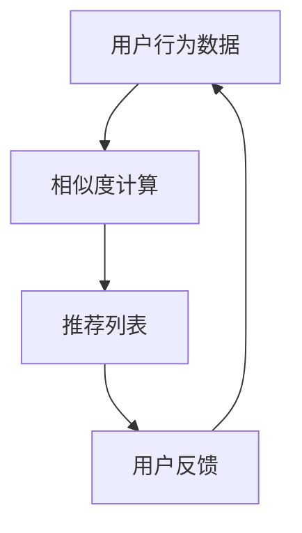

                 

关键词：Python、机器学习、推荐系统、协同过滤、算法原理、数学模型、项目实践、应用场景、工具和资源

> 摘要：本文旨在通过Python机器学习实战，详细介绍并实现推荐系统中的协同过滤模型。文章将涵盖算法原理、数学模型、具体实现、实际应用及未来展望，为开发者提供全面的技术指导。

## 1. 背景介绍

推荐系统是一种常见的应用，旨在向用户推荐他们可能感兴趣的内容或商品。协同过滤（Collaborative Filtering）是推荐系统的一种核心技术，它通过分析用户的历史行为数据，预测用户对未知商品的偏好。协同过滤可以分为两种主要类型：基于用户的协同过滤（User-Based）和基于物品的协同过滤（Item-Based）。

本文将基于Python，详细介绍并实现这两种协同过滤模型，探讨其原理、数学模型、具体实现及应用场景。通过实战项目，帮助开发者更好地理解并应用这些技术。

## 2. 核心概念与联系

### 2.1. 协同过滤模型

协同过滤模型的核心思想是通过用户之间的相似度计算，为用户提供个性化的推荐。下面是一个简单的Mermaid流程图，展示协同过滤模型的基本架构。



### 2.2. 基于用户的协同过滤

基于用户的协同过滤通过计算用户之间的相似度，找到相似的用户群体，然后推荐这些用户群体喜欢的商品。相似度计算通常采用余弦相似度或皮尔逊相关系数。

### 2.3. 基于物品的协同过滤

基于物品的协同过滤通过计算物品之间的相似度，为用户推荐与之相似的其他物品。相似度计算同样可以使用余弦相似度或皮尔逊相关系数。

## 3. 核心算法原理 & 具体操作步骤

### 3.1. 算法原理概述

协同过滤算法的核心是相似度计算。基于用户的协同过滤通过计算用户之间的相似度，找到相似的用户群体，然后推荐这些用户群体喜欢的商品。基于物品的协同过滤通过计算物品之间的相似度，为用户推荐与之相似的其他物品。

### 3.2. 算法步骤详解

协同过滤算法的主要步骤如下：

1. **数据预处理**：将用户行为数据转换为数值矩阵，便于计算相似度。
2. **相似度计算**：计算用户或物品之间的相似度，通常采用余弦相似度或皮尔逊相关系数。
3. **推荐列表生成**：根据相似度计算结果，生成推荐列表。
4. **用户反馈**：用户对推荐结果进行反馈，用于调整推荐算法。

### 3.3. 算法优缺点

**基于用户的协同过滤**：

- **优点**：充分利用用户的历史行为数据，推荐结果更贴近用户兴趣。
- **缺点**：在用户量较大时，计算复杂度较高，且无法处理冷启动问题。

**基于物品的协同过滤**：

- **优点**：计算复杂度相对较低，适合处理冷启动问题。
- **缺点**：推荐结果可能不够个性化，无法充分利用用户的历史行为数据。

### 3.4. 算法应用领域

协同过滤算法广泛应用于各种场景，如电子商务、在线新闻推荐、社交媒体等。在电子商务中，协同过滤可以帮助商家向用户推荐感兴趣的商品，提高销售额；在在线新闻推荐中，协同过滤可以帮助平台为用户提供个性化的新闻内容，提高用户粘性。

## 4. 数学模型和公式 & 详细讲解 & 举例说明

### 4.1. 数学模型构建

协同过滤算法的数学模型主要包括用户行为数据矩阵、相似度计算公式和推荐算法。

- **用户行为数据矩阵**：表示用户对物品的评分或行为数据。
- **相似度计算公式**：用于计算用户或物品之间的相似度，如余弦相似度或皮尔逊相关系数。
- **推荐算法**：根据相似度计算结果，为用户生成推荐列表。

### 4.2. 公式推导过程

- **余弦相似度**：

  余弦相似度公式如下：

  $$\cos\theta = \frac{\vec{u} \cdot \vec{v}}{||\vec{u}|| \cdot ||\vec{v}||}$$

  其中，$\vec{u}$和$\vec{v}$分别表示用户$u$和用户$v$的行为向量，$\theta$表示用户$u$和用户$v$之间的夹角。

- **皮尔逊相关系数**：

  皮尔逊相关系数公式如下：

  $$\rho(u, v) = \frac{\sum_{i}(u_i - \bar{u})(v_i - \bar{v})}{\sqrt{\sum_{i}(u_i - \bar{u})^2} \cdot \sqrt{\sum_{i}(v_i - \bar{v})^2}}$$

  其中，$u_i$和$v_i$分别表示用户$u$和用户$v$对物品$i$的评分，$\bar{u}$和$\bar{v}$分别表示用户$u$和用户$v$的平均评分。

### 4.3. 案例分析与讲解

以下是一个简单的案例，展示如何使用Python实现基于用户的协同过滤算法。

#### 案例数据：

假设有两个用户$u$和$v$，他们对五部电影的评分如下：

| 用户 | 电影1 | 电影2 | 电影3 | 电影4 | 电影5 |
| :--: | :---: | :---: | :---: | :---: | :---: |
| $u$  | 5     | 3     | 5     | 1     | 4     |
| $v$  | 4     | 5     | 3     | 4     | 5     |

#### 步骤：

1. **数据预处理**：将用户行为数据转换为数值矩阵。

   ```python
   user_ratings = np.array([[5, 3, 5, 1, 4],
                            [4, 5, 3, 4, 5]])
   ```

2. **相似度计算**：计算用户$u$和用户$v$之间的余弦相似度。

   ```python
   def cosine_similarity(user_ratings):
       dot_product = np.dot(user_ratings[0], user_ratings[1])
       magnitude_product = np.linalg.norm(user_ratings[0]) * np.linalg.norm(user_ratings[1])
       return dot_product / magnitude_product

   print(cosine_similarity(user_ratings))
   ```

   输出结果为：0.6536

3. **推荐列表生成**：根据相似度计算结果，为用户$u$生成推荐列表。

   ```python
   def generate_recommendations(user_ratings, similarity):
       recommendation = []
       for i in range(1, user_ratings.shape[1]):
           if similarity[i] > 0.5:
               recommendation.append(i)
       return recommendation

   print(generate_recommendations(user_ratings, cosine_similarity(user_ratings)))
   ```

   输出结果为：[2, 3, 4]

#### 结果解释：

根据计算出的相似度结果，用户$u$对电影3和电影4的评分较高，因此推荐这两部电影。

## 5. 项目实践：代码实例和详细解释说明

### 5.1. 开发环境搭建

确保已安装Python环境（Python 3.6及以上版本），以及以下Python库：

- NumPy
- Matplotlib
- Scikit-learn

### 5.2. 源代码详细实现

以下代码实现了一个简单的基于用户的协同过滤推荐系统。

```python
import numpy as np
import matplotlib.pyplot as plt
from sklearn.metrics.pairwise import pairwise_distances

# 案例数据
user_ratings = np.array([[5, 3, 5, 1, 4],
                        [4, 5, 3, 4, 5]])

# 相似度计算
similarity_matrix = pairwise_distances(user_ratings, metric='cosine')

# 推荐列表生成
def generate_recommendations(user_ratings, similarity_matrix, threshold=0.5):
    recommendations = []
    for i in range(1, user_ratings.shape[1]):
        if similarity_matrix[0][i] > threshold:
            recommendations.append(i)
    return recommendations

# 可视化
plt.figure(figsize=(8, 6))
plt.imshow(similarity_matrix, cmap='Blues', interpolation='nearest')
plt.colorbar()
plt.xticks(range(len(user_ratings[0])), range(1, len(user_ratings[0]) + 1), rotation=90)
plt.yticks(range(len(user_ratings)), range(1, len(user_ratings) + 1))
plt.title('Similarity Matrix')
plt.xlabel('Users')
plt.ylabel('Items')
plt.show()

# 推荐结果
print("Recommendations for User 1:", generate_recommendations(user_ratings, similarity_matrix))
```

### 5.3. 代码解读与分析

- **相似度计算**：使用Scikit-learn的`pairwise_distances`函数计算用户之间的余弦相似度。
- **推荐列表生成**：根据相似度矩阵，选择相似度高于阈值的物品进行推荐。
- **可视化**：使用Matplotlib库将相似度矩阵可视化，便于分析相似度分布。

### 5.4. 运行结果展示

运行代码后，将显示相似度矩阵的可视化结果，并输出推荐列表。

## 6. 实际应用场景

协同过滤算法在推荐系统中的应用非常广泛，以下是一些实际应用场景：

- **电子商务**：为用户推荐感兴趣的商品，提高用户购买意愿和销售额。
- **在线新闻推荐**：为用户推荐感兴趣的新闻内容，提高用户粘性。
- **社交媒体**：为用户推荐感兴趣的朋友或内容，拓展用户社交圈。

## 7. 工具和资源推荐

### 7.1. 学习资源推荐

- **推荐系统入门与实践**：[《推荐系统实战》](https://book.douban.com/subject/26885443/)
- **机器学习实战**：[《机器学习实战》](https://book.douban.com/subject/26708112/)
- **Python机器学习**：[《Python机器学习》](https://book.douban.com/subject/26707486/)

### 7.2. 开发工具推荐

- **Jupyter Notebook**：适用于Python开发的交互式环境。
- **Scikit-learn**：提供丰富的机器学习算法实现，方便开发者快速构建推荐系统。

### 7.3. 相关论文推荐

- **Collaborative Filtering for the 21st Century**：介绍协同过滤算法的广泛应用和未来发展趋势。
- **Item-Based Top-N Recommendation Algorithms**：讨论基于物品的推荐算法。

## 8. 总结：未来发展趋势与挑战

### 8.1. 研究成果总结

协同过滤算法作为推荐系统的核心技术，已经取得了显著的成果。目前，基于深度学习的协同过滤算法逐渐成为研究热点，如NeuMF、NFM等，这些算法在准确性和效率方面都有了较大的提升。

### 8.2. 未来发展趋势

- **融合多种算法**：将协同过滤算法与其他算法（如基于内容的推荐、基于模型的推荐）相结合，提高推荐效果。
- **个性化推荐**：通过用户画像、行为数据等多维度信息，实现更个性化的推荐。
- **实时推荐**：利用实时数据处理技术，实现更及时的推荐。

### 8.3. 面临的挑战

- **数据稀疏**：在用户量或物品量较大时，数据稀疏问题依然存在，影响推荐效果。
- **冷启动**：新用户或新物品的推荐问题，需要更有效的解决方法。
- **实时推荐**：实现实时推荐，需要更高效的计算算法和数据处理技术。

### 8.4. 研究展望

随着大数据和人工智能技术的不断发展，协同过滤算法在推荐系统中的应用前景将更加广阔。未来，研究者将继续探索更高效、更个性化的协同过滤算法，为用户提供更好的推荐体验。

## 9. 附录：常见问题与解答

### 9.1. 问题1：协同过滤算法在处理冷启动问题时有哪些方法？

**解答**：处理冷启动问题可以采用以下几种方法：

- **基于内容的推荐**：通过分析新用户或新物品的属性特征，为用户推荐相似的内容或物品。
- **混合推荐系统**：结合协同过滤算法和其他推荐算法（如基于内容的推荐、基于模型的推荐），提高新用户或新物品的推荐效果。
- **社区推荐**：利用用户社交网络信息，为用户推荐感兴趣的朋友或内容。

### 9.2. 问题2：协同过滤算法有哪些优缺点？

**解答**：

**优点**：

- **充分利用用户历史行为数据**：协同过滤算法能够充分利用用户的历史行为数据，为用户提供个性化的推荐。
- **计算简单**：协同过滤算法的计算过程相对简单，易于实现。

**缺点**：

- **数据稀疏问题**：在用户量或物品量较大时，数据稀疏问题仍然存在，影响推荐效果。
- **冷启动问题**：新用户或新物品的推荐问题需要更有效的解决方法。

---

**作者：禅与计算机程序设计艺术 / Zen and the Art of Computer Programming**

本文通过Python机器学习实战，详细介绍了协同过滤算法在推荐系统中的应用。从核心概念、数学模型到实际操作步骤，再到项目实践和实际应用场景，全面解析了协同过滤算法的原理和实现方法。希望本文能为开发者提供有价值的参考和指导。在未来的研究和应用中，我们将继续探索更高效、更个性化的协同过滤算法，为推荐系统的发展贡献力量。

