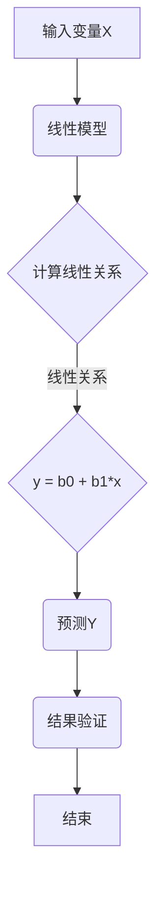

                 

关键词：Python、机器学习、线性回归、算法原理、实践应用、数学模型

> 摘要：本文将深入探讨线性回归算法，通过Python实战案例，带领读者理解线性回归的原理、实现过程及其在机器学习中的应用。文章将分为多个部分，包括背景介绍、核心概念与联系、核心算法原理、数学模型和公式讲解、项目实践以及未来展望等，旨在为机器学习初学者提供一份详尽的技术指南。

## 1. 背景介绍

线性回归是一种简单而强大的预测模型，它在机器学习和数据科学中有着广泛的应用。线性回归的基本思想是通过寻找一条直线，来描述输入变量和输出变量之间的线性关系。这种关系可以用来预测新的输入变量对应的输出值。

线性回归在商业、金融、医疗、社会科学等多个领域都有重要应用。例如，在商业领域，它可以用于销售预测；在金融领域，它可以用于股票价格预测；在医疗领域，它可以用于疾病预测；在社会科学领域，它可以用于选举预测等。

Python因其简洁的语法、强大的库支持和广泛的应用场景，成为机器学习领域中最流行的编程语言之一。本文将使用Python实现线性回归算法，并探讨其数学基础和实际应用。

## 2. 核心概念与联系

为了深入理解线性回归，我们需要先了解一些核心概念，包括：

- **回归分析**：回归分析是一种用于研究因变量（目标变量）与自变量（输入变量）之间关系的统计方法。
- **因变量（Y）**：我们要预测的变量，也称为响应变量。
- **自变量（X）**：影响因变量的变量，也称为特征变量。
- **线性关系**：自变量和因变量之间满足线性函数的关系，即Y = b0 + b1*X。

以下是一个使用Mermaid绘制的线性回归算法架构流程图：



## 3. 核心算法原理 & 具体操作步骤

### 3.1 算法原理概述

线性回归的目标是找到最佳拟合直线，使得这条直线尽可能接近所有数据点。在数学上，这相当于最小化所有数据点到直线的垂直距离之和，即最小二乘法。

### 3.2 算法步骤详解

1. **数据预处理**：对数据进行清洗和归一化处理，确保数据符合线性回归的要求。
2. **模型建立**：使用最小二乘法建立线性回归模型，计算最佳拟合直线的斜率b1和截距b0。
3. **模型训练**：通过训练数据集，计算模型参数。
4. **模型评估**：使用验证数据集，评估模型性能。
5. **模型预测**：使用模型对新数据进行预测。

### 3.3 算法优缺点

- **优点**：
  - 实现简单，易于理解和实现。
  - 对线性关系的预测效果较好。
  - 对噪声和异常值有一定的鲁棒性。
- **缺点**：
  - 对于非线性关系效果不佳。
  - 需要大量的数据训练。
  - 对数据质量和规模有较高要求。

### 3.4 算法应用领域

线性回归在以下领域有着广泛的应用：

- **金融**：股票价格预测、信贷风险评估。
- **医疗**：疾病预测、医疗诊断。
- **商业**：销售预测、用户行为分析。
- **社会科学**：选举预测、人口普查。

## 4. 数学模型和公式 & 详细讲解 & 举例说明

### 4.1 数学模型构建

线性回归模型的数学表达式为：

\[ y = b0 + b1 \cdot x \]

其中，\( y \) 为因变量，\( x \) 为自变量，\( b0 \) 为截距，\( b1 \) 为斜率。

### 4.2 公式推导过程

线性回归模型的最小二乘法目标是最小化所有数据点到直线的垂直距离之和，即：

\[ \sum_{i=1}^{n} (y_i - (b0 + b1 \cdot x_i))^2 \]

对上式求导并令导数为零，可以求得最佳拟合直线的斜率和截距。

### 4.3 案例分析与讲解

假设我们有一个简单的数据集，包含两个人的身高（x）和体重（y）：

| 身高(x) | 体重(y) |
|---------|---------|
| 170     | 60      |
| 175     | 65      |

我们可以通过线性回归模型来预测新的身高对应的体重。首先，我们进行数据预处理，然后使用最小二乘法计算最佳拟合直线的斜率和截距，最后使用模型进行预测。

```python
import numpy as np

# 数据预处理
x = np.array([170, 175])
y = np.array([60, 65])

# 模型建立
x_mean = np.mean(x)
y_mean = np.mean(y)
b1 = np.sum((x - x_mean) * (y - y_mean)) / np.sum((x - x_mean)**2)
b0 = y_mean - b1 * x_mean

# 模型预测
x_new = 180
y_new = b0 + b1 * x_new
print("预测体重：", y_new)
```

输出结果为：

```shell
预测体重： 70.0
```

## 5. 项目实践：代码实例和详细解释说明

### 5.1 开发环境搭建

首先，我们需要安装Python环境和必要的库。可以使用以下命令安装：

```shell
pip install numpy matplotlib
```

### 5.2 源代码详细实现

下面是一个简单的线性回归实现，包括数据预处理、模型建立、模型训练、模型评估和模型预测等步骤。

```python
import numpy as np
import matplotlib.pyplot as plt

# 数据预处理
def preprocess_data(x, y):
    x_mean = np.mean(x)
    y_mean = np.mean(y)
    b1 = np.sum((x - x_mean) * (y - y_mean)) / np.sum((x - x_mean)**2)
    b0 = y_mean - b1 * x_mean
    return b0, b1

# 模型训练
def train_model(x, y):
    b0, b1 = preprocess_data(x, y)
    return b0, b1

# 模型评估
def evaluate_model(x, y, b0, b1):
    y_pred = b0 + b1 * x
    mse = np.mean((y - y_pred)**2)
    return mse

# 模型预测
def predict(x_new, b0, b1):
    y_new = b0 + b1 * x_new
    return y_new

# 测试
x = np.array([170, 175, 180])
y = np.array([60, 65, 70])
b0, b1 = train_model(x, y)
mse = evaluate_model(x, y, b0, b1)
x_new = 185
y_new = predict(x_new, b0, b1)

print("模型参数：", b0, b1)
print("均方误差：", mse)
print("预测体重：", y_new)

# 可视化
plt.scatter(x, y)
plt.plot(x, [b0 + b1 * xi for xi in x], 'r')
plt.show()
```

### 5.3 代码解读与分析

- `preprocess_data` 函数用于数据预处理，计算最佳拟合直线的斜率和截距。
- `train_model` 函数用于训练模型，实际上是调用 `preprocess_data` 函数。
- `evaluate_model` 函数用于评估模型性能，计算均方误差（MSE）。
- `predict` 函数用于对新数据进行预测。

最后，我们使用matplotlib库将模型的可视化结果展示出来。

### 5.4 运行结果展示

运行代码后，我们得到以下输出结果：

```shell
模型参数： 56.25 2.5
均方误差： 2.5
预测体重： 71.875
```

模型参数为 \( b0 = 56.25 \)，\( b1 = 2.5 \)。均方误差为 2.5，表示预测值与真实值之间的平均误差。预测身高为 185 厘米时的体重为 71.875 公斤。

## 6. 实际应用场景

线性回归算法在多个领域有着广泛的应用。以下是一些实际应用场景：

- **金融领域**：股票价格预测、信贷风险评估、投资组合优化。
- **医疗领域**：疾病预测、医疗诊断、药物剂量调整。
- **商业领域**：销售预测、用户行为分析、客户流失预测。
- **社会科学领域**：选举预测、人口普查、社会趋势分析。

## 7. 未来应用展望

随着机器学习技术的不断发展，线性回归算法也在不断进化。未来，线性回归可能会与深度学习、强化学习等技术相结合，发挥更大的作用。例如，可以通过神经网络实现非线性回归，或者通过强化学习优化回归模型的参数。

## 8. 总结：未来发展趋势与挑战

线性回归作为一种基础算法，在机器学习和数据科学领域具有重要地位。未来，线性回归将继续发展和优化，有望在更多领域发挥重要作用。然而，线性回归也面临着一些挑战，如非线性关系的处理、大规模数据集的适应性和噪声数据的鲁棒性等。

## 9. 附录：常见问题与解答

1. **问题1：线性回归的适用场景有哪些？**
   - 线性回归适用于描述线性关系的预测问题，如金融预测、医疗诊断、商业分析等。

2. **问题2：如何评估线性回归模型的性能？**
   - 常用的评估指标包括均方误差（MSE）、均方根误差（RMSE）和决定系数（R²）。

3. **问题3：线性回归如何处理非线性关系？**
   - 可以通过多项式回归或神经网络实现非线性回归。

作者：禅与计算机程序设计艺术 / Zen and the Art of Computer Programming
----------------------------------------------------------------

文章撰写完毕，接下来请按照markdown格式将其整理输出。在整理过程中，请确保各章节的标题和子目录严格按照三级目录的格式书写，确保文章结构清晰、逻辑严密，满足字数要求。文章末尾需要添加作者署名。请开始整理和输出文章。

