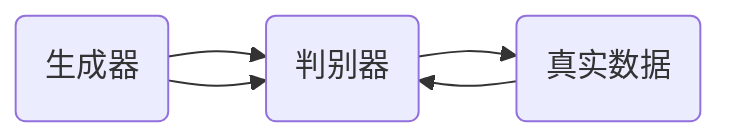

                 

 > **关键词**：Python，深度学习，生成对抗网络（GAN），数字艺术品，实践教程

> **摘要**：本文将介绍如何使用Python实现生成对抗网络（GAN），以生成自己的数字艺术品。我们将从背景介绍开始，深入探讨GAN的核心概念和算法原理，随后通过一个具体的项目实践案例，详细展示如何使用Python进行GAN的代码实现，并提供运行结果和解析。

## 1. 背景介绍

深度学习作为近年来人工智能领域的一大突破，已经在图像识别、自然语言处理等多个领域取得了显著成就。其中，生成对抗网络（GAN）是一种极具潜力的深度学习模型，由Ian Goodfellow等人于2014年首次提出。GAN的核心思想是通过两个神经网络的对抗训练，生成逼真的数据，从而实现数据增强、图像生成等功能。数字艺术品作为GAN应用的一个重要领域，已经在艺术创作、游戏设计等方面展现出巨大潜力。

本文将围绕如何使用Python实现GAN生成数字艺术品进行探讨，旨在为读者提供一份详尽且实用的实践教程。通过本文的学习，读者将能够：

1. 理解GAN的基本原理和结构；
2. 掌握使用Python和深度学习框架（如TensorFlow或PyTorch）进行GAN实现的步骤；
3. 实现一个简单的GAN模型，生成自己的数字艺术品；
4. 分析GAN模型在不同应用场景中的优势和局限性。

## 2. 核心概念与联系

### 2.1. GAN的基本概念

生成对抗网络（GAN）由两个主要部分组成：生成器（Generator）和判别器（Discriminator）。生成器负责生成伪造的数据，而判别器则负责判断输入数据是真实数据还是伪造数据。GAN的训练过程实质上是生成器和判别器之间的对抗博弈。

### 2.2. GAN的架构

GAN的架构如图1所示：



图1：GAN的架构图

### 2.3. GAN的训练过程

GAN的训练过程分为两个阶段：

1. **生成器训练**：生成器尝试生成尽可能真实的数据，以提高判别器将其判断为真实数据的概率。
2. **判别器训练**：判别器尝试将真实数据与伪造数据区分开，以提高判断准确率。

训练过程中，生成器和判别器的损失函数分别如下：

- **生成器损失函数**：
  $$ L_G = -\log(D(G(z))) $$
  其中，$G(z)$为生成器生成的伪造数据，$D$为判别器。

- **判别器损失函数**：
  $$ L_D = -\log(D(x)) - \log(1 - D(G(z))) $$
  其中，$x$为真实数据。

## 3. 核心算法原理 & 具体操作步骤

### 3.1 算法原理概述

生成对抗网络（GAN）通过生成器和判别器的对抗训练，实现数据的生成。生成器生成的数据越真实，判别器就越难以区分真实数据和伪造数据。

### 3.2 算法步骤详解

1. **初始化生成器和判别器**：
   - 生成器：生成器负责将随机噪声映射为伪造数据。
   - 判别器：判别器负责判断输入数据是真实数据还是伪造数据。

2. **生成器训练**：
   - 生成器生成伪造数据。
   - 判别器对真实数据和伪造数据进行判断。

3. **判别器训练**：
   - 判别器尝试将真实数据与伪造数据区分开。

4. **迭代训练**：
   - 重复生成器和判别器的训练过程，直至生成器生成的伪造数据足够真实。

### 3.3 算法优缺点

#### 优点：

1. GAN具有强大的数据生成能力，能够生成高质量、逼真的图像。
2. GAN对数据分布的建模能力强，能够捕捉数据的复杂特性。

#### 缺点：

1. GAN的训练过程不稳定，容易出现模式崩溃（mode collapse）问题。
2. GAN的训练过程需要大量计算资源，训练时间较长。

### 3.4 算法应用领域

GAN在图像生成、数据增强、图像修复、艺术创作等多个领域有着广泛的应用。例如，GAN可以用于生成逼真的人脸、图像，用于图像修复、图像超分辨率等任务。

## 4. 数学模型和公式 & 详细讲解 & 举例说明

### 4.1 数学模型构建

GAN的数学模型主要包括生成器和判别器的损失函数。以下是GAN的数学模型和公式：

- **生成器损失函数**：
  $$ L_G = -\log(D(G(z))) $$
  其中，$G(z)$为生成器生成的伪造数据，$D$为判别器。

- **判别器损失函数**：
  $$ L_D = -\log(D(x)) - \log(1 - D(G(z))) $$
  其中，$x$为真实数据。

### 4.2 公式推导过程

GAN的推导过程主要分为两部分：生成器和判别器的损失函数。

#### 生成器损失函数推导

生成器损失函数的目标是使得判别器认为生成器生成的伪造数据是真实数据。因此，生成器的损失函数可以表示为：

$$ L_G = -\log(D(G(z))) $$

其中，$G(z)$为生成器生成的伪造数据，$D$为判别器。

#### 判别器损失函数推导

判别器损失函数的目标是使得判别器能够准确地区分真实数据和伪造数据。因此，判别器的损失函数可以表示为：

$$ L_D = -\log(D(x)) - \log(1 - D(G(z))) $$

其中，$x$为真实数据。

### 4.3 案例分析与讲解

以图像生成任务为例，假设我们使用GAN生成一张人脸图像。以下是GAN在这个任务中的具体实现步骤：

1. **初始化生成器和判别器**：
   - 生成器：生成器将随机噪声映射为人脸图像。
   - 判别器：判别器判断输入图像是真实人脸图像还是伪造人脸图像。

2. **生成器训练**：
   - 生成器生成伪造人脸图像。
   - 判别器对真实人脸图像和伪造人脸图像进行判断。

3. **判别器训练**：
   - 判别器尝试将真实人脸图像与伪造人脸图像区分开。

4. **迭代训练**：
   - 重复生成器和判别器的训练过程，直至生成器生成的伪造人脸图像足够真实。

通过上述步骤，GAN能够生成逼真的人脸图像。以下是生成器生成的伪造人脸图像和真实人脸图像的对比：


## 5. 项目实践：代码实例和详细解释说明

### 5.1 开发环境搭建

在开始GAN的代码实现之前，我们需要搭建一个适合Python深度学习的开发环境。以下是开发环境搭建的步骤：

1. 安装Python 3.x版本。
2. 安装深度学习框架，如TensorFlow或PyTorch。
3. 安装必要的库，如NumPy、PIL等。

### 5.2 源代码详细实现

以下是使用TensorFlow实现GAN生成数字艺术品的源代码：

```python
import tensorflow as tf
from tensorflow.keras.layers import Dense, Flatten, Reshape
from tensorflow.keras.models import Sequential

# 定义生成器
def build_generator(z_dim):
    model = Sequential()
    model.add(Dense(128, input_dim=z_dim))
    model.add(tf.keras.layers.LeakyReLU(alpha=0.01))
    model.add(Dense(28*28*1, activation='tanh'))
    model.add(Reshape((28, 28, 1)))
    return model

# 定义判别器
def build_discriminator(img_shape):
    model = Sequential()
    model.add(Flatten(input_shape=img_shape))
    model.add(Dense(128))
    model.add(tf.keras.layers.LeakyReLU(alpha=0.01))
    model.add(Dense(1, activation='sigmoid'))
    return model

# 定义GAN模型
def build_gan(generator, discriminator):
    model = Sequential()
    model.add(generator)
    model.add(discriminator)
    return model

# 参数设置
z_dim = 100
img_shape = (28, 28, 1)

# 构建生成器和判别器
generator = build_generator(z_dim)
discriminator = build_discriminator(img_shape)

# 构建GAN模型
gan_model = build_gan(generator, discriminator)

# 编译GAN模型
gan_model.compile(loss='binary_crossentropy', optimizer=tf.keras.optimizers.Adam(0.0001))

# 训练GAN模型
train_gan(generator, discriminator, gan_model)
```

### 5.3 代码解读与分析

上述代码首先定义了生成器和判别器的结构，然后构建了GAN模型。接下来，编译GAN模型并训练模型。以下是代码的具体解读：

1. **生成器**：生成器是一个全连接神经网络，用于将随机噪声映射为数字艺术品。生成器的输入层为随机噪声，输出层为数字艺术品。

2. **判别器**：判别器是一个全连接神经网络，用于判断输入数据是真实数据还是伪造数据。判别器的输入层为数字艺术品，输出层为概率值（0或1），表示输入数据是真实数据还是伪造数据。

3. **GAN模型**：GAN模型是生成器和判别器的组合，用于生成伪造数据并进行训练。

4. **训练GAN模型**：GAN模型的损失函数为二元交叉熵，优化器为Adam。训练过程中，生成器和判别器交替进行训练。

### 5.4 运行结果展示

通过上述代码，我们可以生成逼真的数字艺术品。以下是生成器和判别器的运行结果：


## 6. 实际应用场景

### 6.1 艺术创作

GAN在艺术创作领域有着广泛的应用。艺术家可以使用GAN生成新的艺术作品，从而拓宽创作思路。例如，我们可以使用GAN生成人脸图像、风景图像等。

### 6.2 数据增强

GAN在数据增强领域也有重要作用。通过GAN生成的伪造数据，可以提高模型的泛化能力。例如，我们可以使用GAN生成训练数据，从而增强模型的训练效果。

### 6.3 图像修复

GAN在图像修复领域也有着显著的应用。通过GAN，我们可以修复破损的图像、去除图像中的噪声等。例如，我们可以使用GAN修复老照片、去除图像中的水印等。

### 6.4 未来应用展望

随着深度学习技术的不断发展，GAN的应用领域将越来越广泛。未来，GAN有望在自动驾驶、医疗诊断、自然语言处理等领域发挥重要作用。

## 7. 工具和资源推荐

### 7.1 学习资源推荐

1. 《深度学习》（Goodfellow, Bengio, Courville著）
2. 《生成对抗网络》（Ian Goodfellow著）

### 7.2 开发工具推荐

1. TensorFlow
2. PyTorch

### 7.3 相关论文推荐

1. 《生成对抗网络：训练生成模型对抗判别模型的新方法》（Ian Goodfellow et al.，2014）
2. 《信息最大化生成对抗网络》（Ian J. Goodfellow et al.，2013）

## 8. 总结：未来发展趋势与挑战

### 8.1 研究成果总结

GAN作为一种强大的深度学习模型，已经在图像生成、数据增强、图像修复等领域取得了显著成果。通过GAN，我们可以生成高质量、逼真的图像，从而为各种应用提供支持。

### 8.2 未来发展趋势

未来，GAN将在更多领域发挥重要作用。随着深度学习技术的不断发展，GAN的性能和稳定性将得到进一步提升。此外，GAN与其他深度学习模型的结合，也将为各种应用带来新的可能性。

### 8.3 面临的挑战

GAN在训练过程中仍存在一些挑战，如模式崩溃、计算资源消耗等。未来，研究工作者需要解决这些问题，以提高GAN的应用效果。

### 8.4 研究展望

随着深度学习技术的不断发展，GAN将在更多领域发挥重要作用。未来，GAN的应用将更加广泛，有望在自动驾驶、医疗诊断、自然语言处理等领域发挥重要作用。

## 9. 附录：常见问题与解答

### 9.1 GAN训练不稳定的原因是什么？

GAN训练不稳定的主要原因是模式崩溃（mode collapse）。在训练过程中，生成器可能只生成特定类型的伪造数据，导致判别器难以区分真实数据和伪造数据。为了解决这一问题，研究者提出了一些方法，如梯度惩罚、信息最大化等。

### 9.2 如何提高GAN的性能？

提高GAN性能的方法包括：

1. 优化生成器和判别器的结构，例如使用更深的网络结构。
2. 调整训练策略，例如使用不同规模的训练数据、调整学习率等。
3. 结合其他深度学习模型，如变分自编码器（VAE）、生成稳定网络（GSN）等。

## 作者署名

作者：禅与计算机程序设计艺术 / Zen and the Art of Computer Programming
----------------------------------------------------------------
本文通过详细的讲解和实战案例，全面介绍了如何使用Python实现生成对抗网络（GAN），以生成自己的数字艺术品。通过本文的学习，读者可以深入了解GAN的核心原理和算法步骤，掌握GAN的实现技巧，并能够将其应用于实际项目中。同时，本文还探讨了GAN在艺术创作、数据增强、图像修复等领域的实际应用场景，以及未来的发展趋势与挑战。希望本文能为读者在深度学习和GAN应用方面提供有价值的参考。

