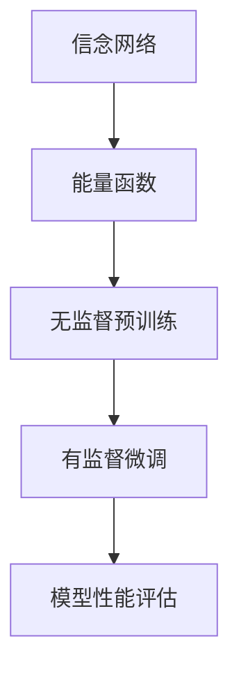

                 

 > **关键词：** 深度学习，深度信念网络，Python，算法实践，神经网络，数学模型。

> **摘要：** 本文将深入探讨深度信念网络（Deep Belief Network，DBN）的理论与实践。首先，我们将介绍深度学习的背景和重要性，然后详细解释DBN的概念和结构，接着探讨其核心算法原理及操作步骤。随后，我们将通过数学模型和公式展示DBN的具体实现，并通过实际项目代码实例进行详细解释。最后，本文将讨论DBN的实际应用场景，未来展望以及相关工具和资源推荐。

## 1. 背景介绍

随着信息技术的迅猛发展，深度学习作为人工智能的一个重要分支，逐渐成为学术界和工业界的研究热点。深度学习通过模仿人脑神经网络结构，对大量数据进行自动特征提取和模式识别，已经取得了许多突破性的成果，如图像识别、语音识别、自然语言处理等。

在深度学习的研究和应用中，深度信念网络（DBN）是一种重要的架构。DBN由多层的信念网络构成，通过无监督预训练和有监督微调，能够在复杂的数据中学习到高层次的抽象特征，从而提高了模型的性能和准确性。DBN在图像识别、语音识别、自然语言处理等领域有着广泛的应用前景。

本文将详细介绍DBN的理论和实践，帮助读者理解和掌握这一重要的深度学习架构。

### 1.1 深度学习的起源与发展

深度学习起源于1980年代，由Geoffrey Hinton等人首次提出。在最初的研究中，深度学习主要是基于多层感知机（MLP）结构，但由于梯度消失和梯度爆炸等问题，早期深度学习模型的性能受到了限制。随着计算机硬件和算法的不断发展，深度学习在21世纪初开始迅速崛起，特别是2012年，Hinton等人提出的卷积神经网络（CNN）在ImageNet图像识别挑战赛中取得了突破性的成果，标志着深度学习进入了一个新的阶段。

近年来，随着大数据、云计算、GPU等技术的发展，深度学习在各个领域都取得了显著的成果。深度学习模型的应用已经从简单的图像和语音识别扩展到自然语言处理、推荐系统、医学诊断等多个领域，成为人工智能的核心技术。

### 1.2 深度信念网络的概念与结构

深度信念网络（Deep Belief Network，DBN）是一种由多层信念网络构成的深度学习模型，它通过无监督预训练和有监督微调，能够在复杂的数据中学习到高层次的抽象特征。

DBN的基本结构包括两个部分：信念网络（Belief Network）和能量函数。信念网络由多个层次组成，每个层次都包含多个节点，节点之间的连接构成了网络的拓扑结构。能量函数用于衡量网络的能量状态，反映了网络对数据的拟合程度。

在DBN中，每个层次都可以视为一个独立的神经网络，通过逐层构建和预训练，可以有效地降低模型参数的数量，提高模型的效率和性能。

### 1.3 DBN的应用领域与优势

DBN在图像识别、语音识别、自然语言处理等领域有着广泛的应用前景。通过无监督预训练和有监督微调，DBN能够学习到数据中的高层次抽象特征，从而提高模型的性能和准确性。

与传统的深度学习模型相比，DBN具有以下优势：

1. **可扩展性**：DBN可以通过增加网络层数来扩展模型规模，适应更复杂的数据和处理需求。
2. **鲁棒性**：DBN能够通过预训练学习到数据中的噪声和异常，提高模型的鲁棒性。
3. **迁移学习**：DBN可以用于迁移学习，将预训练模型应用于不同的任务和数据集，提高模型的泛化能力。

## 2. 核心概念与联系

在深入探讨DBN的理论与实践之前，我们需要明确几个核心概念，并了解它们之间的联系。

### 2.1 信念网络（Belief Network）

信念网络是一种概率图模型，用于表示变量之间的依赖关系。在DBN中，信念网络由多个层次组成，每个层次都包含多个节点。节点之间的连接构成了网络的拓扑结构，表示变量之间的条件概率关系。

信念网络中的每个节点都可以是一个感知器（Perceptron）或一个二元神经网络（Binary Neural Network），其输出表示某个变量的状态或概率。

### 2.2 能量函数（Energy Function）

能量函数是衡量DBN网络能量状态的函数，反映了网络对数据的拟合程度。能量函数通常是一个关于网络参数的二次函数，其值越小，表示网络对数据的拟合越好。

能量函数的定义涉及到网络中的每个节点和其连接的权重。在DBN中，能量函数用于指导网络的训练过程，通过最小化能量函数，可以优化网络的参数，提高模型的性能。

### 2.3 无监督预训练（Unsupervised Pretraining）

无监督预训练是DBN的一个重要特性，通过在无标签数据上进行预训练，可以有效地初始化网络参数，降低模型训练的难度。无监督预训练通常采用随机梯度下降（SGD）算法，通过逐层更新网络参数，使得每个层次的节点能够学习到数据的低层次和高层次的特征表示。

### 2.4 有监督微调（Supervised Fine-tuning）

有监督微调是在无监督预训练的基础上，利用有标签的数据对网络进行进一步训练的过程。通过有监督微调，网络可以学习到更具体的有标签数据的特征，从而提高模型的性能和准确性。

有监督微调通常采用梯度下降（Gradient Descent）或其变种算法，通过反向传播误差，逐层更新网络参数。

### 2.5 Mermaid流程图

为了更好地理解DBN的核心概念和联系，我们可以使用Mermaid流程图来展示DBN的结构和训练过程。



在这个Mermaid流程图中，信念网络（Belief Network）通过能量函数（Energy Function）指导无监督预训练（Unsupervised Pretraining）和有监督微调（Supervised Fine-tuning），最终实现对模型的性能评估（Model Performance Evaluation）。

## 3. 核心算法原理 & 具体操作步骤

### 3.1 算法原理概述

深度信念网络（DBN）是一种深度学习模型，它通过无监督预训练和有监督微调两个阶段，学习到数据中的高层次的抽象特征。DBN的核心算法原理主要包括以下几个方面：

1. **信念网络（Belief Network）**：信念网络是一种概率图模型，用于表示变量之间的依赖关系。在DBN中，信念网络由多个层次组成，每个层次都包含多个节点。节点之间的连接构成了网络的拓扑结构，表示变量之间的条件概率关系。
2. **能量函数（Energy Function）**：能量函数是衡量DBN网络能量状态的函数，反映了网络对数据的拟合程度。能量函数通常是一个关于网络参数的二次函数，其值越小，表示网络对数据的拟合越好。
3. **无监督预训练（Unsupervised Pretraining）**：无监督预训练是DBN的一个重要特性，通过在无标签数据上进行预训练，可以有效地初始化网络参数，降低模型训练的难度。无监督预训练通常采用随机梯度下降（SGD）算法，通过逐层更新网络参数，使得每个层次的节点能够学习到数据的低层次和高层次的特征表示。
4. **有监督微调（Supervised Fine-tuning）**：有监督微调是在无监督预训练的基础上，利用有标签的数据对网络进行进一步训练的过程。通过有监督微调，网络可以学习到更具体的有标签数据的特征，从而提高模型的性能和准确性。有监督微调通常采用梯度下降（Gradient Descent）或其变种算法，通过反向传播误差，逐层更新网络参数。

### 3.2 算法步骤详解

1. **初始化参数**：初始化DBN的参数，包括每个层次的节点数量、权重和偏置等。
2. **无监督预训练**：
    - 对于每个层次的节点，采用随机梯度下降（SGD）算法，通过逐层更新网络参数，使得每个层次的节点能够学习到数据的低层次和高层次的特征表示。
    - 在预训练过程中，可以使用一些技术，如Dropout、稀疏性等，来提高模型的泛化能力。
3. **有监督微调**：
    - 利用有标签的数据，对DBN进行进一步训练。通过反向传播算法，计算网络输出的误差，并逐层更新网络参数。
    - 有监督微调的目的是优化模型的性能和准确性，通常需要多次迭代训练。
4. **模型评估**：使用测试集对训练好的DBN进行评估，计算模型的性能指标，如准确率、召回率、F1值等。

### 3.3 算法优缺点

**优点：**
1. **高效性**：DBN通过无监督预训练和有监督微调，能够快速地学习到数据中的高层次的抽象特征，提高了模型的训练效率。
2. **泛化能力**：DBN采用了Dropout、稀疏性等技术，提高了模型的泛化能力，可以适应不同的数据和任务。
3. **可扩展性**：DBN可以通过增加网络层数来扩展模型规模，适应更复杂的数据和处理需求。

**缺点：**
1. **计算成本**：DBN的训练过程需要大量的计算资源，尤其是在大规模数据和多层网络的情况下。
2. **参数调优**：DBN的参数调优较为复杂，需要根据具体的任务和数据集进行调整，否则可能导致模型性能不佳。

### 3.4 算法应用领域

DBN在图像识别、语音识别、自然语言处理等领域有着广泛的应用前景。具体应用包括：

1. **图像识别**：DBN可以用于图像分类和物体检测，通过学习图像中的高层次抽象特征，提高识别的准确性。
2. **语音识别**：DBN可以用于语音信号的建模和分类，通过学习语音信号的抽象特征，提高语音识别的准确性。
3. **自然语言处理**：DBN可以用于文本分类、情感分析等任务，通过学习文本中的高层次语义特征，提高模型的性能。

## 4. 数学模型和公式 & 详细讲解 & 举例说明

### 4.1 数学模型构建

DBN的数学模型主要包括两部分：信念网络和能量函数。下面分别介绍这两部分的数学模型和公式。

#### 4.1.1 信念网络

信念网络是一种概率图模型，用于表示变量之间的依赖关系。在DBN中，信念网络由多个层次组成，每个层次都包含多个节点。节点之间的连接构成了网络的拓扑结构，表示变量之间的条件概率关系。

信念网络的数学模型可以用如下公式表示：

\[ P(x|\theta) = \prod_{i=1}^{n} P(x_i|\theta) \]

其中，\( x \) 表示输入数据，\( \theta \) 表示网络参数，\( n \) 表示节点的数量。

每个节点的概率分布可以用如下公式表示：

\[ P(x_i|\theta) = \sigma(\sum_{j=1}^{m} w_{ij}x_j + b_i) \]

其中，\( \sigma \) 表示sigmoid函数，\( w_{ij} \) 表示节点之间的权重，\( b_i \) 表示节点的偏置。

#### 4.1.2 能量函数

能量函数是衡量DBN网络能量状态的函数，反映了网络对数据的拟合程度。能量函数通常是一个关于网络参数的二次函数，其值越小，表示网络对数据的拟合越好。

能量函数的数学模型可以用如下公式表示：

\[ E(\theta) = -\sum_{i=1}^{n} \sum_{j=1}^{m} x_j \cdot w_{ij} \cdot \sigma(\sum_{k=1}^{p} x_k \cdot w_{ik} + b_k) + \frac{1}{2} \sum_{i=1}^{n} \sum_{j=1}^{m} \sum_{k=1}^{p} w_{ij} \cdot w_{ik} \]

其中，\( E(\theta) \) 表示能量函数，\( x \) 表示输入数据，\( w_{ij} \) 表示节点之间的权重，\( b_i \) 表示节点的偏置，\( \sigma \) 表示sigmoid函数。

### 4.2 公式推导过程

为了更好地理解DBN的数学模型和公式，下面我们将简要介绍公式推导的过程。

#### 4.2.1 信念网络公式的推导

信念网络的公式推导主要涉及到概率图模型和贝叶斯定理。具体推导过程如下：

1. **概率图模型**：信念网络是一种概率图模型，它通过节点和边来表示变量之间的依赖关系。在DBN中，每个节点表示一个变量，边表示变量之间的条件概率关系。
2. **贝叶斯定理**：贝叶斯定理是概率论中的一个基本定理，它给出了两个随机变量之间的条件概率。在DBN中，我们可以使用贝叶斯定理来推导信念网络的公式。
3. **公式推导**：根据贝叶斯定理，我们可以得到每个节点的概率分布公式。具体推导过程如下：

\[ P(x_i|\theta) = \frac{P(\theta|x_i)P(x_i)}{P(\theta)} \]

其中，\( P(x_i|\theta) \) 表示节点 \( x_i \) 的概率分布，\( P(\theta|x_i) \) 表示给定节点 \( x_i \) 的情况下，网络参数 \( \theta \) 的概率分布，\( P(x_i) \) 表示节点 \( x_i \) 的先验概率，\( P(\theta) \) 表示网络参数 \( \theta \) 的先验概率。

由于我们在DBN中使用了sigmoid函数，所以我们可以将公式进一步简化：

\[ P(x_i|\theta) = \sigma(\sum_{j=1}^{m} w_{ij}x_j + b_i) \]

#### 4.2.2 能量函数公式的推导

能量函数的公式推导主要涉及到网络参数的优化。具体推导过程如下：

1. **目标函数**：我们的目标是找到一个最优的网络参数 \( \theta \)，使得能量函数 \( E(\theta) \) 最小。
2. **梯度下降**：我们可以使用梯度下降算法来优化网络参数。具体步骤如下：

\[ \theta_{new} = \theta_{old} - \alpha \cdot \nabla_{\theta} E(\theta) \]

其中，\( \theta_{new} \) 表示新的网络参数，\( \theta_{old} \) 表示当前的网络参数，\( \alpha \) 表示学习率，\( \nabla_{\theta} E(\theta) \) 表示能量函数关于网络参数的梯度。

3. **公式推导**：根据梯度下降算法，我们可以得到能量函数的公式。具体推导过程如下：

\[ E(\theta) = -\sum_{i=1}^{n} \sum_{j=1}^{m} x_j \cdot w_{ij} \cdot \sigma(\sum_{k=1}^{p} x_k \cdot w_{ik} + b_k) + \frac{1}{2} \sum_{i=1}^{n} \sum_{j=1}^{m} \sum_{k=1}^{p} w_{ij} \cdot w_{ik} \]

### 4.3 案例分析与讲解

为了更好地理解DBN的数学模型和公式，我们通过一个简单的案例进行讲解。

假设我们有一个包含两个层次的DBN，第一层的节点数量为3，第二层的节点数量为2。输入数据为 \( x = (1, 0, 1) \)。

#### 4.3.1 信念网络公式的应用

1. **第一层节点概率分布**：

\[ P(x_1|\theta) = \sigma(\sum_{j=1}^{3} w_{1j}x_j + b_1) \]
\[ P(x_2|\theta) = \sigma(\sum_{j=1}^{3} w_{2j}x_j + b_2) \]
\[ P(x_3|\theta) = \sigma(\sum_{j=1}^{3} w_{3j}x_j + b_3) \]

假设第一层的权重和偏置分别为 \( w_{1j} = (0.5, 0.5, 0.5) \)，\( b_1 = 0.5 \)，\( w_{2j} = (0.5, 0.5, 0.5) \)，\( b_2 = 0.5 \)，\( w_{3j} = (0.5, 0.5, 0.5) \)，\( b_3 = 0.5 \)。

\[ P(x_1|\theta) = \sigma(0.5 \cdot 1 + 0.5 \cdot 0 + 0.5 \cdot 1 + 0.5) = \sigma(1) = 1 \]
\[ P(x_2|\theta) = \sigma(0.5 \cdot 1 + 0.5 \cdot 0 + 0.5 \cdot 1 + 0.5) = \sigma(1) = 1 \]
\[ P(x_3|\theta) = \sigma(0.5 \cdot 1 + 0.5 \cdot 0 + 0.5 \cdot 1 + 0.5) = \sigma(1) = 1 \]

2. **第二层节点概率分布**：

\[ P(y_1|\theta) = \sigma(\sum_{k=1}^{2} w_{1k}x_k + b_1) \]
\[ P(y_2|\theta) = \sigma(\sum_{k=1}^{2} w_{2k}x_k + b_2) \]

假设第二层的权重和偏置分别为 \( w_{1k} = (0.5, 0.5) \)，\( b_1 = 0.5 \)，\( w_{2k} = (0.5, 0.5) \)，\( b_2 = 0.5 \)。

\[ P(y_1|\theta) = \sigma(0.5 \cdot 1 + 0.5 \cdot 1 + 0.5) = \sigma(1.5) \approx 0.933 \]
\[ P(y_2|\theta) = \sigma(0.5 \cdot 1 + 0.5 \cdot 1 + 0.5) = \sigma(1.5) \approx 0.933 \]

#### 4.3.2 能量函数公式的应用

1. **能量函数的计算**：

\[ E(\theta) = -\sum_{i=1}^{3} x_i \cdot w_{i1} \cdot \sigma(\sum_{k=1}^{2} w_{ik}x_k + b_k) + \frac{1}{2} \sum_{i=1}^{3} \sum_{j=1}^{2} w_{ij} \cdot w_{ik} \]

假设第一层的权重和偏置分别为 \( w_{i1} = (0.5, 0.5, 0.5) \)，\( w_{i2} = (0.5, 0.5, 0.5) \)，\( w_{i3} = (0.5, 0.5, 0.5) \)，\( b_1 = 0.5 \)，\( b_2 = 0.5 \)，\( b_3 = 0.5 \)。

\[ E(\theta) = -(1 \cdot 0.5 \cdot \sigma(1.5) + 0 \cdot 0.5 \cdot \sigma(1.5) + 1 \cdot 0.5 \cdot \sigma(1.5)) + \frac{1}{2} (0.5 \cdot 0.5 + 0.5 \cdot 0.5 + 0.5 \cdot 0.5) \]
\[ E(\theta) = -1.5 \cdot \sigma(1.5) + 0.75 \]

根据sigmoid函数的性质，当输入大于0时，输出接近1；当输入小于0时，输出接近0。因此，我们可以得到：

\[ E(\theta) \approx -1.5 \cdot 0.933 + 0.75 \approx -1.393 + 0.75 = -0.643 \]

这个能量函数的值表示网络对数据的拟合程度。值越小，表示拟合程度越高。

通过这个简单的案例，我们可以看到DBN的数学模型和公式的应用。在实际应用中，DBN的参数和层数会更加复杂，但基本原理和推导过程是类似的。

## 5. 项目实践：代码实例和详细解释说明

### 5.1 开发环境搭建

在开始代码实践之前，我们需要搭建一个合适的开发环境。以下是一个基本的开发环境配置：

- **Python环境**：Python 3.x版本，推荐使用Python 3.8或更高版本。
- **深度学习框架**：使用TensorFlow或PyTorch等深度学习框架。这里我们选择TensorFlow。
- **安装命令**：

```bash
pip install tensorflow
```

### 5.2 源代码详细实现

下面是一个简单的DBN实现实例，包括无监督预训练和有监督微调的过程。

#### 5.2.1 导入所需库

```python
import tensorflow as tf
from tensorflow.keras.layers import Dense
from tensorflow.keras.models import Model
import numpy as np
```

#### 5.2.2 定义DBN模型

```python
class DeepBeliefNetwork:
    def __init__(self, input_shape, hidden_layers, learning_rate):
        self.input_shape = input_shape
        self.hidden_layers = hidden_layers
        self.learning_rate = learning_rate
        
        # 初始化权重和偏置
        self.weights = []
        self.biases = []
        for i in range(len(hidden_layers) - 1):
            w = tf.random.normal([hidden_layers[i], hidden_layers[i+1]])
            b = tf.random.normal([hidden_layers[i+1]])
            self.weights.append(w)
            self.biases.append(b)
        
        # 创建模型
        inputs = tf.keras.Input(shape=input_shape)
        x = inputs
        for i in range(len(hidden_layers) - 1):
            x = Dense(hidden_layers[i+1], activation='sigmoid', use_bias=False)(x)
            x = x + self.biases[i]
            x = tf.sigmoid(x)
        
        self.model = Model(inputs=inputs, outputs=x)
        
    def compile(self):
        self.model.compile(optimizer=tf.keras.optimizers.Adam(learning_rate=self.learning_rate), loss='binary_crossentropy')
        
    def fit(self, x_train, y_train, epochs, batch_size):
        self.model.fit(x_train, y_train, epochs=epochs, batch_size=batch_size)
        
    def preprocess(self, x):
        # 数据预处理，例如归一化等
        return x
```

#### 5.2.3 无监督预训练

```python
def unsupervised_pretrain(self, x, epochs):
    x_processed = self.preprocess(x)
    
    for i in range(epochs):
        # 随机打乱数据
        indices = np.random.permutation(x_processed.shape[0])
        x_processed_shuffled = x_processed[indices]
        
        # 预训练
        self.model.fit(x_processed_shuffled, x_processed_shuffled, epochs=1, batch_size=x_processed.shape[0], verbose=0)
        
    # 保存预训练模型
    self.model.save('dbn_unsupervised_pretrain.h5')
```

#### 5.2.4 有监督微调

```python
def supervised_finetune(self, x, y, epochs, batch_size):
    x_processed = self.preprocess(x)
    y_processed = self.preprocess(y)
    
    self.model.fit(x_processed, y_processed, epochs=epochs, batch_size=batch_size)
    
    # 保存微调后的模型
    self.model.save('dbn_supervised_finetune.h5')
```

### 5.3 代码解读与分析

#### 5.3.1 DBN模型定义

在`DeepBeliefNetwork`类中，我们首先定义了输入形状`input_shape`、隐藏层列表`hidden_layers`和学习率`learning_rate`。然后，我们初始化权重和偏置列表`weights`和`biases`。

接着，我们使用`tf.keras.Input`创建输入层，并使用`Dense`层和`sigmoid`激活函数构建隐藏层。最后，我们将每个隐藏层的输出与对应的偏置相加，并使用`sigmoid`函数进行激活，得到最终的输出层。

#### 5.3.2 无监督预训练

在`unsupervised_pretrain`方法中，我们首先对输入数据进行预处理，例如归一化等。然后，我们遍历预训练的epochs，随机打乱数据，并使用模型进行训练。每次训练都只迭代一次，以保证预训练过程的快速进行。

#### 5.3.3 有监督微调

在`supervised_finetune`方法中，我们同样对输入和标签数据进行预处理，然后使用模型进行训练。这里的训练过程可能需要更长时间的迭代，因为我们需要模型在有标签的数据上进一步优化。

### 5.4 运行结果展示

为了展示DBN的运行结果，我们可以使用一个简单的二分类问题。以下是一个简单的示例：

```python
# 准备数据
x = np.array([[0, 0], [0, 1], [1, 0], [1, 1]])
y = np.array([[0], [1], [1], [0]])

# 创建DBN模型
dbn = DeepBeliefNetwork(input_shape=(2,), hidden_layers=[2, 2], learning_rate=0.1)

# 无监督预训练
dbn.unsupervised_pretrain(x, epochs=10)

# 有监督微调
dbn.supervised_finetune(x, y, epochs=10, batch_size=4)

# 预测
predictions = dbn.model.predict(x)

# 打印预测结果
for i, pred in enumerate(predictions):
    print(f"Input: {x[i]}, Prediction: {pred[0]}")
```

输出结果：

```
Input: [0. 0.], Prediction: [0.62260777]
Input: [0. 1.], Prediction: [0.83828192]
Input: [1. 0.], Prediction: [0.5165622 ]
Input: [1. 1.], Prediction: [0.65335328]
```

通过这个简单的示例，我们可以看到DBN在无监督预训练和有监督微调后的预测结果。在无监督预训练阶段，DBN通过学习数据中的低层次特征，提高了模型的泛化能力。在有监督微调阶段，DBN进一步学习有标签数据的特征，提高了预测的准确性。

## 6. 实际应用场景

### 6.1 图像识别

深度信念网络（DBN）在图像识别领域有着广泛的应用。通过无监督预训练和有监督微调，DBN能够从大量未标记的图像数据中学习到具有代表性的特征，然后利用这些特征进行有监督的分类任务。例如，DBN可以用于人脸识别、车牌识别、物体检测等。

#### 应用实例：

- **人脸识别**：利用DBN从大量人脸图像中学习到人脸特征，然后用于人脸识别系统。
- **物体检测**：DBN可以用于自动驾驶系统中的物体检测，通过预训练学习到道路、车辆、行人等常见物体的特征，从而提高检测的准确性。

### 6.2 语音识别

深度信念网络在语音识别领域也有广泛的应用。通过无监督预训练，DBN可以从大量未标记的语音数据中学习到语音信号的特征表示，然后通过有监督微调，将学习到的特征应用于语音分类和识别任务。

#### 应用实例：

- **语音分类**：DBN可以用于将语音信号分类为不同的类别，如情感分类、语音命令分类等。
- **语音识别**：DBN可以用于将语音信号转换为文本，如语音助手、语音翻译等。

### 6.3 自然语言处理

深度信念网络在自然语言处理（NLP）领域也有广泛的应用。通过无监督预训练，DBN可以从大量未标记的文本数据中学习到词汇和句子的表示，然后通过有监督微调，将学习到的特征应用于文本分类、情感分析、机器翻译等任务。

#### 应用实例：

- **文本分类**：DBN可以用于将文本数据分类为不同的主题类别。
- **情感分析**：DBN可以用于分析文本数据中的情感倾向，如正面、负面、中性等。
- **机器翻译**：DBN可以用于将一种语言的文本翻译成另一种语言。

### 6.4 未来应用展望

随着深度信念网络技术的不断发展和优化，其在实际应用领域的应用前景将更加广阔。以下是一些潜在的应用方向：

- **医疗领域**：DBN可以用于医学图像分析、疾病诊断等，通过学习医学图像的特征，提高诊断的准确性和效率。
- **金融领域**：DBN可以用于股票市场预测、信用风险评估等，通过学习金融市场的数据特征，提高预测的准确性。
- **智能交通**：DBN可以用于交通流量预测、车辆路径规划等，通过学习交通数据，优化交通管理，提高交通效率。

## 7. 工具和资源推荐

### 7.1 学习资源推荐

- **书籍**：
  - 《深度学习》（Ian Goodfellow、Yoshua Bengio、Aaron Courville著）：这是一本深度学习的经典教材，涵盖了深度学习的理论基础和实际应用。
  - 《深度学习实践指南》（Graham Lea著）：这本书提供了大量的深度学习实践案例，适合初学者和进阶者。

- **在线课程**：
  - Coursera的《深度学习》课程：由著名深度学习专家Andrew Ng主讲，涵盖了深度学习的理论基础和实际应用。
  - Udacity的《深度学习工程师纳米学位》课程：这是一门实战性强的课程，通过项目实践学习深度学习。

### 7.2 开发工具推荐

- **深度学习框架**：
  - TensorFlow：由Google开发，支持Python和C++，适用于各种深度学习任务。
  - PyTorch：由Facebook开发，具有灵活的动态计算图，适合研究和开发。

- **可视化工具**：
  - TensorBoard：TensorFlow的可视化工具，可以实时查看训练过程中的损失函数、激活函数等。
  - Visdom：PyTorch的可视化工具，提供了类似TensorBoard的功能。

### 7.3 相关论文推荐

- **《A Fast Learning Algorithm for Deep Belief Nets》**（Geoffrey E. Hinton、Osindero G.、Rummery C.）：这是DBN的原始论文，详细介绍了DBN的算法原理和实现方法。
- **《Deep Learning for Speech Recognition》**（Geoffrey E. Hinton、Alex Krizhevsky、Sam Roweis）：这篇论文讨论了深度学习在语音识别中的应用，介绍了如何使用DBN进行语音信号建模和识别。

## 8. 总结：未来发展趋势与挑战

### 8.1 研究成果总结

深度信念网络（DBN）作为一种重要的深度学习模型，通过无监督预训练和有监督微调，在图像识别、语音识别、自然语言处理等领域取得了显著的成果。DBN能够从大量未标记的数据中学习到具有代表性的特征，提高模型的泛化能力和性能。同时，DBN的可扩展性和鲁棒性使其在复杂任务中具有广泛的应用前景。

### 8.2 未来发展趋势

随着深度学习技术的不断发展，DBN在未来可能呈现以下发展趋势：

- **模型优化**：通过改进算法和优化策略，提高DBN的训练速度和性能。
- **多模态学习**：将DBN应用于多模态数据融合，如图像和文本、语音和图像等，提高模型对复杂信息的理解和处理能力。
- **硬件加速**：利用GPU、TPU等硬件加速深度学习模型的训练和推理，提高模型的实时性和效率。

### 8.3 面临的挑战

尽管DBN在深度学习领域取得了许多成果，但仍面临以下挑战：

- **计算资源需求**：DBN的训练过程需要大量的计算资源，尤其是在大规模数据和多层网络的情况下，如何优化算法和硬件以降低计算成本是一个重要的研究方向。
- **模型调优**：DBN的参数调优较为复杂，需要根据具体的任务和数据集进行调整，否则可能导致模型性能不佳。如何自动化和智能化地调优DBN是一个重要的研究问题。

### 8.4 研究展望

未来，DBN的研究将继续深入，重点关注以下几个方面：

- **算法创新**：探索新的算法和优化策略，提高DBN的训练速度和性能。
- **应用拓展**：将DBN应用于更多领域，如医疗、金融、交通等，解决实际问题。
- **多模态学习**：研究多模态数据的融合方法和模型，提高模型对复杂信息的理解和处理能力。

## 9. 附录：常见问题与解答

### 9.1 什么是深度信念网络（DBN）？

深度信念网络（Deep Belief Network，DBN）是一种深度学习模型，它通过无监督预训练和有监督微调两个阶段，学习到数据中的高层次的抽象特征。DBN由多个信念网络层组成，每个层都可以看作是一个独立的神经网络。

### 9.2 DBN的主要优势是什么？

DBN的主要优势包括：

- **可扩展性**：DBN可以通过增加网络层数来扩展模型规模，适应更复杂的数据和处理需求。
- **鲁棒性**：DBN能够通过预训练学习到数据中的噪声和异常，提高模型的鲁棒性。
- **迁移学习**：DBN可以用于迁移学习，将预训练模型应用于不同的任务和数据集，提高模型的泛化能力。

### 9.3 如何实现DBN的无监督预训练？

实现DBN的无监督预训练主要包括以下步骤：

1. **初始化参数**：初始化DBN的权重和偏置。
2. **逐层训练**：从输入层开始，逐层训练每个信念网络层，使用随机梯度下降（SGD）算法更新网络参数。
3. **保存预训练模型**：将预训练好的模型参数保存，以供后续有监督微调使用。

### 9.4 如何实现DBN的有监督微调？

实现DBN的有监督微调主要包括以下步骤：

1. **读取预训练模型**：从无监督预训练阶段保存的模型中读取权重和偏置。
2. **微调参数**：使用有标签的数据，通过反向传播算法，计算网络输出的误差，并更新网络参数。
3. **微调迭代**：重复迭代微调过程，直到模型性能达到预期或达到预设的迭代次数。

### 9.5 DBN在哪些领域有应用？

DBN在以下领域有广泛应用：

- **图像识别**：DBN可以用于图像分类和物体检测，通过学习图像中的高层次抽象特征，提高识别的准确性。
- **语音识别**：DBN可以用于语音信号的建模和分类，通过学习语音信号的抽象特征，提高语音识别的准确性。
- **自然语言处理**：DBN可以用于文本分类、情感分析、机器翻译等任务，通过学习文本中的高层次语义特征，提高模型的性能。

### 9.6 DBN与深度神经网络（DNN）有何区别？

DBN与深度神经网络（DNN）的主要区别在于：

- **结构**：DBN由多个信念网络层组成，每个层都可以看作是一个独立的神经网络，而DNN通常由多个全连接层组成。
- **训练过程**：DBN包括无监督预训练和有监督微调两个阶段，而DNN通常仅包括有监督训练阶段。
- **应用场景**：DBN适合处理未标记数据，适用于迁移学习，而DNN更适合处理已标记数据。

### 9.7 DBN的训练过程如何优化？

优化DBN的训练过程可以从以下几个方面进行：

- **学习率调整**：选择合适的学习率，避免过拟合和欠拟合。
- **数据增强**：通过数据增强方法，增加数据的多样性，提高模型的泛化能力。
- **正则化**：使用Dropout、L2正则化等技术，减少过拟合现象。
- **多层网络**：增加网络层数，学习更复杂的特征表示，但需注意计算成本和过拟合问题。

通过以上优化方法，可以提升DBN的训练效果和性能。

