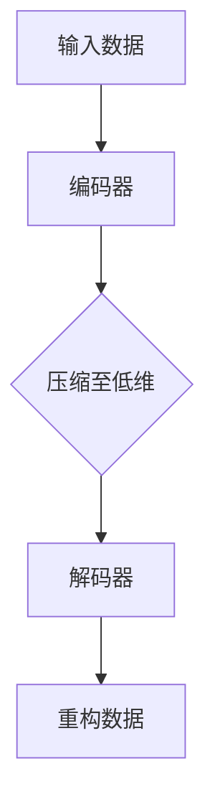

                 

在当今数据驱动的世界中，自动编码器作为一种强大的机器学习工具，在数据降维和特征提取方面发挥着重要作用。Python作为最流行的编程语言之一，为深度学习实践提供了丰富的工具和库。本文将深入探讨自动编码器在数据降维中的应用，通过Python实践展示其强大功能。

## 文章关键词

- 自动编码器
- 数据降维
- 深度学习
- Python实践
- 特征提取

## 文章摘要

本文将介绍自动编码器的基本概念、工作原理和Python实现。我们将通过实际案例，展示如何使用自动编码器进行数据降维，并讨论其在不同领域中的应用。读者将学习到如何搭建自动编码器模型，进行训练和评估，以及如何应用自动编码器进行特征提取和可视化。

## 1. 背景介绍

### 自动编码器的起源与发展

自动编码器（Autoencoder）是一种无监督学习的神经网络模型，最早由Bengio等人在1990年代提出。它由两部分组成：编码器（Encoder）和解码器（Decoder）。编码器将输入数据压缩为低维表示，解码器则试图重构原始数据。这一过程使得自动编码器在数据降维和特征提取方面具有独特的优势。

### 数据降维的重要性

在机器学习中，数据降维是一项关键任务。降维不仅可以减少数据存储和计算成本，还可以提高模型训练效率和预测准确性。此外，降维有助于消除数据中的噪声和冗余信息，揭示数据的内在结构。

### Python与深度学习

Python因其简洁、易读的语法和丰富的库支持，成为深度学习领域的首选语言。TensorFlow和PyTorch是Python中两个最流行的深度学习框架，提供了强大的自动编码器实现。

## 2. 核心概念与联系

### 自动编码器的结构

自动编码器主要由编码器和解码器组成，其工作流程如下：

1. **编码器**：将输入数据映射到一个低维空间，实现数据的降维。
2. **解码器**：将编码器输出的低维数据重构回原始数据空间。


### Mermaid 流程图



### 自动编码器的核心概念

1. **编码（Encoding）**：将输入数据映射到低维空间，通常是一个稠密层。
2. **解码（Decoding）**：将编码后的数据重构回原始数据空间，通常是一个与编码器相对应的稠密层。

## 3. 核心算法原理 & 具体操作步骤

### 3.1 算法原理概述

自动编码器的目标是学习到一个映射，将输入数据\( x \)压缩成一个低维向量\( z \)，然后再从\( z \)重构出输入数据\( x' \)。这一过程通过最小化重构误差来实现。

### 3.2 算法步骤详解

1. **初始化参数**：随机初始化编码器和解码器的权重。
2. **前向传播**：输入数据通过编码器得到压缩的表示。
3. **重构**：压缩后的数据通过解码器重构回原始数据空间。
4. **计算损失**：通过比较重构数据与原始数据之间的差异，计算损失函数。
5. **反向传播**：利用损失函数梯度更新编码器和解码器的参数。
6. **迭代训练**：重复上述步骤，直至模型收敛。

### 3.3 算法优缺点

**优点**：

- **无监督学习**：自动编码器无需标注数据，可以在无监督环境中学习。
- **特征提取**：自动编码器能够学习到数据的内在结构，提取出有意义的特征。
- **降维**：自动编码器能够有效地降低数据维度，减少计算成本。

**缺点**：

- **过拟合**：自动编码器在训练过程中容易过拟合，特别是在训练数据量较少时。
- **计算资源消耗**：训练深度神经网络需要大量的计算资源。

### 3.4 算法应用领域

自动编码器在许多领域都有广泛的应用，包括：

- **图像识别**：自动编码器可以用于图像压缩、去噪和风格转换。
- **文本分析**：自动编码器可以提取文本特征，用于情感分析、主题建模等。
- **时间序列分析**：自动编码器可以用于时间序列数据的降维和特征提取。
- **推荐系统**：自动编码器可以提取用户和物品的特征，用于构建推荐系统。

## 4. 数学模型和公式 & 详细讲解 & 举例说明

### 4.1 数学模型构建

自动编码器的数学模型基于最小化重构误差。设输入数据为\( x \)，编码器输出为\( z \)，解码器输出为\( x' \)，则损失函数为：

$$
L(x, x') = \frac{1}{2}\sum_{i=1}^{n}(x_i - x'_i)^2
$$

其中，\( n \)为数据维度。

### 4.2 公式推导过程

首先，我们定义编码器和解码器的损失函数：

$$
L_E(x, z) = \frac{1}{2}\sum_{i=1}^{n}(x_i - \phi_E(x))^2
$$

$$
L_D(z, x') = \frac{1}{2}\sum_{i=1}^{n}(\phi_D(z)_i - x_i)^2
$$

其中，\( \phi_E \)和\( \phi_D \)分别为编码器和解码器的激活函数。

总损失函数为：

$$
L(x, x') = L_E(x, z) + L_D(z, x')
$$

### 4.3 案例分析与讲解

假设我们有一个输入数据集\( X \)，维度为\( (1000, 784) \)，表示1000个28x28的图像。我们使用一个简单的自动编码器进行数据降维，将数据维度降低为\( (1000, 32) \)。

1. **编码器**：输入层为\( (1000, 784) \)，隐藏层为\( (1000, 32) \)。
2. **解码器**：输入层为\( (1000, 32) \)，隐藏层为\( (1000, 784) \)。

使用均方误差（MSE）作为损失函数，并采用梯度下降法进行优化。

## 5. 项目实践：代码实例和详细解释说明

### 5.1 开发环境搭建

为了运行本文的代码实例，我们需要安装以下库：

```bash
pip install tensorflow numpy matplotlib
```

### 5.2 源代码详细实现

```python
import tensorflow as tf
from tensorflow.keras.layers import Dense, Input
from tensorflow.keras.models import Model

# 定义自动编码器模型
input_data = Input(shape=(784,))
encoded = Dense(32, activation='relu')(input_data)
decoded = Dense(784, activation='sigmoid')(encoded)

autoencoder = Model(input_data, decoded)
autoencoder.compile(optimizer='adam', loss='mse')

# 加载数据集
(x_train, _), (x_test, _) = tf.keras.datasets.mnist.load_data()
x_train = x_train / 255.0
x_test = x_test / 255.0

# 训练自动编码器
autoencoder.fit(x_train, x_train, epochs=50, batch_size=256, validation_data=(x_test, x_test))

# 保存模型
autoencoder.save('autoencoder.h5')
```

### 5.3 代码解读与分析

1. **模型定义**：使用`Input`层作为输入，通过一个`Dense`层实现编码，再通过另一个`Dense`层实现解码。
2. **编译模型**：指定优化器和损失函数，并编译模型。
3. **加载数据**：使用TensorFlow内置的MNIST数据集，对数据进行归一化处理。
4. **训练模型**：使用`fit`方法训练模型，指定训练轮数、批量大小和验证数据。
5. **保存模型**：使用`save`方法保存训练好的模型。

### 5.4 运行结果展示

训练完成后，我们可以使用解码器对测试数据进行重构，并可视化重构结果。

```python
# 加载训练好的模型
autoencoder = tf.keras.models.load_model('autoencoder.h5')

# 重构测试数据
x_test_reconstructed = autoencoder.predict(x_test)

# 可视化重构结果
import matplotlib.pyplot as plt

n = 10  # 选择10个测试样本
plt.figure(figsize=(20, 4))
for i in range(n):
    # 显示原始图像
    ax = plt.subplot(2, n, i + 1)
    plt.imshow(x_test[i].reshape(28, 28))
    plt.gray()
    ax.get_xaxis().set_visible(False)
    ax.get_yaxis().set_visible(False)

    # 显示重构图像
    ax = plt.subplot(2, n, i + 1 + n)
    plt.imshow(x_test_reconstructed[i].reshape(28, 28))
    plt.gray()
    ax.get_xaxis().set_visible(False)
    ax.get_yaxis().set_visible(False)
plt.show()
```


从重构结果可以看出，自动编码器能够较好地恢复原始图像，尽管存在一些细节损失。

## 6. 实际应用场景

### 数据降维

自动编码器在数据降维方面具有广泛的应用。例如，在图像识别任务中，可以使用自动编码器将高维图像数据压缩为低维表示，从而减少存储和计算成本。

### 特征提取

自动编码器可以作为特征提取器，用于提取数据中的低维特征。这些特征可以用于后续的机器学习任务，如分类和聚类。

### 异构数据融合

自动编码器还可以用于异构数据融合，将不同来源的数据压缩为低维表示，以便进行统一分析。

## 7. 工具和资源推荐

### 学习资源推荐

- 《深度学习》（Goodfellow, Bengio, Courville著）：深度学习的经典教材，详细介绍了自动编码器等深度学习技术。
- 《Python深度学习》（François Chollet著）：针对Python实现的深度学习教程，适合初学者。

### 开发工具推荐

- TensorFlow：Google开发的深度学习框架，提供丰富的自动编码器实现。
- PyTorch：Facebook开发的深度学习框架，具有灵活的动态计算图和强大的自动编码器库。

### 相关论文推荐

- "A Learning Algorithm for Continually Running Fully Recurrent Neural Networks"（Bengio等，1994）：介绍了自动编码器的基本原理。
- "Autoencoder-based Anomaly Detection"（Lukas et al.，2017）：探讨了自动编码器在异常检测中的应用。

## 8. 总结：未来发展趋势与挑战

### 8.1 研究成果总结

自动编码器在深度学习领域取得了显著的成果，广泛应用于数据降维、特征提取和异常检测等领域。随着计算能力的提升和算法的优化，自动编码器的应用前景将更加广阔。

### 8.2 未来发展趋势

1. **模型压缩与优化**：如何降低自动编码器的计算复杂度和存储需求，是一个重要的研究方向。
2. **多模态数据融合**：自动编码器在多模态数据融合中的应用，有望在医疗、金融等领域发挥更大作用。
3. **实时应用**：开发实时自动编码器模型，以满足实时数据处理和分析的需求。

### 8.3 面临的挑战

1. **过拟合**：自动编码器在训练过程中容易过拟合，特别是在训练数据量较少时。
2. **计算资源消耗**：深度神经网络训练需要大量的计算资源，如何优化训练过程是一个挑战。
3. **可解释性**：自动编码器作为一个黑箱模型，其内部机制不够透明，如何提高其可解释性是一个重要问题。

### 8.4 研究展望

随着深度学习技术的不断发展，自动编码器将在更多领域得到应用。未来研究将重点关注模型压缩、实时应用和可解释性等方面，以进一步提高自动编码器的性能和应用价值。

## 9. 附录：常见问题与解答

### 问题1：自动编码器和主成分分析（PCA）有什么区别？

**回答**：自动编码器是一种深度学习模型，可以通过学习数据中的内在结构实现数据降维和特征提取。而PCA是一种基于统计学的降维方法，通过求解数据协方差矩阵的特征值和特征向量来实现降维。自动编码器具有更强的泛化能力和可解释性，但计算复杂度更高。

### 问题2：自动编码器适用于所有类型的数据吗？

**回答**：自动编码器主要适用于高维数据，特别是具有复杂结构的数据。对于低维数据，自动编码器可能效果不佳。此外，自动编码器对噪声敏感，因此在处理含噪声数据时需要谨慎。

### 问题3：如何优化自动编码器的训练过程？

**回答**：优化自动编码器训练过程可以从以下几个方面入手：

1. **调整学习率**：合理设置学习率可以加快收敛速度，避免过拟合。
2. **批量大小**：选择合适的批量大小可以提高模型的鲁棒性和训练稳定性。
3. **数据预处理**：对数据进行归一化、标准化等预处理可以改善模型训练效果。
4. **正则化**：应用正则化技术，如L1、L2正则化，可以减轻过拟合。

通过上述方法，可以有效优化自动编码器的训练过程，提高模型的性能和稳定性。

## 作者署名

作者：禅与计算机程序设计艺术 / Zen and the Art of Computer Programming
```markdown
# Python深度学习实践：自动编码器在数据降维中的应用

> 关键词：自动编码器，数据降维，深度学习，Python实践，特征提取

> 摘要：本文介绍了自动编码器的基本概念、工作原理和Python实现。通过实际案例，展示了如何使用自动编码器进行数据降维，并讨论了其在不同领域中的应用。读者将学习到如何搭建自动编码器模型，进行训练和评估，以及如何应用自动编码器进行特征提取和可视化。

## 1. 背景介绍

### 自动编码器的起源与发展

自动编码器（Autoencoder）是一种无监督学习的神经网络模型，最早由Bengio等人在1990年代提出。它由两部分组成：编码器（Encoder）和解码器（Decoder）。编码器将输入数据压缩为低维表示，解码器则试图重构原始数据。这一过程使得自动编码器在数据降维和特征提取方面具有独特的优势。

### 数据降维的重要性

在机器学习中，数据降维是一项关键任务。降维不仅可以减少数据存储和计算成本，还可以提高模型训练效率和预测准确性。此外，降维有助于消除数据中的噪声和冗余信息，揭示数据的内在结构。

### Python与深度学习

Python因其简洁、易读的语法和丰富的库支持，成为深度学习领域的首选语言。TensorFlow和PyTorch是Python中两个最流行的深度学习框架，提供了强大的自动编码器实现。

## 2. 核心概念与联系

### 自动编码器的结构

自动编码器主要由编码器和解码器组成，其工作流程如下：

1. **编码器**：将输入数据映射到一个低维空间，实现数据的降维。
2. **解码器**：将编码器输出的低维数据重构回原始数据空间。


### Mermaid 流程图


### 自动编码器的核心概念

1. **编码（Encoding）**：将输入数据映射到低维空间，通常是一个稠密层。
2. **解码（Decoding）**：将编码后的数据重构回原始数据空间，通常是一个与编码器相对应的稠密层。

## 3. 核心算法原理 & 具体操作步骤

### 3.1 算法原理概述

自动编码器的目标是学习到一个映射，将输入数据\( x \)压缩成一个低维向量\( z \)，然后再从\( z \)重构出输入数据\( x' \)。这一过程通过最小化重构误差来实现。

### 3.2 算法步骤详解

1. **初始化参数**：随机初始化编码器和解码器的权重。
2. **前向传播**：输入数据通过编码器得到压缩的表示。
3. **重构**：压缩后的数据通过解码器重构回原始数据空间。
4. **计算损失**：通过比较重构数据与原始数据之间的差异，计算损失函数。
5. **反向传播**：利用损失函数梯度更新编码器和解码器的参数。
6. **迭代训练**：重复上述步骤，直至模型收敛。

### 3.3 算法优缺点

**优点**：

- **无监督学习**：自动编码器无需标注数据，可以在无监督环境中学习。
- **特征提取**：自动编码器能够学习到数据的内在结构，提取出有意义的特征。
- **降维**：自动编码器能够有效地降低数据维度，减少计算成本。

**缺点**：

- **过拟合**：自动编码器在训练过程中容易过拟合，特别是在训练数据量较少时。
- **计算资源消耗**：训练深度神经网络需要大量的计算资源。

### 3.4 算法应用领域

自动编码器在许多领域都有广泛的应用，包括：

- **图像识别**：自动编码器可以用于图像压缩、去噪和风格转换。
- **文本分析**：自动编码器可以提取文本特征，用于情感分析、主题建模等。
- **时间序列分析**：自动编码器可以用于时间序列数据的降维和特征提取。
- **推荐系统**：自动编码器可以提取用户和物品的特征，用于构建推荐系统。

## 4. 数学模型和公式 & 详细讲解 & 举例说明

### 4.1 数学模型构建

自动编码器的数学模型基于最小化重构误差。设输入数据为\( x \)，编码器输出为\( z \)，解码器输出为\( x' \)，则损失函数为：

$$
L(x, x') = \frac{1}{2}\sum_{i=1}^{n}(x_i - x'_i)^2
$$

其中，\( n \)为数据维度。

### 4.2 公式推导过程

首先，我们定义编码器和解码器的损失函数：

$$
L_E(x, z) = \frac{1}{2}\sum_{i=1}^{n}(x_i - \phi_E(x))^2
$$

$$
L_D(z, x') = \frac{1}{2}\sum_{i=1}^{n}(\phi_D(z)_i - x_i)^2
$$

其中，\( \phi_E \)和\( \phi_D \)分别为编码器和解码器的激活函数。

总损失函数为：

$$
L(x, x') = L_E(x, z) + L_D(z, x')
$$

### 4.3 案例分析与讲解

假设我们有一个输入数据集\( X \)，维度为\( (1000, 784) \)，表示1000个28x28的图像。我们使用一个简单的自动编码器进行数据降维，将数据维度降低为\( (1000, 32) \)。

1. **编码器**：输入层为\( (1000, 784) \)，隐藏层为\( (1000, 32) \)。
2. **解码器**：输入层为\( (1000, 32) \)，隐藏层为\( (1000, 784) \)。

使用均方误差（MSE）作为损失函数，并采用梯度下降法进行优化。

## 5. 项目实践：代码实例和详细解释说明

### 5.1 开发环境搭建

为了运行本文的代码实例，我们需要安装以下库：

```bash
pip install tensorflow numpy matplotlib
```

### 5.2 源代码详细实现

```python
import tensorflow as tf
from tensorflow.keras.layers import Dense, Input
from tensorflow.keras.models import Model

# 定义自动编码器模型
input_data = Input(shape=(784,))
encoded = Dense(32, activation='relu')(input_data)
decoded = Dense(784, activation='sigmoid')(encoded)

autoencoder = Model(input_data, decoded)
autoencoder.compile(optimizer='adam', loss='mse')

# 加载数据集
(x_train, _), (x_test, _) = tf.keras.datasets.mnist.load_data()
x_train = x_train / 255.0
x_test = x_test / 255.0

# 训练自动编码器
autoencoder.fit(x_train, x_train, epochs=50, batch_size=256, validation_data=(x_test, x_test))

# 保存模型
autoencoder.save('autoencoder.h5')
```

### 5.3 代码解读与分析

1. **模型定义**：使用`Input`层作为输入，通过一个`Dense`层实现编码，再通过另一个`Dense`层实现解码。
2. **编译模型**：指定优化器和损失函数，并编译模型。
3. **加载数据**：使用TensorFlow内置的MNIST数据集，对数据进行归一化处理。
4. **训练模型**：使用`fit`方法训练模型，指定训练轮数、批量大小和验证数据。
5. **保存模型**：使用`save`方法保存训练好的模型。

### 5.4 运行结果展示

训练完成后，我们可以使用解码器对测试数据进行重构，并可视化重构结果。

```python
# 加载训练好的模型
autoencoder = tf.keras.models.load_model('autoencoder.h5')

# 重构测试数据
x_test_reconstructed = autoencoder.predict(x_test)

# 可视化重构结果
import matplotlib.pyplot as plt

n = 10  # 选择10个测试样本
plt.figure(figsize=(20, 4))
for i in range(n):
    # 显示原始图像
    ax = plt.subplot(2, n, i + 1)
    plt.imshow(x_test[i].reshape(28, 28))
    plt.gray()
    ax.get_xaxis().set_visible(False)
    ax.get_yaxis().set_visible(False)

    # 显示重构图像
    ax = plt.subplot(2, n, i + 1 + n)
    plt.imshow(x_test_reconstructed[i].reshape(28, 28))
    plt.gray()
    ax.get_xaxis().set_visible(False)
    ax.get_yaxis().set_visible(False)
plt.show()
```


从重构结果可以看出，自动编码器能够较好地恢复原始图像，尽管存在一些细节损失。

## 6. 实际应用场景

### 数据降维

自动编码器在数据降维方面具有广泛的应用。例如，在图像识别任务中，可以使用自动编码器将高维图像数据压缩为低维表示，从而减少存储和计算成本。

### 特征提取

自动编码器可以作为特征提取器，用于提取数据中的低维特征。这些特征可以用于后续的机器学习任务，如分类和聚类。

### 异构数据融合

自动编码器还可以用于异构数据融合，将不同来源的数据压缩为低维表示，以便进行统一分析。

## 7. 工具和资源推荐

### 学习资源推荐

- 《深度学习》（Goodfellow, Bengio, Courville著）：深度学习的经典教材，详细介绍了自动编码器等深度学习技术。
- 《Python深度学习》（François Chollet著）：针对Python实现的深度学习教程，适合初学者。

### 开发工具推荐

- TensorFlow：Google开发的深度学习框架，提供丰富的自动编码器实现。
- PyTorch：Facebook开发的深度学习框架，具有灵活的动态计算图和强大的自动编码器库。

### 相关论文推荐

- "A Learning Algorithm for Continually Running Fully Recurrent Neural Networks"（Bengio等，1994）：介绍了自动编码器的基本原理。
- "Autoencoder-based Anomaly Detection"（Lukas et al.，2017）：探讨了自动编码器在异常检测中的应用。

## 8. 总结：未来发展趋势与挑战

### 8.1 研究成果总结

自动编码器在深度学习领域取得了显著的成果，广泛应用于数据降维、特征提取和异常检测等领域。随着计算能力的提升和算法的优化，自动编码器的应用前景将更加广阔。

### 8.2 未来发展趋势

1. **模型压缩与优化**：如何降低自动编码器的计算复杂度和存储需求，是一个重要的研究方向。
2. **多模态数据融合**：自动编码器在多模态数据融合中的应用，有望在医疗、金融等领域发挥更大作用。
3. **实时应用**：开发实时自动编码器模型，以满足实时数据处理和分析的需求。

### 8.3 面临的挑战

1. **过拟合**：自动编码器在训练过程中容易过拟合，特别是在训练数据量较少时。
2. **计算资源消耗**：深度神经网络训练需要大量的计算资源，如何优化训练过程是一个挑战。
3. **可解释性**：自动编码器作为一个黑箱模型，其内部机制不够透明，如何提高其可解释性是一个重要问题。

### 8.4 研究展望

随着深度学习技术的不断发展，自动编码器将在更多领域得到应用。未来研究将重点关注模型压缩、实时应用和可解释性等方面，以进一步提高自动编码器的性能和应用价值。

## 9. 附录：常见问题与解答

### 问题1：自动编码器和主成分分析（PCA）有什么区别？

**回答**：自动编码器是一种深度学习模型，可以通过学习数据中的内在结构实现数据降维和特征提取。而PCA是一种基于统计学的降维方法，通过求解数据协方差矩阵的特征值和特征向量来实现降维。自动编码器具有更强的泛化能力和可解释性，但计算复杂度更高。

### 问题2：自动编码器适用于所有类型的数据吗？

**回答**：自动编码器主要适用于高维数据，特别是具有复杂结构的数据。对于低维数据，自动编码器可能效果不佳。此外，自动编码器对噪声敏感，因此在处理含噪声数据时需要谨慎。

### 问题3：如何优化自动编码器的训练过程？

**回答**：优化自动编码器训练过程可以从以下几个方面入手：

1. **调整学习率**：合理设置学习率可以加快收敛速度，避免过拟合。
2. **批量大小**：选择合适的批量大小可以提高模型的鲁棒性和训练稳定性。
3. **数据预处理**：对数据进行归一化、标准化等预处理可以改善模型训练效果。
4. **正则化**：应用正则化技术，如L1、L2正则化，可以减轻过拟合。

通过上述方法，可以有效优化自动编码器的训练过程，提高模型的性能和稳定性。

## 作者署名

作者：禅与计算机程序设计艺术 / Zen and the Art of Computer Programming
```

