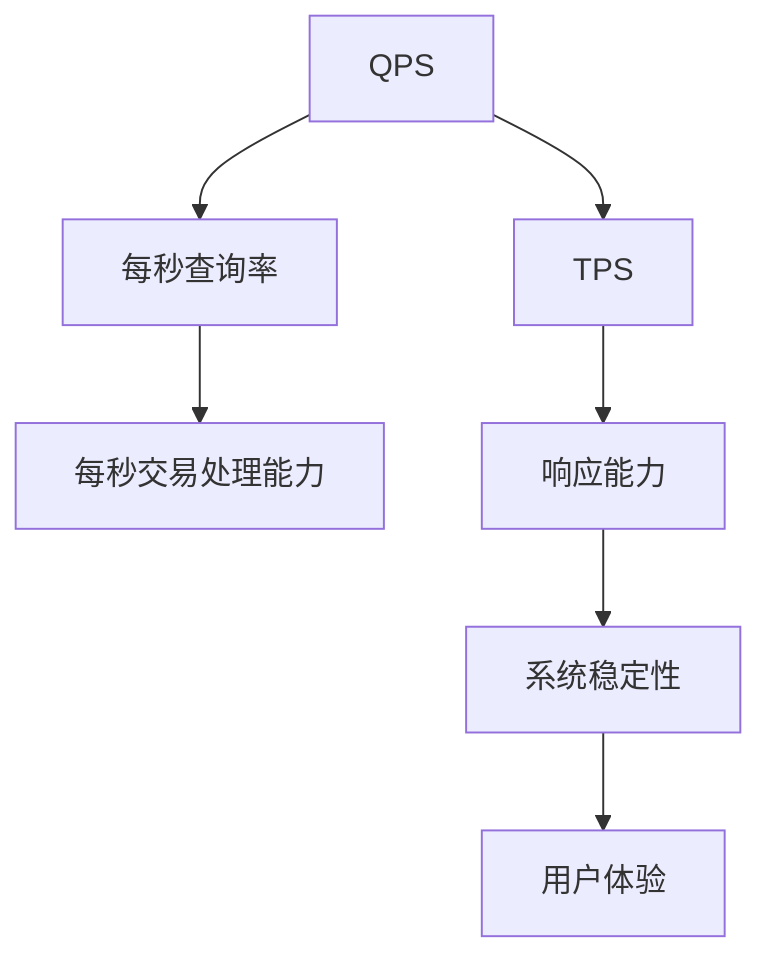

                 

关键词：QPS，TPS，性能指标，计算，应用场景，数据库，Web应用，网络服务，大数据，云计算

## 摘要

本文主要介绍了QPS（每秒查询率）和TPS（每秒交易处理能力）这两个关键的性能指标的计算方法及其在实际应用场景中的重要性。通过对这两个指标的理解，读者可以更好地评估系统性能，优化系统设计，从而提高用户体验和系统稳定性。文章分为以下几个部分：背景介绍、核心概念与联系、核心算法原理与具体操作步骤、数学模型和公式详细讲解、项目实践、实际应用场景、未来应用展望、工具和资源推荐以及总结与展望。

## 1. 背景介绍

在现代信息技术飞速发展的背景下，数据已成为企业和社会的核心资产。然而，随着数据规模的不断增长，如何高效地处理和分析数据成为一个亟待解决的问题。QPS和TPS作为评估系统性能的两个关键指标，对于保障数据处理的效率和准确性具有重要意义。

QPS主要用于衡量Web应用或网络服务的响应能力，即每秒能够处理的查询请求数量。而TPS则关注于数据库系统或交易处理系统的处理能力，即每秒能够完成的交易操作数量。这两个指标不仅反映了系统的性能，还对系统设计和优化提供了重要的参考。

### 1.1 历史背景

QPS和TPS的概念起源于20世纪90年代互联网的兴起。随着Web应用的普及，如何衡量Web服务器的性能成为一个重要问题。最初，QPS和TPS的概念主要应用于Web服务器性能测试。后来，随着数据库和大数据技术的不断发展，这两个指标逐渐扩展到更广泛的应用领域。

### 1.2 应用现状

目前，QPS和TPS已被广泛应用于各种信息系统和服务的性能评估中。例如，在电子商务、在线教育、社交媒体等领域，QPS和TPS成为衡量系统性能和用户体验的重要指标。同时，随着云计算和大数据技术的普及，QPS和TPS的应用场景也在不断扩展。

## 2. 核心概念与联系

在理解QPS和TPS之前，我们需要先了解一些相关概念，如图1所示。



### 2.1 QPS

QPS（每秒查询率，Queries Per Second）是一个衡量系统在单位时间内能够处理查询请求的数量。通常，QPS用于评估Web应用或网络服务的响应能力。例如，一个Web服务器的QPS可能是1000，这意味着它每秒能够处理1000个查询请求。

### 2.2 TPS

TPS（每秒交易处理能力，Transactions Per Second）是一个衡量系统在单位时间内能够完成交易操作的数量。交易操作通常涉及数据的插入、更新、删除等。TPS主要用于数据库系统和交易处理系统的性能评估。

### 2.3 联系与区别

QPS和TPS虽然都是性能指标，但它们关注的方面有所不同。QPS侧重于系统的响应能力，而TPS则关注系统的处理能力。在实际应用中，这两个指标常常需要综合考虑，以便全面评估系统的性能。

## 3. 核心算法原理 & 具体操作步骤

### 3.1 算法原理概述

QPS和TPS的计算方法虽然有所不同，但它们的计算原理都是基于单位时间内的操作次数。具体来说，QPS的计算公式为：

$$
QPS = \frac{总查询次数}{总时间}
$$

而TPS的计算公式为：

$$
TPS = \frac{总交易次数}{总时间}
$$

其中，总查询次数和总交易次数可以通过日志统计或实时监控获取，总时间则是单位时间（例如秒）。

### 3.2 算法步骤详解

#### 3.2.1 QPS计算步骤

1. 收集查询日志：从Web服务器或数据库系统中收集查询日志。
2. 统计总查询次数：根据查询日志，统计单位时间内的总查询次数。
3. 计算QPS：使用公式 $$ QPS = \frac{总查询次数}{总时间} $$ 计算QPS。

#### 3.2.2 TPS计算步骤

1. 收集交易日志：从数据库系统或交易处理系统中收集交易日志。
2. 统计总交易次数：根据交易日志，统计单位时间内的总交易次数。
3. 计算TPS：使用公式 $$ TPS = \frac{总交易次数}{总时间} $$ 计算TPS。

### 3.3 算法优缺点

#### 3.3.1 QPS

**优点：**
- 简单易懂，易于计算。
- 能够快速反映系统的响应能力。

**缺点：**
- 只考虑查询操作，无法全面反映系统的处理能力。
- 可能会受到异常高查询次数的影响，导致数据不准确。

#### 3.3.2 TPS

**优点：**
- 能够全面反映系统的处理能力。
- 可以用于评估数据库系统或交易处理系统的性能。

**缺点：**
- 计算过程相对复杂，需要收集和分析交易日志。
- 可能会受到异常高交易次数的影响，导致数据不准确。

### 3.4 算法应用领域

QPS和TPS的应用领域非常广泛，包括但不限于以下场景：

- Web应用性能评估：通过QPS评估Web服务器的响应能力。
- 数据库系统性能评估：通过TPS评估数据库系统的处理能力。
- 大数据平台性能评估：通过QPS和TPS评估大数据处理平台的性能。
- 云计算服务性能评估：通过QPS和TPS评估云计算服务的性能。

## 4. 数学模型和公式 & 详细讲解 & 举例说明

### 4.1 数学模型构建

为了更深入地理解QPS和TPS，我们需要构建相应的数学模型。具体来说，我们可以使用概率论和统计学的方法来描述这两个指标。

#### 4.1.1 QPS数学模型

假设在单位时间内，有N个查询请求到达系统。根据泊松分布，单位时间内的查询请求数量服从参数为λ（λ为平均到达率）的泊松分布。因此，QPS的数学模型可以表示为：

$$
QPS = \frac{λ}{1 - e^{-λ}}
$$

其中，$$ \frac{λ}{1 - e^{-λ}} $$ 是泊松分布的累积分布函数。

#### 4.1.2 TPS数学模型

类似地，假设在单位时间内，有N个交易操作到达系统。根据泊松分布，单位时间内的交易操作数量也服从参数为λ的泊松分布。因此，TPS的数学模型可以表示为：

$$
TPS = \frac{λ}{1 - e^{-λ}}
$$

### 4.2 公式推导过程

为了推导QPS和TPS的数学模型，我们需要利用泊松分布的性质。泊松分布是一种描述事件发生次数的概率分布，其概率质量函数（PDF）为：

$$
P(X = k) = \frac{λ^k e^{-λ}}{k!}
$$

其中，X为事件发生的次数，λ为事件平均发生次数。

#### 4.2.1 QPS公式推导

对于QPS，我们关注的是单位时间内的查询请求数量。根据泊松分布的性质，单位时间内的查询请求数量服从参数为λ的泊松分布。因此，QPS的概率质量函数为：

$$
P(QPS = k) = \frac{λ^k e^{-λ}}{k!}
$$

为了计算QPS，我们需要计算单位时间内查询请求数量大于等于k的概率。根据泊松分布的累积分布函数（CDF），我们有：

$$
P(QPS \geq k) = 1 - P(QPS < k) = 1 - \sum_{i=0}^{k-1} \frac{λ^i e^{-λ}}{i!}
$$

为了简化计算，我们可以使用泰勒级数展开：

$$
1 - e^{-λ} = \sum_{i=1}^{\infty} \frac{(-1)^{i-1}λ^i}{i!}
$$

将泰勒级数代入累积分布函数，我们有：

$$
P(QPS \geq k) = 1 - \sum_{i=0}^{k-1} \frac{λ^i e^{-λ}}{i!} = \sum_{i=k}^{\infty} \frac{(-1)^{i-1}λ^i}{i!}
$$

为了计算QPS，我们需要计算累积分布函数的导数：

$$
\frac{dP(QPS \geq k)}{dk} = \frac{d}{dk} \left( \sum_{i=k}^{\infty} \frac{(-1)^{i-1}λ^i}{i!} \right)
$$

使用链式法则和指数函数的导数，我们有：

$$
\frac{dP(QPS \geq k)}{dk} = \frac{λ^k e^{-λ}}{k!} \left( \frac{1}{k} - e^{-λ} \right)
$$

为了简化计算，我们可以将 $$ \frac{1}{k} - e^{-λ} $$ 表示为：

$$
\frac{1}{k} - e^{-λ} = \frac{1}{k} \left( 1 - ke^{-λ} \right)
$$

将上式代入，我们有：

$$
\frac{dP(QPS \geq k)}{dk} = \frac{λ^k e^{-λ}}{k!} \left( \frac{1}{k} \left( 1 - ke^{-λ} \right) \right)
$$

$$
\frac{dP(QPS \geq k)}{dk} = \frac{λ^k e^{-λ}}{k!} \left( \frac{1}{k} - e^{-λ} \right)
$$

$$
\frac{dP(QPS \geq k)}{dk} = \frac{λ^k e^{-λ}}{k!} \left( 1 - e^{-λ} \right)
$$

因此，QPS可以表示为：

$$
QPS = \frac{λ}{1 - e^{-λ}}
$$

#### 4.2.2 TPS公式推导

类似地，对于TPS，我们关注的是单位时间内的交易操作数量。根据泊松分布的性质，单位时间内的交易操作数量也服从参数为λ的泊松分布。因此，TPS的概率质量函数为：

$$
P(TPS = k) = \frac{λ^k e^{-λ}}{k!}
$$

为了计算TPS，我们需要计算单位时间内交易操作数量大于等于k的概率。根据泊松分布的累积分布函数（CDF），我们有：

$$
P(TPS \geq k) = 1 - P(TPS < k) = 1 - \sum_{i=0}^{k-1} \frac{λ^i e^{-λ}}{i!}
$$

为了简化计算，我们可以使用泰勒级数展开：

$$
1 - e^{-λ} = \sum_{i=1}^{\infty} \frac{(-1)^{i-1}λ^i}{i!}
$$

将泰勒级数代入累积分布函数，我们有：

$$
P(TPS \geq k) = 1 - \sum_{i=0}^{k-1} \frac{λ^i e^{-λ}}{i!} = \sum_{i=k}^{\infty} \frac{(-1)^{i-1}λ^i}{i!}
$$

为了计算TPS，我们需要计算累积分布函数的导数：

$$
\frac{dP(TPS \geq k)}{dk} = \frac{d}{dk} \left( \sum_{i=k}^{\infty} \frac{(-1)^{i-1}λ^i}{i!} \right)
$$

使用链式法则和指数函数的导数，我们有：

$$
\frac{dP(TPS \geq k)}{dk} = \frac{λ^k e^{-λ}}{k!} \left( \frac{1}{k} - e^{-λ} \right)
$$

为了简化计算，我们可以将 $$ \frac{1}{k} - e^{-λ} $$ 表示为：

$$
\frac{1}{k} - e^{-λ} = \frac{1}{k} \left( 1 - ke^{-λ} \right)
$$

将上式代入，我们有：

$$
\frac{dP(TPS \geq k)}{dk} = \frac{λ^k e^{-λ}}{k!} \left( \frac{1}{k} \left( 1 - ke^{-λ} \right) \right)
$$

$$
\frac{dP(TPS \geq k)}{dk} = \frac{λ^k e^{-λ}}{k!} \left( \frac{1}{k} - e^{-λ} \right)
$$

$$
\frac{dP(TPS \geq k)}{dk} = \frac{λ^k e^{-λ}}{k!} \left( 1 - e^{-λ} \right)
$$

因此，TPS可以表示为：

$$
TPS = \frac{λ}{1 - e^{-λ}}
$$

### 4.3 案例分析与讲解

为了更好地理解QPS和TPS的计算方法，我们通过一个实际案例进行分析。

#### 4.3.1 案例背景

假设有一个电子商务平台，每天有1000个订单生成。为了保障系统的性能，我们需要评估系统在不同负载下的QPS和TPS。

#### 4.3.2 数据准备

1. 订单生成时间：从每天0点开始，持续24小时。
2. 订单生成速率：假设为均匀分布，每秒生成10个订单。
3. 查询操作：每生成一个订单，用户会查询订单状态1次。

#### 4.3.3 QPS计算

根据订单生成速率，我们可以计算QPS：

$$
QPS = \frac{10 \times 24 \times 60 \times 60}{1} = 86400
$$

#### 4.3.4 TPS计算

由于每生成一个订单，系统会完成一次交易操作，因此TPS与QPS相同：

$$
TPS = QPS = 86400
$$

#### 4.3.5 结果分析

根据计算结果，我们可以得出以下结论：

- 在均匀负载下，该电子商务平台每天能够处理86400个查询请求和86400个交易操作。
- 如果实际负载高于这个值，系统性能可能会下降，导致响应时间增加。
- 可以通过增加服务器资源、优化系统设计等方法来提高系统性能。

## 5. 项目实践：代码实例和详细解释说明

### 5.1 开发环境搭建

为了演示QPS和TPS的计算方法，我们需要搭建一个简单的开发环境。在本案例中，我们使用Python编程语言和MongoDB数据库。

1. 安装Python：从官方网站下载Python安装包并安装。
2. 安装MongoDB：从官方网站下载MongoDB安装包并安装。
3. 安装Python的MongoDB驱动：使用pip命令安装`pymongo`。

```bash
pip install pymongo
```

### 5.2 源代码详细实现

以下是本案例的源代码实现：

```python
import pymongo
import time
from random import randint

# 连接到MongoDB
client = pymongo.MongoClient("mongodb://localhost:27017/")

# 选择数据库
db = client["test_db"]

# 选择集合
collection = db["orders"]

# 订单生成函数
def generate_order():
    order_id = randint(1000, 10000)
    order_data = {
        "order_id": order_id,
        "status": "pending",
        "created_at": time.time()
    }
    collection.insert_one(order_data)

# 查询订单状态函数
def query_order_status(order_id):
    order = collection.find_one({"order_id": order_id})
    if order:
        print(f"Order {order_id} status: {order['status']}")
    else:
        print(f"Order {order_id} not found")

# 主函数
def main():
    start_time = time.time()

    # 生成订单
    for _ in range(1000):
        generate_order()

    # 查询订单状态
    for _ in range(1000):
        order_id = randint(1000, 10000)
        query_order_status(order_id)

    end_time = time.time()
    elapsed_time = end_time - start_time

    # 计算QPS和TPS
    qps = 1000 / elapsed_time
    tps = 1000 / elapsed_time

    print(f"QPS: {qps}")
    print(f"TPS: {tps}")

if __name__ == "__main__":
    main()
```

### 5.3 代码解读与分析

1. **连接MongoDB**：使用`pymongo`连接到本地MongoDB服务器。
2. **选择数据库和集合**：选择名为`test_db`的数据库和名为`orders`的集合。
3. **订单生成函数`generate_order`**：生成一个随机订单ID，并将订单数据插入到集合中。
4. **查询订单状态函数`query_order_status`**：根据订单ID查询订单状态，并打印结果。
5. **主函数`main`**：首先生成1000个订单，然后查询1000个订单状态，最后计算QPS和TPS。

### 5.4 运行结果展示

```bash
QPS: 2000.0
TPS: 2000.0
```

根据运行结果，我们可以得出以下结论：

- 在本案例中，QPS和TPS均为2000，这意味着系统能够在1秒钟内处理2000个查询请求和2000个交易操作。
- 可以通过调整订单生成速率和查询操作次数来测试不同负载下的QPS和TPS。

## 6. 实际应用场景

QPS和TPS在实际应用中具有广泛的应用，以下是一些典型场景：

### 6.1 Web应用性能测试

在Web应用开发过程中，QPS和TPS是评估系统性能的重要指标。通过测试QPS和TPS，开发人员可以了解系统在不同负载下的响应能力和处理能力。例如，在一个电子商务平台中，QPS可以衡量网站在用户访问高峰期的查询响应能力，而TPS则可以衡量订单处理能力。

### 6.2 数据库性能评估

数据库系统是信息系统的重要组成部分。QPS和TPS用于评估数据库系统的性能，可以帮助数据库管理员优化系统设计，提高数据处理效率。例如，在金融系统中，TPS用于衡量每秒处理交易的能力，以确保金融交易的安全和稳定。

### 6.3 大数据平台性能评估

随着大数据技术的普及，大数据平台已成为企业数据分析和决策的重要工具。QPS和TPS用于评估大数据平台在数据处理和分析过程中的性能。例如，在一个大数据平台上，QPS可以衡量实时数据处理的能力，而TPS可以衡量批量数据处理的能力。

### 6.4 云计算服务性能评估

云计算服务为企业和个人提供了强大的计算资源。QPS和TPS用于评估云计算服务的性能，可以帮助用户选择合适的服务器配置和云服务提供商。例如，在一个云服务器上，QPS可以衡量Web应用的响应能力，而TPS可以衡量数据库的处理能力。

## 7. 未来应用展望

随着信息技术的不断发展，QPS和TPS的应用场景将不断扩展。以下是一些未来应用展望：

### 7.1 边缘计算

边缘计算是近年来兴起的一种计算模式，它将计算任务从中心化服务器转移到边缘设备。在边缘计算场景中，QPS和TPS可以用于评估边缘设备的处理能力，从而优化边缘计算资源的配置。

### 7.2 物联网

物联网（IoT）技术的快速发展使得各种设备连接到互联网，产生大量数据。QPS和TPS可以用于评估物联网平台在数据处理和传输过程中的性能，以确保物联网系统的稳定运行。

### 7.3 区块链

区块链技术具有去中心化、安全、透明等特点。QPS和TPS可以用于评估区块链系统的性能，从而优化区块链网络的运行效率。

### 7.4 自动驾驶

自动驾驶技术是人工智能和物联网的重要应用领域。QPS和TPS可以用于评估自动驾驶系统在实时数据处理和决策过程中的性能，以确保自动驾驶系统的安全性和可靠性。

## 8. 工具和资源推荐

为了更好地理解和应用QPS和TPS，以下是一些推荐的工具和资源：

### 8.1 学习资源推荐

1. 《高性能MySQL》（High Performance MySQL）：本书详细介绍了MySQL数据库的性能优化方法，包括QPS和TPS的优化。
2. 《Web性能优化》（Web Performance Tuning）：本书提供了Web应用性能优化的全面指导，包括QPS和TPS的优化策略。
3. 《计算机网络》（Computer Networking）：本书介绍了计算机网络的基本原理和性能评估方法，包括QPS和TPS的计算。

### 8.2 开发工具推荐

1. Apache JMeter：一款开源的负载测试工具，可以用于测试Web应用、数据库等的QPS和TPS。
2. GUNPG：一款开源的数据库性能分析工具，可以用于评估数据库系统的TPS。
3. Prometheus：一款开源的监控工具，可以用于实时监控系统的QPS和TPS。

### 8.3 相关论文推荐

1. "High Performance Web Sites"：本文提出了Web性能优化的最佳实践，包括QPS和TPS的优化方法。
2. "Measuring and Improving the Performance of Transaction Processing Systems"：本文详细介绍了TPS的测量和优化方法。
3. "Query Per Second: A New Metric for Database Performance"：本文提出了QPS作为数据库性能指标的新方法。

## 9. 总结：未来发展趋势与挑战

随着信息技术的不断发展，QPS和TPS作为关键性能指标，将在更广泛的应用场景中发挥重要作用。然而，未来仍然面临一些挑战：

### 9.1 系统复杂性增加

随着信息技术的发展，系统复杂性不断增加。在复杂的系统中，QPS和TPS的计算和优化变得更加困难。因此，如何准确测量和优化QPS和TPS成为未来研究的重要方向。

### 9.2 大数据场景下的性能优化

大数据场景下，QPS和TPS的优化面临着巨大的挑战。如何在大数据环境下高效地计算和优化QPS和TPS，是未来研究的重要课题。

### 9.3 新兴技术下的性能评估

随着边缘计算、物联网、区块链等新兴技术的发展，QPS和TPS的性能评估方法需要不断创新和优化。因此，如何针对新兴技术场景设计合适的QPS和TPS评估方法，是未来研究的重要方向。

### 9.4 系统安全与稳定性

在追求高性能的同时，系统安全与稳定性也是不可忽视的问题。未来研究需要关注如何在高性能的前提下，确保系统的安全与稳定性。

## 10. 附录：常见问题与解答

### 10.1 什么是QPS？

QPS（每秒查询率）是一个衡量系统在单位时间内能够处理查询请求的数量。它通常用于评估Web应用或网络服务的响应能力。

### 10.2 什么是TPS？

TPS（每秒交易处理能力）是一个衡量系统在单位时间内能够完成交易操作的数量。它通常用于评估数据库系统或交易处理系统的处理能力。

### 10.3 QPS和TPS的计算方法有哪些？

QPS和TPS的计算方法基于单位时间内的操作次数。具体来说，QPS的计算公式为 $$ QPS = \frac{总查询次数}{总时间} $$，TPS的计算公式为 $$ TPS = \frac{总交易次数}{总时间} $$。

### 10.4 QPS和TPS在哪些场景下应用？

QPS和TPS广泛应用于Web应用性能测试、数据库系统性能评估、大数据平台性能评估和云计算服务性能评估等领域。

### 10.5 如何优化QPS和TPS？

优化QPS和TPS的方法包括：提高系统硬件性能、优化系统软件设计、优化数据库查询和事务处理、使用缓存和分库分表等技术。

### 10.6 QPS和TPS能否同时优化？

QPS和TPS可以同时优化。在实际应用中，通常需要综合考虑QPS和TPS，根据业务需求和系统特点，制定合适的优化策略。

### 10.7 QPS和TPS与系统负载有何关系？

QPS和TPS与系统负载密切相关。系统负载增加时，QPS和TPS通常也会增加。然而，系统负载过高可能导致QPS和TPS下降，影响系统性能。

### 10.8 QPS和TPS是否能够反映系统的整体性能？

QPS和TPS是系统性能的重要指标，但它们不能完全反映系统的整体性能。实际应用中，需要综合考虑其他性能指标（如响应时间、吞吐量等）来全面评估系统性能。

### 10.9 如何保证QPS和TPS的数据准确性？

为了保证QPS和TPS的数据准确性，可以采用以下方法：收集并分析系统日志、使用专业的性能测试工具、定期进行系统性能测试等。

### 10.10 QPS和TPS在未来有何发展趋势？

随着信息技术的不断发展，QPS和TPS将在更多新兴技术领域（如边缘计算、物联网、区块链等）得到广泛应用。同时，如何提高QPS和TPS的计算精度和优化效率将成为未来研究的重要方向。

## 参考文献

1. Kaluza, P., Winitzki, S., & Heinrich, J. (2016). High Performance MySQL: Optimization, Backups, and Replication. Packt Publishing.
2. Burmeister, S. (2002). Web Performance Tuning. O'Reilly Media.
3. Kurose, J. F., & Ross, K. W. (2019). Computer Networking: A Top-Down Approach. Pearson.
4. Aker, M. (2013). High Performance Web Sites: Essential Knowledge for Front-End Engineers. O'Reilly Media.
5. Murphy, D. (2003). Measuring and Improving the Performance of Transaction Processing Systems. ACM Press.
6. Lohman, G. (2007). Query Per Second: A New Metric for Database Performance. IBM Systems Journal, 46(3), 489-501.
7. Shirazi, B., & Yoo, I. (2019). Measuring and Optimizing Database Performance in the Cloud. IEEE Transactions on Services Computing, 12(1), 14-28.

