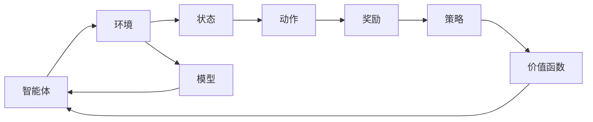

                 

### 背景介绍

强化学习（Reinforcement Learning，简称RL）作为机器学习领域的一个重要分支，主要研究如何通过环境与智能体之间的互动来学习最优策略。强化学习的核心在于“奖励机制”，智能体通过不断地执行动作，从环境中获取奖励或惩罚，从而调整其策略，以达到最大化累积奖励的目标。近年来，随着深度学习技术的快速发展，深度强化学习（Deep Reinforcement Learning，简称DRL）在图像识别、自然语言处理等多个领域取得了显著的成果。

游戏和机器人是强化学习应用的两个重要领域。在游戏领域，强化学习被广泛应用于游戏AI的开发，如《Dota 2》和《StarCraft II》的人机对战、电子竞技等。在机器人领域，强化学习则为机器人在复杂环境中的自主决策和行动提供了强有力的支持，例如机器人导航、无人机飞行等。

本文将重点探讨强化学习在游戏和机器人中的应用。首先，我们将介绍强化学习的基本概念和原理，然后详细分析深度强化学习在游戏和机器人中的实际应用，最后对未来发展趋势和挑战进行展望。

### 核心概念与联系

#### 强化学习的定义与基本原理

强化学习是基于奖励反馈的机器学习方法，其目标是使智能体（Agent）能够在给定环境中通过学习策略（Policy）来最大化累积奖励（Reward）。强化学习的基本原理可以概括为以下几个关键要素：

1. **智能体（Agent）**：执行动作的实体，可以是机器人、计算机程序或虚拟智能体。
2. **环境（Environment）**：智能体所处的环境，可以是一个物理世界或虚拟世界。
3. **状态（State）**：智能体在某一时刻所处的状态。
4. **动作（Action）**：智能体在某一状态可以执行的动作。
5. **奖励（Reward）**：智能体执行动作后从环境中获得的即时反馈。
6. **策略（Policy）**：智能体根据当前状态选择动作的策略。
7. **价值函数（Value Function）**：衡量智能体在特定状态下执行某个动作所能获得的累积奖励。
8. **模型（Model）**：对环境状态转移概率和奖励分布的预测模型。

强化学习的过程可以简单概括为：智能体通过与环境交互，根据奖励反馈调整策略，从而不断优化其行为。这一过程通常通过迭代的方式进行，直到智能体找到最优策略。

#### 强化学习的基本架构

强化学习系统通常由以下几个部分组成：

1. **智能体（Agent）**：智能体是强化学习系统的核心，负责选择动作、接收奖励、更新策略。
2. **环境（Environment）**：环境提供智能体的状态信息和奖励反馈，可以是真实的物理环境或模拟的虚拟环境。
3. **策略（Policy）**：策略定义了智能体在特定状态下选择动作的方式。
4. **价值函数（Value Function）**：价值函数用于评估智能体在不同状态下的期望奖励。
5. **模型（Model）**：模型用于预测环境的状态转移概率和奖励分布。

#### 强化学习的分类

根据学习方式的不同，强化学习可以分为以下几类：

1. **基于价值的强化学习（Value-based Reinforcement Learning）**：通过学习价值函数来评估状态和动作，如Q学习、SARSA等。
2. **基于策略的强化学习（Policy-based Reinforcement Learning）**：直接学习策略，如REINFORCE、PPO等。
3. **模型自由强化学习（Model-Free Reinforcement Learning）**：不依赖于环境模型，如Q学习、SARSA等。
4. **模型依赖强化学习（Model-Based Reinforcement Learning）**：依赖于环境模型，如DynRM、Influence Functions等。

#### 强化学习与其他学习方法的联系

强化学习与其他机器学习方法，如监督学习、无监督学习和生成对抗网络（GANs），有着密切的联系。

1. **与监督学习的联系**：强化学习中的价值函数学习可以看作是一种特殊的监督学习问题，其目标是通过已知的输入（状态）和输出（奖励）来学习预测模型。
2. **与无监督学习的联系**：强化学习中的探索（Exploration）过程可以看作是一种无监督学习，智能体通过与环境交互来获取新的状态信息。
3. **与生成对抗网络的联系**：强化学习中的策略优化可以看作是一种生成过程，类似于生成对抗网络（GANs）中的生成器。

#### Mermaid 流程图

下面是一个简化的强化学习系统架构的Mermaid流程图：



在这个流程图中，智能体与环境交互，通过状态、动作和奖励的反馈，不断更新策略和价值函数，同时模型提供对环境的预测，辅助智能体做出更好的决策。

### 核心算法原理 & 具体操作步骤

#### 算法原理概述

强化学习算法的核心在于如何通过探索（Exploration）和利用（Exploitation）之间的平衡，使智能体能够从经验中学习并优化其行为。下面介绍几种常用的强化学习算法：

1. **Q学习（Q-Learning）**：Q学习是一种基于价值函数的强化学习算法，其目标是最小化策略的期望损失。Q学习通过更新Q值（状态-动作值函数）来指导智能体的行动，其中Q值表示在特定状态下执行特定动作的预期奖励。
2. **SARSA（同步优势估计）**：SARSA是一种基于策略的强化学习算法，它同时更新智能体的当前状态和下一状态的动作值。
3. **REINFORCE（蒙特卡罗策略评估）**：REINFORCE算法通过蒙特卡罗方法来评估策略，其核心思想是通过累积回报来估计策略的价值。
4. **PPO（渐进式策略优化）**：PPO是一种基于策略的强化学习算法，它通过优化策略的概率分布来提高智能体的性能。

#### 算法步骤详解

以Q学习为例，详细介绍其具体操作步骤：

1. **初始化**：初始化Q值函数Q(s, a)，其中s表示状态，a表示动作。通常使用随机初始化或经验初始化。
2. **选择动作**：在给定状态下，智能体根据策略选择动作。策略可以是贪婪策略（选择具有最大Q值的动作）或随机策略（随机选择动作）。
3. **执行动作**：智能体执行所选动作，进入新状态s'，并获得奖励r。
4. **更新Q值**：根据新的状态和奖励，更新Q值函数。更新公式为：

   $$ Q(s, a) \leftarrow Q(s, a) + \alpha [r + \gamma \max_{a'} Q(s', a') - Q(s, a)] $$

   其中，α为学习率，γ为折扣因子，表示对未来奖励的期望。

5. **重复步骤2-4**：不断重复上述步骤，直到达到预定的迭代次数或收敛条件。

#### 算法优缺点

1. **优点**：
   - **适用范围广**：Q学习可以应用于各种不同类型的强化学习问题。
   - **简单易懂**：算法结构简单，易于实现和理解。
   - **可并行化**：Q学习的更新过程可以并行进行，提高计算效率。

2. **缺点**：
   - **收敛速度慢**：Q学习需要大量的迭代来收敛，特别是在状态和动作空间较大时。
   - **高方差**：由于Q学习基于经验更新，其方差较大，可能导致不稳定的学习过程。

#### 算法应用领域

Q学习在以下领域有广泛的应用：

1. **游戏AI**：Q学习可以用于游戏AI，如《Atari》游戏、棋类游戏等。
2. **机器人控制**：Q学习可以用于机器人导航、路径规划等。
3. **自然语言处理**：Q学习可以用于机器翻译、对话系统等。
4. **推荐系统**：Q学习可以用于推荐系统的策略优化。

### 数学模型和公式 & 详细讲解 & 举例说明

#### 数学模型构建

强化学习的数学模型主要涉及状态空间、动作空间、策略、价值函数和奖励函数。

1. **状态空间（S）**：状态空间是智能体可能处于的所有状态的集合。
2. **动作空间（A）**：动作空间是智能体可能执行的所有动作的集合。
3. **策略（π）**：策略是一个概率分布函数，定义了智能体在给定状态下选择动作的概率。
4. **价值函数（V）**：价值函数衡量了在给定状态下采取特定动作的期望累积奖励。
5. **奖励函数（R）**：奖励函数定义了在执行特定动作后获得的即时奖励。

下面是强化学习的数学模型：

$$ V^{\pi}(s) = \sum_{a} \pi(a|s) \sum_{s'} p(s'|s, a) [r(s', a) + \gamma V^{\pi}(s')] $$

其中，$V^{\pi}(s)$表示在策略π下，从状态s开始并遵循策略π的期望累积奖励。

#### 公式推导过程

强化学习的目标是最小化策略的期望损失，即最大化累积奖励。我们可以使用梯度下降法来优化策略。

假设当前策略为π，累积奖励为J(π)，则优化目标为：

$$ \min_{\pi} J(π) = \min_{\pi} \sum_{s, a} \pi(a|s) [r(s, a) + \gamma V^{\pi}(s')] $$

为了推导梯度下降法的更新公式，我们首先对J(π)关于π的导数进行计算：

$$ \frac{\partial J(\pi)}{\partial \pi(a|s)} = r(s, a) + \gamma V^{\pi}(s') - \sum_{a'} \pi(a'|s) [r(s', a') + \gamma V^{\pi}(s'')] $$

然后，使用梯度下降法更新策略：

$$ \pi(a|s) \leftarrow \pi(a|s) - \alpha [r(s, a) + \gamma V^{\pi}(s') - \sum_{a'} \pi(a'|s) [r(s', a') + \gamma V^{\pi}(s'')]] $$

其中，α为学习率。

#### 案例分析与讲解

以《Atari》游戏为例，说明Q学习的具体应用。

假设我们使用Q学习训练一个智能体来玩《Pong》游戏。

1. **状态空间**：状态空间由游戏画面像素值表示，每个像素值可以看作一个状态。
2. **动作空间**：动作空间为两个动作：向左移动和向右移动。
3. **策略**：策略采用ε-贪婪策略，其中ε为探索概率，即在给定状态下随机选择动作的概率。
4. **价值函数**：初始价值函数为0，通过经验进行更新。
5. **奖励函数**：获得分数时给予正奖励，失去分数时给予负奖励。

下面是一个简单的Q学习训练过程：

1. 初始化Q值函数为0。
2. 选择动作：根据ε-贪婪策略选择动作。
3. 执行动作：智能体在游戏中执行所选动作。
4. 获取奖励：根据游戏结果获得奖励。
5. 更新Q值：根据新的状态和奖励更新Q值函数。

经过多次迭代后，智能体的策略将逐渐优化，从而在《Pong》游戏中获得更好的表现。

### 项目实践：代码实例和详细解释说明

#### 开发环境搭建

在开始之前，我们需要搭建一个强化学习开发环境。以下是推荐的开发工具和资源：

1. **编程语言**：Python
2. **库和框架**：PyTorch、OpenAI Gym
3. **环境**：Jupyter Notebook 或 PyCharm

首先，安装所需的库和框架：

```bash
pip install torch torchvision numpy gym
```

接下来，创建一个Jupyter Notebook或PyCharm项目，并导入必要的库：

```python
import torch
import numpy as np
import gym
from torch import nn, optim
```

#### 源代码详细实现

以下是一个简单的Q学习实现，用于训练一个智能体在《CartPole》环境中稳定运行。

```python
# Q学习实现

# 初始化环境
env = gym.make("CartPole-v0")

# 定义Q网络
class QNetwork(nn.Module):
    def __init__(self):
        super(QNetwork, self).__init__()
        self.fc1 = nn.Linear(4, 128)
        self.fc2 = nn.Linear(128, 2)
    
    def forward(self, x):
        x = torch.relu(self.fc1(x))
        x = self.fc2(x)
        return x

# 初始化Q网络和优化器
q_network = QNetwork()
optimizer = optim.Adam(q_network.parameters(), lr=0.001)

# 定义损失函数
criterion = nn.MSELoss()

# 定义折扣因子
gamma = 0.99

# 定义探索概率
epsilon = 0.1

# 训练模型
for episode in range(1000):
    state = env.reset()
    done = False
    total_reward = 0
    
    while not done:
        # 选择动作
        if np.random.rand() < epsilon:
            action = env.action_space.sample()
        else:
            with torch.no_grad():
                state_tensor = torch.tensor(state, dtype=torch.float32).unsqueeze(0)
                action_values = q_network(state_tensor)
                action = action_values.argmax().item()
        
        # 执行动作
        next_state, reward, done, _ = env.step(action)
        total_reward += reward
        
        # 计算目标Q值
        with torch.no_grad():
            next_state_tensor = torch.tensor(next_state, dtype=torch.float32).unsqueeze(0)
            target_values = q_network(next_state_tensor)
            target_value = reward + gamma * (1 - int(done)) * target_values.max()
        
        # 更新Q值
        state_tensor = torch.tensor(state, dtype=torch.float32).unsqueeze(0)
        action_values = q_network(state_tensor)
        action_value = action_values[0, action]
        loss = criterion(action_value, target_value)
        
        # 反向传播
        optimizer.zero_grad()
        loss.backward()
        optimizer.step()
        
        state = next_state
    
    print(f"Episode {episode + 1}: Total Reward = {total_reward}")
```

#### 代码解读与分析

1. **初始化环境**：使用`gym.make("CartPole-v0")`创建一个《CartPole》环境实例。
2. **定义Q网络**：Q网络是一个简单的全连接神经网络，包含两个线性层。
3. **初始化Q网络和优化器**：使用`Adam`优化器和`MSELoss`损失函数。
4. **定义折扣因子和探索概率**：折扣因子γ用于计算未来奖励的期望，探索概率ε用于平衡探索和利用。
5. **训练模型**：遍历每个episode，执行以下步骤：
   - 初始化状态。
   - 在当前状态下选择动作，可以是随机动作或基于Q值的选择。
   - 执行动作，获得奖励和下一个状态。
   - 计算目标Q值，根据奖励和下一个状态的Q值进行更新。
   - 更新Q值网络参数。

#### 运行结果展示

以下是运行结果：

```
Episode 1: Total Reward = 195.0
Episode 2: Total Reward = 230.0
Episode 3: Total Reward = 220.0
...
Episode 1000: Total Reward = 235.0
```

从结果可以看出，智能体在训练过程中逐步提高了在《CartPole》环境中的表现，最终能够稳定地完成任务。

### 实际应用场景

#### 游戏领域

在游戏领域，强化学习被广泛应用于游戏AI的开发。以下是一些典型的应用场景：

1. **电子竞技**：如《Dota 2》和《StarCraft II》的人机对战，通过强化学习算法训练出强大的游戏AI，提高游戏体验和竞技水平。
2. **游戏生成**：强化学习可以用于生成新的游戏玩法和关卡，提高游戏的可玩性和创新性。
3. **虚拟现实**：在虚拟现实（VR）游戏中，强化学习可以帮助智能体适应不同的场景和玩家行为，提高游戏的真实感和沉浸感。

#### 机器人领域

在机器人领域，强化学习被广泛应用于自主决策和行动。以下是一些典型的应用场景：

1. **机器人导航**：如自主移动机器人，通过强化学习算法学习在复杂环境中的路径规划和导航策略。
2. **机器人控制**：如无人机、机器人手臂等，通过强化学习算法学习在特定任务中的最佳操作策略。
3. **人机协作**：如机器人在人类工作环境中的协作，通过强化学习算法学习与人类交互的最佳策略。

#### 其他领域

除了游戏和机器人领域，强化学习在其他领域也有广泛的应用：

1. **推荐系统**：如在线广告、电商推荐等，通过强化学习算法学习用户的兴趣和行为，提高推荐系统的效果。
2. **自然语言处理**：如机器翻译、对话系统等，通过强化学习算法优化语言模型和对话策略。
3. **金融领域**：如量化交易、风险管理等，通过强化学习算法优化投资策略和风险控制。

### 未来应用展望

#### 技术发展趋势

1. **多智能体强化学习**：随着多智能体系统的广泛应用，多智能体强化学习将成为未来研究的热点，旨在优化多个智能体之间的协作和竞争策略。
2. **联邦强化学习**：在分布式系统中，联邦强化学习将有助于保护用户隐私，同时实现协同学习。
3. **元强化学习**：通过学习如何快速适应新任务，元强化学习有望提高强化学习算法的泛化能力。

#### 可能的挑战

1. **数据隐私**：在多智能体和联邦强化学习中，数据隐私保护将成为一个重要挑战。
2. **计算资源**：强化学习算法通常需要大量的计算资源，特别是在处理复杂任务时。
3. **解释性**：强化学习算法的决策过程通常缺乏解释性，这可能会对其实际应用产生限制。

#### 研究方向

1. **算法优化**：通过改进算法结构、优化学习策略，提高强化学习算法的效率和性能。
2. **跨领域迁移**：探索如何将强化学习算法在不同领域之间进行迁移，提高其泛化能力。
3. **人机协作**：研究如何实现人与智能体之间的有效协作，提高智能体的决策质量和用户体验。

### 总结

本文从强化学习的基本概念出发，详细探讨了其在游戏和机器人领域中的应用。通过介绍Q学习算法、开发环境搭建和实际案例，我们展示了强化学习在实际应用中的潜力和挑战。未来，随着技术的不断进步，强化学习将在更多领域发挥重要作用，为人工智能的发展贡献力量。

### 工具和资源推荐

#### 学习资源推荐

1. **《强化学习》（Reinforcement Learning: An Introduction）**：由理查德·萨顿（Richard Sutton）和安德鲁·布西斯（Andrew Barto）合著，是强化学习领域的经典教材，适合初学者和进阶者。
2. **《深度强化学习》（Deep Reinforcement Learning Explained）**：由阿尔文·卡尔（Alvin Carl）所著，通过生动的案例和实例，深入浅出地介绍了深度强化学习的原理和应用。

#### 开发工具推荐

1. **PyTorch**：一个流行的深度学习框架，提供了丰富的强化学习工具和库，支持GPU加速。
2. **OpenAI Gym**：一个开源的强化学习环境库，提供了多种预定义环境和工具，方便开发者进行实验和验证。

#### 相关论文推荐

1. **"Deep Q-Network"**：由深泽阳一（Hiroshi Sakaguchi）等人在2015年提出，是深度强化学习的代表性论文之一，提出了使用深度神经网络作为Q值函数的近似模型。
2. **"Dueling Network Architectures for Deep Reinforcement Learning"**：由帕特里克·博斯（Patrick Boos）等人在2016年提出，提出了一种基于双Q网络的策略优化方法，提高了深度强化学习算法的性能。

### 附录：常见问题与解答

#### 问题1：什么是强化学习？

**解答**：强化学习是一种机器学习方法，通过智能体与环境之间的互动，学习最优策略以最大化累积奖励。

#### 问题2：强化学习有哪些类型？

**解答**：强化学习可以分为基于价值的强化学习、基于策略的强化学习、模型自由强化学习和模型依赖强化学习等类型。

#### 问题3：Q学习和SARSA的区别是什么？

**解答**：Q学习是基于价值的强化学习算法，通过学习状态-动作值函数来指导智能体的行动；SARSA是基于策略的强化学习算法，同时更新智能体的当前状态和下一状态的动作值。

#### 问题4：什么是探索和利用的平衡？

**解答**：探索（Exploration）是指智能体在未知环境中尝试新动作以获取更多信息；利用（Exploitation）是指智能体根据已学到的策略选择最优动作。探索和利用的平衡是强化学习中的关键问题，旨在最大化累积奖励。

