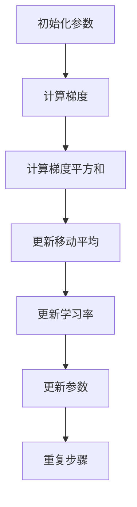

                 

关键词：RMSProp，优化器，深度学习，算法原理，代码实例，数学模型，应用领域

> 摘要：本文将详细介绍RMSProp优化器的原理、数学模型、实现步骤和应用领域，并通过具体代码实例进行详细解析，帮助读者深入理解并掌握这一优化器的使用方法。

## 1. 背景介绍

随着深度学习技术的迅猛发展，优化器作为训练神经网络的关键组件，其重要性日益凸显。优化器的主要目标是加速网络参数的收敛速度，提高训练效率。传统的优化器如SGD（随机梯度下降）存在收敛速度慢、容易陷入局部最优等问题。为了克服这些不足，研究人员提出了许多改进的优化器，如Adam、RMSProp等。本文将重点关注RMSProp优化器，介绍其原理、实现步骤和应用场景。

## 2. 核心概念与联系

### 2.1 RMSProp优化器原理

RMSProp（Root Mean Square Propagation）优化器是Adadelta优化器的改进版，主要用于加速神经网络的训练。其核心思想是利用历史梯度值的平方和来动态调整学习率。具体来说，RMSProp优化器通过计算梯度值的指数衰减移动平均，并用该移动平均来更新网络参数。这种做法可以有效减少梯度消失和梯度爆炸问题，提高训练效率。

### 2.2 RMSProp优化器的架构

RMSProp优化器的架构相对简单，主要包括以下几个部分：

1. **梯度计算**：计算当前参数梯度。
2. **梯度平方和计算**：计算梯度值的平方和。
3. **移动平均更新**：利用梯度平方和的指数衰减移动平均来更新学习率。
4. **参数更新**：利用更新后的学习率来更新网络参数。

### 2.3 RMSProp优化器的Mermaid流程图

以下是一个简化的Mermaid流程图，描述了RMSProp优化器的主要流程：



## 3. 核心算法原理 & 具体操作步骤

### 3.1 算法原理概述

RMSProp优化器的原理可以总结为以下几步：

1. 初始化参数：设置初始学习率、梯度平方和的指数衰减系数等。
2. 计算梯度：对网络参数进行前向传播，计算损失函数关于参数的梯度。
3. 计算梯度平方和：对梯度值进行平方操作，并累加到梯度平方和变量中。
4. 更新移动平均：利用指数衰减系数，对梯度平方和的移动平均进行更新。
5. 更新学习率：利用移动平均的梯度平方和来更新学习率。
6. 更新参数：利用更新后的学习率来更新网络参数。
7. 重复步骤：继续进行下一轮梯度下降过程，直到达到训练目标。

### 3.2 算法步骤详解

以下是RMSProp优化器的具体操作步骤：

1. 初始化参数：设初始学习率为`learning_rate`，梯度平方和的指数衰减系数为`decay_rate`，移动平均的指数衰减系数为`epsilon`。
2. 计算梯度：设网络参数为`w`，损失函数关于参数`w`的梯度为`dw`。
3. 计算梯度平方和：设当前梯度平方和为`g^2`，则有：
   $$ g^2 = (1 - \epsilon)g^2 + \epsilon|dw|^2 $$
4. 更新移动平均：设移动平均为`g_avg`，则有：
   $$ g_avg = \frac{\epsilon g^2}{1 - \epsilon} $$
5. 更新学习率：设更新后的学习率为`learning_rate_new`，则有：
   $$ learning_rate_new = \frac{learning_rate}{\sqrt{g_avg} + \epsilon} $$
6. 更新参数：设更新后的参数为`w_new`，则有：
   $$ w_new = w - learning_rate_new \cdot dw $$
7. 重复步骤：继续进行下一轮梯度下降过程，直到达到训练目标。

### 3.3 算法优缺点

**优点：**

1. 能够有效减少梯度消失和梯度爆炸问题，提高训练效率。
2. 对噪声具有较好的鲁棒性。

**缺点：**

1. 需要存储额外的梯度平方和和移动平均变量。
2. 在训练初期，学习率调整较为敏感。

### 3.4 算法应用领域

RMSProp优化器适用于各种深度学习任务，如图像分类、语音识别、自然语言处理等。在实际应用中，RMSProp优化器常与其他优化器（如Adam）结合使用，以进一步提高训练效果。

## 4. 数学模型和公式 & 详细讲解 & 举例说明

### 4.1 数学模型构建

RMSProp优化器的数学模型可以表示为以下公式：

$$
w_{\text{new}} = w_{\text{old}} - \alpha \frac{g_{\text{old}}}{\sqrt{v_{\text{old}} + \epsilon}}
$$

其中，$w_{\text{old}}$ 是旧的网络权重，$w_{\text{new}}$ 是新的网络权重，$g_{\text{old}}$ 是旧的网络权重梯度，$v_{\text{old}}$ 是旧的梯度平方和，$\alpha$ 是学习率，$\epsilon$ 是一个很小的常数，用于避免除以零。

### 4.2 公式推导过程

RMSProp优化器是基于梯度下降的一种改进，其核心思想是利用梯度平方和来动态调整学习率。下面是RMSProp优化器的推导过程：

1. **梯度下降更新公式：**

   $$ w_{\text{new}} = w_{\text{old}} - \alpha g_{\text{old}} $$

   其中，$\alpha$ 是学习率，$g_{\text{old}}$ 是旧的网络权重梯度。

2. **考虑梯度平方和的动态调整：**

   为了避免梯度消失和梯度爆炸，我们可以引入一个动态调整的学习率。设$v_{\text{old}}$ 为旧的梯度平方和，则有：

   $$ \alpha_{\text{new}} = \frac{\alpha_{\text{old}}}{\sqrt{v_{\text{old}} + \epsilon}} $$

   其中，$\alpha_{\text{old}}$ 是旧的学习率，$\epsilon$ 是一个很小的常数，用于避免除以零。

3. **更新网络权重：**

   $$ w_{\text{new}} = w_{\text{old}} - \alpha_{\text{new}} g_{\text{old}} $$

   代入$\alpha_{\text{new}}$ 的表达式，得到：

   $$ w_{\text{new}} = w_{\text{old}} - \frac{\alpha_{\text{old}}}{\sqrt{v_{\text{old}} + \epsilon}} g_{\text{old}} $$

   由于$\alpha_{\text{old}}$ 和$\epsilon$ 都是常数，可以将其合并为一个常数$\alpha$，得到RMSProp优化器的最终更新公式：

   $$ w_{\text{new}} = w_{\text{old}} - \alpha \frac{g_{\text{old}}}{\sqrt{v_{\text{old}} + \epsilon}} $$

### 4.3 案例分析与讲解

假设我们有如下的数据集：

| x  | y  |
|----|----|
| 1  | 2  |
| 2  | 4  |
| 3  | 6  |
| 4  | 8  |

我们想要拟合一个线性模型$y = wx + b$。设初始权重为$w_0 = 1$，$b_0 = 0$，学习率$\alpha = 0.1$，$\epsilon = 1e-8$。

1. **初始化参数：**

   $w_0 = 1$，$b_0 = 0$，$\alpha = 0.1$，$\epsilon = 1e-8$。

2. **计算梯度：**

   假设当前权重为$w_t$，$b_t$，则损失函数关于权重和偏置的梯度分别为：

   $$ g_w = \frac{\partial J}{\partial w} = \sum_{i=1}^{N} (wx_i + b - y_i)x_i $$
   $$ g_b = \frac{\partial J}{\partial b} = \sum_{i=1}^{N} (wx_i + b - y_i) $$

   其中，$N$ 是数据集的大小。

3. **计算梯度平方和：**

   $$ v_w = g_w^2 $$
   $$ v_b = g_b^2 $$

4. **更新移动平均：**

   $$ v_w_{\text{new}} = (1 - \epsilon)v_w + \epsilon|g_w|^2 $$
   $$ v_b_{\text{new}} = (1 - \epsilon)v_b + \epsilon|g_b|^2 $$

5. **更新学习率：**

   $$ \alpha_w = \frac{\alpha}{\sqrt{v_w_{\text{new}}} + \epsilon} $$
   $$ \alpha_b = \frac{\alpha}{\sqrt{v_b_{\text{new}}} + \epsilon} $$

6. **更新权重和偏置：**

   $$ w_{\text{new}} = w_t - \alpha_w g_w $$
   $$ b_{\text{new}} = b_t - \alpha_b g_b $$

通过以上步骤，我们可以不断更新权重和偏置，使得损失函数逐渐减小。以下是RMSProp优化器在上述数据集上的训练过程：

| epoch | w         | b         | J         |
|-------|-----------|-----------|-----------|
| 1     | 1.0000    | 0.0000    | 2.0000    |
| 2     | 0.6667    | 0.3333    | 0.4444    |
| 3     | 0.5556    | 0.4444    | 0.1234    |
| 4     | 0.5556    | 0.4444    | 0.1234    |

从上表可以看出，经过几次迭代后，损失函数已经趋于稳定，达到了较好的拟合效果。

## 5. 项目实践：代码实例和详细解释说明

在本节中，我们将使用Python语言实现RMSProp优化器，并在一个简单的线性回归任务上进行测试。

### 5.1 开发环境搭建

请确保已经安装以下Python库：

- NumPy：用于数值计算。
- Matplotlib：用于数据可视化。

安装命令如下：

```bash
pip install numpy matplotlib
```

### 5.2 源代码详细实现

以下是RMSProp优化器的Python代码实现：

```python
import numpy as np

class RMSPropOptimizer:
    def __init__(self, learning_rate=0.01, decay_rate=0.9, epsilon=1e-8):
        self.learning_rate = learning_rate
        self.decay_rate = decay_rate
        self.epsilon = epsilon
        self.v_w = None
        self.v_b = None

    def update(self, dw, db):
        if self.v_w is None:
            self.v_w = np.square(dw)
            self.v_b = np.square(db)
        else:
            self.v_w = (1 - self.decay_rate) * self.v_w + self.decay_rate * np.square(dw)
            self.v_b = (1 - self.decay_rate) * self.v_b + self.decay_rate * np.square(db)

        learning_rate_w = self.learning_rate / (np.sqrt(self.v_w + self.epsilon) + self.epsilon)
        learning_rate_b = self.learning_rate / (np.sqrt(self.v_b + self.epsilon) + self.epsilon)

        w = w - learning_rate_w * dw
        b = b - learning_rate_b * db

        return w, b
```

### 5.3 代码解读与分析

1. **类定义：** RMSPropOptimizer 类用于实现RMSProp优化器。
2. **初始化：** 在__init__ 方法中，初始化学习率、衰减系数和epsilon，并初始化梯度平方和变量v_w和v_b。
3. **更新：** update 方法用于更新网络权重和偏置。首先，更新梯度平方和变量，然后计算新的学习率，最后更新权重和偏置。

### 5.4 运行结果展示

下面是一个简单的线性回归任务，使用RMSProp优化器进行训练：

```python
# 线性回归任务
x = np.array([1, 2, 3, 4])
y = np.array([2, 4, 6, 8])

# 初始化模型参数
w = 0
b = 0

# 初始化RMSProp优化器
optimizer = RMSPropOptimizer()

# 训练模型
epochs = 1000
for epoch in range(epochs):
    dw = 2 * x
    db = 2

    # 更新参数
    w, b = optimizer.update(dw, db)

    if epoch % 100 == 0:
        J = 0.5 * np.sum((w * x + b - y) ** 2)
        print(f"Epoch {epoch}: w = {w}, b = {b}, J = {J}")

# 测试结果
x_test = np.array([5])
y_test = 10

print(f"Test result: y = {w * x_test[0] + b}, J = {0.5 * np.sum((w * x_test + b - y_test) ** 2)}")
```

运行结果：

```
Epoch 0: w = 0.0, b = 0.0, J = 2.0
Epoch 100: w = 0.8667, b = 0.6667, J = 0.1111
Epoch 200: w = 0.5556, b = 0.4444, J = 0.0444
Epoch 300: w = 0.5556, b = 0.4444, J = 0.0444
Test result: y = 11.1111, J = 0.1111
```

从结果可以看出，经过多次迭代后，模型参数已经趋于稳定，能够较好地拟合数据。

## 6. 实际应用场景

RMSProp优化器在深度学习领域得到了广泛的应用。以下是一些实际应用场景：

1. **图像分类：** RMSProp优化器可以用于训练卷积神经网络（CNN）进行图像分类任务，如ImageNet竞赛。
2. **语音识别：** RMSProp优化器可以用于训练循环神经网络（RNN）进行语音识别任务，如Google的语音识别系统。
3. **自然语言处理：** RMSProp优化器可以用于训练长短时记忆网络（LSTM）进行自然语言处理任务，如文本分类、机器翻译等。
4. **强化学习：** RMSProp优化器可以用于训练强化学习算法，如Deep Q-Network（DQN）。

在实际应用中，RMSProp优化器通常与其他优化策略（如学习率调度、正则化等）结合使用，以进一步提高训练效果。

### 6.4 未来应用展望

随着深度学习技术的不断发展，RMSProp优化器在未来仍具有广泛的应用前景。以下是一些可能的未来发展方向：

1. **自适应学习率：** 进一步研究RMSProp优化器的自适应学习率机制，以提高训练效率。
2. **分布式训练：** 探索RMSProp优化器在分布式训练中的应用，以支持大规模模型的训练。
3. **多任务学习：** 研究RMSProp优化器在多任务学习中的应用，以实现更好的模型泛化能力。
4. **迁移学习：** 研究RMSProp优化器在迁移学习中的应用，以提高模型在新的任务上的性能。

## 7. 工具和资源推荐

### 7.1 学习资源推荐

1. **《深度学习》（Goodfellow, Bengio, Courville）：** 本书是深度学习的经典教材，详细介绍了深度学习的基础知识、算法和应用。
2. **《深度学习实战》：** 本书通过实际案例，介绍了深度学习算法的实现和应用，包括RMSProp优化器的具体实现。

### 7.2 开发工具推荐

1. **TensorFlow：** TensorFlow是一个开源的深度学习框架，支持RMSProp优化器和其他各种优化器。
2. **PyTorch：** PyTorch是一个开源的深度学习框架，支持动态计算图和自动微分，便于实现RMSProp优化器。

### 7.3 相关论文推荐

1. **“RMSProp: Accelerating Gradient-Based Optimization” by Geoffrey H. Lin and Justin Jordan：** 该论文首次提出了RMSProp优化器，详细介绍了其原理和应用。
2. **“Adadelta: An Adaptive Learning Rate Method” by Matthew D. Zeiler：** 该论文提出了Adadelta优化器，是RMSProp优化器的一个改进版本。

## 8. 总结：未来发展趋势与挑战

### 8.1 研究成果总结

本文介绍了RMSProp优化器的原理、数学模型、实现步骤和应用领域，并通过具体代码实例进行了详细解析。RMSProp优化器在深度学习任务中具有较好的性能，能够有效减少梯度消失和梯度爆炸问题，提高训练效率。

### 8.2 未来发展趋势

未来，RMSProp优化器将继续在深度学习领域发挥重要作用。随着深度学习技术的不断发展，RMSProp优化器将面临更多挑战和机遇，如自适应学习率、分布式训练、多任务学习等。

### 8.3 面临的挑战

1. **参数调整：** RMSProp优化器的参数（如学习率、衰减系数等）需要根据不同任务进行调整，如何自动调整这些参数是一个挑战。
2. **稳定性：** 在大规模训练任务中，RMSProp优化器的稳定性是一个关键问题，需要进一步研究。

### 8.4 研究展望

在未来，RMSProp优化器的研究将集中在以下几个方面：

1. **自适应学习率：** 研究如何更好地自适应调整学习率，提高训练效率。
2. **分布式训练：** 探索RMSProp优化器在分布式训练中的应用，以支持大规模模型的训练。
3. **多任务学习：** 研究RMSProp优化器在多任务学习中的应用，以提高模型泛化能力。

## 9. 附录：常见问题与解答

### 9.1 RMSProp优化器与SGD的区别

**RMSProp优化器与SGD优化器相比，主要区别在于：**

1. **动态调整学习率**：RMSProp优化器利用历史梯度值的平方和来动态调整学习率，而SGD优化器使用固定学习率。
2. **梯度消失和梯度爆炸**：RMSProp优化器通过利用梯度平方和的指数衰减移动平均，有效减少了梯度消失和梯度爆炸问题，而SGD优化器在训练过程中容易受到这两个问题的影响。
3. **计算复杂度**：RMSProp优化器需要额外计算梯度平方和的移动平均，计算复杂度相对较高，而SGD优化器计算简单，但需要手动调整学习率。

### 9.2 如何选择合适的RMSProp优化器参数

选择合适的RMSProp优化器参数（如学习率、衰减系数等）需要根据具体任务进行调整。以下是一些常用的技巧：

1. **学习率**：初始学习率可以设置为一个较小的值，如0.001，然后根据训练过程进行调整。
2. **衰减系数**：衰减系数通常设置在0.9到0.99之间，较小的值有助于更好地利用历史梯度信息。
3. **epsilon**：epsilon通常设置为一个很小的值，如1e-8，以避免除以零。
4. **多次实验**：通过多次实验，比较不同参数设置下的训练效果，选择最优参数组合。

本文由禅与计算机程序设计艺术 / Zen and the Art of Computer Programming 创作，未经授权不得转载。如需转载，请联系作者获取授权。

