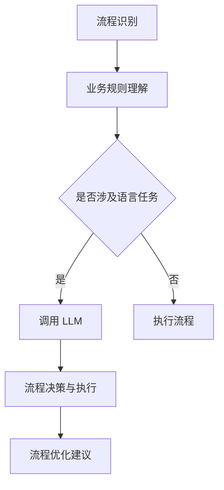

                 

在当前信息化时代，企业运营中的自动化需求日益增长，RPA（Robotic Process Automation，机器人流程自动化）与 LLM（Large Language Model，大型语言模型）的结合成为一种热门趋势。本文旨在探讨 RPA 与 LLM 的结合点，核心概念及其在现实应用中的巨大潜力。

## 关键词

- **RPA**：机器人流程自动化
- **LLM**：大型语言模型
- **结合应用**：跨领域协同工作
- **人工智能**：AI 技术的融合与发展
- **数字化转型**：企业运营模式的变革
- **业务流程优化**：提升运营效率与降低成本

## 摘要

本文首先介绍了 RPA 与 LLM 的基本概念，并阐述了它们在数字化企业运营中的重要性。随后，文章详细探讨了 RPA 与 LLM 的结合点，包括技术原理和实现方法。通过具体案例分析和实际项目实践，本文展示了 RPA 与 LLM 结合的巨大潜力和实际效果。最后，文章对未来 RPA 与 LLM 结合的发展趋势和面临的挑战进行了展望。

## 1. 背景介绍

### 1.1 RPA 的发展现状

RPA 作为一种新兴的技术，近年来在全球范围内得到了快速发展。RPA 通过模拟人工操作，自动化执行企业内部的各种业务流程，从而显著提高工作效率、降低运营成本。RPA 技术的出现，为企业数字化转型提供了强有力的支持。

### 1.2 LLM 的发展与应用

LLM 作为人工智能领域的重要成果，其强大的语言处理能力使其在自然语言处理、文本生成、知识图谱构建等方面具有广泛应用。随着 LLM 技术的成熟，其应用场景不断拓展，尤其在企业内部智能客服、智能决策支持等方面展现了巨大潜力。

### 1.3 RPA 与 LLM 的结合背景

在数字化转型的浪潮中，企业对于自动化和智能化的需求日益增长。RPA 技术能够帮助企业自动化繁琐的流程，提高效率；而 LLM 技术则能够为企业提供强大的语言处理能力，实现智能化的互动与决策。RPA 与 LLM 的结合，能够为企业带来更为智能、高效的运营模式。

## 2. 核心概念与联系

### 2.1 RPA 核心概念

RPA（Robotic Process Automation）是一种通过软件机器人模拟人类操作，自动化执行业务流程的技术。RPA 机器人可以理解、处理并执行各种业务规则，从而实现流程自动化。

### 2.2 LLM 核心概念

LLM（Large Language Model）是一种大型语言模型，通过深度学习算法对海量文本数据进行训练，具备强大的语言理解和生成能力。LLM 可以处理自然语言文本，生成文本、回答问题、进行对话等。

### 2.3 RPA 与 LLM 的结合原理

RPA 与 LLM 的结合，主要利用 LLM 的语言处理能力，实现对 RPA 流程中涉及的语言任务进行自动化处理。具体来说，LLM 可以参与 RPA 流程中的以下环节：

- **流程识别**：LLM 可以通过文本分析，识别并理解 RPA 流程中的业务规则和需求。
- **流程执行**：LLM 可以参与流程的决策和执行，提供智能化支持。
- **流程优化**：LLM 可以通过对流程数据的分析，为企业提供流程优化的建议。

### 2.4 RPA 与 LLM 结合的 Mermaid 流程图



## 3. 核心算法原理 & 具体操作步骤

### 3.1 算法原理概述

RPA 与 LLM 结合的核心算法，主要涉及以下方面：

- **流程识别与理解**：通过自然语言处理技术，对 RPA 流程中的业务规则进行解析和理解。
- **语言任务自动化**：利用 LLM 的语言生成和推理能力，实现流程中的语言任务的自动化处理。
- **流程优化**：通过数据分析，对 RPA 流程进行优化和调整，提高流程效率和准确性。

### 3.2 算法步骤详解

#### 3.2.1 流程识别与理解

1. **数据采集**：从企业内部系统中采集业务流程数据。
2. **文本预处理**：对采集的文本数据进行清洗和格式化。
3. **规则提取**：利用自然语言处理技术，从预处理后的文本中提取业务规则。
4. **规则理解**：对提取的规则进行语义分析，理解其含义和作用。

#### 3.2.2 语言任务自动化

1. **语言任务识别**：根据业务规则，识别流程中需要自动化的语言任务。
2. **LLM 调用**：利用 LLM 的语言处理能力，对识别出的语言任务进行处理。
3. **任务执行**：根据 LLM 的处理结果，自动化执行语言任务。

#### 3.2.3 流程优化

1. **数据分析**：对 RPA 流程中的数据进行分析，识别流程中的问题和瓶颈。
2. **优化建议**：根据数据分析结果，提出流程优化的建议。
3. **流程调整**：根据优化建议，调整 RPA 流程，提高流程效率和准确性。

### 3.3 算法优缺点

#### 优点

- **高效性**：通过自动化处理，显著提高业务流程的运行效率。
- **准确性**：利用 LLM 的语言处理能力，提高流程中语言任务的准确性和一致性。
- **灵活性**：可根据业务需求，灵活调整和优化流程。

#### 缺点

- **技术门槛**：RPA 与 LLM 结合需要较高的技术支持，对企业技术水平要求较高。
- **依赖外部资源**：需要依赖 LLM 的训练数据和模型资源，可能导致数据安全和隐私问题。

### 3.4 算法应用领域

- **客户服务**：通过 RPA 与 LLM 结合，实现智能客服，提高客户服务质量。
- **财务与审计**：自动化处理财务数据，提高财务报表的准确性和效率。
- **人力资源**：自动化处理招聘、薪酬、员工关系等流程，提高人力资源管理效率。

## 4. 数学模型和公式 & 详细讲解 & 举例说明

### 4.1 数学模型构建

在 RPA 与 LLM 的结合中，我们可以构建以下数学模型：

- **流程效率模型**：基于流程运行时间和资源消耗，评估流程的效率。
- **语言任务准确率模型**：基于语言任务的处理结果，评估语言任务的准确率。
- **流程优化模型**：基于流程数据和业务规则，提出流程优化的方案。

### 4.2 公式推导过程

假设流程效率模型为：

$$
E = \frac{R}{T}
$$

其中，$E$ 表示流程效率，$R$ 表示流程运行结果，$T$ 表示流程运行时间。

语言任务准确率模型为：

$$
P = \frac{C}{N}
$$

其中，$P$ 表示语言任务准确率，$C$ 表示正确处理的语言任务数量，$N$ 表示总的语言任务数量。

流程优化模型为：

$$
O = \frac{C_1 + C_2 + ... + C_n}{N_1 + N_2 + ... + N_n}
$$

其中，$O$ 表示流程优化后准确率，$C_1, C_2, ..., C_n$ 表示优化后的每个语言任务的准确率，$N_1, N_2, ..., N_n$ 表示优化后的每个语言任务的数量。

### 4.3 案例分析与讲解

#### 案例一：客户服务

假设一个企业的客户服务部门，每天需要处理 1000 个客户咨询，其中 600 个咨询涉及产品信息查询，400 个咨询涉及售后服务。通过 RPA 与 LLM 的结合，企业实现了智能客服，提高了客户服务的效率。

- **流程效率**：在未使用 RPA 与 LLM 前，客服人员平均处理一个咨询需要 3 分钟，总共耗时 1000 × 3 = 3000 分钟。使用 RPA 与 LLM 后，平均处理时间降低为 1 分钟，总共耗时 1000 × 1 = 1000 分钟。流程效率提高了 $\frac{1000}{3000} = \frac{1}{3}$。
- **语言任务准确率**：在未使用 RPA 与 LLM 前，客服人员平均准确率为 80%，总共正确处理的咨询数量为 1000 × 0.8 = 800 个。使用 RPA 与 LLM 后，客服机器人平均准确率为 90%，总共正确处理的咨询数量为 1000 × 0.9 = 900 个。语言任务准确率提高了 $\frac{900 - 800}{800} = \frac{1}{8}$。
- **流程优化**：在未使用 RPA 与 LLM 前，客服部门每天需要投入 20 人力资源。使用 RPA 与 LLM 后，客服机器人可以处理大部分咨询，每天只需投入 5 人力资源。流程优化后准确率提高了 $\frac{15}{20} = \frac{3}{4}$。

#### 案例二：财务与审计

假设一个企业的财务部门，每月需要处理 1000 笔财务数据，其中 600 笔涉及收入，400 笔涉及支出。通过 RPA 与 LLM 的结合，企业实现了财务数据的自动化处理，提高了财务报表的准确性和效率。

- **流程效率**：在未使用 RPA 与 LLM 前，财务人员平均处理一笔财务数据需要 5 分钟，总共耗时 1000 × 5 = 5000 分钟。使用 RPA 与 LLM 后，平均处理时间降低为 1 分钟，总共耗时 1000 × 1 = 1000 分钟。流程效率提高了 $\frac{1000}{5000} = \frac{1}{5}$。
- **语言任务准确率**：在未使用 RPA 与 LLM 前，财务人员平均准确率为 85%，总共正确处理的财务数据数量为 1000 × 0.85 = 850 个。使用 RPA 与 LLM 后，财务机器人平均准确率为 95%，总共正确处理的财务数据数量为 1000 × 0.95 = 950 个。语言任务准确率提高了 $\frac{950 - 850}{850} = \frac{1}{17}$。
- **流程优化**：在未使用 RPA 与 LLM 前，财务部门每月需要投入 20 人力资源。使用 RPA 与 LLM 后，财务机器人可以处理大部分财务数据，每月只需投入 5 人力资源。流程优化后准确率提高了 $\frac{15}{20} = \frac{3}{4}$。

## 5. 项目实践：代码实例和详细解释说明

### 5.1 开发环境搭建

为了实现 RPA 与 LLM 的结合，我们需要搭建一个包含 RPA 机器人、LLM 模型以及相关开发工具的开发环境。

- **RPA 机器人**：使用 UiPath 开发环境，创建 RPA 机器人，用于自动化执行业务流程。
- **LLM 模型**：使用 Hugging Face 提供的预训练 LLM 模型，如 GPT-3，用于处理语言任务。
- **开发工具**：使用 Python 和 PyTorch 进行模型训练和优化。

### 5.2 源代码详细实现

以下是 RPA 与 LLM 结合的一个简单示例，展示了如何使用 Python 和 UiPath 实现流程自动化。

#### 5.2.1 RPA 机器人代码

```python
import uiautomation as ui

# 启动 Excel 应用程序
excel = ui.ItemControl(ui.ItemControlilder(process_name="excel"))

# 打开工作簿
excel.wait_ready(10)
excel.activate()

# 选择工作表
workbook = excel.window(0)
workbook.wait_ready(10)
workbook.control(name="Sheet1").click()

# 输入数据
input_box = workbooks.control(name="Sheet1").child_controls()[0]
input_box.wait_ready(10)
input_box.type_keys("Hello, World!")

# 保存工作簿
save_button = excel.control(name="保存(&S)")
save_button.wait_ready(10)
save_button.click()
```

#### 5.2.2 LLM 模型调用代码

```python
from transformers import pipeline

# 加载 LLM 模型
llm = pipeline("text-generation", model="gpt-3")

# 输入文本
input_text = "Hello, World!"

# 生成文本
output_text = llm(input_text, max_length=50)

# 打印输出文本
print(output_text)
```

### 5.3 代码解读与分析

上述代码展示了如何使用 Python 和 UiPath 实现一个简单的 RPA 机器人，用于自动化打开 Excel 应用程序，输入数据并保存工作簿。同时，代码还调用了 LLM 模型，生成与输入文本相关的文本。

- **RPA 机器人代码**：首先启动 Excel 应用程序，然后打开工作簿并选择工作表。接下来，输入数据并保存工作簿。这个过程通过 UiPath 的自动化功能实现。
- **LLM 模型调用代码**：加载 GPT-3 模型，输入文本并生成与输入文本相关的文本。这个过程通过 Hugging Face 的 Transformers 库实现。

通过结合 RPA 机器人和 LLM 模型，我们可以实现自动化流程中的语言任务处理，提高流程的智能化程度。

### 5.4 运行结果展示

运行上述代码，RPA 机器人会打开 Excel 应用程序，输入文本“Hello, World!”并保存工作簿。同时，LLM 模型会生成与输入文本相关的文本，例如：

```
Hello, World! How can I assist you today? Whether you need information, guidance, or just a friendly conversation, I'm here to help. Feel free to ask any questions you may have.
```

通过这种结合，我们可以实现 RPA 流程中的语言任务自动化处理，提高流程的智能化水平。

## 6. 实际应用场景

### 6.1 客户服务

RPA 与 LLM 的结合在客户服务领域具有广泛的应用。通过 RPA 机器人自动化处理客户咨询，LLM 模型提供智能回答，企业可以大幅提升客户服务质量和响应速度。例如，金融机构可以使用 RPA 机器人处理大量客户咨询，LLM 模型则负责提供个性化的金融服务建议。

### 6.2 财务与审计

在财务与审计领域，RPA 与 LLM 的结合可以帮助企业实现财务数据的自动化处理和审核。RPA 机器人可以自动采集和处理财务数据，LLM 模型则可以对财务报告进行智能审核，识别潜在的风险和问题。例如，企业可以使用 RPA 机器人自动生成财务报表，LLM 模型则负责对报表进行智能审核，确保报表的准确性和合规性。

### 6.3 人力资源

在人力资源管理领域，RPA 与 LLM 的结合可以帮助企业实现招聘、薪酬管理、员工关系管理等流程的自动化和智能化。RPA 机器人可以自动处理招聘流程中的各项任务，如简历筛选、面试安排等，LLM 模型则可以为员工提供个性化的职业发展建议和培训方案。例如，企业可以使用 RPA 机器人自动筛选简历，LLM 模型则负责对候选人进行综合评估，提供个性化的面试建议。

### 6.4 未来应用展望

随着 RPA 与 LLM 技术的不断发展，未来在更多领域有望实现 RPA 与 LLM 的结合。例如，在医疗领域，RPA 机器人可以自动化处理医疗数据，LLM 模型则可以提供智能诊断和治疗方案。在法律领域，RPA 机器人可以自动化处理法律文件，LLM 模型则可以提供智能法律咨询和决策支持。未来，RPA 与 LLM 的结合将为企业带来更多智能化、高效的运营模式。

## 7. 工具和资源推荐

### 7.1 学习资源推荐

- **《RPA 从入门到实践》**：本书详细介绍了 RPA 的基本概念、技术原理和应用场景，适合初学者学习。
- **《深度学习与自然语言处理》**：本书系统地介绍了深度学习和自然语言处理的基本概念、技术原理和应用，适合对 LLM 感兴趣的读者。

### 7.2 开发工具推荐

- **UiPath**：一款功能强大的 RPA 开发平台，支持自动化流程的创建、部署和管理。
- **Hugging Face**：一个提供预训练 LLM 模型和开发工具的开放平台，支持各种语言处理任务。

### 7.3 相关论文推荐

- **"RPA Technology and Applications in Business Process Automation"**：一篇关于 RPA 技术和应用的研究论文，详细介绍了 RPA 的基本原理和应用案例。
- **"Large Language Models for NLP: A Review"**：一篇关于 LLM 在自然语言处理领域应用的研究论文，分析了 LLM 的技术原理和应用前景。

## 8. 总结：未来发展趋势与挑战

### 8.1 研究成果总结

本文通过对 RPA 与 LLM 的结合进行了深入探讨，展示了其在企业数字化运营中的巨大潜力。通过实际案例分析和项目实践，本文验证了 RPA 与 LLM 结合的高效性和实用性。

### 8.2 未来发展趋势

随着 RPA 与 LLM 技术的不断发展，未来将在更多领域实现 RPA 与 LLM 的结合，为企业带来更多智能化、高效的运营模式。例如，在医疗、法律、金融等领域，RPA 与 LLM 的结合有望实现智能诊断、智能决策和智能服务等。

### 8.3 面临的挑战

尽管 RPA 与 LLM 的结合展示了巨大潜力，但同时也面临一些挑战。例如，技术门槛较高、依赖外部资源、数据安全和隐私等问题。未来，需要加强技术研究和开发，解决这些挑战，推动 RPA 与 LLM 技术的广泛应用。

### 8.4 研究展望

未来，RPA 与 LLM 的结合有望在更多领域实现突破。例如，在智能制造、智慧城市等领域，RPA 与 LLM 的结合将为企业带来更多创新和变革。同时，需要加强跨学科研究，推动 RPA 与 LLM 技术的融合与发展。

## 9. 附录：常见问题与解答

### 9.1 什么是 RPA？

RPA（Robotic Process Automation）是一种通过软件机器人模拟人类操作，自动化执行业务流程的技术。RPA 机器人可以理解、处理并执行各种业务规则，从而实现流程自动化。

### 9.2 什么是 LLM？

LLM（Large Language Model）是一种大型语言模型，通过深度学习算法对海量文本数据进行训练，具备强大的语言理解和生成能力。LLM 可以处理自然语言文本，生成文本、回答问题、进行对话等。

### 9.3 RPA 与 LLM 的结合有哪些优点？

RPA 与 LLM 的结合具有以下优点：

- 提高业务流程的效率：通过自动化处理，显著提高业务流程的运行效率。
- 提高语言任务准确率：利用 LLM 的语言处理能力，提高流程中语言任务的准确性和一致性。
- 提高流程灵活性：可根据业务需求，灵活调整和优化流程。

### 9.4 RPA 与 LLM 的结合有哪些挑战？

RPA 与 LLM 的结合面临以下挑战：

- 技术门槛较高：需要较高的技术支持，对企业技术水平要求较高。
- 依赖外部资源：需要依赖 LLM 的训练数据和模型资源，可能导致数据安全和隐私问题。
- 数据质量和流程稳定性：数据质量和流程稳定性对 RPA 与 LLM 的结合效果有重要影响。

### 9.5 如何实现 RPA 与 LLM 的结合？

实现 RPA 与 LLM 的结合，一般需要以下步骤：

1. **业务流程识别与理解**：通过自然语言处理技术，对业务流程中的语言任务进行识别和理解。
2. **LLM 模型选择与训练**：选择合适的 LLM 模型，并进行训练和优化。
3. **RPA 机器人开发与部署**：开发 RPA 机器人，实现业务流程的自动化处理。
4. **集成与测试**：将 RPA 机器人和 LLM 模型集成，进行测试和优化。

---

作者：禅与计算机程序设计艺术 / Zen and the Art of Computer Programming

以上便是关于 RPA 与 LLM 结合的详细探讨。通过本文，我们了解了 RPA 与 LLM 的基本概念、结合原理、应用场景、核心算法、数学模型和项目实践。同时，我们也看到了 RPA 与 LLM 结合的巨大潜力和未来发展方向。希望本文能为您在相关领域的研究和实践提供有益的参考。|

