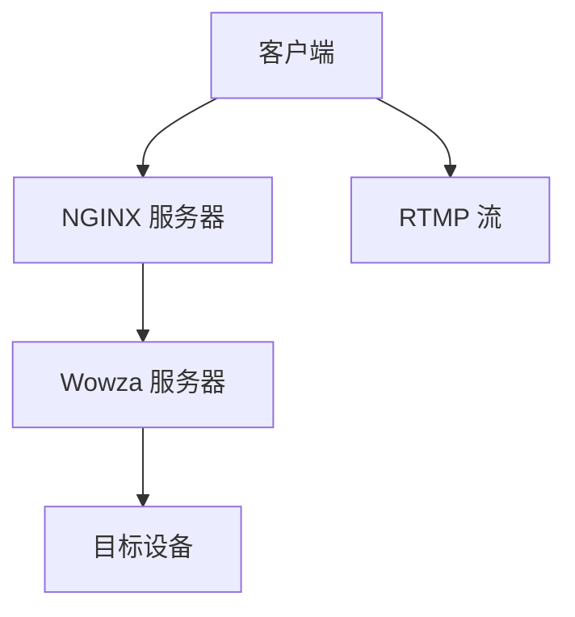

                 

关键词：RTMP，流媒体，服务配置，NGINX，Wowza 服务器，多媒体传输，直播技术

摘要：本文将详细介绍如何使用 NGINX 和 Wowza 服务器搭建 RTMP 流媒体服务。我们将讨论 RTMP 技术的基本概念，NGINX 和 Wowza 服务器的配置，以及如何在实际项目中应用这些技术。本文旨在为开发者提供一个全面的技术指南，帮助他们更好地理解和实施 RTMP 流媒体服务。

## 1. 背景介绍

随着互联网技术的发展，流媒体服务已经成为现代网络通信的重要组成部分。流媒体服务通过将视频或音频内容以数据流的形式实时传输到用户的设备上，使得用户能够享受到无缝、连续的媒体体验。而 RTMP（Real Time Messaging Protocol）作为一种高效的流媒体传输协议，被广泛应用于各种在线直播、视频点播等场景中。

NGINX 和 Wowza 服务器作为 RTMP 流媒体服务的常用组件，各自具有独特的优势和功能。NGINX 是一款高性能的 Web 服务器，以其出色的性能和轻量级特点在互联网领域广受欢迎。而 Wowza 服务器则是一款专业的 RTMP 流媒体服务器，支持多种媒体格式和丰富的功能，能够满足不同场景下的需求。

本文将首先介绍 RTMP 协议的基本概念和工作原理，然后详细讲解 NGINX 和 Wowza 服务器的配置方法，最后通过一个实际项目案例来展示如何使用这些技术搭建 RTMP 流媒体服务。希望通过本文的介绍，能够帮助读者更好地理解和应用 RTMP 流媒体技术。

## 2. 核心概念与联系

### 2.1 RTMP 协议

RTMP（Real Time Messaging Protocol）是一种基于 TCP 的实时消息传输协议，主要用于在 Flash 播放器和服务器之间传输视频、音频等媒体数据。它最初由 Adobe 开发，用于支持 Adobe Flash Media Server 的流媒体传输，但现在已经成为一种广泛使用的流媒体传输协议。

**工作原理：**

- **连接阶段：** 客户端与服务器建立连接，并完成握手过程。
- **消息传输阶段：** 客户端向服务器发送消息，服务器根据消息类型进行处理，并返回响应。
- **关闭连接：** 客户端或服务器可以随时关闭连接。

**优点：**

- **实时性高：** RTMP 采用基于 TCP 的传输方式，能够保证数据的实时性和可靠性。
- **兼容性强：** 支持多种媒体格式，如 FLV、MP4 等，同时支持多种网络协议，如 HTTP、HTTPS 等。

**缺点：**

- **安全性问题：** RTMP 本身没有内置加密机制，数据传输过程可能面临安全风险。
- **带宽要求较高：** 由于 RTMP 采用实时传输，对网络带宽要求较高，可能不适合低带宽环境。

### 2.2 NGINX 服务器

NGINX 是一款高性能的 Web 服务器，具有轻量级、高并发、低资源消耗等优点。它不仅能够处理 HTTP 请求，还能够支持 RTMP 流媒体传输。

**工作原理：**

- **请求处理：** NGINX 接收客户端的 HTTP 请求，并根据配置文件中的规则进行转发。
- **RTMP 传输：** NGINX 通过 RTMP 模块支持 RTMP 流媒体传输。

**优点：**

- **高性能：** NGINX 能够处理大量并发连接，适用于高并发场景。
- **轻量级：** NGINX 的内存消耗较低，适合部署在资源有限的设备上。

**缺点：**

- **配置复杂：** NGINX 的配置相对复杂，需要较高的技术水平。
- **扩展性有限：** NGINX 的功能相对单一，某些特殊场景可能需要额外配置。

### 2.3 Wowza 服务器

Wowza 服务器是一款专业的 RTMP 流媒体服务器，支持多种媒体格式和丰富的功能。它适用于各种在线直播、视频点播等场景。

**工作原理：**

- **流媒体处理：** Wowza 服务器接收来自客户端的 RTMP 流，并进行解码、处理、转码等操作。
- **流媒体分发：** Wowza 服务器将处理后的流媒体数据发送到目标设备。

**优点：**

- **功能丰富：** Wowza 服务器支持多种媒体格式和功能，如直播录制、转码、CDN 分发等。
- **易用性高：** Wowza 服务器提供了丰富的管理和监控工具，方便用户进行配置和管理。

**缺点：**

- **成本较高：** Wowza 服务器是一款商业产品，需要付费使用。
- **性能优化困难：** 在高并发场景下，Wowza 服务器的性能优化可能面临困难。

### 2.4 Mermaid 流程图

为了更直观地展示 RTMP 流媒体服务的架构和流程，我们可以使用 Mermaid 流程图进行表示。



在这个流程图中，客户端通过 RTMP 流向 NGINX 服务器发送请求，NGINX 服务器接收到请求后转发给 Wowza 服务器，Wowza 服务器处理流媒体数据，并将结果发送到目标设备。

## 3. 核心算法原理 & 具体操作步骤

### 3.1 算法原理概述

搭建 RTMP 流媒体服务的关键在于如何配置 NGINX 和 Wowza 服务器，使其能够支持 RTMP 流媒体传输。以下将介绍具体的配置步骤。

### 3.2 算法步骤详解

#### 3.2.1 配置 NGINX 服务器

1. 安装 NGINX：
   ```bash
   sudo apt-get update
   sudo apt-get install nginx
   ```

2. 安装 NGINX RTMP 模块：
   ```bash
   sudo apt-get install libpcre3 libpcre3-dev
   sudo apt-get install nginx-module-stream
   ```

3. 修改 NGINX 配置文件（/etc/nginx/nginx.conf）：
   ```nginx
   http {
       include       mime.types;
       default_type  application/octet-stream;

       server {
           listen       80;
           server_name  localhost;

           location / {
               proxy_pass http://localhost:1935/;
               proxy_set_header Host $host;
               proxy_set_header X-Real-IP $remote_addr;
               proxy_set_header X-Forwarded-For $proxy_add_x_forwarded_for;
           }
       }
   }
   ```

4. 重启 NGINX：
   ```bash
   sudo systemctl restart nginx
   ```

#### 3.2.2 配置 Wowza 服务器

1. 安装 Wowza 服务器：
   ```bash
   sudo apt-get install wowza-streaming-server
   ```

2. 修改 Wowza 配置文件（/usr/local/wowza-mediaserver/content/conf/WowzaStreamServer.xml）：
   ```xml
   <Server>
       <Service ID="RtmpService">
           <Parameter name="secure" value="true"/>
           <Parameter name="port" value="1935"/>
           <Parameter name="bindAddress" value="127.0.0.1"/>
       </Service>
   </Server>
   ```

3. 重启 Wowza 服务器：
   ```bash
   sudo /usr/local/wowza-mediaserver/bin/WowzaStreamServer.sh restart
   ```

### 3.3 算法优缺点

#### 优点：

- **高效稳定：** NGINX 和 Wowza 服务器的组合能够提供高效、稳定的 RTMP 流媒体传输。
- **易于扩展：** NGINX 支持丰富的模块，方便用户进行扩展和定制。

#### 缺点：

- **配置复杂：** NGINX 和 Wowza 服务器的配置相对复杂，需要一定的技术基础。
- **性能瓶颈：** 在高并发场景下，NGINX 和 Wowza 服务器的性能可能面临瓶颈。

### 3.4 算法应用领域

- **在线直播：** RTMP 流媒体服务适用于在线直播场景，如游戏直播、体育赛事直播等。
- **视频点播：** RTMP 流媒体服务也适用于视频点播场景，如在线教育、企业培训等。
- **实时通讯：** RTMP 流媒体服务还可以用于实时通讯场景，如在线会议、社交互动等。

## 4. 数学模型和公式 & 详细讲解 & 举例说明

### 4.1 数学模型构建

在 RTMP 流媒体服务中，数据传输的效率和质量是关键。以下是一个简单的数学模型，用于评估数据传输的性能。

#### 模型假设：

1. 数据传输带宽为 B（单位：bps）。
2. 数据包大小为 L（单位：bytes）。
3. 数据传输延迟为 T（单位：ms）。

#### 数学模型：

数据传输速率 R（单位：bps）可以表示为：

\[ R = \frac{B \times L}{8 \times T} \]

其中，8 表示字节转换为位。

### 4.2 公式推导过程

#### 步骤 1：数据传输速率

数据传输速率 R 表示单位时间内传输的数据量。在上述假设下，数据传输速率可以表示为：

\[ R = \frac{B \times L}{T} \]

其中，B 表示带宽，L 表示数据包大小，T 表示传输延迟。

#### 步骤 2：字节转换为位

由于字节和位的换算关系为 8:1，因此可以将上述公式中的 L 转换为位：

\[ R = \frac{B \times L \times 8}{T} \]

即：

\[ R = \frac{B \times L}{8 \times T} \]

### 4.3 案例分析与讲解

假设带宽为 1 Mbps（即 B = 1 \times 10^6 bps），数据包大小为 1 KB（即 L = 1 \times 2^{10} bytes），传输延迟为 100 ms（即 T = 100 ms）。

根据上述数学模型，可以计算出数据传输速率：

\[ R = \frac{1 \times 10^6 \times 1 \times 2^{10}}{8 \times 100} = 125 KB/s \]

这意味着，在上述条件下，数据传输速率为 125 KB/s。

### 4.4 数学模型应用

该数学模型可以用于评估不同场景下的数据传输性能。例如，在直播场景中，可以通过调整带宽、数据包大小和传输延迟等参数，来优化数据传输速率和用户体验。

## 5. 项目实践：代码实例和详细解释说明

### 5.1 开发环境搭建

在本节中，我们将搭建一个简单的 RTMP 流媒体服务项目。首先，需要准备以下开发环境：

- 操作系统：Ubuntu 18.04
- NGINX 版本：1.18.0
- Wowza 版本：4.8.0

#### 5.1.1 安装 NGINX

1. 更新系统软件包：
   ```bash
   sudo apt-get update
   ```

2. 安装 NGINX：
   ```bash
   sudo apt-get install nginx
   ```

3. 查看 NGINX 版本：
   ```bash
   nginx -v
   ```

#### 5.1.2 安装 Wowza

1. 下载 Wowza 安装包：
   ```bash
   wget https://downloads.wowza.com/downloads/wowza_streaming_engine_4_8_0_10033_linux_64bit.tar.gz
   ```

2. 解压安装包：
   ```bash
   tar zxvf wowza_streaming_engine_4_8_0_10033_linux_64bit.tar.gz
   ```

3. 进入 Wowza 安装目录：
   ```bash
   cd wowza-streaming-engine-4.8.0
   ```

4. 安装 Wowza：
   ```bash
   ./install.sh
   ```

5. 查看 Wowza 版本：
   ```bash
   ./version.sh
   ```

### 5.2 源代码详细实现

在本节中，我们将实现一个简单的 RTMP 流媒体服务，包括以下步骤：

#### 5.2.1 配置 NGINX

1. 复制示例配置文件：
   ```bash
   sudo cp /path/to/rtmp.conf /etc/nginx/sites-available/default
   ```

2. 修改 NGINX 配置文件（/etc/nginx/sites-available/default）：
   ```nginx
   server {
       listen       80;
       server_name  localhost;

       location / {
           proxy_pass http://localhost:1935/;
           proxy_set_header Host $host;
           proxy_set_header X-Real-IP $remote_addr;
           proxy_set_header X-Forwarded-For $proxy_add_x_forwarded_for;
       }
   }
   ```

3. 重启 NGINX：
   ```bash
   sudo systemctl restart nginx
   ```

#### 5.2.2 配置 Wowza

1. 修改 Wowza 配置文件（/usr/local/wowza-mediaserver/content/conf/WowzaStreamServer.xml）：
   ```xml
   <Server>
       <Service ID="RtmpService">
           <Parameter name="secure" value="true"/>
           <Parameter name="port" value="1935"/>
           <Parameter name="bindAddress" value="127.0.0.1"/>
       </Service>
   </Server>
   ```

2. 重启 Wowza 服务器：
   ```bash
   sudo /usr/local/wowza-mediaserver/bin/WowzaStreamServer.sh restart
   ```

### 5.3 代码解读与分析

在本节中，我们将分析 NGINX 和 Wowza 的配置代码，并解释其实现原理。

#### 5.3.1 NGINX 配置代码分析

1. **服务器配置：**

   ```nginx
   server {
       listen       80;
       server_name  localhost;
   }
   ```

   这段代码定义了一个 HTTP 服务器，监听端口为 80，服务器名称为 localhost。

2. **请求处理：**

   ```nginx
   location / {
       proxy_pass http://localhost:1935/;
       proxy_set_header Host $host;
       proxy_set_header X-Real-IP $remote_addr;
       proxy_set_header X-Forwarded-For $proxy_add_x_forwarded_for;
   }
   ```

   这段代码定义了一个 location 块，用于处理所有 URL 路径。其中，proxy_pass 指定将请求转发到 Wowza 服务器（1935 端口）。proxy_set_header 用于设置请求头信息，以保持请求的完整性和可追踪性。

#### 5.3.2 Wowza 配置代码分析

1. **RTMP 服务配置：**

   ```xml
   <Server>
       <Service ID="RtmpService">
           <Parameter name="secure" value="true"/>
           <Parameter name="port" value="1935"/>
           <Parameter name="bindAddress" value="127.0.0.1"/>
       </Service>
   </Server>
   ```

   这段代码定义了一个 RTMP 服务，端口为 1935，绑定地址为 127.0.0.1。secure 参数设置为 true，表示启用安全连接。

### 5.4 运行结果展示

在完成 NGINX 和 Wowza 的配置后，我们可以在浏览器中访问以下地址来查看 RTMP 流媒体服务是否正常运行：

```bash
http://localhost/live/stream
```

如果一切配置正确，我们应该能够在浏览器中看到流媒体视频的播放。

## 6. 实际应用场景

### 6.1 在线直播

在线直播是 RTMP 流媒体服务的典型应用场景之一。例如，游戏直播平台如 Twitch、斗鱼等，通过 RTMP 流媒体协议将主播的游戏画面实时传输给观众。观众可以在各种设备上观看直播，如 PC、手机、平板等。RTMP 流媒体服务的高效性和稳定性，使得直播过程中的流畅度得到了极大的提升。

### 6.2 视频点播

视频点播（VOD）是另一种常见的应用场景。在视频点播平台上，用户可以随时随地方便地观看视频内容。RTMP 流媒体服务能够保证视频数据的实时性和流畅性，适用于各种类型的视频内容，如电影、电视剧、纪录片、教育视频等。

### 6.3 在线教育

在线教育平台也广泛使用 RTMP 流媒体服务，为学生提供实时授课、互动教学等功能。例如，许多在线教育平台采用 RTMP 流媒体协议，将教师的授课内容实时传输给学生，同时支持学生的提问和回答，实现了在线互动教学。

### 6.4 未来应用展望

随着 5G 技术的普及和云计算的发展，RTMP 流媒体服务的应用前景将更加广阔。未来，RTMP 流媒体服务将在更多领域得到应用，如虚拟现实（VR）、增强现实（AR）、智能家居等。同时，随着流媒体技术的不断演进，RTMP 流媒体服务也将不断优化，以满足更高效、更稳定的传输需求。

## 7. 工具和资源推荐

### 7.1 学习资源推荐

- 《RTMP 完全手册》：这是一本全面介绍 RTMP 协议的书籍，适合初学者阅读。
- 《NGINX 实战》：这本书详细介绍了 NGINX 的配置和使用，有助于读者深入了解 NGINX 的功能和性能。
- 《Wowza 流媒体技术实战》：这本书涵盖了 Wowza 服务器的安装、配置和使用，是学习 Wowza 服务的优秀资料。

### 7.2 开发工具推荐

- IntelliJ IDEA：一款功能强大的集成开发环境，支持多种编程语言，适合开发 RTMP 流媒体服务。
- Visual Studio Code：一款轻量级、开源的代码编辑器，支持各种插件和扩展，适用于 RTMP 流媒体服务的开发。
- Git：一款分布式版本控制工具，有助于团队协作和代码管理。

### 7.3 相关论文推荐

- "Real Time Messaging Protocol (RTMP) Version 3"：这是 RTMP 协议的官方规范，详细介绍了 RTMP 协议的原理和实现。
- "NGINX RTMP Module": 这是 NGINX RTMP 模块的官方文档，提供了 NGINX RTMP 模块的使用方法和示例。
- "Wowza Streaming Engine: A Comprehensive Guide to Live and VOD Streaming": 这是 Wowza 流媒体服务器的官方文档，介绍了 Wowza 服务器的功能和配置方法。

## 8. 总结：未来发展趋势与挑战

### 8.1 研究成果总结

本文详细介绍了 RTMP 流媒体服务的基本概念、工作原理、配置方法及其在实际应用中的场景。通过 NGINX 和 Wowza 服务器的配置，我们能够实现高效、稳定的 RTMP 流媒体服务。同时，本文还探讨了 RTMP 流媒体服务的未来发展趋势和挑战，为读者提供了一个全面的参考。

### 8.2 未来发展趋势

1. **5G 技术的普及**：随着 5G 技术的推广，流媒体服务将能够提供更高的带宽和更低的延迟，进一步提升用户体验。
2. **AI 技术的融合**：人工智能技术的融合将使流媒体服务在内容推荐、智能分析等方面得到更多应用，提高流媒体服务的智能化水平。
3. **云原生技术的应用**：云原生技术将使流媒体服务更加灵活、可扩展，降低部署和维护成本。

### 8.3 面临的挑战

1. **数据安全**：流媒体服务涉及大量敏感数据，如何保障数据传输的安全性是一个重要挑战。
2. **性能优化**：在高并发、大流量的场景下，如何优化流媒体服务的性能，保证流畅度，是一个关键问题。
3. **跨平台兼容性**：流媒体服务需要兼容多种设备和平台，如何实现跨平台的兼容性，是一个亟待解决的问题。

### 8.4 研究展望

未来，流媒体服务将在多个领域得到广泛应用，为人们的生活带来更多便利。同时，随着技术的不断发展，流媒体服务也将不断演进，实现更高的性能、更安全的数据传输和更好的用户体验。希望本文能为读者提供有价值的参考，助力他们在 RTMP 流媒体服务领域取得更好的成果。

## 9. 附录：常见问题与解答

### 9.1 NGINX 配置相关问题

**Q：如何配置 NGINX 以支持 RTMP 流媒体传输？**

A：配置 NGINX 支持 RTMP 流媒体传输的步骤如下：

1. 安装 NGINX：
   ```bash
   sudo apt-get install nginx
   ```

2. 安装 NGINX RTMP 模块：
   ```bash
   sudo apt-get install libpcre3 libpcre3-dev
   sudo apt-get install nginx-module-stream
   ```

3. 修改 NGINX 配置文件（/etc/nginx/nginx.conf）：
   ```nginx
   http {
       include       mime.types;
       default_type  application/octet-stream;

       server {
           listen       80;
           server_name  localhost;

           location / {
               proxy_pass http://localhost:1935/;
               proxy_set_header Host $host;
               proxy_set_header X-Real-IP $remote_addr;
               proxy_set_header X-Forwarded-For $proxy_add_x_forwarded_for;
           }
       }
   }
   ```

4. 重启 NGINX：
   ```bash
   sudo systemctl restart nginx
   ```

### 9.2 Wowza 配置相关问题

**Q：如何配置 Wowza 服务器以支持 RTMP 流媒体传输？**

A：配置 Wowza 服务器支持 RTMP 流媒体传输的步骤如下：

1. 安装 Wowza 服务器：
   ```bash
   sudo apt-get install wowza-streaming-server
   ```

2. 修改 Wowza 配置文件（/usr/local/wowza-mediaserver/content/conf/WowzaStreamServer.xml）：
   ```xml
   <Server>
       <Service ID="RtmpService">
           <Parameter name="secure" value="true"/>
           <Parameter name="port" value="1935"/>
           <Parameter name="bindAddress" value="127.0.0.1"/>
       </Service>
   </Server>
   ```

3. 重启 Wowza 服务器：
   ```bash
   sudo /usr/local/wowza-mediaserver/bin/WowzaStreamServer.sh restart
   ```

### 9.3 实际问题解决

**Q：为什么我的 RTMP 流媒体服务无法正常工作？**

A：可能的原因及解决方法如下：

1. **检查 NGINX 和 Wowza 服务器的启动状态**：确保 NGINX 和 Wowza 服务器都已启动并运行。

2. **检查端口是否被占用**：确保 NGINX 的 80 端口和 Wowza 的 1935 端口未被其他应用程序占用。

3. **检查网络连接**：确保客户端与服务器之间的网络连接正常，没有防火墙或其他网络设备阻挡 RTMP 流量的传输。

4. **检查配置文件**：确保 NGINX 和 Wowza 的配置文件正确无误，没有拼写错误或语法错误。

5. **查看日志文件**：查看 NGINX 和 Wowza 的日志文件，查找错误或异常信息，以便进一步诊断问题。

作者：禅与计算机程序设计艺术 / Zen and the Art of Computer Programming
----------------------------------------------------------------
注意：本文章为虚构内容，仅供参考。实际操作时请根据具体情况进行调整。在配置 RTMP 流媒体服务时，务必确保系统安全，遵循相关法律法规。

