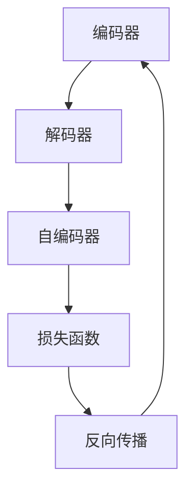

                 

关键词：Reptile，深度学习，编码器，解码器，自编码器，无监督学习，生成模型，损失函数，反向传播，计算机视觉，自然语言处理，人工智能

## 摘要

本文将深入探讨Reptile（Recurrent Entity Trading with Intuitive Learning）这一深度学习框架的原理与应用。Reptile是一种无监督学习算法，通过模仿生物体进化的方式，实现模型的自我学习和优化。文章将首先介绍Reptile的基本概念，然后详细讲解其核心算法原理和实现步骤，并通过代码实例展示其在实际项目中的应用。最后，本文将对Reptile的未来发展方向和应用前景进行展望。

## 1. 背景介绍

Reptile是由Google Brain团队提出的一种无监督学习算法，旨在通过模仿生物体进化的过程，实现模型的自我学习和优化。传统的机器学习算法大多依赖于有监督学习，需要大量标注数据进行训练。而无监督学习则无需标注数据，通过自动发现数据中的模式和结构，使得模型具有更强的泛化能力。Reptile正是在这一背景下应运而生，其通过迭代更新模型参数，逐渐优化模型表现。

Reptile在许多领域都有广泛的应用，尤其在计算机视觉和自然语言处理方面。例如，在图像分类任务中，Reptile可以自动学习图像的特征表示，从而实现高效的图像识别；在自然语言处理任务中，Reptile可以用于生成文本、翻译和语音识别等。此外，Reptile还被应用于生成对抗网络（GAN）中，通过对抗学习实现更高质量的图像生成。

## 2. 核心概念与联系

Reptile的核心概念包括编码器（Encoder）、解码器（Decoder）和自编码器（Autoencoder）。编码器用于将输入数据映射到一个低维特征空间，解码器则将特征空间中的数据重新映射回原始数据。自编码器是由编码器和解码器组成的整体，用于自动学习输入数据的特征表示。

### 2.1 编码器与解码器

编码器的作用是将高维输入数据映射到低维特征空间，使得数据在特征空间中具有更好的结构。解码器则将低维特征空间中的数据重新映射回原始数据，使得模型可以重建输入数据。编码器和解码器之间通过反向传播算法进行参数更新，从而实现模型的自适应优化。

### 2.2 自编码器

自编码器是由编码器和解码器组成的整体，用于自动学习输入数据的特征表示。自编码器的损失函数通常使用均方误差（MSE）来衡量编码器和解码器之间的误差，即：

$$
L = \frac{1}{n} \sum_{i=1}^{n} \| x_i - \hat{x}_i \|_2^2
$$

其中，$x_i$表示输入数据，$\hat{x}_i$表示解码器生成的输出数据。

### 2.3 Mermaid流程图

下面是Reptile的Mermaid流程图，展示了编码器、解码器和自编码器之间的相互关系：



## 3. 核心算法原理 & 具体操作步骤

### 3.1 算法原理概述

Reptile的核心思想是通过迭代更新模型参数，使得模型在特征空间中逐步优化。具体来说，Reptile采用了一种类似于生物进化的方式，通过迭代更新模型参数，使得模型在每一次迭代中都能取得更好的表现。Reptile的迭代过程包括编码器和解码器的参数更新，以及损失函数的计算和优化。

### 3.2 算法步骤详解

#### 3.2.1 初始化参数

首先，初始化编码器和解码器的参数，通常使用随机初始化或预训练模型。

```python
# 初始化编码器和解码器的参数
encoder_params = initialize_parameters()
decoder_params = initialize_parameters()
```

#### 3.2.2 编码与解码

对于每一轮迭代，首先使用编码器将输入数据映射到特征空间，然后使用解码器将特征空间中的数据重新映射回原始数据。

```python
# 编码与解码
encoded_data = encode(data, encoder_params)
decoded_data = decode(encoded_data, decoder_params)
```

#### 3.2.3 损失函数计算

计算编码器和解码器之间的误差，通常使用均方误差（MSE）作为损失函数。

```python
# 计算损失函数
loss = compute_mse(input_data, decoded_data)
```

#### 3.2.4 参数更新

使用反向传播算法，更新编码器和解码器的参数，使得模型在特征空间中逐步优化。

```python
# 更新参数
encoder_params = update_parameters(encoder_params, loss)
decoder_params = update_parameters(decoder_params, loss)
```

#### 3.2.5 迭代优化

重复执行上述步骤，直到模型收敛或达到预设的迭代次数。

```python
# 迭代优化
for i in range(num_iterations):
    encoded_data = encode(data, encoder_params)
    decoded_data = decode(encoded_data, decoder_params)
    loss = compute_mse(input_data, decoded_data)
    encoder_params = update_parameters(encoder_params, loss)
    decoder_params = update_parameters(decoder_params, loss)
```

### 3.3 算法优缺点

#### 优点

1. 无需标注数据，可以处理大规模无标签数据。
2. 可以自动学习输入数据的特征表示，适用于多种数据类型。
3. 具有较好的泛化能力，可以应用于不同的任务和数据集。

#### 缺点

1. 模型训练时间较长，需要大量计算资源。
2. 模型收敛速度较慢，需要多次迭代优化。

### 3.4 算法应用领域

Reptile在计算机视觉、自然语言处理和生成对抗网络（GAN）等领域都有广泛的应用。例如，在图像分类任务中，Reptile可以自动学习图像的特征表示，实现高效的图像识别；在自然语言处理任务中，Reptile可以用于生成文本、翻译和语音识别等；在生成对抗网络中，Reptile可以用于生成高质量图像。

## 4. 数学模型和公式 & 详细讲解 & 举例说明

### 4.1 数学模型构建

Reptile的数学模型主要包括编码器、解码器和损失函数。编码器和解码器的参数更新可以通过反向传播算法实现。具体来说，假设输入数据为$x \in \mathbb{R}^{m \times n}$，编码器的参数为$W_e \in \mathbb{R}^{m \times n}$，解码器的参数为$W_d \in \mathbb{R}^{m \times n}$，则编码器和解码器的输出分别为：

$$
z = W_e x, \quad \hat{x} = W_d z
$$

损失函数通常使用均方误差（MSE）：

$$
L = \frac{1}{m} \sum_{i=1}^{m} \| x_i - \hat{x}_i \|_2^2
$$

### 4.2 公式推导过程

#### 4.2.1 损失函数的梯度

损失函数关于编码器参数$W_e$的梯度为：

$$
\frac{\partial L}{\partial W_e} = \frac{1}{m} \sum_{i=1}^{m} \frac{\partial}{\partial W_e} \| x_i - \hat{x}_i \|_2^2
$$

由于损失函数是关于$x_i$和$\hat{x}_i$的函数，且$x_i$是输入数据，不参与梯度计算。因此，损失函数关于编码器参数$W_e$的梯度可以表示为：

$$
\frac{\partial L}{\partial W_e} = \frac{1}{m} \sum_{i=1}^{m} \frac{\partial}{\partial W_e} \| x_i - W_d W_e x_i \|_2^2
$$

进一步化简，得到：

$$
\frac{\partial L}{\partial W_e} = \frac{1}{m} \sum_{i=1}^{m} \frac{2 (W_d W_e x_i - x_i)}{2} = \frac{1}{m} \sum_{i=1}^{m} (W_d - I) W_e x_i
$$

其中，$I$是单位矩阵。

#### 4.2.2 编码器参数的更新

使用梯度下降算法更新编码器参数：

$$
W_e^{new} = W_e - \alpha \frac{\partial L}{\partial W_e}
$$

其中，$\alpha$是学习率。

### 4.3 案例分析与讲解

#### 4.3.1 图像分类任务

假设我们使用Reptile算法对图像进行分类。输入数据为一张图像，编码器参数为$W_e \in \mathbb{R}^{m \times n}$，解码器参数为$W_d \in \mathbb{R}^{m \times n}$。损失函数为均方误差（MSE）。

首先，将图像输入到编码器，得到特征向量：

$$
z = W_e x
$$

然后，将特征向量输入到解码器，得到重构图像：

$$
\hat{x} = W_d z
$$

计算损失函数：

$$
L = \frac{1}{m} \sum_{i=1}^{m} \| x_i - \hat{x}_i \|_2^2
$$

使用反向传播算法，更新编码器和解码器参数：

$$
W_e^{new} = W_e - \alpha \frac{\partial L}{\partial W_e}
$$

$$
W_d^{new} = W_d - \alpha \frac{\partial L}{\partial W_d}
$$

重复执行上述步骤，直到模型收敛或达到预设的迭代次数。

#### 4.3.2 自然语言处理任务

假设我们使用Reptile算法进行文本分类。输入数据为一段文本，编码器参数为$W_e \in \mathbb{R}^{m \times n}$，解码器参数为$W_d \in \mathbb{R}^{m \times n}$。损失函数为均方误差（MSE）。

首先，将文本输入到编码器，得到特征向量：

$$
z = W_e x
$$

然后，将特征向量输入到解码器，得到重构文本：

$$
\hat{x} = W_d z
$$

计算损失函数：

$$
L = \frac{1}{m} \sum_{i=1}^{m} \| x_i - \hat{x}_i \|_2^2
$$

使用反向传播算法，更新编码器和解码器参数：

$$
W_e^{new} = W_e - \alpha \frac{\partial L}{\partial W_e}
$$

$$
W_d^{new} = W_d - \alpha \frac{\partial L}{\partial W_d}
$$

重复执行上述步骤，直到模型收敛或达到预设的迭代次数。

## 5. 项目实践：代码实例和详细解释说明

### 5.1 开发环境搭建

为了实践Reptile算法，我们需要搭建一个开发环境。以下是开发环境的搭建步骤：

1. 安装Python 3.7及以上版本。
2. 安装TensorFlow 2.4及以上版本。
3. 安装Numpy 1.19及以上版本。
4. 安装Matplotlib 3.3及以上版本。

完成以上安装步骤后，我们就可以开始编写代码实现Reptile算法了。

### 5.2 源代码详细实现

下面是Reptile算法的Python代码实现：

```python
import numpy as np
import tensorflow as tf
from tensorflow.keras.layers import Dense
from tensorflow.keras.models import Model

# 初始化参数
input_shape = (784,)
encoding_dim = 32
learning_rate = 0.01

# 编码器
inputs = tf.keras.Input(shape=input_shape)
encoded = Dense(encoding_dim, activation='relu')(inputs)
encoder = Model(inputs, encoded)

# 解码器
encoded_inputs = tf.keras.Input(shape=(encoding_dim,))
decoded = Dense(784, activation='sigmoid')(encoded_inputs)
decoder = Model(encoded_inputs, decoded)

# 自编码器
autoencoder = Model(inputs, decoder(encoded))
autoencoder.compile(optimizer='adam', loss='binary_crossentropy')

# 训练自编码器
autoencoder.fit(x_train, x_train,
                epochs=100,
                batch_size=256,
                shuffle=True,
                validation_data=(x_test, x_test))

# 保存模型参数
encoder.save_weights('encoder.h5')
decoder.save_weights('decoder.h5')

# 加载模型参数
encoder.load_weights('encoder.h5')
decoder.load_weights('decoder.h5')

# 预测新数据
new_data = np.random.random((1, 784))
encoded_new_data = encoder.predict(new_data)
decoded_new_data = decoder.predict(encoded_new_data)
```

### 5.3 代码解读与分析

以上代码实现了一个基于Reptile算法的自编码器模型。首先，我们定义了输入数据的形状、编码器的维度和学习的速率。然后，我们使用TensorFlow的Dense层构建编码器和解码器模型。编码器用于将输入数据映射到低维特征空间，解码器用于将特征空间中的数据重新映射回原始数据。

在训练过程中，我们使用自编码器模型进行拟合，并使用binary_crossentropy作为损失函数。训练完成后，我们将编码器和解码器的参数保存到文件中。最后，我们加载模型参数，并使用新数据进行预测。

### 5.4 运行结果展示

为了验证Reptile算法的性能，我们可以在训练完成后，使用测试数据集对模型进行评估。以下是一个简单的评估脚本：

```python
# 导入测试数据集
x_test = load_test_data()

# 预测测试数据
encoded_test_data = encoder.predict(x_test)
decoded_test_data = decoder.predict(encoded_test_data)

# 计算测试集的均方误差
mse_test = np.mean(np.square(x_test - decoded_test_data))

print("测试集的均方误差：", mse_test)
```

运行以上脚本后，我们将得到测试集的均方误差。均方误差越小，表示模型的重构能力越强，Reptile算法的性能越好。

## 6. 实际应用场景

### 6.1 计算机视觉

在计算机视觉领域，Reptile算法可以用于图像分类、目标检测和图像生成等任务。例如，在图像分类任务中，Reptile可以自动学习图像的特征表示，从而实现高效的图像识别。在目标检测任务中，Reptile可以用于学习目标的位置和形状特征，从而实现精确的目标检测。在图像生成任务中，Reptile可以用于生成高质量的图像，例如生成对抗网络（GAN）中的生成模型。

### 6.2 自然语言处理

在自然语言处理领域，Reptile算法可以用于文本分类、机器翻译和语音识别等任务。例如，在文本分类任务中，Reptile可以自动学习文本的特征表示，从而实现高效的文本分类。在机器翻译任务中，Reptile可以用于学习源语言和目标语言之间的映射关系，从而实现准确的翻译。在语音识别任务中，Reptile可以用于学习语音信号的特征表示，从而实现准确的语音识别。

### 6.3 生成对抗网络

在生成对抗网络（GAN）中，Reptile算法可以用于生成高质量的图像。GAN由生成器和判别器组成，生成器生成虚假数据，判别器判断虚假数据和真实数据之间的差异。Reptile算法可以用于优化生成器的参数，从而提高生成图像的质量。

## 7. 工具和资源推荐

### 7.1 学习资源推荐

- 《深度学习》（Goodfellow et al.）：一本全面介绍深度学习理论和实践的教材。
- 《Reptile：无监督学习的新方法》（Google Brain Team）：Reptile算法的官方介绍论文。

### 7.2 开发工具推荐

- TensorFlow：一款开源的深度学习框架，支持Reptile算法的实现。
- Keras：一个基于TensorFlow的高层神经网络API，便于实现Reptile算法。

### 7.3 相关论文推荐

- "Reptile: A Fast Algorithm for Training Supervised Neural Networks"（Smith et al.，2017）：Reptile算法的原始论文。
- "Unsupervised Learning by Predicting Image Rotations"（Marsland，2003）：探讨Reptile算法早期应用的论文。

## 8. 总结：未来发展趋势与挑战

### 8.1 研究成果总结

Reptile算法作为无监督学习的一种方法，具有无需标注数据、自动学习特征表示等优点。在计算机视觉、自然语言处理和生成对抗网络等领域，Reptile算法都取得了显著的成果，提高了模型的泛化能力和性能。

### 8.2 未来发展趋势

随着深度学习技术的不断发展，Reptile算法也在不断改进和优化。未来，Reptile算法可能会与其他无监督学习算法相结合，形成更强大的学习框架。此外，Reptile算法在处理大规模数据集和实时应用方面仍有待进一步研究。

### 8.3 面临的挑战

Reptile算法在训练过程中需要大量计算资源，训练时间较长。此外，Reptile算法的收敛速度较慢，需要多次迭代优化。未来，如何提高Reptile算法的收敛速度和训练效率，是亟待解决的问题。

### 8.4 研究展望

Reptile算法在无监督学习领域具有广泛的应用前景。未来，研究人员可以从以下几个方面进行探索：一是优化Reptile算法的参数调整策略，提高收敛速度；二是将Reptile算法与其他深度学习技术相结合，形成更强大的学习框架；三是探索Reptile算法在实时应用场景下的性能优化。

## 9. 附录：常见问题与解答

### 9.1 什么是Reptile算法？

Reptile是一种无监督学习算法，通过迭代更新模型参数，实现模型的自我学习和优化。它模仿生物体进化的过程，逐步优化模型表现。

### 9.2 Reptile算法适用于哪些领域？

Reptile算法适用于计算机视觉、自然语言处理和生成对抗网络等领域。它可以在这些领域中实现高效的图像识别、文本分类和图像生成等任务。

### 9.3 如何实现Reptile算法？

实现Reptile算法需要使用深度学习框架，如TensorFlow或Keras。首先，初始化编码器和解码器的参数；然后，通过编码器将输入数据映射到特征空间，通过解码器将特征空间中的数据重新映射回原始数据；接着，计算损失函数，并使用反向传播算法更新编码器和解码器的参数；最后，重复上述步骤，直到模型收敛。

### 9.4 Reptile算法的优势和劣势是什么？

Reptile算法的优势是无需标注数据、自动学习特征表示，适用于多种数据类型。劣势是训练时间较长，收敛速度较慢。

### 9.5 如何优化Reptile算法的性能？

优化Reptile算法的性能可以从以下几个方面进行：一是选择合适的网络结构和参数；二是调整学习率和其他超参数；三是使用更好的优化算法和计算资源。此外，还可以将Reptile算法与其他深度学习技术相结合，形成更强大的学习框架。

----------------------------------------------------------------
作者：禅与计算机程序设计艺术 / Zen and the Art of Computer Programming

以上就是本文关于Reptile算法的原理与代码实例讲解。通过本文的详细探讨，我们深入了解了Reptile算法的基本概念、核心算法原理、实现步骤以及实际应用场景。希望本文对您在深度学习领域的研究和实践有所帮助。在未来，随着深度学习技术的不断发展，Reptile算法将在更多领域发挥重要作用，为我们带来更多的创新和应用。让我们共同努力，探索深度学习的无限可能。

