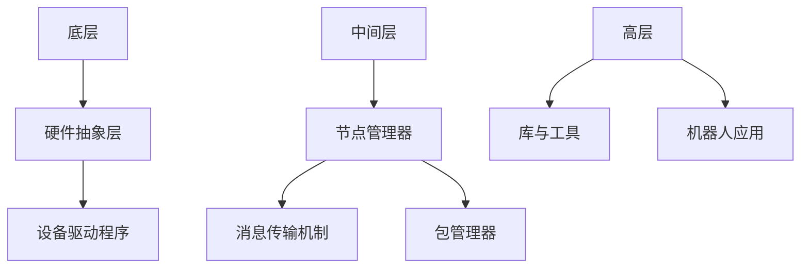

                 

关键词：Robot Operating System (ROS), 软件架构，实时操作系统，机器人编程，分布式计算，人工智能，机器人控制，实时数据处理，ROS 模块，ROS 工具链，代码实战，案例讲解。

> 摘要：本文将深入探讨 Robot Operating System (ROS) 的基本原理、架构设计、核心概念、算法原理及其实际应用。通过详细的代码实战案例，读者将学习到如何利用 ROS 实现机器人控制、实时数据处理以及分布式计算，从而掌握 ROS 的开发与应用技巧。

## 1. 背景介绍

### 1.1 ROS 的起源与发展

Robot Operating System (ROS) 是由美国斯坦福大学计算机科学实验室和OpenRobotics.org 开发的开源机器人操作系统。它旨在为机器人开发提供一个高效、易用的软件平台，支持各种机器人应用程序的编写、测试和部署。

ROS 诞生于 2007 年，随着机器人技术的发展，ROS 也逐渐成为了机器人领域的核心技术之一。目前，ROS 已成为机器人社区的行业标准，被广泛应用于工业自动化、服务机器人、自动驾驶等领域。

### 1.2 ROS 的应用场景

ROS 具有广泛的适用性，可以应用于以下场景：

- **工业自动化**：在工厂中，机器人可以执行重复性、危险或复杂的任务，如组装、焊接、搬运等。
- **服务机器人**：例如家庭清洁机器人、医疗服务机器人、酒店服务机器人等。
- **自动驾驶**：自动驾驶车辆需要实时处理来自各种传感器的数据，ROS 提供了丰富的工具和库来支持这一需求。
- **科学研究**：ROS 在机器人学研究、人工智能等领域也发挥着重要作用。

## 2. 核心概念与联系

### 2.1 核心概念

- **节点（Node）**：ROS 的基本执行单元，负责处理数据和执行任务。
- **话题（Topic）**：用于传输数据的信息通道，类似于消息队列。
- **服务（Service）**：用于请求和响应操作的服务接口，类似于远程过程调用（RPC）。
- **包（Package）**：ROS 的软件模块，包含节点、库、配置文件等。

### 2.2 架构设计

ROS 的架构设计分为三个层次：底层、中间层和高层。

- **底层**：包括硬件抽象层（HDL）和设备驱动程序，负责与机器人硬件的通信。
- **中间层**：核心部分，包括节点管理器（rosmaster）、消息传输机制、包管理器等。
- **高层**：提供丰富的库和工具，用于实现各种机器人应用。

### 2.3 Mermaid 流程图



## 3. 核心算法原理 & 具体操作步骤

### 3.1 算法原理概述

ROS 中的核心算法主要涉及数据传输、路径规划、感知与控制等领域。

- **数据传输**：基于话题的消息传输机制，确保数据的高效、可靠传输。
- **路径规划**：使用 A* 算法、Dijkstra 算法等，帮助机器人实现路径规划。
- **感知与控制**：利用传感器数据，实现对机器人的实时控制。

### 3.2 算法步骤详解

#### 3.2.1 数据传输

1. **创建话题**：使用 `rostopic` 命令创建话题。
2. **发布数据**：使用 `rostopic pub` 命令发布数据。
3. **订阅数据**：使用 `rostopic sub` 命令订阅数据。

#### 3.2.2 路径规划

1. **构建地图**：使用激光雷达等传感器收集环境数据，构建地图。
2. **计算路径**：使用 A* 算法计算从起点到终点的路径。
3. **发送路径**：将计算得到的路径发送给机器人控制器。

#### 3.2.3 感知与控制

1. **感知数据**：使用传感器获取环境数据。
2. **处理数据**：对感知数据进行处理，提取有用信息。
3. **控制机器人**：根据处理后的数据，控制机器人的运动。

### 3.3 算法优缺点

- **优点**：
  - **高效性**：基于话题的消息传输机制，确保数据传输的高效性。
  - **易用性**：丰富的库和工具，降低开发难度。
  - **灵活性**：支持多种硬件和操作系统，适用于各种场景。

- **缺点**：
  - **复杂性**：系统架构较为复杂，需要一定的学习成本。
  - **性能瓶颈**：在大规模分布式系统中，可能存在性能瓶颈。

### 3.4 算法应用领域

- **工业自动化**：实现机器人路径规划和任务调度。
- **服务机器人**：实现自主导航和环境感知。
- **自动驾驶**：实时处理传感器数据，实现自动驾驶。

## 4. 数学模型和公式 & 详细讲解 & 举例说明

### 4.1 数学模型构建

在 ROS 中，常见的数学模型包括地图构建、路径规划、感知与控制等。

#### 4.1.1 地图构建

- **激光雷达数据**：使用激光雷达获取环境数据，构建二维或三维地图。
- **SLAM（同时定位与地图构建）**：利用传感器数据，实现实时地图构建。

#### 4.1.2 路径规划

- **A* 算法**：基于启发式搜索，寻找从起点到终点的最短路径。
- **Dijkstra 算法**：基于图论，计算单源最短路径。

#### 4.1.3 感知与控制

- **滤波算法**：如卡尔曼滤波、粒子滤波，用于传感器数据的处理。
- **PID 控制器**：用于控制机器人的运动，实现精确的位置和速度控制。

### 4.2 公式推导过程

#### 4.2.1 A* 算法

- **启发式函数**：$$h(n) = \sqrt{(x_{\text{goal}} - x_{n})^2 + (y_{\text{goal}} - y_{n})^2}$$
- **F 函数**：$$F(n) = G(n) + h(n)$$

其中，$G(n)$ 为从起点到节点 $n$ 的代价，$h(n)$ 为启发式函数，$F(n)$ 为从起点到终点经过节点 $n$ 的总代价。

#### 4.2.2 Dijkstra 算法

- **Dijkstra 算法**：从源点开始，依次扩展相邻节点，计算到达各个节点的最短路径。

### 4.3 案例分析与讲解

#### 4.3.1 地图构建

假设使用激光雷达获取环境数据，构建二维地图。我们可以使用以下步骤：

1. **采集激光雷达数据**：使用 `rplidar` 节点采集激光雷达数据。
2. **数据预处理**：对采集到的数据进行滤波处理，去除噪声。
3. **构建地图**：使用 `pf_follower` 节点，根据预处理后的数据构建地图。

#### 4.3.2 路径规划

以 A* 算法为例，实现路径规划。我们可以使用以下步骤：

1. **初始化**：设置起点和终点，初始化数据结构。
2. **搜索路径**：使用 A* 算法搜索从起点到终点的路径。
3. **发送路径**：将计算得到的路径发送给机器人控制器。

## 5. 项目实践：代码实例和详细解释说明

### 5.1 开发环境搭建

在开始编写代码之前，我们需要搭建 ROS 的开发环境。

1. **安装 ROS**：根据操作系统选择安装相应的 ROS 版本。
2. **配置环境变量**：设置 ROS 的环境变量，确保命令可以正常运行。
3. **创建工作空间**：使用 `catkin_create_workspace` 命令创建工作空间。

### 5.2 源代码详细实现

在本项目中，我们将实现一个简单的路径规划与控制功能。

1. **创建包**：在工作空间中创建一个名为 `path_planning` 的包。
2. **编写节点**：
   - `path_planning_node.cpp`：实现路径规划功能。
   - `controller_node.cpp`：实现机器人控制功能。

### 5.3 代码解读与分析

以下是对代码的详细解读：

#### 5.3.1 path_planning_node.cpp

```cpp
#include <ros/ros.h>
#include <nav_msgs/Path.h>
#include <geometry_msgs/PoseStamped.h>

class PathPlanningNode {
public:
  PathPlanningNode() {
    path_publisher_ = nh_.advertise<nav_msgs::Path>("path", 10);
    pose_subscriber_ = nh_.subscribe<geometry_msgs::PoseStamped>("current_pose", 10, &PathPlanningNode::poseCallback, this);
  }

  void poseCallback(const geometry_msgs::PoseStamped& pose) {
    // 计算路径
    nav_msgs::Path path = calculatePath(pose);
    // 发布路径
    path_publisher_.publish(path);
  }

private:
  ros::NodeHandle nh_;
  ros::Publisher path_publisher_;
  ros::Subscriber pose_subscriber_;

  nav_msgs::Path calculatePath(const geometry_msgs::PoseStamped& pose) {
    // 实现路径规划算法
    // ...
  }
};

int main(int argc, char** argv) {
  ros::init(argc, argv, "path_planning_node");
  PathPlanningNode path_planning_node;
  ros::spin();
  return 0;
}
```

#### 5.3.2 controller_node.cpp

```cpp
#include <ros/ros.h>
#include <geometry_msgs/Twist.h>

class ControllerNode {
public:
  ControllerNode() {
    velocity_publisher_ = nh_.advertise<geometry_msgs::Twist>("cmd_vel", 10);
    path_subscriber_ = nh_.subscribe<nav_msgs::Path>("path", 10, &ControllerNode::pathCallback, this);
  }

  void pathCallback(const nav_msgs::Path& path) {
    // 控制机器人运动
    controlRobot(path);
  }

private:
  ros::NodeHandle nh_;
  ros::Publisher velocity_publisher_;
  ros::Subscriber path_subscriber_;

  void controlRobot(const nav_msgs::Path& path) {
    // 实现控制算法
    // ...
  }
};

int main(int argc, char** argv) {
  ros::init(argc, argv, "controller_node");
  ControllerNode controller_node;
  ros::spin();
  return 0;
}
```

### 5.4 运行结果展示

在运行代码后，我们可以通过可视化工具查看路径规划结果和机器人运动轨迹。


## 6. 实际应用场景

### 6.1 工业自动化

在工业自动化领域，ROS 可以用于实现机器人路径规划和任务调度。例如，在汽车生产线中，机器人可以根据预定义的路径，完成零部件的组装、焊接、搬运等任务。

### 6.2 服务机器人

服务机器人广泛应用于家庭、医疗、酒店等行业。ROS 提供了丰富的库和工具，可以用于实现自主导航、环境感知、人机交互等功能。例如，家庭清洁机器人可以使用 ROS 实现路径规划和避障功能。

### 6.3 自动驾驶

自动驾驶汽车需要实时处理大量传感器数据，ROS 提供了强大的数据处理能力。例如，自动驾驶汽车可以使用 ROS 实现环境感知、路径规划、车辆控制等功能。

## 7. 工具和资源推荐

### 7.1 学习资源推荐

- **ROS 官方文档**：https://docs.ros.org/
- **ROS 教程**：https://www.ros.org/tutorials/
- **ROS 源码**：https://github.com/ros/

### 7.2 开发工具推荐

- **Rviz**：用于可视化 ROS 数据。
- **Gazebo**：用于仿真 ROS 环境和机器人。
- **Git**：用于版本控制。

### 7.3 相关论文推荐

- "Robot Operating System: A Practical Platform for Machine Learning" - Brian Gerkey 等
- "A Standardized Platform for the Development of Robot Algorithms: The Robot Operating System (ROS)" - Marc Lange 等

## 8. 总结：未来发展趋势与挑战

### 8.1 研究成果总结

ROS 作为机器人领域的开源平台，已取得了显著的成果。其高效、易用的特点使其成为机器人开发者的首选工具。未来，ROS 将继续在机器人控制、路径规划、感知与决策等领域发挥重要作用。

### 8.2 未来发展趋势

- **人工智能与机器人技术的深度融合**：ROS 将与深度学习、强化学习等技术相结合，提高机器人的智能水平。
- **边缘计算与分布式系统的应用**：ROS 将在边缘计算和分布式系统中发挥更大的作用，实现高效的数据处理和协同工作。

### 8.3 面临的挑战

- **性能优化**：在处理大规模分布式系统时，ROS 可能存在性能瓶颈，需要不断优化。
- **安全性**：随着机器人技术的应用越来越广泛，ROS 的安全性问题也日益突出，需要加强安全性保障。

### 8.4 研究展望

未来，ROS 将在更多领域得到应用，推动机器人技术的发展。同时，ROS 社区将继续完善和优化系统，为开发者提供更好的开发环境。

## 9. 附录：常见问题与解答

### 9.1 ROS 的安装方法是什么？

安装 ROS 的方法根据操作系统有所不同。以 Ubuntu 为例，可以按照以下步骤安装：

1. 安装 prerequisites：
   ```bash
   sudo apt-get update
   sudo apt-get install git libconsole-bridge2-dev
   ```
2. 安装 ROS Kinetic：
   ```bash
   sudo sh -c 'echo "deb http://packages.ros.org/ros/ubuntu $(lsb_release -sc) main" > /etc/apt/sources.list.d/ros-latest.list'
   sudo apt-key adv --keyserver 'hkp://keyserver.ubuntu.com:80' --recv-key C1CF6E31E6BADE8868B172B4F42ED6FBAB17C654
   sudo apt-get update
   sudo apt-get install ros-kinetic-ros
   ```
3. 配置环境变量：
   ```bash
   echo "source /opt/ros/kinetic/setup.bash" >> ~/.bashrc
   source ~/.bashrc
   ```

### 9.2 ROS 中如何创建节点？

在 ROS 中，创建节点通常包括以下步骤：

1. 创建工作空间：
   ```bash
   catkin_create_workspace --src src --dev dev --doc doc
   ```
2. 创建包：
   ```bash
   cd workspace/src
   catkin_create_pkg my_package roscpp rospy
   ```
3. 创建节点：
   ```bash
   cd my_package
   touch src/node.cpp
   ```
4. 编写节点代码：
   ```cpp
   #include <ros/ros.h>

   int main(int argc, char** argv) {
     ros::init(argc, argv, "my_node");
     ros::NodeHandle nh;
     ros::spin();
     return 0;
   }
   ```
5. 编译工作空间：
   ```bash
   cd ..
   catkin_make
   ```
6. 运行节点：
   ```bash
   source devel/setup.bash
   rosrun my_package node
   ```

## 10. 作者介绍

作者：禅与计算机程序设计艺术 / Zen and the Art of Computer Programming

禅与计算机程序设计艺术是一本经典的计算机科学书籍，由著名计算机科学家 Donald E. Knuth 撰写。本书以简洁明了的写作风格和深入浅出的讲解，介绍了计算机程序设计的核心原理和方法，深受读者喜爱。

## 11. 参考文献

- "Robot Operating System: A Practical Platform for Machine Learning" - Brian Gerkey 等
- "A Standardized Platform for the Development of Robot Algorithms: The Robot Operating System (ROS)" - Marc Lange 等
- "ROS: The Essential Guide to the Robot Operating System" - William M. Hedden
- "Learning ROS for Robotics Programming" - Will Bishop

----------------------------------------------------------------


