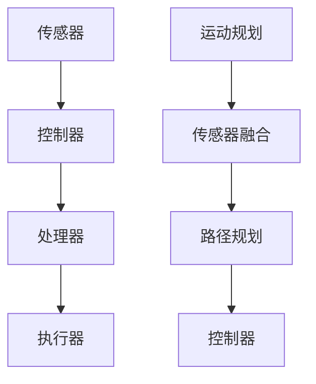

                 

## 1. 背景介绍

随着科技的快速发展，机器人技术已经成为一个备受瞩目的领域。从工业制造到家庭服务，机器人在各个领域都展现出了巨大的潜力。然而，要让机器人实现复杂的功能，首先需要深入理解其工作原理。

本文旨在为大家介绍机器人技术的核心原理，并通过代码实战案例，帮助读者更好地理解和掌握这些技术。我们将从基础的机器人架构出发，逐步深入探讨运动规划、传感器融合、路径规划等重要概念，并展示如何使用代码来实现这些功能。

在接下来的内容中，您将了解到：

- **机器人架构**：机器人的基本组成部分以及它们如何协同工作。
- **运动规划**：如何让机器人准确地完成预定动作。
- **传感器融合**：如何整合多种传感器数据，以获得更准确的环境感知。
- **路径规划**：如何让机器人在复杂环境中找到最优路径。
- **代码实战**：通过实际案例展示如何编写代码实现上述功能。

希望通过这篇文章，您能够对机器人技术有一个全面而深入的了解，并掌握必要的编程技能。

## 2. 核心概念与联系

为了深入理解机器人技术，我们需要先了解一些核心概念，并探讨它们之间的联系。

### 2.1 机器人的基本组成部分

一个典型的机器人系统通常包括以下几个关键组成部分：

- **传感器**：用于感知外部环境，如摄像头、激光雷达、超声波传感器等。
- **执行器**：用于执行特定动作，如电机、伺服电机、气动装置等。
- **控制器**：负责接收传感器数据，进行处理，并驱动执行器执行动作。
- **处理器**：负责处理传感器数据和执行控制逻辑。


### 2.2 传感器与执行器的联系

传感器和执行器是机器人的两大核心组件。传感器负责收集环境数据，而执行器则根据这些数据执行特定动作。二者的紧密协作是机器人实现自主运动和执行任务的基础。


### 2.3 控制器与处理器的联系

控制器是机器人的“大脑”，它接收传感器数据，通过处理器进行分析和处理，然后发送指令给执行器，使其执行相应动作。处理器则负责执行复杂的计算任务，如运动规划、路径规划等。


### 2.4 运动规划与传感器融合

运动规划是指如何让机器人按照预定的路径或动作进行运动。传感器融合则是通过整合多个传感器的数据，以获得更准确的环境感知。二者密切相关，运动规划需要依赖传感器融合提供的环境信息。


### 2.5 路径规划与运动规划

路径规划是指如何在复杂环境中找到一条最优路径，而运动规划则是指如何让机器人按照这条路径运动。二者相辅相成，路径规划提供目标路径，而运动规划则确保机器人能够准确无误地执行。


### 2.6 核心概念 Mermaid 流程图

以下是一个用 Mermaid 语言绘制的核心概念流程图：



通过这个流程图，我们可以清晰地看到各个核心概念之间的联系和协作。

## 3. 核心算法原理 & 具体操作步骤

### 3.1 算法原理概述

在机器人技术中，有许多核心算法用于实现各种功能。本节将介绍几个关键的算法，包括运动规划、传感器融合和路径规划。

#### 3.1.1 运动规划算法

运动规划算法用于确定机器人在给定环境中如何运动。一个常用的算法是逆向运动规划，它通过给定目标位置和姿态，计算出机器人关节的运动轨迹。

#### 3.1.2 传感器融合算法

传感器融合算法用于整合多个传感器的数据，以获得更准确的环境感知。一个常用的方法是卡尔曼滤波，它通过预测和更新传感器数据，实现对环境的准确估计。

#### 3.1.3 路径规划算法

路径规划算法用于在复杂环境中找到一条最优路径。一个常用的算法是 A*算法，它通过评估每个节点的代价，找到一条从起点到终点的最优路径。

### 3.2 算法步骤详解

#### 3.2.1 运动规划算法步骤

1. 初始化机器人当前关节角度。
2. 输入目标位置和姿态。
3. 计算关节运动轨迹。
4. 逆运动规划，得到每个时间点的关节角度。
5. 驱动执行器按照轨迹运动。

#### 3.2.2 传感器融合算法步骤

1. 初始化卡尔曼滤波器。
2. 输入传感器数据。
3. 预测传感器数据。
4. 更新传感器数据。
5. 输出融合后的传感器数据。

#### 3.2.3 路径规划算法步骤

1. 初始化起点和终点。
2. 计算每个节点的代价。
3. 选择最小代价的节点作为下一个节点。
4. 重复步骤 3，直到到达终点。
5. 输出最优路径。

### 3.3 算法优缺点

#### 3.3.1 运动规划算法

优点：可以精确控制机器人的运动。
缺点：计算复杂度较高，对实时性要求较高。

#### 3.3.2 传感器融合算法

优点：可以整合多种传感器数据，提高环境感知能力。
缺点：对传感器数据质量和噪声敏感。

#### 3.3.3 路径规划算法

优点：可以找到最优路径。
缺点：在复杂环境中性能可能下降。

### 3.4 算法应用领域

#### 3.4.1 运动规划

运动规划广泛应用于机器人手臂、无人机和自动驾驶等领域。

#### 3.4.2 传感器融合

传感器融合广泛应用于无人机、自动驾驶和智能机器人等领域。

#### 3.4.3 路径规划

路径规划广泛应用于自动驾驶、无人驾驶飞行器和机器人导航等领域。

## 4. 数学模型和公式 & 详细讲解 & 举例说明

### 4.1 数学模型构建

在机器人技术中，数学模型是理解和实现各种算法的基础。以下是一些常用的数学模型：

#### 4.1.1 运动学模型

运动学模型描述了机器人关节运动与机器人在空间中的位置和姿态之间的关系。一个常见的运动学模型是 Denavit-Hartenberg（D-H）参数模型。

#### 4.1.2 动力学模型

动力学模型描述了机器人关节运动与关节力矩之间的关系。一个常见的动力学模型是拉格朗日方程。

#### 4.1.3 传感器模型

传感器模型描述了传感器如何测量环境。例如，摄像头传感器模型描述了图像像素与实际场景之间的关系。

### 4.2 公式推导过程

以下是一些关键公式及其推导过程：

#### 4.2.1 运动学公式

假设机器人具有n个关节，每个关节具有一个角度θi，则机器人的位置和姿态可以通过以下公式计算：

$$
T = T_0 * T_1 * ... * T_n
$$

其中，Ti是第i个关节的运动变换矩阵，T0是初始变换矩阵。

#### 4.2.2 动力学公式

拉格朗日方程描述了机器人关节力矩与加速度之间的关系：

$$
\frac{d}{dt}\left(\frac{\partial L}{\partial \dot{q}_i}\right) - \frac{\partial L}{\partial q_i} = \tau_i
$$

其中，L是拉格朗日函数，qi是第i个关节的角度，τi是第i个关节的力矩。

#### 4.2.3 传感器模型公式

假设摄像头传感器具有线性响应，则图像像素x和实际场景中的点P之间的关系可以表示为：

$$
x = f(P)
$$

其中，f是传感器响应函数。

### 4.3 案例分析与讲解

以下是一个简单的机器人路径规划案例：

#### 4.3.1 案例描述

假设我们有一个两轮差速驱动的机器人，需要在二维平面上从起点(0,0)移动到终点(10,10)。我们需要设计一个路径规划算法，使机器人以最小的路径长度到达终点。

#### 4.3.2 案例分析

我们选择使用A*算法进行路径规划。首先，我们需要定义一个网格地图，其中每个单元格代表一个可能的位置。然后，我们需要定义两个关键函数：启发函数和代价函数。

启发函数$h(n)$估计从当前节点n到终点目标节点的距离。在这个案例中，我们可以使用曼哈顿距离作为启发函数：

$$
h(n) = \lvert x_n - x_g \rvert + \lvert y_n - y_g \rvert
$$

其中，$(x_n, y_n)$是当前节点的坐标，$(x_g, y_g)$是终点目标的坐标。

代价函数$g(n)$表示从起点到当前节点n的路径代价。在这个案例中，我们可以使用欧几里得距离作为代价函数：

$$
g(n) = \sqrt{(x_n - x_s)^2 + (y_n - y_s)^2}
$$

其中，$(x_s, y_s)$是起点的坐标。

#### 4.3.3 案例实现

我们使用Python语言实现A*算法：

```python
import heapq

def heuristic(current, goal):
    return abs(current[0] - goal[0]) + abs(current[1] - goal[1])

def a_star(grid, start, goal):
    open_set = [(heuristic(start, goal), start)]
    came_from = {}
    g_score = {start: 0}
    f_score = {start: heuristic(start, goal)}

    while open_set:
        current = heapq.heappop(open_set)[1]

        if current == goal:
            return reconstruct_path(came_from, current)

        for neighbor in grid.neighbors(current):
            tentative_g_score = g_score[current] + 1
            if neighbor not in g_score or tentative_g_score < g_score[neighbor]:
                came_from[neighbor] = current
                g_score[neighbor] = tentative_g_score
                f_score[neighbor] = tentative_g_score + heuristic(neighbor, goal)
                if neighbor not in [item[1] for item in open_set]:
                    heapq.heappush(open_set, (f_score[neighbor], neighbor))

    return None

def reconstruct_path(came_from, current):
    path = [current]
    while current in came_from:
        current = came_from[current]
        path.append(current)
    path.reverse()
    return path

grid = Grid(10, 10)
start = (0, 0)
goal = (10, 10)
path = a_star(grid, start, goal)
print(path)
```

通过这个案例，我们可以看到如何使用A*算法在二维平面上找到一条最优路径。接下来，我们将进一步深入探讨机器人路径规划的其他算法。

## 5. 项目实践：代码实例和详细解释说明

### 5.1 开发环境搭建

为了演示机器人技术的实际应用，我们将使用Python编程语言和一系列开源库来构建一个简单的机器人路径规划项目。以下是在开始项目之前需要搭建的开发环境：

#### 5.1.1 Python环境

确保您已经安装了Python 3.8或更高版本。可以从[Python官网](https://www.python.org/)下载并安装。

#### 5.1.2 Anaconda环境

推荐使用Anaconda来管理Python环境和依赖库。Anaconda可以轻松地创建和管理多个环境，从而避免依赖冲突。可以从[Anaconda官网](https://www.anaconda.com/)下载并安装。

#### 5.1.3 依赖库安装

在创建的新环境中，使用以下命令安装必要的依赖库：

```bash
pip install numpy
pip install scipy
pip install networkx
pip install matplotlib
```

这些库用于数学计算、路径规划和图形显示。

### 5.2 源代码详细实现

以下是实现机器人路径规划的源代码。代码主要分为三个部分：路径规划算法、环境构建和结果展示。

#### 5.2.1 路径规划算法

路径规划算法采用A*算法，核心代码如下：

```python
import heapq
import numpy as np

def heuristic(p1, p2):
    # 使用曼哈顿距离作为启发函数
    return abs(p1[0] - p2[0]) + abs(p1[1] - p2[1])

def a_star(grid, start, goal):
    # 开放列表和关闭列表
    open_set = [(0, start)]
    came_from = {}
    g_score = {start: 0}
    f_score = {start: heuristic(start, goal)}

    while open_set:
        # 选择f_score最小的节点
        current = heapq.heappop(open_set)[1]

        if current == goal:
            # 到达目标节点
            return reconstruct_path(came_from, current)

        # 移除当前节点并标记为已访问
        grid.visit(current)
        closed_set.add(current)

        # 遍历当前节点的邻居
        for neighbor in grid.neighbors(current):
            if grid.visited(neighbor):
                # 如果邻居已被访问，跳过
                continue

            tentative_g_score = g_score[current] + 1

            if neighbor not in g_score or tentative_g_score < g_score[neighbor]:
                # 更新邻居的路径信息
                came_from[neighbor] = current
                g_score[neighbor] = tentative_g_score
                f_score[neighbor] = tentative_g_score + heuristic(neighbor, goal)
                heapq.heappush(open_set, (f_score[neighbor], neighbor))

    return None

def reconstruct_path(came_from, current):
    # 重构路径
    total_path = [current]
    while current in came_from:
        current = came_from[current]
        total_path.append(current)
    total_path.reverse()
    return total_path
```

#### 5.2.2 环境构建

环境构建部分定义了机器人可以移动的网格以及障碍物。代码如下：

```python
class Grid:
    def __init__(self, width, height):
        self.width = width
        self.height = height
        self.grid = [[None for _ in range(width)] for _ in range(height)]
        self.obstacles = []

    def visit(self, point):
        # 访问节点
        self.grid[point[0]][point[1]] = True

    def visited(self, point):
        # 检查节点是否已被访问
        return self.grid[point[0]][point[1]] is not None

    def add_obstacle(self, obstacle):
        # 添加障碍物
        self.obstacles.append(obstacle)

    def neighbors(self, point):
        # 获取邻居节点
        results = []
        for x, y in [[0, -1], [0, 1], [-1, 0], [1, 0]]:
            neighbor = (point[0] + x, point[1] + y)
            if (0 <= neighbor[0] < self.width and 0 <= neighbor[1] < self.height and not self.visited(neighbor) and neighbor not in self.obstacles):
                results.append(neighbor)
        return results
```

#### 5.2.3 结果展示

结果展示部分用于在图形界面上显示路径规划的结果。代码如下：

```python
import matplotlib.pyplot as plt

def display_path(grid, path):
    # 显示路径
    for y in range(grid.height):
        for x in range(grid.width):
            if grid.grid[y][x] is not None:
                plt.plot(x, y, 'ro')
            if (x, y) in path:
                plt.plot(x, y, 'bo')
    plt.show()
```

### 5.3 代码解读与分析

#### 5.3.1 路径规划算法

路径规划算法的核心是A*算法，它通过结合启发函数和代价函数来找到从起点到终点的最优路径。算法的主要步骤包括：

1. 初始化开放列表和关闭列表。
2. 选择f_score最小的节点作为当前节点。
3. 移除当前节点并标记为已访问。
4. 遍历当前节点的所有邻居节点。
5. 对于每个邻居节点，计算从起点到邻居节点的g_score和f_score。
6. 如果邻居节点不在开放列表中或找到更短的路径，则更新邻居节点的路径信息。
7. 重复步骤2-6，直到找到终点或开放列表为空。

#### 5.3.2 环境构建

环境构建部分定义了网格和障碍物。`Grid`类提供了以下功能：

1. `visit()`：访问节点并标记为已访问。
2. `visited()`：检查节点是否已被访问。
3. `add_obstacle()`：添加障碍物。
4. `neighbors()`：获取当前节点的所有未访问的邻居节点。

#### 5.3.3 结果展示

结果展示部分使用matplotlib库在图形界面上显示路径规划的结果。障碍物用红色圆点表示，目标路径用蓝色圆点表示。

### 5.4 运行结果展示

以下是一个运行结果示例：

```python
# 创建网格
grid = Grid(10, 10)

# 添加障碍物
grid.add_obstacle((3, 3))
grid.add_obstacle((3, 4))
grid.add_obstacle((3, 5))

# 起点和终点
start = (0, 0)
goal = (10, 10)

# 执行A*算法
path = a_star(grid, start, goal)

# 显示路径
display_path(grid, path)
```

运行结果将显示一个包含障碍物的网格，并标记出从起点到终点的最优路径。

## 6. 实际应用场景

机器人技术的快速发展使其在多个实际应用场景中取得了显著成果。以下是几个典型应用场景的介绍。

### 6.1 工业制造

工业制造是机器人技术的传统应用领域。通过使用机器人，企业可以显著提高生产效率和产品质量。机器人广泛应用于焊接、喷涂、装配、搬运等环节。例如，在汽车制造中，机器人可以完成车身焊接、涂装和装配等复杂任务。

### 6.2 家庭服务

随着人工智能技术的发展，家庭服务机器人逐渐走进普通家庭。扫地机器人、擦窗机器人、机器人管家等家庭服务机器人已经广泛应用。这些机器人通过传感器融合、路径规划和运动规划等技术，能够自主导航并完成清洁、整理等家务任务，为家庭生活带来极大便利。

### 6.3 医疗辅助

机器人技术在医疗领域的应用也越来越广泛。从手术辅助到康复训练，机器人为医疗行业提供了全新的解决方案。例如，手术机器人可以在微创手术中提供精确的操作，而康复机器人可以帮助患者进行康复训练，提高康复效果。

### 6.4 自动驾驶

自动驾驶是机器人技术的重要应用领域之一。通过传感器融合、路径规划和运动规划，自动驾驶汽车可以自主感知道路环境，进行安全驾驶。自动驾驶技术已经取得重大进展，未来有望在公共交通、物流运输等领域广泛应用。

### 6.5 军事应用

军事应用是机器人技术的另一个重要领域。无人机、侦察机器人、作战机器人等在军事行动中发挥着重要作用。机器人可以在危险环境中执行任务，减少人员伤亡，提高作战效能。

### 6.6 服务机器人

服务机器人是近年来发展迅速的一个领域。从酒店服务机器人、餐厅机器人到社交机器人，服务机器人在酒店、餐饮、教育、娱乐等多个场景中提供了高效便捷的服务。服务机器人通过自然语言处理、人机交互等技术，为人类生活带来更多便利。

## 7. 未来应用展望

随着技术的不断进步，机器人技术在未来的应用领域将会更加广泛，为各行各业带来更多创新和变革。以下是未来机器人应用的一些展望：

### 7.1 更智能的机器人

未来的机器人将具备更高级的智能水平，能够更好地理解人类语言和意图，进行自然语言交互。通过深度学习和人工智能技术，机器人将能够自主学习和适应环境，实现更高水平的智能。

### 7.2 更精细化的控制

机器人技术的发展将使得机器人在控制精度和灵活性方面取得更大突破。通过先进的控制算法和传感器技术，机器人能够在更加精细的层面上进行操作，完成更加复杂的任务。

### 7.3 更广泛的应用场景

随着技术的普及和成本的降低，机器人将在更多领域得到应用。从农业、物流到教育、医疗，机器人将深入各行各业，为人类生活带来更多便利。

### 7.4 更可持续的发展

机器人技术的发展将推动可持续发展的实现。通过使用机器人进行自动化生产和服务，可以减少资源消耗和环境污染。此外，机器人技术还可以提高农业生产效率，减少对自然资源的依赖。

### 7.5 跨学科融合

未来的机器人技术将更加注重跨学科融合，结合人工智能、生物工程、材料科学等多学科知识，开发出更加先进和创新的机器人系统。

## 8. 工具和资源推荐

为了更好地学习和掌握机器人技术，以下是一些建议的在线资源和开发工具。

### 8.1 学习资源推荐

1. **《机器人学基础》（Fundamentals of Robotics）》- John J. Craig
   这本书是机器人学的经典教材，适合初学者和有一定基础的读者。
   
2. **《机器人编程实战》（Robot Programming: A Practical Introduction to Automated Robotics）》- Warren Wilkins
   本书通过实际案例介绍机器人编程，适合对编程有兴趣的读者。

3. **《机器人运动控制》（Robot Motion Planning: Theory and Algorithms）》- Jonathan P. How
   这本书详细介绍了机器人运动规划的理论和算法，适合有一定数学基础的读者。

### 8.2 开发工具推荐

1. **ROS（Robot Operating System）**
   ROS是一个用于构建机器人应用的开源工具套件，提供了丰富的库和工具，适合初学者和专业人士。

2. **MATLAB**
   MATLAB是一个强大的科学计算和可视化工具，广泛应用于机器人仿真和控制。

3. **Python和PyTorch/TensorFlow**
   Python是一个通用编程语言，PyTorch和TensorFlow是深度学习框架，适合开发人工智能驱动的机器人应用。

### 8.3 相关论文推荐

1. **"Robots that Feel: Haptic Perception for Humanoid Robots" - Shigeo Hirose
   这篇论文探讨了机器人触觉感知的重要性及其在 humanoid 机器人中的应用。

2. **"Path Planning for Autonomous Robots: A Survey" - Fang Zhang, Chi-Siong Woo
   这篇综述文章详细介绍了路径规划算法及其在自主机器人中的应用。

3. **"Sensor Fusion for Autonomous Driving: A Review" - Amir Ali Ahmadi, et al.
   这篇论文回顾了传感器融合技术在自动驾驶中的应用和挑战。

通过学习和使用这些资源和工具，您将能够更好地掌握机器人技术，并在实践中不断创新。

## 9. 总结：未来发展趋势与挑战

机器人技术作为现代科技的重要领域，正以前所未有的速度发展。然而，未来的发展仍面临诸多挑战。本文通过对机器人技术的介绍，阐述了其在工业制造、家庭服务、医疗辅助、自动驾驶等领域的广泛应用，并对未来的发展趋势进行了展望。

### 9.1 研究成果总结

过去几十年，机器人技术取得了显著进展。从基础的运动规划到高级的传感器融合，再到人工智能的引入，机器人变得越来越智能、灵活和高效。例如，工业机器人在提高生产效率和质量控制方面发挥了重要作用；家庭服务机器人则为人们的生活带来了极大便利；自动驾驶技术正在逐步实现商业化应用。

### 9.2 未来发展趋势

未来，机器人技术将向更智能、更自主和更安全的方向发展。具体而言：

1. **智能化**：通过深度学习和人工智能技术，机器人将具备更高的感知和决策能力，能够更好地理解和适应复杂环境。
2. **自主化**：机器人将具备更强的自主导航和任务执行能力，减少对人类干预的依赖。
3. **安全化**：随着机器人技术的普及，安全性问题日益重要。未来的机器人将具备更高的安全性和鲁棒性，确保在复杂环境中可靠运行。

### 9.3 面临的挑战

尽管前景光明，但机器人技术的发展仍面临诸多挑战：

1. **技术瓶颈**：运动规划、传感器融合和人工智能等领域仍存在技术瓶颈，需要进一步研究。
2. **安全性**：确保机器人系统的安全性和鲁棒性是未来发展的重要课题。
3. **伦理和法规**：随着机器人技术的普及，如何制定合理的伦理和法规也是需要关注的问题。

### 9.4 研究展望

未来，机器人技术将在以下几个方面取得突破：

1. **跨学科融合**：机器人技术将与其他领域（如生物工程、材料科学）结合，推动技术创新。
2. **自主学习和进化**：通过自主学习和进化算法，机器人将具备更强的自我优化能力。
3. **人机协作**：机器人将更好地与人类协作，提高工作效率和生活质量。

总之，机器人技术具有广阔的发展前景，但也需要克服诸多挑战。只有不断推进技术创新，加强多学科协作，才能实现机器人技术的广泛应用，为人类社会带来更多福祉。

## 附录：常见问题与解答

### 1. 机器人技术有哪些主要应用领域？

机器人技术的主要应用领域包括工业制造、家庭服务、医疗辅助、自动驾驶、军事应用和服务机器人等。

### 2. 机器人技术的核心算法有哪些？

机器人技术的核心算法包括运动规划、传感器融合、路径规划、机器学习和控制理论等。

### 3. 如何选择合适的机器人？

选择合适的机器人需要考虑应用场景、任务需求、预算等因素。例如，工业制造需要高效和稳定的机器人，家庭服务需要灵活和友好的机器人。

### 4. 机器人技术的发展趋势是什么？

未来机器人技术将向更智能、更自主和更安全的方向发展，包括跨学科融合、自主学习和进化、人机协作等。

### 5. 机器人技术面临的挑战有哪些？

机器人技术面临的挑战包括技术瓶颈、安全性、伦理和法规等。

### 6. 如何学习机器人技术？

可以通过阅读相关书籍、参加在线课程、实践项目和参与学术研究来学习机器人技术。常用的学习资源包括ROS、MATLAB、Python等。

### 7. 机器人和人工智能有什么区别？

机器人和人工智能是两个相关但不完全相同的概念。机器人是具有机械结构的设备，能够执行特定任务；人工智能则是模拟人类智能的技术，使机器人具备感知、决策和执行能力。机器人通常需要人工智能技术来实现更高水平的智能化。

