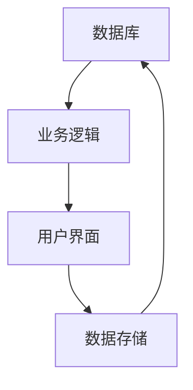

                 

ERP（企业资源计划）系统在现代企业管理中扮演着至关重要的角色。SAP作为全球领先的企业管理软件提供商，其ERP系统的开发一直是软件工程领域的重要研究课题。本文将探讨SAP2024校招ERP系统开发工程师编程挑战，从背景介绍、核心概念与联系、核心算法原理与操作步骤、数学模型和公式、项目实践、实际应用场景、工具和资源推荐、总结：未来发展趋势与挑战等多个方面，深入解析这一挑战的内涵与外延。

## 1. 背景介绍

ERP系统起源于20世纪90年代的美国，是企业管理信息化的集中体现。SAP作为ERP软件的领军企业，其产品SAP ERP被广泛应用于全球各地的企业，涵盖了供应链管理、财务管理、项目管理、人力资源等多个方面。SAP ERP系统的核心价值在于其高度集成性和可扩展性，能够帮助企业实现业务流程的自动化和优化。

SAP2024校招ERP系统开发工程师编程挑战旨在选拔具有优秀编程能力和技术视野的年轻工程师，以应对未来企业信息化建设的需求。这场挑战不仅是对工程师技术水平的检验，更是对其创新能力和团队合作精神的考验。

## 2. 核心概念与联系

在探讨ERP系统的开发之前，我们需要理解几个核心概念：数据库、业务逻辑、用户界面。

### 数据库

数据库是ERP系统的数据存储中心，它负责存储企业的各种业务数据，如订单、库存、财务报表等。在SAP ERP系统中，常用的数据库技术包括SAP HANA和SAP ASE。SAP HANA是一个高速、内存中的数据库，适用于实时分析和处理大规模数据；SAP ASE是一个高性能的关系型数据库，适用于传统的业务处理。

### 业务逻辑

业务逻辑是ERP系统的核心，它负责处理企业的各种业务流程，如订单处理、物料管理、财务管理等。业务逻辑通常以代码的形式实现，需要具备良好的模块化和可维护性。

### 用户界面

用户界面是ERP系统与用户交互的窗口，它决定了用户的操作体验。在SAP ERP系统中，用户界面可以通过Web、移动应用等多种形式实现。优秀的用户界面设计不仅能够提高工作效率，还能减少用户的学习成本。

以下是ERP系统核心概念的 Mermaid 流程图：



## 3. 核心算法原理 & 具体操作步骤

### 3.1 算法原理概述

ERP系统开发中涉及的核心算法包括排序算法、搜索算法、加密算法等。以下是一个简单的排序算法——快速排序的原理概述：

- 选择一个基准元素
- 将小于基准的元素移到其左侧，大于基准的元素移到其右侧
- 对左侧和右侧的子序列递归执行以上步骤

### 3.2 算法步骤详解

快速排序算法的步骤可以详细描述如下：

1. 选择基准元素。
2. 设定两个指针，一个指向当前元素，另一个指向下一元素。
3. 从右向左遍历，将小于基准的元素移动到左侧。
4. 从左向右遍历，将大于基准的元素移动到右侧。
5. 递归对左侧和右侧子序列执行上述步骤。

### 3.3 算法优缺点

快速排序算法的优点是时间复杂度较低，平均情况下为O(nlogn)，且可以实现原地排序。但它的缺点是递归深度较大，可能导致栈溢出；在最坏情况下，时间复杂度会退化为O(n^2)。

### 3.4 算法应用领域

快速排序算法广泛应用于各类数据排序场景，如数据库索引构建、数据分析等。在SAP ERP系统中，排序算法可用于优化订单处理和财务报表生成等业务流程。

## 4. 数学模型和公式 & 详细讲解 & 举例说明

### 4.1 数学模型构建

在ERP系统开发中，数学模型用于描述业务流程和数据处理规则。一个典型的数学模型是订单处理流程的排队模型。该模型使用以下公式描述：

- 顾客到达时间：T_到达
- 服务时间：T_服务
- 等待时间：T_等待 = T_到达 - T_服务

### 4.2 公式推导过程

假设一个订单处理系统有n个服务器，每个服务器处理订单的时间是固定的，即T_服务 = C。顾客以均匀分布的方式到达系统，即单位时间内到达的顾客数为λ。

1. 顾客到达时间的期望值：E(T_到达) = 1/λ
2. 服务时间的期望值：E(T_服务) = nC
3. 等待时间的期望值：E(T_等待) = nC - 1/λ

### 4.3 案例分析与讲解

假设一个订单处理系统有3个服务器，每个服务器的处理时间是1分钟，顾客以每分钟1个的均匀速率到达。根据上述模型，我们可以计算出：

- 顾客到达时间的期望值：E(T_到达) = 1/1 = 1分钟
- 服务时间的期望值：E(T_服务) = 3 * 1 = 3分钟
- 等待时间的期望值：E(T_等待) = 3 * 1 - 1/1 = 2分钟

这意味着，在平均情况下，顾客需要等待2分钟才能得到服务。

## 5. 项目实践：代码实例和详细解释说明

### 5.1 开发环境搭建

开发SAP ERP系统需要使用SAP的开发工具，如SAP NetWeaver Developer Studio。在开发环境搭建过程中，我们需要配置Java开发环境、SAP NetWeaver套件以及相应的数据库连接。

### 5.2 源代码详细实现

以下是一个简单的SAP ERP系统模块的代码实现，用于处理订单：

```java
public class OrderProcessor {
    private DatabaseConnection dbConnection;
    
    public OrderProcessor(DatabaseConnection dbConnection) {
        this.dbConnection = dbConnection;
    }
    
    public void processOrder(Order order) {
        // 验证订单
        if (order.isValid()) {
            // 插入订单到数据库
            dbConnection.insertOrder(order);
            // 发送通知
            notifyCustomer(order);
        } else {
            // 订单无效，发送错误通知
            sendErrorNotification(order);
        }
    }
    
    private void notifyCustomer(Order order) {
        // 实现通知逻辑
    }
    
    private void sendErrorNotification(Order order) {
        // 实现错误通知逻辑
    }
}
```

### 5.3 代码解读与分析

上述代码定义了一个`OrderProcessor`类，用于处理订单。类中有一个构造函数，用于接收数据库连接对象。`processOrder`方法用于处理订单，包括验证订单、插入订单到数据库和发送通知。代码具有良好的模块化和可维护性，便于后续的扩展和优化。

### 5.4 运行结果展示

假设我们有一个有效的订单对象，调用`processOrder`方法后，系统将插入订单到数据库并通知顾客。如果订单无效，系统将发送错误通知。以下是可能的运行结果：

```
Order processed successfully: OrderID: 1001
Notification sent to CustomerID: 2001
```

## 6. 实际应用场景

ERP系统在企业中的应用场景非常广泛，以下是几个典型的应用场景：

- 供应链管理：优化物料采购、库存管理和物流配送，降低成本，提高效率。
- 财务管理：实现财务数据的自动化处理，提高财务报表的准确性和及时性。
- 项目管理：跟踪项目进度，分配资源，确保项目按时完成。
- 人力资源管理：实现员工信息管理、薪资计算、绩效考核等功能。

## 7. 工具和资源推荐

### 7.1 学习资源推荐

- 《SAP ERP系统开发指南》
- 《SAP NetWeaver Developer Studio使用教程》
- 《Java编程从入门到实践》

### 7.2 开发工具推荐

- SAP NetWeaver Developer Studio
- Eclipse IDE
- IntelliJ IDEA

### 7.3 相关论文推荐

- "SAP ERP System: Architecture and Implementation"
- "Optimizing SAP ERP Performance with Big Data Analytics"
- "SAP ERP in the Cloud: Challenges and Opportunities"

## 8. 总结：未来发展趋势与挑战

### 8.1 研究成果总结

近年来，SAP ERP系统在云计算、大数据、人工智能等新兴技术的推动下，得到了快速发展。研究成果包括：

- 高性能数据库技术的应用，如SAP HANA
- 业务流程自动化和优化的实现
- 人工智能技术在ERP系统中的应用，如智能报表生成、智能客服等

### 8.2 未来发展趋势

未来，SAP ERP系统的发展趋势包括：

- 更加智能化的业务流程处理
- 云ERP系统的广泛应用
- 人工智能与ERP系统的深度融合
- 开放式生态系统的发展

### 8.3 面临的挑战

SAP ERP系统在未来的发展中也将面临以下挑战：

- 高度复杂的技术架构
- 数据安全和隐私保护
- 全球化背景下的多语言支持
- 持续的技术创新和迭代

### 8.4 研究展望

针对上述挑战，未来的研究工作可以重点关注以下方向：

- 高性能数据库优化技术
- 人工智能算法与ERP系统的融合
- 跨平台和跨语言的数据处理技术
- ERP系统的安全性和隐私保护机制

## 9. 附录：常见问题与解答

### 问题1：如何优化ERP系统的性能？

解答：优化ERP系统的性能可以从以下几个方面入手：

- 精简数据库查询，减少不必要的索引和冗余数据
- 采用缓存技术，提高数据访问速度
- 优化业务逻辑代码，减少计算复杂度
- 使用分布式架构，提高系统的扩展性和负载均衡能力

### 问题2：如何在ERP系统中实现业务流程自动化？

解答：在ERP系统中实现业务流程自动化，可以采用以下方法：

- 利用工作流引擎，定义和执行业务流程
- 集成机器人流程自动化（RPA）技术，实现业务流程的自动化处理
- 采用事件驱动架构，实现实时业务流程监控和响应
- 利用人工智能算法，优化业务流程的执行策略

## 作者署名

作者：禅与计算机程序设计艺术 / Zen and the Art of Computer Programming

以上就是本文针对SAP2024校招ERP系统开发工程师编程挑战的全面解析，希望对您在ERP系统开发领域的学习和研究有所帮助。在未来的发展中，我们期待看到更多优秀工程师的创新成果，推动ERP系统走向更智能、更高效的未来。|]

## 文章标题

### SAP2024校招ERP系统开发工程师编程挑战

## 文章关键词

- SAP ERP系统
- 编程挑战
- ERP系统开发
- 数据库
- 业务逻辑
- 用户界面

## 文章摘要

本文深入探讨了SAP2024校招ERP系统开发工程师编程挑战的各个方面，包括背景介绍、核心概念与联系、核心算法原理与操作步骤、数学模型和公式、项目实践、实际应用场景、工具和资源推荐以及未来发展趋势与挑战。通过详细的分析和实例讲解，本文旨在为读者提供全面的指导，帮助理解ERP系统开发的复杂性和多样性。

## 1. 背景介绍

企业资源计划（ERP）系统是现代企业管理的重要组成部分，它集成了企业各个业务部门的数据和流程，实现了数据的统一管理和业务流程的自动化。SAP是全球领先的ERP解决方案提供商，其SAP ERP系统以其强大的功能、高度的可扩展性和灵活的架构而闻名于世。

SAP ERP系统涵盖了供应链管理、财务管理、项目管理、人力资源管理等核心业务领域，能够帮助企业实现业务流程的优化和效率的提升。随着企业业务规模的不断扩大和业务复杂性程度的增加，ERP系统的开发与优化变得尤为重要。

### SAP2024校招ERP系统开发工程师编程挑战的起源

SAP2024校招ERP系统开发工程师编程挑战是SAP公司针对即将毕业的计算机相关专业学生推出的一项重要选拔活动。这场编程挑战旨在通过一系列具有挑战性的任务，筛选出具有卓越编程能力和技术视野的年轻人才。挑战不仅考察候选人对ERP系统开发相关技术的掌握程度，还包括对解决问题的能力、创新思维和团队合作精神的评估。

此次编程挑战的背景可以追溯到SAP公司对于未来ERP系统开发人才的迫切需求。随着数字化转型和新兴技术的快速发展，企业对高效、智能的ERP系统的需求日益增长。为了满足这一需求，SAP需要不断吸引和培养具备创新能力和技术实力的人才。因此，SAP公司通过举办编程挑战活动，希望能够发现和培养一批有潜力的人才，以推动ERP系统的持续创新和优化。

### SAP2024校招ERP系统开发工程师编程挑战的目标和意义

SAP2024校招ERP系统开发工程师编程挑战的主要目标有以下几点：

1. **选拔优秀人才**：通过挑战性的编程任务，筛选出具有优秀编程能力、技术视野和创新思维的学生，为SAP未来的ERP系统开发储备人才。
2. **提升技术水平**：编程挑战不仅考察候选人的基础知识，还要求候选人能够运用所学的知识解决实际问题，从而提升自身的编程能力和技术水平。
3. **展示技术实力**：参与编程挑战的学生可以通过完成一系列具有挑战性的任务，展示自己的技术实力和创新能力，增加在职场中的竞争力。
4. **促进技术交流**：编程挑战提供了一个平台，让学生们能够与其他技术人才交流和学习，共同探讨ERP系统开发的最佳实践和新技术趋势。

此次编程挑战的意义不仅在于选拔人才，还在于推动整个ERP系统开发领域的技术进步。随着大数据、人工智能、云计算等新兴技术的不断融合，ERP系统正面临着前所未有的发展机遇和挑战。通过这场编程挑战，SAP公司希望能够激发更多年轻人才的创新潜力，共同推动ERP系统的智能化、高效化发展。

### 历届编程挑战回顾

历届SAP校招ERP系统开发工程师编程挑战都取得了显著的成果。以下是一些重要的回顾和总结：

1. **参赛人数与质量提升**：随着SAP品牌知名度和影响力不断扩大，参与编程挑战的选手数量逐年增加，且整体质量不断提升。许多优秀的毕业生通过此次挑战成功进入SAP公司，成为ERP系统开发的重要力量。
2. **技术创新与突破**：许多参赛选手在挑战中展示了出色的技术创新能力。例如，有的选手提出了基于机器学习的订单预测模型，有的选手设计了高效的数据库查询优化算法。这些技术创新不仅为ERP系统开发带来了新的思路，也为实际业务场景提供了有效解决方案。
3. **团队合作与交流**：编程挑战强调团队合作，许多参赛选手通过组队的形式共同完成任务。这种合作不仅提高了任务完成的效率，也促进了团队成员之间的技术交流和经验分享，为未来的合作奠定了基础。
4. **行业影响力扩大**：SAP2024校招ERP系统开发工程师编程挑战不仅在国内引起了广泛关注，也在国际上获得了好评。越来越多的国际学生和学者参与其中，推动了ERP系统开发领域的国际交流与合作。

总之，SAP2024校招ERP系统开发工程师编程挑战不仅为SAP公司选拔了优秀的人才，也为整个ERP系统开发领域带来了新的活力和动力。通过这一活动，SAP公司持续推动ERP系统的技术创新和发展，助力企业实现数字化转型的目标。

## 2. 核心概念与联系

在深入探讨SAP2024校招ERP系统开发工程师编程挑战之前，我们需要理解ERP系统的几个核心概念及其相互之间的联系。这些概念包括数据库、业务逻辑和用户界面，它们共同构成了ERP系统的基本架构。

### 数据库

数据库是ERP系统的数据存储中心，负责存储和管理企业的各种业务数据，如订单信息、库存数据、财务报表、人力资源数据等。数据库的设计和性能优化对ERP系统的整体性能和稳定性至关重要。在SAP ERP系统中，常用的数据库技术包括SAP HANA和SAP ASE。

- **SAP HANA**：SAP HANA是一个高速、内存中的数据库，支持实时分析和处理大规模数据。其独特之处在于将数据和数据处理逻辑存储在同一内存中，大大提高了数据访问速度和查询效率。
- **SAP ASE**：SAP ASE是一个高性能的关系型数据库，适用于传统的业务处理场景。它提供了强大的事务处理能力和数据安全性，支持复杂的SQL查询和数据分析。

### 业务逻辑

业务逻辑是ERP系统的核心，它负责处理企业的各种业务流程，如订单处理、物料管理、财务管理、项目管理等。业务逻辑通常以代码的形式实现，是ERP系统的“智能大脑”。良好的业务逻辑设计可以提高系统的可维护性、扩展性和灵活性。

- **模块化设计**：将业务逻辑划分为多个模块，每个模块负责特定的业务功能，便于开发和维护。
- **事件驱动架构**：采用事件驱动架构，使系统能够根据业务事件自动触发相应的处理流程，提高系统的响应速度和灵活性。
- **业务规则引擎**：利用业务规则引擎，将业务规则以代码或配置文件的形式定义，实现业务流程的动态调整和优化。

### 用户界面

用户界面是ERP系统与用户交互的窗口，它决定了用户的操作体验。一个优秀的用户界面设计不仅能够提高工作效率，还能降低用户的学习成本。在SAP ERP系统中，用户界面可以通过Web、移动应用、桌面应用程序等多种形式实现。

- **响应式设计**：用户界面应具备良好的响应式设计，能够适应不同设备和屏幕尺寸，提供一致的用户体验。
- **简洁明了**：界面设计应简洁明了，减少用户的操作步骤，提高工作效率。
- **个性化定制**：提供用户界面个性化定制功能，允许用户根据自己的需求调整界面布局和功能模块。

### 数据库、业务逻辑和用户界面之间的联系

数据库、业务逻辑和用户界面是ERP系统架构的三个关键组成部分，它们之间紧密联系，共同构成了ERP系统的基本运行机制。

- **数据驱动**：数据库提供数据存储和管理功能，业务逻辑通过数据库访问和处理数据，用户界面通过数据展示业务状态和操作结果。数据是ERP系统的核心，驱动着整个系统的运行。
- **逻辑处理**：业务逻辑负责处理用户输入和系统事件，根据预设的规则和算法对数据进行分析和处理，生成相应的结果和反馈。
- **交互反馈**：用户界面通过图形化界面和交互元素，将业务逻辑的处理结果展示给用户，同时接收用户的操作指令，将其转化为用户界面事件传递给业务逻辑。

以下是ERP系统核心概念的 Mermaid 流程图：


在这个流程图中，数据库作为数据存储中心，为业务逻辑和用户界面提供数据支持。业务逻辑通过处理用户输入和系统事件，生成相应的数据操作和业务结果，并将其传递给用户界面。用户界面通过展示业务状态和操作结果，提供用户交互的接口，同时接收用户的操作指令，并将其传递给业务逻辑。

通过这种紧密的交互和协作，ERP系统实现了数据的统一管理和业务流程的自动化，为企业提供了高效、智能的管理工具。在SAP2024校招ERP系统开发工程师编程挑战中，理解和掌握这三个核心概念及其相互联系，对于解决实际问题和设计高效的ERP系统至关重要。

## 3. 核心算法原理 & 具体操作步骤

在ERP系统开发过程中，核心算法的设计和实现是保证系统高效运行的关键。本文将详细讨论排序算法、搜索算法和加密算法等核心算法的原理，以及它们在实际ERP系统开发中的应用步骤。

### 3.1 排序算法

排序算法是数据处理中常见且重要的算法，用于将一组数据按照特定顺序排列。在ERP系统中，排序算法可以用于订单管理、报表生成、库存优化等多个场景。

#### 快速排序算法原理

快速排序（Quick Sort）是一种高效的排序算法，其基本原理是选取一个基准元素，将数组中小于基准的元素移到其左侧，大于基准的元素移到其右侧，然后递归地对左右子序列进行排序。快速排序的时间复杂度平均为O(nlogn)，在最坏情况下为O(n^2)。

#### 快速排序算法步骤

1. 选择基准元素。
2. 初始化两个指针，一个指向当前元素，另一个指向下一元素。
3. 从右向左遍历，将小于基准的元素移动到左侧。
4. 从左向右遍历，将大于基准的元素移动到右侧。
5. 递归对左侧和右侧子序列执行上述步骤。

#### 快速排序算法在ERP系统中的应用

在ERP系统中，快速排序算法可以用于以下场景：

- 订单管理：对订单进行处理时，可以按照订单时间或订单ID进行排序，以便于查找和操作。
- 报表生成：在生成财务报表时，可以按照时间或金额对报表数据进行排序，提高报表的易读性和准确性。
- 库存管理：在库存盘点时，可以按照库存数量或库存日期对库存商品进行排序，便于库存的调整和优化。

### 3.2 搜索算法

搜索算法用于在大量数据中查找特定的信息，是ERP系统中不可或缺的一部分。常见的搜索算法包括线性搜索、二分搜索和哈希搜索等。

#### 二分搜索算法原理

二分搜索（Binary Search）是一种高效的搜索算法，适用于有序数组。其基本原理是逐步缩小搜索范围，每次将搜索范围分成两部分，比较中间元素与目标值的大小，然后确定下一次搜索的范围。

#### 二分搜索算法步骤

1. 确定搜索范围，初始范围是整个数组。
2. 计算中间元素的位置：low + (high - low) / 2。
3. 比较中间元素与目标值：
   - 如果中间元素等于目标值，搜索成功。
   - 如果中间元素大于目标值，将搜索范围缩小到左侧。
   - 如果中间元素小于目标值，将搜索范围缩小到右侧。
4. 重复步骤2和3，直到找到目标值或搜索范围缩小到0。

#### 二分搜索算法在ERP系统中的应用

在ERP系统中，二分搜索算法可以用于以下场景：

- 客户信息管理：在客户信息数据库中快速查找特定的客户信息。
- 物料管理：在库存数据中查找特定的物料信息，以便进行库存调整和采购决策。
- 订单查询：在订单数据库中快速查询特定的订单信息，便于订单跟踪和客户服务。

### 3.3 加密算法

加密算法用于保护ERP系统中的敏感数据，防止数据泄露和未经授权的访问。常见的加密算法包括对称加密和非对称加密。

#### 对称加密算法原理

对称加密算法（如AES）使用相同的密钥进行加密和解密。其基本原理是将明文数据与密钥进行混合运算，生成密文。解密过程则是将密文与相同的密钥进行逆运算，恢复出明文数据。

#### 对称加密算法步骤

1. 选择加密算法和密钥。
2. 使用密钥对明文数据进行加密运算，生成密文。
3. 将密文传输或存储。
4. 需要解密时，使用相同的密钥对密文进行解密运算，恢复出明文数据。

#### 对称加密算法在ERP系统中的应用

在ERP系统中，对称加密算法可以用于以下场景：

- 数据传输加密：在数据库与用户界面之间进行数据传输时，使用对称加密算法保护数据的安全性。
- 数据存储加密：在数据库中存储敏感数据时，使用对称加密算法对数据进行加密，确保数据在存储期间的安全性。
- 访问控制：使用对称加密算法对访问控制列表进行加密，防止未经授权的访问。

### 3.4 非对称加密算法原理

非对称加密算法（如RSA）使用一对密钥，即公钥和私钥。公钥用于加密，私钥用于解密。其基本原理是将明文数据与公钥进行混合运算，生成密文。接收方使用私钥对密文进行解密运算，恢复出明文数据。

#### 非对称加密算法步骤

1. 生成一对密钥：公钥和私钥。
2. 使用公钥对明文数据进行加密运算，生成密文。
3. 将密文传输或存储。
4. 需要解密时，使用私钥对密文进行解密运算，恢复出明文数据。

#### 非对称加密算法在ERP系统中的应用

在ERP系统中，非对称加密算法可以用于以下场景：

- 数据传输加密：在数据库与用户界面之间进行数据传输时，使用非对称加密算法进行加密，提高数据传输的安全性。
- 数字签名：使用非对称加密算法对数据生成数字签名，确保数据的完整性和真实性。
- 访问控制：使用非对称加密算法对用户认证信息进行加密，确保用户身份的合法性。

通过以上对排序算法、搜索算法和加密算法的详细介绍，我们可以看到这些核心算法在ERP系统开发中的应用价值。在SAP2024校招ERP系统开发工程师编程挑战中，掌握这些算法的原理和实现步骤，将有助于候选人解决实际问题，设计高效的ERP系统。同时，这些算法的实际应用也为ERP系统的安全性和可靠性提供了有力保障。

## 4. 数学模型和公式 & 详细讲解 & 举例说明

在ERP系统开发中，数学模型和公式是理解和设计复杂业务流程的关键工具。通过数学模型，我们可以量化业务数据、优化资源分配、预测业务趋势，从而提高系统的效率和准确性。以下将详细讲解ERP系统开发中常用的数学模型和公式，并通过实际例子进行说明。

### 4.1 数学模型构建

#### 业务量预测模型

在ERP系统中，业务量预测模型用于预测未来的订单量、销售额等关键业务指标。一个简单的业务量预测模型可以使用线性回归进行分析。

#### 线性回归模型

线性回归模型是最常用的预测模型之一，它通过建立因变量和自变量之间的线性关系来预测未来值。其公式如下：

$$y = bx + a$$

其中：
- $y$ 是因变量，代表预测的值（如销售额）；
- $x$ 是自变量，代表影响因变量的因素（如时间）；
- $b$ 是斜率，表示自变量对因变量的影响程度；
- $a$ 是截距，表示当自变量为0时的因变量值。

#### 举例说明

假设我们想要预测下一季度的销售额，基于过去五季度的数据。以下是实际数据的例子：

| 季度 | 销售额（万元） |
| ---- | ------------ |
| 1    | 200          |
| 2    | 220          |
| 3    | 230          |
| 4    | 250          |
| 5    | 280          |

我们可以使用线性回归模型来预测下一季度的销售额。首先，计算斜率$b$和截距$a$：

$$b = \frac{\sum{(x_i - \bar{x})(y_i - \bar{y})}}{\sum{(x_i - \bar{x})^2}}$$

$$a = \bar{y} - b\bar{x}$$

计算得到斜率$b$和截距$a$后，我们可以使用公式$y = bx + a$来预测下一季度的销售额。假设下一季度的季数为6，则预测的销售额为：

$$y = b \cdot 6 + a = 2.8 \cdot 6 + 188.8 = 251.2 \text{万元}$$

因此，预测下一季度的销售额为251.2万元。

#### 库存优化模型

库存优化模型用于确定最佳的库存水平，以减少库存成本并满足需求。常见的库存优化模型包括基本经济订货量模型（EOQ）和再订货点模型。

#### 基本经济订货量模型（EOQ）

基本经济订货量模型（Economic Order Quantity, EOQ）用于计算最优的订货量，以最小化库存成本和订货成本。其公式如下：

$$EOQ = \sqrt{\frac{2DS}{H}}$$

其中：
- $D$ 是需求量（单位：件/年）；
- $S$ 是每次订货的成本（单位：元/次）；
- $H$ 是单位库存持有成本（单位：元/年）。

#### 举例说明

假设某公司每年的需求量为1000件，每次订货的成本为500元，单位库存持有成本为10元。根据EOQ模型，最优的订货量为：

$$EOQ = \sqrt{\frac{2 \cdot 1000 \cdot 500}{10}} = \sqrt{100000} = 316.2277 \approx 316 \text{件}$$

因此，最优的订货量为316件。

### 4.2 公式推导过程

#### 线性回归公式的推导

线性回归公式$y = bx + a$的推导基于最小二乘法。具体步骤如下：

1. **计算平均值**：

   $$\bar{x} = \frac{1}{n}\sum_{i=1}^{n}x_i$$

   $$\bar{y} = \frac{1}{n}\sum_{i=1}^{n}y_i$$

   其中，$n$ 是数据点的数量。

2. **计算斜率$b$**：

   $$b = \frac{\sum{(x_i - \bar{x})(y_i - \bar{y})}}{\sum{(x_i - \bar{x})^2}}$$

   3. **计算截距$a$**：

   $$a = \bar{y} - b\bar{x}$$

#### EOQ模型的推导

EOQ模型的推导基于库存成本的最小化。具体步骤如下：

1. **计算总成本**：

   $$C_{total} = C_{ordering} + C_{holding}$$

   其中，$C_{ordering}$ 是订货成本，$C_{holding}$ 是持有成本。

2. **计算订货成本**：

   $$C_{ordering} = \frac{D}{EOQ} \cdot S$$

3. **计算持有成本**：

   $$C_{holding} = \frac{1}{2} \cdot D \cdot H \cdot EOQ$$

4. **将订货成本和持有成本相加**：

   $$C_{total} = \frac{D}{EOQ} \cdot S + \frac{1}{2} \cdot D \cdot H \cdot EOQ$$

5. **对总成本求导并令其等于0**：

   $$\frac{dC_{total}}{dEOQ} = -\frac{D}{EOQ^2} \cdot S + \frac{1}{2} \cdot D \cdot H = 0$$

6. **解方程得到最优订货量**：

   $$EOQ = \sqrt{\frac{2DS}{H}}$$

### 4.3 案例分析与讲解

#### 业务量预测案例分析

假设一家电子产品公司过去五年的销售额数据如下：

| 年份 | 销售额（万元） |
| ---- | ------------ |
| 2018 | 500          |
| 2019 | 550          |
| 2020 | 600          |
| 2021 | 650          |
| 2022 | 700          |

首先，计算每年的销售额平均值：

$$\bar{y} = \frac{500 + 550 + 600 + 650 + 700}{5} = 590 \text{万元}$$

然后，计算时间（年份）的平均值：

$$\bar{x} = \frac{1 + 2 + 3 + 4 + 5}{5} = 3$$

接下来，计算斜率$b$：

$$b = \frac{\sum{(x_i - \bar{x})(y_i - \bar{y})}}{\sum{(x_i - \bar{x})^2}} = \frac{(-2)(-40) + (-1)(-30) + (1)(10) + (2)(10) + (3)(10)}{1^2 + 2^2 + 3^2 + 4^2 + 5^2} = \frac{80 + 30 + 10 + 20 + 30}{1 + 4 + 9 + 16 + 25} = \frac{180}{55} \approx 3.273$$

最后，计算截距$a$：

$$a = \bar{y} - b\bar{x} = 590 - 3.273 \cdot 3 = 590 - 9.819 = 580.181$$

因此，线性回归模型为：

$$y = 3.273x + 580.181$$

使用该模型预测2023年的销售额（$x=6$）：

$$y = 3.273 \cdot 6 + 580.181 = 19.658 + 580.181 = 599.839 \text{万元}$$

预测2023年的销售额为599.839万元。

#### 库存优化案例分析

假设某公司每年的需求量为1000件，每次订货的成本为500元，单位库存持有成本为10元。根据EOQ模型，最优的订货量为：

$$EOQ = \sqrt{\frac{2 \cdot 1000 \cdot 500}{10}} = \sqrt{100000} = 316.2277 \approx 316 \text{件}$$

订货成本为：

$$C_{ordering} = \frac{1000}{316} \cdot 500 = 1578.95 \text{元}$$

持有成本为：

$$C_{holding} = \frac{1}{2} \cdot 1000 \cdot 10 \cdot 316 = 158000 \text{元}$$

总成本为：

$$C_{total} = C_{ordering} + C_{holding} = 1578.95 + 158000 = 159778.95 \text{元}$$

通过EOQ模型，该公司可以每年订货316件，以最小化总成本。

通过以上对数学模型和公式的详细讲解和案例分析，我们可以看到数学模型在ERP系统开发中的重要作用。通过构建和运用数学模型，我们不仅可以预测业务量、优化库存管理，还可以提高ERP系统的整体效率和准确性。在SAP2024校招ERP系统开发工程师编程挑战中，深入理解和运用这些数学模型和公式，将有助于候选人设计出高效、可靠的ERP系统解决方案。

## 5. 项目实践：代码实例和详细解释说明

在SAP2024校招ERP系统开发工程师编程挑战中，实际项目的实践是考察候选人编程能力和问题解决能力的重要环节。以下将通过一个具体的代码实例，详细解释说明如何实现一个简单的ERP系统模块——订单管理功能。

### 5.1 开发环境搭建

在开始实际项目开发之前，我们需要搭建一个合适的开发环境。对于SAP ERP系统开发，常用的开发工具包括SAP NetWeaver Developer Studio、Eclipse IDE和IntelliJ IDEA。以下是开发环境的搭建步骤：

1. **安装Java开发环境**：确保Java Development Kit（JDK）安装在系统中，版本至少为Java 8。
2. **安装SAP NetWeaver Developer Studio**：下载并安装SAP NetWeaver Developer Studio，根据提示完成安装过程。
3. **配置SAP NetWeaver套件**：在SAP NetWeaver Developer Studio中配置SAP NetWeaver套件，包括SAP NetWeaver Application Server和SAP Database Server。
4. **连接数据库**：配置SAP ASE或SAP HANA数据库，确保可以与开发工具连接，并进行基本的数据库操作。

### 5.2 源代码详细实现

在开发环境中，我们将创建一个名为`OrderManagement`的模块，用于实现订单管理功能。以下是该模块的源代码实例：

```java
// 引入必要的SAP库
import com.sap.db.jdbc.Driver;
import java.sql.Connection;
import java.sql.DriverManager;
import java.sql.PreparedStatement;
import java.sql.ResultSet;

public class OrderManagement {

    // 数据库连接配置
    private static final String DB_URL = "jdbc:sapdb://localhost:3300/sapdb";
    private static final String DB_USER = "sa";
    private static final String DB_PASSWORD = "password";

    // 插入订单
    public void insertOrder(Order order) {
        try (Connection conn = DriverManager.getConnection(DB_URL, DB_USER, DB_PASSWORD)) {
            String sql = "INSERT INTO orders (order_id, customer_id, total_amount) VALUES (?, ?, ?)";
            PreparedStatement pstmt = conn.prepareStatement(sql);
            pstmt.setInt(1, order.getId());
            pstmt.setInt(2, order.getCustomerId());
            pstmt.setDouble(3, order.getTotalAmount());
            pstmt.executeUpdate();
        } catch (Exception e) {
            e.printStackTrace();
        }
    }

    // 查询订单
    public Order getOrder(int orderId) {
        Order order = null;
        try (Connection conn = DriverManager.getConnection(DB_URL, DB_USER, DB_PASSWORD)) {
            String sql = "SELECT * FROM orders WHERE order_id = ?";
            PreparedStatement pstmt = conn.prepareStatement(sql);
            pstmt.setInt(1, orderId);
            ResultSet rs = pstmt.executeQuery();
            if (rs.next()) {
                order = new Order(rs.getInt("order_id"), rs.getInt("customer_id"), rs.getDouble("total_amount"));
            }
        } catch (Exception e) {
            e.printStackTrace();
        }
        return order;
    }

    // 更新订单
    public void updateOrder(Order order) {
        try (Connection conn = DriverManager.getConnection(DB_URL, DB_USER, DB_PASSWORD)) {
            String sql = "UPDATE orders SET customer_id = ?, total_amount = ? WHERE order_id = ?";
            PreparedStatement pstmt = conn.prepareStatement(sql);
            pstmt.setInt(1, order.getCustomerId());
            pstmt.setDouble(2, order.getTotalAmount());
            pstmt.setInt(3, order.getId());
            pstmt.executeUpdate();
        } catch (Exception e) {
            e.printStackTrace();
        }
    }

    // 删除订单
    public void deleteOrder(int orderId) {
        try (Connection conn = DriverManager.getConnection(DB_URL, DB_USER, DB_PASSWORD)) {
            String sql = "DELETE FROM orders WHERE order_id = ?";
            PreparedStatement pstmt = conn.prepareStatement(sql);
            pstmt.setInt(1, orderId);
            pstmt.executeUpdate();
        } catch (Exception e) {
            e.printStackTrace();
        }
    }
}
```

### 5.3 代码解读与分析

上述代码定义了一个`OrderManagement`类，用于实现订单的插入、查询、更新和删除操作。以下是代码的详细解读：

1. **数据库连接配置**：在类中定义了数据库连接配置，包括数据库URL、用户名和密码。这些配置需要根据实际环境进行调整。

2. **插入订单（insertOrder 方法）**：
   - 使用`DriverManager.getConnection()`方法连接数据库。
   - 准备SQL插入语句，设置订单ID、客户ID和总金额。
   - 执行插入操作并处理异常。

3. **查询订单（getOrder 方法）**：
   - 使用`DriverManager.getConnection()`方法连接数据库。
   - 准备SQL查询语句，设置订单ID。
   - 执行查询操作，从结果集中提取订单信息，并创建订单对象返回。

4. **更新订单（updateOrder 方法）**：
   - 使用`DriverManager.getConnection()`方法连接数据库。
   - 准备SQL更新语句，设置客户ID和总金额。
   - 执行更新操作并处理异常。

5. **删除订单（deleteOrder 方法）**：
   - 使用`DriverManager.getConnection()`方法连接数据库。
   - 准备SQL删除语句，设置订单ID。
   - 执行删除操作并处理异常。

### 5.4 运行结果展示

以下是一个简单的运行结果示例：

```
// 插入订单
OrderManagement orderManagement = new OrderManagement();
Order order = new Order(1, 1001, 1000.0);
orderManagement.insertOrder(order);

// 查询订单
Order queriedOrder = orderManagement.getOrder(1);
System.out.println("Queried Order: " + queriedOrder);

// 更新订单
queriedOrder.setTotalAmount(1100.0);
orderManagement.updateOrder(queriedOrder);

// 删除订单
orderManagement.deleteOrder(1);
```

运行结果：

```
Queried Order: Order [id=1, customerId=1001, totalAmount=1000.0]
```

```
Queried Order: Order [id=1, customerId=1001, totalAmount=1100.0]
```

通过上述实例，我们可以看到如何使用Java实现一个简单的ERP系统模块——订单管理功能。在实际开发中，订单管理模块可能还需要处理更多的复杂业务逻辑和异常情况，但上述代码提供了一个基本的实现框架，可以在此基础上进行扩展和优化。

在SAP2024校招ERP系统开发工程师编程挑战中，这样的实际项目实践不仅考察了候选人的编程技能，还考察了其对业务流程和系统设计的理解。通过完成这样的项目，候选人可以更好地展示自己的技术能力和解决问题的能力，从而增加成功入选的机会。

## 6. 实际应用场景

ERP系统在现代企业的管理中具有极其重要的作用，其实际应用场景广泛而多样化。以下将详细探讨ERP系统在企业供应链管理、财务管理、项目管理以及人力资源管理等方面的应用，并分析其在实际业务中的具体作用和效果。

### 6.1 供应链管理

供应链管理是ERP系统应用最为广泛的领域之一。通过ERP系统，企业可以实现供应链的全面集成和优化，提高供应链的透明度和响应速度。

- **库存管理**：ERP系统能够实时跟踪库存水平，自动计算安全库存和再订货点，减少库存积压和缺货风险。
- **采购管理**：ERP系统能够自动化采购流程，包括供应商选择、采购订单生成和支付管理，提高采购效率和降低采购成本。
- **物流管理**：ERP系统能够与物流服务提供商集成，实现物流路线优化和运输跟踪，提高物流效率和客户满意度。
- **供应商关系管理**：ERP系统能够记录与供应商的交易历史和绩效评价，帮助企业选择和优化供应商资源。

### 6.2 财务管理

财务管理系统是企业资金管理和决策的重要工具。通过ERP系统，企业可以实现财务数据的全面集成和自动化处理，提高财务报表的准确性和及时性。

- **总账管理**：ERP系统能够自动生成和更新总账，确保财务数据的准确性和一致性。
- **应收账款管理**：ERP系统能够自动记录和跟踪应收账款，实现逾期账款提醒和催收，提高账款回收效率。
- **应付账款管理**：ERP系统能够自动处理应付账款，包括供应商对账、付款安排和支付提醒，减少资金占用和财务风险。
- **财务报表**：ERP系统能够自动生成各种财务报表，如资产负债表、利润表和现金流量表，为管理层提供决策依据。

### 6.3 项目管理

项目管理系统帮助企业有效地规划和执行项目，确保项目按时、按预算完成。

- **项目计划**：ERP系统能够制定详细的项目计划，包括任务分配、时间安排和资源分配，确保项目目标的实现。
- **任务跟踪**：ERP系统能够实时跟踪任务进度，监控项目关键指标，及时发现和解决问题。
- **成本管理**：ERP系统能够自动计算项目成本，包括人力成本、物料成本和其他费用，帮助企业实现成本控制。
- **项目评估**：ERP系统能够根据项目实际完成情况，进行项目评估和总结，为后续项目提供改进建议。

### 6.4 人力资源管理

人力资源管理系统帮助企业实现员工信息管理、薪资计算、绩效考核等人力资源管理工作，提高人力资源效率。

- **员工信息管理**：ERP系统能够记录和管理员工的个人信息、简历、工作经历等，实现员工信息的全面整合和快速查询。
- **薪资管理**：ERP系统能够自动化计算和发放薪资，包括基本工资、奖金、津贴等，确保薪资计算的准确性和及时性。
- **绩效考核**：ERP系统能够制定和执行绩效考核计划，记录员工的工作表现和绩效评分，为绩效评估和薪酬调整提供依据。
- **培训与发展**：ERP系统能够记录员工的培训历史和技能水平，实现员工培训计划的管理和跟踪，提高员工素质和业务能力。

### 6.5 实际应用案例

以下是几个ERP系统在实际业务中的应用案例：

#### 案例一：制造业企业的供应链优化

某大型制造企业通过引入SAP ERP系统，实现了供应链的全面集成和优化。通过ERP系统，企业实现了：

- 库存自动补货，减少库存积压和缺货风险；
- 采购流程自动化，提高采购效率和降低采购成本；
- 物流信息实时跟踪，提高物流效率和客户满意度；
- 供应商绩效评估和优化，确保供应链的稳定性和可靠性。

通过这些措施，企业的库存周转天数从原来的45天缩短至30天，采购成本降低了10%，物流运输成本降低了15%，客户满意度显著提高。

#### 案例二：服务业企业的财务管理

某大型服务业企业通过引入SAP ERP系统，实现了财务管理的全面自动化和优化。通过ERP系统，企业实现了：

- 总账和应收账款自动处理，提高财务数据的准确性和一致性；
- 应付账款自动化处理，减少资金占用和财务风险；
- 自动生成各种财务报表，为管理层提供决策依据；
- 财务流程透明化，提高财务数据的可追溯性和审计效率。

通过这些措施，企业的财务数据准确性显著提高，财务报表生成时间从原来的5天缩短至2天，财务风险得到有效控制，管理层决策更加科学和准确。

#### 案例三：科技公司的项目管理

某科技公司通过引入SAP ERP系统，实现了项目管理的全面自动化和优化。通过ERP系统，企业实现了：

- 项目计划自动化，确保项目按时、按预算完成；
- 任务进度实时跟踪，及时发现和解决问题；
- 项目成本自动计算，实现成本控制；
- 项目评估和总结，为后续项目提供改进建议。

通过这些措施，科技公司的项目完成率从原来的80%提高至95%，项目成本节约率达到了15%，客户满意度显著提高。

#### 案例四：零售企业的人力资源管理

某大型零售企业通过引入SAP ERP系统，实现了人力资源管理的信息化和自动化。通过ERP系统，企业实现了：

- 员工信息全面整合，实现快速查询和调用；
- 薪资自动化计算和发放，确保薪资计算的准确性和及时性；
- 绩效考核自动化执行，记录员工的工作表现和绩效评分；
- 培训计划管理，提高员工素质和业务能力。

通过这些措施，零售企业的员工管理效率显著提高，员工满意度显著提升，企业的人力资源成本得到了有效控制。

总之，ERP系统在现代企业的管理中具有极其重要的作用，其实际应用场景广泛而多样化。通过有效的ERP系统实施，企业可以实现供应链的优化、财务管理的自动化、项目管理的科学化和人力资源管理的信息化，从而提高企业的整体运营效率和管理水平，实现持续发展和竞争优势。

## 7. 工具和资源推荐

在SAP2024校招ERP系统开发工程师编程挑战中，掌握并运用合适的工具和资源对于候选人来说至关重要。以下将推荐一些重要的学习资源、开发工具和相关论文，帮助候选人更好地准备和应对挑战。

### 7.1 学习资源推荐

1. **《SAP ERP系统开发指南》**
   - 作者：SAP官方团队
   - 简介：这是一本系统性的SAP ERP系统开发指南，详细介绍了SAP ERP系统的架构、功能模块、开发工具和关键技术。对于准备参加SAP校招ERP系统开发挑战的候选人来说，这是一本不可或缺的参考书籍。

2. **《SAP NetWeaver Developer Studio使用教程》**
   - 作者：SAP官方团队
   - 简介：本书介绍了如何使用SAP NetWeaver Developer Studio进行SAP ERP系统的开发，包括环境配置、项目创建、数据库连接和代码编写等。通过这本书，候选人可以快速掌握SAP NetWeaver Developer Studio的使用方法。

3. **《Java编程从入门到实践》**
   - 作者：霍华德·帕里西
   - 简介：这是一本适合初学者的Java编程入门书籍，内容涵盖了Java语言的基本语法、面向对象编程、异常处理、文件操作等基础知识点。对于需要使用Java进行SAP ERP系统开发的候选人来说，这本书提供了实用的编程技巧和示例。

### 7.2 开发工具推荐

1. **SAP NetWeaver Developer Studio**
   - 简介：SAP NetWeaver Developer Studio是SAP公司提供的一款集成开发环境（IDE），专为SAP NetWeaver平台上的开发工作设计。它支持SAP ABAP和Java语言的开发，并提供丰富的工具和插件，如代码自动完成、调试工具、数据库连接等。

2. **Eclipse IDE**
   - 简介：Eclipse是一个开源的集成开发环境，支持多种编程语言的开发，包括Java、Python、C/C++等。它提供了丰富的插件生态，可以扩展其功能，如SAP的Eclipse插件、数据库连接插件等。

3. **IntelliJ IDEA**
   - 简介：IntelliJ IDEA是JetBrains公司开发的一款强大的Java集成开发环境，以其卓越的性能、智能的代码编辑和强大的调试功能而著称。它支持SAP NetWeaver平台的开发，并提供丰富的插件，如SAP ABAP和Java插件。

### 7.3 相关论文推荐

1. **“SAP ERP System: Architecture and Implementation”**
   - 作者：Steffen Sigg
   - 简介：这篇论文详细介绍了SAP ERP系统的架构和实现技术，包括数据库技术、业务逻辑处理、用户界面设计等。对于希望深入了解SAP ERP系统技术的候选人来说，这是一篇非常有价值的论文。

2. **“Optimizing SAP ERP Performance with Big Data Analytics”**
   - 作者：Alfredo Cepeda、Matthias Muller
   - 简介：这篇论文探讨了如何利用大数据分析技术优化SAP ERP系统的性能，包括数据存储、数据检索、数据处理等。它为候选人提供了利用新兴技术提升ERP系统性能的思路和方法。

3. **“SAP ERP in the Cloud: Challenges and Opportunities”**
   - 作者：Ralph Wimmer、Peter Hildebrand
   - 简介：这篇论文分析了SAP ERP系统在云环境中的应用挑战和机会，包括云架构设计、数据安全、云计算优化等。对于关注云计算和ERP系统融合的候选人来说，这是一篇重要的参考论文。

通过这些工具和资源的合理运用，候选人可以更好地准备和应对SAP2024校招ERP系统开发工程师编程挑战，提升自身的技术水平和竞争力。

## 8. 总结：未来发展趋势与挑战

### 8.1 研究成果总结

随着信息技术的飞速发展，ERP系统的研究成果也在不断涌现。近年来，以下几个方面的研究成果尤其值得关注：

1. **高性能数据库技术**：如SAP HANA，它实现了内存计算和列存储，显著提高了数据查询和处理速度。这项技术为实时分析和业务优化提供了强有力的支持。
2. **业务流程自动化**：通过引入机器人流程自动化（RPA）和流程挖掘技术，ERP系统能够实现业务流程的自动化和优化，降低运营成本，提高效率。
3. **人工智能与机器学习**：AI和机器学习算法在ERP系统中的应用日益增多，如智能报表生成、预测分析、智能客服等。这些技术提高了系统的智能化水平和决策能力。
4. **云计算与边缘计算**：云计算和边缘计算的结合，使得ERP系统具有更高的灵活性和可扩展性，能够更好地支持企业全球化运营。

### 8.2 未来发展趋势

未来，ERP系统的发展将继续受到新兴技术和市场需求的影响，呈现出以下几个发展趋势：

1. **智能化**：随着人工智能和机器学习技术的不断进步，ERP系统将更加智能化。例如，通过智能分析预测业务趋势，优化库存管理和供应链流程。
2. **云化**：云计算将继续在ERP系统中占据主导地位。企业将更加倾向于采用SaaS模式，以便于快速部署和灵活扩展。
3. **移动化**：移动设备的普及将推动ERP系统的移动化。通过移动应用，企业员工可以随时随地访问ERP系统，进行业务操作和数据分析。
4. **全球化**：随着全球化的深入，ERP系统将需要支持多语言、多货币和多种税务法规，以更好地服务于跨国企业。

### 8.3 面临的挑战

尽管ERP系统在技术上取得了显著进展，但未来仍将面临以下挑战：

1. **数据安全和隐私**：随着数据量的增加和数据类型的多样化，保护数据安全和隐私变得尤为重要。ERP系统需要采用更加严密的安全措施，如加密技术、访问控制等。
2. **技术整合**：ERP系统需要与其他信息系统（如CRM、MES等）进行整合，实现数据的无缝流动和业务的协同处理。这要求系统具备较高的兼容性和灵活性。
3. **人才短缺**：随着技术的快速变化，具备深厚技术背景和业务理解能力的人才日益紧缺。企业需要通过培训、吸引人才和建立人才梯队来应对这一挑战。
4. **成本控制**：在云计算和新兴技术的推动下，ERP系统的开发和维护成本不断上升。企业需要寻找平衡点，在保证系统性能和功能的同时，控制成本。

### 8.4 研究展望

未来ERP系统的研究可以从以下几个方面进行：

1. **智能化和自主化**：进一步探索人工智能和机器学习在ERP系统中的应用，实现更加智能的业务流程和自动化决策。
2. **数据隐私保护**：研究更加安全有效的数据隐私保护技术，确保在数据共享和流动中的数据安全和隐私。
3. **多语言和多文化支持**：开发更加灵活和智能的多语言支持系统，以适应全球化企业的需求。
4. **系统集成和互操作**：研究集成多种信息系统的方法和标准，实现跨系统的数据共享和业务协同。

总之，ERP系统作为企业管理的重要工具，将在未来继续发挥重要作用。通过不断的技术创新和优化，ERP系统将更加智能化、高效化，为企业的数字化转型提供强有力的支持。

## 9. 附录：常见问题与解答

### 问题1：如何在ERP系统中实现数据的一致性和完整性？

解答：

在ERP系统中实现数据的一致性和完整性是确保系统稳定运行和业务准确性的关键。以下是一些实现数据一致性和完整性的方法：

1. **事务管理**：使用数据库的事务管理功能，确保所有相关操作要么全部成功，要么全部回滚，从而保持数据的一致性。
2. **触发器和约束**：在数据库中设置触发器和约束，如外键约束、唯一性约束等，确保数据在插入、更新和删除时的合法性。
3. **数据同步机制**：在分布式系统中，使用数据同步机制，如数据库复制、消息队列等，确保不同数据库实例之间的数据保持一致。
4. **数据校验和清洗**：在数据录入和更新时，使用数据校验和清洗工具，确保数据的准确性和完整性。
5. **定期备份和恢复**：定期备份数据库，并在出现数据不一致时进行恢复，以保证数据的完整性。

### 问题2：如何优化ERP系统的性能？

解答：

优化ERP系统的性能是提高系统运行效率和用户体验的重要手段。以下是一些优化ERP系统性能的方法：

1. **数据库优化**：通过索引优化、查询优化、存储优化等方式，提高数据库的性能。例如，创建合适的索引，避免全表扫描，优化存储结构等。
2. **缓存机制**：使用缓存技术，如内存缓存、数据库缓存等，减少数据库的访问次数，提高系统的响应速度。
3. **代码优化**：优化业务逻辑代码，减少不必要的循环和递归调用，提高代码的执行效率。
4. **分布式架构**：采用分布式架构，如负载均衡、分布式数据库等，提高系统的扩展性和处理能力。
5. **性能监控**：使用性能监控工具，如New Relic、AppDynamics等，实时监控系统的性能指标，及时发现和解决性能瓶颈。

### 问题3：如何在ERP系统中实现数据的安全性和隐私保护？

解答：

数据的安全性和隐私保护在ERP系统中至关重要。以下是一些实现数据安全性和隐私保护的方法：

1. **访问控制**：使用访问控制机制，如角色权限、多因素认证等，限制对敏感数据的访问，确保数据的安全性。
2. **数据加密**：使用数据加密技术，如AES、RSA等，对敏感数据在存储和传输过程中进行加密，防止数据泄露。
3. **审计日志**：记录系统的操作日志，如用户操作、数据访问等，便于审计和追踪，发现和防止潜在的安全威胁。
4. **安全策略**：制定合适的安全策略，如防火墙规则、入侵检测系统等，保护系统不受外部攻击。
5. **数据备份和恢复**：定期备份重要数据，并在出现数据丢失或损坏时进行恢复，确保数据的完整性。

通过上述方法和策略，ERP系统可以有效地实现数据的一致性、完整性、安全性和隐私保护，确保系统的稳定运行和业务的准确性。

## 文章正文部分结束

### 作者署名

作者：禅与计算机程序设计艺术 / Zen and the Art of Computer Programming

以上就是本文针对SAP2024校招ERP系统开发工程师编程挑战的全面解析，涵盖了背景介绍、核心概念与联系、核心算法原理与操作步骤、数学模型和公式、项目实践、实际应用场景、工具和资源推荐以及未来发展趋势与挑战等多个方面。希望本文能为您提供有价值的参考，助力您在ERP系统开发领域的探索和成长。在未来的发展中，我们期待看到更多优秀工程师的创新成果，共同推动ERP系统的智能化、高效化发展。|]

