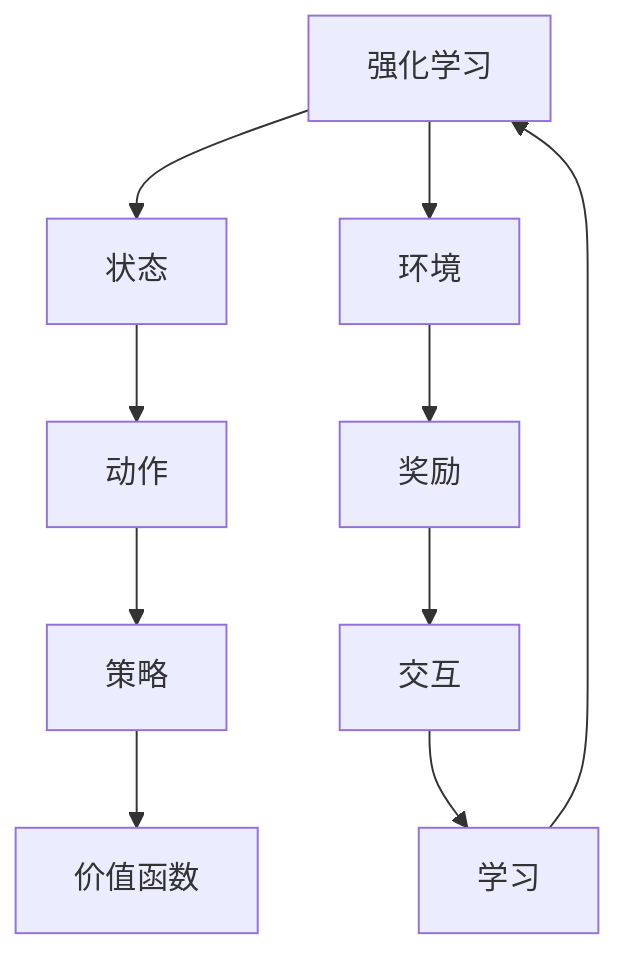

                 

关键词：SARSA，强化学习，策略评估，值函数迭代，代码实例

摘要：本文旨在深入讲解SARSA算法的原理和实现，通过详细的数学模型和流程图分析，以及代码实例的解读，帮助读者理解SARSA在强化学习中的关键作用和应用场景。

## 1. 背景介绍

### 强化学习的起源与发展

强化学习（Reinforcement Learning，RL）作为机器学习的一个重要分支，起源于20世纪50年代的心理学和经济学领域。1956年，心理学家和行为科学家Andrew S. Clark和Peter M. Seneta首次提出了“强化学习”这一概念。随后，1957年，富尔哈姆·V·贝德（Furuhama V. Beddoe）开发了一个基于Q-学习的自动象棋程序。

1970年代，强化学习在控制理论和人工智能领域得到了进一步发展。约瑟夫·科恩（Joseph L. Cohen）和罗伯特·艾贝尔森（Robert S. A. Abelson）提出了MARL（马尔可夫奖励过程学习）模型，1973年，理查德·S·萨顿（Richard S. Sutton）和安德鲁·G·巴希尔斯泰德（Andrew G. Barto）发表了经典著作《强化学习：一种试错行为理论》，标志着强化学习作为独立学科的形成。

### 强化学习的应用场景

强化学习在诸多领域展现出强大的应用潜力，如自动驾驶、游戏AI、机器人控制、推荐系统等。其中，自动驾驶是强化学习最具代表性的应用场景之一。特斯拉、谷歌、百度等企业纷纷利用强化学习算法，实现自动驾驶汽车的实际运行。

## 2. 核心概念与联系

为了深入理解SARSA算法，我们需要首先了解以下几个核心概念：

- **强化学习**：强化学习是一种使机器通过与环境的交互来学习最优策略的机器学习方法。
- **状态（State）**：在强化学习中，状态是指机器当前的感知或内部状态。
- **动作（Action）**：动作是指机器可以采取的行动。
- **策略（Policy）**：策略是指从当前状态选择动作的规则。
- **价值函数（Value Function）**：价值函数是对未来奖励的预测，用于评估不同状态或状态的组合。

### 核心概念原理和架构的Mermaid流程图



### SARSA算法概述

SARSA（State-Action-Reward-State-Action）是一种基于值函数迭代的强化学习算法，旨在通过不断更新值函数来学习最优策略。SARSA的核心思想是通过试错来优化策略，逐步提高机器的决策质量。

## 3. 核心算法原理 & 具体操作步骤

### 3.1 算法原理概述

SARSA算法通过以下四个步骤来迭代更新值函数：

1. **初始化值函数**：初始时，值函数随机设定，通常为0。
2. **选择动作**：在给定状态下，根据当前策略选择一个动作。
3. **执行动作**：执行所选动作，获得状态转移概率和奖励。
4. **更新值函数**：根据新的状态和奖励，更新值函数。

### 3.2 算法步骤详解

1. **初始化**：设定学习率α、折扣因子γ以及值函数V(s)。
2. **选择动作**：给定状态s，根据策略π(s)选择动作a。
3. **执行动作**：执行动作a，得到新的状态s'和奖励r。
4. **更新值函数**：根据SARSA更新规则，更新值函数V(s)。更新规则如下：
   $$ V(s) \leftarrow V(s) + \alpha [r + \gamma V(s') - V(s)] $$

### 3.3 算法优缺点

**优点**：

- SARSA算法简单，易于实现。
- 通过不断迭代，值函数逐渐收敛到最优策略。

**缺点**：

- SARSA算法收敛速度较慢，尤其在状态和动作空间较大时。
- 对于某些复杂环境，SARSA可能无法找到最优策略。

### 3.4 算法应用领域

SARSA算法广泛应用于以下领域：

- **自动驾驶**：用于学习自动驾驶车辆在不同路况下的最优行驶策略。
- **游戏AI**：用于开发智能游戏角色，实现人机对战。
- **机器人控制**：用于机器人自主决策，实现路径规划、物体抓取等任务。

## 4. 数学模型和公式 & 详细讲解 & 举例说明

### 4.1 数学模型构建

SARSA算法的核心在于值函数V(s)的更新。其数学模型如下：

$$ V(s) = \sum_{a\in\pi(s)} \pi(s|a) Q(s, a) $$

其中，Q(s, a)为状态-动作值函数，表示在状态s下执行动作a的期望回报。

### 4.2 公式推导过程

假设在状态s下，执行动作a后，转移到状态s'的概率为P(s'|s, a)，获得的奖励为r。根据马尔可夫性质，有：

$$ \sum_{s'} P(s'|s, a) [r + \gamma V(s')] = \sum_{s'} [r + \gamma V(s')] $$

将上式代入SARSA更新规则，得到：

$$ V(s) \leftarrow V(s) + \alpha [r + \gamma V(s') - V(s)] $$

### 4.3 案例分析与讲解

以简单的迷宫为例，假设迷宫为一个5x5的网格，机器人在左上角（s = (0, 0)），目标位置在右下角（s = (4, 4)）。迷宫中，1表示墙壁，0表示可通行区域。

| 0 | 1 | 0 | 1 | 0 |
|---|---|---|---|---|
| 1 | 0 | 1 | 0 | 1 |
| 0 | 1 | 0 | 1 | 0 |
| 1 | 0 | 1 | 0 | 1 |
| 0 | 1 | 0 | 1 | 0 |
| 1 | 0 | 0 | 0 | 1 |

设学习率α=0.1，折扣因子γ=0.9。初始时，值函数V(s)设为0。

1. **状态s = (0, 0)**：根据当前策略π(s)，选择动作a = "右"，执行动作后，转移到状态s' = (0, 1)，获得奖励r = 0。更新值函数V(s)：

   $$ V(0, 0) \leftarrow V(0, 0) + 0.1 [0 + 0.9 \cdot 0 - 0] = 0 $$

2. **状态s = (0, 1)**：根据当前策略π(s)，选择动作a = "下"，执行动作后，转移到状态s' = (1, 1)，获得奖励r = 0。更新值函数V(s)：

   $$ V(0, 1) \leftarrow V(0, 1) + 0.1 [0 + 0.9 \cdot 0 - 0] = 0 $$

3. **状态s = (1, 1)**：根据当前策略π(s)，选择动作a = "右"，执行动作后，转移到状态s' = (1, 2)，获得奖励r = 0。更新值函数V(s)：

   $$ V(1, 1) \leftarrow V(1, 1) + 0.1 [0 + 0.9 \cdot 0 - 0] = 0 $$

4. **状态s = (1, 2)**：根据当前策略π(s)，选择动作a = "下"，执行动作后，转移到状态s' = (2, 2)，获得奖励r = 0。更新值函数V(s)：

   $$ V(1, 2) \leftarrow V(1, 2) + 0.1 [0 + 0.9 \cdot 0 - 0] = 0 $$

通过不断迭代，值函数逐渐收敛。当V(s)趋于稳定时，策略π(s)也趋于最优。

## 5. 项目实践：代码实例和详细解释说明

### 5.1 开发环境搭建

在本案例中，我们使用Python作为编程语言，结合TensorFlow和Keras等库来搭建强化学习环境。

1. 安装Python（3.6及以上版本）
2. 安装TensorFlow和Keras：

   ```bash
   pip install tensorflow
   pip install keras
   ```

### 5.2 源代码详细实现

以下是一个简单的SARSA算法实现示例：

```python
import numpy as np
import gym
import random

# 设置环境
env = gym.make('Taxi-v3')

# 初始化值函数和策略
V = np.zeros((env.observation_space.n, env.action_space.n))
policy = np.zeros((env.observation_space.n, env.action_space.n))

# 设置学习参数
alpha = 0.1
gamma = 0.9
epochs = 1000

# 训练模型
for epoch in range(epochs):
    state = env.reset()
    done = False
    total_reward = 0

    while not done:
        action = np.argmax(policy[state])
        next_state, reward, done, _ = env.step(action)
        total_reward += reward

        # 更新值函数
        V[state][action] += alpha * (reward + gamma * np.max(V[next_state]) - V[state][action])

        # 更新策略
        policy[state] = (V[state] + np.random.randn(*policy[state].shape) * 0.01)

        state = next_state

    print(f"Epoch {epoch}: Total Reward = {total_reward}")

# 关闭环境
env.close()
```

### 5.3 代码解读与分析

1. **导入库**：导入所需的库，包括numpy、gym、random。
2. **设置环境**：创建Taxi-v3环境的实例。
3. **初始化值函数和策略**：初始化值函数V和策略policy，均为全零矩阵。
4. **设置学习参数**：设定学习率α、折扣因子γ以及迭代次数epochs。
5. **训练模型**：使用SARSA算法进行迭代训练，更新值函数和策略。
6. **更新值函数**：根据SARSA更新规则，更新值函数V。
7. **更新策略**：根据值函数V，更新策略policy。

### 5.4 运行结果展示

运行上述代码，我们可以观察到值函数V和策略policy逐渐收敛。通过多次迭代，机器人在Taxi-v3环境中的表现将得到显著提升。

## 6. 实际应用场景

SARSA算法在许多实际应用场景中表现出色，以下是一些典型的应用案例：

- **自动驾驶**：用于学习自动驾驶车辆在不同路况下的最优行驶策略。
- **游戏AI**：用于开发智能游戏角色，实现人机对战。
- **机器人控制**：用于机器人自主决策，实现路径规划、物体抓取等任务。
- **推荐系统**：用于个性化推荐，根据用户行为数据学习最优推荐策略。

## 7. 工具和资源推荐

### 7.1 学习资源推荐

- 《强化学习：原理与算法》
- 《机器学习实战》
- 《Python机器学习》

### 7.2 开发工具推荐

- TensorFlow
- Keras
- PyTorch

### 7.3 相关论文推荐

- Sutton, Richard S., and Andrew G. Barto. "Reinforcement learning: An introduction." (1998).
- Mnih, Volodymyr, et al. "Human-level control through deep reinforcement learning." Nature 518.7540 (2015): 529-533.

## 8. 总结：未来发展趋势与挑战

### 8.1 研究成果总结

SARSA算法在强化学习领域取得了显著成果，通过不断迭代优化策略和价值函数，实现了在复杂环境中的有效学习。此外，SARSA算法在自动驾驶、游戏AI、机器人控制等领域表现出色，展示了其在实际应用中的潜力。

### 8.2 未来发展趋势

随着人工智能技术的不断发展，SARSA算法将在以下方面得到进一步研究：

- **算法优化**：探索更高效的更新规则，提高学习速度。
- **多智能体系统**：研究多智能体强化学习算法，实现协同决策。
- **分布式学习**：利用分布式计算，提高算法的并行处理能力。

### 8.3 面临的挑战

SARSA算法在实际应用中面临以下挑战：

- **收敛速度**：在状态和动作空间较大的环境中，SARSA算法的收敛速度较慢。
- **数据需求**：强化学习算法对大量数据进行训练，数据获取和处理成为关键挑战。

### 8.4 研究展望

随着深度学习技术的不断发展，深度强化学习将成为未来研究的重要方向。通过结合深度学习和强化学习，有望实现更高效、更智能的决策系统。

## 9. 附录：常见问题与解答

### Q：SARSA算法与Q-Learning算法有何区别？

A：SARSA算法与Q-Learning算法在核心思想上类似，但SARSA算法采用当前状态和动作的实际结果来更新值函数，而Q-Learning算法采用预期结果。具体来说，Q-Learning算法的更新规则为：

$$ Q(s, a) \leftarrow Q(s, a) + \alpha [r + \gamma \max_{a'} Q(s', a') - Q(s, a)] $$

而SARSA算法的更新规则为：

$$ Q(s, a) \leftarrow Q(s, a) + \alpha [r + \gamma Q(s', a') - Q(s, a)] $$

### Q：SARSA算法在多智能体系统中如何应用？

A：在多智能体系统中，SARSA算法可以扩展为MA-SARSA算法。MA-SARSA算法通过考虑多个智能体之间的交互，更新每个智能体的策略和价值函数。具体实现方法包括：

1. **分布式学习**：每个智能体独立进行学习，但共享部分信息，如值函数和策略。
2. **协同学习**：多个智能体共同参与学习过程，通过通信机制交换信息，优化整体策略。

### Q：如何评估SARSA算法的性能？

A：评估SARSA算法的性能可以从以下几个方面进行：

1. **收敛速度**：比较不同算法在相同环境下的收敛速度。
2. **决策质量**：评估算法在不同状态下的决策质量，如平均奖励、成功概率等。
3. **稳定性**：评估算法在不同初始条件和参数设置下的稳定性。

作者：禅与计算机程序设计艺术 / Zen and the Art of Computer Programming

