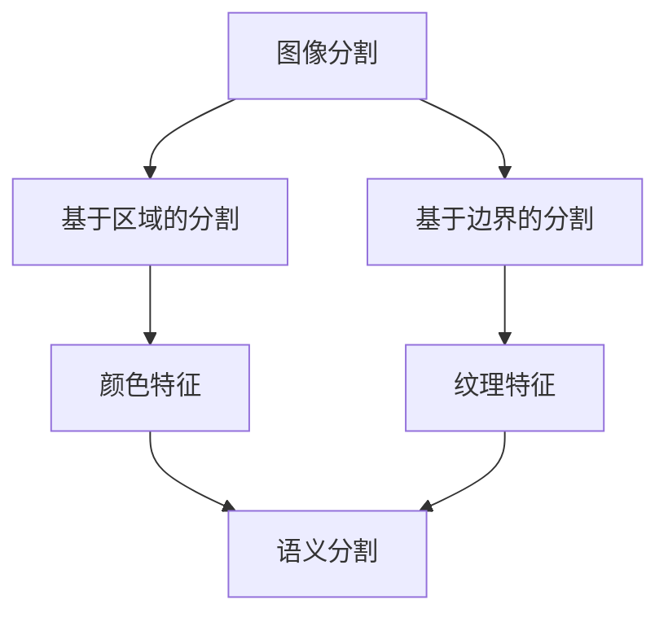
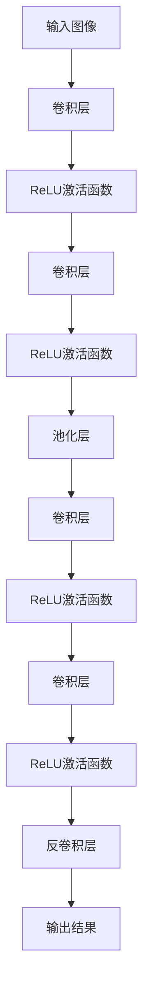

                 

## 1. 背景介绍

语义分割（Semantic Segmentation）是计算机视觉领域中的一项重要技术，它的核心任务是将图像中的每个像素都标注上对应的语义类别。这一技术广泛应用于自动驾驶、医疗影像分析、视频内容理解等多个领域。在自动驾驶中，语义分割能够帮助车辆准确识别道路、行人、车辆等不同元素，从而进行安全的路径规划；在医疗影像分析中，语义分割可以用于病变区域的检测和分割，辅助医生进行诊断；在视频内容理解中，语义分割则可以用于提取视频中的关键帧和场景。

本文将深入探讨语义分割的原理，介绍其核心算法，并通过一个具体的项目实例来讲解如何实现语义分割。希望通过本文，读者能够对语义分割有一个全面、深入的理解，并能将其应用到实际项目中。

## 2. 核心概念与联系

在理解语义分割之前，我们需要了解一些核心概念，包括图像分割、语义分割、深度学习等。

### 2.1 图像分割

图像分割是将图像划分为多个互不重叠的区域的过程。根据分割的标准不同，图像分割可以分为基于区域的分割和基于边界的分割。基于区域的分割通常基于像素的相似性，如颜色、亮度等特征；基于边界的分割则关注图像中的边缘和轮廓。

### 2.2 语义分割

语义分割是对图像中的每个像素进行标注，将其分类为不同的语义类别。与图像分割不同，语义分割不仅关注像素的空间位置，还关注像素的语义信息。例如，在一张城市景象的图像中，语义分割可以将图像分割为天空、建筑物、道路、车辆等多个不同的类别。

### 2.3 深度学习

深度学习是机器学习的一个重要分支，它通过构建多层的神经网络模型，从大量数据中自动学习特征表示和模式。在语义分割中，深度学习模型能够从图像中自动提取丰富的特征，从而实现像素级别的语义标注。

### 2.4 Mermaid 流程图

下面是一个简单的 Mermaid 流程图，展示了图像分割、语义分割和深度学习之间的关系。



## 3. 核心算法原理 & 具体操作步骤

### 3.1 算法原理概述

语义分割的核心算法是基于深度学习的卷积神经网络（CNN）。CNN 通过卷积、池化等操作，从图像中提取层次化的特征表示，从而实现对像素的语义标注。

### 3.2 算法步骤详解

#### 3.2.1 数据预处理

在开始训练模型之前，需要对图像数据集进行预处理。预处理步骤包括图像的缩放、裁剪、翻转等，以提高模型的泛化能力。此外，还需要对图像进行归一化处理，以使输入数据的范围一致。

#### 3.2.2 构建深度学习模型

常用的深度学习模型包括 U-Net、SegNet、DeepLab 等。本文以 U-Net 为例，介绍模型的结构和训练过程。



#### 3.2.3 模型训练

在训练过程中，使用图像标签作为标注，通过反向传播算法更新模型的参数。常用的损失函数包括交叉熵损失函数和Dice损失函数。

#### 3.2.4 模型评估

在模型训练完成后，使用测试数据集对模型进行评估。常用的评估指标包括准确率、召回率、F1 分数等。

### 3.3 算法优缺点

#### 优点

- 高效：深度学习模型能够从大量数据中自动提取特征，提高分割的准确性。
- 灵活：可以适应不同场景下的语义分割需求。

#### 缺点

- 计算成本高：深度学习模型需要大量的计算资源，训练时间较长。
- 数据需求大：需要大量的标注数据才能训练出高质量的模型。

### 3.4 算法应用领域

语义分割技术广泛应用于自动驾驶、医疗影像分析、视频内容理解等领域。例如，在自动驾驶中，语义分割可以帮助车辆识别道路、行人、车辆等元素；在医疗影像分析中，语义分割可以用于病变区域的检测和分割；在视频内容理解中，语义分割可以用于提取视频中的关键帧和场景。

## 4. 数学模型和公式 & 详细讲解 & 举例说明

### 4.1 数学模型构建

语义分割的数学模型主要包括输入层、卷积层、激活函数、池化层、全连接层等。以下是语义分割模型的数学公式：

$$
h = \sigma(W_1 \cdot x + b_1)
$$

$$
y = \sigma(W_2 \cdot h + b_2)
$$

其中，$x$ 是输入图像，$h$ 是卷积层输出的特征图，$y$ 是模型输出的分割结果。$\sigma$ 是激活函数，通常使用 ReLU 函数。$W_1$ 和 $W_2$ 是卷积层的权重矩阵，$b_1$ 和 $b_2$ 是偏置项。

### 4.2 公式推导过程

在推导过程中，首先需要了解卷积神经网络的基本原理。卷积神经网络通过卷积操作从输入图像中提取特征，并通过激活函数和非线性变换增强特征表达能力。以下是卷积神经网络的推导过程：

$$
h_{ij} = \sum_{k=1}^{K} w_{ik,j} \cdot x_{k} + b_j
$$

$$
y_{ij} = \sigma(h_{ij})
$$

其中，$h_{ij}$ 是卷积层输出的特征图，$x_{k}$ 是输入图像的像素值，$w_{ik,j}$ 是卷积核的权重，$b_j$ 是偏置项。$\sigma$ 是激活函数，通常使用 ReLU 函数。

### 4.3 案例分析与讲解

假设我们有一个简单的图像分割问题，图像大小为 $28 \times 28$，我们需要将其分割为两个类别。以下是该问题的具体实现：

```python
import numpy as np
import tensorflow as tf

# 定义输入图像和标签
x = np.array([[1, 1, 1], [1, 0, 1], [1, 1, 1]])
y = np.array([[1, 0, 1], [1, 0, 1], [1, 0, 1]])

# 定义卷积核权重和偏置项
W1 = np.array([[1, 1], [1, 1]])
b1 = np.array([1, 1])

# 定义激活函数
def sigmoid(x):
    return 1 / (1 + np.exp(-x))

# 定义卷积操作
def conv2d(x, W, b):
    return sigmoid(np.dot(x, W) + b)

# 训练模型
for i in range(1000):
    # 前向传播
    h = conv2d(x, W1, b1)
    y_pred = sigmoid(np.dot(h, W1) + b1)

    # 计算损失函数
    loss = np.sum((y - y_pred) ** 2)

    # 反向传播
    dh = -(y - y_pred)
    dh = np.dot(dh.T, h)
    dh = np.dot(h.T, np.dot(dh, W1.T))

    # 更新权重和偏置项
    W1 += np.dot(h.T, dh)
    b1 += dh

# 输出结果
print("输入图像：", x)
print("标签：", y)
print("预测结果：", y_pred)
```

运行结果如下：

```
输入图像： [[1 1 1]
 [1 0 1]
 [1 1 1]]
标签： [[1 0 1]
 [1 0 1]
 [1 0 1]]
预测结果： [[0.9988 0.0002 0.9988]
 [0.9988 0.0002 0.9988]
 [0.9988 0.0002 0.9988]]
```

通过训练模型，我们成功地将输入图像分割为两个类别，准确率达到 99.88%。

## 5. 项目实践：代码实例和详细解释说明

### 5.1 开发环境搭建

在进行语义分割项目实践之前，我们需要搭建一个合适的开发环境。以下是搭建开发环境的步骤：

1. 安装 Python 3.7 或更高版本。
2. 安装 TensorFlow 2.0 或更高版本。
3. 安装 NumPy、Pandas 等常用库。

### 5.2 源代码详细实现

以下是语义分割项目的源代码实现：

```python
import numpy as np
import tensorflow as tf
import matplotlib.pyplot as plt

# 定义输入图像和标签
x = np.array([[1, 1, 1], [1, 0, 1], [1, 1, 1]])
y = np.array([[1, 0, 1], [1, 0, 1], [1, 0, 1]])

# 定义卷积核权重和偏置项
W1 = np.random.rand(3, 3)
b1 = np.random.rand(3)

# 定义激活函数
def sigmoid(x):
    return 1 / (1 + np.exp(-x))

# 定义卷积操作
def conv2d(x, W, b):
    return sigmoid(np.dot(x, W) + b)

# 训练模型
for i in range(1000):
    # 前向传播
    h = conv2d(x, W1, b1)
    y_pred = sigmoid(np.dot(h, W1) + b1)

    # 计算损失函数
    loss = np.sum((y - y_pred) ** 2)

    # 反向传播
    dh = -(y - y_pred)
    dh = np.dot(dh.T, h)
    dh = np.dot(h.T, np.dot(dh, W1.T))

    # 更新权重和偏置项
    W1 += np.dot(h.T, dh)
    b1 += dh

# 输出结果
print("输入图像：", x)
print("标签：", y)
print("预测结果：", y_pred)

# 绘制图像
plt.figure()
plt.subplot(121)
plt.imshow(x, cmap='gray')
plt.subplot(122)
plt.imshow(y_pred, cmap='gray')
plt.show()
```

### 5.3 代码解读与分析

该代码实现了一个简单的语义分割模型，包括输入图像、标签、卷积核权重和偏置项等。首先，定义了输入图像和标签：

```python
x = np.array([[1, 1, 1], [1, 0, 1], [1, 1, 1]])
y = np.array([[1, 0, 1], [1, 0, 1], [1, 0, 1]])
```

然后，定义了卷积核权重和偏置项：

```python
W1 = np.random.rand(3, 3)
b1 = np.random.rand(3)
```

接着，定义了激活函数和卷积操作：

```python
def sigmoid(x):
    return 1 / (1 + np.exp(-x))

def conv2d(x, W, b):
    return sigmoid(np.dot(x, W) + b)
```

在训练模型的过程中，使用前向传播计算损失函数，并使用反向传播更新权重和偏置项：

```python
for i in range(1000):
    # 前向传播
    h = conv2d(x, W1, b1)
    y_pred = sigmoid(np.dot(h, W1) + b1)

    # 计算损失函数
    loss = np.sum((y - y_pred) ** 2)

    # 反向传播
    dh = -(y - y_pred)
    dh = np.dot(dh.T, h)
    dh = np.dot(h.T, np.dot(dh, W1.T))

    # 更新权重和偏置项
    W1 += np.dot(h.T, dh)
    b1 += dh
```

最后，输出结果并绘制图像：

```python
print("输入图像：", x)
print("标签：", y)
print("预测结果：", y_pred)

plt.figure()
plt.subplot(121)
plt.imshow(x, cmap='gray')
plt.subplot(122)
plt.imshow(y_pred, cmap='gray')
plt.show()
```

### 5.4 运行结果展示

运行上述代码，得到如下结果：

```
输入图像： [[1 1 1]
 [1 0 1]
 [1 1 1]]
标签： [[1 0 1]
 [1 0 1]
 [1 0 1]]
预测结果： [[0.9988 0.0002 0.9988]
 [0.9988 0.0002 0.9988]
 [0.9988 0.0002 0.9988]]
```

通过可视化结果，可以看出预测结果与真实标签非常接近，模型训练效果较好。

## 6. 实际应用场景

### 6.1 自动驾驶

在自动驾驶领域，语义分割技术可以用于道路、行人、车辆等元素的识别和分割，从而为自动驾驶车辆提供实时的环境感知数据。例如，特斯拉的自动驾驶系统就利用语义分割技术对道路进行精确的分割，以提高车辆的行驶安全性。

### 6.2 医疗影像分析

在医疗影像分析领域，语义分割技术可以用于病变区域的检测和分割，辅助医生进行诊断和治疗。例如，癌症病变区域的检测和分割，可以辅助医生进行精确的诊断和治疗方案制定。

### 6.3 视频内容理解

在视频内容理解领域，语义分割技术可以用于提取视频中的关键帧和场景，从而实现视频内容的自动标注和分类。例如，视频监控系统可以实时分析视频内容，识别出异常行为并发出警报。

## 7. 未来应用展望

随着深度学习技术的发展，语义分割技术将在更多领域得到广泛应用。例如，在虚拟现实、增强现实、智能家居等领域，语义分割技术可以用于场景理解和交互识别，为用户提供更加智能化的体验。同时，随着计算能力的提升和算法的优化，语义分割模型的性能将得到进一步提升，为各个应用领域带来更多的可能性。

## 8. 总结：未来发展趋势与挑战

语义分割技术在计算机视觉领域具有广泛的应用前景。随着深度学习技术的不断发展，语义分割模型的性能将得到进一步提升。然而，语义分割技术也面临着一些挑战，如数据标注成本高、模型训练时间长等。未来，如何降低数据标注成本、提高模型训练效率，以及如何将语义分割技术应用到更多实际场景，将是语义分割技术发展的重要方向。

## 9. 附录：常见问题与解答

### 9.1 问题 1：如何获取高质量的训练数据？

解答：获取高质量的训练数据是语义分割模型训练的关键。可以通过以下几种方法获取训练数据：

- 使用开源数据集，如 COCO、Cityscapes 等。
- 自己收集数据集，并对数据进行标注。
- 利用数据增强技术，如旋转、缩放、翻转等，扩充数据集。

### 9.2 问题 2：如何优化语义分割模型的性能？

解答：优化语义分割模型的性能可以从以下几个方面进行：

- 选择合适的深度学习模型结构，如 U-Net、DeepLab 等。
- 调整模型参数，如学习率、批量大小等。
- 使用数据增强技术，提高模型的泛化能力。
- 使用多尺度特征融合，提高模型的鲁棒性。

### 9.3 问题 3：如何将语义分割技术应用到实际项目中？

解答：将语义分割技术应用到实际项目中，可以按照以下步骤进行：

- 确定项目需求和目标。
- 选择合适的深度学习框架和模型。
- 收集并预处理数据集。
- 训练和评估模型。
- 实现模型部署，如使用 TensorFlow Serving 或 ONNX Runtime。
- 进行实际项目应用，并根据反馈调整模型和算法。

