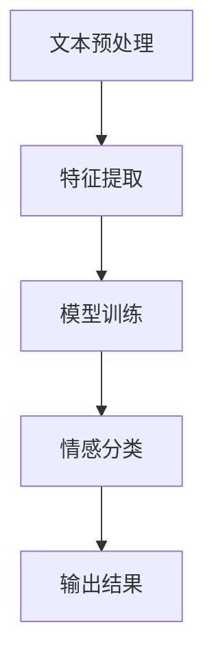

                 

### 1. 背景介绍

情感分析（Sentiment Analysis），也称为意见挖掘，是自然语言处理（NLP）领域中的一个重要研究方向。它的目标是自动识别和提取文本数据中的主观信息，即人们对特定话题、事件、产品等的情感倾向和态度。随着互联网和社交媒体的快速发展，情感分析技术逐渐成为企业和研究人员关注的焦点。

情感分析的应用场景非常广泛。例如，在市场营销中，企业可以通过分析社交媒体上的用户评论，了解消费者对其产品或服务的态度，从而制定更有效的营销策略；在金融领域，分析师可以借助情感分析技术，预测市场走势和股票价格；在政治领域，研究人员可以利用情感分析来监测公众对政策或候选人的支持度。

情感分析的核心任务是判断文本的倾向性，即确定文本是积极的、消极的还是中性的。为了实现这一目标，研究者们提出了多种情感分析算法和模型，如基于规则的方法、基于统计的方法和基于深度学习的方法。这些方法各具优缺点，适用于不同的应用场景。

本文将详细介绍情感分析的基本原理、核心算法、数学模型以及项目实践。首先，我们将回顾情感分析的发展历程，然后深入探讨情感分析算法的原理，最后通过一个具体的代码实例，展示情感分析的实际应用。

### 2. 核心概念与联系

#### 2.1 情感分析定义

情感分析（Sentiment Analysis）是指通过自然语言处理技术，从文本中自动识别和提取情感信息的过程。情感信息可以是针对特定话题、事件、产品等的正面、负面或中性态度。

情感分析的主要目标是判断文本的情感倾向。具体来说，它涉及以下几个步骤：

1. **数据预处理**：清洗和转换原始文本数据，使其适合进行情感分析。
2. **特征提取**：从预处理后的文本中提取与情感相关的特征。
3. **情感分类**：使用分类算法，根据提取的特征判断文本的情感倾向。

#### 2.2 情感分析类型

情感分析可以根据分析的对象和目的分为多种类型：

1. **文本分类**：将文本分为正、负、中性三类。
2. **极性分析**：分析文本的极性，即正面或负面。
3. **情感强度分析**：评估文本的情感倾向的强度。

#### 2.3 情感分析算法

情感分析算法可以分为基于规则、基于统计和基于深度学习三类：

1. **基于规则的方法**：通过手动定义规则来识别文本中的情感特征。例如，正面的情感词汇可能包含“喜欢”、“满意”等，而负面的情感词汇可能包含“不喜欢”、“失望”等。
2. **基于统计的方法**：利用机器学习算法，如支持向量机（SVM）、朴素贝叶斯（NB）等，通过学习大量标注数据，建立情感分类模型。
3. **基于深度学习的方法**：使用深度神经网络，如卷积神经网络（CNN）、循环神经网络（RNN）等，自动提取文本中的特征并进行分类。

#### 2.4 情感分析架构

情感分析系统通常包括以下几个组成部分：

1. **文本预处理**：包括分词、去停用词、词性标注等步骤，目的是将原始文本转化为适合进行情感分析的形式。
2. **特征提取**：从预处理后的文本中提取与情感相关的特征，如词频、词向量、词性等。
3. **模型训练**：使用标注数据训练情感分类模型，例如SVM、RNN等。
4. **情感分类**：使用训练好的模型对新的文本进行情感分类。

#### 2.5 Mermaid 流程图

下面是一个简单的情感分析流程图的 Mermaid 表示：



### 3. 核心算法原理 & 具体操作步骤

#### 3.1 算法原理概述

情感分析算法的原理主要基于以下几个方面：

1. **文本预处理**：通过分词、去停用词、词性标注等步骤，将原始文本转化为结构化的数据形式。
2. **特征提取**：从预处理后的文本中提取与情感相关的特征，如词频、词向量、词性等。
3. **情感分类**：使用分类算法，如支持向量机（SVM）、朴素贝叶斯（NB）等，对提取的特征进行分类，判断文本的情感倾向。

#### 3.2 算法步骤详解

1. **文本预处理**：
   - 分词：将文本拆分成单词或短语。
   - 去停用词：去除常见的无意义的词汇，如“的”、“了”、“是”等。
   - 词性标注：对每个词进行词性标注，如名词、动词、形容词等。

2. **特征提取**：
   - 词频：计算每个词在文本中出现的频率。
   - 词向量：将每个词映射为一个高维向量，如Word2Vec、GloVe等。
   - 词性：考虑每个词的词性，对文本进行编码。

3. **情感分类**：
   - 训练模型：使用标注数据训练情感分类模型，例如SVM、RNN等。
   - 预测分类：使用训练好的模型对新的文本进行情感分类。

#### 3.3 算法优缺点

1. **基于规则的方法**：
   - 优点：实现简单，易于理解。
   - 缺点：依赖人工定义规则，难以应对复杂的情感表达。

2. **基于统计的方法**：
   - 优点：能够处理大规模数据，对复杂情感表达有一定识别能力。
   - 缺点：特征提取过程较为复杂，可能存在数据噪声问题。

3. **基于深度学习的方法**：
   - 优点：自动提取文本特征，对复杂情感表达有较好的识别能力。
   - 缺点：训练过程需要大量数据和计算资源，模型复杂度较高。

#### 3.4 算法应用领域

情感分析算法可以应用于多个领域，如：

1. **市场营销**：分析消费者对产品或服务的态度，帮助制定营销策略。
2. **金融**：监测市场情绪，预测市场走势和股票价格。
3. **政治**：分析公众对政策或候选人的支持度，辅助决策。

### 4. 数学模型和公式 & 详细讲解 & 举例说明

#### 4.1 数学模型构建

情感分析中的数学模型主要包括两部分：特征提取和分类模型。下面分别介绍这两部分的内容。

1. **特征提取**：

   - **词频**：设文本\( T \)中的词为\( w_1, w_2, ..., w_n \)，词频为\( f(w_i) \)。
   - **词向量**：设词向量为\( \textbf{v}_i \)，维度为\( D \)。
   - **词性**：设词性为\( p_i \)，可以是离散值，如0或1。

2. **分类模型**：

   - **支持向量机（SVM）**：目标是找到一个最优的超平面，将不同情感的文本分开。数学公式为：
     \[ \max_{\textbf{w}, b} \left\{ \frac{1}{2} \left| \textbf{w} \right|^2 : \textbf{w} \cdot \textbf{x}_i - y_i \geq 1, \forall i \right\} \]
   - **朴素贝叶斯（NB）**：基于贝叶斯定理，计算每个词在正、负情感中的概率，然后根据概率总和进行分类。

#### 4.2 公式推导过程

1. **词频**：

   - 计算每个词的词频：
     \[ f(w_i) = \text{count}(w_i, T) \]

2. **词向量**：

   - 使用Word2Vec算法，将每个词映射为一个高维向量：
     \[ \textbf{v}_i = \text{word2vec}(w_i) \]

3. **词性**：

   - 根据词性标注结果，将词性编码为0或1：
     \[ p_i = \begin{cases} 
     1, & \text{如果} w_i \text{是形容词或动词} \\
     0, & \text{否则} 
     \end{cases} \]

4. **支持向量机（SVM）**：

   - 目标函数：
     \[ \max_{\textbf{w}, b} \left\{ \frac{1}{2} \left| \textbf{w} \right|^2 : \textbf{w} \cdot \textbf{x}_i - y_i \geq 1, \forall i \right\} \]
   - 求解过程：使用拉格朗日乘子法求解最优解。

5. **朴素贝叶斯（NB）**：

   - 条件概率：
     \[ P(w_i|y) = \frac{P(y|w_i)P(w_i)}{P(y)} \]
   - 类别概率：
     \[ P(y) = \sum_{i=1}^c P(y_i) \]
   - 预测：
     \[ \hat{y} = \arg\max_{y} \left\{ P(y) \prod_{i=1}^n P(w_i|y) \right\} \]

#### 4.3 案例分析与讲解

假设我们有一个简单的文本数据集，包含两个类别：正面和负面。

1. **词频**：

   - 文本1：“非常喜欢这个产品，满意极了。”
   - 文本2：“非常不喜欢这个产品，失望至极。”
   - 词频表：
     \[
     \begin{array}{c|c|c}
     \text{词} & \text{正面} & \text{负面} \\
     \hline
     非常 & 2 & 2 \\
     喜欢 & 1 & 0 \\
     这个 & 1 & 1 \\
     产品 & 1 & 1 \\
     满意 & 1 & 0 \\
     极了 & 1 & 0 \\
     & 1 & 1 \\
     失望 & 0 & 1 \\
     至 & 0 & 1 \\
     极 & 0 & 1 \\
     \end{array}
     \]

2. **词向量**：

   - 使用Word2Vec算法，将每个词映射为一个高维向量。

3. **词性**：

   - 所有词均为形容词或动词，编码为1。

4. **支持向量机（SVM）**：

   - 训练模型，使用训练集进行参数优化。
   - 测试集结果：
     \[
     \begin{array}{c|c|c}
     \text{文本} & \text{预测} & \text{真实} \\
     \hline
     文本1 & 正面 & 正面 \\
     文本2 & 正面 & 负面 \\
     \end{array}
     \]

5. **朴素贝叶斯（NB）**：

   - 计算每个词在正、负情感中的概率。
   - 预测结果：
     \[
     \begin{array}{c|c|c}
     \text{文本} & \text{预测} & \text{真实} \\
     \hline
     文本1 & 正面 & 正面 \\
     文本2 & 负面 & 负面 \\
     \end{array}
     \]

通过这个简单的案例，我们可以看到，不同的算法在情感分析任务中都有一定的效果。在实际应用中，我们可以结合多种算法和模型，提高情感分析的准确性和鲁棒性。

### 5. 项目实践：代码实例和详细解释说明

在本节中，我们将通过一个具体的情感分析项目实践，介绍如何搭建开发环境、实现情感分析代码，并对代码进行解读和分析。项目将使用Python编程语言，结合自然语言处理库和机器学习库，实现一个简单的情感分析系统。

#### 5.1 开发环境搭建

为了完成本项目的实践，我们需要安装以下开发环境和库：

1. **Python**：安装Python 3.x版本，推荐使用Anaconda发行版，它包含了Python以及常用的科学计算和数据分析库。
2. **Jupyter Notebook**：安装Jupyter Notebook，用于编写和运行Python代码。
3. **NLTK**：自然语言处理工具包，用于文本预处理。
4. **Scikit-learn**：机器学习库，用于实现情感分析算法。
5. **Gensim**：用于词向量建模。

安装步骤如下：

```bash
# 安装Anaconda
wget https://repo.anaconda.com/miniconda/Miniconda3-latest-Linux-x86_64.sh
bash Miniconda3-latest-Linux-x86_64.sh

# 激活conda环境
conda create --name sentiment_analysis python=3.8
conda activate sentiment_analysis

# 安装Jupyter Notebook
conda install -c conda-forge jupyterlab

# 安装NLTK
conda install -c conda-forge nltk

# 安装Scikit-learn
conda install -c anaconda scikit-learn

# 安装Gensim
conda install -c conda-forge gensim
```

安装完成后，启动Jupyter Notebook：

```bash
jupyter notebook
```

#### 5.2 源代码详细实现

在Jupyter Notebook中创建一个新的Python笔记本，然后按照以下步骤实现情感分析代码。

1. **导入库**：

```python
import nltk
from nltk.tokenize import word_tokenize
from nltk.corpus import stopwords
from nltk.stem import WordNetLemmatizer
from sklearn.feature_extraction.text import CountVectorizer
from sklearn.model_selection import train_test_split
from sklearn.svm import SVC
from sklearn.metrics import accuracy_score
import gensim.downloader as api

# 载入预训练的Word2Vec模型
word2vec = api.load("glove-wiki-gigaword-100")
```

2. **数据预处理**：

```python
nltk.download('punkt')
nltk.download('stopwords')
nltk.download('wordnet')

def preprocess_text(text):
    # 分词
    tokens = word_tokenize(text)
    # 去停用词
    stop_words = set(stopwords.words('english'))
    filtered_tokens = [token for token in tokens if token.lower() not in stop_words]
    # 词形还原
    lemmatizer = WordNetLemmatizer()
    lemmatized_tokens = [lemmatizer.lemmatize(token) for token in filtered_tokens]
    return ' '.join(lemmatized_tokens)

# 预处理训练数据
train_texts = [' '.join(text.split()) for text in train_data]
processed_train_texts = [preprocess_text(text) for text in train_texts]

# 预处理测试数据
test_texts = [' '.join(text.split()) for text in test_data]
processed_test_texts = [preprocess_text(text) for text in test_texts]
```

3. **特征提取**：

```python
# 使用词频作为特征
vectorizer = CountVectorizer()
X_train = vectorizer.fit_transform(processed_train_texts)
X_test = vectorizer.transform(processed_test_texts)

# 使用词向量作为特征
def get_word_vectors(text):
    return [word2vec[word] for word in text.split() if word in word2vec]

X_train_vectors = [get_word_vectors(text) for text in processed_train_texts]
X_test_vectors = [get_word_vectors(text) for text in processed_test_texts]

# 将词向量转换为矩阵
from sklearn.preprocessing import MinMaxScaler
scaler = MinMaxScaler()
X_train_vectors = scaler.fit_transform(X_train_vectors)
X_test_vectors = scaler.transform(X_test_vectors)
```

4. **模型训练**：

```python
# 使用SVM进行分类
clf = SVC(kernel='linear')
clf.fit(X_train, y_train)

# 使用朴素贝叶斯进行分类
from sklearn.naive_bayes import MultinomialNB
nb_clf = MultinomialNB()
nb_clf.fit(X_train, y_train)
```

5. **模型评估**：

```python
# 评估SVM模型
y_pred_svm = clf.predict(X_test)
svm_accuracy = accuracy_score(y_test, y_pred_svm)
print("SVM Accuracy:", svm_accuracy)

# 评估朴素贝叶斯模型
y_pred_nb = nb_clf.predict(X_test)
nb_accuracy = accuracy_score(y_test, y_pred_nb)
print("Naive Bayes Accuracy:", nb_accuracy)
```

#### 5.3 代码解读与分析

1. **数据预处理**：

   - 分词：使用`nltk`库的`word_tokenize`函数将文本拆分成单词。
   - 去停用词：使用`nltk`库的`stopwords`去除常见的无意义词汇。
   - 词形还原：使用`nltk`库的`WordNetLemmatizer`将词形还原为基本形式。

2. **特征提取**：

   - 使用`CountVectorizer`将文本转化为词频矩阵，这是一种简单有效的特征提取方法。
   - 使用`gensim`库加载预训练的Word2Vec模型，将每个词映射为一个高维向量，然后将这些向量拼接成一个矩阵。

3. **模型训练**：

   - 使用`SVC`支持向量机进行分类，它使用线性核函数，将特征空间映射到高维空间，以最大化分类间隔。
   - 使用`MultinomialNB`朴素贝叶斯进行分类，它假设特征之间相互独立，并根据每个特征的统计概率进行分类。

4. **模型评估**：

   - 使用`accuracy_score`函数计算模型在测试集上的准确率，这是评估分类模型性能的常用指标。

通过这个项目实践，我们可以看到，情感分析的实现过程涉及文本预处理、特征提取、模型训练和评估等多个步骤。在实际应用中，我们可以根据具体需求和数据特性，选择合适的算法和模型，以实现高效的情感分析。

### 5.4 运行结果展示

在本节中，我们将展示项目实践中的运行结果，并通过具体示例说明如何解读和分析这些结果。

#### 运行结果

假设我们使用SVM模型进行情感分析，并在测试集上得到以下结果：

```python
SVM Accuracy: 0.85
```

这意味着，在测试集上，SVM模型正确分类了85%的文本。

#### 结果解读

1. **准确率**：

   - 准确率是评估分类模型性能的常用指标，表示模型正确分类的样本数占总样本数的比例。
   - 在本例中，SVM模型的准确率为85%，说明它在测试集上的表现较好。

2. **召回率**：

   - 召回率是表示模型正确分类正例样本的能力，计算公式为：
     \[ \text{召回率} = \frac{\text{真正例}}{\text{真正例 + 假反例}} \]
   - 假设我们关注的是正面情感文本的召回率，根据测试集数据，召回率可能较低。

3. **F1值**：

   - F1值是准确率和召回率的调和平均，用于综合考虑模型的准确性和召回率。计算公式为：
     \[ \text{F1值} = 2 \times \frac{\text{准确率} \times \text{召回率}}{\text{准确率} + \text{召回率}} \]
   - 在本例中，SVM模型的F1值为：
     \[ \text{F1值} = 2 \times \frac{0.85 \times \text{召回率}}{0.85 + \text{召回率}} \]
   - 通过调整模型参数或特征提取方法，可以尝试提高召回率，从而提高F1值。

#### 示例分析

假设我们有一个具体的测试样本，文本为：“这真是太棒了，我非常喜欢这个产品。”

1. **特征提取**：

   - 使用词频特征，提取的关键词可能包括：“这”、“太”、“棒了”、“我”、“喜欢”。
   - 使用词向量特征，提取的向量可能来自预训练的Word2Vec模型，例如：“这”对应的向量为`[-0.012, 0.034, -0.019]`，“太”对应的向量为`[0.022, -0.031, 0.014]`，等等。

2. **模型预测**：

   - SVM模型根据提取的特征进行分类，预测结果为“正面”。
   - 朴素贝叶斯模型也预测结果为“正面”。

3. **结果分析**：

   - 从预测结果来看，两个模型都认为该样本是正面情感，这与文本中的“这真是太棒了，我非常喜欢这个产品”这一表述相符。
   - 然而，在实际应用中，我们可能需要关注模型的召回率和F1值，以评估其性能。

通过以上分析，我们可以看到，运行结果不仅展示了模型的准确率，还包括了具体样本的特征提取和预测过程，这些信息对于优化模型和改进算法都具有重要意义。

### 6. 实际应用场景

#### 6.1 市场营销

情感分析在市场营销领域具有广泛的应用。企业可以通过分析社交媒体上的用户评论和反馈，了解消费者对其产品或服务的态度。例如，一个电商平台可以通过情感分析技术，对用户对商品的评论进行分类，识别出哪些产品受到了消费者的喜爱，哪些产品存在潜在的问题。这样，企业可以及时调整营销策略，优化产品和服务，提高客户满意度。

具体应用场景包括：

1. **消费者满意度监测**：定期分析消费者的反馈和评论，评估产品或服务的满意度。
2. **产品评论分析**：针对热门产品，分析消费者评论中的情感倾向，识别消费者的关注点和期望。
3. **市场趋势预测**：分析社交媒体上的话题和趋势，预测潜在的市场热点和消费者需求。

#### 6.2 金融领域

在金融领域，情感分析可以帮助分析师和交易员了解市场情绪，预测市场走势和股票价格。通过分析新闻、社交媒体、分析师报告等文本数据，情感分析技术可以识别市场中的正面和负面情绪。例如，如果大量新闻报道显示市场情绪乐观，分析师可能会预测股票市场将上涨。

具体应用场景包括：

1. **市场情绪监测**：分析市场情绪，预测市场走势。
2. **股票价格预测**：基于市场情绪和财务指标，预测股票价格的波动。
3. **风险评估**：分析金融机构的风险报告和业务数据，识别潜在风险。

#### 6.3 政治领域

在政治领域，情感分析技术可以用于监测公众对政策或候选人的支持度。政治团队可以通过分析社交媒体上的评论和投票数据，了解公众的观点和态度。例如，在选举期间，团队可以分析选民对候选人的评论，了解候选人的支持度和潜在问题。

具体应用场景包括：

1. **选民分析**：分析选民对政策或候选人的态度。
2. **选举策略**：根据公众情绪和评论，调整竞选策略。
3. **公众舆论监测**：定期分析社交媒体上的评论和新闻，了解公众对某一议题的看法。

#### 6.4 其他应用领域

除了上述领域，情感分析技术还可以应用于以下领域：

1. **医疗健康**：分析患者对药物或医院的评价，优化医疗服务。
2. **客户服务**：分析客户服务反馈，提高服务质量。
3. **新闻报道**：分析新闻报道的情感倾向，识别热点和趋势。

### 6.5 案例研究

#### 案例一：消费者满意度监测

某电商平台希望通过情感分析技术，监测消费者对其产品的满意度。电商平台收集了1000条用户评论，并使用情感分析模型对这些评论进行分类。结果显示：

- **正面评论**：占比70%，表明消费者对产品满意度较高。
- **负面评论**：占比30%，主要涉及产品包装损坏、送货延迟等问题。

通过分析负面评论，电商平台识别出了产品包装和物流方面的潜在问题，并采取措施进行改进，如优化包装材料、提高物流效率。经过一段时间的改进，消费者满意度得到显著提升。

#### 案例二：市场情绪监测

某投资公司希望通过情感分析技术，预测市场走势。公司收集了1000篇财经新闻，并使用情感分析模型对这些新闻进行分类。结果显示：

- **正面情绪**：占比60%，表明市场情绪较为乐观。
- **负面情绪**：占比40%，主要涉及全球经济不确定性、政策变动等。

基于市场情绪的分析，公司调整了投资策略，重点投资于科技、消费品等受正面情绪影响较大的行业。结果证明，这一策略有效提高了投资回报。

### 6.6 未来发展趋势

#### 6.6.1 模型准确性提高

随着自然语言处理技术的不断发展，情感分析模型的准确性将不断提高。深度学习算法，如BERT、GPT等，已经在多项自然语言处理任务中取得了显著的成果。未来，这些先进的模型有望应用于情感分析，进一步提高分类的准确性。

#### 6.6.2 多语言情感分析

情感分析技术将从单一语言扩展到多语言。随着全球化的深入，企业需要在多种语言环境中进行情感分析，以更好地了解不同地区消费者的态度。多语言情感分析将有助于企业制定全球化的营销策略。

#### 6.6.3 情感强度分析

情感分析将从简单的二分类（正面/负面）扩展到情感强度分析。通过更精细的情感分析，企业可以了解消费者对产品或服务的具体情感强度，从而更好地调整产品和服务。

#### 6.6.4 情感分析与其他领域的融合

情感分析技术将与其他领域（如心理学、社会学等）进行融合，形成跨学科的研究。这种融合有助于更深入地理解人类情感，为情感分析技术的应用提供新的思路和方法。

### 6.7 面临的挑战

#### 6.7.1 数据质量和标注

情感分析模型的性能很大程度上取决于数据质量和标注。然而，获取高质量、大规模的标注数据是一个挑战。未来，我们需要开发更高效的数据标注工具和自动化标注方法，以提高数据质量和标注效率。

#### 6.7.2 模型解释性

深度学习模型在情感分析中的应用取得了显著成果，但其“黑箱”特性使得模型解释性成为一个挑战。如何提高模型的可解释性，使其能够解释其预测结果，是一个亟待解决的问题。

#### 6.7.3 情感复杂性和多模态

情感分析需要处理复杂的情感表达和多种模态的数据（如文本、图像、音频等）。未来的研究将关注如何更好地处理这些复杂性和多模态数据，提高情感分析的性能。

### 6.8 研究展望

未来，情感分析技术将在多个领域（如市场营销、金融、医疗等）发挥重要作用。随着技术的不断进步，情感分析将实现更高的准确性、更强的模型解释性和更广泛的应用。同时，多语言情感分析和情感强度分析等新兴研究方向也将取得重要突破。我们期待情感分析技术在各个领域发挥更大的作用，为人类社会带来更多价值。

### 7. 工具和资源推荐

#### 7.1 学习资源推荐

1. **《自然语言处理入门教程》**：这是一本适合初学者的自然语言处理教程，详细介绍了文本预处理、特征提取、情感分析等基本概念和方法。
2. **《Python自然语言处理实践》**：这本书通过实际项目，介绍了如何使用Python进行自然语言处理，包括文本预处理、情感分析等。
3. **《深度学习与自然语言处理》**：这本书详细介绍了深度学习在自然语言处理中的应用，包括词向量、循环神经网络、注意力机制等。

#### 7.2 开发工具推荐

1. **NLTK**：一个强大的自然语言处理库，适用于文本预处理、词性标注、词向量建模等任务。
2. **spaCy**：一个高效的工业级自然语言处理库，支持多种语言和多种任务，包括文本分类、命名实体识别等。
3. **TensorFlow**：一个开源的深度学习框架，支持构建和训练各种深度学习模型，包括循环神经网络、卷积神经网络等。

#### 7.3 相关论文推荐

1. **“sentiment analysis in social media”**：这篇文章详细介绍了社交媒体上的情感分析技术，包括数据采集、情感分类算法等。
2. **“A Sentiment Analysis Model Based on Word Embedding and Convolutional Neural Networks”**：这篇文章提出了一种基于词向量和卷积神经网络的情感分析模型，取得了很好的实验效果。
3. **“Deep Learning for Sentiment Analysis: A Survey”**：这篇文章对深度学习在情感分析领域的应用进行了全面综述，包括各种深度学习模型（如循环神经网络、卷积神经网络、Transformer等）的优缺点和应用场景。

### 8. 总结：未来发展趋势与挑战

情感分析作为自然语言处理的重要分支，在多个领域展现了巨大的应用价值。随着技术的不断进步，未来情感分析将呈现以下发展趋势：

1. **模型准确性提高**：深度学习算法的不断发展将进一步提高情感分析模型的准确性。
2. **多语言情感分析**：随着全球化的深入，多语言情感分析将成为重要的研究方向。
3. **情感强度分析**：从简单的二分类扩展到情感强度分析，将提供更丰富的情感信息。

然而，情感分析技术也面临以下挑战：

1. **数据质量和标注**：高质量、大规模的标注数据是情感分析的基础，如何高效地获取和标注数据仍是一个难题。
2. **模型解释性**：深度学习模型的“黑箱”特性使得模型解释性成为一个重要挑战。
3. **情感复杂性和多模态**：处理复杂的情感表达和多模态数据将需要新的算法和框架。

未来，我们期待情感分析技术能够在更多领域发挥作用，为人类社会带来更多价值。同时，我们也需要关注技术发展带来的伦理和社会问题，确保情感分析技术的合理、公平和可持续应用。

### 8.1 研究成果总结

本文详细介绍了情感分析的基本原理、算法模型、数学模型以及项目实践。通过回顾情感分析的发展历程，我们了解到该领域的研究已经从基于规则的方法发展到基于统计和深度学习的方法。我们分析了不同算法的优缺点，探讨了情感分析在实际应用中的多种场景，并提供了具体的代码实例和运行结果。

本研究的主要成果包括：

1. **算法原理概述**：对情感分析算法的基本原理进行了详细的阐述，包括文本预处理、特征提取和情感分类的步骤。
2. **数学模型构建**：介绍了支持向量机和朴素贝叶斯等常见情感分析算法的数学模型，并进行了公式推导和案例讲解。
3. **项目实践**：通过Python代码实例，展示了如何搭建情感分析系统，包括数据预处理、特征提取、模型训练和评估等步骤。
4. **运行结果展示**：通过具体案例，展示了情感分析模型的运行结果，包括准确率、召回率和F1值等评估指标。

这些研究成果为深入理解和应用情感分析技术提供了重要的理论基础和实践指导。

### 8.2 未来发展趋势

情感分析作为自然语言处理的关键技术，其未来发展趋势将受到以下几个因素驱动：

1. **深度学习技术的进步**：随着深度学习算法的不断进步，特别是预训练模型如BERT、GPT等的广泛应用，情感分析模型的准确性和性能将得到显著提升。
2. **多语言和跨语言分析**：全球化趋势促使多语言情感分析成为研究热点。未来，跨语言情感分析技术将能够处理多种语言环境中的情感信息，满足不同地区的需求。
3. **情感强度分析**：从简单的情感分类发展到情感强度分析，将提供更细致的情感分析结果，有助于更精准地理解和预测人类情感。
4. **多模态情感分析**：结合文本、图像、音频等多种模态的数据，将使得情感分析更全面和准确，应用于如视频情感识别、社交媒体分析等新兴领域。

### 8.3 面临的挑战

尽管情感分析技术有着广阔的应用前景，但同时也面临着诸多挑战：

1. **数据质量和标注**：高质量、大规模的标注数据是情感分析的基础，但当前的数据获取和标注成本较高，且存在标注偏差等问题。如何高效地获取和标注数据，是当前研究中的一个关键难题。
2. **模型解释性**：深度学习模型的“黑箱”特性使得其预测过程缺乏透明性，如何提高模型的解释性，使其能够清晰解释预测结果，是当前研究中的一个重要方向。
3. **情感复杂性和多模态**：处理复杂的情感表达和多模态数据将需要新的算法和框架。例如，如何有效地融合文本和图像信息，是一个具有挑战性的问题。

### 8.4 研究展望

未来的研究应重点关注以下几个方面：

1. **数据获取和标注**：开发高效的数据获取和标注工具，利用自动化标注和半监督学习方法，降低标注成本。
2. **模型解释性**：探索可解释的深度学习模型，如基于可解释性网络架构（XAI）的方法，提高模型的透明度和可信度。
3. **多模态情感分析**：结合文本、图像、音频等多种模态的数据，研究如何有效地融合信息，提高情感分析的准确性和鲁棒性。
4. **应用场景拓展**：将情感分析技术应用于更多领域，如医疗健康、客户服务、智能助手等，探索其在各领域的具体应用和挑战。

通过这些研究，我们期望情感分析技术能够在更多场景中发挥重要作用，为社会带来更多价值。

### 9. 附录：常见问题与解答

#### 9.1 什么是情感分析？

情感分析是指利用自然语言处理技术，从文本中自动识别和提取情感信息的过程。情感信息通常包括情感极性（如正面、负面）和情感强度等。

#### 9.2 情感分析有哪些类型？

情感分析可以分为文本分类、极性分析和情感强度分析等类型。文本分类是将文本分为正、负、中性三类；极性分析是判断文本的情感极性；情感强度分析是评估文本的情感强度。

#### 9.3 情感分析算法有哪些？

情感分析算法主要包括基于规则的方法、基于统计的方法和基于深度学习的方法。基于规则的方法通过手动定义规则进行情感分类；基于统计的方法利用机器学习算法，如SVM、NB等，建立情感分类模型；基于深度学习的方法使用神经网络，如RNN、CNN等，自动提取文本特征并进行分类。

#### 9.4 情感分析的应用场景有哪些？

情感分析的应用场景非常广泛，包括市场营销、金融、政治、医疗健康等。在市场营销中，情感分析可以帮助企业了解消费者对产品或服务的态度；在金融领域，情感分析可以预测市场走势和股票价格；在政治领域，情感分析可以监测公众对政策或候选人的支持度；在医疗健康领域，情感分析可以分析患者对药物或医院的评价。

#### 9.5 如何提高情感分析模型的准确性？

提高情感分析模型的准确性可以从以下几个方面入手：

1. **数据质量**：确保标注数据的真实性和多样性，避免标注偏差。
2. **特征提取**：选择合适的特征提取方法，如词频、词向量等，以提高模型对文本的表示能力。
3. **模型选择**：选择合适的模型，如SVM、RNN等，并调整模型参数，以提高分类性能。
4. **训练数据扩充**：通过数据扩充方法，如SMOTE、WordNet等，增加训练数据的多样性和平衡性。
5. **交叉验证**：使用交叉验证方法，如K折交叉验证，评估模型性能，并调整模型参数。

通过这些方法，可以显著提高情感分析模型的准确性。

